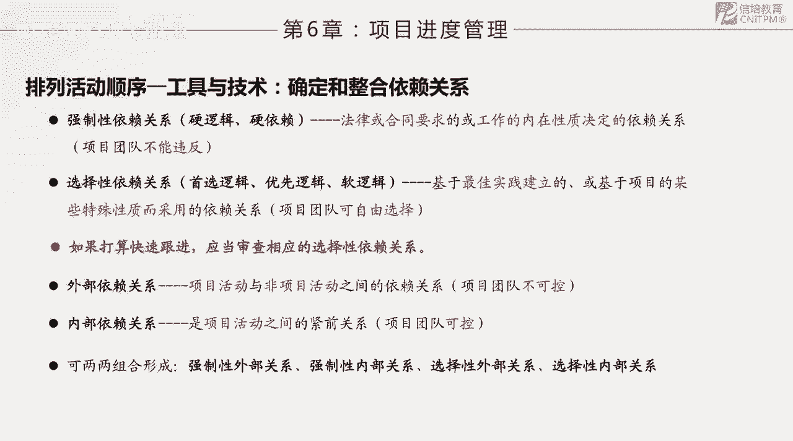
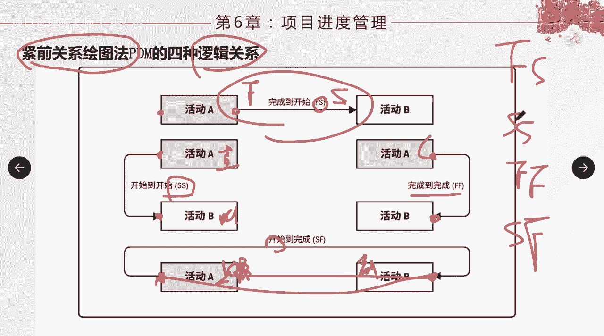
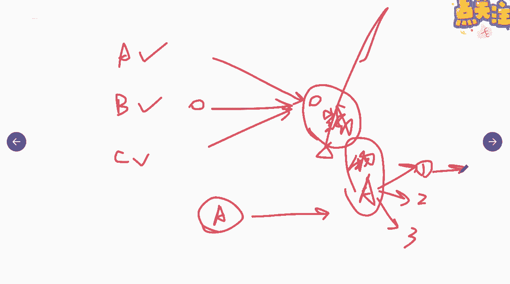

# 如何排列活动顺序（下） - P1 - 项目管理陈老师 - BV1DY411D77N

刚才我们说了活动顺序之间的几种关系啊，几种关系，这个呢是从他们的先后顺序逻辑上来确定，我们可以有四种的关系，那么这个呢也是我们颈前关系，绘图法的一个根据啊，只要我们知道了这几个活动或者活动。

活动之间的逻辑关系之后呢，我们就可以依据这个关系来划出这个p dm。

画出我们的建线图啊，那另外呢我们说活动排列顺序，还有一个工具跟技术呢叫确定和整合，依赖关系啊，依赖关系就是活动与活动之间，除了有这种先后的顺序之后之外呢，它其实还有一些依赖的关系啊。

这里面我们可以几个来来划分，一种呢叫强依赖关系，一种呢叫选择性依赖关系，什么叫强制性依赖关系呢，或者是强依赖关系呢，就是法律或合同要求，或工作内在性质决定的依赖关系啊，我们团队是没有办法去违反的。

比如说我们在工程项目里面，一定法律要求你一定要获得施工许可证，你才可以开始动工，那这个呢就是一个强制性依赖关系，培训机构，校外培训机构，你一定要取得办学许可证，你才能进行培训的工作啊。

这是叫做法律或者是规定要求的啊，你不能违反，还有呢有一些属于我们叫做什么呀，叫做事物的规律本身就是这样的，比如说你一定要盖好这个二楼，二楼的板倒好了，你才可以进行三楼的这个施工对吧。

这是这是属于自然规律嘛，直接跳过二层，盖三层不可能啊，所以这种呢就叫做硬性依赖啊，或者强制性依赖，硬依赖关系，硬逻辑关系，那还有呢一种是什么呢，选择性依赖关系啊，也叫优选逻辑或者软逻辑关系。

也叫软性的依赖关系，那么它基于呢最佳的实践，或者基于某些特殊性质而采用，团队可以自由选择，比如我刚才说的泡茶对吧，没有人规定说不不能先烧水，然后再同时去干其他的事啊，没有人规定啊。

这是我多年之后好多年的泡茶经验里面，我总结出来的，可以这么干啊，比较省时间啊，那当然是可以啊，这种就叫选择性依赖关系，选择性依赖关系，比如说啊我们还可以说用在工作当中啊对吧，比如说我们经过实践。

觉得说这个代码呢啊，也可以一边写一边来做一些测试，一天做一些检查，在施工过程当中呢啊我可以啊，等这个这个花圃，比如说绿化还没开始做，我可以先把这些树木啊，苗圃的这种草皮我先确定好，先预定好，先备着啊。

接下来马上可以开始对吧，这种就叫选择性依赖关系啊，那么如果大家注意看，这里有一句一个提示，如果打算快速跟进，快速跟进，我们后面会讲到它是一个进度压缩的一个方法，当出现了进度延迟的时候呢。

我们可以采取快速跟进来啊，争取攻击，那么如果你打算采取快速跟进呢，应当审查相应的选择性依赖关系，就这几个关系，它是可以并行的啊，快速跟进其实就是一种任务的并行啊，比如说我们说有几种情况啊。

写书写小说你可以采取什么方式啊，你可以整本书写完了你才去交付，去出版对吧，当然你也可以用并行的，一边写，我还没构思好，后面的构思我不知道，一边连载一边写，一边连载一边写，是不是，这就叫做并行啊。

所以这个要考虑清楚，他们之间应该是选择性依赖关系，那我们从内部和外部呢还可以划分成为什么呀，外部依赖关系跟内部依赖关系啊，然后呢，外部依赖关系就指的是项目和项目之外，项目活动与非项目活动之间的依赖关系。

团队是不可控的，受到外部的啊，内部依赖关系呢是活动项目之间的紧前关系啊，内部依赖关系，所以这两个有分内有分外，那么我们两两组合就可以形成什么，强制性外部关系，强制性内部关系。

选择性外部关系跟选择性内部关系啊，大家要理解，所以这个依赖关系啊，重点的是这种强制性跟选择性这两个概念，大家要清楚，要充分的理解就可以了啊，这部分也比较的简单，那么这里面还有一个我们在排列顺序的时候。

还要考虑到一个提前量跟滞后量的，这么一个概念，提前量跟之后量，他呢也是相对于紧前活动来说的啊，比如说a跟b两个活动是吧，那么假如这两个活动是什么呢，一个是什么呀，装修啊，房子另一个呢是搬家。

那么我们通常会说什么呀，比如说房子装修好了之后呢，我要给他空个几个月对吧，空个几个月，那么才来进行搬家，再搬进去是吧，那么这样也就是说相对于嗯b这个活动来说，a活动它又会有一个滞后量对吧。

你比如说空个三个月对吧，a完成了之后必须什么呀，a跟b是fs的关系是吧，装修完成我才能开始搬家，但是呢这中间我要空一段时间，咳咳才可以进行，所以呢我们就把它表述为fs什么加三fx加三。

对了这个就叫滞后量，那什么叫提前量呢，就相对于紧前活动啊，紧后活动可以提前的时间量，紧急活动可以提现，一样的也是这样的一个一个，例子啊，装修的例子，比如说这两个活动现在不叫做那个了。

不叫做装修跟搬家了啊，这两个叫做什么呢，我们可以把它叫呃，a活动啊，我们管它叫装修也还是一样啊，b活动呢叫买家具好不买家具，买家具，那我们说装修这个活动呢啊他跟他也是你要一，一般来说来说f装修完了。

你才开始买家具嘛，但是呢我们装修还没结束啊，在装修的后期啊，其实什么地板啊，什么东西都做好了，而买家具这个动作我可以提前做哦，比如说提前一个月或者提前多少天，我就可以把家具买了放进去。

那么这个我们就表示叫提前量，fs什么呀，我们可以减一或者是怎么样啊，所以这就叫提前量跟滞后量啊，又好比说嗯我们可以什么还有什么什么例子，可以说是说是提前的呢，比如我刚才说的工程项目是吧。

你在一边封顶的时候对吧，比如说你建花圃啊，建花圃买绿化是吧，你可以先把这个事情提到前面来做啊，那就相对来讲争取了相应的时间啊，那比如说还有一个叫我们说在一些领域里面，有一个工作呢叫写稿。

另一个呢叫什么呀，校对是吧，就校对，那么写稿按理说写完了我才能叫对吗，但是呢你这个写稿写一半的时候，我这个校对是不是可以就开始一边校对了，对不对，那这也是说相对于这个活动我可以提前啊。

比如说我这个写这个需要花两周啊，那你校对你可以提前，比如我写到了一定的程度，比如提前哎，就应该用剪啊，应该用剪，提前三天你就可以来校对了啊，那么滞后量也还有另外一个例子，比如说你这个做地板啊，铺了地板。

盗版完之后，完了之后要铺上瓷砖是吧，也是两个活动，那么你盗版结束之后，能不能马上进行铺瓷砖呢，不行啊，你要等它水泥干了之后才可以复制砖，所以呢下一个活动开始的时候，你可能还要再等个什么呀。

至少等个三天的时间啊，完了之后你才能进行b活动，所以这就叫滞后量啊，所以这两个概念大家要清楚一下，那么提前量和滞后量的使用呢，不能代替逻辑关系啊，活动持续时间的估算中呢，呃不包含任何的提前量跟滞后量。

你这个不要把它持续时间，比如这个活动啊啊你说装修我需要装修三个月，然后亮要亮三个月，你能说我装修这个活动要做六个月吗，不能这么算啊，你说这个工期需要六个月对吧，那可以啊，你中间连连量的时间算进去。

但是你不能说我装修这个活动干了六个月啊，那就不对了，他只干了三个月啊，好这个是提前量跟滞后量，另外呢我们最终要输出，在这个过程中要输出一个图，叫项目的网络进度图啊，或者叫进度网络图。

它里面显示了多个路径的汇聚，汇聚指的是很多个会在一起是吧，很多个会在一起汇聚成一个点，这叫有多个紧前活动的情况，还有一个呢叫路径的分支啊，分支啊，就比如说一个活动完了之后，他有多个什么呀，紧后活动。

这叫分支啊，那么带汇聚和分支的这种活动呢，受到多个活动的影响，能够影响，或者说能够影响多个活动，因此存在更大的风险啊，所以大家考虑，比如说我们举个简单的例子啊，举个简单例子。

我们这个几个小组啊要去参加一个活动啊，比如说慢跑活动，a组b组跟c组啊，我们一起去闯关是吧，最终呢我们要到达一个地方啊，从一个地方到达另外一个地方啊，然后呢活动的规则啊。

你们只有三组人马同时从这里到这里之后，你们的任务才算完成啊，这个活动，假如说这个活动是是是一个叫完成对吧，这个活动完成啊，完成取决于什么，取决于a组到了b组，到了c组也到了活动完成好。

那这个时候大家发现这个完成的或活动，是不是就不确定性比较多一点了啊，如果你说只是一对一啊，只是a到这边完成就可以了，我们就算完成大定之后，只要确定a没问题就行了。

但是a b c3 个必须同时你才能达到完成，那么说明你如a跟b做的很好，c做差了，那你这个活动完成的时间也就怎么样，也就会受到影响，就是汇聚，那分支也是一样啊，分支也是一样，比如说啊。

我们说这边必须等这个活动呢完了之后呢，我能接下去开三个活动啊，比如说这个活动是什么呀，运输我们的所有的物资啊，到这个点物资到位啊，这个活动完了之后呢，我同时分解一组二组三组啊，那好这个活动就很重要了。

物资假如没到位，接下来这三个活动同时没办法进行啊，活都活不下去了是吧，他们就没办法继续往下做其他的事情了。

所以这个叫做分支啊，在这种点上面通常就是什么呀，就会比较的有风险，会存在着更多的风险和这个也比较好理解啊。

