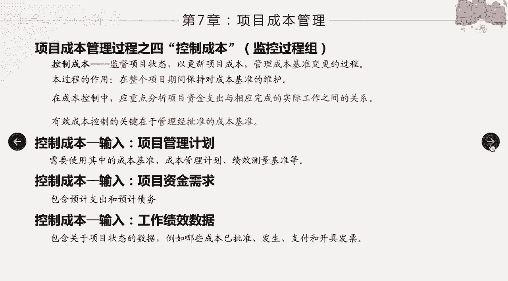
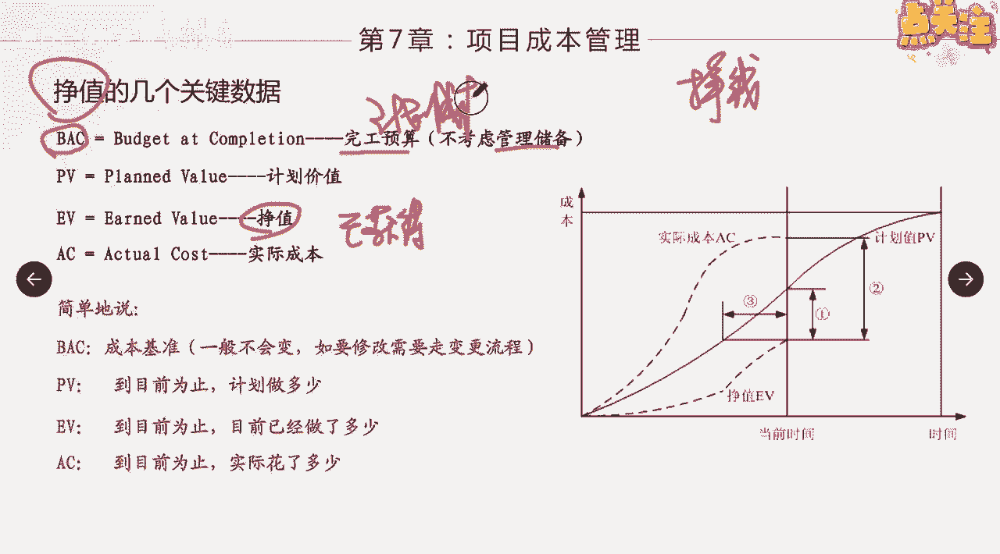

# 如何控制项目成本 - P1 - 项目管理陈老师 - BV1xT41197y9

好我们接下来来讲第四个过程啊，成本管理的第四个过程叫控制成本，控制成本它就属于监控过程组啊，属于监控过程组，那么我们说有了成本基准之后呢，我们等于就有了一把什么呀，衡量成本管理成本的尺子。

在控制成本这个过程当中，我们就是要拿着这把尺子去跟我们的实际绩效，成本的绩效去作为一个比对啊，看看有没有发生偏差啊，同时要对未来的一个绩效情况做出预测，所以大家学到这儿之后呢，可能就会有一点感觉对吧。

在监控过程中，在控制这个阶段呢，一定是做两件事情啊，第一件事情就是什么呀，就是监督，对吧，监督监督用的就是什么呢，用基准去跟实际绩效进行比对，对吧啊，然后呢发现了偏差，这个就叫做纠偏嗯，纠偏。

另外一个呢我们要利用这个技，对绩效的一个监督啊，我们要对未来进行一个预测，预测对吧，然后呢这是第一件事啊，第一件事涉及到纠偏的预测，第二件事呢，所谓的控制呢就是管理里面可能产生的什么呀，变更对吧。

对它的一个最新情况，我们要进行变更的一个控制，所以控制成本呢就是监督项目状态，已更新项目的成本管理，成本基准变更的这么一个过程，它的作用就是在整个过程当中呢，保持对成本基准的维护啊。

不要轻易的去破坏成本的基准啊，当然需要变更的时候，我们要对这个基准进行一个变更，在成本控制中，应重点分析资金支出与完成相应工作，之间的关系，这个也就是等一下我们要讲到的，增值管理的核心啊。

我们花了这个钱是不是完成了相应实际的工作，这个其实是最重要的，对吧啊，我们完头花了这个钱，如果完成了相应的工作，那说明我们的项目还是属于一个什么呀，正常的健康的一个状态，假如你资金支出很大。

但是呢花了钱又没事又没做，那这个说明项目就存在很大的问题了，所以我们要重点来看看，我们花了这个钱，是不是完成了相应的实际工作啊，这个是我们在成本控制当中，需要去把握的一个点啊。

那么有效控制成本的关键在于管理，经批准的成本基准啊，也就是说你如果说你不对成本基准进行一个，维护跟控制啊，需要加钱就加钱，需要用钱就用钱，需要增加就增加，那么你最终呢。

你的成本是得不到有效的一个控制的啊，有效的控制的他的输出输出，我们来看一下输入项目管理计划是吧，包含成本基准，成本管理计划，绩效测量基准等输入资金需求啊，包含我们的什么呀，预计的债务。

这是上一个过程的啊，上一个过程的输出是不是输出啊，而输出要进入这个过程的一个输出了，我们都需要数据或者另换另外一句话，在执行过程组当中产生的数据，我们都要放到监控过程组来进行一个什么呀。

统一的一个监控啊，包含了什么呀，项目状态的数据，哪些成本已经批准发生支付啊，或者是包含着哪些工作已经完成，哪些工作已经结束等等等等，这些都叫工作绩效数据啊，我们都要用到这个过程作为输入。

那么接下来我们就来讲这个项目成本管理里面，应该说最重要的一个工具啊，也可以说最重要的一个知识点啊，就叫做EVM正直正直正直的一个分析啊，政治的一个管理，首先这个正啊啊，我们可以管它叫什么呢。

管他叫我们先说挣钱，对不对，挣钱的意思是什么，赢得获得的一个意思，那么这里面说正值呢，大家看他的英文ERLAND啊，earned就是已获得的啊，已获得我们已经获得的这些价值，我们管它叫政治啊。

那么跟正直有相关的几个概念，大家一定要手机，首先第一个叫BACBAC啊，它代表了完工预算，也就是不考虑管理储备，我们可以管它这个东西叫什么呀，叫什么呀，计划成本啊，计划成本也叫完工预算，BACBAC啊。

就是我们整个整个过整个项目下来，需要的花多少钱，实际上是一个累计的一个过程，所以大家看这张图里面的这条线，它其实就是什么，就是BAC，那么我们知道我们的这个成本基准，它不但是一个汇总的数值。

它还分配到了什么呀，每一个点对吧，每一个点需要哎计划花费的价值，花费的这种资金，所以这个计划花费的计划需要产生的就叫做PV，叫计划价值啊，计划价值它是对应的是一个一个的点，BAC是整条汇总的曲线。

PV代表的是这一个一个的点，所有的PV，每一个点的PV汇总起来就得到了我们的什么呀，BAC啊，这是点和线的关系啊，这两者之间的一个关系啊，大家要明白，接下来就是EV，EV就是我们所谓的争执政治啊。

那么还有一个叫AC啊，AC就是实际的成本，我实际花费了多少钱，我计划花费多少钱，跟实际花多少钱不一样，比如我今天上街，我计划花100块钱，但是实际我只花了50块，唉，这就是PV跟AC和之间的一个差别。

那么简单来说呢，BAC就是成本基准了，一般不会变对吧，PV是到目前为止计划要做多少，EV指的是到目前为止已经做了多少，AC指的是到目前为止实际花了多少，所以从这个角度上来看。

大家明确正值他考察的是什么呀，它考察的是在项目的某个时间点，一定是这样的啊，时间点它并不是考察项目的整个的过程，它是在项目的某一个时间点找一个点，然后呢在这个点上面来看看我项目的绩效。

通过这个时间点的PVEV和AC这三个项目绩效，来看看项目目前所处的一个状态啊，这个是正值的核心啊，它并不是一个动态的考量，他只单纯针对某一个点啊，这个点可以是任意的啊，当然我们在实际过程当中呢。

可能说每周或者每半个月，每个月每季度都可以啊，你可以找一个点，然后呢来在这个点上面去考察PVEV跟AC，通过这三个数值，我们就能够来看出项目当前的进度，以及它的成本的一个状况是怎么样的。

那这个就是正直的一个最有用的一个价值啊。