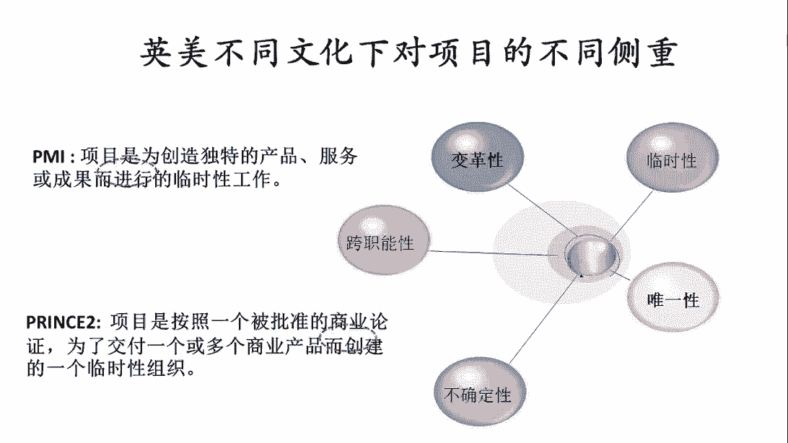
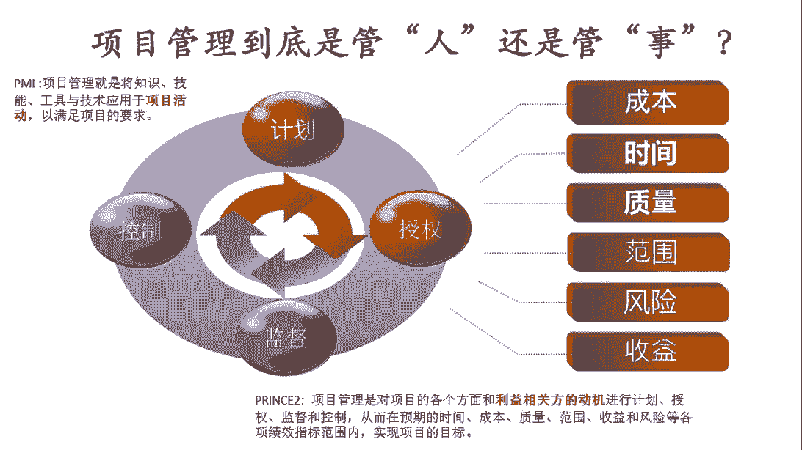

# 如何整合PMP和PRINCE2各自的核心价值,建立属于自己的项目管理实战套路！ - P3：3.项目管理到底是管“事”还是管“人”？ - 清晖在线学堂Kimi老师 - BV1Uy4y1Q7PJ

那这种事到底应该怎么管呢，其实这就是项目管理所解决的问题，所以这时候呢我们可以再次一次去对比一下，这个不同的两大流派，那p m美国的p m和英国的prinsu，他们对于项目管理的理解和侧重。

到底有什么不一样，p y呢我们说更多的从知识体系的角度来说，那它有这样的一个定义，那它的定义是说呢，项目管理就是将知识技能，工具与技术应用于项目活动，以满足项目要求，那这个定义呢其实是一个非常精准啊。

而且非常科学，非常无懈可击的定义，那他其实讲得很对，说项目管理呢其实就是为了满足项目的要求，所以呢我们要去学会将不同的项目管理的知识，技能工具技术，那去应用到我们的项目管理的活动中。

来帮助我们把项目管得更好，那所以这个呢，其实是美国人对项目管理的一个定义，那它更加的侧重，于是说项目管理的本质的活动是什么，他他的目的呢，其实是为了解决应用项目工具技术的问题。

那接下来我们再去看看英国的prince，英国的free素呢，在这里边我们会看到呢他有这样一个定义，项目管理是对项目的各个方面，和利益相关方的动机进行计划授权，监督和控制，从而在预期的时间成本质量范围。

收益和风险等各项绩效指标范围内，实现项目的目标，所以这时候我们看到了这个定义啊，看起来就感觉好像侧重点跟偏外的定义，会不太一样，py的定义呢更多的强调的是这个工作啊，这个工作在开展过程中。

我们如何借力于知识技能工具技术，而英国的这个定义呢会看到的，他其实明显谈的是说其实如何让这件事受控，而且这种受控是基于什么呢，是基于让干这件事的这群人受控，是因为在英国的定义中，我们还记得刚刚有提到。

其实在英国的项目管理中，我们更多的把项目看成是一个组织，看成是一个组织行为学的事情，换句话说，项目管理的侧重呢在于如何把这群人组织好，让这群人受控，所以在英国项目管理的过程中呢，我们通常会认为是说。

如果缺少了一个项目的受控环境，其实我们在我的项目再好的项目计划，再好的目标是实现不了的，所以呢英国的项目管理侧重打造一个，让项目中的各地相关方受控的组织环境，所以这时候我们会看到，从英国的项目管理来看。

项目本质上是一个组织保障形式，那在这样的一个定义之下，项目管理到底是干什么的，我们看到其实项目管理是干三件事情，第一件事呢是要识别项目的各个方面，和利益相关方的动机，换句话说得把这个事儿跟哪些人有关系。

先把人找出来，光把人找出来还不还不够，我们要把这帮人做分类，分成不同的利益相关方，而且我们还要去思考这些不同的利益相关方，他对我们这个项目的关注点到底是什么，动机是什么。

所以呢我会把英国的项目管理一上来，就从思考人开始，接下来第二步要做的是什么呢，进行计划授权监督和控制，这个计划授权监督和控制是干什么的，那我自己的习惯呢是把它定义成是，这其实是一个搭台子的事。

什么是搭台子呢，搭台子的概念就是说其实我们的目标呢，为了让这帮人能够受控，我必须要给他们建个舞台啊，这一大堆不同的利益相关方，然后呢我们要让他在我们的范围之内，按照我们的一个既有的秩序和要求。

所以这时候呢我们就要构建一个受控的平台，这个受控的平台如何去构建呢，第一我们要做计划，那计划呢其实是大家开展工作的依据啊，所以呢这时候每个人都知道，我们这个工作应该如何开展，然后找到自己的位置。

第二件事我们要做的叫授权，授权授权的是什么呢，让每个人明确自己的定位，自己的角色，自己的职责，知道自己和其他人之间的关系，自己什么事能干，什么事不能干，那这件事呢其实叫授权啊。

第三件事呢我们说呢光把活儿分了，把人的角色职责分了还不够，为了让这个过程受控，我们还得建立监督机制，因为在英国的项目管理过程中呢，它有一个假设，这个假设是说呢，呃所有的人在没有监督的情况下。

可能都不一定会按照自己的承诺去开展工作，也意味着什么呢，在英国的文化之下，其实是一个谁也信不过的文化，那首先呢我们本着人性本恶，就这个逻辑，我们假设所有的人可能都不守规矩，所以这时候呢我们得确保是说。

我们所建立的项目管理方法，是每个人可能都不守规矩的情况下，我们也能让这个环境受控，让这个过程受控的一种项目管理方法，所以从这一点上我们会看到，它跟pm的要求就会不太一样，当我们在学习拼bug的时候呢。

它有一个假设，他其实假设的是呢，每个人都有崇高的职业道德，都会从大局着想，然后都会去守规矩，所以在这种情况下呢，我们会发现，在这种这种环境其实是一种理想的环境，其实从本质上来说呢。

嗯在实际的工作跟生活过程中，其实是不可能遇到的，但是这样的他其实反而在学习的时候，会比较容易属于你剥离了各种复杂的场景，那首先呢把项目管理的，这个既有自己的逻辑讲清楚，但英国的项目管理呢。

他一上来假设的就是说所有人都不守规矩，所以这种我们会发现，其实英国的项目管理，它其实比这个p y的项目管理它要更深，他呢其实呢他走到了应用的这个层面，所以这时候呢。

因为所有的实际在使用的场景都是不理想的，在理论的层面，所有的事都是理想的，但是在所有实际应用的场景下，所有的事都是不理想的，那不理想的环境其实造成的主要因素就是，因为不同的人有不同的想法。

然后每个人可能会按照自己的意志和行为，去开展工作，所以这时候就会造成各种不受控的环境，这个情况出现，所以为了解决这个问题呢，我们就必须要去建立监督和控制机制，监督和控制机制，它所要解决的问题是说。

当有人想不守规矩的时候，我们要通过我们的组织保障机制，得让他守规矩，换句话说你要去说，你要想着守规矩，首先得能够去监督到他不守规矩的行为，这个叫监督，这样你还能去纠正他的行为，这叫控制。

所以呢这个我们会发现呢，在英国的项目管理中的第二步，搭建这个受控的项目平台的时候，这时候呢我们所依据的主要的方式呢，其实是构建一个大家都需要遵循的，和达成共识的计划，然后呢构建一个科学的组织结构。

为大家分配各自的角色职责，和自己的授权的范围，构建一个呢项目组织的监督机制，保证所有的人，如果有不当的行为能够被发现之后呢，要建立一个控制机制，如果有人做的不对的话，那我们有一种方式来进行评判。

那和进行纠正，这是我们项目管理的第二部，第三步是什么呢，第三步是说为了保证这个项目的过程，我们能够去很好的能够去看到项目的进展，和明确我们的方向，包括过程中能够持续改进，提升绩效，那这样的话呢。

我们就要在项目中去建立绩效评价的机制，所以呢既然要既要评价的项目中，就要有评价指标，那这个项目管理的评价指标，主要是从六个方面来的，这几个方面主要指的是项目管理的评价指标。

并不是说项目中的一些技术工作和业务，工作的评价指标，所以这时候我们会看到另外一件事情，其实一个项目中的工作，它不仅仅是由项目管理的工作，他还有很多具体的技术和业务的工作，那具体的技术和业务的工作。

还有他们各自的评价指标，那项目管理工作有项目管理的评价指标，项目管理的评价指标，主要评价的是项目管理的工作做得好不好，它并不是评价，是说项目中的技术和业务的工作做的好不好。

所以项目管理的评价指标都有什么呢，我们看到这里有成本，时间质量范围，风险和收益，所以这时候我们会看到呢，其实项目管理管的好不好，我们主要看的是什么呢，第一我们的成本，是不是跟我们预期的目标相符合。

然后我们项目的实际开展过程的时间，是不是跟我们最开始的目标相符合，那我们项目的这个实际交付的质量，是不是跟我们最开始的预期相符合，那项目的这个工作范围和交付的数量，是不是跟我们最开始的预期相符合。

这叫范围，然后项目过程中是不是不确定性的东西，我们提前都识别出来了，而且做好了应对措施，这就说明我们的风险管的好不好，在我说这个项目最后成果转化了之后，是不是真的所实现的收益是我们预期的收益。

那所实现的预期收益的数量，是不是跟预期最开始的目标是一致的，那这时候来评判我们项目管理的收益，这块管的好不好，所以这里边呢又会涉及到另外一个问题，我们说项目管理好不好，其实通常情况下呢。

我们一般会评价两方面，第一条目标符合性，目标复合性的概念呢是我们立项的时候，那我们所确定的目标，跟我们最后所实现的是一样的，偏差小，这通常是一个重要的评价方式，第二呢我们说现在的项目管理的发展呢。

越来越发展的方向是说，不仅仅关注的是三重约束，那所谓项目管理经典的三重约束，就是我们说的时间范围成本，那其实很多的时候呢，项目管理如果单看三重约束呢是不够的，很多时候我们还得考虑。

另外一个就是我们所说的收益的问题，所以通常呢我们会判断是说，如果一个项目管得好，它不仅仅是说三重约束的指标达到了时间范围，成本都跟我们的目标没有什么偏离，更重要的是说它扩大项目本身的收益。

因为项目呢其实本质上是一种投资行为，投资的目的呢当然一定是说投入越少，收益越多，这样的话投入产出比越合算，这时候我们叫性价比好，所以呢如果站在投资角度去看项目的话，我们一定会希望是做项目的。

商业化程度越高越好，收益越大越好，所以这个呢这个定义项目中的评价指标，那当然这里面又会包括过程的评价指标，和最终的评价指标，那这个呢其实是项目管理的第三个重要的事情，那如果我们把前前三个事情都做好了。

这前三个事情，一个是把项目的各个利益相关方找出来，那我们要去衡量他们的动机，之后呢，我们要给这帮相关方搭一个受控的平台，计划收权监督控制，然后呢，我们要给项目定义，过程指标和结果性的评价指标。

这样呢我们才能够更好的去衡量项目的绩效，当我们把这三件事做完了之后，我们才有可能去实现项目的目标，所以这时候呢这三件事是什么时候做呢，他其实应该是在项目实施启动之前做，所以这时候我们也会看到的。

其实英国的项目管理，它更加侧重的是说，把项目管理的重头戏，其实是放在项目的计划阶段和启动阶段，它并不是放在项目的实施阶段，再换句话说呢，其实英国的项目管理侧重在项目实施之前，先搭好一个受控的平台。

做好布局，给大家分工分好，这样的话呢，整个项目的实施过程才比较容易受控，目标才比较容易实现，所以这种我们可以看到，其实项目管理其实并不是重在，在实施过程中的救火。

