# 如何整合PMP和PRINCE2各自的核心价值,建立属于自己的项目管理实战套路！ - P1：1.世界三大项目管理流派 - 清晖在线学堂Kimi老师 - BV1Uy4y1Q7PJ

变首先呢先给大家介绍一下呢。

这个世界上三个大的项目管理流派，其实呢这个项目管理发展至今，已经有了70多年的历史，那从194几年，最开始呢。

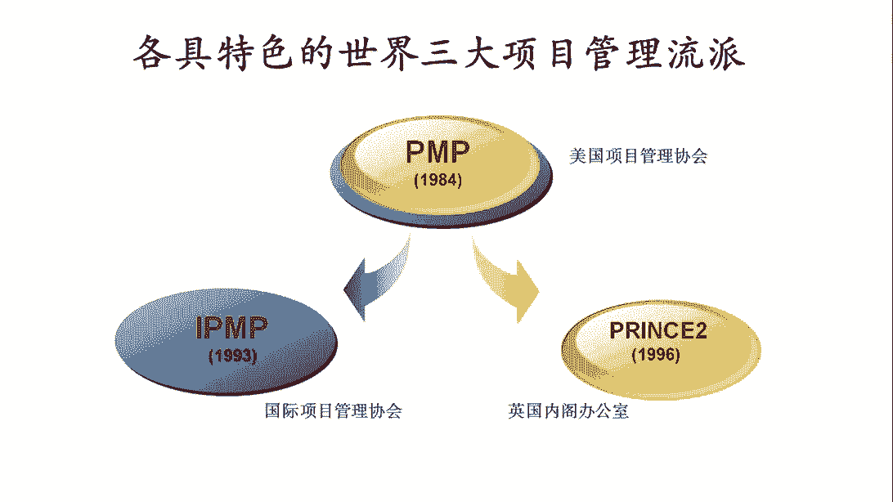

美国为了把原子弹抢先比德国发明出来，那为了去解决。

如何让一个非常庞大的那项目管理团队，项目团队，那一个拥有十几万人的项目团队，一个拥有20几名，世界顶尖的诺贝尔奖获得者的这样的一个团队。

能够在非常短的时间之内啊形成突破。

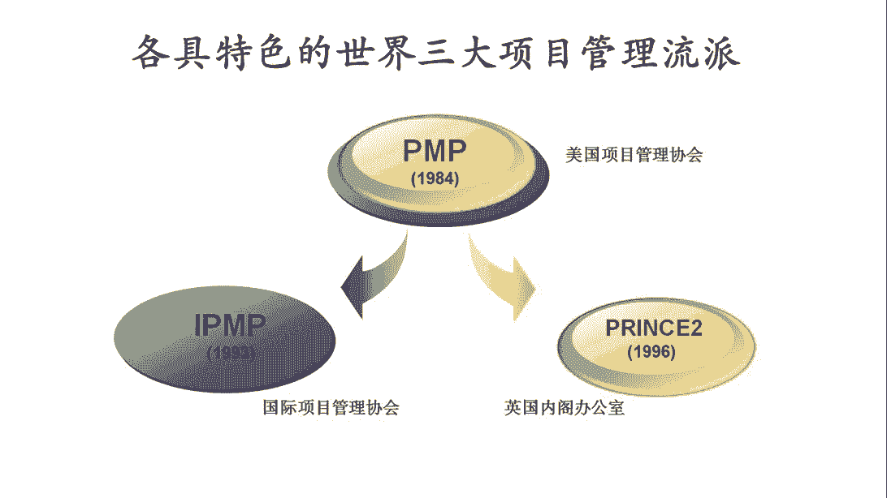

然后呢，把这个非常有挑战性的原子弹抢先造出来。

因此呢采用了一种创新的管理方法。

那这种管理方法呢，就是我们所说的项目管理方法。

所以呢从这里我们会看到呢，其实项目管理从一开始他的发明出来，那首先就是为了组织一群人。

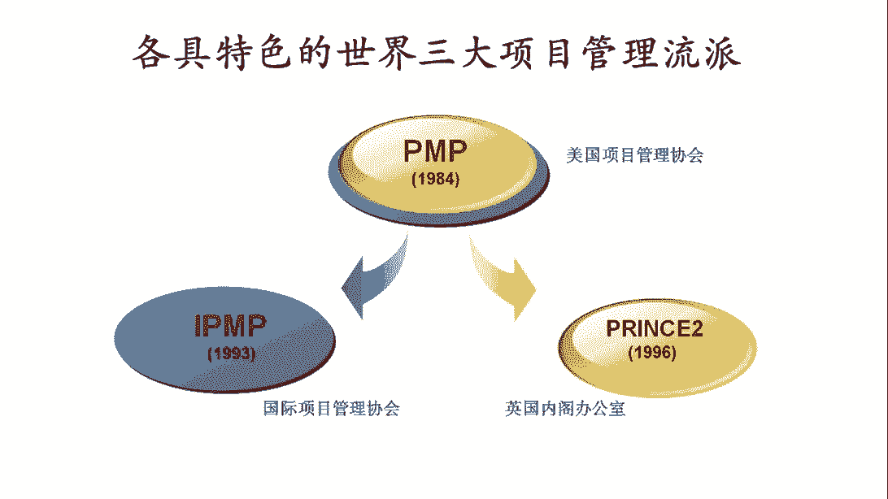

共同去干一个非常非常有挑战性的事情。

而且呢这件事呢很创新啊，跨界的人很多，在这种情况下呢。

其实人员组织会是非常有挑战的，那为了去解决这个在很短的时间之内，把一群人组织起来，去干一个相同目标，但大家可能又不是特别熟悉的事情。

而产生的这种管理方法，那就是被我们所说的项目管理的方法。

所以我们看到的项目管理的发展，至今有70多年。

那这70多年呢里面呢，其实产生了很多的不同的思想和流派。

当然了，这里面最值得一提的，首先就是美国项目管理协会，美国项目管理协会呢今年刚好是50周年庆典。

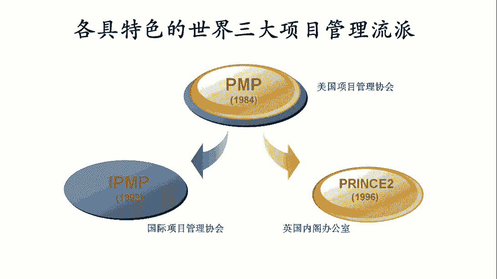

那美国项目管理协会py成立了50年。

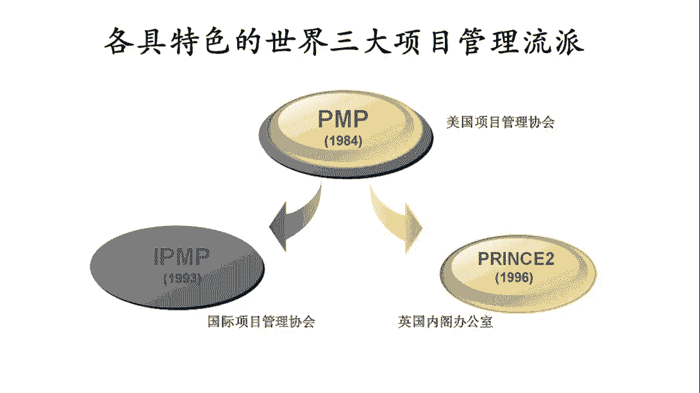

那50年前的时候。

那其实因为pmi的成立，其实呢在项目管理的发展史上。

是一个非常重要的里程碑事件，是因为正因为有了pm，其实我们才有机会看到。

其实项目管理现在变成了一个专业领域，一种专业方法，甚至是一个学科，是因为pm是第一次把所有跟项目管理相关的，知识工具方法整合成了一套框架，这个时候呢。

其实才真正的由原来的一些最佳实践工具技术。

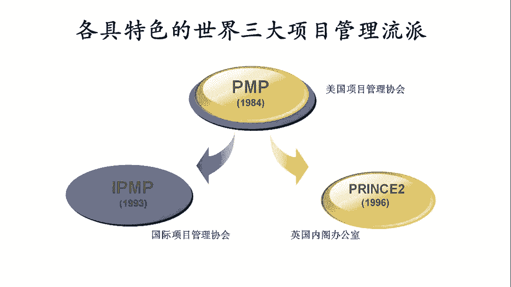

那整合成了一套体系化的管理模式，所以呢p m呢一直以来。

其实都是这个在整个项目管理行业中，影响力最大，贡献最大的这样的一个组织，其实包括现在我们看到的。

各种项目管理的方法和流派，其实从根源上都是基于p m y的pinbox啊。

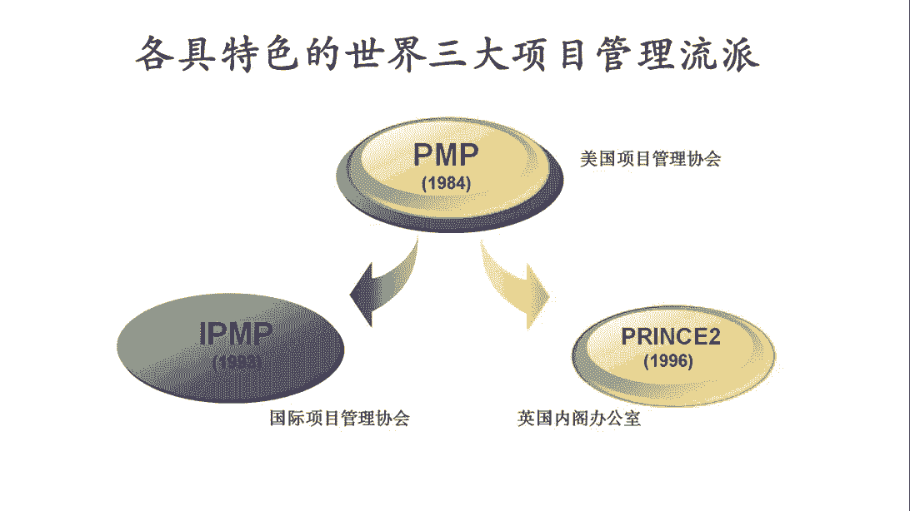

而衍生出来的各种不同的项目管理的演变。

其实根源上都会来源于p m，那pmi有一个非常重要的证书。

就是我们大家非常熟悉的p m p，项目管理这个职业资格证书啊。

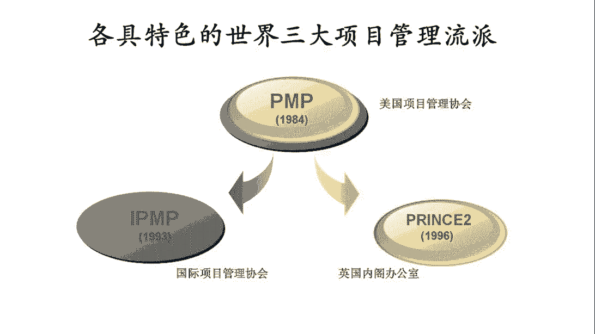

project management of body of knowledge，就是我们说的pinbox。

那他的资质呢p m p就是project management professional。

那这个资格呢，其实一直以来是所有从事项目管理职业的人，那最开始首先都会先从考取p m p开始。

那后面我们也会去介绍。

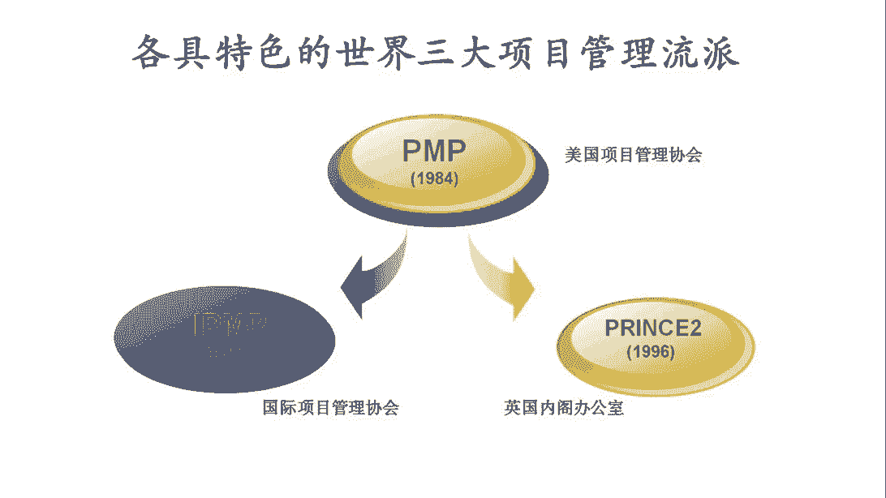

其实通常我们会认为是说呢，p m p其实更多的其实像是职业化，项目经理的一个入门级的证书，那当我们考取了p m p之后，其实也意味着是说呢，我们走上项目管理，这种职业发展道路的起点产生了。

所以它其实是跨入职业化项目管理的一个大门。

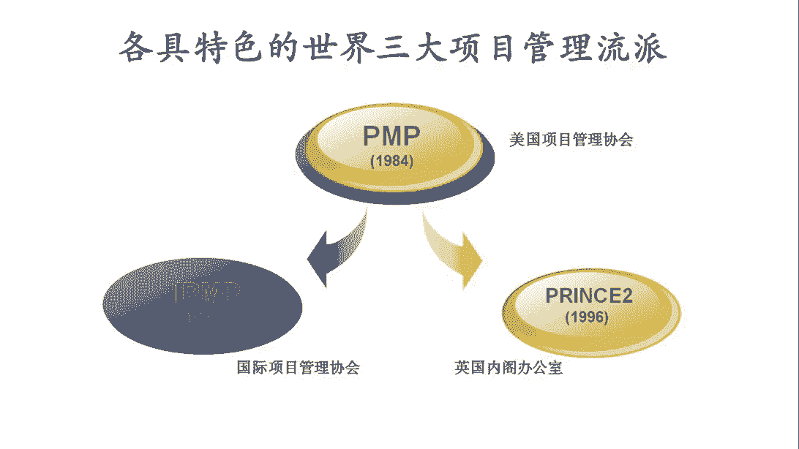

那在这里边呢另外的一个比较大的流派，就是我们所说的这个i p m p。

其实i p m p它也是个资质，他背后有一个非常著名的协会，叫国际项目管理协会来填v。

那i p m呢，其实它是这个整个项目管理发展史上。

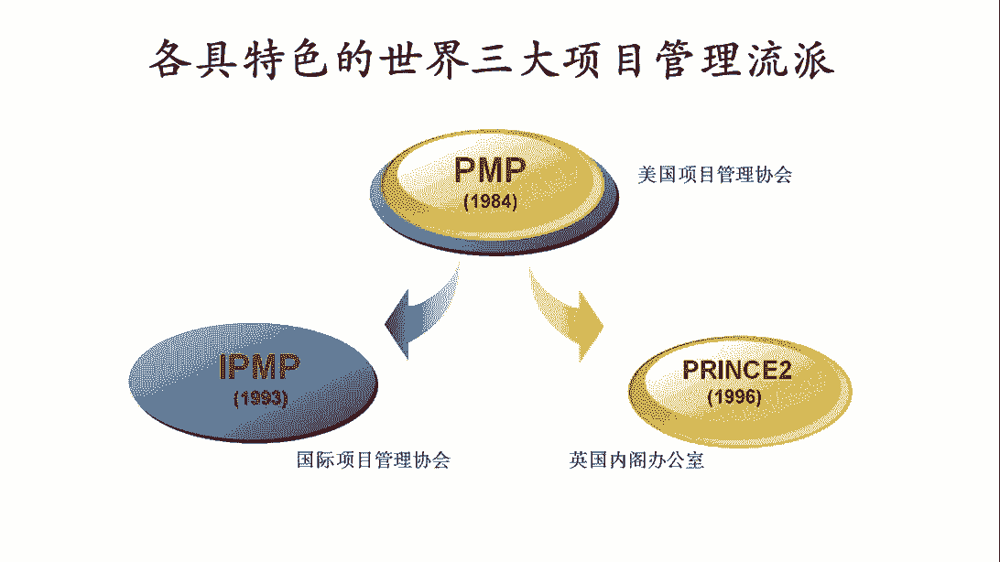

第一个的成立的专业的项目管理协会，那虽然它不是第一个形成项目管理方法的。

但是他确实是第一个把项目管理做一个专业。

协会组织而形成的组织，i p a呢，它的侧重呢不是在于项目管理的系统化。

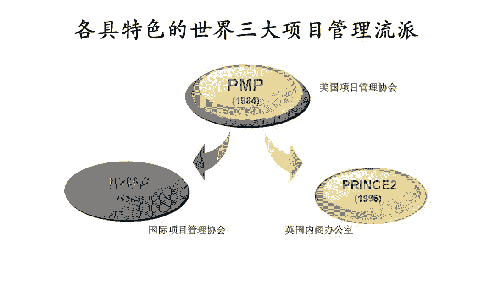

知识框架和体系，i p m呢。

他其实擅长的是这个项目经理跟项目管理，组织的这种能力的分级和评定。

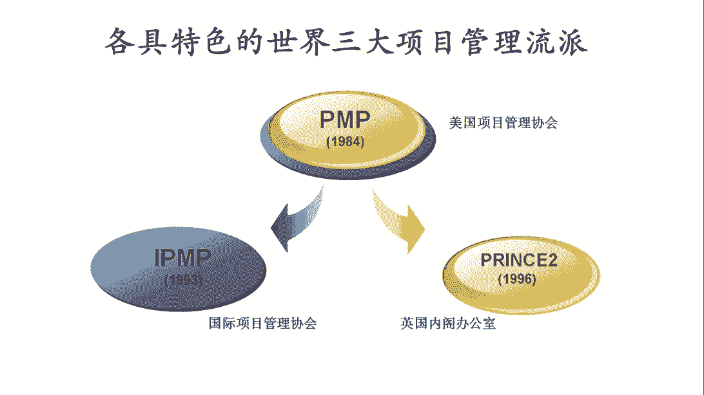

所以呢这个i p m呢一直以来呢，它有一个非常著名的一个评奖。

就是项目管理的这个卓越绩效大奖，那其实呢每年他们都会在全球的范围之内。

通过这些大奖去评定，哪些企业的项目管理工作做得好啊。

然后可以给他们分级，i p v呢也有著名的这个分级模型，那我们就是我们说的i c b o c b，那现在呢a c b出到了四点，这是一个项目经理的能力分析模型。

o cb呢是组织的项目管理能力分析模型。

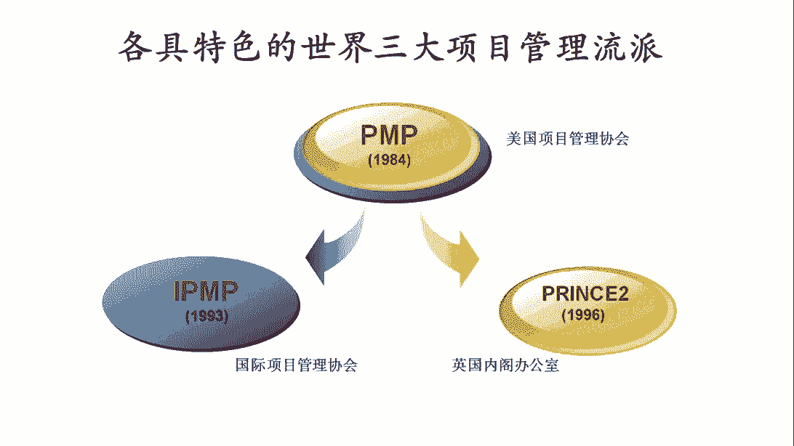

在这里边的第三个大的流派呢，也是一个非常特别的流派。

也就是我们通常提到的prince p preview呢。

后边也会去介绍，但这是一个来源于英国的，那项目管理的资质认证。

那而且呢它是属于英国的英国内阁办公室的。

被其他的部门给合并了。

然后呢，这个这个专业方法论不是做这个方法论的，所有权就归属了英国那个办公室。

所以呢他是一个真正的英国官方的方法论。

它也是各大流派中唯一一个，其实由政府组织打造出来的项目管理的方法论。

那事实上呢其实在英国以及所有的英联邦国家。

那这个凡是政府类的跟重要类的项目，他其实必须是强制的，按照presume的这种方法来进行执行的。

再换句话说呢，其实它也是一种典型的英国项目管理的。

最佳实践和强制要求，所以呢它自身的也非常有特点。

所以也形成了一个大的流派，那其实呢目前的时候呢。

其实这三个证书p m p p m p和prince，那他们的这个持证人员的数量。

那在全球的范围之内，其实是占了绝大多数。

那目前看起来呢p m p和prince的证书是最多的，那基本上也是世界上两个最大的主流的。

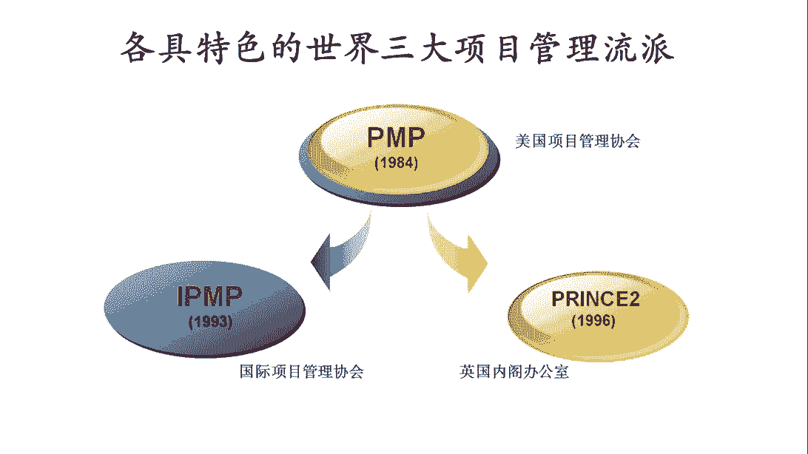