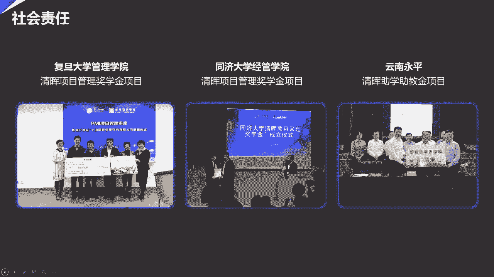

# 如何整合PMP和PRINCE2各自的核心价值,建立属于自己的项目管理实战套路！ - P10：人人皆是项目经理 - 清晖在线学堂Kimi老师 - BV1Uy4y1Q7PJ

啊啊。

啊啊啊啊啊。

啊啊啊，啊啊啊。

啊啊啊啊。

啊啊啊啊。

啧啧啧。

好各位同学啊，我们先来做一下测试，大家能不能看到ppt，能不能听到我的说话的声音，如果可以的话呢，请大家在那个留言区讨论区打一个111，三个幺看一看，好啊，我看到有人已经打111了，应该没有问题了啊。

那么我们呢就开始今天的我们的一个呃，大家的一个交流吧，我们来交流一下，就是我们现在这个呃就是越来越多，大家关心的啊一个管理就是呃项目管理啊，以及呢呃项目管理对于我们项目经理来说。

它是一个什么样的一个嗯模式啊，然后的话呢我经常会说项目管理呢，它是人人都是可以做项目经理的，我们今天呢主要就是来探讨一下这个问题，那首先介绍一下我自己啊，本人姓张，弓长张啊，叫张三文。

大家了解一下就可以了，我呢做了十多年的项目经理啊，做了10年的项目经理，然后呢做了8年的pmo的，从筹建到建设到管理啊这样的一个工作，然后呢至今为止呢也做了嗯，就是在做pm期间。

我就开始一边呢嗯做日常的项目管理的，项目治理啊，po是一个项目治理，然后的话呢呃同时呢也进行了，就是呃授课的这个活动，所以呢我大概也做了，有前前后后有做了10年的啊，职业讲师。

是专门的去宣传项目管理和项目管理的，这种文化的啊，你要简单的介绍一下，如果以后有兴趣的话呢，也是可以来听听我的一些实战的课程啊，听听我的一些沙盘的课程啊，大家可以来了解一下。

那么我们呢就今天进入我们的主题啊，大家呢如果有什么疑问呢，也可以在互动区啊跟我留言，因为我们这块儿呢啊就是可以互动一下啊，好那么我们就开始了啊，那么首先的话我们来看一看，今天我们在座各位来听。

今天讲的这个宣传的时候呢，到底是为了什么的，有的人呢他说我可能不是做的项目经理，但是的话呢我想做，我想知道我未来能做什么，我想做一些职业上的瓶颈的突破，寻找新的发展，可不可以呢，可以，项目经理呢。

是一个人人都可以去做的一个职业啊，每一个人在的业的生涯中呢，都可以去做一些项目啊，做一些项目呢进行一些项目管理，但是项目管理呢它是一种职业，但他有他自己独特的一套规则啊，在我们的企业当中呢。

它有它独有的应用和它应用的价值啊，所以的话呢我们可以去学习这一套方法，让大家未来呢突破我们职业瓶颈的一个发展，在我们的未来啊，啊项目管理呢，它将会是一个啊我们需要职场上的人，需要掌握的一个基本技能。

而不是一个专业技能，也就是我们每一个人，它其实都应该你知道项目管理，它到底有什么作用，能够干什么，我们每一个人，如果都能够具备项目管理的思维模式去干活，即使你不是做的项目，你做的是一个普普通通的事情。

如果你带着项目的思维去做事情，也会做得又快又好，所以呢它会对我们未来的职业的发展带来帮助，那么有的人说我不是项目经理，但是我希望有一个好的方法，能够帮我们把事情做得又快又好，项目经理啊。

就是项目这个东西，你认为他是项目，它就是一个项目，但是呢如果是一个任务，一个事件能不能用项目管理的方式来做呢，是可以的，本人在做项目管理做了那么多年啊，所以我已经带着一个项目管理的思维，在做事情了啊。

我如果有谁请我来做一个工作的话呢，我一般会这样问他啊，我说哎呃，别人想让我帮忙做一件任务或做一件事情，不一定是一个项目，那么我会带着项目的思维去问他，我说你做这件事，你的目的是什么呀。

啊如果你要做好这件事，你大概什么时间想要啊，你这个事情你大概要做成什么样子呀，其实整个我刚才讲的这个东西，其实都跟项目管理有关，他是项目管理师，课知识领域当中涉及的一些领域。

但是我们在做任何任务的时候呢，都可以带着这个思路去跟人家交流，达成共识，最后能够把一些任务事情更快更好地做好，这也是一个非常有用的东西，那么最主要的我说很多在座的各位啊，我想问一问在座各位。

你们在座的人当中，有没有人现在就是做项目经理的啊，如果有的话，那我相信你们一定是带着很多的困惑啊，来听项目管理的，很多人都想知道项目管理到底能帮我做到什么，在项目管理的过程当中呢，遇到了很多的问题问题。

比如说进度延期了，我应该怎么办，遇到了大量的变更，我应该怎么办，客户反反复复的告诉我，这个东西我觉得做的还可以，但是呢呃我觉得你还有改进的空间，所以此时不愿意给你验收，是不是很多人就带有这样的一些疑惑。

就觉得项目管理呢，确实是不是一件特别好做的事情，所以我们今天呢在后面就开始剖析一下，我们的项目管理到底是一个什么东西，项目它到底是一个东西，我们可以呢带着这个问题一起来看一看。

项目管理的整个体系和学习好了，顺便想问一下在座各位啊，你们的有谁现在正在做项目，如果是在正在做项目的话，那就给我打一个六啊，让我看一看，我们在座各位有多少人是真正做项目的，有吗。

我们在这儿有多少是已经在做项目的，如果有的话呢，就给我打一个六啊，我可以看一下大家有多少人呢啊，是已经在做项目的，我们这一位是哎呀，好多啊都是同事啊啊我是呃以前也是做项目的。

做了10年的企业的咨询的一些项目啊，到落地啊，所以呢我和软件行业也是非常有关的，那么大家有很多人都是做项目的，肯定抱有很多的嗯想法，那么我们就来看一看，首先我们来看一看什么是项目。

项目呢是我们有一句话叫一切皆项目，我们造一个大桥，它是一个项目，我们开一个会议，那也是一个项目，我们做软件研发，它也是一个项目，其实你们可以不用想象的那么多，我们可以认为一个普通的工作当中的。

生活中也可以是项目，比如说结婚，结婚就是可以当一个项目做的，我至今为止保留着结婚的w b s啊，结婚呢他从一开始结婚前的筹备，到结婚的前一天到结婚的当天到结婚之后的啊，我们都有一个w b s。

所以的话结婚也可以当一个项目，然后我们的装修也可以当一个项目，旅游也可以当一个项目啊，我有的时候呢就忽悠我的儿子啊，因为我儿子年纪也比较大了啊，已经高中了啊，马上要考大学啊，我跟他说啊，我们要出去旅游。

比如说我跟他说去年的过年，我说我们要去哈尔滨旅游呃，呃老妈呢有五天的假期，几月几号到几月几号啊，在这个时间阶段里，我们一家三口费用呢是25000块钱，然后的话你来安排行程，其实这也叫项目管理。

所以大家都知道项目是由你来确定的，由你来决定使用和实施的，然后呢人人都可以做项目经理，我儿子呢就很起劲，他就去研究说啊，我的第一我在来回的机票应该是怎么样啊，我的第一天的行程在哪，我应该住在哪里啊。

我的冰雪大世界什么时候去啊，等等等等，他就帮你合理的去安排一下，所以这种东西都是项目啊，我们说一切皆项目，那么到底是什么是项目管理，什么是项目呢，我呢今天推荐的呢是我们美国的p m i组织。

去推提供的一套项目管理的体系，其实呢在整项目管理，项目和项目管理，它是一个舶来品，它不是一个啊我们中国人创造的，它是一个外国呃，国外舶来的一个产品，那么在这个世界上，市面上的现在比较流行的两套体系。

一套呢是美国人的pmi组织提供的项目管理体系，它是另一套商务体系，那么这两个商务体系里面呢，这两个项目的体系管理的体系里面呢，它呢是有一点区别的，美国人大家知道吗，美国人他的项目管理有一个什么样的特点。

我想问一下在座各位，大家觉得美国人是一个什么主义，大家有没有人知道，有没有人看过美国的一些电视电影，大家就知道美国是一个什么主义的国家啊，我希望大家能够跟我互动互动啊，来告诉我一下。

在讨论区和大家聊一聊天，我们的呃那个讨论呢稍微有一点点延迟啊，所以大家可以听一下啊，看看有没有人啊，大家都知道美国人到底是一个什么主义，有没有人知道，对对对，这个这个是看了我们现在疫情的情况，对不对。

但是有的人回答的是对的，叫个人英雄主义啊，爱自由这个是另一回事，爱自由不受拘束啊，这是他们的教育上的一个问题，我觉得嗯爱自由，每个人都有自由的天性啊，但是呢符合一定的规则还是很重要的。

他们有一个非常重要的就是个人英雄主义，他们里面有一个要求，就是任何一个事情呢，他都会有一个英雄出来，然后甚至可以拯救世界，所以呢项目管理呢他是一个比较难做的事情，所以他也觉得我需要一个英雄。

他认为的英雄是谁呢，就是项目经理，所以呢美国人的项目管理呢，它比较适合于项目经理能力的培养啊，所以呢我们就来讲美国人的这一套pm啊，pm i组织的这个项目的呃，项目管理体系，英国人呢是一个比较严谨的啊。

一个民族，他们呢是讲究的是组织啊，比较严谨哈，一说下去大家都没底了，自由主义，我们是看来最近看那个呃疫情，看的还是比较多的啊，那么确实啊就是这个是他们不好的地方，我们还是来学我们的项目管理。

项目管理的话呢对就是他有个人英雄主义式的，那么他呢对项目经理的能力提升是有帮助的，英国的prince to呢它比较严谨，它的主要是讲企业当中项目管理，它的组织架构是什么样的。

以及呢项目管理当中的每一个环节，它的步骤是什么样的，所以学prince to呢相对来说没有学我们的啊，美国的那个项目管理体系啊，来的好玩啊，来得精彩，所以呢而且呢对于个人能力的提升的话呢。

也确确实实是我们美国人的项目管理的体系呢，啊更加好一些，好了，我们来看一看什么是项目，项目呢有它自己的独特性啊，项目是为了创造独特的产品服务或成果，而进行的临时性工作，那么我们来看看它有什么样的特点。

第一个特点呢其实就是临时性，临时性的话呢嗯德国人是严谨，嗯那个英国人呢其实是带他也是严谨，但是他戴着一顶的古板啊，他是就是就是说他是讲究比较严密的，一种组织的这种概念啊，好我们来看看项目的特点啊。

项目的第一个特点叫临时性，就是任何一个项目呢它都是有起点，有终点的，这是一个项目真正的非常重要的特点，是区别于我们日常管理的啊，是区别于日常管理的啊，如果是有跟pmp考试条件相关的话，我们的同学。

我们的老师可以回答一下啊，我继续我们今天讲的内容啊，那么项目呢它是具有临时性的，是表明它有起点，有终点，大家知道做项目的话，首先第一个大家就是奔着项目的终结而去的，我们要把项目做完完成实现项目的目标。

这个就是项目管理大家独特的一个点，就是临时性，临时性就是有起点，有终点，但是临时性并不代表这个项目的生命周期很短，比如项目的周期可能会很长，这个大桥呢它造建造的周期大概是8年多。

所以它也是一个很长的一个建造的周期，并且呢项目所创造的独特的产品和服务和成果，他们的使用周期的话呢，啊它呢也是什么呢，使用的抽签也是非常长的，所以临时行只代表了一个意思，项目是一定有终结的。

有时间概念的，这个就是临时性啊，这一点大家要了解一下，第二个呢项目呢，它生成的创造的产品具有独特性，大家知道什么叫独特性吗，独特性有很多种代表，第一个意思呢，它就是告诉大家。

这个产品它有可能是你从来没有做过的，比如说我是一个生产制造型企业，我在制造产品的过程当中，突然之间就发现说诶呃这个呃产产品非常好消，所以呢我的产线不够，因此我要增加一条生产线，打造一条新的生产线。

不是我们日常工作经常做的，它是一个独特的活动，可能你没有经验，所以独特性可能会造成什么呢，做这个项目的人可能是没有经验的独特性呢，还有一个什么代表呢，就是说每一个产品服务和成果，它都是有独有的需求的。

举个例子，我家前年装修，大家知道没有装修的话，即使我装修的风格差不多，但是每一个呃就是每一个呃就是主业主啊，他都会有自己独特的需要，所以就没有一个项目是完全能够一样的，独特性呢。

它就会带来一个很重要的东西，叫风险不确定性，也就是未来这个东西，我最终能不能实现是不确定的，比如说在我们的呃很多的里面有什么呢，有研发类的项目，大家知道吧啊项目管理为什么总是延期。

我待会儿回来告诉你们答案啊，那么独特性我们先把这个课先讲了啊，我们先把它的一个特性讲完，把这些特性讲完，你就知道项目它是一个什么东西啊，独特性呢它还有一个什么呢，就是你未必是成功的。

我给大家讲一个例子啊，就是两呃去年还是前年，前年有一个电影叫我不是药神，大家有没有人看过，在我不是药神里面，其实没有人是错的，包括把那个药卖得很贵的药厂，其实他本身也没有错，因为那种靶向性的癌症新药啊。

它的研发失败率高达70%到80，所以他好不容易研发出一个新药来，而且是成功的，他要把他以前的失败的成本，都要附加到他这个新药上，他才能把成本给挽回来，因为每一个企业它都是有它要生存的，它的生存。

也关系到他这个企业的下面的员工的生存，所以他本身也是没有错的，因此一个项目它可不可能成功，也是有风险的，所以的话呢项目是一个比较难做的，并且呢项目呢它还有一个特点叫渐进明细，什么叫渐进明细呢。

我们有的时候啊在做项目的时候，一开始我们对需求的理解啊，甚至我们的一些想法都有可能是不成熟的，所以呢在做项目的过程中，往往会不断的去增加一些项目的啊，一些需要，对不对啊，呃一些改变，这个呢就叫渐进明细。

我们经常有的时候开玩笑说一句话说呃，最怕的就是客户告诉我说，我不知道我想要什么，但是你给我的不是我要的，或者你给我的不是我喜欢的，我自己也说过这句话，前年我家装修的时候，我就跟设计师说啊。

我说我对颜色的搭配啊，实在是没法把握，掌握不了这个尺度啊，但是呢你刚才给我看的几个色彩的搭配呢，我都不喜欢啊，所以呢对于设计师来说，他也是蛮懵的啊，所以这个东西呢就需要在不断的磨合当中，和人的交流当中。

要把我们的需求，把我们的一些呃很重要的一些细节，都要渐渐的明确下来，这也是项目当中比较难做的，又给大家加了一条马，然后第四个是什么呢，是资源制约性啊，我们等会可以来看一下资源的约束啊。

那个什么叫资源的约束性呢，就是说大家知道每一个项目，他不可能告诉你说钱随便你花，人，随便你用时间随便你玩呃，随便你做到什么时间去，有没有这样没有，一般来说都是一些成本呢，怎么样非常少的。

然后时间呢非常紧急的一些任务，然后呢找你来做，所以呢项目天然它就是非常难的一件事情，再加上还有一个他什么呢，大家都会发现啊，在企业当中有很多的项目为什么要做，变成项目非常难做。

是因为它是用一个职能部门是没有办法完成的，如果啊我一个部门里面自己能完成的事情，其实我有的时候喜欢叫它是什么呢，我喜欢叫他的是呃，叫任务啊，一个部门他自己找两个人就能完成，轻轻松松的。

我觉得他任务就可以了，他可以不需要项目管理，但是你会发现现在的企业越来越多呢，一些任务非常的重大，它需要多个部门协作才能完成，甚至需要多种技术合在一起才能做完这个呢，所以呢任何的项目往往是一个跨职能。

跨部门，跨专业，跨技术的这么一个，大家要共同努力才能完成的工作啊，如果我们一两个人非常轻松，用一种比较简单的技能就能做完的，我们可以叫他任务小张啊，你来帮我做上一个that表，这个是不是很快。

这种东西可以不用项目管理，但是现在很多的事情都是需要大家由部门配合，多种技术完成，这个也是给项目难做的一个特点，因此曾经有很多人来跟我吐槽，因为我做pmo嘛，很多人跟我来吐槽，他说老师他说或者是领导。

他说我今天又被又接了一个项目，我又被埋啊，埋到坑里去了，然后我说你不要是你不要感叹了啊，坐下来我们聊一下啊，我说你想一下在你的职业生涯当中，你做过哪一个项目是好做的，但是仔细想想确实如此。

似乎没有什么项目是好做的啊，所以呢这就是项目，项目天然就是一件非常难做的事情，你要给你在很少的资源，很少的钱，很短的时间内让你完成一个非常重大的任务，所以才需要项目经理。

因此项目经理他本身就是一个能力非常强的，英雄的角色，要不我们要去学习这样的一套体系，用一套很好的方式，把别人认为不太能够完成的任务完成，这个东西才叫项目管理，所以呢我们说。

项目经理是一个久经考验的一个角色，好的项目经理是一个能力非常强的人，好我们再往下看一下，我们来看一看项目管理在企业中的一个发展，为什么现在越来越多的人来考项目管理，这样的一个嗯就是这样的一个职位啊。

就是获得来学习这样的一套体系，我们清灰呢1年每一次啊，每一次的就是那个p了项目管理pp的培训啊，一次开班都甚至可以开开到100多个班，也就是说越来越多的人在来学习项目管理，那么市场就是一种证明。

市场就会告诉你这个管理的趋势，那么我们来看一看现在的管理趋势，到底为什么需要项目管理，首先呢在原来一开始的时候呢，我们在企业当中呢，可能会有一些独立的任务或事件啊，这种独立的任务和事件呢是在部门内的。

比如说一个财务部门说哎呀，我现在要上一套那个会计电算化啊，然后呢找我下面的呃，一个员工出纳张三啊，你帮我去看一看这市面上有没有相应的软件啊，啊他一个部门，他自己的专业技术几乎就可以搞定。

最多就请i it部门帮他装台服务器了，那么这种可以独立完成的比较简单的，不需要多职能部门，不需要多种技术来做的呢，我们就叫它任务和事件，他能不能用项目管理的理念呢也是可以的，如果有的话呢。

他会更加高效的去做，那么没有呢，我也能够按照普通的方式慢慢的去做起来，那么但是随着企业在不断的发展，大家就会发现在企业当中呢有一些重要的任务，什么叫重要的任务呢，就是一件事情测量一下。

比如说企业要上一个全面的信息化建设，这个事情，然后老板找了，比如说办公室主任，他说哎张三啊，这里有一个很重要的任务啊，我交给你了，你去找一个项目经理，把这个活给干了。

然后这个项目经理呢他垫了一下这个任务，他发现自己一个人搞不定啊，他在公司里要有各个部门一起配合，大家都在讨论需求，都要去参加，他才能做好，但这个时候举个例子，到了月底的时候，他希望财务人员说，哎赶紧啊。

你来帮我呃，在那个我们的信息系统上去录入数据，财务部门的人说，不好意思啊，月底了，我要做三张报表，我要交报表的，我要做凭证的，所以大家就会发现，每一个部门呢他都有他自己独有的目标和任务。

部门之间的目标并不统一，所以呢就容易产生冲突，并且呢资源也就这么一点，所以呢如果你用了别人就没有，因此就会发生了资源的冲突，因此呢这个时候大家就会发现，需要一套管理的方式，这个管理的方式呢叫项目管理。

项目管理呢它是一套良好的良好的方法论，今天呢我会把这个这套方法论的大致的框架，跟大家介绍一下，也就是说要通过一套好的方法，能够把各个部门凝聚在一起，大家共同心甘情愿，有意愿的去把这个项目呢能够做起来。

他从项目的启动到项目的计划，到执行到最后的结束收尾，其实他都是有很多方法的啊，然后呢希望呢把这个项目做得怎么样呢，叫多快好省啊，多快好省的其实是项目管理，当中非常重要的一个四个制约因素多是什么呢。

多就是范围啊，我到底做哪些东西，快是什么呢，快呢是时间啊，我要在多少时间内把这个活干好好，就是质量，大家要知道所有的东西它都有质量标准的啊，如果质量不合格，所有的火其实都白做省，那就是什么成本。

我要花尽可能少的钱，把这件事情安安好好的做起来，所以呢它就形成了项目管理的这套体系啊，因此呢在企业当中就开始，逐个逐个的引进了项目管理，但在这个时候呢，企业中的项目呢依然还是比较零星的。

那么随着现在的现代社会的发展，我们说在原来的是工业化时代，工业化时代追求的是质量和公司的呃，制造啊，或者各方面的公司规模，但是现在是一个什么时代呢，现在是一个信息化时代，信息化时代的话呢。

它的变化呢非常的快，而外部的环境是在千变万化之中，所以的话呢我们呢就引入了一个概念，叫项目的化管理，什么叫项目化管理呢，项目化管理是源自于美i p m啊，他提出的一个概念啊。

他就是把企业中所有可以用来当项目的事情呢，都用项目的管理方式来进行管理，它呢是有一个渊源的，大概在9394年的时候，ibm嘛曾经发生过严重的亏损事件，在那个时代呢，ibm呢不是像现在一样是做咨询的。

当年他们也是高科技企业，他们做的是笔记本电脑，那么后面呢他把这个笔记本电脑的这个业务，是打包卖给了联想，所以在当时他们也属于高科技的业务，但是呢由于经营的问题呢，他们在产生了暂时的亏损。

这个时候呢他们都做了一个大的战略改革，请了一个新的ceo叫郭士纳，那个郭士纳呢也是一个蛮好玩的人，他们是美国的啊，一个呃就是实知名的食品公司的ceo，然后呢就调到了一个高科技公司来做ceo。

所以当时很多人都不看好，他，都说一个卖糖果的，现在来做高科技产业，唉呀肯定做不好啊，但是呢波斯纳呢他比较有利啊，就是他呢比非常的厉害，他们在ibm企业当中做了两件事，第一个是在研建一个研发的这种体系。

这个呢不是我们今天研究的重点，也不是我的研究的重点啊，所以呢我也就不说了，他第二件做的事情，就是把企业当中能够做项目管理的，全部进行项目化，就是把企业当中我可以用来做项目的东西。

都用项目化的管理方式来做，那么把企业中方方面面的东西，不断的出现新的项目来进行管理，最后呢在几年之内就扭亏为盈了，因此大家就会发现，项目管理它一定有它独特的地方，否则他怎么能够做到啊。

我这么快的就扭亏为盈，那么项目管理它真正的好的地方在哪里，我们先把项目管理它真正的价值所在啊，希望能够跟大家讲清楚，那么要讲这个呢，我们首先要来看一看，第一个被称之为是项目的世界，就这个东西好。

我想问一下在座各位，大家知道在这个世界上，第一个被称之为是真正被称之为项目的事情，是一个什么样的世界啊，大家可以看一看，看到这幅图，大家有没有人能够给出我答案啊，第一个被称之为项目的事件是哪一个。

看到这幅图，应该有人能够知道，有人知道吗，原子弹对，是的是一个原子弹研发的项目，它叫什么，它是叫一个什么什么计划，清淡不是清淡，对对对对对啊，这个这位同学啊，这个躺在田野中的同学，确实啊说的是对的。

叫曼哈顿计划，曼哈顿计划呢是有它的背景的，贝尔曼哈顿计划呢是指美国人研究原子弹，他研究出来以后呢，在日本的广岛长崎丢了两颗，这两颗原子弹，就这么一个事情，那么这个呢是有背景的，当时的话呢在呃当时的话呢。

在呃就是第二次世界大战的时候，有两个国家同时在研究原子弹，一个呢是美国，第二个呢是德国，而且德国比美国更早地进行了原子弹的研，究和研发，但是最后美国先研究出来，大家知道为什么吗，他有两个原因。

鸟蛋计划啊，曼哈顿计划啊，鸟蛋几骂他们计划啊，好为什么呢，它有两个原因，第一是在曼哈顿计划里面呢，它是真正实实的啊，使用了项目管理的方式来做到了，打破了大家所有的一个局面，当时这个项目前前后后。

大概有近十几万的人参加，其中呢竟有近2万个科学家在这其中，他们通过项目管理的这种方式啊，整合了方方面面的技术，各种各样的人才啊，然后呢，把这样的一个项目快速高效的浮现了起来，就是这么一个啊。

这么样的一个事件啊，呃德国为什么会研究的慢呢，第一个就是他在做事上，项目管理的方法上啊，他是没有美国那么好，第二其实还有一个原因，因为我们做任何事情的分析啊，他不能光光看事儿。

还有看一个很重要的东西是什么呢，是人当时德国在干什么，德国在屠杀屠杀谁，屠杀的是犹太人，但是呢犹太人是非常聪明的一个民族啊，所以呢他们的很多人，这个科学家就逃到了美国去。

所以在天时地利人和的一个情况之下，对啊，天天时地利人和的一些情况之下呢，啊你们怎么就经引引申到华为研发芯片的计划，啥的哈，对项目管理呢我们是可以拿来用的一个工具啊，那我们先来讲。

所以呃这个计划就告诉我们，项目管理有一个什么样的独特的东西呢，那就是它的一个特性啊，我这边这个字没写，我帮大家来写一下啊，用什么性呢，叫高效项目管理师，可以促进任何一个事情高效完成的一个方式。

项目呢可以打破企业当中的部门壁垒啊，啊然后呢，集中大家的力量一起来完成一件任务的，所以它有一个很重要的特点叫目标性很强，目标性和价值导向呢是非常强的，我待会给大家呢啊来讲一个这样的，我真实的一个案例啊。

来告诉大家，那么所以呢现在很多中国企业，他为什么要纷纷的去选用项目管理，那是因为现在这个世界啊它的变化是非常迅速，非常快的，所以呢为了应对外面的变化，我们的所有的事情都必须要高效的完成，能够迅速的应变。

因此项目管理就得到了我们项目管理者，管理层的一个重视，所以一个人人都是项目经理的时代呢就来到了，那么项目经理第一个是高校，二个是要干嘛呢，任务呢是为了满足公司的战略，大家想一下公司的战略是什么。

通俗一点讲，大家想一想它是什么东西，它其实就是要能够获得收益，能够让企业能够在长期的运营当中，能够良性生存的这么样的一个情况，所以呢这个事呢，就是所以我们合起来称叫什么呢，项目管理叫高效的获得商业价值。

或者叫高效的收益赚钱啊，我们再再再无聊一点，那么这到底是个什么样呢，我来跟大家讲一个故事啊，我大概在嗯，大概在10年11年的这个时间节点，我曾经去参加过一个华东区的一个，项目管理的一个论坛。

在那个论坛上呢，我边上就坐了一个人，这个人呢是一个企业家，他做的是一个什么样的行业呢，他做的是一个呃就是服装加工企业，大家知道服装加工企业，它有一个就是他的那个，大家有时候不太会去理解它。

因为它比较low，它是一个劳动密集型的企业，所以很多人都想不明白，为什么服装加工企业的人来听项目管理，我也觉得很奇怪，所以我就跟他聊天啊，他就告诉我，他说他想寻求突破，那么我就跟他在聊的过程中，我说啊。

现在呢因为我们中国的人力成本在不断的增加，是不是因为这样的话，所以国外的订单越来越少了啊，我们那个服装加工企业的那个生存啊，是遇到了困难，结果他说你不了解我这个行业啊。

他说其实在我的这个服装加工的这个行业啊，有很多订单，但是我们很多的服装加工企业不敢接这个订单，我说why为什么呢，然后我们就把他的那个服装加工的，一个生产线啊，就是那个生命线生命周期就给拉出来了。

他的那个服装加工企业呢，它是有前面的接单，然后再是什么设计，然后呢打样啊，然后再是什么呢，呃呃打样，然后再是那个是生产或生产或委外，然后呢在呃就是那个运输发货，就这样的一个过程，他说那我不敢接订单。

是因为我来不及完成这些订单，大家知道服装企业它的赚钱的，那个盈利点在哪里吗，就是我今天不问大家啊，因为这个互动呢大家就是时间会等的比较久啊，其实服装企业不是服装加工企业。

他们的事就是那个市场的占有和竞争能力，就在于时间，他们要快速地推出各种新的服装，当然如果在座各位有女孩子的话，就会应该懂，因为新产品的服装是不是卖的特别贵啊，一件服装可以卖几百块钱，上千块钱。

但是一旦过期了以后怎么样，它的价格会迅速的下降，是不是这样子，所以呢服装加工企业呢他们对时间的要求，服装企业对时间的要求很高，因此他留给服装加工企业的时间也很短。

所以呢很多服装加工企业就在那里望单兴叹啊，他们会说哎呀我想接的，而且越是时间紧张的项目，它的肉就越厚，就利润就越大，但是他们不敢接，他们接不下来，然后呢我想问一下在座各位。

刚才我把那个生命周期罗列了以后，大家帮我想一想，在这个生命周期当中，最最耽误时间的是哪一个环节，有没有人知道，嗯如果放啊那个信号差的话呢，那你们就刷新一下啊，我想问一下服装加工企业，从它的订单啊。

从他的订单，然后到它的设计，然后到他的打样，然后到它的生产或者是委外，到它的运营运输，整个一个过程中，哪一个环节是最容易造成时间长了，大家有没有想过很特别厉害，设计部门，因为设计部门的设计师啊。

他的目标说，我要生产一个我自认为很美的款式啊，这个款式市场上的人都会很很喜欢，并且他有的时候呢后面的人啊都急得要命，设计部门和其他部门的关系都不大好，有几个部门呢，恨死他了，第一个恨死他的部门是谁呢。

是打样部门，打烊是恨是恨得要命啊，本来呢你接这个订单，我帮你打个三五个样，三四个样也就可以了，结果呢你这边改改，那边改改移动弄得怎么样啊，就就是要打个17 八个样，你觉得他开心吗，不开心啊，他就不开心。

还有谁跟他关系也不好呢，那就是采购部门啊，采购部门的话呢，呃他会说如果你是一个大量的采购，那他很开心，虽然采购的那些微量采购，其实对于服装加工企业来说，并不并不花费多少成本，因为有的时候一些连辅料的呃。

厂商他有时候会送的啊，但是你要去找吧，花边什么样的啊，花边什么样的哦，然后那个呃就多少米纽扣30颗，你这么去采购，人家采购人员开不开心也不开心，生产部门更是恨死你，本来生产就很紧张。

你前面呢还在那里晃悠，在设计拼命的改设计稿，后面的生产部门呢就在那等着，又没有办法生产，所以这样的话呢就关系都特别的紧张，所以呢我们就可我就和这个呃就是老老板啊，老大啊，我们俩说我们来做一次改革。

我们做了一个什么样的改革呢，我们就做了一个订单项目化的改革，我们呢就说一个订单就是一个项目，谁来做项目经理，我们对应的网络应该还是可以的啊，有的人如果不好的话，那你就刷新一下，刷新一下才会好的。

你们已经谈到研究了预言阶段方案的验证啊，这个我还没说这儿呢啊，我们只是在说一些项目化的管理，以及项目到底好在哪里，来告诉我谁能够做项目经理，如果我订单的话，销售嗯还有吗，服装设计偏敏捷嗯。

他不一定偏敏捷，我觉得研发类的比较适合用敏捷的设计，对了，我们呢就找设计人员来做项目经理啊，啊作者大家有没有发现啊，你们可以映射一下自己的生产经理不行，生产经理叫运营，在我们的项目管理当中。

而在我们的企业管理当中，未来一定会有两种管理是并存的，一种就是什么呢，就是运营管理，一种就是项目管理，他们两个是以后是相辅相成的，一个设计就是这个设计师，然后告诉他，你的目标是在某一个威力的情况之下。

在某一个固定的时间点，把这个订单完成交付到客户手中，然后的话呢再从打样部门，然后呢啊找了呃，就是打样师定点为他服务，再找了采购人员，定点为这个项目服务啊，所有大家都进行定点服务。

只有一个地方没有办法项目化，哪里生产部门，因为生产部门是根据产能走的，所以呢生产部门依然是一个运营的部门，好经过这样的一个设计以后，所有人的目标就得到统一了，原来每个人的目标是不一样的。

设计师的目标是我要生产一个啊，我要设计一个我最美的方案，打样是说我要尽可能每个订单尽少的打样，采购是采购部门的，认为说最好不要太麻烦，你们最好能大批量采购，生产部门呢说最好你们快一点，就让我赶紧生产啊。

不要让我来不及生产，所以呢每一个部门的目标是不是都不一样，但是通过项目的项目化管理之后，他就把各个部门全部都联动起来了，然后呢因为人家是老板，所以我们还对绩效做了一点啊，设计就是说如果这个订单完成了。

并且保质保量的完成了，每一个参与这个订单的人员，都可以在从中获得了一点收益，所以大家的积极性也提高了，然后呢就这么运行了，大概有3~4个月以后，确确实实，每一个订单的交付周期明显的就缩短了。

设计部门已经很明确的知道了，说哦我必须在某个时间节点前做好，我要去排成，我要去干嘛，我要安排时间，我要去做进度计划，因此呢他也就改变了他的思维，这个东西就是项目化管理，所以你就会发现项目化管理。

它有一个什么样的特点呢，项目化的管理就是项目管理，它的特点就是高效提高效率的把一件事情做好，并且呢统一原来并不统一的各个目标，当目标统一了，方法又有了很好的方法，并且把人的思维也统一了。

那么这个项目呢做起来就叫高效，因此呢而且呢他做完以后，他也能够实现公司的战略，也就是能够获得更大的收益，所以呢粗啊粗鲁一点说，项目管理就叫高效的赚钱，如果你这样一说，大概就是有点明白了吧。

知道为什么企业不断的在推项目化管理，如果未来的在企业当中呢，就会有两种并存，第一个呢叫运营，运营的是大规模生产，它是一个大规模大部队作战，这是不可避免的，这一点我要跟大家讲清楚。

并不是所有的企业未来一都可以怎么样，都可以把那个呃就是运营给消除的，有一些企业它的主营业务啊，就是呃就是就是什么呢，就是呃项目，比如说一些t的服务企业，他们通过跟客户签订一个一个合同啊。

最后的话呢就形成了呃，就是就是每一个合同其实都可以当项目去做，那么这个时候的话呢他就怎么样啊，他就是项目化呢是主营业务项目化，但是很多的企业呢它既有运营啊，但是呢他也有项目管理。

那么这个时候呢项目和运营就是并行的，并且双方之间呢会有一些冲突，冲突在哪呢，在组织资源，因为他们共享公司的组织资源，所以呢要怎么合理安排好，这个呢是我们相辅相成啊，以后可以去了解和沟通的。

总之大家就要了解，未来企业当中一定会有一些项目的管理，那么运营如果是大部队作战，那么项目管理呢我就称它为突击部队，或者是什么啊，或者是一些呃就是单兵作战啊，或者特种部队的特种部队，他们的目标性非常强。

要求高效快速快捷，所以它们是两种不一样的东西加在一起，可以对未来的企业产生很大的帮助，以帮助企业在现在信息化时代啊，在这个变化不断的时代，在这样一个乌卡的时代当中，能够应对市场的变化。

这个就是项目管理真正的意义所在，好讲完这个以后呢，我们又要来看一个东西，那我们呢给大家做了一些小小的一些呃总结啊，就是现在的像中国的项目管理有些什么问题呢，我们来看一看啊，给他做了个总结。

叫三颠四枚六拍啊，什么叫三鞭四枚六拍呢，啊就是我们来看一看三边，大家不要看哦，三边其中有些东西还是有用的，第一个呢叫边计划，边实施边改进，在以前的时候呢，编计划就不做计划呢就直接去干活呢，这是不利的。

但是现在呢引入了敏捷的概念，边计划边实施边改进，其实也是可以的啊，我们应对随时发生变更也是可以的，编计划呢不见得不做计划，计划是做的，但是呢要不断的改进p d c a，这个是没有问题的。

但是呢在我们的这个过程中还有什么呢，开始的时候很多项目经理会告诉我没问题，因为我在很长的一段时间内做的都是pmo，po呢最关心的就是项目经理对项目的管控能力，有的时候项目经理拿到了一个项目以后。

我就会问他，我说嗯项目经理啊，你现在新建了一个项目，你觉得你这个项目有什么问题，没有领导没问题，我这时候就特别担心，为什么呢，你看就证明有问题，项目经理完全没有风险这个概念，你说我急不急啊。

开始的时候没问题，在过程的时候没关系，这个也是非常呃非常头疼的一件事，为什么我要这么讲，因为我们中国人啊，他是和外国人并不一样，西方呢它叫法理社会，中国呢它叫情理社会，中国人情大于法，你去可以看。

如果你跟外国人说，你违法了，外国人吓得脚都会抖啊，我违法了吗，但是如果你跟中国人说，你违法了，他的那个语气啊，你听了就知道了啊，所以呢在这个过程当中呢，中国人讲的就是情理啊，兄弟帮个忙啦。

那么项目经理呢就在那拍胸脯说行，没问题，过程当中没关系，你要加东西，我帮你做啊，我曾经见过有一些项目经理，完全没有范围管理的概念啊，他就说没有关系，你你只要提需求，我都帮你做。

第三种呢就失败的时候没办法，或者是发生问题的时候呢，不知道应该怎么办，有些项目经理呢他就是属于按照计划做，但是他计划做的又不好，然后呢控制也不到位，失败的时候也不知道应该怎么挽救。

还有呢收尾的时候没有成成果，不懂得总结经验教训，这是我们项目管理当中啊经常遇到的一些问题，那么这个呢就是状态啊，就是六拍这个大家自己看看，拍脑袋就是什么计划，什么都是拍脑袋想象出来的，拍肩膀是什么。

兄弟帮帮忙吧啊就是但是兄弟可以帮你一次忙，帮不了四次都不能帮，拍胸脯，在领导那儿死拍胸脯没问题，拍桌子是干嘛，这是情商不高的表现，有的时候呢项目经理他根本不懂得沟通啊，也不知道倾听。

他在做不了事情了以后怎么办，他就拍桌子啊，你这东西怎么不帮我配合的，我见到过很多的项目经理跑到我这来告状，说私人部门怎么怎么不配合，然后我就问他，我说那你在干啥呢啊，你有没有去做过沟通呢。

你们俩有没有静下心来去想一想呢，就这样吵架，我甚至见过在客户现场拍桌子，丢电脑，摔手机的都有啊，这个这个就是已经有点过了啊，拍屁股干嘛，此处不留爷，自有留爷处，项目做的越不好的项目呢。

项目经理换的越勤快，拍拍屁股挠人了啊，拍大腿后悔啊，是不是，所以呢我们说我们要有一套好的方法来管理，项目边上呢，我还给大家弄了一个呃最新的pd c a啊，原来的pd c a是什么，是不断的过程改进啊。

能够不断优化的意思，然后呢我们在项目当中呢也给了一个pd c，就是做计划，然后延期取消道歉哈哈新的p d c a啊，这是有很多企业呢他在做项目管理的时候，其实项目经理他的方法不到位。

所以呢它在整个项目过程中呢就非常的被动，因此的话呢我们需要一套体系，那么我们今天推的这个体系呢，是我们的美国pmi组织推荐的啊，这个pb这个pm book呢，它是针对单个项目的一个最佳实践的提炼。

什么叫最佳实践呢，是一种普遍良好的做法，是大家在做完之后都认为这种方法非常好，我们今天就会带着大家呢去看一下，有一些方法啊，我们可以看一些，看了以后，你们就知道哪些方法是可以不错的，一些方法用进去以后。

对你的项目管理是会有提升的，大家希望有点耐心啊，往后听一下，因为我们前面呢还是要介绍一下，到底什么是项目，什么是项目管理，那么项目管理体系呢它是一种最佳实践，这个最佳实践有一个特点就是什么呢。

它不是法律法规，不是规章制度，没有强行的要求，是你觉得这种最好的实践在这个当前的环境，当前的条件之下用是最好的，那么你就拿过来用，所以呢在我们的项目管理体系当中，没有强调你一定要用的。

在我们这个pm book的体系当中，单单工具和技术就有132个，再加上各种各样的文档，加起来两三百号，你要把它从头到尾都用一遍的话，那你死定了啊，那你这个项目可能就会做杂啊，我们是用我们想用的好用的。

用起来顺手的，我们给它一个名词叫裁剪啊，裁剪就是说我可以裁剪的来使用啊，裁剪的来使用，在整个一个项目管理体系呢，我们要关注三个内容啊，我们今天从这三个内容来讲哪三个呢，第一个东西叫环境。

我们做任何事情啊，都是要看周边环境的，环境决定着你用什么样的实践方式，第二个在项目管理当中，我们非常提倡的一个东西，要关注人，为什么会有这样一个人呢，大家做项目做久了以后，你就会慢慢的发现。

做项目啊并不仅仅只是干活，他更重要的是做人，如果你的人的关系没有搞好，你的活干得再漂亮，没有人认同，最后项目一样咽不掉，所以在项目我们的这个项目管理体系当中呢，他对人和事都做了一些呃建议啊。

都有一些最佳实践的一些展示，所以呢我们说项目管理管什么呢，管理人和事好，顺便在这里，那么工具指南呢其实就是怎么做事，所以就是人和事，我想问一下在座各位啊，大家知道吗，就是管理人和事。

大家觉得是管人理事好还是管事理人好，有没有人能够给我一个啊讨论一下啊，我们在讨论期可以互动一下，大家觉得是管事理人好还是管人理事好，来看看大家的回答，自己想想管事理人还是管人理事。

管人理事有没有其他的答案，管人理事，大家还是比较习惯于我们中国的一个文化啊，还有没有大家积极的互动一下啊，我们的人数还是蛮多的，我们参与的人管人理事，你们意见都挺统一的嘛，管人理事啊。

那人和事呢我们中国人啊讲究的叫阴阳理论啊，叫阴阳理论，所以在项目管理当中的话呢，人合适是不可分割的两个东西，我给大家讲哦，将来未来你们在做任何事情的时候，都不要把人和事单列来看。

只有外国人呢才是非黑即白啊，所以的话呢管人理事和管事理人，在不同地方有不同的用法，但在常规的里面呢，我个人会更建议管事礼人事情是可以管的，人如果监管呢会出问题的，因为你管多了以后呢，哪里有管理。

哪里就有反抗啊，人呢是要理的，理这个东西呢我们来组个词，第一个词我们可以组叫理解，理解呢就叫换位思考好，我们甚至可以换位的思考的，想一下别人为什么这么做，别人他自己会有什么样的一些需求。

有什么样的一些想法啊，从别人的角度出发来考虑问题，这样的话呢你就可以有更多的理解，所以呢人呢是可以理的，叫理解啊，理解第二个理叫理睬我们项目经理啊，往往有的时候已经讲过了，做项目呢它是要资源的。

你呢还可能要向其他的人员去，是什么样呢，去要人，如果你平时跟人家的部门经理，平时关系呢，一般见面连招呼都不打的啊，都不理睬的，那别人跟你就怎么样，公事公办，你就拿不到你想要的好的资源。

你只有跟别人呢去建立一个东西叫人际交往，人际管理能力，这个理解这个就是什么呢，叫理睬，而你只有搭理别人，渐渐的去建立一些人情往来，我一直都讲，中国人是情理社会，你先要建立情感，你在后面才能好说话啊。

所以的话呢人呢是要什么要理财的理解啊，还有呢就是理性，对理性呢，这个东西对于沟通甚至谈判都是非常呃重要的，清理倒是不太有关啊，所以这个理因此呢人呢最好是礼，因此在平时的过程中建议大家呢是什么呢。

管事礼人啊，在特殊的环境之下可以做做管人理事啊，也是可以的，并且呢人和事给大家一个真正的中肯的，就是那个建议啊，人和事一定不要分割来看，中国人的阴阳理论，是做任何事情上都是非常好的一个道啊。

一个核心的一个思想，给大家举个例子，如果一个人他在做事上面有欠缺，他就可以用人来补，如果一个人在对人的理解方面，理财方面没有特别做的好，那他可以用事情补，比如说啊我跟别人有声音吗，嗯大家有声音吗。

有声音的给我打一个111啊，如果大家都有声音，就是如果有人说卡了或者是没有声音了，你们有的话呢，你们就帮我打111，打了的话呢啊打了的话呢，我就知道只是个别的人，那么你就自己刷新一下有吗，有声音吗。

理解别人并不代表一定要妥协，比如说我们在谈判的时候啊，我刚刚看到有人说理解理财理性，对不对，理解别人是我知道别人是怎么想的，知道别人是怎么想的，不代表我要妥协，比如说我在谈判的时候。

我知道别人的出发点受到别人的痛点，这样我谈判才能赢啊，理解别人不代表不代表我是一定要啊，一定要一定要怎么样，一定要对别人啊，被别人一定要扶手啊，是是知道别人想什么才能有备无患好。

那么我们还是来讲一个我们做事的一个方法，人和事是一对互补的东西，我给大家讲一个很实际的，我们做项目经理的人一定遇到过这样的事情，假设我对某一些技术可能不熟，但是我在做项目的时候。

要估计这一项专有技术大概要做多少时间，有没有这样的工作，肯定有，那么我在估算的时候，我并不了解这个技术，所以我估算不准，我是估算不出来的，所以我在试这个上面就有点薄弱，那这个时候我可以干嘛呢。

我可以用人来补，我跟大家讲我是怎么做的，我一般如果某一因为我不可能懂所有的技术，而且本人呢是财务管理出身，我对软件的开发其实并不了解，所以呢如果你要告诉我这个东西，这个功能大概要做多少天。

其实我是估不出来的，那么我就用人来补，怎么样用人来补啊，我会把人分成几类，如果这个这些开发人员啊，平时呢我都接触的话，我会把开发人员分成几类，其中一类呢叫乐观性的人，什么叫乐观性的人，这是个好人。

我要告诉大家，他平时从不给自己留余地，但他有一个后果，就是他爆出来的啊，报出来的人天啊，或者是天数啊，往往实现不了，所以这样的乐观性的人报给我的人天呢，我会在这上面默默地乘个一点几的系数啊。

作为我的估算依据，如果这个人呢一直以来呢他是一个老油子啊，他是一个悲观性的人，他会把各种的不可能的因素都考虑进去，然后报给你一个天啊，一个比较大的天数，如果他是个悲观性的人呢。

那我就会在这上面默默的乘个0。7，然后呢就跟他去讨价还价啊，把这个人天或者是这个周期时间压缩回来，如果我遇到的是一个忽上忽下的人呢，那么这个时候我应该怎么办呢，那就证明这个人没有经验。

因此的话呢我会去找一些我平时在企业当中，人际交往关系比较好的啊，类似的技术人员，甚至外部的技术人员去问一下，去侧面的了解一下，甚至呢去找呃这个呃这个并不熟悉的，就是他自己也没把握的人。

去找他的什么部门领导去问一问，让大家一起坐下来审核一下是不是用人去弥补，还有一种人就是什么呢，他只要答应了你，他就会认认真真帮你把这些活都干好，并且呢答应了他，就他答应的东西。

他到时间就会给你保质保量的给你，那这样的人呢你就要尊重他啊，你不用去多管他，只要他答应了呢，你就信任他，所以你就会发现事的不足可以用人来补，人的不足呢，你可以用事情补。

比如说你这个人平时啊他觉得看不上你，或者是觉得你以前有什么东西做的不好，他不想理你，你可以通过做事妥妥善善的证明给他看，你是一个能力很强的人啊，慢慢的别人也会理解你，所以人和事是一对互补的东西。

大家要了解，因此呢我们今天讲项目管理呢，主要就讲这么三个东西，第一个呢是环境，我们要知道任何事情，它都是在一定的环境之下才可能有效的，第二呢项目管理是对人和事的一个管理啊。

我们建议呢用的是什么管事理人啊，这个了解一下，那么整个一个项目管理体系，它到底是一个什么样的框架呢，能够在pmi的这个项目管理体系由三大维度组成，第一个维度呢叫过程组，过程组呢是启动规划，执行监控。

收尾似乎看上去有一点时间轴啊，但其实它并不完全是时间轴啊，大家了解这是一个从启动一直到收尾，这是叫过程组，第二个维度呢叫知识领域，这个知识领域呢叫整合范围，进度成本质量资源沟通风险啊。

采购干系人这十个知识领域呢，涵盖了项目管理当中方方面面的各种管理，是非常重要的啊，这是非常重要的，但是光有这两个维度呢，很多人学完了以后会说，老师我似乎跟我的项目跟我的业务没有关系。

所以呢我们还有第三个维度叫生命周期，生命周期呢就是项目呢是由一个阶段，一个阶段组成的，例如我刚才的举例，我刚才举的那个服装加工企业，它是有几个阶段呢，有揭示接订单，有设计。

打样生产或委外以及运输这样的五个阶段组成，你可以的，这个阶段呢它是可以根据每个项目的特点，行业的属性是可以不一样的啊，这就是阶段，那么这个阶段里面呢其实也有很多最佳实践啊，我在这儿呢就帮大家讲一讲。

又没声音啦，有声音吗，有声音的给我打一个111，看到有人说没声音啊，你们听得到的，你们就给我打一个111啊，没有声音的人呢啊，尽可能的就去刷新一下，有声音吗，大家有声音吗，啊有声音啊，大家有声音的啊。

像这种阶段嗯，好有声音啊，当然你呃个别的人就自己刷新一下啊，我们的那个老师也帮我提醒一下啊，提醒一下，大家好，那么我们来看一看阶段呢是非常有讲究的，阶段的划分，说句实在话啊。

阶段的划分设计实在话是有管理技巧在里面的，每个人可以根据自己的管理要求来划分阶段，我给大家讲一些我的最佳时间，在阶段上的一些最佳时间的应用啊，我们一直都说时间管理是非常难的，刚才在一开始的时候。

就有人告诉我说项目的时间进度好难管啊，你们来告诉我一下这个时间进度怎么来安排，那么我就在这教大家一招啊，是我自己在工作中用的，他这里呢在我们的项目管理的这个书里面啊，最佳实践中有一句话叫阶段。

通常是按顺序排列的，也可以交叠，这句话似乎看上去比较普通无奇，但其实这句话是非常有用的一个最佳实践，比如说我在做项目的时候，我可以人为的把项目怎么样分成阶段，一阶段，二阶段三，假设我一个项目要做1年。

然后呢我把它分成四个阶段啊，是三个月一个阶段啊，这个是不固定的，我只是随便举例的啊，假设第一个阶段是，从1月1号做到3月31号，第二个阶段呢从4月1号做到6月30号啊，是这样的一个阶段。

做完平时呢我是按顺序的，当我把这个计划做好以后呢，我会报给谁呢，报给我们的啊，报给客户，或者是我们的公司高层告诉他，我的项目的时间安排是这样的，当这个时间安排说ok没有问题的时候，我们就进入实施了。

在做的过程当中呢，我往往称第一个阶段叫什么呢，我往往称第一个阶段叫试水阶段，因为我们所有的计划都是拍着脑袋做出来的，大家觉得是不是这样，就是拍着脑袋做的，所以在这个计划的这个做的时候呢。

一定会和实际情况有偏差，一定会和你的实际的状态有问题，因此在这个阶段做的过程中，你会发现说哦原来你原来的需求理解是错的，人家明明要的是ae啊，你告诉我的是b这个人明明他是不支持我的。

其实他原来装的像说支持我们，其实他一直在帮我们捣蛋，所以呢你慢慢的就会摸索，你这个项目的各方面的环境和人员，这个时候你就会发现你的第一阶段，怎么样延期了啊，因为你做的东西和你原定的计划不一样。

那么这个时候你可以干一件什么事呢，你可以默默地把第二个阶段提前开始，就形成了一种交叠迭代的状态啊，本来应该是一个一个顺序嘛，你就把它迭代的一个状态，这样做的话呢，这样做只要你的资源是允许的啊。

具体还要根据实际情况你们来判断，这样做的话，你会发现它能尽可能地确保，项目的最终的交付期是能够实现的，所以你会发现项目呢依然是1年没有变化，但是如果你把每一个阶段的时间加在一起，你会发现它大于1年。

是不是你人为的为自己争取到了时间，这就是一个就是减少进度啊，避免进度延期的一个很好用的方式，你看就是这么一句话啊，所以呢我们要通过学习来了解各自的最佳实践，然后的话呢我们再来看一个也是很有用的知识。

他说每一个阶段呢都有时间限制，大家记不记得，项目管理说项目是以临时性的，有起点有终点，而项目的阶段也是有时间属性的，也是有起点有终点，因此每一个项目它可以视为啊，每一个阶段可以视为一个小项目。

这句话其实也是最佳实践，为什么呢，因为当阶段视为一个小项目以后，项目经理如果认人非常好的话，项目的团队组织培养的非常好的话，你可以做一件事叫授权，你可以在每一个阶段设立一个负责人，并且跟他说。

你这个负责人可以把这个阶段，就当一个项目去经营，所以这也就是为什么我说人人都是项目经理，当我们在项目中的每一个人都把项目，按照项目管理的方式去做的话，那么每一个人都是对自己工作的一个项目经理。

这样做的话，你的项目的凝聚力就会非常的强啊，项目的效率就会非常的高，所以这个是阶段的第二个一个实践的啊，一个特点，其实如果要说的话，他还应该有第三个最佳时间，你看啊我就讲了一个知识点啊。

什么也没有往外讲，我们就讲了一个维度，就是阶段，你就会发现在这个阶段，这你就有很多可以实操的东西去做，第三个时间是什么呢，他告诉大家说呃阶段木啊，以什么为结束的标志呢，阶段如果想要认为结束。

一般来说以一个或多个可交付成果的完成，为结束的标志，所以呢阶段一个阶段做完以后，它会有一个可交付成果，这个可交付成果是会移交给下一个阶段的，或者是移交给客户或用户的，这种可交付成果的移交。

在我们项目当中是一个很重要的东西，叫风险点，或者是叫做阶段关口，在这里会出现什么问题，大家有没有人知道在可交付物的转移，一个阶段转移到下一个阶段，大家想一想，我们在实际的工作中会遇到什么样的问题来。

我希望大家能够回答我一下啊，很多人呢他都是积极的在听啊，但是我希望各位能够积极地去想啊，这一起来看一看它会产生有什么问题，在可交付成果的这个阶段末，会产生什么问题，大家可以想一下啊。

嗯有可能我有的时候可能会停顿一下，因为我在等大家的回答，所以有的人会觉得没有声音了，有可能是因为这个道理啊，大家想一下为什么，有没有人知道，能想出来吗，有吗，有没有人知道不完整，认知不统一，有一点了。

新需求不能满足下一个阶段的需要，其实你们都说到了他的一个表征验收，不过什么意思，可交付成果从上一个阶段到下一个阶段，会产生一个滞留的现象，上一个阶段说我已经做完了以后，我死人不管了。

下一个阶段说你做的这个东西是什么呀，不符合我的标准，我不想接收，所以这个可交付成果就会滞留在这个项目级，就阶段或者是验收阶段结束的这个时间点上，所以在这个阶段要做一件什么事情，有的人你是不是学过的对吧。

要做一个事情就叫评审，评审的目的就是就是什么呢，两个阶段可交付成果的输出方和接受方，大家心平气和地坐下来，一起来达成共识，上一个阶段呢说我帮你解释一下，这个可交付成果是什么样的啊，然后呢呃我也向你保证。

在后面呢我还是会提供服务的，那么下一个阶段的人说哦，我听懂了啊，就是我听懂了嗯，然后呢你也保证后面后面会给我做后期服务的，那么我就把它收下来了，所以就大家达成共识，所以呢可交付成果的阶段末等移交。

不管什么样的东西的移交，它都是一个风险点，都是很容易呢，达不成共识产生冲突的地方，在这个时间节点，也就是我们项目经理应该要重点管理的对象，所以在这里的话呢，前期前期需求确认确实很重要，但是再怎么确认。

你总归后面可能会有改的，总之要大家达成共识，人和人一旦达成共识了，前面说我做到这个样子，后面我还帮你改，如果有东西我还可以帮你改，后面说好，既然用你前面的背书，那我就放心的，接下来这个事情。

这个活就能往后走，大家就想想，就从阶段这个角度，我就已经讲了这么多东西了，所以大家可以看一看，它是这样子的，所以这个物的转移有哪些地方是物的转移，第一阶段和阶段之间的转移。

有的时候部门和部门之间有没有转移，也有部门和部门之间老师会吵不停，也是这个道理，还有呢就是项目在验收的时候，要把这个可交付成果要交给什么产品，交给用户和客户的时候也是非常重要的，也是要评审。

还有一个点也是经常要有可交付成果，转移的是哪个点，就是采购供应商把他的货物转给你的时候，在这个节点你也要去做认真的一些检查和评审，所以大家就会发现啊，对质量的问题啊。

各个方面因此阶段的这个末的一个转移啊，这也是一个重要的事件，重要的一个什么最佳实践，我们要合理的去设置那些评审节点，来帮助大家一关一关的往下走，这个东西就是项目管理体系的阶段，这个维度好了，讲到这里呢。

我们再来讲一讲，项目管理的五大过程组和十个知识领域，我们嗯时间不够啊，因为我要是一旦讲实践经验，那东西就来不及讲啊，我们就往后尽可能要快一点的去讲一下，今天呢只是给大家一日看尽长安花。

让大家领略一下在项目管理当中，到底有多少最好的实践项目管理的五大过程组，它主要是干嘛呢，我们在这里就是有启动规划，执行监控收尾，真正有意义呢，我觉得最有意义的第一个是启动过程组，启动过程组它是干什么的。

他其实就是宣告项目正式成立啊，让这个项目呢具有合法地位的，这么的一个特点啊，因为很多的项目呢都是名不正，言不顺的，领导抓了个人过来，就是菜，就是项目经理，我们经常有的时候说这个项目经理是背锅的。

对不对啊，然后呢他拿了这个项目以后，发现自己一个人搞不定，但是去求爹爹告奶奶呢，别人说你自己的事情，你还不得自己做，你们怎么能来找我呢，所以呢他没有权利合法使用公司的资源，因此呢我们要给他证明啊。

要宣告他在公司里有合法的地位，所以项目的启动过程组就是告诉你，这个公司有一个利国利民，利公司的事件要做，现在呢找了项目经理，他们有权使用公司的资源，不需要他自己出去卖脸啊，不需要他求爹爹告奶奶。

你们应该帮助他，因为所做的这件事情是对我们所有人都有利的，所以这个东西就叫启动过程组，项目一旦启动了，以后呢就是拍脑袋做计划，叫规划过程，规划过程组呢他做计划，并且出一个东西叫什么呢，叫基准啊，叫基准。

什么东西叫基准，又叫机械呢，给大家举个例子啊，在座各位有很多男士应该已经结婚了啊，如果你们的老婆规定，你每个月零用钱是1000块钱，那么这个就是基准，当你用了超出1000块钱了，你要注意哦。

什么原因超支的对不对，但是如果老婆没有规定你1000块钱，那你怎么用钱都不算超支，理解吧，基准其实就是用来，以后跟实际行动进行对比的啊，就叫做基准规划，做完了以后经过批准，而且形成了对比的数据之后呢。

对比的基准之后呢，我们就应该按照计划执行，这个也是我们项目管理当中，有的时候经常会有有问题的地方，有的人说计划是计划，执行是执行，那我要他计划干嘛呢，对不对，你的计划都是倒算的，大概啊。

所以呢按照计划把活给干了，然后呢要用日常的过程当中要进行监督，我看一下我执行的过程，是不是符合规划里面的设定，如果不符合呢，那我要纠偏，但当所有的活都做完了，所有的交接都做完以后呢，我要进行项目的收尾。

在项目收尾这个阶段呢，我们要做一些什么呢，他要总结经验教训啊，然后呢做一些项目的汇报，存档项目的各种文档资产，并且呢释放我们项目中占用的资源，这就是项目的五大过程组，那么在这个五大过程组之后呢。

我们来看一看，它有一个内外兼修的十个知识体系，它整个呢和五大过程组一起合并呢，形成了一个15矩阵，这15矩阵里面呢既有做事也有做人啊，这个上面呢是一个武林高手，他在打拳，就是在做事，做事呢是有套路的。

所以在做事的知识领域，这呢是有很多的模板的，那么做人呢叫内功心法，那对不起，这个是要靠悟性的，很多人呢要不断的去锻炼的，那么我们来看一看在这项目管理过程中，有哪一些知识领域啊，在讲知识领域之前。

我们先看一看15矩阵当中，一共呢我们最新的pm六点当中，项目资产，大家知道什么叫项目资产，就是项目的产生的各种文档啊啊文件啊啊，总结的一些内容啊，啊这些东西就叫项目资产，是放在知识库里面啊。

是可以给以后别人使用的啊，那么在这个食物矩阵当中呢，一共呢现在有49个过程，大家看一看哪一个过程，哪一个过程组的过程是最多的，大家看一看是谁，是规划过程中大家有没有发现。

所以有很多人做项目管理计划的时候，我会问的，我说张三，你现在新建了一个项目，你看一看你的项目的计划呢，然后他说领导，你不要急啊，我明天就给你回家，闭门造车三个小时，第二天交了一份浩浩荡荡的计划给我。

你觉得有用吗，你知道你看看做计划要做这么多的事情啊，你一个晚上三个小时就把这么多的活都做完了，我一般是不会收的，项目管理计划呢它是有它非常重要的一个特点，所以呢我们有的时候呢我也会把项目经理啊。

又没有声音了吗，是我们的网呃有吗，大家有声音吗，看到没有声音啊，如果你们有就马上给我打111，这样的话呢我就会把我就继续讲下去啊，没有声音的人就要刷新一下，有声音吗，有啊，我们再往下讲啊。

既然有人有声音，那我就往下讲了啊，还有吗，还有声音吗，大家看一看，多打几个111，多几个人来帮我打一下，这样我才会有信心啊哈，所以的话呢，我有的时候会把项目经理呢分成两类人，一类呢叫填坑的项目经理。

第二类呢叫挖坑的项目经理，什么叫填坑呢，填坑就叫救火大队队长啊，他呢就是一个呢是说呃挖坑的，挖坑的项目经理呢一般在什么情地方呢，在启动和规划的时候，大量的干活，重视的是这两个过程，而填坑的项目经理呢。

一般在执行过程和监控过程把活给干了啊，叫救火大队出了问题，赶紧解决问题啊，所以呢这个就是不一样的，那么我们要做挖坑的项目经理，还是要做填坑的项目经理，大家可以自己去想一下好。

我们再来把知识领域呢跟大家来解释一下啊，第一个呢我们的知识领域其实也可以分成两类，第一类呢就一个叫项目的整合管理，或叫项目的整体管理，它是一个总领域，铜管下面的子领域啊，铜管下面的子领域。

所以呢总领域呢，可以汇总下面所有子领域的工作，所以这是整合管理，项目的整合管理必须由项目经理来负责，他整合什么呢，d整合人，整合人的各种需求，整合人的各种想法，第二整合技术在我们的一个项目当中。

是由多种技术来做的，所以他要整合技术，第三个是什么呢，整合下面的各个知识领域，大家要知道下面的各个知识领域，如果拿出来单打独斗的话呢，他们之间是有矛盾的，举个很简单的例子，如果我想要高质量的产品。

那什么东西一定会高，成本一定会高，那么如果我的成本是有约束，有要求的，那对不起，怎么样，我的质量就要做平衡，所以呢项目的整体管理或者叫整合管理呢，它其实就是一个对整个项目管理的过程。

进行一个合并协调汇总平衡的这么一个过程啊，这个就是项目的整合管理，它是总领域，下面九个呢叫子领域，大家听好，在这里呢我就会帮大家就是先陈述，有一个问题就在这儿就陈述掉，就是项目管理的进度管理。

为什么那么难做好，然后我们也讲项目管理呢会形成基准，会形成三大基准，哪三大呢正好是这三个，这三个基准叫范围基准，进度基准和成本基准啊，那么范围的范围管理呢会形成进度基准，范围管理的进度基准呢。

它所以它在哪呢，在规划过程中和监控过程组有活，但他没有执行，大家发现了没有，范围管理是没有执行的，范围管理到底做什么呢，范围管理的定义说得非常好，叫做且只做应该做的所有工作啊。

所以我们的范围管理就是做我应该画一个圈儿，坐我圈内的工作，不是圈内的工作不做，但是中国人是情理社会，他说兄弟啊，帮个忙吧，就加一个小的小的东西进去，你看呢又对你影响不大的，左也是兄弟帮忙。

右也是兄弟帮忙，所以你的范围就出圈了啊，所以范围管理就是做且只做自己应该做的事情，但他没有执行，大家发现了没有，他没有执行过程组，所以呢范围管理它的监控啊，不是控自己，如果想要把范围管理控好。

请问应该把什么工作做好，才能控好范围管理，来我来问一下在座各位，大家想一下，大家来想一下，想要把范围管理做好，应该控什么，才能把范围管理控好，我在等大家回答，所以有可能是没有声音的啊，好大家看一看啊。

长久没有声音的话又不行了啊，哈规划需求需求有点对的，大家想一下需求是什么，需求是来源于谁的，再想一下，再往后升一步就想明白了，目标明确，需求资源资源是做事的，要把范围控好，不是计划，其中有人说对的。

需求需求往后再升一步，大家再想一想是什么，需求往后再升一步，好啊，时间的关系啊，那我就往下讲了，需求是源自于人的，所以做好范围管理，先要做好干系人的管理啊，只有把人的管理做好了，你的范围才不会失控。

大家有没有发现有这样的一个特点啊，所以呢想做好范围管理，先把人做好啊，先把人的关系做好，对对对，开始大家慢慢的往后了啊，我这反应也有点慢啊，我看你们的答案对，把人做好，这就是范围管理，再往下看。

因为我们今天讲的还是比较简单的啊，比较简单的老板，嘿嘿老板是干系人中的一个啊，那就可能有很多种可交付成果，是最后的一个结果，我们先要把人做好，然后我们再往下看进度和成本。

进度和成本呢我有一个自己独创的一句话，叫进度是表象，成本是核心，这是我独创的一句话啊，什么叫进度是表象，表象就是表征，大家知道人生病有没有表征，人生病是有表征的，比如说发烧就是它的一个表征。

而项目当中如果出现了问题，比如说质量出了问题，或者是人员没不走了啊，或者是其他的问题，但是人不满意了，感谢人不想看了，不想跟你沟通了，这些东西，最后的表征一定体现在进度延期，你就会发现无论什么东西。

他最后表现出来就是进度延期，所以进度管理是项目管理当中最难控的，你要想把进度控好，不得不延期，你就得把其他所有知识领域全部做好，你的进度才有可能怎么样不言弃，你的进度才有可能不延期。

你们想一想到了这样的一个程度的时候，所以大家知道进度管理难管了吧，管好进度管理从来都是不是管进度时间，一天就24个小时，所以你不可能把它管好，你能管的东西其实是把其他的活做好，把质量做好。

把资源合理安排好，沟通做好，把干系人管理做好，把这些东西都做好，把风险管理想透彻了，这些东西都做好，然后我们进度才有可能不延期，你们已经你们已经把歪楼到什么地方了，外流到人呢是吧，角色职责定义啊。

你们都歪楼到其他地方去了啊，好我们再收回来啊，我们来看这就是进度，所以知道为什么进度难管了吧，进度是一种表征，所以有的时候很多项目经理说哎领导啊，你为什么老是问我们收进度报告，因为我在给你们递温度计啊。

量一下你的体温，如果37度以下的，那我暂时认为你没有什么大的问题，如果你超出温度是升高了，那我就认为你的项目是有问题的，所以进度是表征，成本是核心，这句话什么意思呢，也就是你会发现一旦出现了任何问题。

大家知道什么叫问题吗，大家知道什么叫问题吗，问题就是已经发生了的一个事件或一个事实，他会对你的项目目标产生伤害叫问题，所以呢问题一旦发生了，我告诉大家，不管你用什么样的解决方案。

唉我怎么觉得我在讲和你们在讲的，不在同一条战壕礼啊，大家尽可能跟着我的一个思路走，我知道大家想说的是干系人管理对吧，就是你要控制好，把控好干系人怎么管，等会儿我们会讲到干系人的啊，大家慢慢的听下去。

所以呢你会发现要解决问题，要处理问题，最后呢核心是什么呢，核心就是用钱去弥补的，说句不好听的话叫花钱消灾，你会发现质量不合格了，你要返工吧，返工需要投入人力物力吗，这是不是钱，这也是钱，如果没有资源。

你要向外部去招聘，或者是用外包，那需不需要钱，也需要钱，所以最后你会发现，但一旦是问题了，你就只能花钱消灾，所以进度是表象，成本是核心，这两个东西也都不是控制自己，他们在执行过程中也没有活干啊。

也没有活干的，大家发现了没有，他也没有活干，他要把其他所有的东西都管好了，那么进度和成本才会比较良性，所以呢在范围进度成本这三个地方呢，分别只在两个过程中，有一个是规划过程中出基准。

第二个就是拿基准做监控啊，看一看执行的效果好不好，所以这三个呢叫项目的绩效基准啊，就是这三个东西好，我们再往下看看一个东西叫质量，质量呢它和范围是对应的，质量呢他管两个东西跟范围也一样。

范围也管两个东西，一个是产品范围，第二个范围管的是为了实现这些产品所做的，所有应该做的工作，大家去看一看项目管理的定义，它是一种临时性的工作，所以质量管理呢也管两个东西，管哪两个东西呢，一管产品质量。

第二个管的是什么呢，过程质量，我们有一句话说，过程做的不好，结果往往不好，如果过程好的话呢，那结果呢也不一定好对吧，当然还有其他的因素啊，但是呢至少他会画良性的方向发展方向去发展。

所以呢这个东西就是质量管理，质量管理也管两个东西，第一产品质量，第二过程质量，并且呢可以做p d c a的不断优化，这个就是质量管理，然后呢我们再来看啊，我们往下先看一个广告，看的是什么呢，采购管理。

我先把事儿的东西给讲明讲了啊，我们再来讲人，这个是采购管理呢也是事情，就是如果我公司的物流和物资人员的资源不足，我就有可能向外进行采购，采购管理是谁最先一定要学的呢，甲方的项目经理呢要好好认真的去学啊。

大家要知道采购管理当中也是有小供应商，怎么监督供应商都是在这里管理，这样你可以看到这里面的这三个过程，规划采购管理就是告诉你要不要采购，采购什么采购多少，用什么方式采购啊，这里都会有一些规范实施。

采购呢就是你用实际的方式，根据采购计划又怎么样来炒啊，采购的招投标啊，实时采购就是找到合理的供应商并签订合同，控制采购呢就是甲方如何控制自己供应商，交付出合格的，按时交付出合格的产品。

所以呢它有监控的一个过程，所以大家就可以呢就可以去看，这就是项目的采购管理，这些东西呢叫事儿，事儿呢是可以有模板，有套路的，所以呢表格也比较多，那么还有一些东西呢是叫人。

比如说第一个我们来看一下资源管理，资源管理呢管两个东西，人和物物呢比较好管，为什么呢，物呢他讲的很明白，就是说有还是没有，如果有呢，那我就领用，如果没有呢，那我就采购，所以物资呢相对好管一点。

难管的是团队的成员，就是人啊，所以呢我们难管的是团队，人，为什么难管，第一有没有人，第二人是有的资质够不够，如果我想要的是高级工程师，而你这里只有初级工程师，那么也不一定合适，第三合适的资源。

最后有没有时间帮我干，这是第三个，第四人家愿不愿意帮你干，如果你的人际关系做的很普通，所以有的人还不愿意帮你干，那可怎么办，对不对，还有本来人家是愿意帮你干的，但是项目过程中由于干的不愉快。

所以人家又改心思了，说不想帮你干了，你怎么办，所以你一定要做好什么团队管理，所以这个呢是资源，还有一个人，那就是项目的干系人管理好，这个呢是希望大家认真的听一下啊，干系人管理，如果这一段话听到了。

对于你们来说，做项目管理来说会有很大的优势，我们来看一下项目的干系人管理，来大家听好啊，大家稍微集中点注意力了，把它听了，干系人管理，我们来读一读，你们会发现第一个识别干系人。

市内当事人就是把干事人找出来啊，我们和项目有关的人找出来，这个还好，再看看后面的规划，干事人参与管理，干系人参与监督，干事人参与，大家有没有发现人是不可以被监督的，但是我可以监督干系人参与的时点和方式。

这个是可以管的的啊，大家有没有发现这里有一个东西很重要，叫参与，这是对人的管理的一个核心思想，好大家来想办法听好，参与到底讲的是什么东西，大家听好了啊，我给大家讲一个什么叫参与，参与。

就是说干系人愿意花自己的智慧能力，心血去和你一起干一件事儿，我举一个很实在的例子，在座各位应该有很多人都已经结婚了，并且也有宝宝，对不对，我们女性喜欢宝宝呢是天生的，因为她要在你肚子里呆十个月。

所以呢天生就看到自己家宝宝呢就很喜欢的，还在肚子里就很喜欢，但男性其实不是的，虽然男性也会说哦，我很喜欢我们家宝宝，但是男性呢是一种直观的感官动物，他要看到了他才会喜欢，所以呢他就看到宝宝出生以后啊。

他会趴在那儿越看越喜欢，那么怎么样让爸爸更喜欢呢，喜欢到不愿意放手呢，甚至不愿意让妈妈盖呢，那就让他带娃给大家讲一个例子啊，我以前有一个同事啊，他是一个五大三粗的一个男士啊，一个一个销售部门的啊。

一个男士，他呢和他老婆有一个女儿，他老婆呢有一次为了一个工作，要到国外去工作1年半，但这1年半呢就没有人带娃，那这么办呢，就只能爸爸带了好了，在这1年半内呢，扎小辫也学会了，而且送女儿去学古筝啊。

在学的过程中，女儿没学会大摆古筝，学会了，在家里弹古筝，教女儿哎，这个场景不能啊，不能想象啊，惨不忍睹，等到等到1年半以后，他老婆回来以后，你知道他说啥去去，不要你教，你都把孩子给教傻了，我来教。

从此以后女儿谁带爸爸带，大家有没有一点明白，当你花了你的心血经历以后，这个干系人就不会啊，就不会轻易放手了，因为这里面凝聚了你的心血，所以我们项目经理在干活的时候，怎么样来管理干系人。

并不是说你要什么求着他呀，什么你要拉着他一起干，这是最好的一种方式啊，这是最好的方式，有些当事人是这样子的啊，他来做一些东西，开始的时候问干事人啊，呃干事人啊啊你想有什么需求啊，干什么，哒哒哒哒哒。

然后呢他就按照自己的理解回家黑箱操作啊，黑箱操作倒腾了老半天，制造了一个娃，拿过去说领导，这是你的娃，领导一看说哎呦，跟我长得不像，那不是我要的，因为他没有参与，你知道吧。

他只是在一开始嘴巴里轻轻松松的说了两句，你要在这个过程中不断拉着人家来说，来我这儿呢，这个娃生产了一半，哎，有人说对了，脱缰绳下水，他一旦花了心血进去，这个娃是你们一起生产的，那他喜欢的呀，她肯定喜欢。

他，可以自己说，哎呀我们家娃和娃长得不是特别漂亮哦，但要别人说你家娃长得丑，那对不起，他一定说哪里丑了呀，啊哪里丑了，我觉得很漂亮啊，啊哪里不规范了，流程啊，体系啊都是对的啊。

而且都符合我们公司实际情况呀，啊您得给我实际讲讲哪里不好啦，好别人会帮你说话，所以呢我们在做项目管理的过程当中，一定要注重的是干系人的参与原则，理解了吗，这个原则掌握了你就不会再来跟我说啊。

但人资干系人不傻脱了，你要注意啊，要注意节点啊，在关键的时点让他给你指点，让他帮你一起去想啊，嗯这还是有措施的，具体的话呢我们呃如果有必要的话，也可以实际到时候再来讨论这个问题，但是我告诉你。

这方法是绝对有效的，本人是做企业咨询管理管理咨询的，大家要知道咨询的东西叫方案，就是一些我的文档是没有实际标准的，它没有产品，不像别人有产品质量标准，我连产品质量和标准都没有的。

你如果不拖着干系人一起参与你做出来的东西，干事人一定不认得啊，我们一直就是拉着干系人一起来想办法做，这样的话呢，大家都会认为这是大家的一起的心选，这个时候他一般不太会说大的no啊，他会让你改。

那是肯定的，人家总要发挥人家的专业嘛对吧，人家是客户啊，是用户啊，是老大呀对吧，给你指点一些小缺点，那总是要接受的嘛，对不对，这个叫干系人管理，不管是团队的管理呢啊，还是干系人的管理。

他们最后都要通过什么呢沟通来解决问题，今天的话呢我们还列了一个沟通的模型，到时候大家可以看一看，高通要是做的不好的话呢，那你的项目是没有办法高效的，所以呢我们在项目管理里还有沟通。

其中有一个我始终没有讲叫风险管理，风险管理呢也是我们项目经理呢，往往做的不是特别好的东西，那么风险管理它是什么呢，我们如果用一句话，你就知道什么是风险了，当风险变为事实了，就是问题，这回懂了吧。

什么是问题，问题就是已经发生了的某一个事件或一个事实，他会对你的项目啊，他会对你的项目呢产生伤害的叫问题，会对你的项目产生伤害，这个东西就叫问题，所以风险管理是什么，是一种事前预防属性的管理。

这个东西就叫风险管理，所以呢我经常会说很多的资深的项目经理，叫问题解决专家，但是呢他们不是风险管理专家，我们真正要做的叫风险管理专家，只有成为了风险管理专家，那么你才是那个挖坑的项目经理。

大家有点理解了吧，啊这么一讲，我就把十个知识领域呢，简单的跟大家沟通了一下，然后呢我们再来往下看一下，我们刚才说了项目管理体系啊，我们这里还有一个整合的图，大家可以看看，首先，谈风险干系人回避啊。

你要谈到干系人不能回避你啊，这个里面有嗯有方法的，但我今天没讲啊，我今天好像没没有讲，我今天好像没有讲，在这里面有个东西叫四大护法啊，项目管理的四大护法，就今天我没有讲到他啊，讲到的话你就会知道风险。

有的时候是干事人想回避也没法回避的啊，我们要说有很多东西，比如说要造势啊，在某一些特殊的节点提出一些特殊的方法，这些东西在实践中呢，我们以后可以慢慢的跟大家讲，嗯如果你们来学项目管理的话呢。

我们通过这个实践也会告诉大家，最后这个实战是怎么做的，说我想问题想复杂了，你就说领导啊，那问题想复杂了，总归比最后出问题的好呀，对不对啊，人说话的时候是可以沟通的嘛，对吧好。

我们来看看这十个知识领域之间的逻辑关系，第一个呢就是整体管理呢，它是定目标的啊，总总纲领，然后左边呢是做事呃，呃做什么范围管理，做成什么样质量管理，什么时间要时间管理，能花多少钱做成本管理。

所以左边呢是市啊，左边的是是右边呢是人啊，谁来做团队内部的人员，帮谁做，干事人要考虑一下干事人的利益，还有呢有些资源自己没有外部，有没有外部干事人，这些人员怎么管呢，通过沟通把大家联系起来。

通过沟通来进行管理，那么这个就右边呢就是人，那么为了确保项目的能够做好，因为我们项目的是渐进明细的，在这个过程当中，不断的有可能会有一些不确定性，所以呢我们为了提高项目的成功，降低项目的失败。

所以呢我们要做风险管理，风险这个东西啊，并不是往往往是你嘴巴上叫是没有用的啊，你是需要在某些时点去挖坑啊，去想办法去弥补的，有的东西可以说，有的东西你得默默的做来解决它啊，所以呢这个东西呢就叫做啊。

就是整个一个体系，就形成了项目管理的整个框架啊，干事人不想担责任啊，那你就要找一个能担责任的人啊，有上级可以压，干事人呢要进行管理，要想一想啊啊这个ppt如果要的话，那我可以整理一下，可以发给大家啊。

可以发给大家，等我会给老师啊，老师来啊，来给呃来来呃呃来分发，好吧好，那么我呢最后给大家讲一个不是最后啊，就是跟大家讲一个非常重要的东西，项目管理呢我总结下来有三大核心原则，第一个原则叫目标导向原则啊。

就是说我们是要统一目标的，第二个叫以人为本的原则，我告诉你人的关系没有做好，项目几乎就很难完成，第三个，在做事情上面一定要以预防和计划为原则，也就是说以挖坑为原则，而不能以填坑为原则。

填坑呢那你就死了啊，你就惨了，你就在这里面呆死了啊，所以呢这个大家要了解一下啊，准备好风险应对，我经常在项目中啊，我觉得呃，我觉得你可能也应该是一个，项目管理的老手了啊。

所以呢大家可以看一看后面的东西呢，我会快速的领略一下啊，告诉大家，比如说环境，我们要知道掌握很多的信息，项目因何而产生，谁是项目的发起人，老板是企业的项目下发起人，这个项目好不好做。

我告诉你项目的成功的可能性很大，因为领导是老板啊，相关的部门有哪些资源，公司有哪些制度，有哪些体系，企业文化好不好，工作习惯怎么样，现在当前的状态怎么样，这个叫环境，你必须要摸清楚项目周边的环境。

知己知彼才能百战不殆啊，所以呢大家首先在做项目之前，一定要看一下环境是如何，那么什么是环境呢，这个呢我们今天就不讲了，叫事业环境因素质量，环境因素就是你周边项目的存在的，当时的环境或状态有点像什么呢。

就是项目它不是真空的，它一定会周边有一些影响的因素，有点像什么呢，举个例子啊，假设你今天从这里回家，要过十条马路啊，要过十条马路，所以你呢就要看一看周边的环境，过第一条马路的时候。

你是不是要左右看一看有没有车，没有车了，你再去过马路，这样才不会被车撞，那你在过第二条马路的时候，你有没有胆子说哎我第一条马路看过了没有车，所以第二条马路我就不看了，可不可以不可以。

你依然要看一看你的第二条马路，你要过去的时候的当前状态是什么样，这个东西就叫视野环境因素，事业环境因素是可以让你知道，项目当中有哪些约束的条件，以及有哪一些风险，都可以通过当前状态来决定的啊。

所以呢项目的事业环境因素是当前状态，这呢大家以后呢可以去了解一下，做任何事情，你不要看一看周边的环境啊，这里面呢有很多是跟边环境有关的，那么我们刚才讲的就是环境，这是我给大家的一个提醒啊。

就是你们在做任何一步，在项目当中走每一步路，都要看一看周边环境有没有变化啊，好第二个呢我们来讲人项目的干系人，什么叫干系人呢，项目的干系人是指跟项目有关系的，可能会对项目产生积极或消极影响的。

对他呢会项目呢会对他的利益产生影响的，个人或组织就叫项目干系人，其中有一个最重要的干事人是谁呢，是项目经理，他其实是一个核心人物啊，是一个核心人物，这个核心人物关系着这个项目做的好坏。

所以呢有一个叫项目的经理，然后呢我们的服务的对象呢叫客户和用户，我告诉大家，客户和用户呢，他们既是辩证统一的，但是它们又有区别的，来我给大家举个例子啊，假设我今天在新华书店。

帮我的孩子买了一本高三的数学练习册，请问谁是客户，谁是用户，来问问大家，来大家回答一下啊，啊我已经很久没有再提问了啊，我们的时间呢非常的快，所以我后面的内容会讲的快一些啊，所以呢大家看看谁是客户。

谁是用户啊，有没有人知道啊，这个软件有点延期延迟啊，所以呢大家的啊频率接的不够好，你们在这儿还在讨论什么呀，老板啊，一个点出去了啊，你们就往外扩展啊，那这样的话我们今天晚上可以讲到深更半夜啊，谁是客户。

谁是用户，大家想一下，你是客户，对我的孩子是用户，所以我最后关键的那句话马上就来了，用户开心吗，呵呵用户开心吗，用户想用吗，所以未来你们要考虑一下，你们再去了解需求的时候，客户也会提需求。

用户也会提需求，未来你要想一想，你要满足谁，你应该优先满足谁的需求，大家能够理解，所以客户用户它是不一样的，你要有分析清楚，但是我告诉你，如果所有的用户联合起来说这个东西不好用，那对不起。

客户也会造反啊，所以客户和用户之间是辩证统一的，对用户不开心，用户最好的需求就是不要做啊，甚至不要有呵呵，反正我们家的神兽是这样的啊，我们家神兽是这样的，其实啊，其实用户啊啊。

用户有的时候他也能够让你也能有办法不做的，他只要做一点，然后告诉我说妈妈我错了，然后我发现了这个呃这个练习册啊，它的难度系数太低了，不符合我现在的状态，而是符合我的程度，我就可以不让他做。

所以客户和用户呢既是辩证又确实有区别的，但它又是有联系的，我们在未来做需求的时候，一定要搞清楚我应该满足谁的需求，这点一定要清楚，其他的呢人呢我们以后慢慢的再来讲，那么我们来看啊。

这个呢是我给项目经理画的自画像，来可以看看爹保姆，中国的项目经理就是别人干不干的，我都要干三头六臂啊，三头六臂，所以呢这是呃一个第二是干嘛背锅的，背锅的，我告诉大家，背锅也要分主动背锅和被动背锅。

如果你能够做到主动帮领导背锅，并且领导还比较省事的话，这个锅没有白背啊，所以任何事情啊都是要从阴阳两面来看的啊，第三个呢是三名字，上有领导客户，下有用户和呃团队成员，你呢就是夹在当中的夹心饼干啊。

这个呢叫三明治，第四个就是我经常说的填坑的，你到底想做挖坑的还是填坑呢，这是不是项目经理啊，我画的那个色画像像不像啊，那么项目经理他到底是干嘛呢，我们的pmbok里面呢说项目经理啊，他是一个很合者。

他对人对技术，对各种知识领域都要进行整合，做好平和啊衡啊，所以呢它是一个整合走，第二呢他的大多数的精力应该用来做沟通的啊，所以呢80%到90的时间，他应该是一个沟通和一个管理者。

第三的话呢他是一个协调者，有的时候呢我称为项目经理呢，他呢是什么呢，嗯项目经理，他其实应该是一个呃居委会老大妈啊，他会对项目的团队成员进行不断的协调，并且呢项目经理呢，他应该要打造一个高绩效的项目团队。

这是他必须要做的工作，所以呢他是一个团队的领导者啊，大家还是对我还还很留恋，在我前面呢啊那个呃四个画像上啊，我告诉你啊，背锅分主动背锅和被动背锅，主动背锅证明你很牛的，同志们啊，主动的背锅人是很好的好。

这一点很多项目经理都不认同，项目经理说老大我哪里有决策权啊，啊我连批个500块钱的费用都没权利，什么都不决策，我告诉你，因为项目经理，他对项目应该理应是要有一定的决策权的，举个很简单的例子。

我有时候观察项目经理，他们在客户的现场啊，然后呢客户跟你提说，哎我现在有个新想法，小张你过来，我跟你聊一聊，我这里有一个新的想法，然后哔哩吧啦哔哩吧啦讲了，讲完以后，你知道那项目经理说了句什么话吗。

项目经理说哦，领导明白了，我回家汇报一下，哎呀我恨不得丢一块橡皮过去，他们不不会说话呀，对不对，是不是不会说话呀，他应该说领导你提的这个意见非常重要，但是呢我要出于慎重考虑的目的呢，我要回家思考一下。

然后呢再跟你沟通，都是回家回家汇报，但是你看你的说话方式不一样啊，其实你根本就没有决策权，对不对，但是如果当别人知道你没有决策权之后以后，别人就不找你了，什么事情都说哎我这有个东西来来来。

把你领导叫过来，那你这个项目经理是不是白做了，领导会想你这项目经理要你干嘛，什么事情都要我出面，还要你这项目经理啊啊，然后呢也是氛围的营造者，打造一个良好的氛围，这个呢就是项目经理。

项目经理呢可以不懂所有的技术，是呢他必须对项目管理的体系要有一个认知啊，今天因为时间的一个关系呢，我就给大家简单的讲一下，项目经理呢要拥有软技能啊，做人的关系，要有做事的能力，项目管理的能力。

如果有点经验呢会更好，如果对于一些行业的应用领域能够了解呢，那就更加不错，但是你不可能深入啊，你不可能深入啊，但是你你要会一些，你呢要对环境有一定的敏感性啊，还有呢你要有一些通用的管理技能。

比如说计划组织人事执行监控，这些呢称之为通用技能，这些技能当中项目经理最要的是什么呢，最要的其实是项目管理的知识和软技能，这两个知识建议大家要认真的掌握，也就是我们项目管理体系说的是人和事情啊。

好那样的话呢，我们的目标管理啊，这一块呢以后都可以跟大家再来说一下，我们来看一看，有一个东西我们说项目管理呢，我给大家介绍一个过程，这个过程是第一个过程，叫项目章程，制定项目章程，它又叫什么呢。

又叫师出有名，大家记得它呢要叫项目的批准书，是证明宣告这个项目有合法地位，你们看我把这个东西写成了什么，这个东西像什么，甚至像不像，所以呢项目章程其实是什么呢，项目章程就是分公司大老板诏曰。

现在有一个利国利民利公司的任务，我呢广而告之，并且呢授予侍亲，允许他合法使用公司的这个这个那个那个资源，这么一份文件叫项目商城，所以大家有点理解了吧，制定项目章程。

这件事情的核心思想是帮助项目经理要资源啊，包括项目经理要资源，所以呢我每一次在pm的期间呢，我一般立项会议呀，我一般开的特别的起劲啊，为什么呢，我其实是在帮助项目经理要资源，开始的时候。

有一些项目经理也不理解，他说领导哎，这个立项会议就是一个形式，你就不要开了，我说你傻呀，我在帮你要资源，在开立项会议的时候，我会把你想要的资源部门的老大都叫上，然后呢把这个项目的重点说一说，请上呢。

我能请到的最大领导帮我在这作证，狐假虎威一下，项目立好了，那些资源部门的老大爷立下了军令账，同意给你资源了，这不是帮你要资源吗，后来所有的项目经理都懂了，开启向开立项会，开得比我都积极。

所以呢就是有很多工作啊，你要去理解，你才知道做这件事情的意义在哪里，你就会积极的去做它，所以这个呢就是项目的批准书，立项章程啊，项目章程以后都会懂了吧，立项会议好好开，在这个例化会议上。

说一说项目的一些制约因素啊，一些条件我想要什么资源，各位老大给不给不给，那就看着公司老大啊，给那就太了，感恩的不行，第一张纸条过去让他签字，画押这个东西就是立项会，我们再来谈一谈项目的计划。

因为我们所有的东西都要做计划，做计划呢我们就给他一句话叫，踩着西瓜皮滑到哪是哪，那是不好的，但是呢我们今天不讲计划，我们就把所有的计划呢在这罗列一下，就是要告诉大家。

项目管理计划不是仅仅不是只有一个进度计划，我们经常常用的呢都是进度计划，在这里呢我会告诉大家，项目的管理计划是3+10+6，有那么多内容是需要好好的谋划的，所以项目经理其实是一个将军。

是应该有一个有谋略的，大家理解了吧，好了，在最后的话呢，我再帮大家讲一个东西，非常重要的也是一些重要的一些那个关键点啊，就来讲一个沟通，大家都知道人都会沟通，但是有的人沟通就能沟通好。

有的人沟通的就沟通了不行，我们来看一下，这是一个沟通的模型，哎你们在自己聊天聊的很嗨啊啊，我在这呢帮大家讲啊，大家呢稍微再也听一下啊，这个人和沟通沟通呢，它其实并不仅仅只是一个呃人的一个传递。

它是传与受的一种行为啊，我们的项目经理呢，80%到90的时间是在沟通，沟通是有来有往的，我们来看一看这个呃模型，我们的沟通呢一般来说有一个发送者，有一个接收者，发送者呢他想把信息进行编码。

就是组织语言讲话也是要组织语言的啊，然后呢呃我如果写邮件也是要组织语言的，用英语还是用中文怎么表达，大家才能看懂好，他编码以后呢，通过传输媒介传输过去，接收方呢要解码，解码呢，他还要理解，理解呢。

他还要反馈，但是我们的很多人员在做项目的时候，往往做到哪一步呢，我告诉大家做到这里就结束了，所以我在做我的团队管理的时候，我有一条基本规则，就是我绝对不允许我的团队成员告诉我，邮件发了。

邮件发了没有任何作用啊，邮件发了没有任何作用啊，什么意思呢，邮件发了有结果吗，没有有的项目经理就是这样子的，唉客户跟我谈了个事儿，我想叫技术部门的人帮我把这个问题给解决了，对不对。

然后巴拉巴拉巴拉写了一封邮件发出去，发出去以后呢，也就不再跟踪了，因为项目经理很忙嘛，他去做其他事情了，两个星期过掉以后突然想起来了诶，我在两个星期前发了个邮件啊，那个人不知道帮我做好了没有。

然后他就去问那个技术人员说，哎你帮我做了没，有，你谁呀，别人你发一个邮件，别人都一定帮你干活的吗，啊我是不是你里面的重要资源，也不知道，发出去以后呢，所以呢我们的接收方他就会做这么几个反馈，第一种反馈。

他说哎哟不好意思哦，你发邮件给我了，我没有收到诶，是不是在垃圾邮箱里啊，要不我去找找啊，这是一种党的风格，自从有了垃圾邮箱以后，这个风格的用用的人也是挺多的，对不对，好了，这件事情拖了两个星期吧。

啊如果有的人呢稍微好一点，他说哦邮件收到了，但是我没看懂，然后呢我们的项目经理就是发送方啊，有时候就生气了，拍桌子啊，情商也很低啊，我让你做的事情，你两个星期了都没有帮我做，可是我没看懂啊，那没看懂。

你干嘛不来问我，那你项目经理的主动性在哪里呢，对不对，这是第二种，第三种呢有些接收者他真的很好，很努力，他根据他自己努力的理解消化呢，他就帮你把这事儿给干了，结果呢他把这东西给你以后呢。

那个发送者说好像目经理说不对，你做错了，这不是我要的啊，那么然后呢两个人又吵起来了，接收者就是技术人员说以后我再帮你干活，我就是傻子，关系也不好了，所以沟通管理你一定要记得，他是一个有来有往的过程。

发送者把邮件发出去以后，先要问一下你收到了没有，第二要问一下你理解了没有理解，再问一下达成共识了没有，再后再问一下啊，你愿不愿意帮我做，你大概在什么时间节点帮我做，所以沟通的最核心的思想叫达成共识。

如果你做不到这一步呢，你就没有办法高效啊，你就没有办法高效，所以呢我在这儿呢，就简单的跟大家讲讲一个这样的模型，在我们的项目管理当中，对于沟通管理呢也是有一些描述的，如果把这些东西都想好了啊。

超速设置以查看自动回复，没用的啊，他说没收到就没收到，你还真的去把它掰开人家的邮箱去看吗，对不对啊，你这个就太顶真了，其核心还是在于你自己的主动性，嗯人呢都是有主动性的，如果对方有主动性。

那你是遇到好人了啊，如果对方没有主动性，那你怎么办，你项目经理不能躺在那等啊，所以你得有主动性理解了吧，所以有很多事情就是这样的，正好我在这儿呢，他也看到我后面有一个开会啊。

因为大家刚才看到有人在给我写了一个东西，他会不决策，终会解决小事，不开会决定大事，是这样子的啊，我们中国人开会啊，所有的会议的一些决议呢，其实都是已经在线下要沟通好的啊，一些疑难杂症可以在会议上开开。

不一定有结论的，真正有结论的会议啊，线下都已经沟通好了啊，剩下呢都沟通好了，他才会怎么样啊，他才会啊，就是有财会在会议上呢是宣誓用的，所以呢开会其实也是有讲究的，我们可以把开会啊也可以当一个项目去做。

他也可以当项目做，这个项目的目标是什么啊，这个项目呢大概的讨论什么内容，大家都知道不能抄的啊，然后呢大概开多少时间，我要做哪些准备工作，哪一些人应该来，在这些人当中，如果是做决议的话。

这些做决策的人来还是不来，大概是怎么样，所以开会其实也是可以当一个项目去做的啊，所以呢大家就可以去看一下，那么这个呢就是开会的一些表象啊，大家可以看啊，这个是组织开会的人一头的雾水。

三个小时了还没有结果，对不对，这就是前期没做好沟通，好多人没来，特别是做决策的人没来，这个会白开了，开会的时候资料没准备好，人手不够，忘记做记录了，这都是做的不好的，那么我们来开会的人。

你看开会的人都是很牛掰的对吧，都是部门经理啊，老大这个说这个会议没啥意思，找个借口不来了，这个人说正好有点其他的事情要在会议上说，和你的主题没关诶，他想见你的会干点其他事，还有一个人说我不知道要开会啊。

我没有收到邮件啊，好所以呢这样的一喷，你这个会也开不好，我告诉你开会其实也是有技巧的啊，所以呢这些东西，会议是我们沟通管理里非常重要的东西，那开一个有效的会议，大家以后呢可以有兴趣的话可以看一看开会啊。

不同形式的会有不同的方式，执行层有执行层开会的标志，战略层有战略层，开会的方法是不完全一样的啊，我这里呢就列了一个，开有效会议的一个一个议程啊，制定一些制度，放弃那些不可可不开的会，明确目标。

怎么发通知，怎么确定人员怎么发材料，怎么定义成怎么做总结，最后应该怎么干啊，这些东西你都可以写下来，可以把它当一个项目去做啊，可以当项目做，在我们项目管理当中呢，项目经理而且还要干一些什么事呢。

解决行刑事事的问题，所以在我们的项目管理里呢，他还会给大家总结问题管理的方式，我们今天呢就留一个悬念啊，留个悬念，问题管理到底应该怎么来做，然后怎么从问题管理引申出，有一个很重要的东西叫风险管理。

但问题做完了以后啊，要总结经验教训，总结经验教训中有一个很重要的经验教训，就是当这个问题发生了，我解决了以后，未来我怎么让这些问题不再发生呢，这就是风险管理，未来让其不再发生，就是风险管理。

所以我应该怎么做好问题管理，怎么来做好风险管理，这个东西都是我们项目管理当中重点要讲的，今天呢就带领着大家呢浏览一下啊，告诉大家在项目管理当中有很多的技术，有很多的方法。

那么大家呢有兴趣的话来学一下这样的方法，不管你是做项目的还是不做项目的，即使你不做项目，你也可以拿项目管理的思维来来解决问题，人家来请你做一件事的时候，你就可以问人家，你做这件事情的目的是什么呀。

你想要做成什么样呢，这是质量，你什么时候想要啊，这是时间啊，我能够从哪里获得资料啊，这就是问人家要资源，所以你就可以看到，做任何事情都可以用项目的思维来做事，所以呢因此呢我是从这里呢。

最后的话给大家一个意见，是从现在开始，在座各位听的人呢，大家呢不管你是从事什么工作的，担任什么职责的，从现在开始，你就把自己当成是一个项目经理，我们从项目经理的角度来思考，我们各种任务，各种问题。

像我怎么来解决问题，怎么来实现目标，最终呢来获得大家想要的成功而进行转变，那么现在如果你已经是项目经理的，那么你可以带着这些问题来学习啊，项目管理，我们的项目管理，对于这些问题其实都是有解决方案的。

你们信吗，那么你们来听一下这些最后怎么来解决它，通过学习，如果学习完以后，你还不能解决，那么你们可以来问我，我来告诉你们这些东西应该怎么来解决，在这个过程当中是可以有方法的，但是所有的方法都要看环境啊。

都要看现状，要现状适合的时候，不同的现状用不同的方式来解决问题，那我今天的课程呢就简单的宣讲到这里，就大家带着大家在项目管理里溜达了一圈，告诉大家做项目管理呢要看一看环境。

要注重呢项目管理呢有人有事是应该怎么做，人应该怎么理啊，这块儿，然后呢，呃大家注意的才能把一个项目有可能做好好了，我今天的讲解就到这了，剩下的一些时间呢我们可以相互的沟通一下啊，答一答疑也是可以的啊。

我的课程呢是讲完了，大家有什么意见的话呢，是可以跟我聊的啊，但我们这个聊天的稍微有点延迟啊，所以呢呃时间上会有点偏差，谢谢还有红包拿呀哈哈，啊我的微信号有我的微信号呢，就是我最后这一页上那个道啊。

那就是我的微信号啊，如果你们要加的话呢，你们可以加我，但是呢请大家一定要给我一个你的全名好吧，这样加起来会比较好一点啊，啊这是我的微信号，你们可以加我微信号，如果有实际的项目问题，你们也可以问我啊。

我可以给你们出点馊主意啊，啊p p t的话，我可以做好的时候发给各位啊，就是组织的老师啊，让他们来发给你们好吧，等会我统一加各位啊，你们在加微信的时候，尽可能把你们的全名给我，因为有一些莫名其妙的名字。

我有的时候不敢加啊，不敢加，我怕加的都是一些奇奇怪怪的人啊，项目经理会不会失业，说句实话，我个人觉得项目经理应该不会失业，但是项目经理也要往上走啊，项目经理呢以后可以去做管理的道路，做项目经理的人呢。

其实他的管理能力，他的干系人的管理能力都会很强，这样的人不管是做什么样的管理，做经理，做职能经理，甚至做pm，甚至做一些事业部门的老大，未来都是有可能性的，啊微信号没有吗，有的。

今天呢也就是心情点水的跟大家说了一下啊，想要系统的学习，还是要把那呃15矩阵的框架，49个过程呢都要讲明白，啊不是我有一个二维码呀，我的那个二维码就是微信的，扫一下这个二维码就可以了。

财务人资信息化很不错呀，我就是我的第一专业就是财务管理啊，事情太多怎么处理，这是时间管理啊，时间管理的话呢，那有另一种管理的方法，我们不是有一个四象限吗，重要及紧急吗，啊你们都可以去用一下啊。

啊然后呢如果想要事情太多，还要注重一个管理，叫精力管理啊，精力管理里面就包含了时间管理啊，嗯你们要有什么问题以后也可以问我啊，如果没有太多的问题的话呢，呃我就下课了啊，大家晚上也很辛苦，周末愉快啊。

明天就要上课了啊，上班了哈，所以呢大家也是很辛苦的，没有的话我就下了啊，谢谢大家啊。

