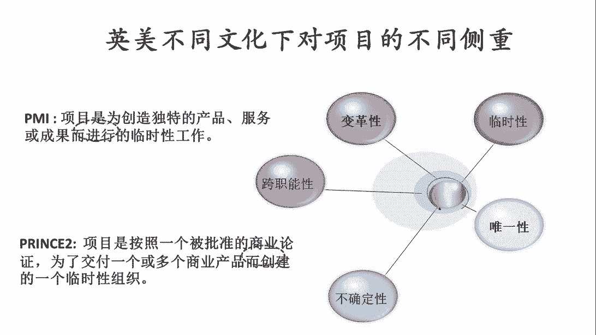
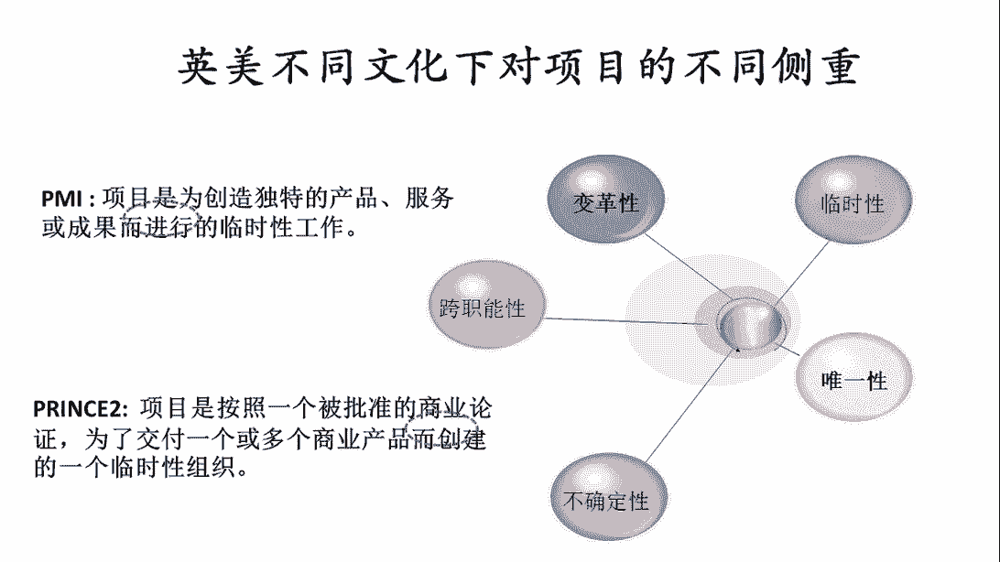

# 如何整合PMP和PRINCE2各自的核心价值,建立属于自己的项目管理实战套路！ - P2：2.英美不同文化对项目的侧重 - 清晖在线学堂Kimi老师 - BV1Uy4y1Q7PJ

那接下来呢其实我们今天的主题是，主要想先对比一下这个pm的p m p。

和这个英国内阁办公室的price two。

那他们两个呢，其实代表了两种典型的不同的文化，那一个是代表美国文化。

就是pm i pm是美国的brainion。

是英国的流派，代表了英国的这个文化，其实呢我们大家也可以看到啊，就是说其实呢美国是当今的世界霸主。

不论是英国还是美国。

工业强国，那最高科技的引领者，而且呢他们这两个国家在近代的时候，它不仅是科技强，他其实从管理上也有非常非常多的创新和建设，那在项目管理层面，其实一直以来英国和美国其实在这两个领域中。

其实都是最前沿的，然而呢我们会看到。

其实他们的切入点其实并不一样，首先呢我们先来看一看啊。

这个美国文化，在美国的文化之下呢，那p r i把项目的定义定义成是说，项目是为了创造独特的产品服务或成果，而进行的临时性工作，然后所以在这里我们会看到呢，其实在这个pmi的定义之下。

它更加的偏向于其实是一种这个知识和理论，所以呢这个时候呢，美国人呢会习惯于把项目看成是一项工作，那项目的这个活动，其实是为了一个创造独特的产品服务或成果，而进行的临时性工作的这样的一个活动。

所以这样的一个定义之后呢，其实我们看到其实项目管理的项目的这样，这个事更多的偏向的是一个工作或一个事情，然后呢，也会意味着说，后边当我们会看到项目管理的时候，它更多的其实强调的是一个做事情。

这一点呢会跟美国的文化比较相关，美国呢是一个相对来说呢比较自由，而且大家知道其实美国的发展历史并不太长，相对于其他的这些国家呢，其实美国只有200多年的历史，而且呢美国其实是一个非常制度为王的文化。

在换句话说呢，其实呃如果大家在美美资的公司工作过，或者在美国学习和生活过，那我们会感受到是说，其实呢在美国文化下的人，大家对制度体系，制度体系其实会非常的尊崇，非常的敬畏，也就意味着是说呢。

其实大家在一起的时候，大家都会照章办事，制度上怎么写的，我们就怎么做，那大家在开展工作或生活的时候，很多时候都是就事论事的，不谈情感，不谈关系，更多的是说呢，大家按照一个相同的游戏规则做事情。

这样大家才能够很好地协同平等的相处，我想呢这在一定程度上也是因为是说，其实美国是一个多元文化的国家，在这种多元的文化之下呢，如果是说每当一做事的时候，大家就谈感情，谈文化，谈关系，那这事就没法做了。

是与不同的种族，不同的文化，不同的背景，这人跟人之间的差距太大了，只有大家这个对事不对人，才有可能真正的平等相处和协同起来，所以在这样的一种文化之下呢，其实美国的项目管理。

它更多的其实也是强调的是事情本身，然后开展工作的既有逻辑，所以这时候呢我们会看到，它产生这样一个项目的定义，那在英国的文化之下呢，我们会看到其实这个定义就变得很不一样了。

在英国的prince的这个定义之下呢，项目是按照一个被批准的商业论证，为了交付一个或多个商业产品，而创建了一个临时性组织，所以从这里面我们会看到呢，在英国的这个prince的定义中的，项目呢是一个组织。

而在呢pm的定义中的项目是一个工作，我们大家都会知道，其实工作和组织，其实是两个完全不同属性的东西，当我们定义项目这个工作的时候，他就更多的强调这个事儿，当我们看到项目是一个组织的时候。

其实我们会把项目管理看成一种组织行为学，它其实背后是一群人，所以当我们其实看成是一个组织的时候，这里面首先面临的第一个问题，就是，我们要如何把一些原本目标和利益不一致的人。

那整合成一个目标和利益一致的组织，所以呢这时候我们会发现，构建一个临时性的组织。

其实成了项目管理工作过程中，一个非常非常重要的事情。

而且呢我们看这个定义，它呢其实不仅仅强调的是一个组织。

其实在英国的经济之下呢，他更多的认为是说项目应该是一个受控的组织。

所以呢项目呢从一开始就应该受控。

从一开始受控要解决的问题是什么呢，项目必须是按照一个被批准的商业论证。

那意味着是说呢，其实当我们从这个组织之前，首先得经过权威的机构的批准对吧。

所以得有高层批准。

那批准的原因呢，是因为我们进行过一次商业的论证，意味着什么呢。

这样的这个项目，它本身应该是一个以商业为导向的，换句话说呢。

我们论证过它的投入产出比，那知道是说这件事做完了之后，将来对项目的发起方。

它是有投资意义，有回报的，有收益的。

所以当我们进行过一次充分的论证，论证了这件事，它具有商业的价值。

具有投资回报，就经过了权威的机构批准了之后，我们才可以去成立一个组织。

去交付这一个或多个商业产品，所以我们从这里我们会看到呢。

其实英国的项目管理，它是一种典型的以商业化为导向的项目管理。

在英国人看来呢，其实项目它本质上是一个为了实现商业目的。

而成立的一个临时性的组织，这个组织必须是受控的。

所以这时候我们会看到呢，在py的定义之下，项目是为了一个搞创新的工作。

而在英国的这个定义之下呢，项目是为了完成商业化的一个临时性组织。

所以从这两个不同的定义之下。

我们大家就可以想象到，其实它所定义的项目管理的方法。

一定也会有不同的侧重，但不管是在什么样的定义之下呢。

我们依然会看到是说什么样的事适合当项目呢，所以在我们的这个ppt的右侧。

我们列出来了五个特征，这五个特征呢，其实不管是在美国的py还是在英国的朴素中。

其实他都是会有提到项目的这五个特征。

这五个特征定义了什么样的事，应该按照项目管理管。

其实呢一直以来，不管是企业中还是生活中，并不是所有的事都是合按照项目来管的。

大多数的工作可能并不是按照项目管，是。

因为大多数的工作被我们称之为叫运营，或者是战略，那什么样的工作室。

按照项目版呢，通常我们一般认为首先第一个看到临时性。

什么叫临时性呢，临时性的概念就是说这件事他有时间性的要求。

他必须得在某个时间点之前可能要开始，必须要在某个时间点之前要完成。

它是个阶段性工作，他不能是一个什么时候干完都可以的。

也不能是一个什么时候开始都可以的，所以当这个事本身具有比较强烈的。

时间要求的时候，他比较适合当项目管，就像之前第一个被称为叫项目原子弹。

那个时候是因为我们要抢时间。

那美国要抢在比德国之前先把原子弹造出来，所以他要赶时间。

所以才成立了项目的组织，那这意味着说所有被当做项目管的事。

必须要有时间紧的这个属性，第二属性的叫唯一性。

唯一性说明的是什么呢，唯一性说明说这件事它的结果必须是创新的。

换句话说呢，这个项目最终的交付得是一个。

我们没有交付过的东西，换句话说可能是谁都没有见过的一个东西，所以他必须要一个创新的目标。

或者一个创新的结果，那如果是说我们这个工作所交付的最终的结果。

是以前我们交付过的，甚至是我们见过的，那这件事就不叫唯一了。

那他就不太适合按照项目管，所以这时候当我们要去创造一个之前实验。

没有创造出来过的东西，甚至可能我们自己都不一定能特别清楚的。

把这个东西到底长什么样讲清楚的时候，说明它具备了唯一性和独特性的特点。

说明这事适合按项目来管，第三个特征呢叫不确定性。

唯一性呢谈的是说这个事的结果是创新的。

是我们熟悉的不确定性的，强调的是这件事实现的过程。

也是我们所不熟悉的，所以这里面的不确定性，更多的强调的是说。

我们实现我们项目的这个目标，或产品的这个路径。

我们也不太有经验，也不太熟悉，甚至可能都没有经历过。

所以这时候呢过程中就会有很多的风险，是因为我们缺少经验。

所以因为缺少经验，所以不确定性就多，所以呢这个事儿就适合按照项目管理来管。

还有一个特性呢，我们叫跨指中性，跨职能性说明什么呢。

达到这个项目管理吧，一直谈的不是一个人自己干活。

如果项目经理自己干活，他就不叫项目经理了，那叫一个技术专家。

或者叫一个工程师，项目管理呢或者包括项目经理，其实一直以来所锻炼的就是张罗别人干活。

而且呢是要张罗一群来自四面八方的人。

来自于不同职能部门的，是来源于不同企业和不同国家的。

所以呢这个时候呢我们会发现，项目的团队中的人。

他永远不能是一个相关方的人，他一定是多个相关方的人，所以这时候就产生一个属性叫跨职能性。

跨职能性的概念是说在项目中的人，他一定是代表了不同的利益。

不同的目标，不同的诉求，不同的技能，不同的文化。

那甚至有不同的工作方式，所以呢在这种情况下呢。

我们还要把他们组织在一块儿去，共同实现一个共同的目标。

那就意味着开始的时候大家一定有一个磨合期，大家呢一定会有冲突。

但是呢其实我们说从项目管理的角度来说，其实我们是需要项目中有冲突的。

一直以来呢。

大家知道，其实一直以来呢，创新的来源其实是来源于冲突的。

很多的非常重要的创新。

它其实都是来源于冲突，来源于跨界的冲突。

来源于不同的思想，知识技能的碰撞而形成的一种颠覆式的创新。

所以一直以来呢，如果我们想创造这种00~1的创新。

那我们一定要紧，一定要创造一个跨界冲突的场景。

而项目呢，它其实就是这个跨界冲突的这个场景的承载，它的一种组织保障，新组织保障形式或者是一个平台，所以呢项目的工作永远内部是要有跨界冲突的，没有跨界冲突就没有创新，没有创新这件事可能就没有价值。

所以呢当我们遇到的是一个有跨界冲突的事情，里面有不同的相关方要协同协作，而他们又不太容易协同协作的时候，说明这个事适合按照项目来管。

我们这个项目的产品和成果要落地，他必须要改变一批用户或者是一批人。

他本来的工作方式和行为。

再换句话说，其实任何一个优秀的产品，其实都是用来改变一批人的，通常我们把被改变这批人叫用户，那我们要去改变一批人，你要去让这帮让这帮人颠覆自己，放弃以前的习惯，然后为了使用这个新的产品而去创建一种新的。

这种工作方式和生活方式，但是其实改变人其实是个挺难的，任何的时候其实改变习惯都挺难，改变一个人的习惯很难改变自己的习惯，很难改变一大批人的习惯更难，所以这件事呢是需要提前去思考，和设计和策划的，要布局。

从一开始的时候，项目团队都要思考，为了让我们项目的产品能够被用户，更容易的接受和改变他们自己，那我们需要去提前策划哪些活动。

我们如何去设计这个产品，才能让这个产品更容易落地。

更容易被用户们所接受，然后呢能够帮助他们去改变他们的行为。

而然之后呢我们去获得这个过程所带来的收益。

也意味着是说呢只有用户比较难被改变的时候。

这时候这个事儿适合当项目吧，要是我们说这个用户很容易就接受了。

说明什么呢，说明这个事不创新，说明一个产品没价值。

所以很多时候呢这个用户越难改变，一旦用户被改变了，这件事的价值越大，所以项目呢所面对的场景。

那越是重要的项目，往往越是面对，要改变一大批人的这样的一个目标。

所以通常我们会看到什么样的事实，和当项目管呢，我们会发现时间紧啊。

结果不确定，过程不确定，然后呢还涉及到一大堆啊。

来自于不同的利益相关方的人，要协同协作之后呢。

这帮人协同协作的目的呢，是为了共同要产出一个产品。

去改变更大范围的一批人。

