# 如何整合PMP和PRINCE2各自的核心价值,建立属于自己的项目管理实战套路！ - P6：6.以修炼技能为导向的PRINCE2项目管理方法论 - 清晖在线学堂Kimi老师 - BV1Uy4y1Q7PJ

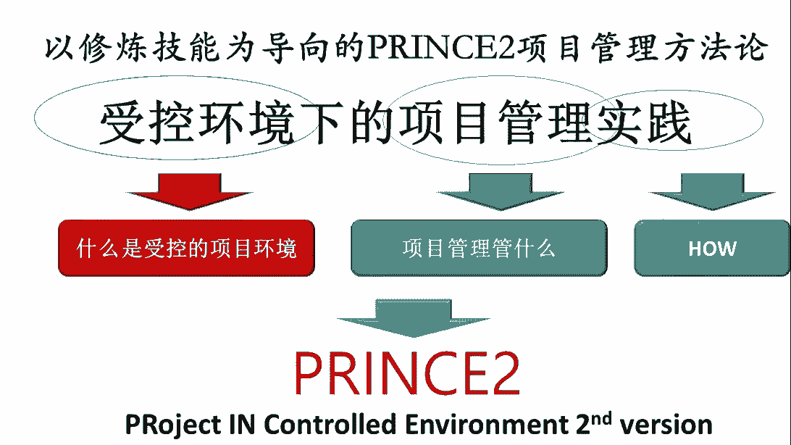

接下来呢我们再看看这个英国的朴素，因为prince呢其实之前我们就提到。

它其实是一个方法论，而且这个方法论特别侧重的是什么呢。

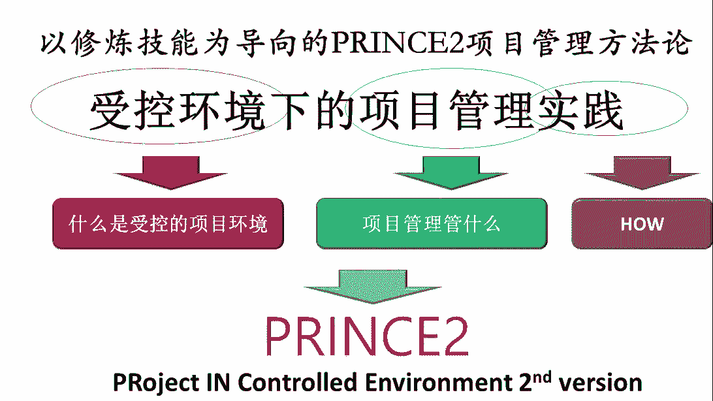

是如何去构建项目的受控环境，所以呢这个英国的项目管理呢不是错的。

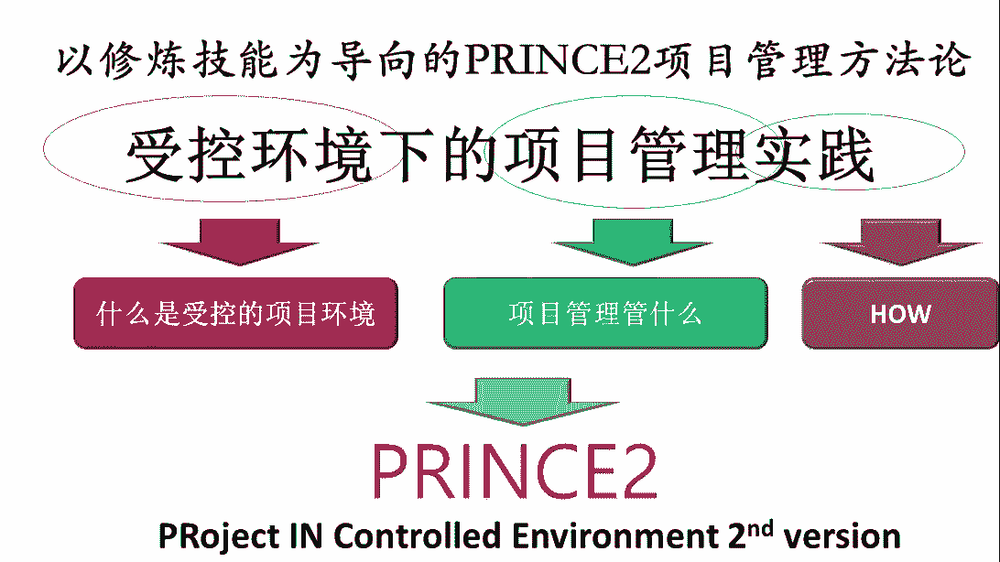

它其实呢核心的目的是，首先搭建一个项目的受控环境。

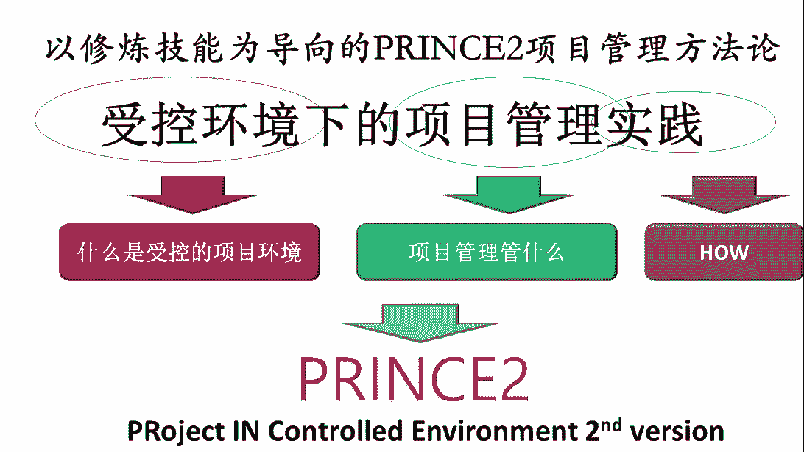

然后呢在项目的生物环境之下呢，再去把项目管好。

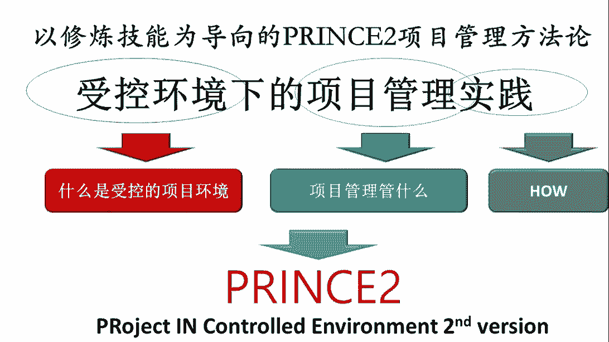

所以它就是两块搭建项目受控环境，然后开展项目管理，他这个名字也很有趣，它叫prince to，全称叫project in control environment。

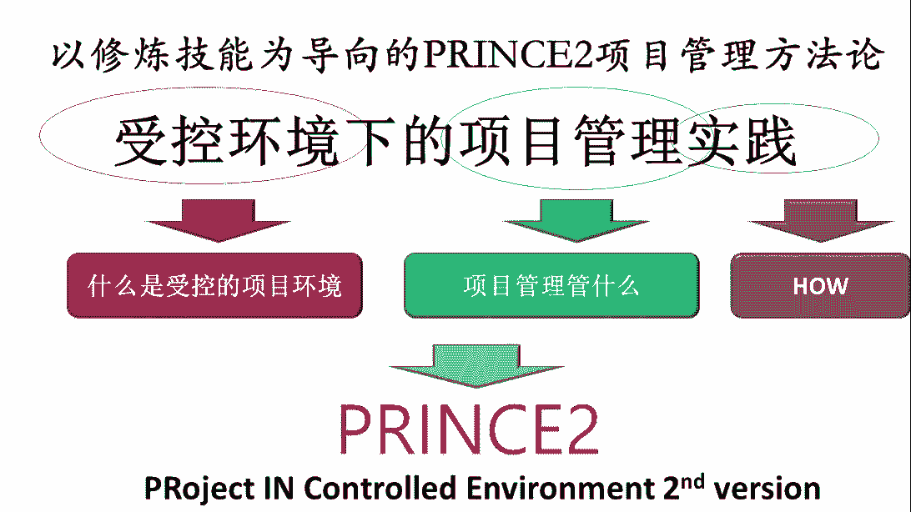

second，or叫受控环境下的项目管理，第二版。

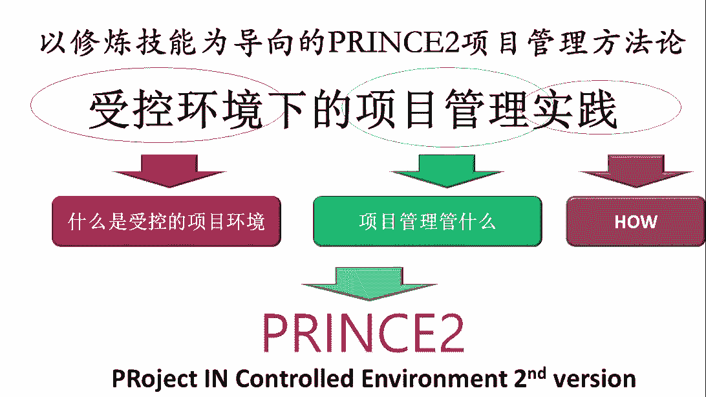

为什么叫第二版呢，是因为最开始的时候吧，第一版叫prince，叫破站，in control environment。

但是那个时候呢，这个prince它还是一个行业方法论。

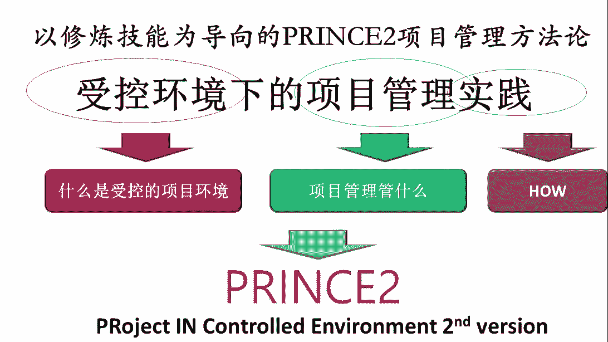

准确来说它是一个it项目管理方法，后来呢，这个it项目管理方法被英国政府收购了之后呢。

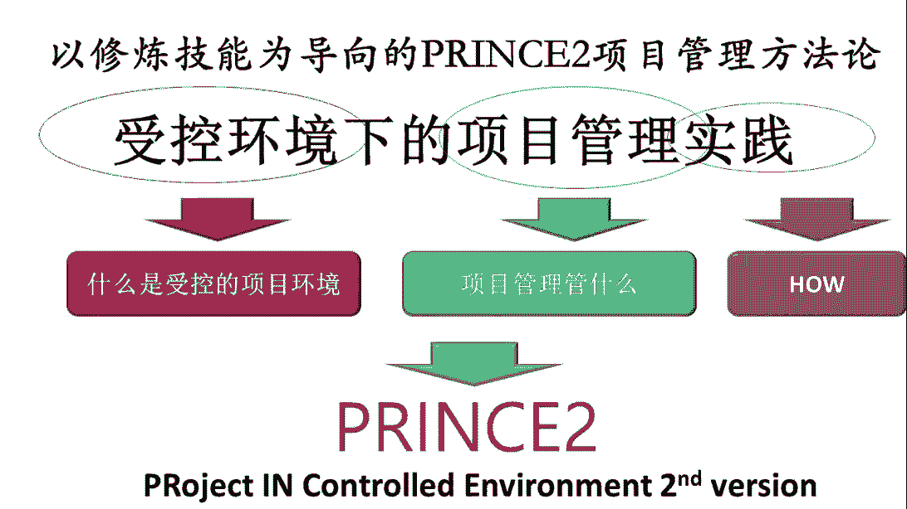

发现它具有很好的普适性，所以呢他组织了一群专家。

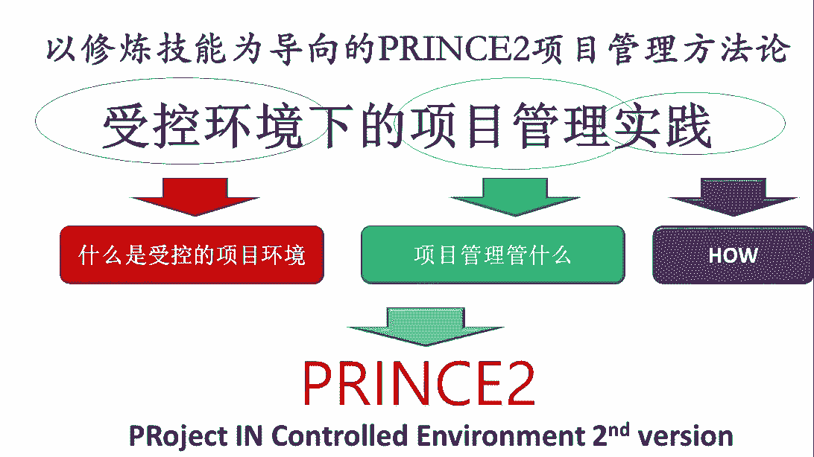

把i t的痕迹痕迹去掉了，然后他把它改造成了一种通用的项目管理方法。

所以呢这个大致相当于11次大改版，所以呢就叫prince to。

所以这时候我们会发现，其实prince或者叫prince 1。

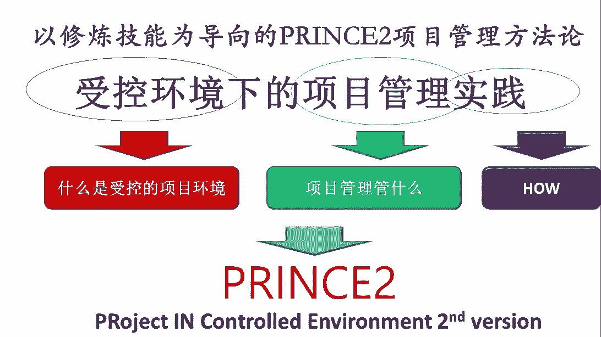

它是i it项目管理方法论，而prince 2，这时候就变成了一种通用的项目管理方法论。

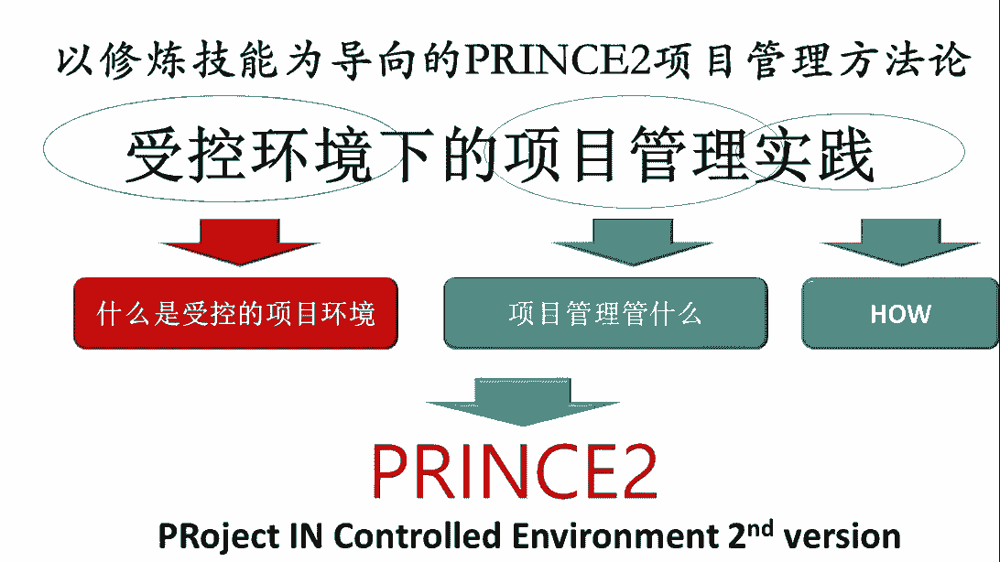

所以呢这个二说明他有一次大的版本变更，所以从这个背后呢我们也能看到英文的严谨。

即使是一个方法论，经过了一次大的这种版本改变。

哎他要把二这个版本加上，所以叫prince to这个prince它主要框架是什么呢，我会看到它这个框架呢，其实跟这个拼bug的框架会不太一样，是因为呢它其实是以应用为导向。

那我们之前有讲是说其实pinbox偏y的pinbox，它其实呢是以构建知识框架和知，识体系为导向的，所以里边呢很多的时候强调了，不同领域的专业知识和专业过程，但princil呢它以应用为导向。

它更多的讲的是说呢，我们怎么样去构建一个项目的受控环境，基于使用场景，使用场景是什么呢，面向用户，面向使用者，面向干项目管理的人，面向项目经理，面向项目经理的领导，面向项目团队中的这个小组经理。

所以这个时候呢我们会发现呢，为了让这帮人能够很容易地去掌握这种方法，而且是面向某个场景来去开展项目管理工作，那所以呢这时候呢他把这个项目管理的框架分，就变成了我们通常叫3742，三七十二是什么呢。

三个七七大原则，七大主题，七大流程，四层的组织架构和两种关键的项目管理技术，这两种关键的项目管理技术呢，一个叫基于产品的规划技术，还有一个叫质量审查技术，这是什么概念呢，在英国的项目管理过程中。

当我们以实际落地为导向的时候，我们不能给大家讲太多的工具技术，他说如果我们像拼box一样，给大家讲了100好几十种工具和技术，最后大家发现你这东西就学不过来了，学了100多种工具技术。

其实可能哪个都不太容易用好，因为把任何一个工具技术用熟练，都需要好多年的时间，所以呢这时候呢我们说从实用的角度来说，我们不需要大家掌握太多东西，我们至少得熟练掌握最关键的东西，所以这时候就会涉及到。

其实项目管理中最关键的两种技术是什么呢，一个就是做计划的技术，在这里叫基于产品的规划技术，所以换句化妆的项目经理，要掌握的一个最重要的技能要做规划，第二件事是什么呢，组织大家做评审，因为项目管理。

它其实本质上是一个基于集体决策的管理方式，换句话说，对于项目经理来说，项目经理最大的靠山是项目管理委员会，所以呢其实呢真正的项目管理模式，一定是基于项目管理委员会的，项目经理的项目是不做主的。

项目中做主的是集体决策，集体决策就是我们说的项目管理委员会，项目经理更多的是靠呢组建，包括了不同相关方代表的项目管理委员会，促成他们之间达成共识，而之后呢形成项目中的执行力，所以很多时候项目经理要借力。

需要借谁的力呢，要借项目管理委员会的利，所以项目经理一定要擅长干的一件事是什么呢，组织不同的相关方一块开会，形成集体决策，然后呢去决定项目中的各种的关键的事件，去评审项目中的交付结果。

所以这时候呢我们叫评审技术，所以这时我们看到的，其实项目经理两个最最重要的需要掌握的技术，一个就是组织大家制定项目计划的技能和能力，第二呢是说呢组织不同的相关方，做集体的评审决策的能力。

所以呢组织大家能够去做出规划，这时候呢我们就能够统一大家工作的方向目标，把不清楚的事想清楚，不确定的事确定能够组织大家做评审呢，这时候呢我们就能让项目过程受控，所有的关键的事情都能促成大家的共识。

这样的话大家的利益目标就是一致的，项目才能保持节奏感，所以这两个技术其实往往是项目管理中，对于项目经理来说最最重要的两个技能，所以两种技术之后呢，我们再看到它有七个大的原则，这个七的大原则是什么呢。

这就是说呢，其实英国人他总结出来的是说，做项目管理过程中必须要遵遵循的七个原则，这七个原则呢是意识层面必须要去做到的，第一个原则是什么呢，持续的业务验证这个概念是说呢，我们要不断的去论证。

这项目之所以到底有没有收益，有没有价值，最怕的是什么项目，干了半天，最后发现没有价值，那等于白干对吧，说明一开始方向错了，第二个呢叫明确定义的角色和职责，这什么概念呢。

就是说这个要想把一群相关方组织在一块，共同干一件事，这必须得让大家有一个清晰的定位，对自己的角色和职责有个明确的认知，而且他就接受了，所以这个呢就是当我们在构建项目，组织结构的时候，要特别花费心思。

花费心思的目的是，因为我们其实项目是构建了一个新的工作场景，这是一个新的生态，在这里边呢，其实每个人呢，都是从原来自己的工作岗位和环境下换来的，在这个新的环境之下呢，我们必须要让他有融入感。

让大家一旦到项目的工作场景之下之下呢，它就自动切换到自己在项目中所扮演的角色的，这个这个感觉上，我们最怕的是什么呢，参与项目中的人，脑子里都是自己原来带职能的角色和定义，所以呢在项目中呢。

老想着自己在原来的职能部门中所扮演的角色，因为大家来源于不同的部门或不同的公司，这时候呢大家的目标是不一样的，那其实我们本来把大家都组建到项目中的，其实是想让大家忘了自己原来是干什么的。

而在项目中呢突然成了一家人，那一到项目中唉，大家都场景切换过来了，每个人要想的是，我在项目中应该扮演什么角色对吧，我代表了什么利益，我应该要干什么，而不能老想着自己从哪来的，我都扮演的是什么利益。

所以这时候呢就需要项目经理在初期，要花费更多的心思，来帮助项目团队，去打造一个融入感和集体荣誉感，让大家一到项目的场景下，就马上想起来自己在项目中扮演的角色，而不是自己，而在职能部门中所扮演的角色。

这是第二个原则，第三个叫关注产品，项目是一种典型的结果导向的工作方式，那对于项目来说呢，它的结果它的目标是什么呢，就是我们所说的项目的交付物，这个项目的交付呢，也是我们称之为叫项目的产品，所以呢。

项目管理是一种典型的以终为始的工作方式，那我们从一开始的时候，这个这也是项目的特点，但我还没干活之前，我们不是先想这活怎么干，而是先想我最终所要的结果，终点是什么，把终点想明白了，反推反向推导到起点。

而形成了项目的计划，然后呢再正式的去开展这个工作，所以呢优秀的项目经理，脑子里永远想的是最终的结果是什么，我到底要个什么结果，然后再组织大家把这事干了，而不是一上来呢，结果没想明白。

先带着大家先干活去了，我们说那是技术思维，先把结果想明白了，再组织大家干活，没资源找资源，这是项目经理的思维，现在呢很多的问题，就是好多项目经理是技术思维，脑子里老想的是说别人把资源给自己配齐了。

自己干活，这不叫项目经理，这是一种典型的技术专家的思维，真正的项目经理的概念是，我先把最重要的目标，结果想明白了之后，发现没资源，我找资源缺钱找钱，缺支持，找知识，缺人找人，然后大家凑不到一块。

我还能把大家组织在一块，把这活干了，这叫项目经理的思维，我们说别人把资源权利都配齐了，那就不需要项目经理了，那说白了那就是一个技术专家或者具体干活的，干活的人才，需要别人给配资源。

真正搭台子的人是自己找资源，所以呢关注产品要解决的问题是说，我们要首先想明白，最终我要的结果是什么，我为了实现结果，这是我们这个关注产品要解决的问题，项目的过程要受控呢，他就要阶段划分。

它不能是个交钥匙工程，不能从头到尾中间没有控制点，如果项目从一开始规划时，从头到尾就没控制点的话，这项目过程肯定控制不了，是所以呢这个因为大家一旦活干起来了，就想把大伙儿停下来。

想搞清楚大家干到什么程度了，其实挺不容易的一个事，所以呢项目管理的受控过程呢，一直以来是基于开始预设控制平衡点的方式，让大家到了一个点之后呢，他不得不停下来，为什么呢，是因为项目管理遵循的逻辑呢是说。

按照项目的阶段，分阶段投放项目资源，不能一下把所有资源都给了项目成员，都给了项目成员，所有的项目成员一定是最后干到没资源了，才回来找你，所以呢这个分阶段投放资源，然后每次阶段评审通过之后。

才可以进入到下一阶段，保证了我们在项目的过程中，能够控制项目的节奏，所以这也是个重要的原则，再有一个原则叫经验学习，这是什么概念呢，因为这个项目是一种偏向于创新型的工作，那上面承载的都是没干过的事儿。

所以意味着是说呢，我们必须要在干任何事之前，第一要努力的去寻找我们没有经验，那找的经验越多，确定性越强，第二呢一边干我们要不断总结经验对吧，总结不能老在同一个坑里面摔倒，所以呢越是干这种不确定性强。

经验少的事越需要特别强调经验学习的事，因为积累的经验越多，这种经验学习的意识越强，这样的话才能够使出规避更多的风险和问题，还有一个原则叫例外管理，例外管理讲究的其实背后是什么呢，是一种分层授权。

因为在项目的过程中呢，其实我们这里边它其实是要分层的，通常呢就像我们右边看到这个四层的组织结构，真正的项目管理团队是分三层，这其实跟企业差不多，企业一般也分三层，所以项目管理团队也分三层。

铁中的三层是什么呢，这个三层中最上面这层叫指导层，就是项目管理委员会，他其实是真正项目中用来做决策的，这种决策是投资决策和方向的决策，最基层的小组经理是带着大家干活的，换句话说，一个项目有好多小组经理。

每个小组经理负责一个工作，包一个子项目，他其实是带队干活的，它是以任务导向的，这项目经理不能是任务导向，项目经理其实是以这个组织协调导向，所以这个项目经理在中间承上启下，组织协调。

一方面的组织项目管理委员会达成共识，给项目管理委员会提供方案，提供信息，提供建议，第二呢要落实项目管理委会的各项决策，组织小组经理把这件事实施了，然后要监督评价考核小组经理，确保他们这活儿第一干得对。

第二干的干的结果很好，所以呢这个项目经理这活儿不好干，很费心，是因为夹在中间要从上叫启下，上面很多的东西是想法，底下的人更多的是技能，善于干活，这中间需要转换，需要撮合，需要整合。

所以这个其实就是项目经理的主要工作，所以这件事呢，而且我们发现因为分了三层，所以就会涉及到分层授权的问题对吧，项目管理委员会有什么权利，项目经理有多大权限，小组织没有多大权限。

因为项目管理委员会的权限其实是更上层，被我们称之为公司和项目群管理层授予他的，所以这时候呢我们说例外管理要解决的就是，他们之间要形成一个分层授权小组，经理在什么情况下，哪些事可以自己处理。

哪些事要上报项目经理，什么事自己处理，什么事要上报向管理员会，什么事自己处理，什么时候上报，那因为正因为有了这个例外管理，所以才有可能构建一个分层授权体系，这时候呢高层才敢授权，所以很多的时候呢。

经常有很多项目经理说自个儿项目没有权利，其实往往没有权利的原因，是因为自己的项目从上往下看的时候，他觉得你不受控，没有分层授权，所以自己对授权了之后，他没把握，怕一旦授权就失控，风险太大。

所以呢这个项目经理吧，你要想要更大的权利，必须要首先把自己项目，这个分层授权的受控结构搭好，让领导们放心，他敢把权力放下来，因为他知道一旦失控，他能马上发现或者不会失控。

所以呢如果这个项目本身就是一团糟，就更没有人敢授权了，是越乱越不敢授权，其实项目结构越清晰，越敢往下授权，这叫例外管理，造一个呢叫一环境剪裁，其实这个一环境剪裁呢更多的强调的是说呢。

这个英国的项目管理强调，当我们在我们的项目中，使用项目管理方法的时候吧，他要按照环境调整，你不要生搬硬套，不要把所学的东西全用上，因为所学的东西呢任何一个项目管理方法，它其实都是一个系统性方法。

然后呢它其实理论上是没办法全用的，因为我们的项目中呢，你要把所有的所学的东西都用上了，很有可能这个管理的成本就太高了，而且很有可能是一种束缚，另外有些东西它不一定适合这个管理呢，没有对错。

更多的讲究的是适合不适合，所以这个英国推行的项目管理的逻辑，一直以来是什么呢，就是说我们把适合的东西给用了，好好用的东西给用了，这个不好用的，不要太勉强，也不要生搬硬套，什么都用。

这个呢就要根据自己的项目的特点，项目的环境进行调整和建材，所以呢这个英国的项目管理，它主推这么七个原则，这七个原则落了地呢，它就变成了七种机制，这七种机制就是我们所说的七大主题。

像我们大家看到的这七个主题，有商业论证的主题，组织的主题，质量的主题，计划的主题，风险的主题，变更的主题和进展的主题，换句话说呢，这七个机制说明什么呢，说明在项目中啊，我们要开展这七个不同的工作。

所以呢因为它是以这个用户导向吧，用户导向或者叫应用导向，所以他用了个词叫sim t h e m e叫主题，这个主题，这个词呢，这个词跟那个以前我们电脑有桌面主题，那手机呢其实手机桌面有手机桌面的主题。

主题是什么概念呢，把各种专业的知识和要素，那根据用户的使用习惯来打包成一个东西，这时候叫主题，所以呢这个prince的七大主题指的是什么呢，我们把各种项目管理的知识工具要素。

那以我们在项目中容易开展管理为导向，我们也打个包哎，就变成了一个主题，所以呢这个项目中呢，这个站在项目经理这个用户的角度来说呢，哎我们要使用的这个管理的这个包呢，一共七个，这是什么呢。

一个是说我们要得把这个项目中的这个业务，价值论证这个事儿变成一个机制，这是之后呢，我们要把这个项目，这个这个组织怎么去管理和维护，构建变成了机制，然后呢质量管理做成了机制。

项目整个这个计划的制定和维护做成个机制，然后风险管理做个机制，项目的变更管理做个机制，还有一个呢就是进展，也就是我们的这个过程控制和这个进度管理，要做成个机制，所以呢这项目管理呢是这个七个机制。

这七个机制呢在项目中是项目经理，包括所有的项目团队必须要去管起来的，把这七个机制呢在项目中呢，在从头到尾的跟我们之前说，这个项目管理的五大过程组串起来，一整合就变成了项目中的七大流程。

我们说的这个项目管理的七个主题呢，它就是专业主题，他强调的是从专业的角度来要构建的机制，这七大流程呢谈的是协同，协同的概念呢是说这个项目从前到后，因为有五大过程组，有不同的阶段，不同的阶段呢。

其实前面这七个主题肯定都得落地，都得有，而且呢它们中间要协同整合，所以呢这个当我们会发现项目中，不同的组织结构中不同的人，那为了这个实现项目的阶段性目标，把不同的主题结合起来。

那找到一个最佳的协同方式了之后，这就形成了一个流程，所以流程强调的是协同性主题，它强调的是专业性，所以呢这个专业的主题在项目中，为了配合项目的协同而形成了流程，所以这时候形成了七个大的流程。

所以呢这是我们从前到后项目的准备的流程，项目启动的流程，项目收尾的流程，为了实现项目中的过程控制呢，我们要有项目指导的流程，项目指导的流程，是项目管理委员会，就项目中的领导们使用的流程。

