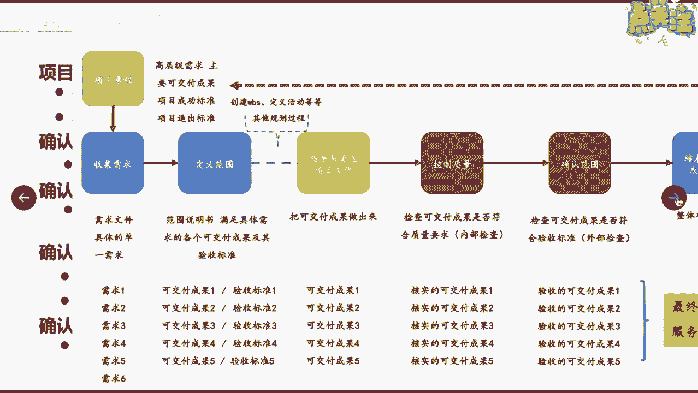
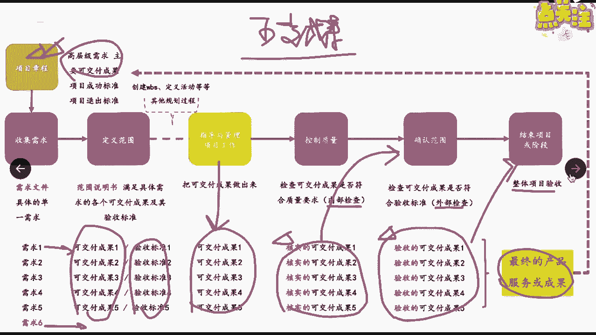

# 如何确认项目范围 - P1 - 项目管理陈老师 - BV1Gv4y1y7rj

接下来我们继续往下来讲，项目范围管理的第五个课程叫确认范围啊，确认范围，那么这个过程呢它属于监控过程组了啊，监控过程组所谓的确认范围，首先大家要明确一点，谁来确认这个过程是谁来确认范围。

经常有些同学啊啊会说啊，那肯定是我们项目团队项目组织来确认范围，其实不是啊，应该是由什么呀，客户或者发起人来进行确认范围，这点大家一定要记住，确认范围是由外部啊，当然不一定是外部啊。

但是应该是由客户或发起人来确认范围，确认范围意味着正式验收，意味着客户和发起人对项目的可交付成果，表示正式的一个确认，那这个课程的作用呢，就是通过验收每个可交付成果。

来提高最终产品服务成果验收的可能性啊，你可能这个项目会有很多个可交付成果对吧，但是呢我们要一个一个都要让客户去验收，最终呢整个项目才有可能被验收对吧，比如说一个软件系统啊，你的这个一个模块完了之后。

你可以让客户来确认范围，这个模块是不是满足了你的需求，满足了我们的范围，OK这个模块型打勾啊，好那么在这个过程当中呢，我们的输出输出大家可以来看一下，首先最重要的一个输入是核实的可交付成果。

其他的像这个项目管理计划，项目文件啊，这个我就不说了，也没有打出来啊，项目管理计划呢我们至少说我们要确认范围，肯定要把项目范围管理计划，需求管理计划一定要拿出来，还有什么呀，还有我们的范围基准对吧。

你要确认范围，你肯定要把范围基准拿出来啊，啊范围基准拿出来啊，啊所以这个里面我们说范围基准，这里面可能我们要回去补充一下啊，刚才可能我讲漏了范围基准这个知识点啊，范围基准包含了什么呀，包含了三个东西啊。

在创建WBS的这个输出呢，我们能得到范围基准，那么这个范围基准呢包含了三个东西，分别是范围说明书，WBS跟WBS词典，这三个加起来共同构成了范围基准啊，所以这个知识点大家要注意回来补充一下啊。

那哪儿可以找到可交付成果核验收的标准呢，首先先选范围说明书，再选WBS，再再选范围基准好，所以这个知识点补充一下，范围基准由三个文件来共同构成啊，好那这边我们说这个过程里面要输入范围基准。

上一个课程已经产生的范围基准了，我们在这个过程里面要作为输入，还有我们的计划，两个计划范围管理计划，需求管理计划要作为输入，那么这个过程里面很重要的一个输出呢，输入呢就是核实的可交付成果。

什么叫核实的可交付成果啊，就是已经完成了，而且呢被控制质量过程检查为正确的啊，或者说我们刚理解为合格的，就是你这个东西做出来，已经通过质量的检查检验是合格的，这个东西呢才能叫核实的可交付成果。

否则只能叫什么呀，只能叫可交付成果，那只有核实的可交付成果，才能进入到确认范围的这个过程，也就是说你你要交给客户去确认范围，你首先自己得把这个东西先检查清楚，是不是到底有没有质量问题啊。

到底合不合格啊啊你如果自己都不检查，直接就拿去给客户去确认，这很明显是不负责任的，对不对，而且呢通过的几率可能也很低，所以我们自己要先对这个可交付成果，进行一个核实啊，然后呢当然还包括什么呀。

工作绩效的一个数据是吧，工作绩效的一个数据啊，这些我们就不展开，不许说了啊，然后它的工具跟技术一个就是检查哎，就是通过审查呀，巡检啊，开展测量审查跟确认活动诶，客户大家过来对这个东西我检查一下诶。

试用一下有没有问题啊，啊没有问题是吧，都OK啊，最终我们要这里还有一个叫决策，大家一致觉得说OK吗，啊我们验收可以吗，可以好，大家都一致签字好，这是验收正式完成结果就输出了什么呀，验收的可交付成果诶。

他前面又加了两个字了啊，验收的可交付成果啊，那说明已经范围已经确认了，这个东西是验收了，符合验收标准啊，然后呢应该由客户或发起人正式签字批准啊，签字盖章嗯，那么我们的项目团队呢。

应该从客户那边来获得这种正式文件啊，来证明相关方对项目可交付成果的正式验收，这点很重要啊，大家都现在都知道说验收完之后，验收完之后意味着什么呀，要付款，对不对啊，如果你没有验收，人家怎么给你付款。

所以呢这个时候就很重要，一定要从他那里获得正式的文件啊，一定要签字盖章，那么在这个过程当中呢，也可能出现什么呀，例外的情况，没有通过验收，那么这个时候我们就要提什么呀，变更请求了啊。

我们之前讲到整体变更控制的时候，大家还记得吗，如果在验收的阶段，客户对于这个东西，对这个产品提出了不一样的想法或者意见，那么这个时候呢我们就应该提变更请求是吧，变更请求，那么处理的步骤就是什么呀。

第一记录了解什么原因，完了之后呢，要走变更流程，这个变更流程也就是我们之前说过的啊，你也要评估对吧啊，你也要进行一个审批，最终才能确认要不要变，帮他进行一个缺陷的补救啊，所以这个是它的一个输出。

那当然还包括一些项目文件的更新啊，一些项目文件的更新，比如说经验教训登记册呀，需求文件啊，需求跟踪矩阵的一些更新啊，我们就不不不继续展开来说了，那么在这个过程当中呢，确认范围这个过程当中呢。

我们说很重要的一个输入呢，就是核实的可交付成果，一个很重要的输出呢就是验收的可交付成果，那么对于这个可交付成果。

我们从整个项目的流程呢，来把这个知识点跟大家说一说，可交付成果，我们说这是项目的一个很重要的目标对吧，那么它会在哪些地方，哪些过程里面会出现可交付成果呢，首先呢在项目章程里面啊。

它会记录高层级的可交付成果是吧，在章程里面我们都说了，他会记录，然后呢这个可交付成果，通过我们的需求收集以及范围定义，我们就能够在需求文件里面，形成1234566个需求啊，或者是1234565。

123455个可交付成果啊，这几个是对应的对吧，这几个对应的啊，然后呢这个需求六可能也要对应一个是吧，然后呢通过了定义范围，我们得到了可交付成果的详细描述，以及它的验收标准。

完了我们进入到指导与管理项目工作，在这个过程当中，我们就要把一个个的可交付成果给他做出来，是吧，做完了之后呢，我们要进入到控制质量这个过程，这个过程呢在质量领域啊，质量管理的知识领域里面。

我们后面会说到，那么这个就叫做也叫内部检查，他要检查一下可交付成果是否符合质量的要求，如果符合质量要求，那么他就换了一个名字叫核实的可交付成果，12345，那么只有核实的可交付成果。

才能进入到我们的什么呀，确认范围的过程，来检查，是否符合我们业主方或者是发起人的需求啊，有没有符合要求，这也可以理解为外部的检查啊，如果也符合了，那么我们就称它为验收的可交付成果，对验收的可交付成果啊。

所以你看可交付成果，他就从从这边刚才我们讲了，指导与管理，项目工作执行过程中产生的只是叫可交付，经过质量控制才叫核实，经过确认范围验收才叫验收，最后呢才能进入到结束项目或阶段整整体验收。

然后呢形成了最终的产品或服务成果，然后呢这个时候我们要返回去看看，跟我们的项目章程是否一致，是否达到了啊，所以呢这个呢就是我们说可交付成果，在整个项目过程当中呢，它的一个什么呀，流动性。

流动性在不同的阶段，不同的过程，它有着不同的一个状态啊，不同的状态好吧。

这个是呃确认范围课程。