# 如何规划项目进度管理 - P1 - 项目管理陈老师 - BV1Ws4y1s7ir

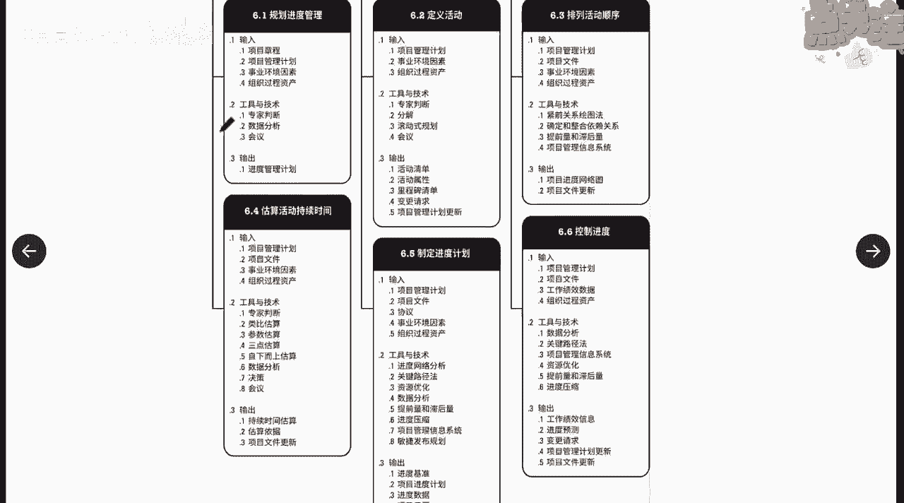

项目进度管理呢总共有六个过程。

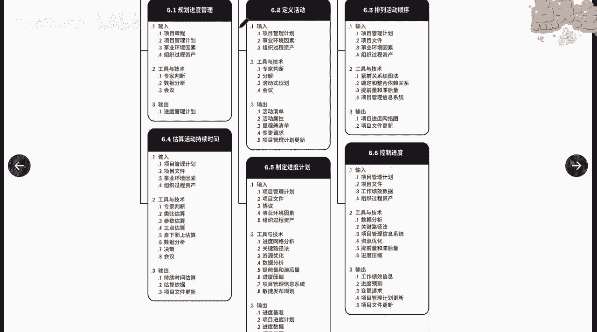

分别是第一个课程规划进度管理，第二个课程定义活动。

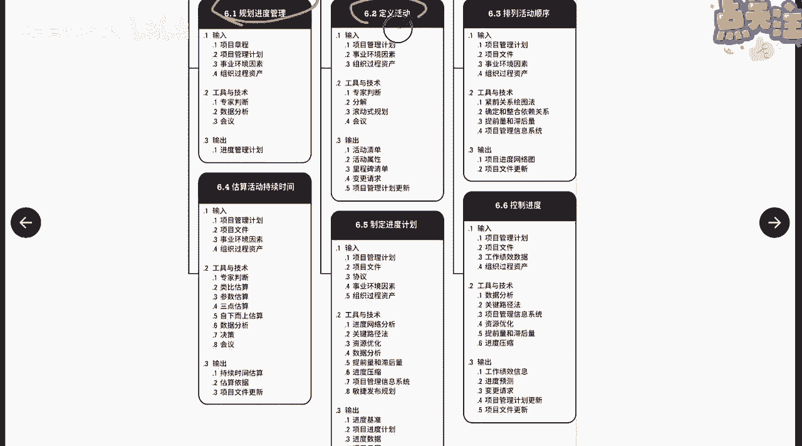

第三排列活动顺序，第四估算活动持续时间。

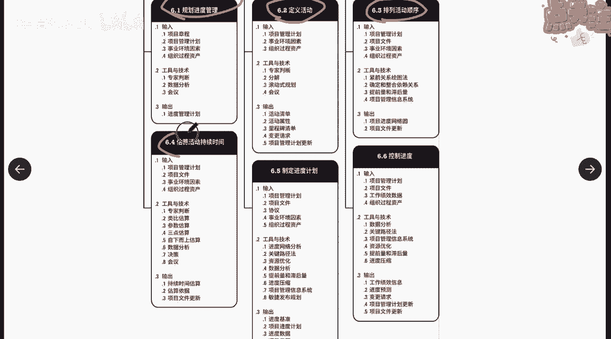

第五制定进度计划，第六控制进度啊。

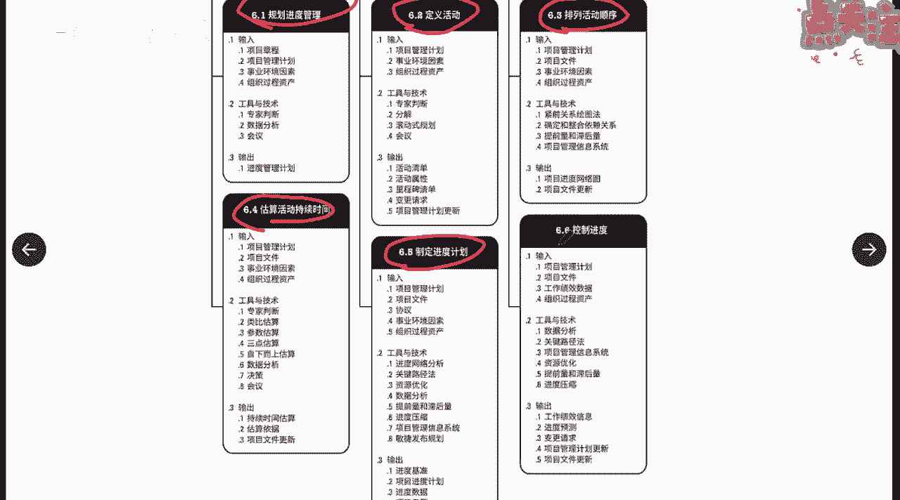

那大家也很好理解，12345都是属于规划过程组啊，规划过程组第六属于什么呀，属于控制过程组或者监控过程组啊，那这里面的依赖关系是怎么样的呢，我们之前学过了，在每一章的每一个领域的开头的第一个过程。

一定是规划该领域的管理计划，所以在这个里面，一开始我们也要做一定一份计划对吧，来规定我们在整个的项目里面怎么来管进度，怎么来衡量进度是吧，这个是这个过程的作用，那么第二个呢有了过程之后。

我们就从这里开始，我们就开始正式要来制定进度了，首先我们要定义活动，活动从哪里来。

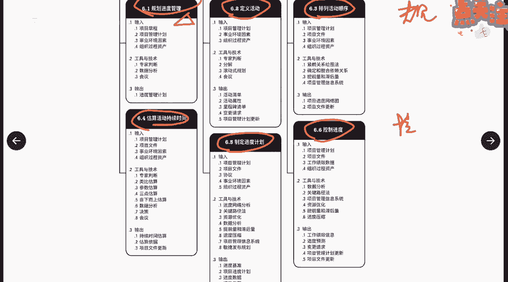

活动从范围来啊，范围来依据我们的范围。

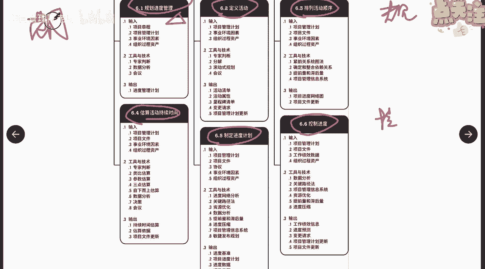

依据我们的可交付成果，也就是我们的范围基准WBS说明书。

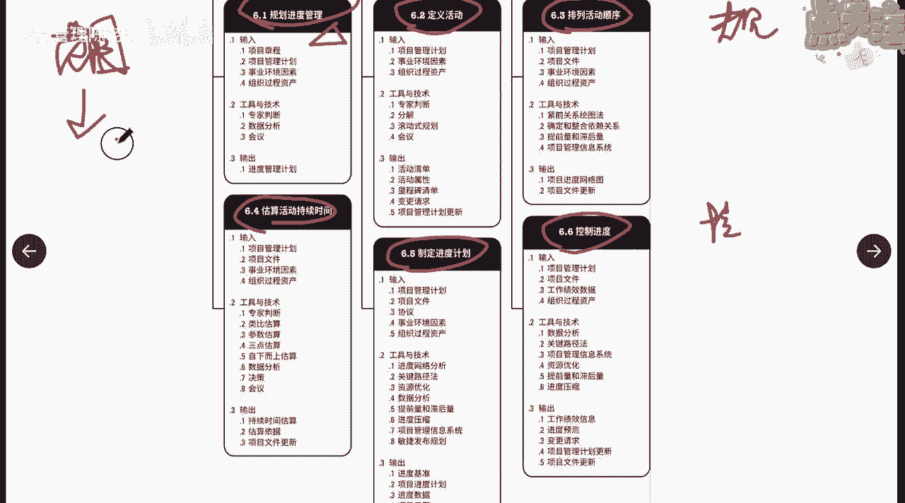

我们把它分解为一个个的活动，也就是说啊范围管理里面管的是什么呀，管的是我们的交付成果是什么，进度管理里面呢，就管的我们要得到这个交付成果，我们要做哪些事，这个就叫定义活动，有了活动之后之后呢。

我们就来排列活动的顺序是吧啊，把他们按照先后逻辑顺序排列出来，先做什么后做什么，那这个排列活动顺序对进度有没有影响呢，肯定是有啊对吧，比如说你可以一边烧水，一边怎么样啊，一边这个拿茶叶。

你要喝茶的话对吧，你也可以烧完水之后再去拿茶叶，但是两个活动是不是可以同时进行。

那对攻击有没有影响诶，这个是有的啊。

完了之后呢，再来估算我们每一个活动的持续时间，每一个活动要做多久，好在这个过程里面我们来完成，然后呢再进入到我们进度计划，进度模型，有了前面这些铺垫，我们就能得到我们的进度计划，最终能得到什么。

你看这边有一个输出叫进度基准是吧，完了之后，我们还要在整个过程当中，保持对进度的一个监控控制啊。

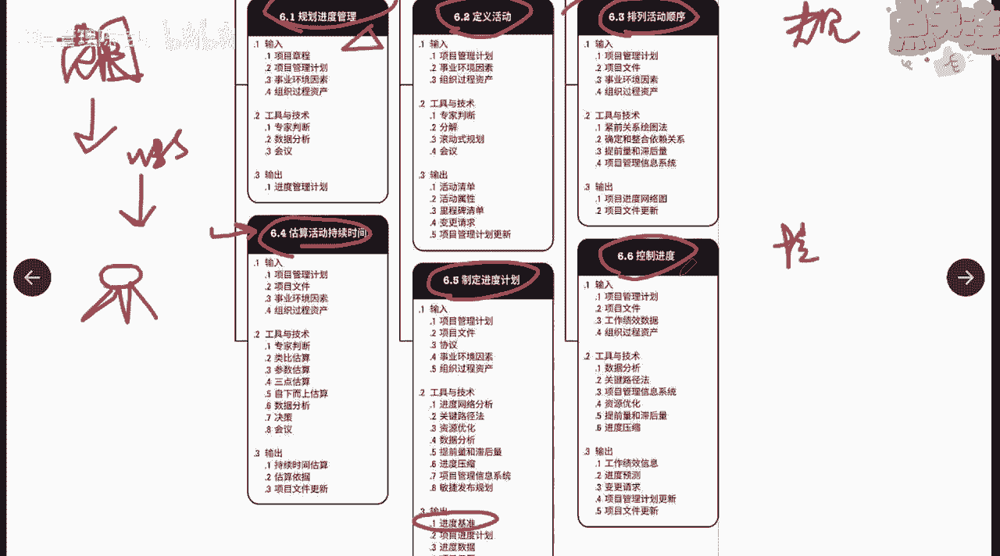

所以这里面把ITTO全部给大家列出来了啊。

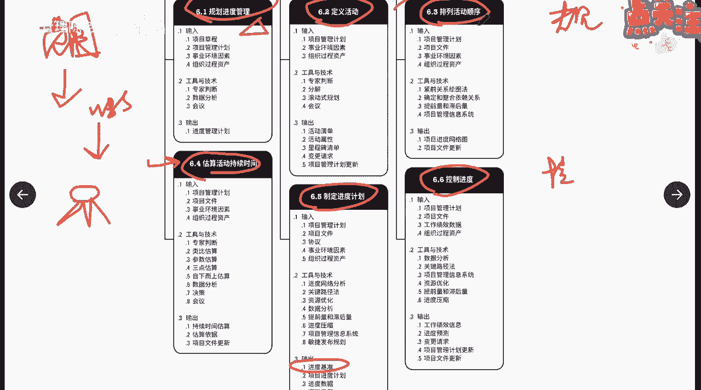

全部给大家列出来，那这里面有几个比较重要的ITT，我们等一会会展开讲，我这边也先给大家提一下啊，比如说在这个定义活动里面。

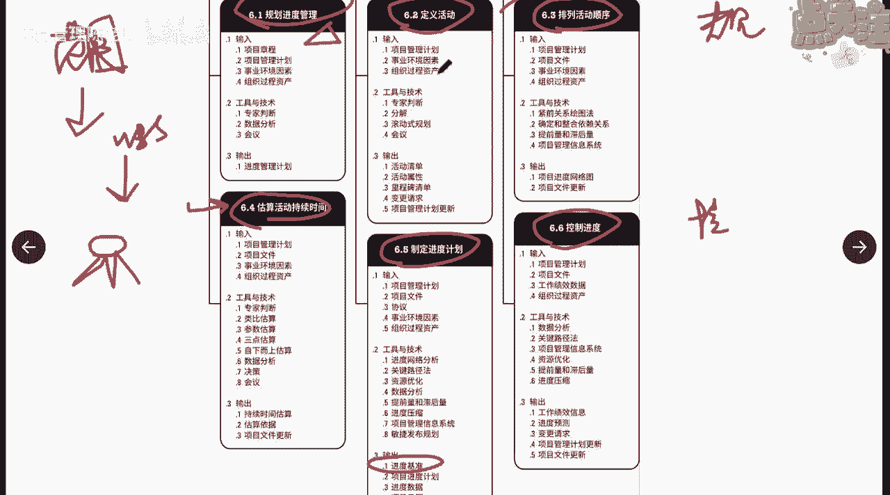

我们要输入的是什么东西啊，项目管理计划，而哪个管理计划，我们的范围基准是不是肯定是要作为输入的，对吧啊，然后呢还有事业环境因素，我们可以通过这些工具和技术输出了。

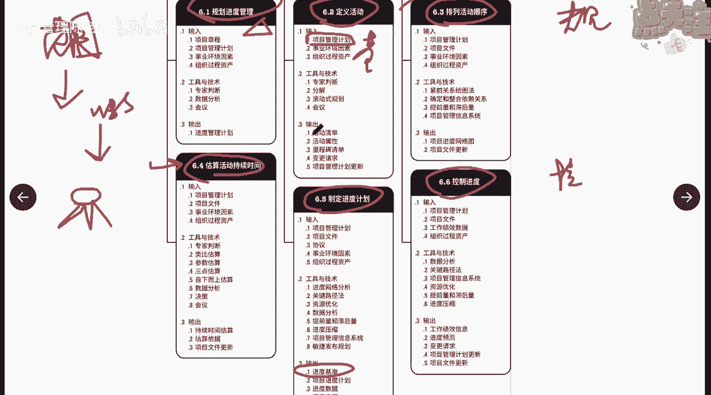

我们这里面会有三个清单，活动清单。

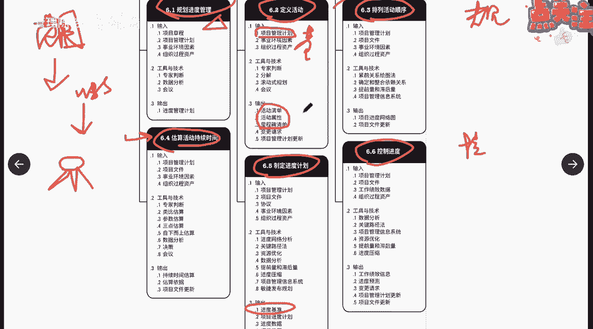

活动属性跟里程碑清单，完了排列顺序的时候呢，我们也要把上一个课程的东西输入进来。

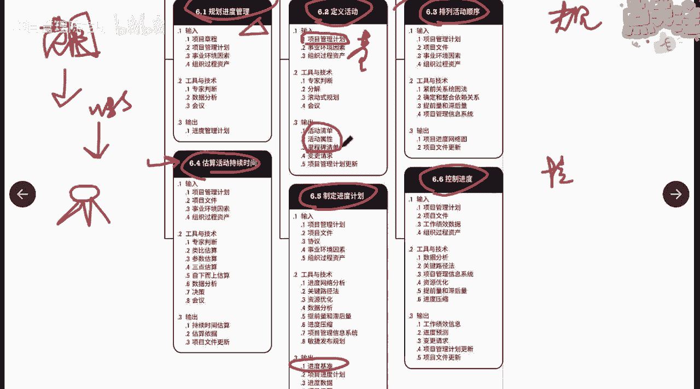

完了之后会得到一个网络进度图啊，然后呢网络监督都有了，我们再来估算每一个活动的持续时间，我们都又得到了什么呀，持续时间的估算，有了持续时间的估算，我们再利用一定的方法啊，比如进度，网络分析。

关键路径进度压缩等等等等等等，这些呢我们就得到了进度基准啊，好那这个是他整个数据流向的这么一个过程，给大家先点一下啊。

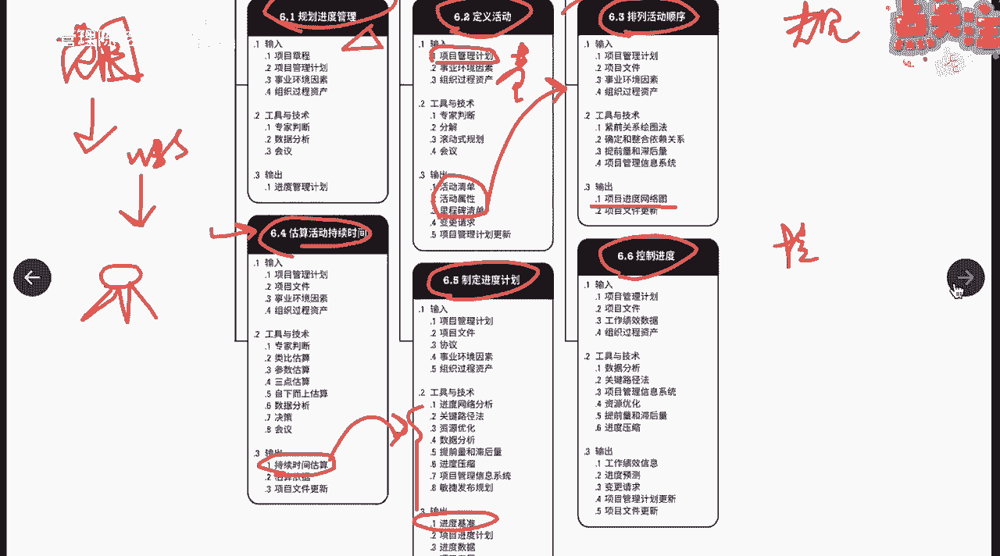

我们继续回到课件上面来，来说，项目进度管理的第一个课程叫规划进度管理啊，那么刚才我说了，规划进度管理就是要制定一份文件啊，来描述我们怎么样来管进度，怎么样来衡量进度，他说是为了规划编制管理。

执行和控制项目而制定的政策程序文档的过程，那也就是说这份文档啊，他要规定了我们在整个生命周期当中怎么编制，采用什么方法，我们怎么管理啊，然后呢还要管理到什么程度啊，然后呢来制定这么一个管理的一个计划。

这么一个文档，那么这个过程的作用就是为了整个项目中，课程当中呢怎么来管进度提供指南和方向，要有一份文件专门来我们的项目，或者让我们的项目团队，知道我们应该怎么来管进度，那么这个过程当中最重要的输入。

最重要的输入就是什么呀，啊输出就是进度管理计划，最终我们要得到这个管理计划嘛啊，然后大家也要明确这一点，范围管理计划里面，无范围进度管理计划里面也是没有进度的啊，没有进度。

如果说你要查找一下我的进度计划是怎么样的，你去查什么文件呢，要去查进度基准呢，是不是，而不能来看进度管理计划，所以这点大家要明白，那它的工具跟技术也比较简单，我们就不再赘述，通过会议啊。

也可以通过专家判断呢，通过数据分析啊都可以啊，那么重点在这个领域，我们要了解一下进度计划的这个里面，包含了哪些东西，它包含了哪些内容，哪些东西是包含在这里面的，首先就是进度计划的发布和什么呀。

迭代的一个长度，当然这个迭代指的是什么呀，适应型生命周期的时候，你应该规定好，比如说我刚才说了，我们每一次迭代是2~6周，那么我就要在这里面我要规定好啊，我的这个迭代周期是多少啊。

要指定固定时间段的发布时段，阶段和迭代啊，那么固定时间段有助于减少范围的蔓延，如果你没有规定好这个框，也没有规定好这个框里面能做多少事，那么你就很可能出现什么范围蔓延，多做事了啊，这个任务少了。

在这个迭代里面任务少了，那可能会做一些其他范围外之间的事情啊，所以这个是要包含进度计划的，发布的这个方法模型以及迭代的长度，另外呢要提供准确度啊，也就是说你这个估算或者说你确定这个周期呀。

这个工期呀或者进度啊，你是用什么样的一个区间，允许接受的偏差是多少啊，包含说可接受的区间，以及允许的应急储备的数量好，那这个应急储备，我们等会会也会来说到什么叫应急储备，比如说估算某个活动的工期。

我们是按天啊，或者是按什么允许正负浮动一两天，也就是说这个活动它的准确度啊，可以是10-2，可以是八天，也可以是10+2，可以是12天啊，在8~12天里面完成，我们都说它是符合我的进度的啊。

这个就是它的精准确度，计量单位指的是我们每种资源的计量单位，比如说人天啊，或者是数量计量单位，用盾或者千米，然后呢还有一个什么呀，控制临界值啊，允许出现的最大进度偏差啊。

比如说我们在控制预定好我们的周期是呃，六个月好，我们的工期是六个月，我们允许的偏差是在什么呀，是在比如在十天以内的偏差，六个月正十天，我们都觉得说它是OK的，一旦超出了这个，那就超出了我们的控制链接值。

我们就要采取什么呀，采取一定的措施纠偏对吧，纠正这个偏差啊，这个就是我们的临界控制临界值，还有一个绩效测量规则啊，需要规定用于绩效测量的增值管理的规则，以及其他测量的规则。

那么这个测量规则主要有以下几项啊，大家可以看一下，比如说我们可以用五十五十原则，也可以用什么呀，二十八十原则也可以用0~100原则啊，那这个呢对于后面我们来估算增值EV，它是有有有有有帮助的啊。

所以我们这个什么意思呢，大家可以稍微的了解一下，什么叫五十五十原则呢，就这个活动啊，比如说我们要估算一个活动，这个活动一开始，比如他需要做三天的时间啊，然后做到第二天的时候，你说他这个活动完成了多少。

完成了2/3吗，啊未必吧，啊未必吧，所以呢如果你估2/3，有可能他最后很多事情还没完成，所以呢这里面我们就可以采取五十五十，也就是说这个活动一开始，我就默认他已经完成了什么呀，百分50唉。

那你第一天开始做了，完成50%，第二天也是50%啊，一直到第三天你做完了，我才给你算，另外50%就是百分百啊，这是叫五十五十原则，那么以此类推是吧，二十八十原则是一开始我你做到第二天。

我也默认你只完成20%，等你全做完了，我就问默默认你完成了最保守的就是什么呢，0~100，只有等这个事情做完了，我才能算100%啊的增值，这这个叫最保守的啊，最保守的。

所以这里面这三个大家要了解一下就可以了啊，它是对于我们后面呢来推算估算1V，它是有一定帮助的，那为什么说保守更加保守跟最保守啊，嗯这就牵涉到我们之前说到的一个一个一个，一个一个一个例子啊。

就是说你今天老板就问你说这个事情啊，你做了没有啊，比如刚才你个任务你做了没有，你跟老板说我已经做了4/5了，老板也是一头蒙4/5，那岂不是就已经是OK了，做好了啊对吧，那如果你认为我做了一半嗯。

还有另外一半没做，这也是一种对吧，那么如果你他在过程当中问你说，你跟他说啊，你其实已经做了4/5，但你跟他说我只做了一半，那这个就叫什么呀，保守嘛，对不对，比较保守，那如果已经完成了4/5，你还跟他说。

我只做了20%，那就更保守了啊，然后呢如果问你说做了多少了，这个正在做，但是没有以啥啥都没做好啊，要等做好了才是完成的，这是最保守的啊，所以这几个大家要了解一下啊，正直的管理。

