# 学习项目管理体系，掌握职场转型利剑 - P1：01.危机下，学习的重要性 - 清晖Ava - BV1dT411y76r

呜，好各位现场的同学们，今天下午的课程我们正式开始呃，在正式上课之前的话，大家如果有条件的话，先准备呃，第一个就是拿一张白纸，第二个就准备一支笔，那第三个的话就是把自己的脑袋暂时放空一下。

然后接下来两个小时。

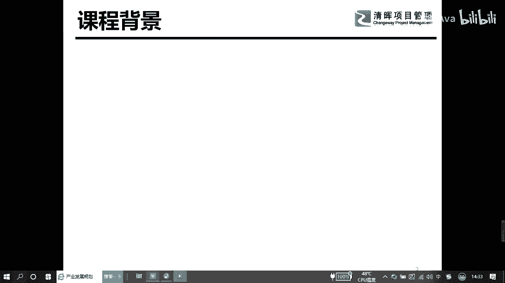

跟大家共同来分享一个项目管理化的一个思维，为什么要学这个东西呢，其实我们都知道哈，现在市场环境的变化真的很快，每个企业为了适应市场环境的变化，我们都需要不断地做一些创新，不断地引入一些新的设备。

然后不断做一些新的技术交流，不断的有一些新的工艺，然后不断的要去啊累积沉淀一些新的知识体系，这个部分就要求我们所有的学员哈，我们所有的员工，为了确保能够适应企业一个发展的需要。

那我们要做好足够的一个个人技能的一个储备，在做技能储备的过程中，有些呢是我们企业给到员工的一些福利，比如说大家都知道，像现在大型企业都会有一个培训的一个预算，那在这样的一个情况下，我们很多员工。

很多同学的一个学习是可以免费来去做支撑的，那还有一部分的企业，比如中小型企业，他现在的一个现金流，或者现在一个能力不够支撑，我们的一个员工的一个培训的一个预算支撑，那这个部分就需要我们作为员工。

作为我们的自己的成长来去化消费，自己的一个预算，在整个这个部分的话，有很多的一个专业的机构调查，他发现一个问题，就是如果企业能够对员工的一个培训，特别特别重视的话，那我们的生产力是可以提高到60%的。

那它还可以做一件特别好特别好的一个事情，就是员工的流失率，它是可以降低到65%的，这就意味着越来越多的大型企业，包括上市企业，他为什么那么重视对员工的一个培训，其实就是我自己的培养的人。

用在我们自己的资源池里面，这个部分对企业的一个战略定位是非常重要的。

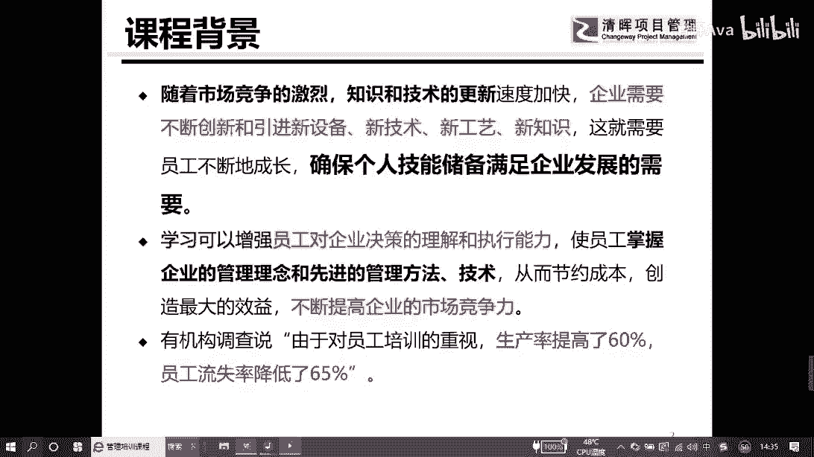

那今天的一个学习，我们大概主要分三个部分，就是第一个我们为什么要去做学习，这样一个事情，为什么要持续的开展去做学习，第二个部分就是，如果我们正常情况下不提前退休的话，我们应该做哪些能力储备。

最后一个部分就是项目管理，能够为我们的职场带来什么样的一个转变。

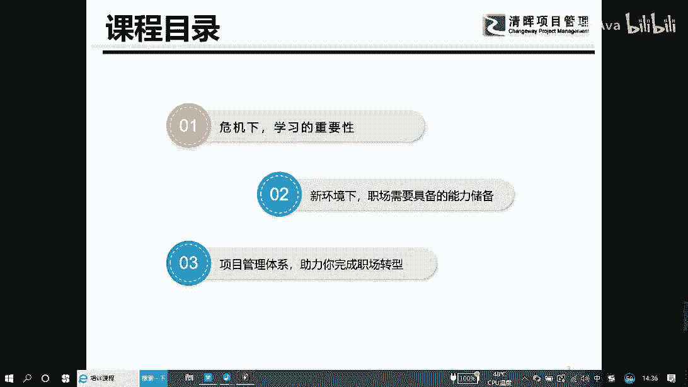

这个部分是我们要去关注的，那日常工作中，我们有时候经常会问自己哈，就是我在这个公司待了很多年了，那我的基层通道到底在哪里，我的年龄已经到存够大了，那我应该走技术路线，还是应该走管理路线，假设我选定了。

我走管理路线的话，那我努力的方向又是什么啊，在这个地方给大家一些建议哈，就是如果你不知道自己努力的方向是什么的话，你可以关注一下身边的朋友，身边的同事，甚至你的老板，他们在做什么。

你只要做他们正在做的一个事情，那至少你的方向是不会跑偏的，如果我们确定自己方向的话，那我们要做一个差距分析，什么是差距分析呢，其实就是假如你想要当高管的话，那这个高管他需要什么样的人力储备。

你必须提前了解，用3~5年的时间，甚至用五到10年的时间来去做这样一个干嘛，路径的一个规划，那为了写好这样一个事情的话，你必须要了解自己，你的一个潜在能力到底在哪里，有些东西是学不会的。

但有些东西是一学就会的，这个部分我们要足够了解自己。

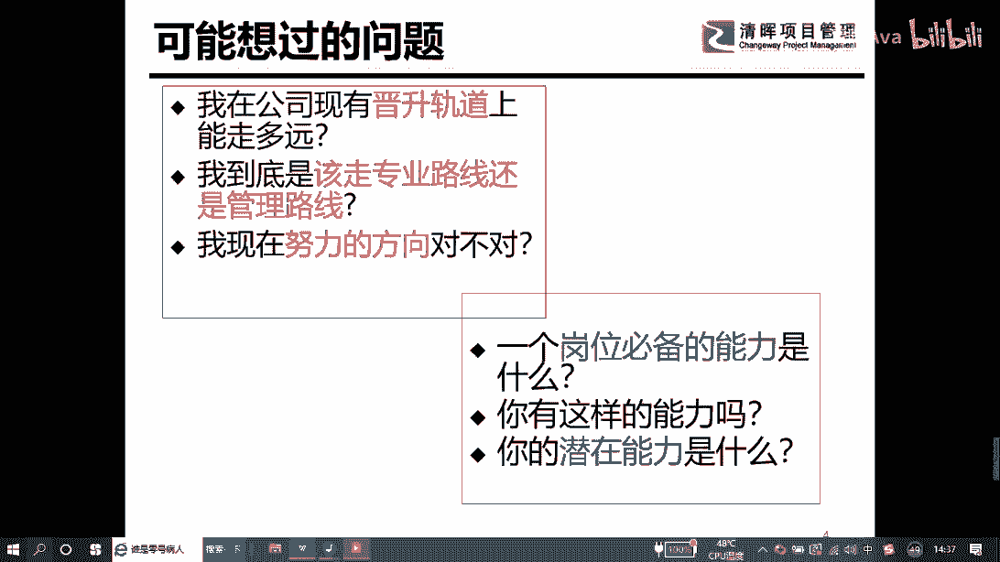

才能够快速达到自己预期的一个方向，在很多企业的话，其实我们职业发展的路径哈无外乎就是四个，大家可以看到图形中没有四条线，第一条线，第二条线，还有第三个，第四个，其实第一条件就是我们通常说的。

由技术走向管理这样一个管理职能的一个转向，那就是我们通常说的向上管理，第二条线就是我们说的我们众生的去发展，就是我们专业放量方向走专才的这样一个路线，第三个就是我们说的，那比如我今天是it行业的。

我不想做了，那我想去金融行业，那这个就是做一个词能转换，那第四个部分就是我们现在我也建议大家，一定要去做好第二职业的准备，就像现在的话，大家都应该知道，我们所有的人一个多月的时间。

在春节期间都困在家里面了，就是我们不能出去，那我们也没有收入，大家应该听过网上有个笑话，就是有一个小伙子他睡觉了，睡了睡了五个小时或者十个小时，在网络做一个直播，然后他赚了5万块钱。

这个就是我们通常说的第二只眼，当然我不建议大家做这个事情哈，我们还是希望大家用你的技术专场，或者我们专业的一个东西来去获取。

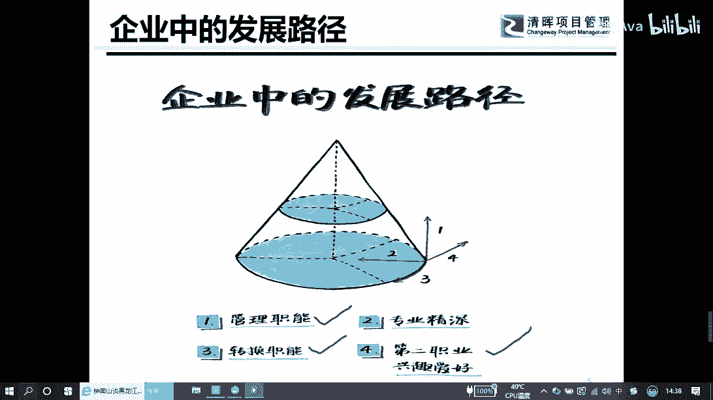

我们第二职业的一个发展，我给大家分享一个，我们说的威尼斯的这样一个呃概念，很多的时候我们都会有一个奇怪的事情，就是为什么我们企业不舍得花钱，花在员工身上去做培训，那是因为中小型企业他特别害怕一件事情。

我在你身上花10万块钱，让你去上海参加一个培训，当你觉得自己吃网印的时候，你还来不及过往公司回报1000块钱的时候，你可能就已经走了，所以对中小型企业，他在这方面的培训的投入是不是很多的。

那这个部分校作为我们把线上的同学们，我们校自力更生，那对大型企业的话，对中大型企业或者，战略格局的这样一些企业的话，他们做特别重要的一件事情，是做一个战略性的投资，最大的一个战略性的投资是对员工的培训。

按照我们调查的话来讲，就是你花一块钱在员工身上，他会带了大概三块钱的收益，当然同理的话哈，你自己花在培训上，你花了300块钱，你可能可以带来干嘛，3万块钱甚至30万块钱，这个是我们通常说的啊。

在培训这一块，在学习这一块对我们自己的一个好处，那在这个地方的时候，有一个事情，我希望你们献上我们的同学们，做到，就是每年我们要求自己必须参加40个小时，像我们集团的话。

我们要求员工大概参加100个小时，这样一个学习，它会纳入员工的一个绩效考核，那其中50个小时我们是做什么，50个小时我们是用来公司在自费这个方面，就是公司给你培训的平台，你主动参加就可以了。

那另外50个小时是需要员工自费去参加，公司之外的一些培训，这个是我们说作为员工。

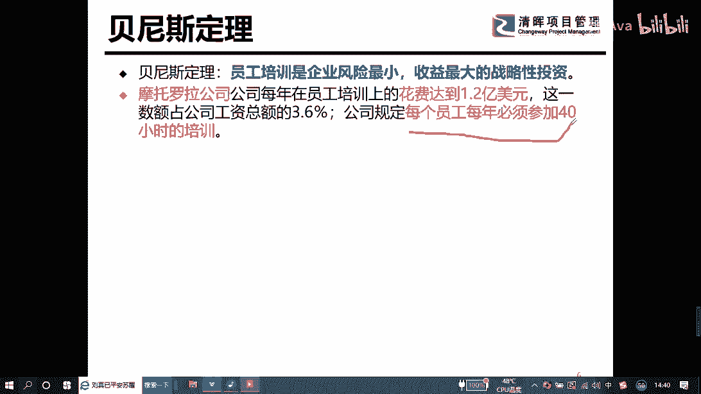

他要做一个持续成长，各位在这里面注意到一件事情，就是如果你不及时充电的话，你可能就会折旧，折旧这件事情的话其实很可怕哈，就是你可能会提前下岗，你甚至有可能干嘛找不到工作。

你甚至有可能你的幸福生活从此就结束了，所以我们建议大家在建议我们在线上的同学，包括我们的新老学，一定要记住一件事情，江湖规矩，每年都给自己写一个技能。

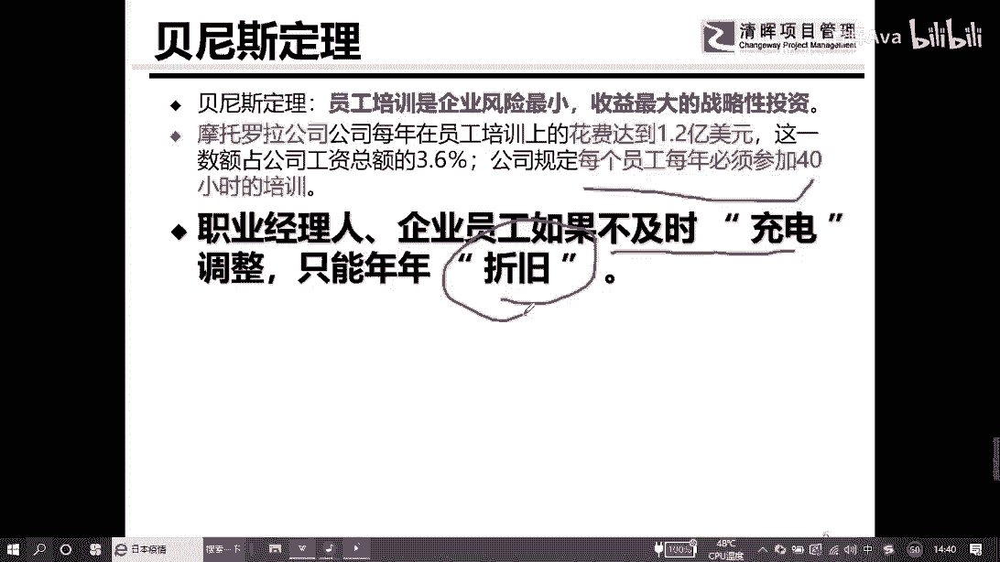

这个特别重要，这样的一个技能的话，会成为你职业的一个发动机。

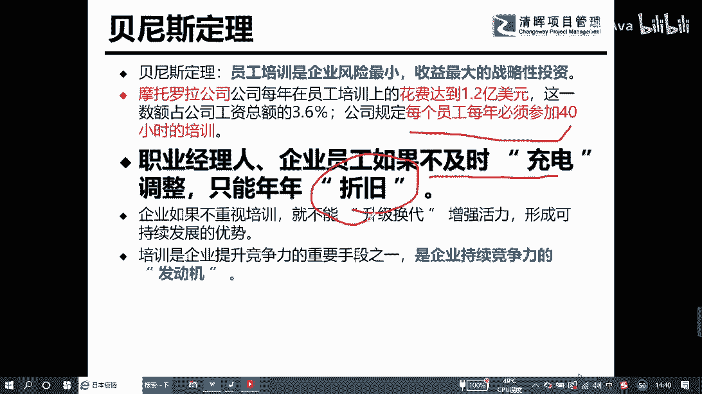

也会得到一个持久的竞争力，在整个培训的过程中的话，我们注意到一件事情，持续的对一个培训或者学习的一个投入的话，为了保证自己是一个投资品，就是我们说的我们能够再生的一个资源，而避免自己成为一个啥消耗品。

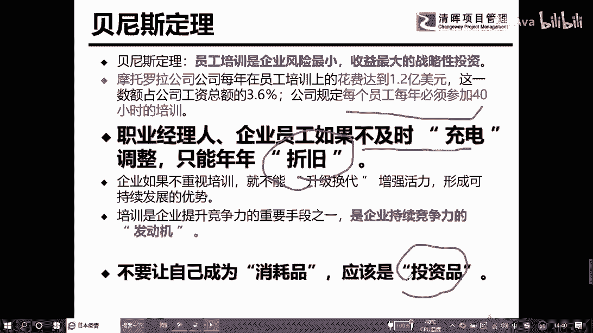

如果有一天你变成一个折旧品。

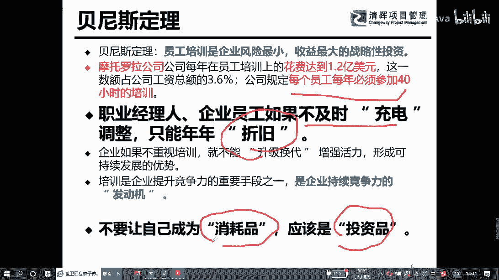

或者变成一个消耗品的话，那你在职场可能就没有机会，你甚至连上班的机会都没有。

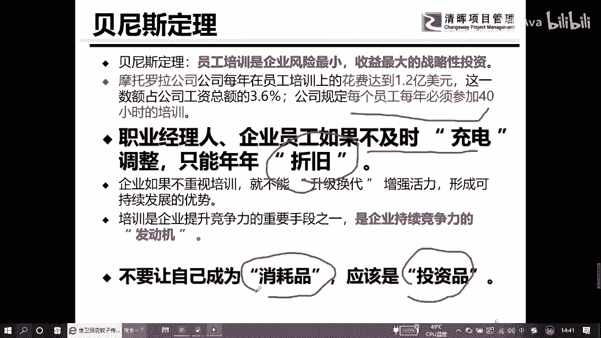

所以这个部分是我们线上的同学们，需要去关注的一件事情，这边给大家分享人生中的四个音，从现在开始，我们在讲课的过程中，你们手上的白纸，还有你们的笔，要随时做好一些，我们在上下串接的过程中。

我们会做一些补充，首先呢我们在20来岁的时候，我们要确定一件事情，就这辈子我要干嘛，比如这辈子我想做战略规划师对吧，那等我到30来岁的时候，我们在战略规划这一块，在管理咨询这个领域，我们可能要站住脚。

拥有自己的一片天地，当然在这个地方的时候，我们注意到，当有一天你想让自己有独特的位置的话，那你需要干嘛，那你需要确保自己在35岁以前有一招鲜，什么叫一招鲜，就除了你别人做不了。

比如说这次我们的疫情发生的时候，我们有一位老爷子，大家知道你位老爷子吧，就是我们通常说的钟南山老先生，对不对，他在这个部分的话，他的一个话语权就非常重，当然最后的时候大家一定要关注哈。

就是无论你愿意还是不愿意，没有人想一辈子当普通员工的，即使你想当普通员工的话，当你到一定年龄的时候，企业也不会要你，所以随着年龄的增长的话，你会发现，你在市场上能够找到工作的概率越来越小。

那如果你40岁，你去跟20岁的人去竞争一份普通岗位的话，那hr的人可能连你的简历都不需要，所以随着年龄的增长的话，为了保证在市场的一个竞争力的话，只要你要把自己的一个技能，就是带领一群。

带领一个团队去追随梦想的这样一个能力，当然有些人的时候可能在一片天这个地方，那我们就卡壳了一片天，这个地方就是我们通常说的舒适区，我在上课的过程中，一直跟我的学生们说，一件事情。

一定要勇敢地走出自己的舒适区，否则的话就没有办法往前走了，这个不分上不去，那就只能往下走，这个是我们会谈到人生的四个音，在我们在线的在线的同学们，可以考虑一下自己现在哪个位置。

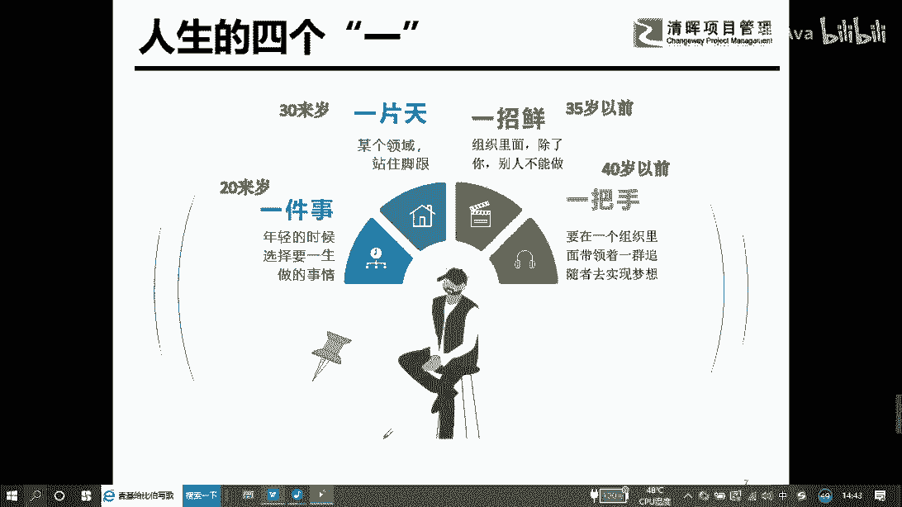

好在这个地方的时候，我们关注一件事情，就是思考与行动哈，思考与行动，这个地方我们要在行动上，有些时候我们经常会想很多的事情，想那么多的事情的时候，你会发现等你想明白了，然后一直都没有行动。

那这个时候就是白想了，在日常工作中的时候，我们都会先思考再行动，但是在学习的过程中，我建议线上的同学们去做一件事情，我们先行动再思考，因为我们现在工作中，我们要学的东西太多了太多太多了。

多到我们干嘛来不及思考，随便一个东西都值得你去学习，所以思考行动这个方面的时候，我们注意到在工作中我们先思考再行动，在我们的学习过程中，我们先行动再思考。

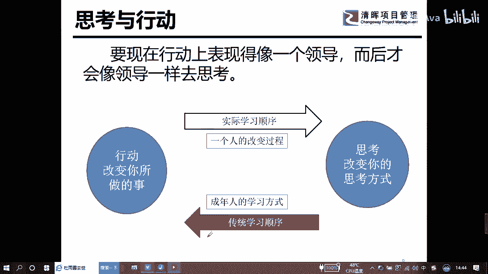