# 学习项目管理体系，掌握职场转型利剑 - P3：03.项目管理体系，助力你完成职场转型 - 清晖Ava - BV1dT411y76r

呜好，那么接下来一点点时间，我们关注一下项目化管理体系，在整个项目化管理体系，我们刚刚说过，作为项目经理，作为项目经理，他是所有你要进入管理层，进入高层的一个最基础的一个管理体系。

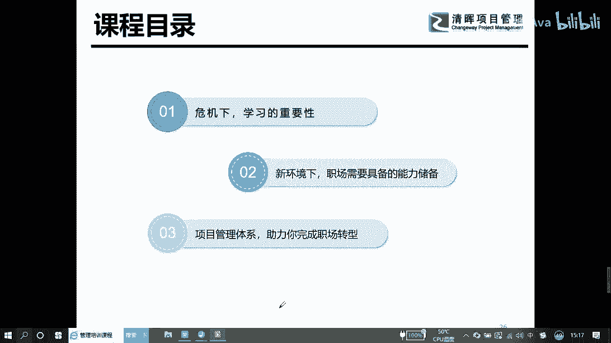

那我们接下来关注为什么要做这件事情，以前的时候啊，在早年的时候，我们很多的企业是不计代价的，但是现在在市场竞争这么激烈的一个情况下，我们怎么样来让自己的一个干嘛，自己的一个风险面向最小。

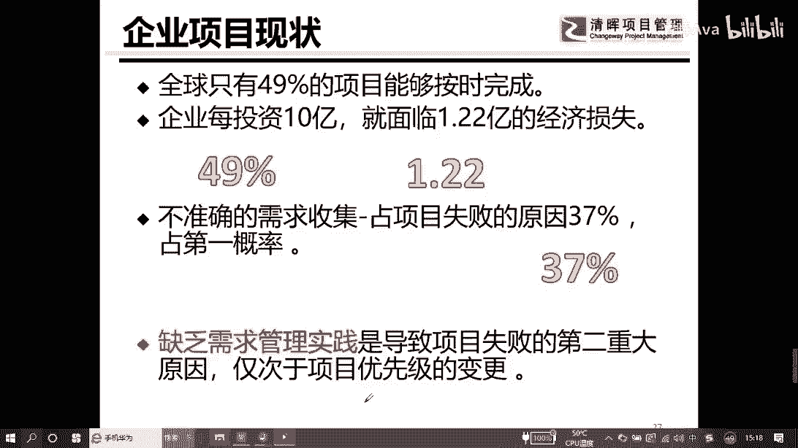

自己的损失最小的时候，我们要做一件事情，就是我们说的价值为导向，在整个做价值为导向的过程中，我们有两个价值，一个是社会价值，还有一个是干嘛，经济价值在社会价值这个地方我们就不讨论了。

像我们这次这样的一个事情的话，我们举全国之力来去做联防联控这件事情，那我们是不考虑我们的经济价值的，也就是说我们所有的资源全投入进去，只有一个目标，干嘛让我们的国民，我们的老百姓是安全的。

生命得到安全的保障，那接下来我们说起，绝大多数的企业不会纯粹做社会价值，除非这个企业是公益基金对吧，那即使是这样一个公益的这样一个，它也是有相应的一个干嘛，你提成了这样分红的一个事情。

那我们接下来说真正的经济价值，在整个做经济价值的过程中，有两个部分，一个是有形的，一个是无形的，其实实际工作中的话，有形的价值特别好，特别容易关注得到，那无形的价值，这个部分最容易成为碎片，为什么呢。

比如说我们大家都知道以前有一个呃，我们娱乐圈有个叫范冰冰，大家都应该听过吧，他最开始的，他最开始的一个品牌效应是非常高的，但随着这一个维度的一个推进，随着它产生一件事情，就是干嘛，就是偷税漏税那件事情。

然后他出现了一个重要的一个问题，就是他个人的生意是受损的，咳咳咳，因为个人生意受损这件事情，所以导致他个人的无限价值是干嘛，是没有产生的，比如说武汉服社会，他这次的一个干嘛，他这次的一个品牌的认知度。

或者它的商业肯定也是受影响的，这是我们说的商业价值，在我们将来做商业分析了一个课程的时候。

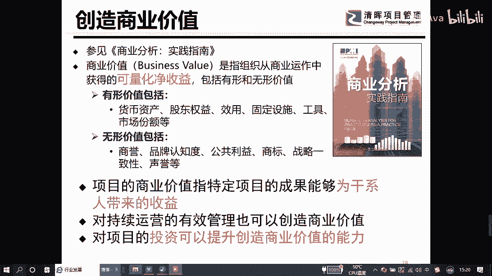

我们会重点跟大家来关注，那我们刚刚说过，我们企业里面哈，如果要做一件事情，如果要达到相应的社会效益或者经济效益的话，我们要把它以项目化的方式来去开展工作，在企业里面的话，我们会有一个层级叫高管。

高管就是我们通常说的ceo co cf c t o，就是我们所谓的董事会那个部分的人，那董事会的人，是会把我们的愿景与方向性的东西，我们会形成战略规划，我们国家的时候，在2020年。

我们有个战略目标一定要实现，大家应该清楚吧，那在战略目标实现的过程中，我们的战略规划不是1年，也不是2年，我们是5年10年甚至做了20年的一个规划，我们会有一系列的项目的组合，我们有哪些项目组合呢。

比如说我们支持大学生下乡对吧，我们知识干嘛，我们很多的企业，去开设工厂或者建一些子公司，提供就业的一个机会，我们改善他们的教育等等，这些都是我们所谓的项目的组合，我们会有100个项目的方向。

那每一个项目它到底能不能产生相应的价值，我们需要做一个评估，评估之后，我们要确定能够达到预期效益的项目，我们优先把它干嘛确定下来，这个地方就是我们会做一个授权这样一个维度，那作为项目组合管理。

一旦得到授权的话，就意味着公司同意，或者我们国家同意把这件事情交给你做，这件事情涉及的资源也归你调配好，那一旦授权之后，作为项目经理的话，你在的层级是这个部分，我们线下五天的课程。

最重要讲的内容就是我们项目管理这个表格，启动规划执行监控，还有收尾这个区域在整个项目管理的过程中，作为项目经理，作为部门主管，他只有一个目标，你让我做什么事情，我按照你的要求把这个事情做好了。

达到预期的效果。

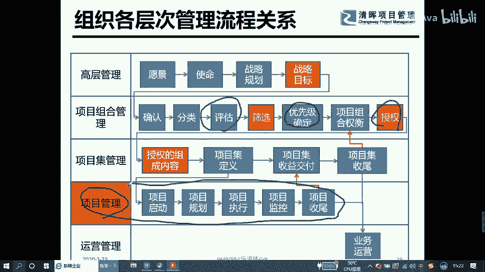

这是我们项目管理要做的事情，那什么是项目这个地方的时候我们可以看到哈，项目有大也有小，比如说左边这个地方，我们可以看到左边和右边两个地方，左边是比如说英国脱欧，肯定是一个大型的项目。

比如说我们的联防联控，比如说我们核电站的建设，还有卫星发射，有内待遇，这些都属于我们的项目，各位记住了哈，如果我们在企业里面，有机会接触到左边的这个项目的话，那你虽然是一个项目经理。

你有可能是一个c e o的这样一个级别，或者c x o的这样一个级别，当然那我们也会有小型的项目，小型的项目，就比如说我们开发一套系统家族理由，或者企业庆典，或者引入一条生产线，设备的升级改造。

这些都是我们通常说的项目的一个产生，那项目其实啥就是一件事情，在既定的规则下把这个事情做完。

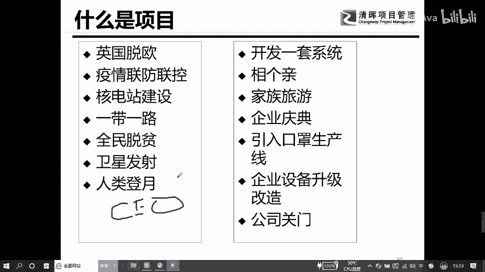

我们都可以把它叫项目，那在做项目的过程中，我们注意到一件事情，它最早来自哪里，来自于我们五六十年代的时候，我们做了一些大型的项目，比如说我们的两弹一星，或者我们人类登月，那那些维度的话。

还有我们的狗洲坝的一个电站的建设，这些沉淀下我们宝贵的管理的一些经验，这里面给大家分享一下，无论是现在还是过去，我们都把它继承下来了，做任何事情，第一个我们要有清晰的目标。

比如说2020年各位想要做什么事情，这个目标是要把它确定下来的，我们曾经很多人在2019年12月份的时候，很多人2020年都会有清晰的目标，然后在今年的时候，2月份绝大多数的目标改了，健康就好。

对不对好，那么接下来关注第二个维度，我们要有相应的里程碑，在每件事情的时候，我们有一个5年的计划，你不能5年之后再去关注，我们有可能两个月，三个月或者季度为单位来追求关注。

这个我们叫阶段性管控来去做一个对接，第二个维度就是我们要学会做任务分解，任务分解就是把复杂的事情简单化，复杂的事情简单化，我们才能够按照专业化分工，给到相应的员工来去开展工作，但是在做任务分解之后。

我们要学会一件事情，授权不授责，什么意思，我们把这件事情交给我们的员工，但是如果这件事情没有做到预期的目标的时候，责任还是分配任务的，那个管理者一定要记住这个维度，第三个维度就是我们现在说的一件事情。

我们要相应的风险管理，一个能力，做任何事情要给自己留有机会，就是留有调整的一个空间，现在我们说的风险管理就是这个维度，最后在管理学上特别重要的一件事情，就是我们强调所有的所有的事情都是实用至上。

再给大家举个例子，我们很多的公司，我们现在和同学们应该遇到这么一件事情，你们做的一些项目，你会发现一个特别神奇的一件事情，这个事情做完了，然后做完的那一刻特别开心，等做完之后，1年2年3年没有人去用它。

然后这个地方又干嘛，做完了而已，没有做到应援这样一个动作。

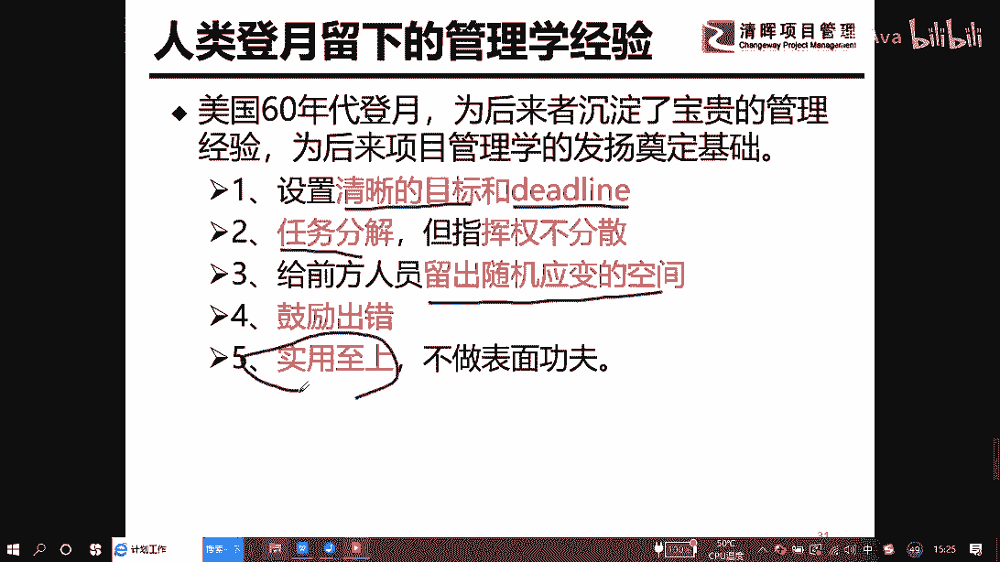

就到我们通常说的，大家现在看到我们上面课件上的一个ppt，我们有一个概念，叫我们在2020年2月7号的时候，我们在做一件事情，就是我们说的联防联控这件事情，联盟联控这件事情的时候。

我们注意到就是16个省来去对接16个市，每个省对接一个事情，通过下面这张图的时候，我们可以做到几件事情，第一个我们把它模块化了，就是我们做了w bs的一个分解，我们把所有这么大块区域。

我们按照每一个省承担一个市的这样一个责任，分工下去了，那这样的话我们监控起来就干嘛更方便，然后责任主体落实的也会更具体，第二个维度就是我们资源分配，大家可以看到一件事情，比如说我们广东这件事情。

广东我们对应的为广东，按照正常情况下来讲，广东它不是很有钱的一个地方吗，很有钱的一个地方，正常他还可以对，对应到我们说的孝感或者黄岗这样一个维度，但是我们在对接的过程中。

为什么我们不去对最艰难的这个部分呢，这就是我们说的资源调配的一个问题，广东这个地方虽然很有钱，但广东的医疗其实是不是那么好的，所以他没有那么多的能力来去对接重灾区，第二个问题是广东本身也是干嘛。

也是务工就业的重要的一个输输入的一个地方，所以这个部分是他们在资源分配的过程中，会去做的一个调整，在整个这个地方，就是我们最简单的一个把它项目化，项目化就是把复杂的事情把它简单化，然后模块化之后。

我们再去做一个资源的分配，在资源分配的过程中，我们所有的这些接口对接的过程中，我们还会有上面的一个联防，联控的这样一个指导委员会在上面去做事情。

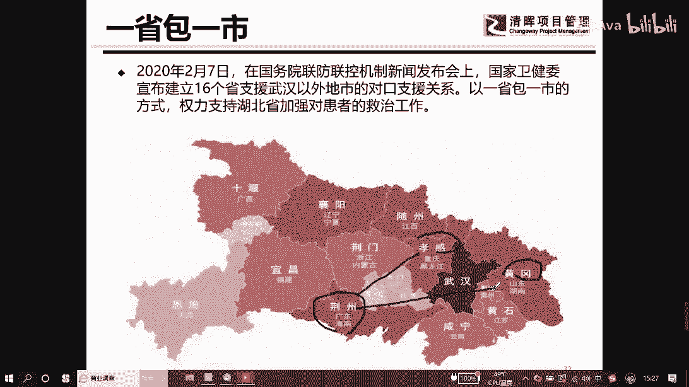

好，那我们刚刚说了这么多，我们刚刚说过什么是项目，那我们接下来对接什么是项目管理，所谓的项目管理注意到几个字，有限的资源一定要记住一件事情，有限的资源，有限的资源，这个维度的话。

就是我们很多的时候想要一些资源，但是要不到，那要不到怎么办，那只能在要道的这些资源情况下，怎么把事情给我做好，这个地方就会涉及到你的方法论的一个问题，你工具设备设施的一个调用的问题。

你如何做拿来主义的问题，你如何借助组织过程资产力量的一个问题，作为项目管理来讲的话，它其实是从我们投资决策开始到项目结束的前，过程都要去做项目管理，那项目管理关键梳理出来，其实大概就是六个关键词。

第一个我们要学会做计划，计划这件事情的话，所以作为项目经理，作为部门主管，你的p p a的能力，就计划管理的能力非要要非常的强，就是我们把我们的事情按照分段的模式，或者分模块的模式。

或者我们以时间为单位，或者我们面为单位，无论如何的话，要适合你们企业的管理成熟度的模型，第二个我们要去做组织，我们要组织资源，组织技术还用干嘛，组织所有内外部可能能够借用，得到的这样一些东西。

来去支撑我们的工作指挥协调，但这个地方特别给大家强调一件事情，就是评价在我们的项目管理体系里面，我们的评价这个部分的内容的话没有做得太多，但是实操的过程中做到评价特别重要。

这个评价的话我们会关注有效评价，还有干嘛，形式上的评价，那在后面讲数据信息，我们会给大家简单做一个分离好，对项目管理这个部分来讲的话，那我们刚刚会线上可能会有同学们说的，那谁应该学项目管理呢。

你记住这句话，在现在这个环境下，每一个人都应该是项目管理者，因为未来我们随着业务的一个推动，随着我们科学技术的一个发展，我们很多东西我都会作为单元化或者模块化。

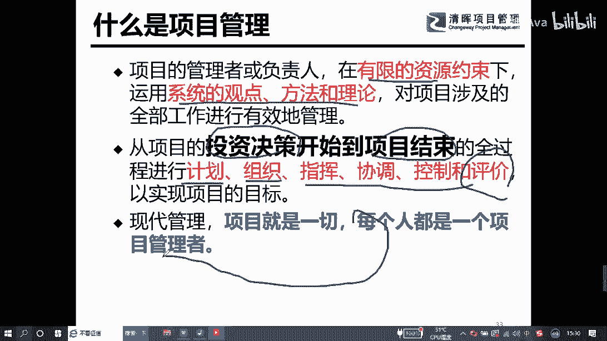

那这个地方要求我们每个人都有干嘛，作战的能力，做的这个部分，在整个落实的过程中，我们注意到项目管理刚说过，所谓的项目管理是把我们复杂的事情，把它干嘛简单化，作为项目管理，我们所需要实现目标。

什么是项目的目标，我们有个要求时间管理，比如说我们这次湖北武汉，我们做了雷神山或者火神山的话，我们做第一个时间要求一周或者十天，我们以十天为单位，这是时间的要求，那第二个维度范围管理。

比如说我们需要1000个床位，这是我们说的范围管理，比如说我们要3。4万平方，那第三个维度就是我们的质量要求，在我们做联防联控这样一个重大的项目的话，我们的质量肯定要符合国际或者国内相关的。

一个医院建设的一个标准，那其中有一个，我们在这次是我们比较没有考虑的，就是我们说的成本管理，这个维度，在所有的项目过程中，我们绝大多数都会受成本的控制的一个影响，好确定目标之后，接下来谁来做。

那这次我们的武汉人那两座的话，我们其实是由中建三局他们来承接的，这属于内部资源，那他是没有办法完全做好这件事情的，那需要有干嘛，外部的资源，外部的资源就是我们会涉及到社会上的供应商。

或者我们的一些志愿者共同来完成，那无论是志愿志愿者还是我们供应商的话，谁手上掌握的这些志愿，我们需要跟他们干嘛沟通来对接好，有了目标，然后我们有了资源，接下来的时候，我们要看看谁是我们过程中的拦路虎。

所以我们最下面这个可能你们看不到的地方，是我们说的风险管理，风险管理是我们要做最好的，干嘛最好的一个计划，但是我们要做最坏的打算，在所有的可能发生的意料之外的事情，在风控尽可能要把它考虑进去。

当然所有的这些各就各位都做好的时候，那我们通常会有一个干嘛牵头的人，也是我们说的负责人，它来做一个整合，整合是什么，在我们所有的这里面可能会产生摩擦，那我们要牺牲什么来置换什么，由什么来做一个调整。

这个部分我们把它叫整合管理，那日常工作中我们的整合，包括技术的，业务的。

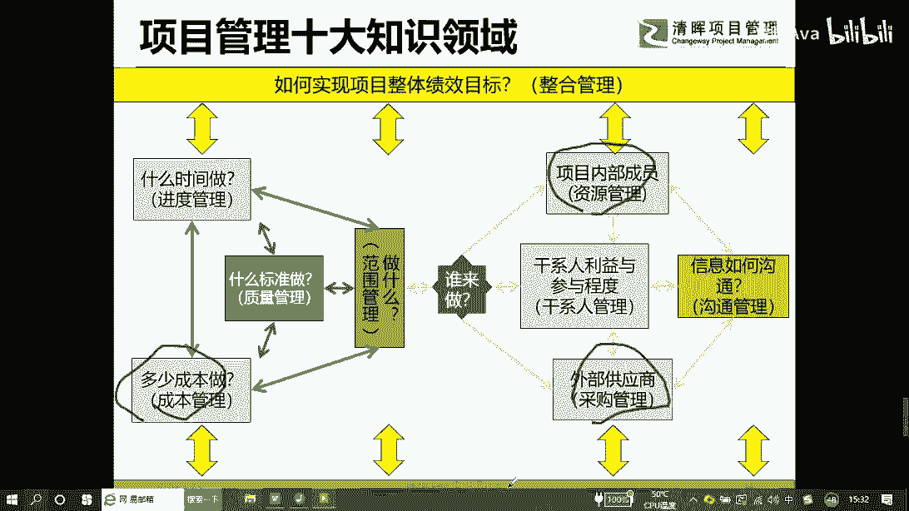

专业的资源的，还有接口的等等，内部的外部的综合的一个整合管理，我们刚刚说过目标这件事情，大家注意一件事情，通常作为项目经理，它最重要的目的是，防止我们左边的这个三脚架的一个失衡。

那实际工作中我们这个三脚架肯定是失衡的，因为日常工作中我们要牺牲什么来置换什么，特别重要，比如说我们马上来冬奥会，冬奥会这样一个项目的话，我们最重要的可能就是干嘛，就是时间，所以这个部分就是我们的底座。

那我们这次我们的一个武汉的这样一个项目，最终呢也是干嘛，也是时间，但是我们还有一个，比如说像核电站这样一个项目，它最重市场是不质量，所以不同的项目它一定有一个底座，哪个是最重要的，最重要的那个部分。

我们是不能干嘛，不能把它受影响的，那其他的角线是可以偏的，比如说如果时间不变的情况下，那我们有可能会干嘛，有可能成本会增加，然后我们干嘛范围也会受影响，这个就是我们会谈到的三重制约。

如何来去管理好这个事情，作为项目经理。

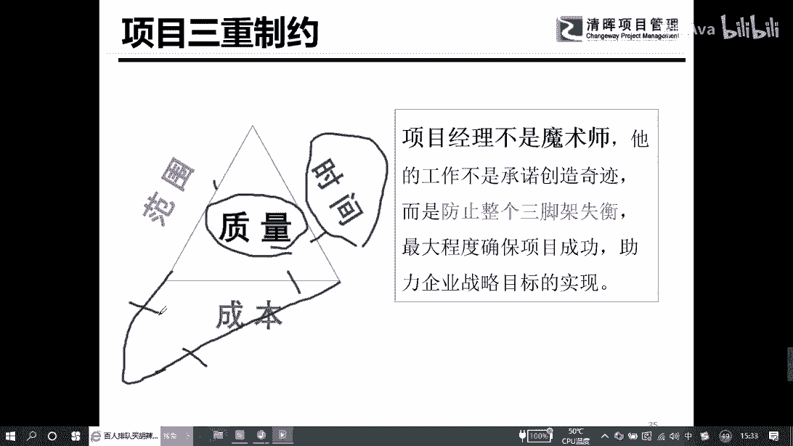

非常多的时间和精力要花在这个部分好，那么接下来关注这个部分就是做项目，我们为什么要把它当项目来做，其实很简单，就是所谓的项目就是我有一件事情要做，什么时候触发一个项目，就是我们公司，我们行业。

或者我们国家，在当前遇到一些问题或者机会的时候，我要解决这个问题，或者触发这个机会，那我一定要形成一个解决方案，在日常工作中，我们把这个解决方案的实施过程，我们把它当项目管理来做。

所以一旦这个项目做完之后，最终的目的可能是解决问题，会把这个机会给我触发了，那这个一旦达到预期的时候，那我们就产生了所谓的商业价值，这是我们会谈到的项目驱动这件事情，各位在实际工作中一定要记得一件事情。

项目它是有来源的，项目最后的一个目的，他要不就是解决我们的问题，要么就是为了创造我们的机会，它不会无中生有地产生的，那解决问题或者创造机会，我们会有一系列的手段，我们被选中的那个手段。

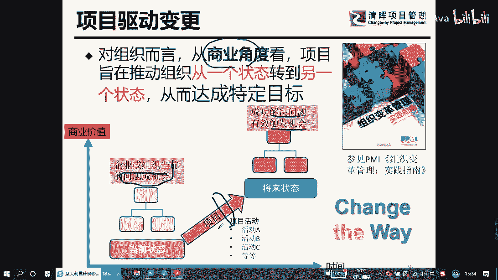

我们就会把它以项目的方式来呈现，这就是我们通常说的项目管理，那在做项目管理的过程中，他有没有达到我们所要的预期呢，这个地方就会涉及到工作需要数据，工作叫信息，还有我们的绩效报告，我们先给大家看待会。

我们现场的同学们可以在白纸上自己画一下，第一个维度工作绩效数据，什么叫数据，比如说我们做这个项目花了60天，我花了200块钱，那这个地方叫严死观察的数据，那工作数据这个东西它是没有任何意义的。

在数据的过程中，我们要学会做分析，要结合他的背景去做分析的时候，我们才能知道这个数据到底能给我们，什么样的方向，所以这个就会形成工作绩效信息，什么叫工作绩效信息，它是通过一系列的整合分析出来的数据。

比如说我比上1年多花了10万块钱，同比什么什么的偏差分析，我们把它叫信息，当然在这个地方的时候，大家一定要注意到相关的背景，这个部分如果不是我们这次特殊的情况的话。

我们不会用十天的时间来去见识建一座医院，那很显然大家都知道这个经济效益肯定是干嘛，肯定是不行的，所以我们通过看到数据的过程中，一定要知道数据背后的背景到底是啥，最后一个维度就是我们说的工作绩效报告。

作为项目经理，作为管理层，你非常重要的就是数据分析的能力，你能够通过杂乱服装的大数据，或者我们干嘛，我们公司的一些平台，或者我们系统提供的一些数据，在数据里面找到一些干嘛，关键信息，由此触发一些臆测。

或者我们现状的分析，那最终的时候通过数据分析，我们要给出相应的解决方案，这个就会形成我们的工作绩效报告，工作绩效报告我们通常会形成到我们的ppt，那一般是谁来看呢，谁可以看对某件事情的决定有话语权的人。

他来去看，所以作为项目经理的时候，你要记住，绝大多数的问题都是在你手上把它解决掉的，当搞不定这件事情的时候，要注意这几个字。

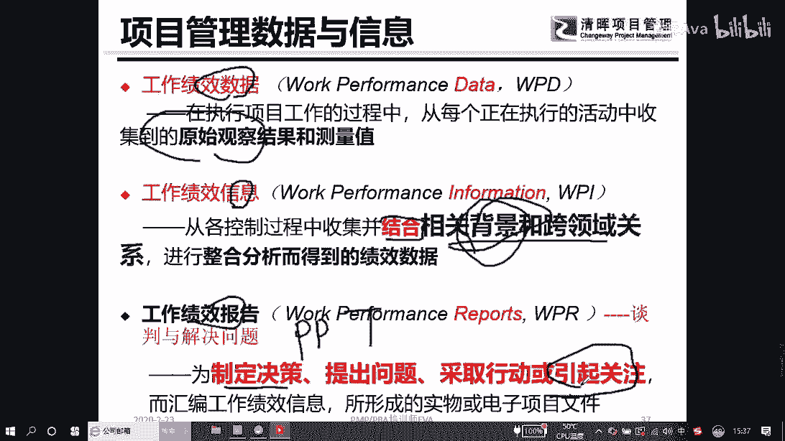

引起关注，一定要记得及时的引起关注，而不是放在自己手上哈，这是我们通常说的这个部分，那么接下来给大家看一个简单的一个样例，大家可以看到我们p p t上面有一个维度，就是比如第一个维度。

就是我们在除夕的时候之前，我们有500万人离开了武汉，大家觉得这个市场，这个一定是我们通常说的啥数据，看到没，就是这个是我们通常说的数据，然后呢，我们某一天出现了这么多的样例，这个也是我们的数据。

大知道哈，就是2月份突然之间出现1万多确诊的时候，我们很多人都恐慌了，我们害怕害怕啥，害怕是不是越来越严重了，可是这个时候国家卫健委的时候及时出来干嘛，给我们解释了，因为他们的解读，所以我们干嘛。

我们又有了安全感，他解读的东西产生的，我们会把它叫啥信息，这个叫分析好，那离开的500万人里面，我们说过半的人会集中在孝感，黄冈或者荆州，那这个过半的一个分析，那我们就是做了加减乘除的数据。

我们把它叫信息做的这个部分，那我们刚刚说的一省包一市这样一个维度，也是我们通常说的干嘛数据做的这个维度好，做到这个，比如说第六个连续十天确诊为个位数，这个一定是经过分析的，我们把它叫啥信息。

那确诊了这个我们把它叫数据，一定要记住，在日常工作中采集到数据特别重要，如果数据都采集不到，那我们是没有办法知道数据背后的故事，如果不知道数据背后的故事，背后代表的意义的话，我没有办法能够去预警。

没有办法能够去预测，没有办法能够快速反应，所以这个地方是我们会谈到的，比如说我们13降13连续下降下来，这个部分也是我们通常说的干嘛，数据做的这个维度信息，所以在整个我们在项目管理也好，还有部门主管。

只要将来作为一个管理者，你一定要有个能力叫数据分析。

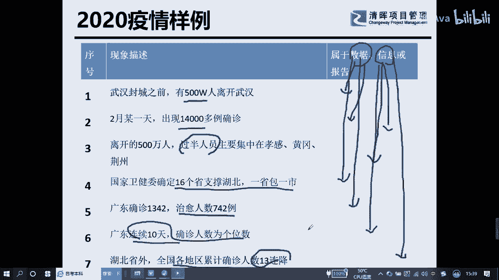

数据诊断，数据管理的能力，这个是项目管理能力非常重要的一个部分，好最后给大家简单分享一下，我们大概用几分钟给大家分享，另外一个执行力的一个工具，其实现实中的话，我们都会有一件事情。

就是谁都不愿意去承担责任，因为责任这件事情意味着干嘛要挨板子，但是呢我们每个人在承接一个任务，或者在承诺帮管理层做一件事情的过程中，你一定本身就在承接这个责任，责任这件事情就像一只猴子，为什么。

因为它会被跳来跳去，所有人都不愿意承担责任，所以注意到一件事情，如果你不懂得如何回答下属的寝室的话，就是你知道下手会给你下套的啊，所以作为管理者的时候，一定要记得一件事情，随时关注跟下属怎么去沟通。

跟你的属下沟通的时候，一定要记住一件事情，他的事交给他做，你的事你来做，所以如果有一天你做了员工的事情的话，那你就不再有时间，然后你也不再有周末了，所以你会发现这个集团里面有很多的员工哈，特别轻松。

但但对应的老板特别干嘛辛苦。

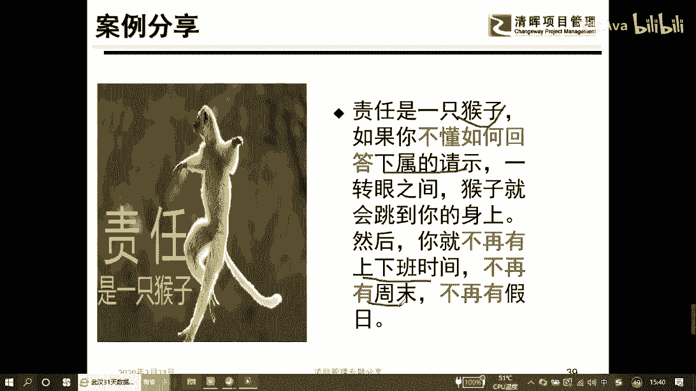

这个部分就处于我们执行力管控，失效的一个问题，也就是责任转移这样一个问题，好在日常工作中的话，我们刚刚说过，作为责任，谁都不愿意去承担，在承担责任的过程中，我们都想把这个事情推出出去。

所以我们有可能会明着推下去，我们也可能会干嘛，暗中又把他推回来，所以作为老板，我们会名正言顺地把任务分配给你的下属，那周围下属的话，他如果不愿意做这件事情，他会说老大这件事情一定要做啊，如果你不做的话。

没有随便做啊，怎么怎么着，他对你一段，他对你一顿狂拍马屁的时候，你会发现哎呀妈呀，这个事情好像又被他给吓套好，那作为下属的时候，他不会直接给你，他有可能也会干嘛挖坑，他会说哎老大这件事情的时候。

是不是可以交给小李啊，小张啊，他他他来做，这个时候如果老板拒绝的时候，你的下属他有可能会无缝链接的说，哎张总让你来做这件事情，那如果这个下属，他不是那么一个会确认的人的话，他就会挖坑了。

那他如果不愿意的话，又会把它跳上去，所以线上的同学们，你们可以关注一下，你自己有多少出现这样的一个情况。

那么给大家说一个例子哈，就是通常情况下来讲的话，我们经常会在公司独打照面，对不对，那我们有些时候如果你正在走在大厅的时候，然后你的下属找过来跟你说，老大早上好啊，吃早餐了没，然后这个时候你会说帅呀。

然后有什么事你说吧，这个时候呢你的你的下面的员工会欢快地说，老大事情是这样子的，请听我说，听完的时候你特别豪爽的说一件事情，哎呀妈呀，这个事情让我考虑一下，再通知你，各位如果在现实工作中。

你这么说话的话，你就被下套了，被谁被你的员工给下套了，这个时候只会得到一个什么样的结果，你的下属很欢快地说，老大这个事情做的咋样，老大这个事情做的咋样，老大还没有帮我做吗。

这个时候责任就转移到你身上去了，所以作为管理层的时候。

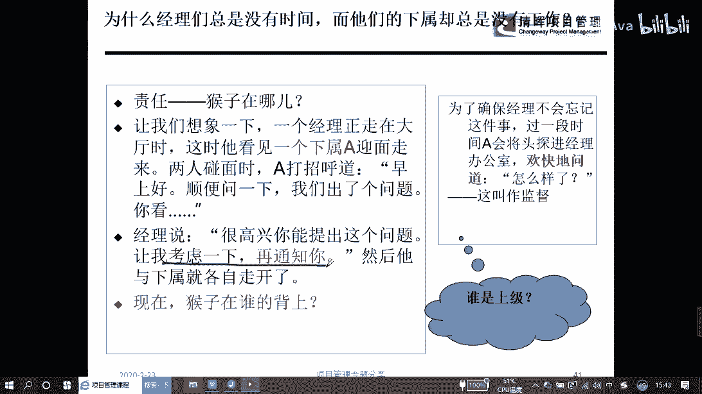

一定要记住一件事情，谁的事谁来做，那我们怎么来跟你们下面的员工去沟通呢，这个时候就会涉及到一件事情，你应该引导他，让他来去思考，他应该怎么来解决这个问题，那这个时候有些下属，有些员工他会耍赖，你知道吗。

他说老大，我要知道我还找你干嘛呀，我要知道我就不给你买牛奶了，对不对，那这个时候的时候一定要引导下属，引导下面的人，让他去想办法，你只帮下面的人做选择题，绝对不帮他做干嘛问答题。

所以你应该让他提出方案来给到你们讨论，那这个时候记住一件事情，事情还是跑到员工的厦门去了，好在整个落实的过程中，我们注意到一件事情，你的下属只能回去自己想解决方案，他想完了a b c3 个方案。

你一看发现aa方案比较好，那你这个时候说哎小张就直接用a方案吧，如果有一天a方案失败的时候，你知道小张会怎么对待你吗，他会用很愤怒的眼神或者暗示的眼神，面向他的老板，他的上面的老板说。

这是不是你同意的吗，所以为了避免责任推卸，或者我们知道这样一件事情的时候，我们要学会一件事情，让他来去干嘛。

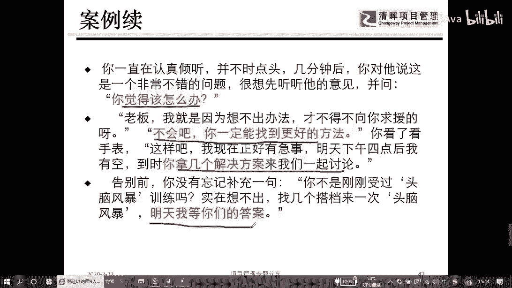

提出解决方案，在提出解决方案的过程中，一定要记住一件事情，要引导你的员工说出你想要的方案，这个就是我们通常说的，要培养员工的责任心，培养员工的担当的责任，这是我们通常说的，我明白了。

我觉得这个方案特别好，所以各位合作管理法则在我们企业管理层，在管理员工的过程中，是一个非常重要的一个执行力工具，记住了什么事应该交给什么人去做。

我们不要发生转移这件事情，那在整个管理法则的过程中，我们把它对接到项目管理体系，我们wifi就这几个事情，第一个我们要确定r sci，每个人只能做自己的事情，就是一对一的责任制，第二个维度。

我们要给他一个时间的要求，让每个员工做好自己的事情，不能出现任务在干嘛，责任的推卸的情况，第三个部分，为了保证员工在干完他自己活的时候，能够有效的推进，我们要干嘛，即时动态的去跟他们沟通。

解决他们的后顾之忧，第四个部分，我们要学会授权，刚刚我们给三个员工去做任务分配的过程中，我们注意到一件事情，不同的员工能力不同，我们的管理方式也不一样，所以我们记住一件事情。

不同的员工要有不同的管理模式，最后一个维度，我们要学会激励这件事情，养猴的人也需要快乐，就是你的下属在做任何事情的时候，一定要学会及时的认可与激励，你不能说他做好一件事情，然后半年之后。

说小张半年前那个事情做的特别漂亮，他有可能都打算离职了，所以在鼓励在激励员工的时候，一定要干嘛，及时的动态的去做好事情，在监督检查的时候，一定要记住一件事情啊，所有的人都会怕精神，包括管理层自己。

所以记住另外一句话，检查产生执行力，如果不检查，我们是没有办法有执行力，没有执行力，我们没有办法达到预期的效率，在整个项目管理体系里面，我们的监控的过程领域，占了我们整个的非常重要的一个部分。

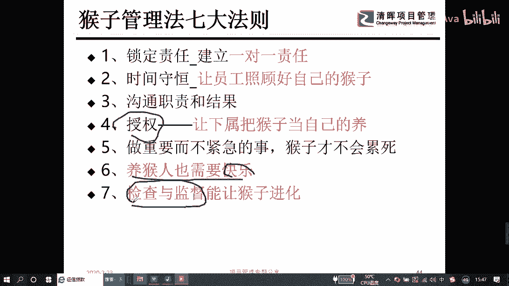

这也是我们在日常工作中需要关注的一件事情，最后我们关注一件事情，就是现在这个社会啊，我们都说要学习，但其实学习的东西的话怎么着，所以大家关注一件事情，一定要学会分享跟交流，在这个知识大爆炸的时代哈。

我们及时的跟别人分享跟交流促进干嘛，我们快速的吸收更多的知识，在整个这个维度，我们要做几件事情，第一个我们要学会资源整合的能力，这个决定你在企业有没有业绩，你会发现有些员工吧，他1年到头天天在公司上班。

然后他的加班时间可能达到500个小时，甚至1000个小时，然后年终倾向于考核，发现诶这家伙他就得了一个c，那为什么会得c这个地方，考虑这个看到没业绩的关键能力，就是你做事了，但是没有做到公司想要做的事。

那这个部分特别重要，那还有一个维度，就是我们说的独立分析问题，还有解决问题的能力，当然这两个部分的能力，在我们未来的项目管理体系里面。

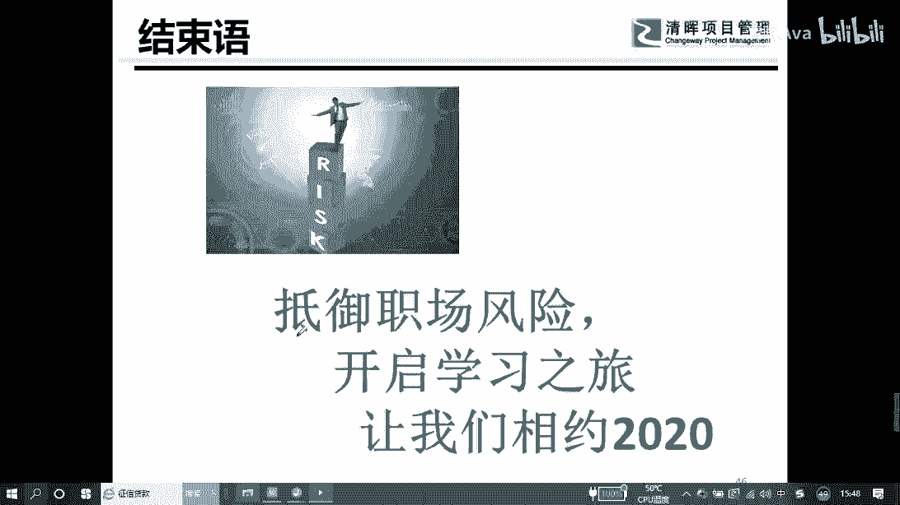