# 学习项目管理体系，掌握职场转型利剑 - P2：02.新环境下，职场需要具备的能力储备 - 清晖Ava - BV1dT411y76r

呜好，接下来我们关注第二个部分，我们所有的人基本上都是在职场上来，去做一个竞争，在竞争的一个职场上，如何保证我们在退休之前是有相应的一个震动，竞争能力的，这个部分的话，我们给大家分享一下能力储备。

线上的同学们可以看一下，我们这里面有个案例哈，就是我们说的呃，卡里的这样一个管理层，他却在给员工分任务的时候，他在做三件事情，我们给大家大概30秒的时间，大家可以看一下，然后你可以对接一下日常工作中。

你的老板给你的定位是1号员工，2号员工还是3号员工，给大家三四秒，大家可以看一下，我们可以看到哈，对不同的员工，这个老板他分配任务的方式是不一样的，对1号员工的话来讲，他就一句话，你就把活给干了吧。

那对2号员工的话来讲，他给他安排任务的时候，还给他一个时间的一个要求，对3号员工的话来讲，他不仅给他任务，还给他时间要求，甚至他要求质量的一个程度，也就是不同员工他的能力水平不一样。

管理层对员工任务分配的一个干嘛，要求是不一样的，如果你的老板给你定位，是最后3号的那个员工的话，那就意味着你在老板心目中的能力，是没有那么强的，这就意味着你需要快速的填补自己的干嘛，知识的一个空白。

如果你是1号员工的话，那我们注意到老板是特别喜欢1号这种员工的，为啥因为老板说的一个事情，他做了，老板没有说的事情，他也把它做好了，这个就涉及到我们每个员工，在企业里面其实都是人才，那我们都有四种人才。

就是我们大家可以看到ppt里面我们有d1 d2 ，d3 ，还有d4 这四个维度，第一这个维度的话，就是我们通常说的值得培养的，那我们先来看，如果你是第三这个维度的话。

对用人才有才能的才才华的采这个维度的时候，他的能力是很强的，但我们可以看到它重现下面，他的意愿是很薄弱的，真的意见很薄弱，然后能力很强的这种员工的时候，我们首先要从精神上来去做一个激励。

让他留下来的欲望，所以我们要用彩触发他的一个成就满足感，那第二个部分，对于我们有能力有意愿的这样的员工，我们只做一件事情，他的一个信息不被猎头给挖走就可以了，那对这种员工。

我们一定要授权给他足够的发展空间，让他干嘛得到足够的一个成就感满足感，还有幸福感，第三种员工就是我们说的低腰这种员工的话，低腰这种员工的话，就是我们通常说的大学毕业生，或者说我们刚进入一个新的领域。

我们还是一个菜鸟，那通常很多的企业都会做一个师傅，带徒弟的这样一个机制，或者很多的企业会有一个新员工的一个培，训的这样一个机制，那我们会通过异财的方式，然后把它茁壮地培养起来。

当然在我们第一的这个维度的话，有可能会进入第三，有可能会进入第四，但是如果第一这个地方就是木材的这个彩，它如果没有办法进入d3 和d4 的话，那它有可能就会变成我们通常说的裁剪的彩。

所以大家一定要关注我一下，你自己要定位你现在属于哪一象限好，那我们接下来关注第二个部分，就是我们通常说的裁剪的裁，裁剪的裁，在职场的过程中，我们通常建议给员工一个机会，因为我们通常说一句话。

就是我们不要轻易的做砸别人饭碗的一个事情，那为了给员工一些机会的话，我们是要双向来去做的，一方面培养他的才能，一方面培养他的意愿，所以这个地方的话我们是双向来去做一个激励，当然如果我们一直都搞不定的话。

那这个员工可能对企业来讲就是负担，所以你发现现在很多的企业都在做一件事情，每年它会有10%到15%左右的，一个员工的一个流动力，当然如果这个企业，它的人员流动超过20%甚至更多的话。

那我们每个省每个市的社会劳动保障部，他是会找他们谈话的，所以呢注意到一件事情，你先要确定你是处于人才的哪个梯队，然后由此公司会对你做一个不同的培养，你会发现公司对你没有任何的一个干嘛。

任何的一个动作的话，那要不就是你是我们说的财富的这个财，要不有可能是干嘛裁剪的，这个裁，因为已经干嘛没有兴趣了哈。

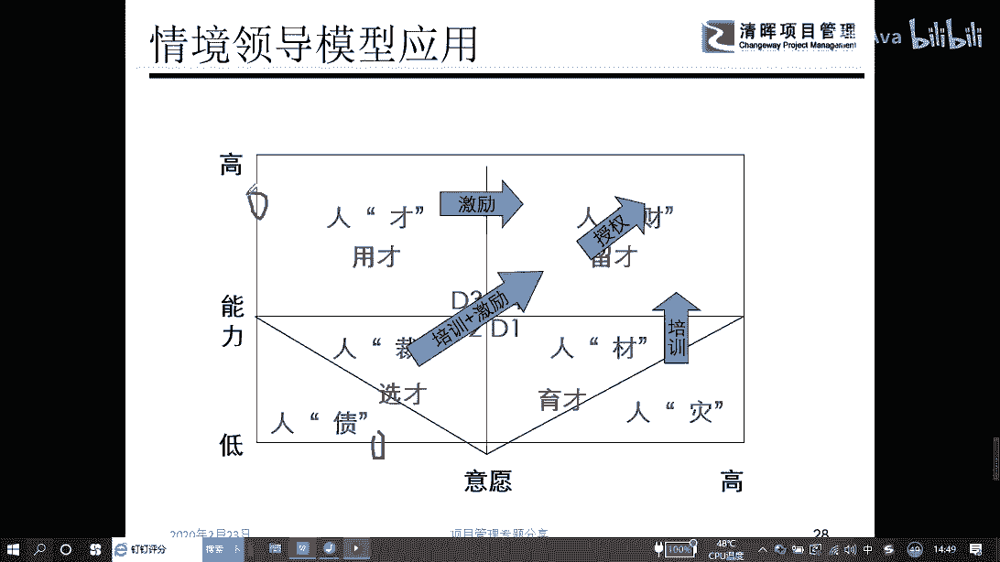

注意到这个部分在职场的话，我们都有相应的一个能力储备，我们课件上就是ppt这上面看到的哈，就是我们当时在线下上课的过程中，我们会通过我们的分层的一个知识体系，给大家来组成的，剖析这个地方的时候。

这个能力是我们从你进入职场到你退出职场，我们一直都要滚动式的去补充和完善的，这个部分，我特别强调两个东西，就是为了让人职业竞争能力特别强，第一个维度就是人际交往，我们身边遇到很多很多这样的一个案例。

这个人的能力特别强，特别特别强，但他一直都没有机会，那这个地方它有可能失效点，就是在人际交往这个地方出现卡壳的地方，那第二个部分就是我们说的思维检测，这个力有能力，然后他人际交往也还行。

那为什么又没有得到一些机会呢，这个地方又会涉及到一个决策，就是我们承担大家都知道哈，我们能不能做决策的话，其实背后对应的权利，那权利背后对应的又是干嘛，又是责任，所以责权责它这个地方是对等的。

在我们做思维决策的过程中，不是说你随便要去做，刚刚我们说行动跟思考，那如果在社会检测这个地方的话，我们就涉及到一个概念，先思考再行动，那思考这个地方就需要有足够的知识储备，比如说系统的思考。

系统的思考这个地方的时候，大家关注一件事情，比如这次我们不说一省包一市，大家都听过，就是一个省承接湖北的一个市，那比如说我们广东大家都知道，广东这边的一个医疗水平是非常的差的。

如果是说我们在资源分配的过程中，广东把最好所有的资源都分配到湖，湖北那边去了，然后广东这边在复工复产的过程中，人流又特别大，你会发现湖北的那个事他是搞定了，但是广东广州深圳等等这个地方又瘫痪了。

那这个地方他在做安排的过程中，就不是所谓的系统思考，而是局部思考，系统思考就是我们要有一个点，然后托生到一个面，把所有我们可能存在的东西全部要考虑进去，那第二个部分是我们的方案设计。

在整个做决策的过程中，你会发现你跟老板再谈一个方案，a方案被否决了，b方案也要再推行上去，如果b方案不行的话，我们要把c方案继续推上去，在做决策的过程中，我们做到一件事情。

就是我们要有多个方案随时做做一个备选，当然任何一个方案，它都会有它的一个干嘛漏洞的一个地方，所以这个地方每个方案背后，我们都要做好风控这件事情，风控这个地方的时候，当我听说啊。

这个不是我特别确定的一件事情，就咱这次的一个这么大的一个事件，其实在我们去年的武汉那边的，就是12月份或者说甚至更早11月份的时候，如果说他们的敏感度足够的话，我们其实今天全国人民都应该去。

直接线下办公了哈，那风控这件事情是啥，就是你要把所有未来可能发生的事情提前做好，布控，在这个地方的时候，我们关注一件事情，就是我们所谓的直言整合，那我们在整个项目管理体系里面。

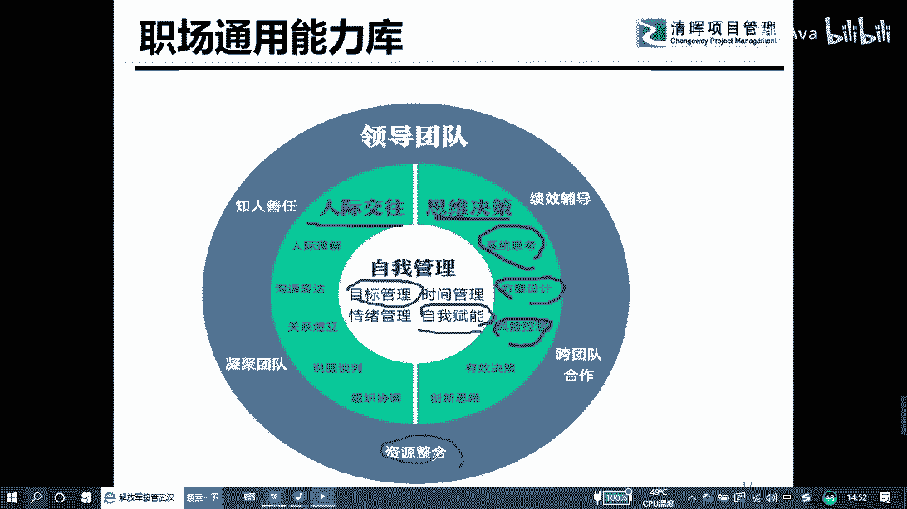

非常非常重要的一件事情是资源整合，待会我们在后面的章节再给大家补充一下，好，那刚刚说过这些能力，我们需要用一辈子的时间，在退休之前，我们都需要持续的把自己的能力，做一个充分的一个补充。

当然在人类学习储备的过程中，各位一定要注意的两件事情，第一个就是大家看我们p p t，下面一个叫行业所需的能力，行业属性的能力就是你在哪个行业，你在哪个行业是要画权的，这个行业的知识储备。

足以让你在它里面能顶上一片天，那另外一个维度，就是我们通常说的公司所需的能力，例如你在it行业，你在it行业的话，那我们说的比如说腾讯这样一个i t行业，或者我们的阿里这样一个it行业。

那我们不同的it行业，对员工所需的能力的储备是不一样的，也就是你在人力储备的过程中，为了让你持续在职场上有一个干嘛，稳稳步往前走的这样一个过程，你的能力是要跟随着行业或者公司所需要的。

去做一个渐进的这样一个准备的过程，这个就是说我们的能力再强，一定要适用公司的需，要，适用行业的效，否则的话就是干嘛。

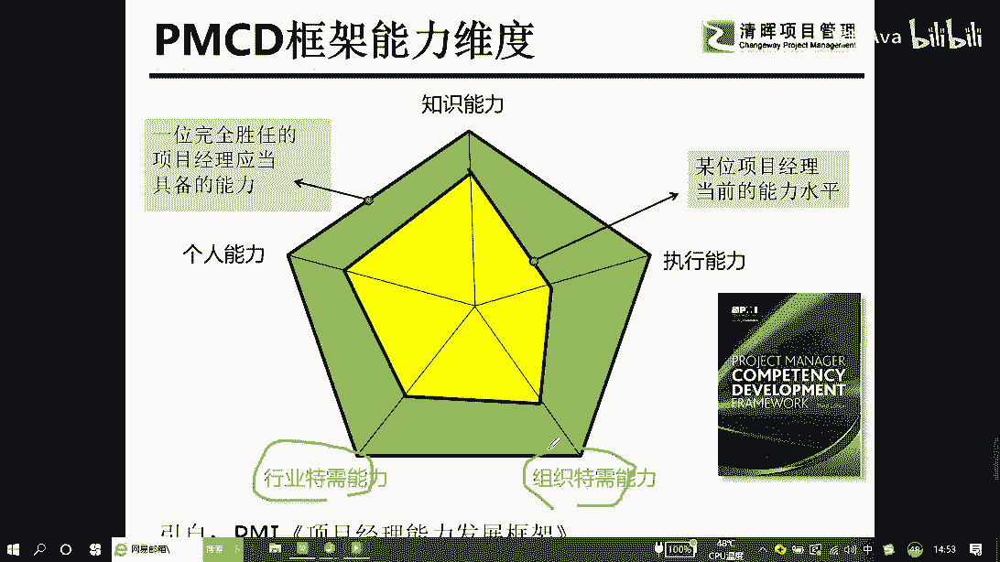

就是我们通常说的无能为力这样一个维度哈，接下来关注这个部分，我们给大家看一下，大家可以关注一下，在你的自己的草稿纸上看一下，就是如果作为你的话，如果就问你的话，你在这个能力的图谱上。

你觉得自己属于哪一层，我给大家一分钟的时间，第一个是职场小白，第二个就是我们通常说的，第二个就是我们说的独当一面，第三个部分就是我们说的准高手，看到没，第四个部分是我们通常说的高手，那作为你的话。

你可以思考一下你自己在哪一层，我们给它大概30秒或者一分钟，大家可以看一下啊，那有没有同学说唉呀妈呀，这个人类图谱上我找不到自己的位置呀，我必须得跟你说一件事情，如果在这个能力图谱上。

连你的位置都找不到的话，那你真的完蛋了，我跟你讲，那就意味着你现在缺陷补救了，就是你现在需要干嘛弥补过去的不足，然后要快速的进入，干嘛查缺补漏这样一个梯队，那我们现在默认所有的员工，只要公司要你的话。

你都是有能力去完成一件事情的，我们把这个叫职场小白，如果各位有印象的话，我们刚刚讲过人生都会有四个一，大家还记得吧，那我们接下来关注第二个维度，就是在工作领域里面就有绝对的优势。

然后我们稀有专业的一个能力，然后具备组织协调的能力，各位我们今天学的项目化的管理思维，就是从第二层开始独当一面这个部分，这个也就是我们通常说的一片天这个维度哈，那么第三个问题，如果你是一个准高手的话。

那就是啥呢，你既有分析问题的能力，这个人特别强烈，一件事情能够创造性地解决问题，这是啥意思呢，你能够把这个事情给我解决了，然后由此在解决这个问题的过程中，能够创造新的机会，新的商机。

甚至能够帮你公司的一个顽固的一个干嘛，留存链给我打通了，这个是我们说的创造性的解决问题，就是我们通常说的坏事，有可能干嘛变成好事，那当然最后一个的话就是我们通常说的干嘛，能够作为ceo这样一个维度。

它有前瞻性的战略布局，各位前瞻性的这个战略布局的话，你老人家如果需要继位的话，起码读个500本书吧，每个人可以自己看一下你到底阅读了多少，阅读量，就是我们说磁场的一个能力布局。

如果你现在属自认为自己是属于职场小白，这样一个维度的话，或者你认为自己是职场小黑，什么叫小黑，就我们刚刚说的，做的越多，挨骂的越多，做什么错什么，这是我们通常说的职场小黑这样一个维度。

那在做这件事情的过程中，如果你是这个维度的话，那你现在必须干嘛，要往这个方向来去做一个储备，这个就是我们说的，快速的形成自己能力的一个整合这方面。

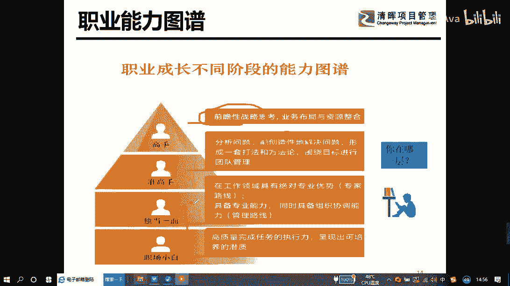

那接下来我们关注一下，就是作为项目经理，首先给大家解读一下哈，作为项目经理，他不一定是说一定在你们公司，一定是项目经理，作为项目经理的话，在企业里面可能它会叫管理层或者部门主管，这样一个概念。

那作为管理层的时候，我们注意到一件事情哈，你需要掌握的就是干嘛资源整合的能力，还有我们部门目标实现的一个能力，在这个地方我们分享一下他的能力三角，第一个就是我们说的项目管理的能力，什么是项目管理能力。

就是我们刚刚这次谈到的一件事情，比如说中建三局，他承接了雷神山和火神山这样一个项目，他在预定的时间就是十天的要求里面，把这个事情做好，这个就是我们通常说的项目管理能力，在这个地方给大家补充一下。

就在我们我们这个部分的话，我们发现一个事情就是我们的建造哈，就是我们中国的建造业项目管理这一块，跑的是比较前面的，那什么是战略和商业管理能力，这个是我们通常会说的一件事情，就是如果这个事情做完了。

但是做的这个事情吧，他跟你们企业的战略方向是不匹配的，那这个事情等于是白做另外一件事情，就是这个事情做了来下来了，跟企业的战略方向也是对接的，可是这件事情吧，没有相应的社会价值或者经济价值。

所以我们作为项目经理，我们要把一件事情给做了，那我们要契合企业的战略方向，也要以价值为导向，当然如果要做到这两个能力的话。

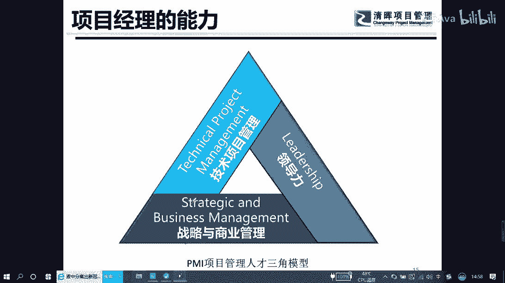

各位需要有个能力叫领导能力，待会我们来讲到，那什么叫战略，为了商业管理的技能呢，这个部分有一天我们线上的同学们，我们如果报考商业分析的话哈，如果报考商业分析的话，我们会侧重来讲这个部分。

比如说我们这次武汉那边在做一件事情，就是封一座城，护一国人，那这个这个概念就是我们说的高层视角，我们把武汉给封存了，但是我们保护了全国其他的一个人，这是我们说高层的一个视角，在整个落实的过程中。

我们怎么来落实这件事情呢，很多的企业哈，很多的企业，尤其是一些大型的一些企业的话，就会派一些，就就会通过公司的一个跟大学的一个对接，让他们去上相应的一个nba或者nba的一个课程。

当然如果你刚好没有享受到公司这样的，一个机会的话，那我建议你在35岁左右，然后自己口袋里的银子还够的情况下，你可以尝试着去上相应的nba或者nba，这样一个课程，那我们说项目管理技能。

项目管理技能这个部分，我们待会在线下，我们线下的一个课程大概是5+2，我们通过整个整整五天的时间，我们会把项目管理的技能，跟大家做一个全方位的剖析，那实际上什么叫项目管理技能，其实翻译过来。

就是我们按照相应的一个系统化的，一个结构化的体系做资源整合的情况下，有计划的，有节奏的，然后把这个事情给我做好的一个能力，我们把它叫项目管理，一个技能，在整个做项目管理技能的过程中，我们注意到一件事情。

在这个地方特别重要的一件事情就是领导力，你可以知道要项目管理这个部分，知道要做什么事情，那通过领导的是让谁来去做这些事情，所以愿意心甘情愿地帮助你做这个事情，这个特别重要，在这个地方的时候特别强调。

我们在线上的同学们一定要搞定一件事情，人是所有项目中的共性，这个地方强调什么呢，强调如果我要做好一件事情，我就要了解这个人，我在了解这个人的时候，搞定这个人就可以搞定这个事情，所以当大家会有一个误区哈。

我们说哎呀我的老板是不是一定有领导力的，作为管理层来讲，作为部门主管来讲，他一定是一个管理者，但他不一定是一个领导者，那管理者的话，他是通过萝卜或者棒子这样的一个手段，引导所有的人来去干嘛。

按照你的要求去达成我们相应的任务的目标，那领导者是干嘛，领导者是影响你脖子以上，如果说管理者是诱导你脖子以下的，那领导者是关注你脖子以上的，他是通过你思维的一个引导，让对方心甘情愿地追随你的能力。

这个我们把它叫啥叫领导力，所以各位一定要记得哈，你说哎呀，我就是个普通员工，我哪来的领导力，记住一件事情，行不是一定是管理层才有领导力，只要你有影响别人的能力，那你就具备了啥，具备了领导力这样一件事情。

那比如说我们这次事件的时候，我们这位老爷子，他就是一个特别特别优秀的一个，干嘛特别优秀的一个领导力哈，比如钟南山院士，他是一个特别优秀的一个领导者。

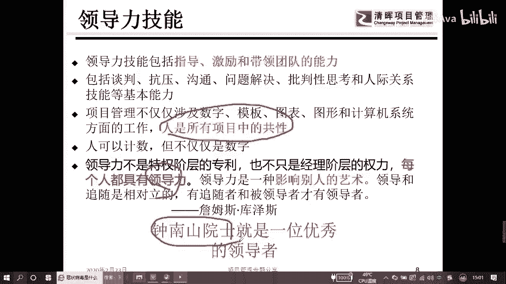

这是我们会谈到的一件事情，好那刚刚讲过项目经理需要的一个能力，在整个做项目经理能力的过程中，我们会涉及到一个问题，就是项目经理的职责到底是什么，项目经理的职责，我们强调一件事情。

就是他是项目的唯一的责任人，项目的唯一的责任人，这个地方关注几个维度，第一个它具备意见风险的能力，意见风险的能力，这个地方特别强调两个字，第一个意见意见其实就是通过过去的数据，通过过去的经验。

我们来推理出来的这样一个能力，那第二个维度是风险，风险是啥，还没有发生，将来可能会发生的，我们把它叫风险这样一个能力，第二个部分就是我们说的整合资源，在整合资源这个地方。

在线上的同学们一定要关注一件事情，我们绝大多数的包括自己的下属，经常会跟我说一句话，就是哎呀妈呀老大这个资源没有这个活，我干不了，然后这个资源在别人那里能不能帮我搞定，那对于管理者，对商务经理来讲。

所谓的整合资源，他要做三件事情，第一个获取资源，获取资源的过程中，有第一个拿来主义，我们直接从公司那边来获取资源，第二个我们要干嘛创造职业，就比如这次我们的口罩对吧，当然在全国这个过程中。

我们的口那个口罩它是医疗资源还是不够的，所以你发现我们很多汽车行业，我们直接就转化为做医疗资源这样一个维度，这是我们说的创造之源，那第二个维度，我们在获取资源之后，我们要整合资源。

就是把资源的效益放在最合适的位置上，让保证资源产生最好的一个效果，所以我们经常会说，作为普通的普通的社会大众，我们不要去用n95 的口罩，这个地方就是把合适的资源放在合适的位置上，在资源整合的过程中。

我们确保干嘛有限的资源产生最大的火花，那第三个维度就是带领团队，各位记住啊，是团队，不是团伙，什么叫团队向心力，大家能够拧成一股绳，我们把它叫团队，所谓的团队就是大家针对一个目标都是认可的。

我们朝着这样一个认可的方向，比如说我们这次，我们全国各地都派了很多医疗队伍过去，那他们一定是一个团队，因为他们有一个共同的目标，就是疫情不结束，他们不解散，他们也不回去好，而且他们认同这样一个目标。

在项目经理职责的过程中，我希望在座的各位一定要关注一件事情，自我成长，我身边的很多人都会跟我说一件事情，我老板不给我机会，这个不是我不能做，是别人没发现我的好，那在整个项目经理的职责的四大块里面。

自我成长是最重要的一块，如果自我成长这一块搞不定，那我们所谓的意见风险，所谓的资源整合，所谓的领导团队，等于就是干嘛没说一样的，所以自我成长这个部分，那自我成长里面强调两个事情。

就是你要知道自己如果要做好一个岗位，他需要什么能力，然后你自己的差距在哪里，所以差距的部分，然后通过自己主动的去获取，能够干嘛，让自己的技能储备适合你们这个岗位，这个公司甚至这个行业的一个需要。

这个是我们说的自我成长这个部分。

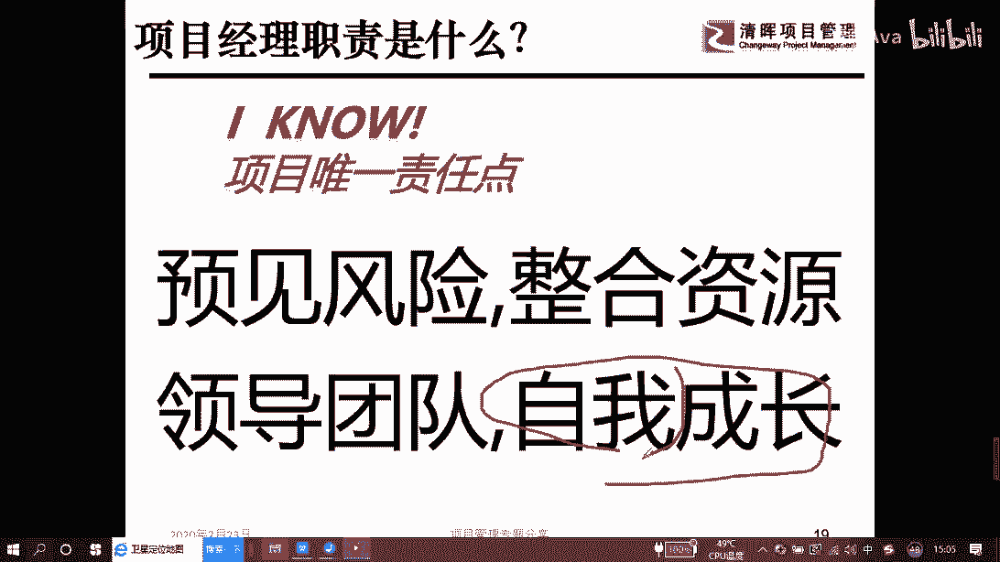

那么接下来给大家看一个部分，就是资源整合的一个样例，资源整合这个地方的时候，我们注意到。

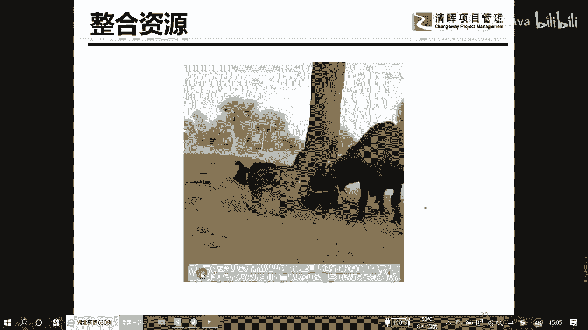

四星才赢得江湖。

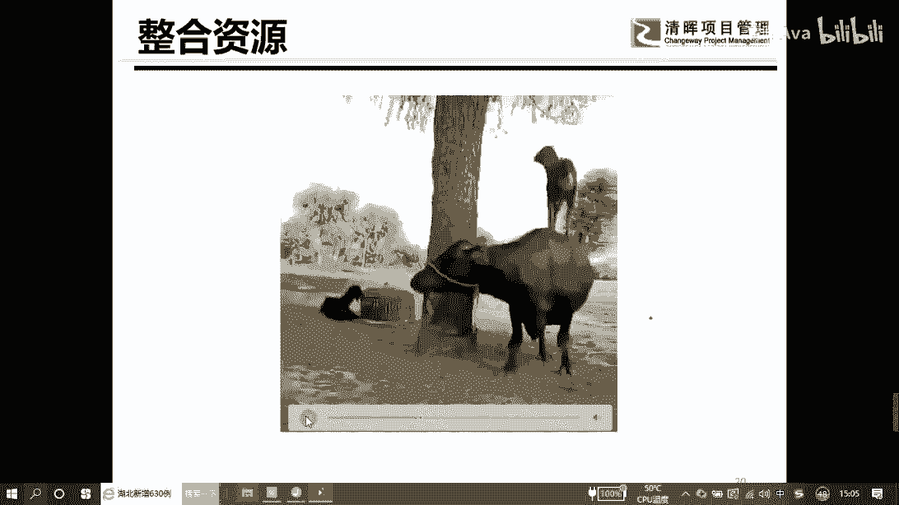

有多少时间发布的歌为共同一处看。

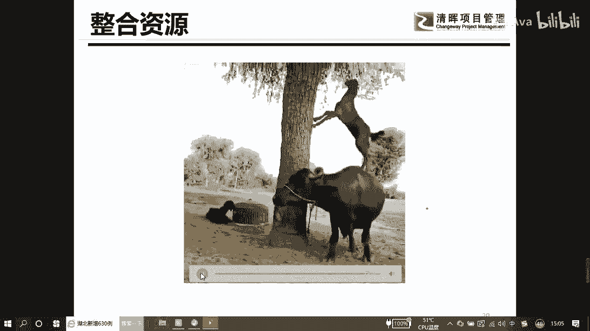

我想我不知道大家能不能看到这个视频哈，其实就是啥呢。

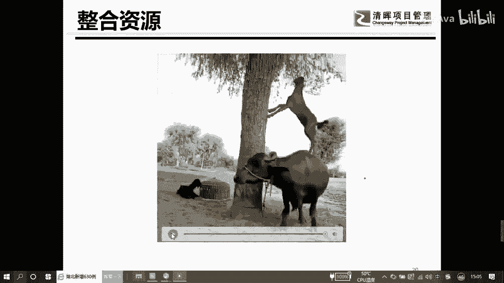

就是我们在做整个资源整合的过程中，自己才赢得江湖。

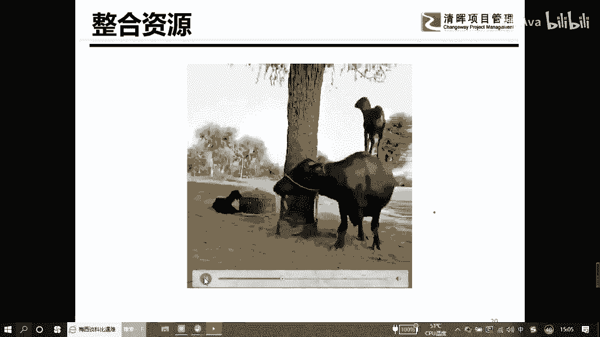

有多少时间满足了各位懂的非洲才会显，你会发现他有可能是想要来去获取那片叶子，但是呢他得不到，对不对，他得不到的人还可以借力，这个就是我们说的资源整合，再次给所有线上的同学们强调一件事情。

不要老是去找你老板要资源，如果老板什么资源都有的话，他一定会给你，他给不出来的时候，那只能你自力更生，那怎么来获取周边的资源的话，需要你借助干嘛，行业的力量，公司的力量，身边的同事的朋友的。

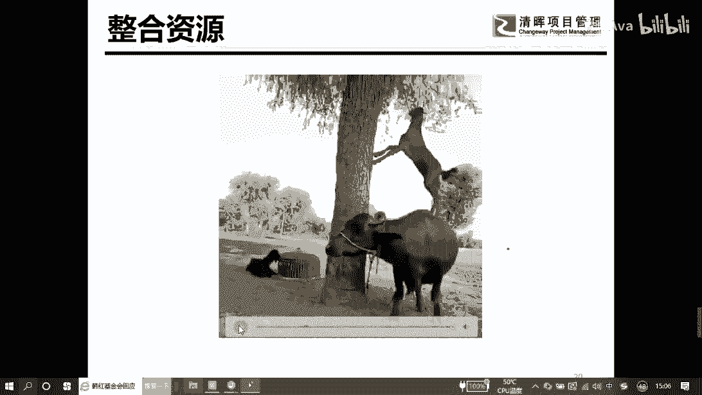

所有合理合法的力量来做这件事情好，那么接下来说到整合管理，在整个整合管理这个地方的时候，我们注意到哈，整个是作为项目经理，作为部门主管特别特别重要的一个技能，是项目经理必须给我亲力亲为的一个工作。

在整个落实的过程中，整合管理我们大概分为两个部分，一个是向上管理，一个是向下管理，那向上管理就是你做的任何一件事情，要跟我们公司的战略是一致的，再次给各位提醒一件事情，绝大多数的企业。

随着国家的一个13 54 五的一个规划，绝大多数的企业都会做5年的，甚至10年的战略规划，然后它会延伸出3年的滚动式的一个计划，当我们每年的年度计划的过程中，他是在部门主管手上的。

所以有一天你在承接一个任务，然后老板跟你说，哎这个任务还蛮重要的时候，那你各位一定要记住一件事情，查一下这个任务的来源，那所有任务的来源一般跟企业的战略，它是有一个嵌入的，第二个部分就是我了解公司。

了解行业，了解国家是什么这样一个战略方向的时候，那么接下来做的事情就是朝着这个方向去努力，在我们公司内部带领的团队，带领了资源，然后通过技术，通过工具，通过一系列手段把这些事情给我搞定。

这个我们把它叫对内整合，那作为项目经理。

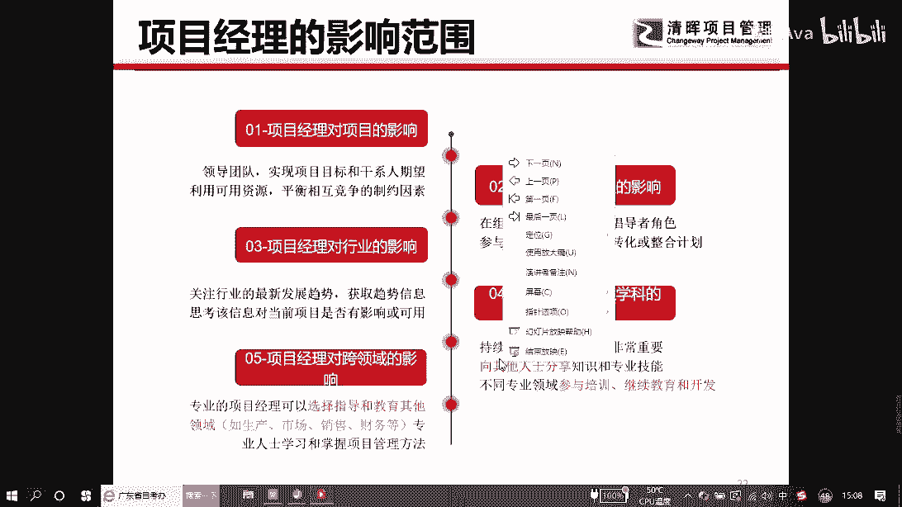

你们很多的时间和精力，是在我们对内整合这个维度的，这个部分是我们将来我们在线下，偏偏公开课的过程中。

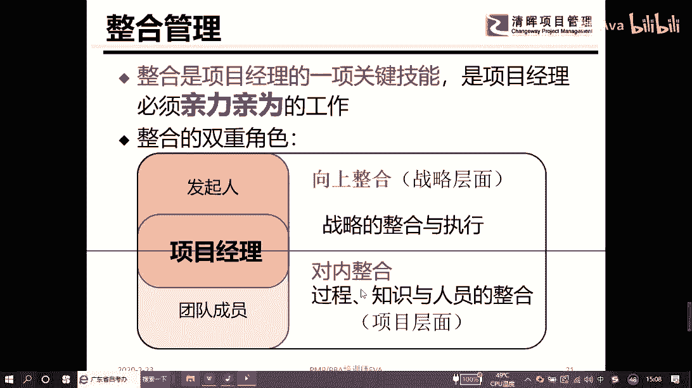

我们会逐一剖析给到大家的好，那我们刚刚说过，作为项目经理，我们有相应的能力，我们要承担相应的职责，那有些时候你会发现你还要做一些别的事情，比如第一个维度，我们看到课件上的零幺这个维度。

零幺这个维度就是我们刚刚说过的，就是我们要对项目的目标去产生影响，这就是我们很好理解的一件事情，技能把事情交给你了，那你肯定要干嘛，有责任和义务把这件事情给做好，这个说带领团队利用有用的一个资源。

把这个事情给我做好的能力，我们把它叫项目经理，对项目要产生影响，第二个维度对公司的一个影响，很多时候我们发现一个事情，就是如果你想做一个事情，但是做这个事情吧，公司没有先例，就是以前没有人做过。

以前没有人做过，那我们现在应该怎么办。

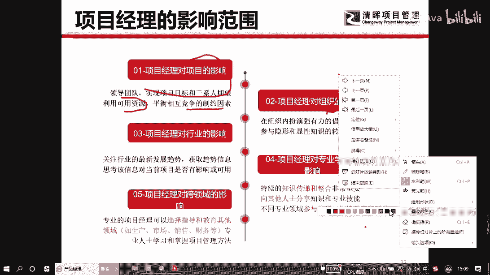

记住一件事情，我也跟我们的曾经的很多同学们说过一件事情，很多的时候作为项目经理，作为部门主管，你要开拓空白，选台公司没有的，由你来主导推进，那这个部分演绎你对自己的底气和自信哈。

第三个部分就是作为项目经理，对相应的行业要去做一些驱动的一个影响，你要时刻动态地关注行业的一个发展趋势，为什么要关注有些项目经理，有些部门主管，特别开心的跟老板汇报了一件事情，说哎老大我真的做这个事情。

这个事情特别好，肯定有发展机会，然后昨天刚跟老板汇报的时候，今天市场变天了，那这样的一个事情有可能就会错失机会，所以我们在做每一件事情的时候，为了保证我们实现企业的战略目标，能够对接市场化的运作的话。

我们一定要关注这件事情，一定要跟行业去动态的去做关注，那当然所有的这些东西要做，你需要有一个知识的储备，所以我们需要不断的干嘛，成长自己，不断地沉淀自己，那在成长跟跟培养自己的时候，一定要记得哈。

有些东西是可以跟你的同事朋友，甚至领导学习的，那有些东西只能通过自己摸索的做的，这个部分在进步落实的过程中，我们还要关注一个事情，跨领域，现在这个社会哈一个行业的产生很快，一个行业的消失更快。

还有一个维度，现在这样一个行业里面，我们做的任何一件事情都不是单兵作业的，我们很多时候都是跨领域来合作的，那这个部分像项目经理，能够打通不同领域之间的链，用我们共同的语言。

项目管理的专业术语来对接所有的干系人。

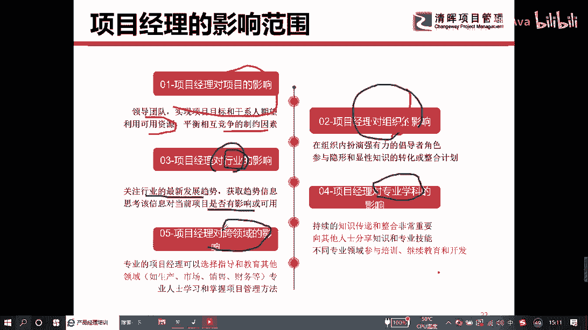

共同解决我们所需要做的事情。

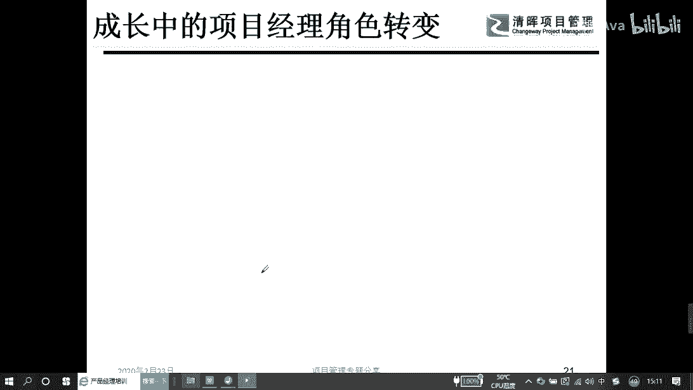

那我们刚刚说过，在所有的人的四个维度的时候，我们会有职场小白，对不对，然后我们还会有相应的一些高手，每个人都是由员工开始做起的，我记得我曾经的时候，有一个有一个学生跟我说。

他说周老师有一件事情我要跟你商量一下，我说为什么，他说老板打算培养我，让我带一个团队，但是我吧有点害怕他不想带，我，问他为什么害怕，他会说哎我以前一个人做份工作多轻松啊，我现在还得天天管别人。

那作为到作为单个的个体的话，你只要做好自己的一亩三分地就可以了，但如果你作为管理者的话，你是需要干嘛，按照我们老板的一个要求，带领团队把所有的事情给我做好，当然你的压力肯定会更大，你的挑战也会更大。

你需要的知识储备也会更大，所以这个是我们说，作为管理者跟作为员工的一个区别，那如果作为员工的话，你只需要解决自己的事情就可以了，那作为项目经理，作为部门主管，你一天到晚都在做两件事情。

第一个给别人布置任务，第二个去干嘛，监督别人任务的执行情况，所以你永远都在沟通的路上，这是我们说作为上述经理，作为管理者跟作为普通员工最大的区别，各位好，在职场上来讲，很多企业的管理层，他不会普通的提。

因为企业要承受相应的代价，他绝大多数的企业都是从项目经理，或者团队负责人或者什么组长或者什么模块，什么什么负责人等等。

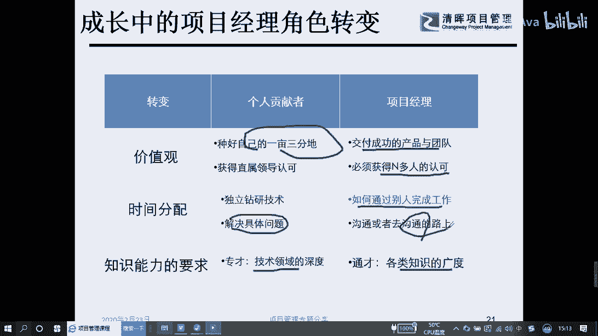

所以作为项目经理，他的上升通道是很大的哈，这个部分的时候给大家分享一个将来的时候，其实绝大多数线上的同学们哈，如果你是职场小白的话，我们现在给你分享的管理者的五种力量，你是没有办法去获取的。

管理者的五种力量的话，第一个维度就是自我力，什么叫自我力，我们在做任何事情的时候，一定要认清自我，以我为中心的人生态度，作为管理者，你需要有很多的决策，我们在做每次节奏的过程中，不能随便被干扰，被误导。

要有自己的果断，还有干嘛截断这样一个能力，那第二个部分就是我们说的创业力，什么叫创业力，选择对待算做对的人，这个一句话很简单，但做起来干嘛特别不靠谱，所以有些时候我们要有意识地去训练自己，这方面的。

尤其是后面这个做对的人，这个维度好，第三个维度的话，第三个，第四个，第五个，030405这几个维度哈，030405，一定要掌握的，第一个维度就是我们说的透视力，透视力就是看清前帽，然后干嘛看清局部。

作为普通员工，只能看到自己的脚下，那作为管理者的话，你一定要所有的干嘛，就是我们刚刚说的高层视角，这样一个维度来去做事情，第四个部分就是我们通常说的逆转利，每一个人都需要有一种能力，当遇到困境的时候。

我们要有破局而出的一个智慧，我们要有一个翻手为云，覆手为雨的一个能力，就是我们通常说的翻盘的能力，当然最重要的是各位我们要有困境生存的能力，这是我们说的逆转力，逆转类通常对应的就是我们通常说的aq。

就是这个人的抗压力是非常强的，当然在这个过程中，我们还要补充一些别的内容，深圳商业分析师，管理咨询师，架构师等等，他们一定要掌握的能力叫架构力，什么是架构力，把整个事情的顺序尽可能梳理清楚。

然后还有一个能力叫连接的能力，所以梳理清楚跟连接的能力，这叫架构力，这个特别重要，你能不能往上走，你能不能有管项目经历，其实005这个部分特别特别的重要，这是我们说作为管理者的五种力量。

都是我们在线下上课的时候。

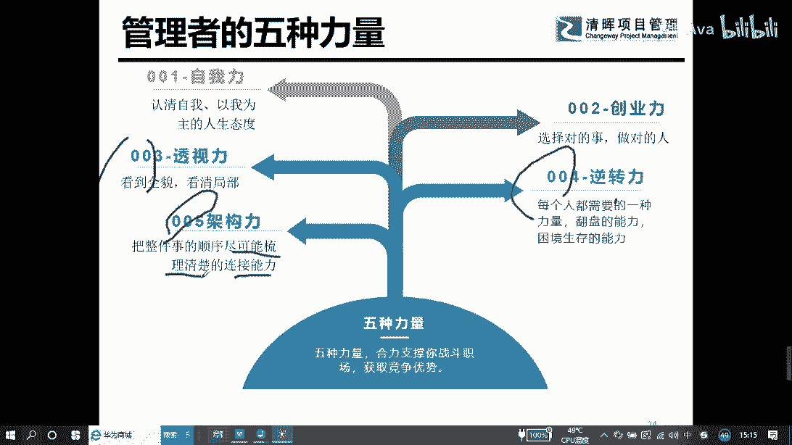

给大家更清晰的来去，怎么跟项目经理来去做一个对接好。

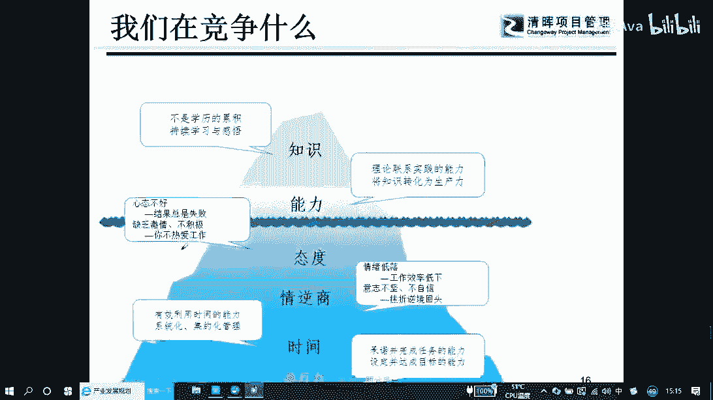

那有些时候我们刚刚说要学很多东西，刚刚说要助力我们在职场上来去做一个转身，在职场转型的过程中，有些是主动的，有些是被动的，比如说我们这次听说有这样一个案例，就是放七天假，再放七天假，再放七天假。

然后你就不用来了，那这个地方的话意味着是被动的转身，无论是主动还是被动，当有一天，我们需要在职场转生或者职场转型的过程中，我们的能力是不是足够够的，那大家可以看到这个图，如果你的姿势不够的话。

你是没有办法纵向到底的，这个是我们会谈到的知识，知识跟能力，这个地方差的就是我们一个实践的一个转换，我可以看了500本书，但我是不是就一定能做战略规划师呢，那这个地方500本书只是你的知识的储备。

500本书之后你能不能形成自己的一个技能，这个叫实践过程中会产生的一个能力，当然有了能力，刚刚说过，是不是就一定有机会呢，跟你的情商，跟你的逆商，这个地方也是最重要的，如果这两个东西都搞定的话。

那我们的知识最终就可以转化为我们的执行力，各位如果有了执行力，其实就有了竞争力，如果有了竞争力的话，那我们在职场这个江湖，那就是翻手为云。

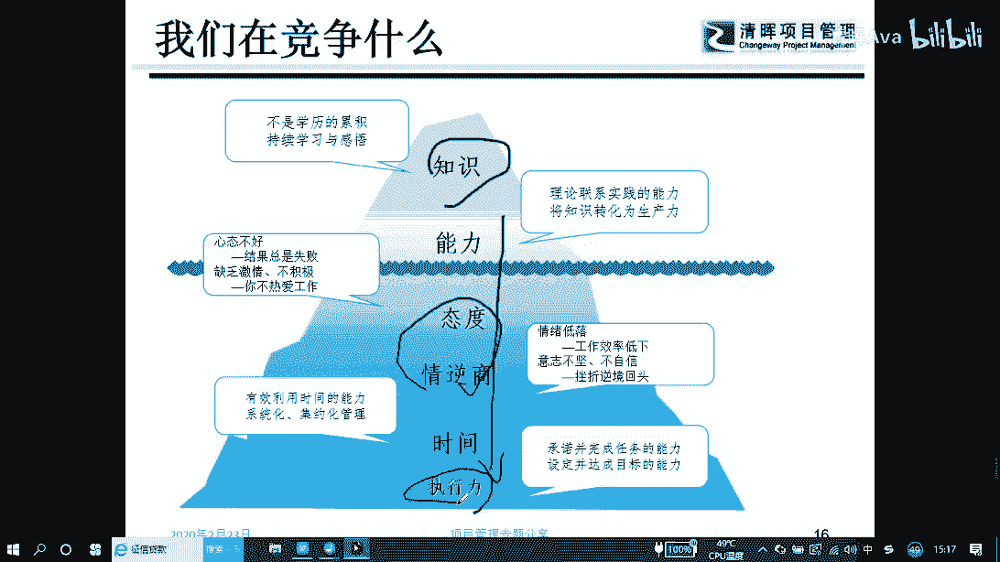

覆手为雨了哈。