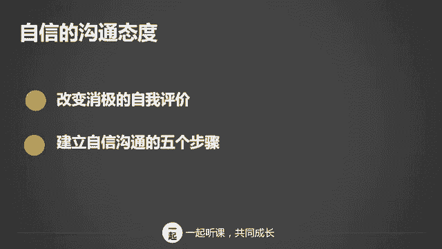

# 学会说话--高情商人士必备的高效沟通课 - P2：02第二讲：五步教你自信表达(1) - 清晖Amy - BV1DQsSemEQR

小伙伴们。大家好，我是韦安老师。上节课我们做了一个简单的介绍，接下来我们要开始进入正题了，你们准备好了吗？我将向大家介绍，想成为一个高情商会说话的人，你应该从哪些方面着手？我问问大家。

你心目中的沟通高手都是有什么样的特征的呢？是不是让你愿意说话，和你聊天时，让你敞开心扉，让你可以充满信心的沟通呢？通过我的观察和研究啊，我认为啊真正的沟通高手都具备这三个特质。首先态度上他是自信的。

他相信自己能够和别人展开愉快的对话。你想一想啊，如果说话都不自信，还谈什么畅通交流呢？对吧？其次，沟通高手都会懂得如何交流，能够让双方舒服，他可不会犯一些低级的沟通错误，让人舒服很重要。

如果一个人口若悬河，但是却咄咄逼人，那他肯定不是沟通高手。最后一个啊是倾听技巧，我已经不止一次说过了倾听的重要性。一个高情商的沟通高手，最重要的一个技能就是会倾听，不仅会听，还会问。

这样的人总是让人不自觉的愿意交流。接下来我们就跟大家详细介绍第一个特质自信的沟通态度。关于自信的内容，我会从两个方面来阐述。一个方面呢是改变消极的自我评价。另外一个是建立自信沟通的五步骤。

你们知道他是谁吗？她是美国总统特朗普的女儿伊万卡。我听过他的演讲，说真的，我认为他的演讲比他爸爸要强多了。

特朗普能够成功的竞选啊，我相信和他女儿的出色表现分不开。他留给你们什么样的印象呢？他留给我啊最深刻的印象就是自信。我前段时间专门写了一篇关于自信心的文章，很多小伙伴都留言都给我留言。

表达对自信心重要性的认同。大家都知道自信心非常重要，但是很多时候性格的培养来自于天生以及从小生活的环境。有些人天生比较内向，他不太愿意和人沟通。有些人啊父母比较强势，如果父母经常挑战和指责孩子。

那么孩子就容易产生自卑懦弱的性格。你是不是性格内向的人呢？曾经有一个内向的学员对我说，我宁愿听，也不愿意说话。我还有一个粉丝给我留言，他说，我很自卑，胆子很小，害怕犯错，我总是说话不得体。还有些人啊。

他曾经在沟通中摔过跤，受过伤害，所以就变得谨小慎微了。他们总是小心翼翼的开口说话之前会深思熟虑，直到万无一失才说话。缺乏自信的人会倾向于认为别人都不那么喜欢他，也会容易陷入比较中。

觉得别人为什么做的那么好，我可能永远都没有办法超越。你相信自己可以改变吗？如果你自己都不相信自己可以改变，那么谈任何的技巧都是白搭。那第一步就是改变消极的自我评价。首先呢要对自己有一个客观真实的认识。

你会不会觉得自己比很多人差，你是不是总是仰望那些优秀的人？其实我想告诉你啊，你看到的你想象的未必是事实。真正的你可能会比你想象中要优秀的多。你知道那些你看到非常优秀的人，他也一样有着沟通恐惧吗？

他只不过是可能学习了沟通技巧，然后经过了大量练习而已。我自己也是这么过来的。现在我每次演讲后都有很多人表示钦佩。但是你们知道我每次上台前都会很紧张吗？不过呢我会不断的给自己打气，不断练习。

让自己熟能生巧。以前我缺乏自信的时候，但是却要经常向很大的老板汇报工作。这样的情况之下呢，我通常都会反复练习，事先录下来，然后不停的听再去修改。有时候啊我也会让我老公当听众，问他，我讲的清不清楚。

他能不能听得懂。然后再根据他的意见，来改进，所以你需要肯定自己的优势和长处，并找些方法，让自己逐步提高表达和沟通能力。当你要和大人物沟通，或者要演讲的时候，你可以反复练习，把自己的声音录下来。

或者找一个你信任的人讲给他听，得到对方的反馈。只要你想提高，你总能找到办法提高自己。第二个就是有切实、切合实际的期望。你听过一句话吗？做成比做好更重要。我一直认为追求完美是行动力的一个最大障碍。

我自己是处女座的，处女座的一个特点是什么？大家知道吗？追求完美啊。一个追求完美的人会给自己很大的压力，事情不尽善尽美，就不会迈出第一步。但是啊如果你想自己完美掌控每一个细节，如果你想永远不出错。

那么你肯定会失望的。当我渐渐发现，追求完美是我向前一步的障碍的时候，我开始鼓励自己，世界上没有人是完美的。给自己设置一个合理的期望值，好过总是和人比较。如果你一直和有天赋的人比较，你就会显得弱小。

与其为你不具备天赋而感到痛苦，还不如去做到比过去的自己更好更强大，这才是合理的期望啊。有强烈的改变意愿，你有没有意识到自己存在的问题呢？如果你没有意识到自己有问题，你就不会寻求改变，不是吗？

如果你真的想提高啊，就要具有改变的意愿，而且这种意愿越强烈。你真正付诸于实践的可能性就越大。我有一个同事说话特别啰嗦，没有思路，每次开会，只要是他主持的，总是将本来只需要20分钟的会拖延成2个小时。

这样导致到客户怨声载道。当我反馈给他听的时候，他竟然没有意识到自己有问题。我后来啊反复代教他不断的以事实为根据，他才醒悟过来自己的问题，然后才意识到问题的严重性。他向我承诺一定会改进。

提高自己的高效说话能力。当他真的下定决心去改进的时候，他会经常刻意留意自己的说话逻辑性。这样经过一段时间，他的进步就有目共睹了。如果你真的认识到不改变对你带来的危害，那么只要你想改变。

你就有很多方法可以改变。当然喽，只有努力是不够的，你必须要知道怎么去做才会改变，对吧？这才是你要上这次这一系列课的原因，学习技巧并积其实践，逐渐将这些技能练成你的能力，成为自省成功的人。好。

那我们来谈一下五步建立自信的沟通。我们谈及的高情商的人啊，首先他具备的就是自信的沟通方式。不是吗？既然缺乏自信是口才最大的拦路虎，那么，如何才能够建立自信呢？我们通过这五步来进行，分别为设定目标。

相信自己，抓住机会，反复练习和积极乐观。首先我们来讲一讲设定目标。你有没有读过高效能人士的7个习惯？如果你读过的话，你一定知道什么叫做以终为始吧。如果你想成为会说话的人。

你首先要确定你一定可以成为说话达人的这个目标。为什么你要确定去设这个目标呢？因为它带来好处啊，想一想啊，你会说话就可以赢得你心爱的女神，会说话，你的朋友可以遍布天下。会说话，你可以在职场中大展拳脚。

会说话可以让你赢得业务，你可以赚很多的钱，然后会说话可以让你拥有成功的人生，想一想你最后获得的这些成果，难道这些好处不应该成为你努力的动力吗？不过呢你要切记不要投机，给自己设定一个目标。

成为会说话的高情商人士，沟通高手，并时刻铭记这个目标。不投机，最重要的一点就是踏踏实实的去做学学技巧，然后反复不断的实践，一步一步提高。当我很羡慕一个人拥有好口才的时候，你猜我会怎么做呢？我就会想象啊。

自己有一天也能像他那样，所以我会努力朝着这个方向去做，留意并学习他的一言一行，锻炼自己在各种场合侃侃而谈，表达自己的观点，被大家所接受，然后和人和谐相处的能力。无论所受到什么挫折，都不要忘记自己的目标。

并为此而努力。相信自己不断暗示。我听过一句话。一个人的潜力是否能被开发出来，取决于每个人对自己的态度。这句话是什么意思呢？意思就是你认为自己行，你就是行的。当你和别人沟通时。

当你需要在一个重要的场合上沟通时，你内心通常是怎么想的呢？你是不是在想，哎呀，怎么办？好紧张，如果搞砸了怎么办？如果你是这么暗示自己的呀，那么你十有八九就会出错。你要暗示自己，哎。

我一定可以顺利进行的这一切不会想象不会像想象中那么困难，我可以的。当你感到胆怯的时候，问一问自己，既然别人都可以做到，我为什么不能呢？我的前任老板，他的英语一点都不好。

但是有一次我看见他在大会上面对来自全球的客户用英语演讲时，我感到非常吃惊。我会后问他，你是如何锻炼自己的，他说，我就是不停的背诵，然后暗示自己一定可以。

你看就是这么简单，我所见过的沟通高手都不是在一开始就这么成功的，他们都经历了千锤百炼。有多少次我们脑海里的对话是这样子的。我不善于交流，我怕说错话。我太年轻，别人不愿意听我说。他们好像不喜欢我。

我可能没有办法改变在他们心中的印象。你有过这样的负面对话吗？这些负面的对话呀，无时无刻不在我们的脑海中盘旋，不是吗？要建立自信心。首先你要停止这些令人泄气的内心对话。

你要知道心理会改变行为，行为会改变结果。如果你不自信，那么你就假装自信吧，一直到你达成目标为止。关于假装自信，我给大家分享一个故事。有一个叫艾米的哈佛大学教授，这是一个真真实故事。

她从小就是一个很聪明的姑娘。但是19岁那年，她发生了严重的车祸，头部受到重创，她不得不从大学休学，所有人都告诉他。他的智商下降太多了，他回不去大学了。他虽然很无助，但是仍然努力学习。

最后他终于从大学毕业了，但是比同龄人晚了4年。后来他说服了他的导师，让他进入普林斯顿大学攻读硕士学位。他当时觉得以他这样的低智商不应该在这里，他是个骗子。他于是想放弃。但是他的导数告诉他，不可以。

你必须要伪装自信，直到骗到全世界的人认为你行才可以。他就伪装了，后来他去了哈佛大学当教授，有很长一段时间，他仍然觉得自己没有资格在这里。直到有一天，他对一个学生说。

你整个学期都没有说过一句话，你得参与进来，否则你过不了这一科的。这时候这个学生很缺乏自信，很挫败的对他说，我本来不应该在这里。听完这句话，艾米突然意识到两点，一是她懂那个学生的自卑感受。

二是她再也没有这种骗子的感觉了，她终于成功了。他握着学生的肩膀，激动的说，不不，你应该在这里，你可以假装成功，一直到你成功为止，明天开始，你就假装你要让自己充满力量，你一定会发表最棒的评论。结果呢。

结果他的学生真的发表了最棒的评论。我自己也曾经试过这样的情况，我二十来岁基于优异的业绩，连续连跳三级，坐上了跨国企业的高管位子。我人生第一次搬进了独立办公室。那时候啊管理的员工年龄都比我大很多。

我非常惶恐，没有自信心，每次和他们讨论工作都没有底气。后来我告诉自己，不行，再这么下去会被下属看扁，没有办法管理他们。我得假装自信，假装自己完全具有管理他们的能力和资格才行。我于是就采取行动了。

我真的努力假装自信了，我也不再回避和他们沟通。不知道什么时候开始，我就没有那种害怕和虚弱的感觉了。我的管理越来越顺，我成为了一个真正合格的管理者。在人际沟通中，你有因为受到挫折而质疑过自己的能力吗？

从现在开始。相信自己可以做到，停止贬低自己。请你努力的练习，提高自己的能力，同时不断心理暗示，告诉自己是最棒的。如果你缺乏自信，那就假装自信，直到你成功为止，没有人能给我们信心和勇气，除了我们自己。

抓住机会。当你要和一个大人回顾工作的时候，你的心情是如何的？是怪自己运气不好。还是希望那天来个突发情况，会议取消。又或是感到很开心，机会终于来了。😊，你是怎么想的呢？

其实说话的机会啊到处可以见到啊。那我就问你了。

和领导吃饭，你是躲得远远的，还是想办法坐在他身边，加深他对你的印象？和同事开会，你是想沉默不语被人忽视，还是主动发言，用自己的观点影响他人？

如果有当众表达的机会，你是避而不及，还是积极争取增加自己的曝光率呢？很多人对说话可能产生的不确定不确定性的结果感到担心，因此不愿意开口。但是啊你只有敢于抓住一切说话的机会。

你才可以提高自信自己的自信说话能力啊。不要放过每一个锻炼口才的机会。如果你没有说好天会塌下来吗？不会啊，一次失败没什么大不了的。我常用游泳来举例，一个人不下水就永远学不会游泳。

呛了几口水就更容易学会游泳，说话演讲都是一个道理。如果你希望别人用赞许的眼光看待自己的话，那么请你先放下那种消极的心态，不要担心自己一说话就错漏百出，也不要害怕别人认为自己没水平。正所谓熟能生巧啊。

我现在对沟通和演讲都非常有信心，为什么呢？因为我锻炼了十多年了，我刚进入社会的时候，只有1500块钱一个月，哪有什么信心和能力呀？所以进步是一次一次慢慢来的，每锻炼一次，你就进步了一次。你要改变心态。

主动出击，争取了机会，你不一定会表现的完美哦。但是不争取机会，你一定不会进步，所以要学会鼓励自己走出去。反复练习。有一个小伙伴问我，老师。我要经常主持公司的晨会，我怎么样能够自信的表达呢？

我的答案就是在会前反复的练习一遍又一遍。建立说话自信心，最好的办法就是反复练习。自信啊并不是那种靠口头说我要成为自信心的人，你就可以建立的那种方式叫做自欺欺人，好吗？

一个人只有对自己掌握的技能练习到炉火纯青的时候，你才能拥有自信心。当你要向老板汇报工作，当你要面对一大堆观众进行公开演讲时。当你要上台表演的时候，你怎么样才能克服紧张情绪，保证正常发挥呢？

练习几百遍就可以啦。那些在pa上征服百万观众的精彩演讲，哪一个不是经过了上百次的反复练习的呢？

我的那个前任老板英语这么差，竟然可以用英语当众演讲，这不就是反复练习的功效吗？由于工作的需要，我经常要和很多高势能的人沟通，也经常要在各大场合演讲。我是怎么克服自己的紧张和担心的呢？

我就是在汇报演讲前不断的练习，然后暗示自己，你一定可以成功。有一次我要对着2000人演讲。上台后，我发现我本来应该有15页的PPT由于工作人员误操作，只剩下了3张PPT了。

我当时只停顿了一秒钟，然后就抛掉PPT讲完了20分钟的内容。讲完后回到台下，竟然没有人发现我的PPT出了故障，他们只是很奇怪，为什么我的PPT这么少？

那我怎么可以做到如此镇定自若的呢？其实就是一个办法。用了很多个晚上反复练习，烂熟一心，所以没有了PPT，我也可以完全脱稿演讲。反复练习，每成功一次，你就会增添一份自信。如果你身经百战。

你自然就信心满满的，不是吗？积极乐观。你有没有试过对自己在人际沟通中的表现而被广倍感失望的呢？很多人受到挫折就放弃了。男生在追求漂亮女生的时候，笑到最后的那个都是那些被锯了很多次。

仍然坚持不懈的那个男生吧。我有个闺蜜是校花，长得很漂亮，后来嫁给了一个外形和家境都很普通的男生，结婚典礼上，别人问新郎，你是怎么追到校花的？新郎笑嘻嘻的说，我追了足足一年，被他拒绝了几十次。

但是我都觉得无所谓，拒绝了再来过。我呀就是赢在了脸皮厚上面。新娘也说，我一开始真的不喜欢他，但是无论我怎么ay no，他总是嘻嘻哈哈的赶都赶不走。最后我只好投降了。你看。不要怕跌倒，保持乐观的心态。

你就不会那么在乎所谓的挫折了。乐观的人，看待事物，总是从积极的一面去考虑，总是看到事物的正面。如果失败了怎么办呢？当成成长的一个经验吧。如果他们觉得我很年轻，不愿意听我说怎么办呢？想一想，我年轻。

所以才和他们有不同的视觉和观点。所以我们一定要学会用积极的方面来去思考问题。另外啊，心理学家研究不是结果导致了情绪，而是情绪导致了结果。比如说你不开心，结果你真的会样样不顺，更不开心。换一种方式。

你不开心，你假装开心，你自我暗示，这没什么大不了，最终你就会被自己所影响，成为一个极其乐观的人。

总结一下，用这几个步骤来建立自己对沟通的自信心。我为什么会用一个章节来讲有关自信心沟通的这个话题呢？因为一个人若想做成一件事，自信心是基础，凡是不善于沟通和表达的人，根源都是缺乏自信。如果你拥有自信。

你就有勇气去改变。在本章结束之前，有个小任务要安排给大家。反思一下你最常对自己说的负面的话是什么？请你现在用积极正面的语言对自己说。我举个例子。你消极的这个对话是这么说的，我这个人不会说话，总得罪人。

同事们都不喜欢我。同样一句话，我们从积极正面的思维去思考，我说话太直，所以我才要学习说话技巧，我可以让同事们喜欢我好吗？你们回去练习一下，找出自己经常对自己内心说的那些负面的话。然后同样一句话。

从极极正面的角度去重新思考。

好了，今天的课就上到这里了。想要成为会说话的高情商人士，你首先要拥有自信的沟通态度。下节课我将为大家介绍高情商人士的说话技巧和方式，我们下周见。

