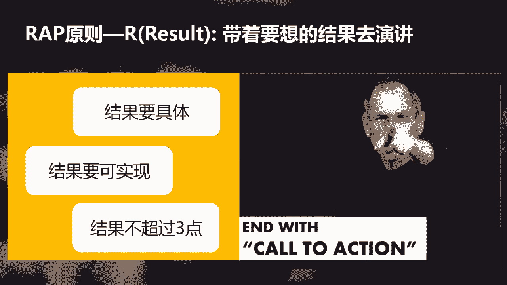

# 学会说话--高情商人士必备的高效沟通课 - P6：05第五讲：高效演讲，抓住人心的RAP方法10倍沟通技巧，沟通改变命运（全） - 清晖Amy - BV1DQsSemEQR

小伙伴们，大家好，我们又见面了。今天这节课我们将和大家讲述关于演讲方面的沟通技巧。高校演讲的秘诀。上一节课啊我们讲了倾听的重要性和有效倾听的方法，你有没有用起来呀？

我们用了三节课给大家讲述了一个高情商人士应该具备的三大沟通技巧，包括自信的沟通态度，顾及对方感受的说话方式，以及关切的倾听他人的技巧。有一个学员给我留言，他说听了我的课，感觉到醍醐灌顶，收获非常大。

他已经开始使用了，并且明显感觉到沟通效果有所改善。你们呢知识啊都是从不知道到知道，从知道到运用，然后从运用到熟能生巧。直到这个时候，你学的东西才能真正成为你自己的。所以大家一定要用起来才可以啊。好了。

言归正传了，接下来我们就要进入沟通的进阶环节，如何高效演讲？说到演讲，你的脑海里是不是会呈现一副这样的画面呢？一个人站在宽大的舞台上，面对台下几千人侃侃而谈。你是不是在想我为什么要学演讲啊？

我又没有这样的机会上台演讲。如果你这么想，就未免将演讲的定义变得狭窄了。演讲是一种你在工作和生活中经常会遇见的情景。比如说你会不会在会议中向大家讲述PPT，比如说你会不会向你的老板汇报工作？

再比如说你是不是经常有机会在五六个人的交流讨论中表达你的观点，甚至可能你也经常会在饭桌上和朋友们高谈阔论，对不对？其实演讲啊就是你在一对多的环境下表达观点传递信息的方法。

并不是只有在台上对着台下几千人的演讲才叫演讲。你觉得这个时代竞争激烈吗？我们到底怎么样才能让自己在芸芸众生中脱颖而出呢？你呀得找到一种方法。最大化的传递你的思想和增加你的影响力。

那么这种方法在我看来就是演讲演讲是一种最好的途径，传递你的思想和增加影响力。为什么这么说呢？因为它可以让别人更好的理解我们说的话，可以广泛传播我们想传递的信息，它可以让别人信任我们的能力。

我们也可以更好的影响邋遢人，并且还可以借某个观点，和别人达成共识。由于工作需要，我经常进行演讲。对于我这样的一位演讲老司机来说，你们觉得我现在每次演讲前会不会紧张啊？答案是会，那为什么会这样呢？

这里会给大家介绍一个人体大脑中的一个非常有趣的组织，它叫杏人体。这个杏人体啊可不是让人思考的，它像是我们的保镖，它起到警惕的作用，一旦发现危险情况，它就会组织我们全身的器官进行逃跑。

当你发现环境呃不安全的时候，这时候你的肾上腺就分泌激素了，你就会感觉到心跳加快出汗。同时我们大脑中有一个处理语言的器官叫做前额叶。这时候杏人体就会告诉前额叶说，哎，你不要想了，你什么都不要说了。

你赶紧逃跑吧。现在的情况对我们来说很不安全。所以我们的大脑就会出现一片空白的情况，这就是我们常说的性人体被劫持了。所以啊人们在面对很多人讲话的时候都会紧张，你呢你会不会出现过紧张、冒汗忘词的情况？

那怎么办呢？答案很简单啊，就是不断练习，努力克服紧张的情绪啊。如果你发表的演讲很受大家欢迎，你的感觉会怎么样呢？自信心大涨是吧？因为人人都很希望自己获得认可，所以演讲是让你增加自信心最好的办法之一。

自信心到底重不重要，当然重要了。我从一开始就讲了，无论做什么事情，自信心都是成功的基石。简而言之，学会高效演长就是让你不被遗忘，并且脱颖而出的最重要的一个途径。同学们。

你听过最糟糕的演讲都有什么样特点啊？为什么你会认为那是糟糕的呢？他们是不是都具有这样的一个特点。比如说讲话的内容只和他有关，和咱们无关。演讲者想在短时间内传递非常多的内容，让你失去了重点。

演讲者讲的又长又闷，让你昏昏欲睡。是这些吗？在我看来，一个失败的演讲都具有这些特点，和听众无关，信息量过大，冗长乏味。你看这张图片。他们都睡着了，这像不像我们在大学时听教授讲课的情景啊？

虽然我们在工作中不会这么夸张哈，但是一个糟糕的演讲，听众虽然睁着眼睛，但其实和睡着也差不多。比如他们在看电脑，看手机或者盘算着待会儿去哪吃饭，就和睡着不是一样吗？这样的简演讲不单是失败的。

更多是浪费别人的时间。所以演讲的时候一定要避免这样的错误发生。接着我用例子来让大家进一步理解一下。我用一个叫人事部经理peter的案例来来分享给大家。peter是一家公司的人事部经理。

在一场新员工培训中，他这么介绍的。大家好，我是peter。我是这家公司的人事部经理。我在这家公司已经工作十年了，欢迎你们加入我们的公司。我今天会向你们介绍关于我们公司的整体情况。

包括公司的历史员工人数发展状况，全球分支机构以及科研方面的成果，这是一家了不起的企业，过去发展相当迅猛。我认为你们有必要在刚入职的时候进行全面的了解。我们今天的新员工培训将会是一天的安排。

洗手间在出门的右边，你们可以在中间休息的时候去，会议时请将手机调制静音。你们可以安排在课间时候出去打电话，午餐，我们会统一安排。你听后有什么感觉，你是不是觉得很熟悉这样的开场白？

但是你是不是除了听到快餐两个字？其他内容你一概都没有听进去啊。这个就是我们既熟悉又失败的一个演讲案例，它具有什么特点呢？信息量混乱。貌似与听众不太相关。观点不明确，不知道他想传递什么信息。

有一点喋喋不休，而且听起来很乏味。那么一个高效的演讲应该怎么做呢？道理其实很简单，从哪里跌倒就从哪里爬起。接下来我要给大家介绍。RAAP原则。你在准备一个演讲或者准备一份PPT的时候，你通常会怎么做呢？

是边做边想。还是在开始之前先搭一个框架，然后再开始准备。无论你以前是怎么做的，那么从现在开始，我都建议你用IP来搭建演讲框架。这个道理啊正如建房子一样。你是一边砌砖还是一边建房子呢？

你还还是先先有画设计图纸，再搭框架，最后再一砖一瓦的完成，对不对？所以当我们谈到搭建演讲框架的时候，我介绍你用rap原则，rap大家都知道吧，rap就是饶舌的意思？你一听到rap是不是就很开心。

这样的话让你方便记忆。所以当你开始演讲的时候，你就想起rapap吧。那么什么叫rap呢？read就是三个英文单词的开头缩写。简单来说，我们在进行演讲时都要考虑这三点。R就是reult的意思。

带着结果去演讲。A是audience，从听众的角度出发，P points提炼简短轻悍的内容要点。好了，那么接下来我就对每一个要点逐一展开。IP原则ERres带着想要的结果去演讲。这一点非常非常重要。

你有没有听过一个糟糕的演讲，听完之后完全不知道他要表达什么的。其实导致这样的结果啊，很多程度上是因为说话的人自己都没有想清楚自己要通过这次演讲达成什么结果。如果你讲完，大家能记住你想要传递的信息的结果。

并和你达成共识。那么恭喜你，你成功了。

那要如何才能达成结果呢？这里有4个非常重要的要点。首先结果是要具体的。具体是什么意思？举个例子来说。

你的结果是，我希望得到市场部的理解和支持。请问大家这样的结果够不够具体？不具体吧。那么应该怎么做呢？你要这么改，我希望市场部能出席每月1次的客户沟通会，让客户感受到我们对他们的全方位的支持。你这么一改。

结果就非常具体了，对吗？第二个要点，结果要可实现的。你说我要去月球月球这个结果可不可以实现，不可以实现嘛，对吧？那什么样的结果是可实现的呢？你的听众了解了你的观点，并改变了心态。

你的听众因为你的演讲有了新的决定，你的听众采取的行动。比如说他说了好，这些就是可实现的，把你想要得到的结果写出来，越明确越好。第三个要点，结果最好不要超过3点。你是不是特别不喜欢听信息量非常大的演讲。

对不对？那为什么呢？因为你记不住啊，是吗？我们常习惯列出一大串事件，但是有可能信息量过大，听众一件也记不住，所以一定要控制将要点归纳，最好是三要点原则。我在之前的章节也介绍过三要点的方法。

这是让你说话精简高度归纳，提炼了一个最好的办法。为什么是三呢？你能想出哪些东西和三有关吗？😡，三个臭皮匠，胜过一个诸葛亮，三只小猪三只松鼠啊，这些都是跟三有关的东西。大家都为什么都喜欢三啊？

因为三啊比其他数字更有趣，也更有一些效率。它肯定比四跟五更好。嗯，有科学研究。三最容易让人记忆，它是记忆的最最大限度。比如说在加强客户管理，提升客户业绩上面。员工们需要知道三件事情。第一。

销售团队定期召开每月客户会议。第二，每月新增一档客户专属的促销活动。第三，跨部门全面对接，增加市场部出席客户会议。你讲了这三点，那么听众就会非常清楚，你要想传递的传递的行动方案了。那你说没有三点怎么办？

很简单，那就一点或者两点，你尽量不要让自己让自己的要点超过3点，为什么呢？因为别人记不住，好，一定要记住，这个要点归纳原原则不要超过3点。你为什么要演讲？你不是为了讲而讲，而是为了达成目的而讲，不是吗？

所以最后的关键是让对方同意你的目标并采取行动。我问大家一个问题，你觉得你做决策的时候哈，是感性的因素大还是理性的因因素大呢？这里敲下小黑板，这个这个结论可能会刷新你的三观。

人类的决策不是经由处理数据和信息的左脑做出的，而是由处理故事、情感色彩以及幽默的右脑做出的。因为我们不是基于逻辑，而是根据感觉做出决策。艾伦卫斯曾经说过，逻辑令人思考，情感促人行动。

为了你想要达到的结果，听众需要感受什么呢？是要让他感到激动感动。下定决心还是乐观谨慎。那么接下来我讲一段话。嗯，我带着情感。来讲我的目的是呼吁大家来大家对我的支持。

我们的竞争对手比我们进入了该市场早了两年。当他们的团队已经成熟的时候，我们才刚开始从零开始组建。我们必须拼命追赶和时间赛跑，才有生存的可能。但是当我挑起这个担子的时候，我是满怀希望的。

我们有最支持的管理层，我们有最优秀的团队。我有信心，我们所有的知识部门都会积极参与到我们的业务中来，为我们赢得这场竞赛呐喊助威，你们有信心吗？你们会支持我们吗？你听完这么激利的话，是不是感谢告诉你啊。

我一定要支持你。所以呀带着目标去演讲，你要记住，你不是为了讲而讲，你是为了达成目的而讲。好，我们总结一下RAAP原则的R。带着结果要去演讲，结果要具体，结果要可实现，结果不要超过3点。

最后一定要鼓励大家采取行动。好，接下来我们讲完了R之后呢，我们开始讲AA什么意思呢？A是au的意思。从听众的角度出发。我们在演讲中犯的最大的错误就是从我的角度出发，没有明确为什么听众应当重视你说的内容。

而是直接向他们传递你想传递的信息。你需要问自己三个充分的理由。为什么听众应当关注你的说话呢？你的说话为什么对他们有价值呢？我有没有在浪费别人宝贵的时间？因为你当你站在台上的时候。

你的听众都会心里面这么想，我为什么要听你说话，你可以给我带来什么东西。所以我们要从他的角度去出发。从听众的角度出发，你要想办法做到三件事情。第一呢是想让想办法让听众兴趣盎然。你讲笑话，他觉得你特别逗。

那么他就自然而然会将注意力放在你身上。你知道他们最感兴趣的东西，你不能对他们一无所知。你最起码知道他们是谁，他们到底想听什么。

第3个，听众不会认为与他无关。那你可能要问了，我知道从听众角度出发的很重要。但是我还是做不好怎么办？这里啊分享给大家一个最简单就能确保你将关注度放在别人身上的技巧。你可以日常观察一下你说话的时候。

是你用的多还是我用的多。其实我们每个人都是关注自己的，不是吗？当你看一个集体照的时候，你告诉我，你第一个看的是谁，肯定是看自己呀，对不对？所以呀当你想从听众角度出发的时候。

就要掌握好使用我和你的恰当比例，多用你你们和我们少用我在说话的时候调整你和我的用词频率。你可以尝试用一次我，那么你就需要用5次你。所以用这些方法你不用教强，但是一定要注意，如果你你的我使用的多的话呢。

你对你的关注就会少。所以呢你让你自己务必在你你的频率上面要多过用我的频率。所以啊一定要记住，从听众角度出发。接下来我们讲一下IP原则当中的P points，提炼简短精悍的内容要点。

左边和右边哪个你能看清楚这两个都是PPT哪一个你能明白意思呢？很明显是左边对吗？右边写了那么一大一大串，简直是密密麻麻。但是你一个也没看清楚，对不对？通过要点提炼啊。

你可以让别人瞬间记住你想要传递的信息。糟糕的演讲往往都是喋喋不休带来的。没有要点的演讲，你一讲完，听众已经忘记了99%了。想办法将你的内容用容易记住的一个短语或者句子表达出来。在开口说话之前。

养成提炼要点的习惯不断练习，让自己的说话简洁而又清晰，比如我最欣赏的人乔布斯乔老爷，他就是一个提炼要点的高手，你看他经常是怎么提炼的。比如说。苹果apple瘦身，超薄苹果超强功能。今天，苹果发明了手机。

每一个要点提炼都非常的到到点，让别人过目不忘。在这里我给大家提个建议，在你写PPT的时候，你的每一张PPT的标题就应该是你这张PPT里要点的提炼。为什么你要这么做呢？因为呀你PPT里面肯定会有很多信息。

多数的时候别人都在想。你到底想说什么呀？你想传递什么信息呀？所以不要让别人猜别人猜，直接告诉他答案。比如你的标题可以是说。更多的选择让我们不快乐。啊，类似这样子的一个啊一些标题。

你的标题就直接传递了你PPT内容的结论。所以请牢记你到底想传递什么信息呢？用一句话来概括。好了，那我们来总结一下IP原则吧。步骤一Rreult以结果为导向，我希望他们同意决定什么结果。为了达成共识。

他们需要知道哪几点，那么将使用什么样的情感去感染他们。步骤2，从听众的角度出发，我的听众是谁？为什么他们应当在乎呢？步骤3，P points提炼精悍的要点，一句话传递你想要传递的信息。

那么这就是经典的rap原则来去准备演讲大纲。学习了IP不练习怎么能行？接下来我们再回到peter的案例。这时候请你思考用IP的原则，如何重整皮特的说话，能够让他变得更为高效的传达信息呢？

你考虑一下R是什么，A是什么，P又是什么。那我们来重整一下吧。上面是他的原话，下面是我用rapap原则重新重整的批等的发言。你们作为百里挑一的成功者，加入我们公司，一定很想知道加入了一家什么样的公司吗？

这家公司为什么可以成为市场赢家？为什么大家都说他是一家了不起的公司？今天这个培训将带你们全面了解公司，包括一公司上半年的历史。2、公司的全球概况和科研结果。3、公司近几年的发展状况。

你们仅用一天的时间就可以帮助你迅速的适应新的环境，从而加速你在公司的成长。你们值得全心投入今天的培训。我是人事部经理peter会议时请将手机调至静音，课间休息时，你可以出去打电话。

洗手间在出门的右边午餐，我们会统一安排。

这么调整一下，你感觉是不是好多了？为什么你会觉得好多了呢？接下来我们看一看peer发言中IP分别是哪一些。另外一个，我在这个文中，你看我用我都用红色标了出来，你用黄色标了出来。

你会看见我和你的调整变化吗？第一个第一原话里面我明显是多过你很多的。但是第二种调整以后，你会看见你是远远多过了我的频率，对吗？

那么。在这里我们看见Rre以结果为导向，peter到底想达到什么样的目的呢？他他达到的目的就是要求新员工全新投入今天的培训。那么A是谁？A就是新员工，对吗？原话里面是7个我四个你调整之后是两个我7个你。

那points简短精悍的要点是什么呢？今天的培训将涵盖三个内容。第一，公司上百年的历史。第二，公司的全球概况和科研结果。第三，公司近几年的发展状况。你看他这么一调整啊，你一定你大概就会知道。

他的核心的内容是什么？你也能感觉到peter是站在新员工的角度去思考，从他们的角度出发来为他们介绍内容的对吧？整个一调整用了IP的原则，peter的发言就变得非常的高效了。关于今天的演讲rap原则。

我们大概就介绍到这里。rap原则其实不仅适用于演讲，也是用于和上司汇报工作，以及和同事交流。如果你在表达过程中啊，始终把握带着目的去交流，从听众角度出发，以及提炼要点的原则，那么交流就会变得非常的高效。

在今天啊课程结束之前要布置功课喽。请你尝试在汇报工作中或者在与人交流过程中，或者会议陈述PPT的时候，用rab原则来构建整个表达体系。在下节课之前，你至少要练一次。无论在什么样的情景之下。

你用rap原则要练习一次。好，我们今天的课就结束了，希望大家听完课能有所收获。下节课我们会讲如何正确表达感受，精彩继续来。大家记得准时来听课哦。对了，有任何感受或者问题，记得在视频课下面留言给我。

那我们下周见。

