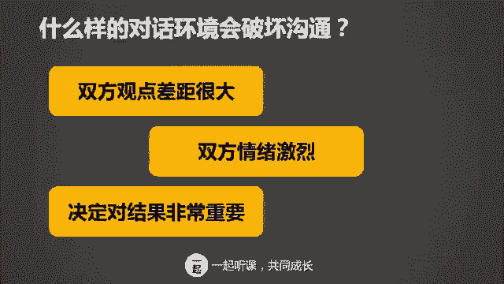
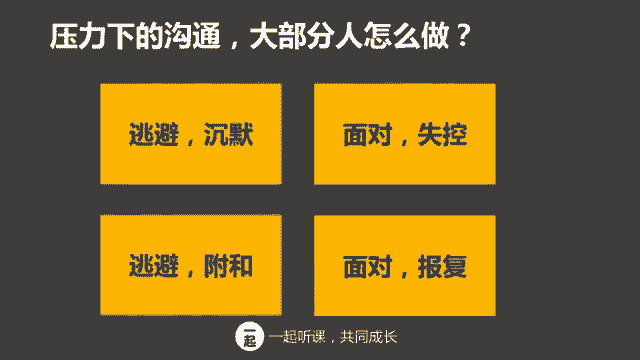
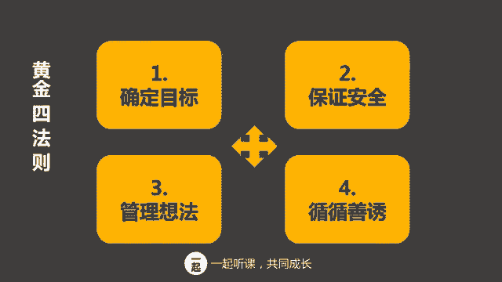

# 学会说话--高情商人士必备的高效沟通课 - P9：07第七讲：牢牢锁定目标，避免非黑即白 - 清晖Amy - BV1DQsSemEQR

大家好，我是韦安老师，我们又见面了。时间过得真快啊，是不是我们已经更新了六节课了？今天啊我们要开始我们的终极篇喽。如何在压力和冲突下，仍然能够保持高效沟通，这也是我认为在沟通环节中想成为高情商的人。

最需要掌握的技巧？什么叫做高情商呢？高情商就是控制自己的情绪和影响他人情绪的能力？你觉得控制情绪对你来说容不容易啊。不容易对吗？所以我们才要花时间来学习怎样才能做到情绪管理。在开始之前。

我们小作复习一下。过去六节课我们讲了很多内容，你们还记得吗？从基础沟通部分开始，我向大家介绍了五步自信表达，高情商的说话方式。有效倾听的佛洒原则。在进阶篇里面，我们又介绍了高校演讲的IIP框架。

以及诚实表达感受四步骤。那大家回家练习的情况怎么样呢？知识的掌握呀可不是一蹴而就的，是在练习中反复提高。所以呢如果练习的时候一时不能达到自己的要求，也不要气馁哦。螺旋提高是很正常的一个现象。好了。

接下来我们正式进入今天的环节。😊，你遇到过艰难的对话吗？什么样的谈话，我们称之为困难的，他都有什么样的情景呢？我举个例子哈，比如说坐在你隔壁的同事身上有股怪味儿，不提出来就没有办法改善。

提出来又很怕得罪。你有没有遇到过这样的情况，我就有唉，再比如说参与项目合作的同事经常拖延。再不提出来，就会影响整个进度。还有的例子是说啊，当你参与业务讨论的时候，自己的观点和某一个同事非常的不同。

然后你们之间产生了争论，谁也说服不了谁。所以啊当你面对压力的时候，沟通就变得非常的困难了。在压力和冲突下的沟通，我们就叫做艰难沟通。那在过去一段时间里，你有没有遇到过类似的非常困难的沟通环境呢？

坦白的说，我几乎每天都遇到，无论在生活或者是家庭当中，我相信你也是，不一定每天但是遇到这个沟通的这种艰难对话的环境，应该也是时常发生的。那什么样的对话环境会破坏沟通呢？首先是双方的观点差距很大。

大家都很想说服对方。再其次呢，就双方的情绪非常激烈。最后这个决定对结果非常重要。如果决定不重要，大家就不会争论了，对吧？所以决定对结果非常重要。这三种对话环境啊会直接影响对话的进行。

比如说你和老板讨论升职加薪的事情，你觉得你已经应该可以升职了，他觉得你还没有够。但是你不同意，你认为自己比其他人更优秀。再举个例子，你和你老公在对孩子的教育上面有分歧，他觉得你总是纵容孩子。

你觉得他对孩子太严厉，你们俩观点很不一样。

或者是你和同事在讨论如何改进工作，同事非常的强势。你认为他的观点不对，而且坚持他的观点会对结果有很大影响，但是你又不想破坏关系。当处于这些对话环境的时候啊，沟通就会遇到很大的挑战。怎么样？

你觉得这样的情景熟悉吗？通常遇到这样的情况，你会怎么做呢？或者大部分人会怎么做呢？很多人都会选择逃避这些冲突，保持沉默，他们心里可能在想，蠢货，我懒得跟你说，或者心想算了算了，和你说话这是对牛弹琴。

再或者是说哎，我还是什么也不说吧，再说下去就要破坏关系了，势力不讨好。沉默是很多人选择的方式。另外一种方式是逃避冲突，但是选择复合。最典型的表现是，当大家观点不同的时候。表现出来的反应是妥协。

或者当大家情绪激动的时候，就说啊，好的好的好的，你说的都对。但是他心里可不是这么想，他可能想算了，我才不去淌这个浑水呢，还是不要得罪人吧。另外一些人呢，他也不愿意逃避，所以他选择直面挑战。

但是在线上肾上腺的刺激之下，他们的大脑就开始缺血了，表现出十足的白痴，他们被冲突难倒了。当遇到这个激烈的争执的时候，就会发生情绪失控，爆发出负面的情绪，或者激动或者发怒，一定要和对方争的输赢才罢休。

还有一种人也不愿意逃避，他们会选择报复。他心想。你竟然这样对我，我一定要找个机会反击，让你看看我的厉害。王八蛋，我们走着瞧，这些人啊会因为这些争论而愤怒并怀恨在心，伺激报复。

那这四种其实都是非常常见的在压力和冲突下的正常反应。你们看了之后有感觉吗？当你面对冲突和压力的对话时候，你的反应是哪一种？其实无论是哪一种，我相信你的观点都和我一样，就是这样的反应对解决问题毫无益处。

对吗？沉默啊带来的危害特别大，一方面，沉默会压抑人性，让人们在心里发泄不出来，非常痛苦。另外呢，除了对个人影响以外，对企业的发展也有重大的危害。如果明知道结果是错的，但是为了避免冲突而保持沉默。

那么这个决定将会带来负面以及长远的影响。而情绪失控或者报复的行为，对人际关系只能是有害无益了。而且情绪失控呢，会让自己说出非常后悔的话，你有没有试过自己在愤怒的时候说出来的话之后非常后悔的。

那这就是情绪失控，导致到这个说话词不达意，得罪了人又没有解决问题，这是一种双输的行为，那怎么办呢？在压力和冲突下保持沟通听起来那么棘手，有没有一种沟通方式可以妥善解决冲突呢？我告诉你，答案有。

我们的目标就是要成为高情商的人。即使在冲突和压力下，我们也要选择既不逃避，也不失控。我们要选择一种方式，那就是即使在艰难的对话，我们也要控制情绪，高效的沟通，不但达成自己的目的，还要达成对方的目的。

在冲突中使用高效沟通就不会产生傻瓜式的反应，比如非黑即白，或者说出自己后悔的话，同时呢也可以改善人际关系，沟通顺畅，对身体有益。简而言之啊，高效沟通就是营造成功的事业和人生啊。

接下来我们讲一下，在这个冲突中，如何能够高效沟通。我们会跟大家介绍一个方法，我称它为黄金四法则。这四个法则呢？有这四点，第一，确定目标。第二，保证安全。第三，管理想法。第四，循循善诱。

如果能够熟练的使用在这四条黄金四法则。那么无论遇到什么样的冲突和压力下的沟通环境，我相信我们都能够比以前更加成熟的处理。那么接下来呢我们就一个一个的黄金法则来详细讲解。黄金法则一。确定目标。

这是什么意思呢？我们用一个案例来加强这个法则的讲解和运用吧。啊，迈克的故事。麦克是个项目经理，最近负责的项目销量下滑，份额也减少了。品牌方非常不满意。麦克找同事开会讨论。

他觉得媒体投放页面设计和促销活动可能都有提高的地方。业绩下滑，整个团队士气非常的低落，负责媒体投放的同事并不认为大家的工作有什么问题。他在讨论过程中对麦克说。麦克大家都很努力了，没日没夜的在加班。

但其实我觉得问题可出现在你身上，你和品牌方沟通不够，品牌方给的支持和资源越来越少，销量当然下滑。这还有什么讨论的呢？

麦克听了以后非常的生气，你觉得他的第一反应会是如何呢？

在受到攻击的时候啊，我们常常会思维短路，忘记了自己原有的目标，更忘忘记了大家共同的目标。当我们被愤怒冲昏了头脑的时候，我们开始将目标转而，希望战胜对方惩罚对方或者是寻求安全港湾。战胜对方的思维会这么想。

我是项目经理，你有什么资格来挑战我？惩罚对方的思维会这么想，你竟然敢当众挑战我，简直就是胡说八道，我要让你好看。寻求安全港湾的逃避思维会这样想。为了面子上一团和气，我不想说话，我保持沉默。

我咽下这口气吧。但是其实自己心里面却非常的不舒服，如梗在咽。麦克应该怎么做才好呢？首先我们应该了解一下麦克他真正的目的是什么。如果是为了解决销量下滑的问题，他就不会失去理智而为自己辩护。他会冷静的反应。

嗯，为什么你会这么认为呢？有没有什么事实根据呢？来，我们认真讨论一下这个问题，看看问题到底出现在什么地方。谢谢你的直言不讳，让我们从客观角度出发来讨论吧。

当你正在和一个观点完全不同的人展开激烈讨论的时候，你应该关注你真正的目的是什么？你需要留意你的目标是否出现了变化。你是不是为了保存面子，避免尴尬？为了战胜对方或者惩罚对方，从而悄悄的改变了目标了呢。

人们都喜欢争强好胜，战胜对方，竞争很容易让我们陷入歧途啊。那么回归理智的做法应该是怎么样子的？你应该让自己冷静下来。先停止和对方互动吧，转过来审视自己，问自己这四个问题。然后你问自己，他说的是事实吗？

我在做什么？我这样做的目的是什么？我有没有偏离目标？你问自己这四个问题，我希望为自己实现什么目标？我希望为对方实现什么目标？我希望为我们之间的关系实现什么目标。要实现这个目标，我该怎么做？

所以问自己这四个问题，我们牢牢的锁住我们原先的目标。回归理智的做法，第二点就是避免非黑漆白的选择。什么叫做非黑即白的选择呀？那就是要么情绪激动，失去理智，要么羞辱对方，打倒对方。在自己的眼中。

除了自己正确，就没有别的答案。当听到别人和自己争论相反的观点的时候，自己就会陷入到情绪中去做出非黑即白的傻瓜式选择。但是答案真只有黑和白吗？小伙伴们，你们有没有试过自己非常坚定的一个观点。

到事后发现自己可能是错误的。接下来啊我们用一个例子来具体说明什么是非黑即白的错误。小张和小李在工作上是拍档，小李对小张有偏见，他认为小张比较懒惰，平时对自己负责的业务总是不跟进。

那小李呢正在紧锣密鼓的准备和公司老板的季度汇报工作，在和同事们一起过PPT材料的时候，他发现有几张PPT是和小张相关的。但是他并没有准备。当他问起小张时，小张反而挑挑战起小李管理客户的能力起来了。

他说你留给我准备的时间太短了。而且小李啊，你自己应该可以从客户那里拿到数据的嘛。小李呢本来对小张就有意见，听他这么一说，更加火冒三丈了。他立刻说，你平时做了些什么，像你这样的人，怎么不被公司炒掉。

你有什么资格来说我说完之后，所有人全部都傻掉了。这就是一个典型的受到情绪干扰，跳进了非黑漆白的陷阱的案例。小李呢本来对小张就不是那么待见，在小张没有完成任务之后，他认为小李全都是错的。

于是他对情绪冲昏了头脑。他的这番话对关系的破坏具有极大的杀伤力，并且对解决问题没有任何的帮助。要避免因情绪激动而失去理智。你需要问自己几个问题。首先是你真实的目的是什么呢？

你们说说看小李真正的目的是什么？是完成老板的季度汇报，对吗？第二个问题是，你不想实现的目标是什么？对你又有哪些不利的情况呢？小李和小张发生冲突，这是他想要的目标吗？不是嘛，那小李说出这番口不择言的话。

对他自己又有什么好处呢？答案是完全没有，对吧？那第三个问题是提出一个更有挑战的问题，到底有没有一种方法？既能够解决问题，又不伤害而冒犯对方呢？你们觉得有吗？😡，很有可能小张就是喜欢用这种语气。

而小李只需要问小张，那你到底还需要多长时间完成呢？另外也有一种可能性是一是小李的客户可以提供这些数据给他。那么小李去找客户的帮助，未尝也不是一个办法。所以在对话过程当中啊，如果遇到冲突。

到底有没有一种方法既能提出对方的不足，又能让对方不觉得自己自以为是呢？有没有一种方法既能够和不同意见的对方展开讨论，但是又不和对方陷入争吵了。除了黑或者白以外，是否可以找到第三种解决方法。

让大家都满意呢？所以，在压力和冲突下沟通的黄金第一法则就是确定目标，牢牢锁住目标。当你陷入情绪的时候，要提醒自己暂停对话，冷静下来问问自己，第一，你自己真正的目的是什么？你有没有偏离方向？第二。

你有没有陷入到非黑即白的选择？总结一下，压力和冲突下，保持高效沟通的黄金法则。一、确定目标。记住哦，你控制不了任何人，你唯一可以控制的就是你自己，你唯一可以控制的就是你的想法和你的行为。

今天这节课我们学习了冲突中高效沟通的黄金法则一，确定目标。你们可以自己在生活和工作中多练习。接下来我们来个小练习。你是一个项目的负责人，项目最近有点停滞不前，你非常的焦虑。于是你和项目团队开会脑力鸡荡。

寻求项目的突破口。讨论一个多小时以后，你的另外一个重要的核心成员K突然站了起来。他说，我认为讨论这么久，完全走错了方向，你在浪费大家的时间。这样讨论下去，估计到深夜12点也讨论不完。作为项目负责人。

你自己都不清楚方向，你如何带领我们找到一个正确的方向。面对K的挑战，你应该做怎么样的反应呢？你觉得如何和K沟通会比较适度呢？那么你可以把答案写在留言区，我稍后也会去点评。我们今天的课就到这里了。

祝大家学习有所收获。下节课我们下将将向大家讲述黄金法则。2、沟通，保证沟通环境安全，我们下周见。

