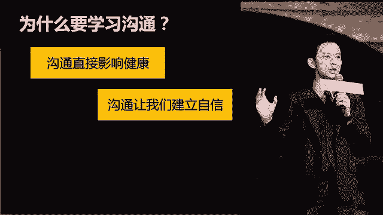

# 学会说话--高情商人士必备的高效沟通课 - P1：01第一讲：为什么要学高效沟通技巧？ - 清晖Amy - BV1DQsSemEQR

小伙伴们大家好，我是韦安老师，你们也可以叫我韦安姐。我们这系列课啊是讲述高情商人士必备的高校沟通课。大家为什么会想来上这一系列课呢？是不是遇到了一些沟通表达上的挑战，或者是对自己未来有更高的期望？

我把这节课定义为利用沟通来营造成功的事业和人生。我为什么这么说呢？一个沟通高手会建立起良好的人际关系，而这恰恰就是成功的事业和幸福的人生的基石啊。谈及沟通，这是一个老话题了，但又是一个永恒的话题。

我们每个人每天大概60%的时间都花在了沟通上。沟通如果不顺畅，不仅会影响我们的工作，还会影响生活，甚至影响健康。沟通交流其实并不容易的，涉及到沟通方面，从我研究的角度就有四大块。

第一呢就是练就高情商的沟通方式，也就是如何和人愉快的交流。第二是如何在压力和冲突下，仍然能够保持高效和畅通的沟通，从而达到目的。第三就是如何在公共场合表达和演讲。第四块就是如何有效的谈判和说服了。

这每一块都有很深的技巧，需要学习并不断练习，在现实生活中融会贯通。我作为管理者多年见证了很多人的发展路径，一个不会沟通和交流的人，他的人生必将经历一些弯路。同样一件事啊，用不同的表达方式。

就会有截然不同的结果。如果我说沟通改变命运，这一点也不过分。你们这次选择的这个沟通交流课程，我们将更多的聚焦在如何能和人愉快的交流。如何在压力和冲突下，人能保持高效沟通上面。学完本系列课，并且反复练习。

你会发现你自己的沟通能力，将会得到明显的改善。你可以自信的表达自己，成为受欢迎的人，并且在压力和冲突下，仍然能够保持高效沟通。会沟通的人都是情商高的人，而情商高的人不仅在工作上具有优势。

而且在生活中也会更幸福。人生的意义到底是什么呢？不就是追求幸福的人生嘛。我们要在一起相处一段时间了，所以你们一定很想知道我是谁。那么我先很快的简单的介绍一下自己，我叫韦安，我现在是一家世界五百强的高管。

我毕业于美国民尼苏大大学。我有超过10年的大型跨国高级管理经验。我现在也是比较致力于在沟通管理领域上的研究。啊，我创办了一个较为知名的微信公众号，韦安说，那我写的成长类的文章也比较受欢迎。

非常多的公众号都转载我的文章，有超过数百万人阅读过，让他们感到受益。好了，我的介绍就到这里。😊，那么我们这堂课呢主要聚焦在日常和人沟通打交道上面。根据我多年的观察和了解啊。

我将从这5个维度展开我们的这一系列课程，从而开启我们的高情商沟通之路。想要成为沟通高手，首先要具备自信的沟通态度，自信可是迈出第一步的前提，没有自信，谈别的都白搭哦。

接着我会分享一些关于高情商人士必须具备的一些说话方式。那我会用一节课来分享倾听的技巧。倾听是沟通中最重要的一个环节，可以说做好了倾听就解决了一半的问题。但是我们绝大部分人做的都不好。

做的不好的原因有3个啊，一个是没有这方面的意识。第二个是有意识，但没有耐心。第三个是有意识，但不知道如何去做。那么听完这节课，你的问题都将迎刃而解。第四个模块是学会表达感受。

我们很多时候的沟通困境都是来自于不会正确的表达感受。你或许是不知道如何表达，或许是不敢表达，又或者不知道该如何说如何面对。只有学会正确面对感受，并表达感受，才能在沟通中让别人更好的理解你。

你更好的理解别人。最后一个模块是在压力下的高下沟通。你在日常工作和生活中有没有遇到过一些你很想表达却很难开口的情景呢？比如妈妈有时候很专横武断，让我们交流很不舒服，但是又不知道怎么和他沟通。

既能指出他的问题，又不伤她的心。再比如说在工作中和同事的意见有分歧，那么，如何能够继续保持愉快的沟通并达成共识呢？这些啊都可以通过高效沟通的技巧来解决。我们这5个模块将通过十节课逐一向大家展开。

接下来我们进入第一节，为什么要学习沟通技巧？这节课只是对我们后续内容的一个简单介绍，更多详细的方法和技巧，我们会在后续不断的展开。你为什么要学习沟通技巧呢？很多小伙伴告诉我，他面对的沟通障碍。

沟通困境有很多，比如说不自信，交朋友受挫折，被孤立，和老板不知道如何交流，想和同事交往的更好，但是又怕说话冷场，汇报工作不得体，和家里人经常吵架，公共场合表达，总是词不达意，无法吸引别人关注。

想认识陌生人，又不知道说什么才好。那么这些沟通困境，你有遇到过吗？我们很多人都是家中的独子，我们是伴随着冷冰冰的互联网长大的一代，成长环境啊天生就比较缺乏人际沟通。所以很多人一上了大学，一到了社会。

就会发现很多的沟通问题。实际上效率低下，多数是由于不善沟通而引起的。我有个学员告诉我，他都不知道怎么和大学舍友交流，他觉得他们都讨厌他。现在他连学校都不太愿意上，害怕被排斥。

这就是从小缺乏良好的沟通交流所带来的后果。我带团队很多年，高校沟通这个话题一直都存在，但是我发现现在的沟通问题比以前要更加层出不穷。过去一年，我的团队很多效率低下的问题都是源于沟通不善，互相猜忌。

工作达不成共识，矛盾重重，甚至有些人因为对沟通绝望，直接引发辞职。人们原来以为有了微信QQ就不需要沟通了。相反啊，现代人在沟通上太依赖互联网，反而导致沟通退化。在我看来。

现代人比任何时候更需要提高沟通技巧。那么沟通为什么这么重要？我们为什么要学习沟通呢？首先，沟通是否顺利，对我们的健康产生很大的影响。你自己有没有过这样的经历，如果和别人吵架或者发生矛盾。

你的身体就会变差。我就有过，我有一次去看一位老中医，他说哎，女人最麻烦，一定要想开一些，否则心情一差就会导致各种妇科疾病。你看沟通不顺、吵架猜忌、被人孤立，这些都让我们长期心情不愉快。

久而久之就影响身体健康，得不偿失。

沟通让我们建立自信，我们对自我的认知来源于和他人的互动。究竟我们是聪明的、迟钝的、动人的、丑陋的，是狰明的还是笨拙的这些问题我们自己是不知道的。而是由他人对我们回应所知道。如果我们沟通顺畅的话。

我们就会从沟通中建立起自信心。反之，如果我们处处碰壁，被人排斥和孤立，我们就会自卑。坦白说，我一开始也是一个缺乏自信心的人，你们应该知道我刚毕业的时候只有1500块钱。

我的自信心也是在一次又一次的良好的人际交往过程中建立的。我前段时间看了一个td视频，里面介绍了一个非常有意思的项目。他呀对几百人追踪了75年来研究幸福人生的根本原因。结论是他发现日子过得最好的那些人。

就是主动与人交往的人。

美好的人生，从良好的人际关系开始。这就是他们的结论。有人在学校里面对200名大学生进行研究，发现最快乐的那10%的人都认为自己拥有丰富的社交生活。尽管沟通对社交满意度非常重要。

但是许多人都不擅长管理他们的人际关系。比如现在养宠物的人特别多，但是据了解啊，有25%的人了解自己的狗比了解自己的家人还要多。所以说，集其的关系是建造生活满足感和情绪幸福感的唯一的也是最重要的来源。

沟通最重要的目的就是实现我们的人生目标了。无论事业还是家庭，我们都渴望成功，不是吗？我自己带过很多的人，发现，无论在招聘还是晋升上沟通都是至关重要的因素。

而我在培养人方面花费最多力气的就是对他们沟通交流技巧的培训。我去年辞退了一个同事，他其实工作非常非常努力，几乎每天都加班。但是他在人际沟通上面的能力差不多为0。他和人说话从不进大脑，所有人都被他得罪了。

导致到最后，无论是内部还是外部客户，没有一个人愿意和他合作。他最终是能离开，所以沟通可以让我们成功。我们中国人口才好了一大把，尤其是我们国我国北方和东方的伙伴们能说会道的比比皆是。

但是我要纠正一些关于有效沟通的误解。我想问问大家，口若悬河，滔滔不绝，是不是意味着有效沟通呢？有些人说我在公司很注意和人沟通，我在家也经常和我老公聊天，但是絮絮叨叨没有重点，是有效沟通吗？

有人觉得情商高就应该说好听的话，专讲别人喜欢听的话，从来不说no，从不告诉别人自己内心的真心话，这叫有效沟通吗？有人觉得自己智商高，好为人师，别人的问题自己全部都能解答，给出明确的建议。

告诉别人应该怎么做，这叫样有效沟通吗？这些啊都不叫有效沟通。那么什么叫做有效沟通呢？你觉得你心目中最有效的沟通是哪一种类型？是不是让你既感觉到愉快又能达成共识的那一种。

是不是让你感觉备受尊重又能受益匪浅的那一种？在我看来啊，真正有效的沟通是建立在对双方了解的基础上，进行愉快和高效的交流，从而正确传达思想，并且达成共赢的目的。所以。

真正会说话的人并不是仅仅体现在会说话上面，而是体现在思维方式和目标性上面。他要实现的不仅是和大家能够愉快沟通交流，更多的是要达成共识，实现目标。这就是为什么说会说话的人就是高情商的表现。

而高情商就是思维和心智的折射。一个高情商的人，无论在事业和生活上都会比普通人走得更远。管理大师彼得德鲁克曾经说过，效能取决于你通过语言和文字与他人交流的能力。

所以沟通会决定了我们是否能够成为一个高效能的人。我其实非常喜欢这句话，我自己就是一个追求高效高效能的人。所以我开公众号通过文字来传递思想。我通过不断提高沟通交流技巧，来创建良好的人际关系。

从而实现高效工作。我们这一系列沟通课啊，会从多个维度和大家分享关于沟通方面的技巧，帮助大家在工作和生活中提升效能。在本节课结束之前，我有个小任务要交给你。

你仔细想一想自己在沟通中遇到的困境和你想解决的问题。只有真正了解了自己的需求，才能更好的专注学习。好了，第一节课就到这里了。接下来的课程我们会介绍关于高情商的沟通高手所具备的三个特质，我们下节课再见。

