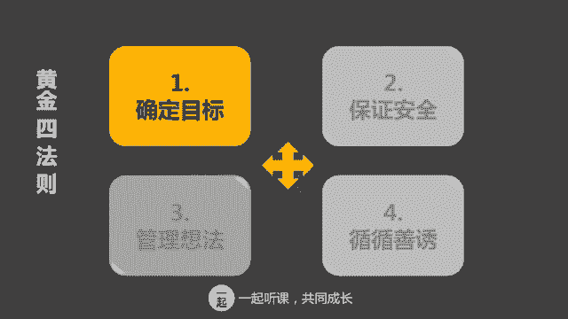
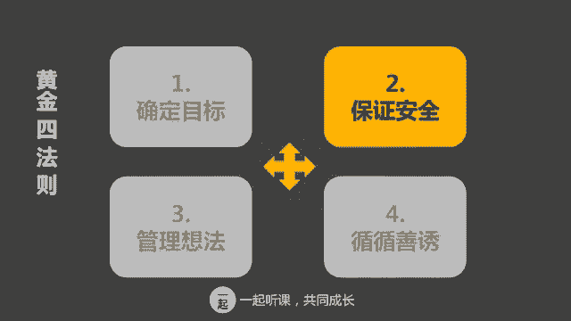
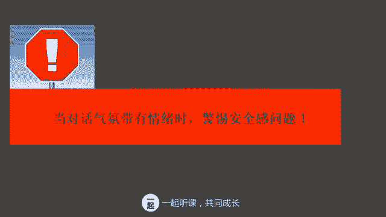
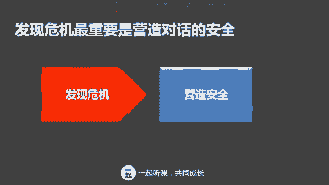
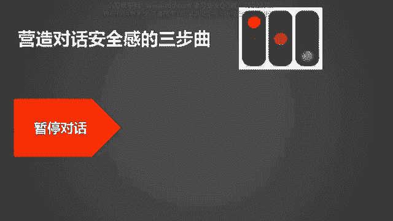
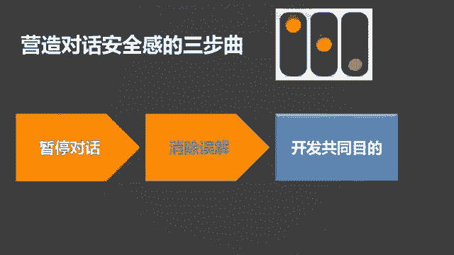
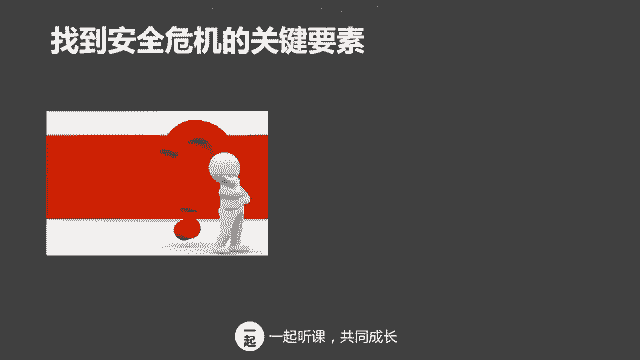
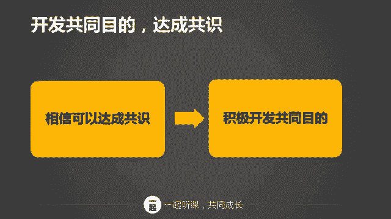

# 学会说话--高情商人士必备的高效沟通课 - P10：08第八讲：营造安全感，红绿黄灯三步曲 - 清晖Amy - BV1DQsSemEQR

伙伴们，大家好，我是韦安老师，我们又见面了，你们还好吗？我们这节课将延续上节课的话题，继续展开。如何在压力和冲突下仍然保持高效沟通的方法。我们上节课讲了在压力和冲突下，保持高效沟通的黄金四法则之一。

确定目标，锁定目标。大家还记得吗？有没有用呢？我和大家重温一下上节课的内容吧。当对话环境受到破坏的时候，我们很容易产生情绪化的行动。大家通常会怎么做呢？那么逃避问题保持沉默。那么控呃无法控制情绪。

发怒或者对对方进行报复。但是这样的行为对解决问题有帮助吗？答案当然是毫无益处。所以我们向大家介绍了如何能控制情绪，又能达成目的的方法之一，那就是牢牢锁定目标。当我们和对方发生分歧的时候啊。

我们需要谨记对话是为了实现我们自己的目标和实现对方的目标的。我们同时也要避免非黑即白的傻瓜式的选择。呃，上节课布置的作业以后，我看见很多人在留言区回复了自己的想法，总的来说都非常的棒。

那么这里并没有一个标准的答案。当时但是当你遇到这样的挑战的时候，你从这几个角度去思考问题，那么方向就是对的。首先你要想一想你自己真正的目的是什么呢？你的目的是带领大家找到项目的突破口，对不对？

那么K的目的又是什么呢？他的目的应该不是为了打垮已吧，他也是为了能够尽快的解决问题，他只不过是觉得你现在的方法不是那么有效而已。那么K的挑战是不是无理取闹呢？也许不一定你有可能你的思路确实不清晰。

所以才要和大家共同商量进行。那么最后就是思考你和K到底怎么样才能达成共识，你可以认可K说的也有一定的道理，并征求K和大家的意见，如何讨论能能够更有效的找到项目的突破口。

这样你就可以更好的去控制自己的情绪，并将情绪转移到。

原来的目标上来。好了，那么我们接下来就在就跟大家沟通高效沟通的黄金法则。2，保持保证安全。保证安全是什么意思呢？保证安全的意思是营造对话的安全氛围。当沟通环境受到破坏。

当沟通中的人感觉环境对自己不利的时候，沟通啊就往往会产生一些不眠的效果。为了让大家进一步了解什么是对话安全感。我们用一个例子来说明这个例子啊，是在家庭生活中非常普遍的一个一个例子。

凯丽的公公婆婆过来帮她带3岁的孩子。冬天到了，凯丽看见每天婆婆给孩子的衣服都穿的很多，就和婆婆说，你不要给她穿那么多了，会捂出病的。婆婆说，我就是这样拉扯三个孩子长大的，个哥壮的很。

凯莉又看见公公每次下班回来都给孩子买玩具，她说孩子要什么就买什么，这样会惯坏孩子的。但是凯丽发现啊和公公婆婆说也没什么用。所以呢她打算开一个家庭会议。晚饭后，她召集大家坐在一起。

她说我们来讨论一下带孩子的事情吧。我讲讲我对穿衣服和买玩具的一些看法。凯丽发现公公婆婆都不说话了，而且表情非常严肃，一家人谈话的气氛很不愉快。凯丽还没有说完，公公又起身回房间去了。婆婆说。

你如果觉得我们说带的不好，你就另外请人吧。怎么样？大家觉得这个这个案例是不是很普遍？通常只要有有了宝宝或者是有宝宝和呃公公婆婆在一起住的呃，这个朋友们。

或多或少都会在这这个这段这个case里面找到自己的影子，那么大家说一说凯莉这个沟通出现了什么问题呢？很明显，她的公公婆婆的沟通是没有效的对吗？因为公公婆婆都不愿意听她说话，甚至逃避和她交流。

那这是怎么回事呢？这其实就是谈话氛围出现了安全问题，因为公公婆婆觉得凯丽来者不善，她是来指责和挑战我们的，所以干脆逃避对话，当大家觉得谈话氛围不对劲，对自己不利的时候，你认为大家一般都会怎么做呢？

指责或者挑战对方，对吗？我感觉自己受到了威胁了，我非常生气，她凭什么这么做，我得在气势上赢过她，或者占上公才行，或者是陷入到争吵当中，你那么蠢还有理吗？明明是你错的，怎么还来说我呢？你在攻击我。

我要以牙还牙。得争的你死我活才行。再者呢就是沉默了这个环境对我不利，你来挑事的，我不屑和你沟通，我不愿意和你说话。那凯莉的公公婆婆就是典型的例子，对吧？她觉得凯丽开这个家庭会议就是来挑事的。

公公干脆回房间去了，拒绝和凯莉对话。那遇到谈话气氛不对，进行的不顺利的时候该怎么做呢？你要警惕了。小伙伴们，你仔细回忆一下，通常你脑海中那些非常愉快的交流和谈话都是在什么样的情况下发生的呢？

当你感到受到威胁的时候，你还会愉快的交流吗？绝对不可能，对吧？所以啊只有在安全感的对话气氛中，人们才会畅所欲言。当对话从正常讨论变成激烈讨论的时候啊，激烈争执的时候。

当自己和对方或者啊都表表现的非常的愤怒，或者是说沉默的时候，这些啊都是对话出现安全感的一些信号，必须警惕。那这时候应该怎么做呢？这时候要做的事情就是命令自己后退，放慢节奏。在重新掌握局面之前。

得回答自己一个问题。自己到底想达成什么目的？当你担心对方拒绝你接受你的看法的时候啊，就会表现的非常的强势。你会迫使对方接受自己。当你担心说出真实想法，会受到某种伤害的时候呢，你就会沉默，你会隐瞒。所以。

只有营造出安全气氛，才可以深入的讨论问题。只要不怕受到攻击和拒绝，你就可以坦诚的接受任何观点，而不受到情绪干扰。有句话是这么说的，人们不是因为你表达的内容而气愤，而是因为对话的方式和和气氛而情绪化。

你有没有这样的遇到过这样的情形，在和他人对话的时候，尽管听起来很不舒服，但是你还是坦然接受了对方的建议，你有吗？如果你有的话，为什么会这样呢？因为你有安全感，你相信对方的动机。呃。

我跟大家分享一个我的例子啊，去年呢因为两个同事的这个工作能力的问题，我曾经辞退过这两个下属。

但是呢在整个沟通和处理环节都非常的顺利。为什么我可以妥善的处理这么棘手的问题呢？因为啊我是站在对方的角度考虑的，我营造了非常安全的对话环境。我让他知道我这样做的目的并不是害他。

而是让他去选择更为适合他自己的道路。所以你要学会在对话过程中观察对方的情绪问题。无论是沉默或者是激动。当有人用言语暴力，比如说打断别人讲话，或者是过度强调自己的观点，使用绝对性字眼的时候呢。

你都要警惕了。你要对自己提醒自己说，他有可能是缺乏对话安全感了。这时候如果你想对话句续，你就得重新营造对话安全感。除了要关注对话内容，对话气氛和对方的情绪表现以外呢，你还有一点非常非常重要。

就是要学会观察自己的行为，观察自己往往是最难，也是最容易被忽视的。当双方观点相差甚远的时候，我们总是会认为这些都是对方的责任，对不对？人都是自我的。所以这就是为什么说觉察自我是这么的重要。

当我们满脑子都是观点和理由的时候，就会缺乏社交敏感意识，很多时候我们根本就不知道自己在做什么，如果不具备自我行为的监控能力啊，很多行为都会显得特别的愚蠢。我给大家讲一个很好笑的故事。人们都说。

有个和我住在同一个街区的某个家伙有多讨厌，我决定亲自去探个究竟。我来到那个人门前，结果他说自己不是大家所说的那个人，那个讨厌鬼住在那栋房子里，我顺着他的手指方向看了看，我说道，你可真是个傻瓜，那是我家。

你看这个故事里面到底谁是傻瓜呢？我以为傻瓜是另有其人，没想到我其实就是别人口中说的那个傻瓜，所以不懂得觉察自己的行为，你就不会知道谁才是真正的傻瓜，再举一个很有意思的例子，当你正在生老公的气的时候。

你老公满脸无辜的在问你，你到底怎么啦？你条件反射的回应说没什么，其实你这个说没什么，完全是吼出来的，你没注意到你的反应，因为你把注意力全放到对方身上了。这个场景熟悉吗？所以呀要学会观察自己的行为。

了解自己在压力下的应对方式，避免陷入沉默或者是暴力应对。当我们发现对话氛围出现了问题的时候，发现对方开始具有负面情绪，或者观察到自己面临压压力反应的时候，我们该怎么办呢？

如果想让对话仍然继续高效的进行下去，我们就必须营造啊对话安全感。接下来我向大家介绍一下营造对话安全感的红黄绿灯三部曲。当发生安全感危机的时候，低水平的沟通者通常是怎么做的呢？

他会毫无顾忌的说出自己的想法，不考虑对方的感受，或者他感到危险了，他就保持沉默。那么普通的沟通者又是怎么做的呢？普通的沟通者他会意识到哎，好像有点危机来了。但是呢他采用了错误的方式来解决问题。

比如说转移目标或者是掩饰问题，人为的去伪造那些虚伪的安全感。

那么高水平的沟通者又是怎么做的呢？通常他会暂停对话，因为这时候大家都有情绪嘛，要让大家冷静一下，然后他会寻找出现危机的主要因素，消除误解，营造安全感，然后再返回对话，开发共同的目的。这就是我们所说的。

营造对话安全感的三部曲。首先是暂停对话。接着是消除误解，最后开发你和我共同的目的。暂停对话是为了让大家冷静下来，控制好情绪。当对话变得困难的时候，肯定是产生了一些误解。所以想办法先把误解消除了。

然后再想一些方法，既可以达成我的目的，也可以达成对方的目的。那为什么好好的对话会出现危机呢？这里面最大的两个问题是来自于缺乏共同目的，缺乏相互尊重。如果对方觉得你的意图是想伤害他，你图谋不轨的话。

那么对方的安全感就会遭到破坏。我举个例子来说，你和老板进行一年一度的业绩回顾，你认为自己做的不错，想提出升职加薪。你的老板却认为你做的不够好，想对你提出更高的要求。那你们这个谈话就容易出现问题。

因为你们两个目的不一样，共同目的是指朝着同一个方向努力，你关心共同他们的目标，你关心大家共同的利益和价值。共同目的是对话的启动因素。当共同目的出现危机的时候，我们往往会和对对方发生争执。

强迫别人接受我们的观点。所以要问自己，对方是否信任我的对话动机呢？对方是否觉得我也关注他的目的呢？我希望为自己实现什么目标，我希望为对方实现什么目标，我希望为我们之间实现什么共同目标。

谈及相互尊重这个话题，我想问问你，你有没有因为一件小事而被别人挑衅，或者是别人那种自大傲慢的态度所激怒呢？我觉得我们当中或多或少都有人有过这样的一个经历，对吗？互相尊重。

其实是对话可以持续的一个非常重要的因素。一旦人们在对话当中啊感到不受尊重了，就会采取对自尊的高度防御，其中情绪变化就是一个关键要素了。当人们感到不受尊重的时候，就会变得非常的情绪化。

比如说恐惧或者是愤怒？如果对方出现情绪化的问题，我们可以不妨问问自己，对方觉得我们尊重了他们吗？所以我们要找到安全危机的关键要素，啊，是不是我们缺乏了共同目的，是不是我们没有相互尊重。谈起尊重。

你们可能会问，如果对方不尊重我们怎么办？那我的一个建议就是想办法努力理解对方，学会站在对方的角度看待问题，不要把别人呃妖魔化了。我们很少从自身寻找问题，总是认为对方和我们是不一样的人。

我们和他们的价值观不同。嗯，大家不妨思考一下吧。他为什么会表现的如此可恶呢？是不是我们那些行为举止刺激了他？我们要意识到啊，其实人人都有缺点，即使再讨厌的人，我们也能找到和他们之间的相似点和共同之处啊。

当然了，故意的挑衅或者是践踏呃人的尊严和底线的呃这种情况，那就是另外的话题了。我们在这里只讨论普遍状况，不涉及到一些极端的情况。那么如果在谈话当中啊发生了误解怎么办？在我看来，答案就是一个消除误解。

我们自己做错了，那就道歉，这没什么。前段时间，我和一位同事在电话里对某一件事情有些不同的看法。于是我们在电话当中发生了争执。当我挂完电话冷静下来之后，我意识到啊是我让他产生了误解了。

于是我立即打电话回去，向他承认错误，我告诉他，对不起，我错了。我刚才这句话让你产生了误解。所以呢我道歉完了以后，我们就及时消除了误解。消除误会有一个特别好用的公式，我叫它叫做否定肯定加明确。

用英语讲就是no y yes，就是否定别人的误解，然后尊重他们，并明确自己的目的。下面我们来练习一下如何消除误误误会的一些方法。呃，如果某人认为你要干涉他的内部管理，他非常的生气。

那么你怎么样消除误会呢？你可以这么说，我不希望你误会我要干涉你的内部管理。首先你是否定啊，不要让他误会，恰恰相反，我很尊重你的决定，就你肯定他。我只是想表达一些我的反馈，我明确的告诉你我的一些想法。

第二个case。公司想调你去外地工作一段时间，你认为这是一个很好的发展机会。你回来告诉妻子，妻子非常生气。他说这么说这么做，说明你从来没有考虑过我的感受。啊么我们遇到这样的误会，我们怎么做呢？

我们可以这样去这样去做。我不希望你认为我从未考虑过你的感受啊，先告诉妻子呃你的这个说法是不对的。恰恰相反，我总是把你放在第一位啊，肯定对肯定对方，我只是想抓住事业发展的机会，让你生活的更好。

同样同时也明确自己对自己真正的意图是什么啊，我们用消除误解的方式，否定肯定明确，简单来说就是noy yes的模式，然后我们可以尝试这种方式去消除呃和对方产生的一些误解。你有没有试过呃。

认定自己正确的一种想法，事后呢却被证明是错误的，你有试过吗？我相信大家或多或少都有经历过这样的一个情况吧。这也是我们一开始就说过的，要避免非黑即白的一些错误。当我们和别人发生争执或者意见不统一的时候。

最好是能够放下这样的一个想法。也就是说，我们的选择绝对是最好的，绝对是唯一正确的。我们需要接受一个事实啊，那就是有第三种选择，一种能让双方都满意的选择。当陷入情绪和争论的时候，要学会这样说。

看来我们都向对方强加了自己的观点，我保证会继续和你讨论，直到找到咱们都满意的方法为止。所以我们要相信我们和对方是一定可以达成共识的。但是如果我们和对方意见不统一，我们和对方的目的很不一致怎么办？

有没有一种办法是可以同时达成双方的目的的呢？有没有可能去开发我们双方共同的目的呢？那我给大家举个例子。前段时间我和客户之间发生了比较大的分歧。我们认为该客户整天做价格促销，让我们的市场价格混乱。

而客户却认为市场价格混乱是我们不作为，他们需要保持自己的价格竞争优势。啊，谈判非常的艰难，因为我们客户有不同的目的，我们的目的是维护价格稳定，客户不要乱价。那客户的目的是要保持价格竞争性。于是我们在想。

有没有一种办法可以满足双方的目的呢？后来我们终于开发出来了一个共同的目的。啊，那就是。我们给客户几个独家销售的产品，那么客户就可以不再追求其他产品的价格优势了。最后我们达成了共识。

这就是积极寻找共同目的的重要性。如果不努力开发共同目的的话，我们在谈话当中就会陷入到僵局。那么如何积极的寻找共同目的呢？首先要识别对方背后的动机是什么？他真正的目的是什么呢？以刚才的案例举例。

客户不配合市场价格的维护，他们真正的动机是什么？难道是想搞垮这个品牌吗？当然不是客户是想保持自己的竞争优势，他需要把他的这个销量做的最大化。所以呢我们开发了这个一个方法，给他这个独家销售的产品。

那么他就可以利用这些独家销售的产品一样能达成他们的目标。是吧所以你要去识别对方背后的动机是什么，一旦了解清楚以后，然后再和对方一起开动脑筋寻求满足双方需求的解决方案。不要坚定的认为你的方案就是最好的。

应当跳出原来的四维圈子，寻找一种新的可能。

那我们来小结一下吧。第一个，当对话带有情绪的时候，我们要警惕安全感是不是发生了问题。除了要了解对方的情绪问题和对方对方的这个沟通氛围以外，我们更重要的是要对自身的行为进行监控。当发现对话危机的时候。

要学会营造对话安全感。那么如何营造对话安全感呢？这里有红黄绿三部曲，暂停对话，消除误解，开发共同目的。那缺乏共同目的和相互尊重，是导致危机的关键因素。如何能够消除误解呢？

可以采用道歉消除误解的noyy模型来逐步的消除误解。也向大家介绍了如何能够开发共同目的。那我们就今天就介绍了这个在压力沟通下面，仍然保持高效沟通的黄金四法则2，保证安全。记住哦。

营造谈话的安全感是畅所欲言的基础。今天这节课啊，我们学习了如何在冲突中仍然保持高效工正的黄金法则2，保证安全。我鼓励大家在生活和工作中多些留意和运用。接下来我们来个小练习，你们可以把答案写在留言区。

我会去点评，还是回到凯丽的公公婆婆的案例，那么这个如果是你如果你是凯丽，你今天学会了去营造对话安全感。那么希望你能够从对话安全感着手去思考，我到底应该如何营造对话安全感，让公公婆婆愿意交流呢？

我应该如何开发共同目标，然后和公公婆婆达成共识呢？

所以我希望你们思考一下，你们请把答案呢可以放可以写到留言区去。我下个星期也会对这个案例进行一些讲解。那我们今天的课就到这里喽，希望大家喜欢今天的课，下节课啊将向大家讲述黄金法则三，如何管理自己的想法。

下节课更精彩，我们下周见。

