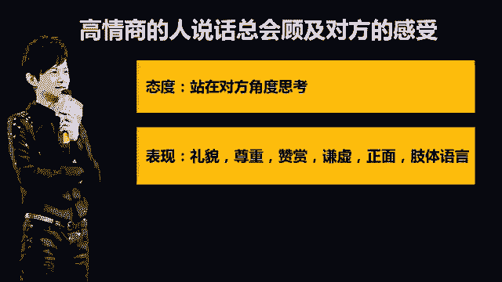
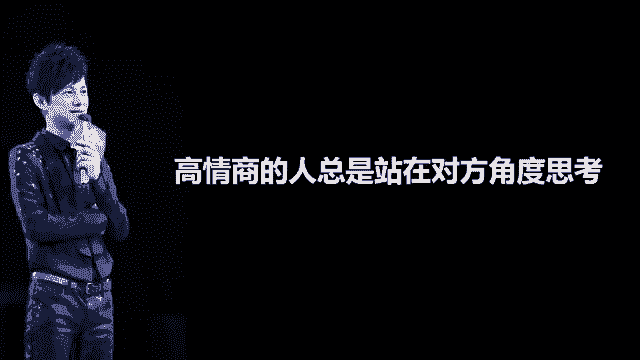
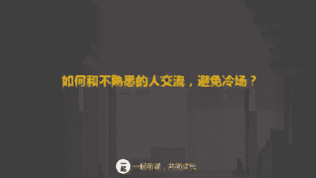
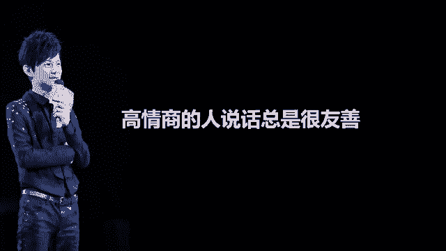
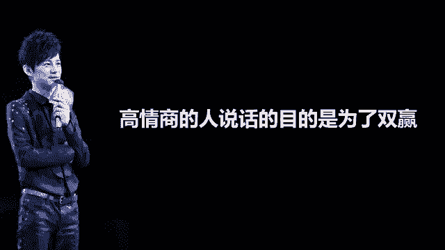

# 学会说话--高情商人士必备的高效沟通课 - P3：03第三讲：避免情绪化，高情商的说话方式（上篇） - 清晖Amy - BV1DQsSemEQR

嗯，大家好，我是你们的委言老师。我们现在开始第三节课高情商的说话方式。上节课我们讲了说话高手的第一特质、自信的沟通态度。我们阐述了自信的重要性，以及如何让自己变得更加自信的方法。

这节课啊我来讲一讲高情商人士的主要说话方式是什么呢？会说话，其实就是高情商人士的表现。小伙伴们，如果让你想一个你遇到过的高情商的人，他会是谁呢？他又做了哪些事情，让你感觉到舒服，并且如沐春风的呢。

你不妨思考一下。在我看来啊，高情商的人说话有一个共性，那就是他总是会顾及对方的感受。总是很多人问我，到底怎么样说话才能让别人喜欢呢？到底如何和别人聊天才不会把天聊死呢。经过我的观察呀，我发现会说话的人。

情商高的人都具有这些特点。从说话态度上，会说话的人总是站在对方的角度思考。从表现形式上，会说话的人都会表现的友善。这些特质包括礼貌、尊重、赞赏、谦虚，用积极正面的语言。并且啊非语言沟通。

比如说笑容啊、语气啊，都会让人感觉到非常舒服。从说话的结果来看，会说话的人不会只是索取，而更多是奉献。他们会时刻牢记沟通的目的不是为了我赢，而是为了双赢双方利益最大化。这些特点的共性都是顾及对方感受。

并且基于双方利益最大化来进行。

当你和别人交流的时候，如果纯粹就是为了卖弄自己，吹嘘自己，或者是推销自己的话，那么无论你掌握任何技巧都没有用。口才只是一个虚的东西。除了学习说话艺术以外，最重要的核心就是顾及对方的感受，并且考虑共赢了。

有些人特别喜欢说，哎，不好意思，我说话有点直哈。然后他说出来的话，从不给别人面子，也不考虑对方的感受。这种人啊，他用性格直来打幌子，其实就是典型的低情商的表现啊。性格直个性爽快，挺受欢迎的。

但是说话不经大脑就没有办法让人接受了。接下来我们来讲第一点，如何说话时能够站在对方角度思考。人人都只对自己感兴趣，只要你能表达出你对别人感兴趣，主动引导对方感兴趣的话题，你就是沟通高手。和别人沟通。

最大的忌讳就是从我的角度出发，不知道为什么别人应当重视你说的内容，而是直接向他们传递你要传递的信息。当你看到一张集体照片的时候，你通常会先看谁呢？你肯定是在看你自己，对吗？所有人都是这样子的。

如果你不关心别人，别人为什么要听你说呢？当你说话的时候啊，别人通常都会这么想，我为什么要关注你的说话，你的话对我有什么价值呢？你一定要从他们的角度去思考我的话将会给他们带来什么价值？

从他人角度出发，你要做到3点，第一，对对方有一点点了解，谈论对方最感兴趣的话题。第二，多用你我们你们少用我用这种方式来强化自己将注意力，从我转向对方。这里敲在黑板。

你可以留意一下我们说话当中有多少个我多少个你。通常啊我是你的3倍到5倍。也就是说，当你说100个我的时候，只有20到30个是说你的。可见呢我们是多么以自我为中心啊。要想站在对方角度思考。

那么你就多用你少用我。第三点是出现不同意见的时候，多采用换位思考的方法，站在对方的角度思考他为什么要这么说，他为什么要这么做。如果我们只想让别人注意到自己，让别人对我们感兴趣，我们就不太能够交到朋友。

经常有学员问我，老师在面对陌生人，我总是感觉很紧张和尴尬，我该如何打破僵局呢？小伙伴们，你们有遇到过这样的情况吗？据说70%的人在面对陌生人都有局促感，那怎么办呢？面对陌生人的时候。

最好的办法就是找到他感兴趣的话题。你可以留意关于他最近发生的变化。比如说新婚，比如说生子，比如说做了一件很棒的事情，可以顺着和他相关的话题展开。我最近面试了一个应聘者，我们约在咖啡馆见面。

他老远就向我挥手，我很奇怪的问他，你认识我吗？他说哎我认识你啊，韦安姐，我是你公众号忠实的粉丝啊，你的每一篇文章我都会看他于是谈起我公众号韦安说的一些文章给他带来的影响和改变。你看我们尚未正式开展面试。

他已经给我留下了很好的印象，就是因为他谈了和我相关的东西。我有一个学员问我，我自己很内向，哎，我很想约办公室的助理们一起吃饭，但是又很害怕冷场怎么办？小伙伴们，你们是不是也有这样的担心呢？

尤其是和不太熟悉的人，或者和老板们在一起，一方面很想和他们聊天，另一方面又总会感觉到尴尬，担心找不到共同话题。这时候你要怎么做呢？如果你能够谈及对方感兴趣的话题。那么。你的这个话题就能够发挥作用了。

你要留意对方最近对什么东西比较感兴趣，并关心他，向他询问相关的问题，然后聆听并回应，这样对话就能顺利的展开。比如对方是个年轻的姑娘，你知道她最近去了一趟澳洲旅游，你可以问她，哎，澳洲有什么好玩的。

可不可以给我讲一讲，我也想去呢？那你如果说哎呀，我也不知道他对什么感兴趣啊，那怎么办呢？我给你的建议就是你必须要提高对他人的关注度。只要你稍微留意他一点，或者注意聆听他和别人的聊天。

你就可以找到他的兴趣点。有时候自己自嘲也是打开局面的好办法。比如说谈到减肥这个话题，你可以说我也想减肥，再不减肥，我妈可能都认不出我来了。所以，在沟通交流中，要始终谨记关心别人，了解些别人的背景。

站在对方角度谈他感兴趣的话题。除了站在对方角度思考以外啊，高情商的人说话总是很友善，这些友善表现在哪些方面呢？友善是征服人心最好的办法。有一句老话说，一滴蜂蜜比一滴胆汁能捕捉更多苍蝇。友善的反面是强暴。

是粗鲁，是无理、傲慢，以及使用极端和负面的词语。

如果我们想获得更多的友情，如果我们想征服别人内心，我们首先要改变自己的说话方式，友善的沟通方式可比强硬的方式要有力的多。那什么是友善的态度呢？友善的态度啊。

就代表着像这些礼貌啊、尊重啊、赞赏啊、谦虚啊和积极正面的语言。一个有礼貌的人总是会使用更多的礼貌用语，包括你好，请谢谢，对不起，对长辈和势能高的人会用您来表示。

有时候有些小伙伴向我咨询问题，可是他连我的称呼都不都不说，直接就问我，我有些困惑，你能不能帮我解决，那这些就不是一个有礼貌的态度。一个有礼貌的人，首先要懂得尊称对方，然后才能提出自己的一些想法。

尊重和赞赏别人，就是让别人觉得自己重要。每个人都有值得赞赏的地方。只要你发现了这一点，那么他们对你的态度就会改变。尊重别人赞赏别人是一种美德，可以让对方感觉被认同，并且心情愉悦。但是你要注意的是。

我们应该真诚的去赞美，而不是虚假和夸张。你有没有被试过被人赞美，但是很不舒服的？我有有些人对我的赞美，让我听起来很假，还不如不说。那么怎么样才叫真诚的赞美呢？简单来说就是讲出事实。

他们到底什么地方做的好，对你带来的帮助和启发是什么？你不应该说你做的很棒，而应该说过去5年，这个客户一直在和我们竞争对手合作。但是在你的努力下，竟然抢回了订单，赢得了新的合作机会，你做的太棒了。

这样说才叫真诚的赞美。如果你也希望自己被赞美，如果你也希望自己的价值被别人认同，那么就请尊重别人的观点和做法，并真诚的认可和赞美，不要感觉不好意思说出口，真诚的赞美永远值得实践。三人行必有我师。

如果我们遇见的人都能认为他有比我优秀的地方。那么当我们由衷的表达出来的时候，你就会获得他们的友谊。当你费了很大力气做成功一件事的时候，你会如何表现是夸大吹嘘自己，表现出自己劳苦功高，还是低调谦虚？

当你在炫耀的时候啊，其实已经在无形中破坏了你在他人心中的形象。在当今这个社会，我们既要避免过度谦虚，又要避免吹嘘自己，过度谦虚，会将你的真才实干埋没，而且也会让人觉得你不真实。可是吹嘘自己。

又会让人远离你。我们只需要表现出适度就好了。什么叫做适度？就是以事实说话。举个例子哈，你上个月销售业绩特别好，超出目标120%。老板想让你和同事们分享，你不用说，哎，我真的好辛苦，没日没夜和客户沟通。

我用实力最后证明了自己。这样的说法难免显得夸张和吹嘘。你只需要还原事实真相就可以了。你可以这么说，过去一个月我给300个客户致电，有一个客户拒绝了我5次，但我没有放弃，我找到了他的痛点。

最终打动了他签下了这张订单。我们做这一行就是需要毅力和恒心，不要被挫折打败。如果你这么说，这就是适度的表现，既不谦虚，也不炫耀。获得友谊和赢得人心的另外一个要素就是用正面积极的语言沟通。

没有人喜欢负面消极的信息。如果一个人总是喜欢抱怨，总是愁眉苦脸，被消极情绪包围的话，那么这个人就会在人际交往中受挫折。我有个同事啊前段时间遭遇了挫折，一开始他逢人就倾诉，大家也都愿意帮他。但是帮助他后。

他还是没完没了的找人倾诉。这时候他就发现没有人再愿意听他说话，开打他了。另外一个大家熟悉的例子就是祥林嫂。他逢人就说自己的遭遇，一开始大家是同情的，但是渐渐的所有人见他都避而不及，不是人们没有同情心啊。

而是没有人愿意被消极的思维所影响。当你自己情绪负面的时候，你可以找人疏导，但是切记不能频凡。否则你会发现人人见你就躲。人们总是喜欢和正能量的人在一起，生活本来已经很苦闷了，没有人愿意听抱怨。

你喜欢和负能量满嘴抱怨的人在一起吗？如果你也不喜欢，就请避免自己的负能量吧。当你觉得某位同事某件事做的不对的时候，你要做的不是抱怨。哎，他这个人总是这样，我烦死了。你应该还原事实。你应该这么说。

某同事是负责这个项目的，但是上周有三次会议，他都没有来参加他现在的工作状态已经影响了我们的工作进度，给大家带来了困扰。所以，即便有负面信息，我们也可以用事实来陈述。当遇到困难的时候，消极思维会说。

这事情没法做。积器思维会说，来，我们来看看要如何解决这个问题。所以说啊一个高情商的人，首先就是拥有积极正面思维的人。肢体语言又称为非语言沟通，其中最重要的一个要点就是面部表情。首先就是笑容。

如果一个人整天愁眉苦脸，即使不开口，也没有人愿意和他交往。人们常说爱笑的女孩运气都不会太差，因为爱笑的人啊天生就带有亲和力，大家会很愿意和她交往。淘宝的网红张大义，大家都知道吧。

人们一想到他就想到他那张笑脸，会觉得他很可爱可亲。所以不要动不动就愁眉苦脸。这个时候看看你的表情是不是又在皱眉头了，来笑一笑吧。另外一个就是眼神的交流，和别人交流沟通的时候，眼神要敢于和对方碰撞。

不要躲躲闪闪的。眼神交流会让别人觉得你是坦诚和真诚的，也是尊尊重人的。但是要切记哦，不要一直盯着别人看，有时候一直盯着别人看，会让对方感觉到紧张，有一次我和朋友出去吃饭，有一个小姑娘第一天上班。

当她为我们点菜的时候，她突然紧张的对我的朋友说，姐姐，你可不可以不要这么看着我，我我紧张的都忘词了。所以啊最好的办法是和对方眼神交流一会儿，然后休息一下，再继续，这样穿插会更为自然。

第二个比较重要的肢体语言就是身体姿势了。当你在和别人交流的时候，不要扭来扭去，也不要四处张望。特别要注意避免一些小动作，比如说摸头发，弄一角摸脸，你这些小动作会让对方分心，让对方感觉很烦躁。

给交流带来一些障碍。你有没有遇见过一个人和你说话，带有小动作，让你很烦恼的。我就试过这样的情况。我有一个同事一说话就喜欢不停的抚摸头发。还有一个同事一聊天就喜欢摸脸。很多小动作看起来小。

但是挺让人讨厌的，会给对方增添困扰。有时候谈话会因此中断。所以你也要留意一下自己有没有这样的小毛病，如果有的话，一定要尽量避免。对。除了站在对方角度考虑和说话友善以外，高情商的人还有一个特点。

就是说话的目的是为了共赢。很多时候我们和别人聊天，总想得到些什么，或者引起别人对我们的关注，或者帮我们一个忙，是不是这样子？这个时候你有没有想过？你给别人带来的利益是什么呢？别人为什么要关注你。

为什么要一味的帮助你呢？我们和别人交流过程中要时刻谨记，我们不是来索取的，我们也是要奉献的。如果你和别人交流，只为了自己的利益最大化，那么这种交流很难打动别人，也很难获得别人认可。你在考虑自己的同时。

需要考虑我给对方带来了什么价值呢？我在实现自己目的的同时，有没有帮助对方也实现他的目的。如果我们两个人目的很不相同，我们有没有可能开发出一种共同的目的来呢？我有很多学员都有见到大人物紧张的情况。

例如和大老板沟通，缺乏信心，不太敢说话，你会不会也是这样子？老板们要和你吃个饭，即使这么轻松的氛围，你都会觉得如临大抵。有没有这样？

那么我们应该如何正常沟通呢？你首先要问自己这个问题。我有价值吗？我对老板来说是重要的吗？我是不是可有可无的呢？我对老板有贡献吗？如果你否定自己的价值，那么你在大人物面前沟通就很难交流顺畅了。

但是如果你确定自己是有价值的，你们之间交流是可以达成共赢的，那么你们的沟通就可以顺利进行。

无论是下级、评级还是上级，我们说话谈事情的目的都是实现共赢，一味的索取不是共赢，一味的奉献，也不是共赢，双方都有价值互换，并且可以双方利益最大化，这才是共赢。我想给你布置一个课后作业。

老板的老板从外地过来了，他邀请几个下属同事一起吃个便饭，你是其中的一位，你对他并不熟悉。那么你应该怎么做呢？从今天学到的站在对方角度思考友善的态度，以及实现共赢的目的出发，想一想，你应该怎么做。

才可以和老板的老板从容而得体的交流。

