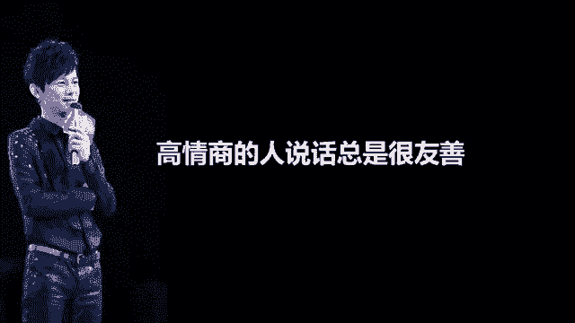
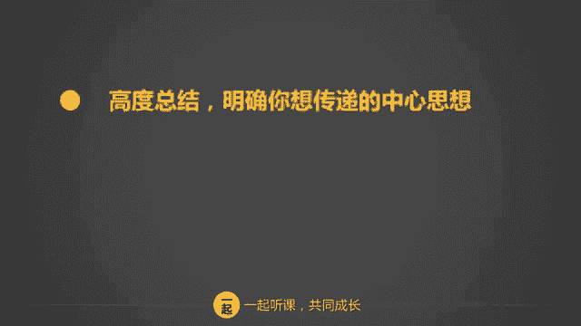

# 学会说话--高情商人士必备的高效沟通课 - P4：03第三讲：避免情绪化，高情商的说话方式（下篇） - 清晖Amy - BV1DQsSemEQR

我们刚才介绍了一个高情商的人士的三种说话方式。站在对方角度考虑。说话友善的态度，以及实现共赢的目的。

那么还有一种情况是，当我们需要拒绝对方给对方建议，或者对方比较情绪化的时候，我们应该怎么做呢？有没有一种方法既可以传递信息，又避免伤害对方呢？我们要特别注意以下几点。

这几点分别为不要当面直截了当的指出别人的错误，委婉的提出反对意见。建议而不是命令，犯了错误，就承认，避免激烈的争辩。接下来我一个一个为大家介绍。当面指出别人错误，直接带来的就是情感上的伤害。

这会将关注力啊从对视上面转移到对人身上来。即使你是完全对视，别人也会感觉这件事是针对他人的。如果你说这件事你错了，我认为正确的方法应该这样做。这样的说法无疑是在说，我比你聪明，我要让你知道你有多蠢。

这是一种挑战，只会引起争端和反抗。对方已经听不进你接下来的话了，他心里更多的是气愤、羞辱、逃避或者报复等负面情绪。我自己曾经犯过不少这样的错误。因为我很年轻，就带忠层经理，有时候难免年轻气盛。

后来经常在会议上公开挑战别人，导致到有两名中层经理的离开。离开前，有一位经理开诚布公的对我说。我明明知道是我错了，但我也不愿意服你。我需要的是自尊。听完他这段话话以后啊。我都会不断的提醒自己。

以后千万不要当面直截了当的指出别人的错误。你有没有试过自己认定的事情，但是事后证明是错的呢？我有一次和同事争论一个观点，我认为我是对的，他认为他是对的，我们谁也不能说服谁。到后来，客户看见我们争论不休。

直接给出了第三种完美的解决方案。我当时就非常懊悔，为什么会如此执着？要避免非黑即白的结果，这个世界啊除了黑和白以外。还有灰，也就是说你不一定是对的，这里也许有第三种答案，持有开放的心态。

会令你更加全面的看待事情。如果对方真的是错了，您应当指出来，你可以这么说，你说的有一定的道理，不过我还有另外一种想法，当然我也可能不对，我们一起来探讨吧。避免非黑即白的结果，既能够保持良好的合作关系。

又能够给自己留有余地。即使指出对方错误，也可以婉转的进行。婉转的提出反对意见。当你要提出反对意见的时候，我建议你需要婉转。如果你说你的观点不对，我的观点才是对的。这时候对方绝对听不见你的观点。

因为对方的情绪已经占了上风。有时候我们太急躁，太想说服对方，这样反而导致了相反的结果。当你提出反对意见的时候，可以考虑从探讨和启发的角度出发。比如说我了解你的观点了，我还有一个想法是这样子的。

我想听听你的意见。用这种方式说话，这时候你就变成了虚心向对方请教的了。对方听完后会给你反馈，最终可能会认为这是大家共同的意见。所以呀即使是提出反对意见，你也可以通过玩转和启发的方式和对方愉快的达成共识。

建议而不是命令。如果有人用命令你做事情的语气和和你说话，你会怎么想，你会不会很不舒服？就算是迫于压力，一定要做，你肯定会不那么心甘情愿，对吗？我们给出建议的最终目的是什么呢？是帮助别人是达成共识。

不是吗？很多人明明是建议，但是语气不对就成了命令。比如说你去做这件事，你不要管这个项目了，你要这样写才对。当你用这种命令的语气说话的时候，会给对方带来负面情绪。即使你说的对，别人也并非心甘情愿。

如果你换个语气，这样说。你可以考虑一下这个吗？你认为这样做合适吗？你觉得怎么样？这种说话的方式就是建议的语气。用命令的语气，你获得的不是合作，而是对立。用建议的语气会让人感觉去做这件事。

是自己主动参与的，自己更愿意去实施。不要用命令的语气去要求合作。即使是面对下属，也要尽量避免。就算面对小孩儿，也不应该用命令的语气。有时候我对啊我儿子说，你快点来吃饭，他会非常不开心，然后磨磨蹭蹭的。

但是我换一种方式，哎，饭快冷了，你早点吃完饭，我们就可以一起玩游戏了，你觉得怎么样呢？我这样一说，他就开开心心的过来吃饭了。不同的说话方式可以达成不同的效果。如果真的是自己失误或者对别人造成了误会。

那就应当勇于承认错误，这样可以及时的避免误会。很多时候啊我们犯的错误是为了维护自己的尊严。都急于为自己辩解，那样做其实于事无补啊。这样做的后果可能会对人际关系带来负面的影响。

我不久前和一位同事在电话里发生了争执，但是我挂完电话后冷静下来，发现是我误会了他，于是我立即打电话给他承认错误。这样做之后，我们当下就消除了误解。承认错误只会更有利于信任关系的建立和事情的解决。相反。

如果为了顾全面子而不承认错误的话，更容易让人产生误解，对你产生怀疑。有时候我会对下属承认错误，我做了一个决策，事后证明是无效的时候，我会说我承认我这件事情是判断错误了，我们再试试别的办法吧。这样说完。

下属会更有信心和勇气去面对问题。我们都不是完人，只有及时承认错误，才可以修补关系，并不断的提高自己的能力。避免激烈争辩。你即使是双方的观点，有非常大的不同，也要尽量避免激烈的争辩。

人人都希望得到别人的认同。可是就算你赢得了争辩，其实也伤害了别人的自尊心，对你心怀不满。永远不要和人发生正面冲突，你要相信你不一定是正确的。从对方的角度考虑，也许你还会认为对方说的很有道理。

你有没有试过和人激烈的争辩？你的感受怎么样？坦白的说，我的感觉是很不好的，争论赢了，对方感觉很不爽，争论输了，自己又无比沮丧。激烈的争论对人际关系的破坏具有很大的杀伤力。

而且有时候争论也不一定能争论出一个结果，最终就导致不欢而散了。我渐渐的发现啊，人们是不会因为你的距理力争而改变自己的看法的。其实每个人都挺固执的，人们不会因为谈话内容而改变。

而是会因为谈话氛围而改变自己的观点。这句话怎么解释呢？也就是说，如果谈话氛围是好的，那么就比较容易达成共识。但是氛围很差的话，即便你说的再有道理，人们也会情绪化的拒绝接受。真的有意见的不同。

应该想办法用共同商量的方法来解决。关于这一点，我们会在后面的章节详细说明。总结一下，当我们需要拒绝对方给对方建议或者对方情绪化的时候，在这些方面需要格外的注意。如果你能够不断的练习。

那么你就可以实现既正确的表达观点，又能和他人积极展开合作的目的了。接下来我们要讲一讲如何避免沟通低手常犯的一些错误，要成为沟通达人啊，我们需要避免这些误区。好了，这些都是一些沟通匕手常犯的错误。

打断别人说话，用绝对话的词语做事后诸葛亮，对人指手画脚，啰里把嗦。那么这些讨厌的习惯如何改掉呢？我们来具体讲解一下。

打断别人说话，在我看来是一种非常粗鲁的行为。我有一个同事口齿伶俐，但是每一次开会讨论到别人发言的时候，他总是急不可待的说，哎，对不起，打断一下，我认为怎么样怎么样，偶尔一两次也就罢了。

但是长时间这样做真的很令人反感，最后导致到也没有人愿意跟他沟通。把别人的话打断啊，即使语气再客气，也是一种无理的行为。在不了解别人的全部观点的前提下，进行反驳或者建议，就是以偏概全的无理行为啊。

既伤害了别人，也让自己的信息接受不全。请让对方把话说完，再发表你的看法和意见吧。不要用绝对化的词语，我刚刚开始工作的时候，特别喜欢用绝对这两个词。直到有一天，我的老板和我做业务回顾时，他终于忍不住了。

他挑战我说，世界上没有绝对二字，如果你一直用绝对来说话，只能说明你的思想很狭窄。用绝对话的词语，比如说你绝对是错的，我绝对是正确的，你一定会为此付出代价，你一定会后悔的。

这一类的话其实都是一种缺乏自信心，保护自己的行为。没有什么事是绝对的。当你认为自己是对的，或者你被对方激怒时，你就容易出现绝对话的词语。用绝对话的词语，你就等于切断了继续和对方交流，最终达成共识的道路。

对方并不会因为你用绝对话的词语或者因为你的强势就妥协。相反，对方会认为你的观点很偏激，即使他表面上妥协，内心也不会认同。更何况你也不一定是对的。所以啊如果想展开顺畅的交流。

无论在任何情形下都要避免绝对化的词语。试着比较一下这两种说法吧。你的观点绝对不对，我认为正确应该是这样做。😡，换一种说法，你这样说，OK你说的观点我已经了解了。不过我有一个不同的观点，我们来探讨一下吧。

这两种说法，哪一种说法更让人信服，毫无疑问是后者嘛？事后诸葛亮是最让人讨厌的行为之一，别人做事失败了，很多人就喜欢说，你看吧，我早就提醒过你，你不听。

说这种话，除了让对方感觉心灰意冷以外。带来不了任何的好处。即使你曾经提醒过对方，但对方不听，也不能在别人受到挫折后再补一刀，这样做没有意义。不会因为你说了就显得你多么聪明，因为对方已经很挫败了。

他不需要别人来证明他有多蠢，你有多英明。有的时候啊和自己家里人特别容易犯这样的错误。比如说你老公换了一份工作，但是做起来并不如想象中那么顺利。你会说我早就说过了吧，你上一份工作好好的，你就是不听我的。

太后悔了吧。你这番话一说出来啊，就会让对方更加郁闷，更加生气了。有些父母也会犯同样的错误，比如女儿和老公吵了架，生气生气回娘家来。妈妈会说，我早就告诉过你，那个人不行，靠不住，你活该今天这么受气。

这些话给女儿带来的除了万念俱灰，没有任何好处。所以，无论在任何情况下，都请避免说出事后诸葛亮的话。不要指手画脚。很多人喜欢给别人提建议，说，哎呀，我看小明条件那么差，你还是跟他分手算了。

我建议你啊赶紧再找一个。类似这样的话，这样的行为千万要避免。不要轻易的否定别人，也不要随便对别人的事指手画脚，除非别人征求你的意见，否则不要随便对别人的事进行点评或者给出建议。你并不是当事人。

你无法体会当事人的真实状况。喜欢指手画脚的人，通常都不会有人愿意和他交流的。不要说话啰嗦，你有没有遇到过说话啰嗦的人？我发现说话啰嗦是很多人普遍存在的一个毛病。和说话啰嗦的人一起共事。

可以讲是一场地场灾难。如果你希望自己能够给人干练明快的形象，你必须要让自己说话，不要拖泥带水。不要反复重复你的说话内容，你要让你的话变得简单明了。说话啰嗦的人在单位上不会受到领导的青睐。

在生活中也不一定能处理的好婚姻家庭关系。说话啰嗦啊，其实是思维不清晰的直接体现，通常啰嗦就代表找不到明确的中心思想。这一点如果不改变，在工作上带来的直接影响就是老板不愿和你交流，同事不愿和你合作。

负面影响非常大。在婚姻家庭上也会有影响。事实上，有谁愿意和一个啰里吧嗦的人交往呢？想要得到改变，从调整思维结构开始。如何能调整呢？这里有三个要点。第一个，学会用简短的话进行总结，明确你想传递的中心思想。

你看到一个事情要锻炼自己，用一句话来总结。比如问自己为什么和你同期进入的公进入公司的某某人可以得到晋升，请你用一句话来总结。因为他善于处理和老板以及同事的关系。因为他非常有客户管理经验，因为他实力超群。

再比如关于有人说要赶紧买房子，有人说不能买房子，你怎么看你的观点是什么？你不能啰里吧嗦的说一大堆，你要用一句话总结出来。例如我不会买，因为去年我市房价已经涨了50%，现在已经滞障，我认为短期会回调。

你需要养成一个总结的习惯，看见任何事情，要努力总结出自己的观点，而且不能啰嗦，要高度总结。表达信息要直接，你到底要表达什么？用123点总结归纳，总结归纳是锻炼思维能力的一个最重要的要点。

我们平时讲话都是散漫的。你想想看我们平时说话是不是多数是属于无序的呢？比如妈妈和我们聊天，聊家常就是典型的无序沟通，想到哪里说到哪里。但是在职场这样的沟通就是大忌了。培养自己归纳信息的习惯。

最重要要学会三要点原则。为什么是三呢？三是一个很神奇的数字，很多人都喜欢用三。比如说三个臭皮匠胜过一个诸葛亮，三只火枪手，三只小猪，三宝大卖宝莱坞。在人们的记忆里啊，三是比较容易让人记住的。简单来说。

3比4比5更有效率。所以你每天要经常锻炼一下自己的三要点归纳。比如下班前问问自己，今天工作有什么收获啊，用123点来总结。再比如说你说你最愿意和你先生聊天，我问你为什么呢？请你列出三点。

你说一他很关心我的工作。2、因为他总是聆听。3，他会给我出很多主意。通过这些不断的锻炼。

来提高自己的总结归纳能力。第三点，调整说话结构，直奔主题，结论先行。我们中国人讲话的结构通常是这样子的，因为怎么样怎么样怎么样，所以怎么样怎么样怎么样。但是通常啊讲原因的时候讲太多了，人都听晕了。

失去了耐性。对你之后非常重要的结果早就不想听了。所以啊你首先你要改变说话结构结构，从因为所以改变为所以因为。我在这里给你举个例子哈。😊，比如说你想让老板支持你一点费用来解决某个客户高库存的问题。

如果不解决啊，该客户的库存以后有钱都没有办法解决，而且会影响客户再进货，直接影响客户关系。本来呢你提这个需求已经有点发怵了。你对老板这么说。老板有个问题，呃，因为某某客户6个月前进了一批货。

这个客户后来隔壁店铺又装修，嗯，我们的销售不好，嗯，周转变慢了。老板，我现在很困难，可不可以给点费用支持，把这批货清掉。老板一听你这么一说就很不高兴了。他就打断你的话，谁让你当初订这么多货的。

这时候你支支吾吾说，我我也没想到老板。老板继续把你的话拿断，我没有费用，你自己想办法吧。你看这就是典型的因为怎么样，所以怎么样？在因为这个阶段已经把老板的耐心给耗掉了。我们尝试换一个说法来说。

老板能否支持5万元费用帮助清掉这个客户的库存？我提出这样的支持是基于3点。第一，该客户库存有3个月，隔布隔壁店铺装修影响了人流，导致出货受到影响。第二，现在用5万元清掉库存以后可以再进30万的货。第三。

由于货的影响，再不清，恐怕以后没有机会清了，会影响的和该客户的进一步的合作。所以老板现在清货是最好的时机。你看这么一调整，无论老板能不能答应，老板对他的要求都是非常明确的。他的。明确的中心思想是什么？

就是要5万块钱来去清库存，对吗？那么他表达的信息是什么？是三要点原则，123对吧？然后他的说话结构是什么？首先是结论直奔主题，然后再是论据去支持它。所以用这样一整一调整结构以后。你的话题就非常的清晰了。

掌握好总结要点归纳和调整说话结构这些技巧，你将大大改善，说话啰嗦，找不到重点的毛病。好，我们总结一下这些沟通低手常犯的错误。我们在日常生活中要不断的练习，尽量的去避免他。关于高情商的说话方式。

我们向大家介绍了三种最有效的沟通方式，包括从对方角度出发、友善的说话方法，以及基于双方利益最大化的沟通目的。我们还给大家分享了拒绝和建议别人的一些正确的方法。

同时还重点向大家介绍了如何避免一些沟通低手常见的错误。结束之前，我给大家布置一个功课，回去思考一下，对自己最近一个月做的好的地方和做的不好的方面做个总结，需要包括你的一句话结论，你的中心思想的要点归纳。

好了，今天的课就到这里了，预祝大家听课愉快。我们下一节课啊将为大家讲述沟通高手的第三个特征，关切的倾听他人。

