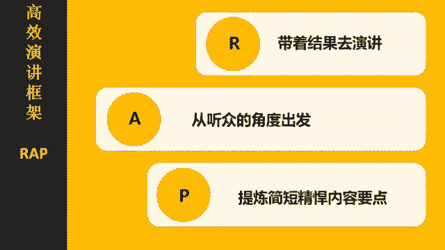
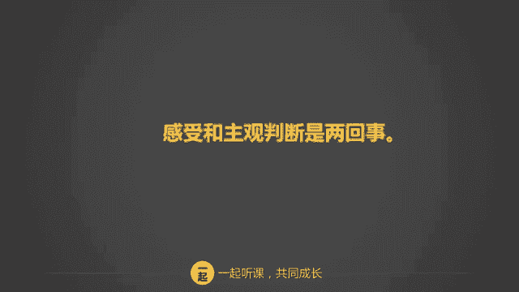

# 学会说话--高情商人士必备的高效沟通课 - P7：06第六讲：诚实表达感受，清晰表达自我四步骤（上） - 清晖Amy - BV1DQsSemEQR

小伙伴们，大家好，我是韦安老师，我们又见面了。😊，这是我们关于高情商人士必备的高校沟通课的第六节课了。这节课啊我们要分享高情商人士高效沟通必备课的进阶课。第二个沟通技巧。如何诚实的表达感受？

上一节课啊我们讲了呃高效演讲的rap原则，你们练习的怎么样啊？在本节课开始之前，我们先复习一下rap的三个要点好吗？rap are rap里面的R就是result，带着结果去演讲。A是audience。

从听众的角度出发。P是 points提炼简短精悍的内容要点。这个rap啊非常好用，你可以用在演讲上面，也可以用在向老板汇报工作，以及和同事沟通上面，多加练习，你们的说话效率就会提高了。对了。

你们在练习过程中有没有遇到什么样的挑战，记得分享给我，可以在留言区留言哦。我会抽空来解答你们的问题的。😊，好了，我们啊接下来进入真今天的正题，如何正确的表达感受。

你们一定很好奇正确表达感受和沟通交流有什么关系呢？好了，在讲课之前我们来讲一个案例。小丽最近很不开心，她老公已经连续一个月晚上加班到很晚才回家了，每一天她都早出晚归。

小丽和孩子们睡着了才才回家，早上也很早就出门，几乎连说话的机会都没有。昨天，小丽的先生破天荒第一次6点钟下班，原来呀他是回家收拾行李的，他临时要当晚就要出差。小丽忍耐已久的怒气，终于按耐不住了。

她咆哮着对先生说，你眼里还有没有这个家。你有没有遇到过这样的情况？有时我们非常沮丧、伤心或者愤怒，但是很多时候我们都没有办法明确的表达出自己的感受。为什么我们无法表达感受呢？这里可能两个原因。

第一个原因是你不知道自己的感受是什么。第二个是你不知道应该怎么说才合适。所以很多时候啊我们生闷气，我们心情低落，我们控制不了情绪。但是啊这些情绪其实对解决问题都没有任何的帮助。

别人可能都不知道你为什么要不开心，也有可能压根不知道你心情郁闷，更加不知道你到底想要干什么。那遇到这种情况怎么办呢？很重要的一个要点就是要学会真诚的表达自己。你敢于正视自己的感受和需求吗？

如果不敢面对自己，就做不到真诚的表达自己，更谈不上有效沟通。所以今天这一节课我们会跟大家分享这四个步骤，如何真诚的表达自己步骤一，我们看到了什么？步骤2，我的感受是什么？步骤三是什么导致的这个感受呢？

步骤四，我们的要求是什么？我们一步一步来讲解。第一步，我们看到了什么？根据我们看到的东西，说出事实，而不是做出结论。我们经常将事实和结论混淆，而这种没有根据事实就来进行判断的结论。

往往会带来沟通中的争议和情绪。但这么讲，你们一定很难理解，对吧？接下来我们用例子来讲解一下什么是事实，什么是结论。好想避免争议，就请说出看到的事实，而不是妄下结论。那么下面这几段话，你们看一下啊。

哪些是事实，哪些是结论呢？你不相信我的能力。😡，这个是事实还是结论？这个是结论呢。上个月你委派了tm做我的导师，你还让mary分担了我一半的工作。这是事实还是结论呢？很明显，这个是事实。

接下来你故意刁难我。😡，请问你这是事实还是结论？我相信你的回答应该是结论。我听我的老板反馈，你反馈说，我在这个项目中没有积极配合你。我也留意到，在昨天的会议当中，当我和你有不同意见的时候。

你当众指责我对这项工作不称职。那么这个是事实还是结论呢？很明显，这个是事实，对吧？接下来。😊，你不喜欢我了。😡，结论还是事实呢？当然是结论。再来最近这三个月我们见面只有两次，每次给你发微信。

你很久才回复打你电话，你要么不接，要么就在忙草场挂掉，而且我发现你不再主动联系我了。那我想问小伙伴们，你觉得这个是事实还是结论，我相信你的答案一定是事实，对吧？所以呢你会看见事实和结论。

它根本就是两件事情。我们要分清楚。什么是事实？什么是结论？如果我们能学会分清什么是事实，什么是结论的话，那么我们就可以勇敢的表达自己。引发情绪和争论的多数是来自于结论和判断。而基于事实的沟通。

通常都不会引发情绪。为什么我这么说呢？答案很简单呢？因为你讲的是事实啊，讲的事实，那有那有什么好那好说的呢？我们再用小丽的案例来演练一遍好吗？啊，小丽她不开心，然后他对着他先生咆哮说。

你眼里根本就没有这个家。在小丽的案例里啊，她感觉非常的伤心和生气，所以他对先生发火，但是发火能解决问题吗？假如你是他先生，你这个时候会有什么感觉呢？恐怕你是觉得莫名其妙吧。她老公可能在想自己工作这么忙。

你不单多些理解，还无理取闹。这么一来啊，两个人搞不好，还会因为情绪的问题直接上升到争吵。如果我们用我们看到的事实，而不是情绪来沟通，又会有什么样的结果呢？好，如果小丽这么讲。啊。

我注意到你最近一个一个晚，最近一个月，每天晚上都加班到很晚。回来的时候我们都已经睡着了，早上你走的也很早，我们几乎没有交流的时间。那么你看这句话，其实就是反映了事实，对吧？

后面这几段话其实都是我们接下来会跟大家讲的一个要点。我们可以提前跟大家呃沟通一下。小丽接着说，我有些失落，我感觉我和孩子被忽视了，这是小丽在传达她的感受。为什么会有这些感受呢？因为小丽接着说。

因为我连见你的一面都很困难。好，那小丽有什么要求呢？我想了解你到底是怎么想的，这样的状况还要持续多长时间？你看这么一说啊，你觉得小丽的老公反应会是怎么样，她应该不会发火，对不对？她也不好意思发火嘛。

因为小丽反映的是事实情况，而且呢小丽也也提出了自己的感受以及她的要求。这时候小丽的老公可能会反思自己最近是真的不太顾家，也没有顾及小丽的感受。你看同样一个呃问题啊，同样一个情况。

不同的沟通方式就会带来不同的结果。对于任何问题。不带情绪的反映事实。如果基于事实的沟通，我们就会让问题处于理性的状态。所以当我们遇到棘手问题的时候啊，我们要做的第一步就是控制情绪，说出事实，不要猜。

也不要带情绪，这样呢就会为对话的展开打开了良好的基础。在说出事实之后，我们要学会正确的表达自我感受，表达自我感受容不容易？小伙伴们。你可别点头，我告诉你啊，多数的人都不会正确的表达自己的感受。

为什么这么说呢？我们用一个案例来表来说明吧。公司有个同事叫做老王。他的资历比较老了，他准备在这间公司退休，他特别喜欢研究中国历史，也很喜欢跟别人讲历史故事。每次开会的时候啊，只要谈到某个话题。

他总能联想起某个历史故事，然后说个不完，说个没完，常常半天会下来，历史故事听了一肚子，问题一个没解决。同事们碍于他的年纪和资历都不吭声。但是大家知道这样下去，已经严重影响了工作效率。

而你呢是团队的leader也是项目的负责人，由于老王的影响，已经严重耽误了工作的进度。你急于想改变现状。那么你的感受是什么呢？请准确的描述。好了，你能准确说出自己的感受吗？你是愤怒，是无奈。

是绝望还是其他？你此时可能在想，哇，我竟然一时半会儿找不到合适的形容词来正确形容自己的感受，对吗？为什么体会和表达感受，正确的感受这么不容易呢？你想一想。

你最近一次向别人说出你的真实感受是什么时候的事情了。你有对别人说啊，你这么做，我很不开心，你有对别人这么说。你你这么说，我真是太激动了。你你讲这句话的时候是什么时候了？所以我想问大家。

你习惯这样表达自己的感受吗？如果我没有判断错误的话，大多数人都回忆不起自己什么时候和人表达过感受，为什么表达感受这么难呢？这里面可能和我们的成长环境背景有很大关系。

比如说很多人和父母之间从小就没有培养起交流情感的习惯，我们的爸爸妈妈也通常习惯了掩盖他们的情感。你的爸爸妈妈会经常说爱你吗？有时候你对爸妈的一些行为，比如说他对你过度关心。

或者对你的一些情况过于过于武断。那么这些做法你敢于向他们表达你真实的感受吗？如果你从小没有培养出表达感受的习惯，我们在交流当中啊就比较难的去面对自己的感受，更不用体向他人，坦诚表达自己的真实感受了。

那有些职业其实也限制了表达感受。比如说。技术人员啊，律师啊、警察呀这类工作，他们的职业都需要特别的理性。那么这种理性呢和表达感受也有着一定程度上的冲突。还有些人呢就不知道什么叫做表达感受。

他可能从来没有想过感受是要自己表达的吗？难道自己开不开心自己的情绪，别人看不出来吗？还有我来说吗？对吧？他也不知道应该要去表达，还有一些人呢是不敢表达自己的感受，啊，他甚至隐瞒自己的感受。

他不想让别人看到自己脆弱的一面，他认为这样可能是羞愧的，另外一个呢就是他觉得如果隐藏感受的话，他可以从事实上压倒别人，所以他要隐瞒自己的真实感受。那么哪一些是感受呢？我举个例子来说啊。

比如说你很开心的时候，你可以说哎感激高兴快乐，我觉得很幸福，我觉得很乐观，我感觉很感动，我感觉很兴奋。😊，那当是但是当你负能的爆棚的时候，你可以这么表示，我感觉很害怕，很担心、焦虑痛苦，我感觉很绝望。

我觉得很愤怒，很悲伤。那么这些都是通常我们用于感受的一些啊表达的一些词汇。表达感受啊最大的一个误区就是没有办法区分感受和想法的区别。那这句话怎么来解释呢？我们来看一些例子哈，什么叫做感受。

什么叫做主观判断。下面哪些话是表达了感受，哪些是主观判断的？比如说你拒绝了我。我很伤心。那你觉得第一这个这句话是感受还是主观判断呢？这是一种感受哈，我觉得你很讨厌。那这是感受还是判断？很明显。

这个是主观判断，对吧？你把玩具扔的到处都是我很失望，那这是感受还是主观判断呢？这是感受。你是个捣蛋鬼，那这个很明显呢，主观判断。这件事我搞砸了，我很遗憾，那这是感受吗？对，这是感受。我是个loser。

那我是个失败者，那这是感受还是主观判断？答案是主观判断，你来看我，我很开心。这个是感受，我觉得你不爱我了，那这个是感受还是主观判断呢？我相信你们的回答应该是主观判断。

对吧。我们呢经常会把感受和主观判断混淆，感受呢是说出自己的真实情感。而，主观判断是我们的一种非理性的一个结论。当你表达感受的时候，别人会意识到这件事给你带来的影响。当你表达你的主观判断的时候。

别人可能就会误解你的意思，并且为此产生误解、误会或者冲突。那么我们回到老王的ki上来。我们进行两种模拟情景，一种假设是你直接表达你的观点和看法。你很焦虑了，总有一天你忍不住了，你大声的对老王说，老王。

你知不知道你耽误了整个项目进度？好，这是你的一种直接表达自己的呃这个主观判断的一种说法。如果你这么说，老王会是什么感受呢？他可能会跟你吵起来，对吧？或者老王非常的不爽，总之呢对解决问题毫无益处。

你说对吧？那我们用刚学会的说出事实和表达感受来进行沟通看看。好，老王，我们最近开了几次会，本来都是要讨论项目立项的事宜的。但是我留意到会议期间，你用了比较大的篇幅来描述秦始皇和武则天的故事。

那这个就是我所看到，就是我们看到的事实情况嘛。我们跟老王沟通，我们看到什么事实。然后我们的感受是什么呢？我们觉得故事很好听，但是我们有点担心会影响到项目进度。啊。

接下来我们可以说一下我们为什么会有这样的感受。因为我们应该讨论的项目不能在有限的时间里讨论完，所以这个问题会导致到我们感受很担心，对吧？那我们的要求是什么呢？我们能否在会议期间只谈工作呢？

你的历史故事可否在中午吃饭的时间讲给我们听，你觉得怎么样？好，那通过这样的一些方式。那我们可以去呃更加妥善的跟老王来去表达我们想表达的意思，而不是鲁莽冲动的给他下结论，直接告诉他，你耽误了我们的工作。

只有清晰的表达真实的感受，你才能获得别人的理解和认同。我们必须要学会正视自己的感受，并懂得真诚的表达自己的感受。

