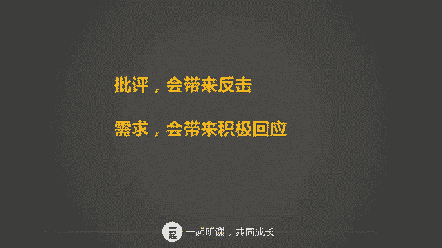
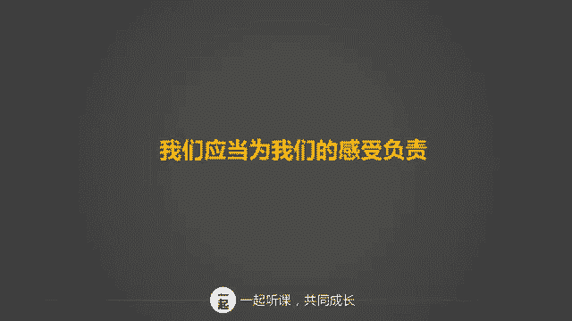
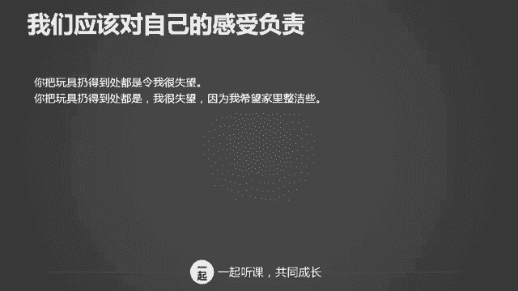
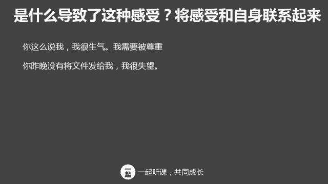
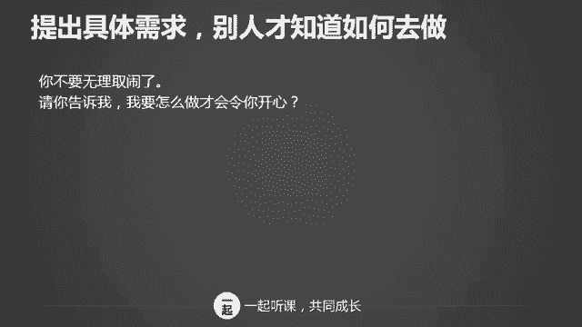

# 学会说话--高情商人士必备的高效沟通课 - P8：06第六讲：诚实表达感受，清晰表达自我四步骤（下） - 清晖Amy - BV1DQsSemEQR

好，第三步到底是什么导致了我们的真实感受呢？我们需要将感受和自身联系起来。你为什么不开心？你为什么愤怒？你为什么会郁闷？你觉得这些感受全部都源源于他人吗？还是和你自己的需求有关系呢？

比如说如果你和你跟男朋友本来已经约好了吃晚饭，但是他下班前打电话给你，告诉你，临时要加班，不能来了。此时你很失望。那么你的失望到底是因为男朋友爽约呢，还是你的失望，是因为你本人很渴望见到男朋友？

那我们要思考一下这个问题啊，到底是别人导致了你的感受，还是你自己的需求导致的你的感受？大多数情况之下，我们的感受啊都来自于我们对自己的一个需求。为什么是自身的需求，而不是受到他人的影响呢？

你听到听到让人不舒服的话的时候，你是自责还是会指责对方，还是会了解自身的感受，还是会了解对方的感受？我们的感受啊其实是来自于自身，而不是别人，只有了解自身的感受和愿望。

你才能将情绪从别人身上转移到自己身上来。好，但这么讲，你可能理解上可能还有一点啊差距。所以我们呢来举个例子。你本来计划7月请两个星期的假去美国玩，老板呢原来已经答应批准你的假期了。

但是由于公司突然接到一个新项目急缺人手，所以老板又不同意你的假期了。这时候你说我很生气，老板说话不算话。你如果这么说的话呢，你的生气是因为老板，对吧？你的根源来自于老板，但是我们仔细考虑一下。

难道我们生气完全是因为老板吗？假如我们自身没有需求，我们对去不去美国无所谓的话，那么你就不会生气了，对吧？所以我们换一个角度来说，我很生气，老板说话不算话，我很想利用暑假带儿子出去玩。好了。

当你这样说的时候，你就把感受和自身联系起来了，你就不会认为。你的感受全部都是来自于别人的错。这是因为你有需求啊，所以这些需求才会给你带来不同的感受。当你批评别人的时候，别人通常反应是什么？你回忆一下。

他们通常的反应肯定就是辩解，或者是反击你，对不对？但是当你听到别人明确表达他的需求的时候，你的反应又是什么呢？你可能会恍然大悟哦，没想到我这么做，竟然让他这么不开心，你也有可能考虑哦。

原来他的需求是这个，我的确应该关注一下，我疏忽了，对吧？当别人对你明确表达他的需求和感受的时候，你可能还会反思自己。问题是啊，我们大多数人碰到问题的时候，总是会考虑别人有什么错。

而不是从自己需求的角度出发。比如说如果老公乱扔东西，我们就会批评他，总是把家搞得这么乱。但其实你烦恼的原因是因为你喜欢家里整洁，并且你并没有明确的告诉他你的感受和你的需求。

所以说批评会带来反击，但是提出需求，你有可能会带来积极的回应。这就是为什么说我们应当为我们自己的感受负责。那我们接着再用一些例子来说明这个道理。我们应该怎么样对自己的感受负责呢？你把玩具扔的到处都是。

令我很失望。你把玩具扔的到处都是，我很失望，因为我希望家里面整洁些。你说好昨晚和我一起吃饭呢，结果你没来，我很不开心。

你说好昨晚跟我一起吃饭的，结果你没来，我很不开心，因为我很想和你在一起。我没能及时完成项目，导致到你受到连累，我很沮丧。我没能及时完成项目，导致到你受到连累，我很沮丧。因为我想我们能把项目做好。

你认为我没有处理好和婆婆之间的关系，我很郁闷。你认为没有处理好我和婆婆之间的关系，我很郁问，因为我已经尽了最大的努力。好吗，你上面这句话跟下面这句话，你看见了什么不同吗？当我们遇到问题的时候啊。

上面一句话是表达他人的行为让我们不开心。可是下面的一句话是什么呢？就是我们自己的想法和观点，让我们自己有了情绪。当我们学会将感受和自我联系起来的时候，我们就会把矛盾从对方身上转移一部分到我们自己的身上。

道理很简单，如果不是源于自身的需求，我们也不会有相应的感受，对吧？我们其实不应该把自己的感受全部归咎于对方。我们最终要对自己的感受负责呀。很多时候我们只提及他人的行为或者指责别人。

这样其实都是忽视了感受和自身的联系。用我感到什么样的情绪，这是因为我希望怎么怎么样这样的说话方式，你就会认识到你的感受和自身之间的关系了。当我们学会将感受和自我联系起来的时候。

我们就会对待问题上面呢趋向理性和客观。我们也不会单纯的把责任全部归咎于他人。好，我们再来练习一下感受如何和自身相关。你这么说，我，我很生气，我需要被尊重。你昨晚没有将文件发给我，我很失望。啊。

第一句话的时候，我们有没有跟将感受和自身联系起来呢？有的哈就是我们觉得我觉得是要被尊重。所以呢我很生气。那么第二句话有没有呢？这也就没有，就是我把责任归咎在你身上，因为你没有把文件发给我。

你数字又算错了，我很生气，因为我很看重这次汇报。好了，这句话有没有跟自深联系起来呢？答案是有，因为我看重这次汇报，所以我才会生气。呃，接下来你升职了，我很高兴。那么我很高兴跟自身有没有关系呢？

这个更多的是跟你有关系，是你让我高兴了。那你成功了，我很开心，因为你是我的骄傲。好，这又是将感受和自身联系起来的一个例子。因为我觉得你是我的骄傲，所以我为你感到高兴。

你提出辞职，我很难过，那我的难过跟谁相关呢？跟你相关。所以这句话没有将感受和自身联系起来。你提出辞职，我很难过，因为我一直很器重你啊，这又是一个例子，是如何将感受和自身联系起来。我难过，是因为我器重你。

而不是因为你提出辞职。好，这个练习过后，你感觉怎么样？将感受和自身联系起来啊，一方面可以将重心从他人那里转移一部分到自己。另外一方面呢可以让别人更好的理解你的感受和需求。如果不和自身联系起来呢。

你就会将所有问题一味的全部推到他人的身上。这样对解决问题没并没有什么帮助。你们你们感觉怎么样？好，第四步表达感受的第四个步骤就是提出要求。你敢于提出要求吗？我仿佛看见了你犹豫犹豫不决的表情。是的。

很多时候我们都不敢提出要求，为什么呢？可能我们害怕吧，害怕被拒绝，对不对？那我提出要求他被拒绝了，我不是很丢脸吗，对吗？第二个呢是我们以为他懂。你们想我不说他也应该知道吧，我都这么不开心了。

难道他还不知道我为什么不开心吗？😊，另外呢，可能我们自己也不知道自己想要什么，我们觉得对方应该知道我想要什么吧。我们天天在在一起，难道他还不知道我想要什么吗？

但是这个都是我们没有不能够有效提出要求的一些弊端。如果要想解决问题啊，你需要更加深入的了解自己，你得学会如何提出要求，只有提出明确的要求，别人才知道怎么去做呀。

那我们用下面的例子来说明一下什么叫做具体的要求。你不要无理取闹了。😡，这个要求具不具体？不具体是吧，我应该怎么样做才叫不叫无无理取闹呢？请你告诉我，我要怎么做才会令你开心。那这个要求具不具体。

答案是具体的对吧？你总是替我做决定。请让我成为我自己。那这个要求具不具体？答案是不具体，什么叫做成为自己呢？好，下面一句话是我想从事绘画艺术，这是我终生的梦想。请你支持我考美术学院。那这个要求具不具体？

我相信你的回答一定是具体，对吧？再来看个例子。这是你本周内第三次爽约了，到底想怎样？好，这个要这个有要求吗？这没有提出具体的要求。那么我很想见到你，我已经一周没有见到你了，我们要怎么样才能见一面呢？

那这个是不是具体的要求？那这个是啊，就是你已经提出来我们到底要怎么样才能见一面。

这些要求都比较都都比较好理解吧。嗯，如果你用抽象的话语的话，你就会影响别人对你的理解，而且很容易产生误解。别人又不是我们，他们怎么可能猜懂那么准，我们到底需要什么呢？所以你真的有想法。

就要敢于提出具体的要求，不要让别人猜，也不要让别人误解。沟通的很多障碍大多来自于我们自己不清楚自己对他人的期待。这句话怎么理解呢？简单来说就是沟通中的误解，多数来自于没有明确的目的。你理解我的意思吗？

😡，所以呢我们通常用这三个三个三个步骤来进行。第一，你到底想要什么？你提出你的要求，而且要求越具体越好。另外一个，你还要确定别人是否正确理解。你可以问别人，嗯，你你觉得我我的这个这个问题对不对？

你理解我吗？所以啊有时候说话会产生误解，你要请求别人给一些反馈给你，以确保别人正确理解了你。那为了让大家明白如何提出要求，我们来做个练习。你刚刚身为部门主管，你接受了老板的一个任务。

要求在3天内完成对新项目的定位和市场分析。你把这个任务交给了你的下属小刘。小刘过了一会儿走过来对你说，对不起，我不会做，我没有做过这样的分析，还是你自己做吧。你真的很生气，你觉得小刘没有把你看在眼里面。

😡，那么。你决定呢用冷静的方式来正确的表达感受。怎么做呢？我们刚已经讲了四个步骤，对吧？看到的事实表达感受。那你的感受的根缘到底是什么？然后提出要求。那我们来重新演练一遍。好，小刘。

这是老板交给我们部门的任务，你说你不会做，让我来做啊，这是我看到的事实。我对你这样的做法感到很失望啊，我们的感受是什么？因为我认为我们有责任共同完成老板交给我们的任务，这也是公司花钱请我们来的价值。

那这是造成我们失望感受的这个根源。你不会做，我们可以一起探讨如何来做。我们需要一起努力来完成。那我已经提出了我明确的要求了。你可以提出你的困难，我们来共同来解决你觉得怎么样？

为了确保小刘知道我的要求是什么，所以我会再一次去询问他，让他没有产生任何的误解。好了，你觉得。😊，这样的啊跟小六的沟通。小刘会怎么会不会能够更容易接受这个新的项目呢？这样沟通的方式，你既表达了感受。

又提出了明确的要求。学了这四个步骤以后，我们再来再回头来看一下之前的两个案例，利用这两个案例帮助大家再一次加深对表达感受的理解和运用。好，小丽的案例，那同样是看到事实，表达感受感受的根源是什么？

最后提出要求。我注意到你最近一个晚上都加班到很晚，每天回来时我们都已经睡着了。早上呢你也走得很早，我们几乎没有交流的时间，那这是我看到的事实。我有些失落，我感觉我和孩子被忽视了。我的感受是什么？

我的感受是失落，那是什么导致这样的感受的原因呢？是因为我们连见你一面都很困难。我想了解你是怎么想的，这样的状况还需要持续多久，我已经明确的提出了要求了，一些很具体的要求，对吧？那么这样沟通一下的话。

先生可能就会意识到哦，自己真的太忙，忽视了这个家，他可能就会冷静下来，跟小丽共同来探讨，到底我们要怎么去做，才能够既兼顾工作又能兼顾家庭。好，再来公司的小王啊，老王他的这个case。

我们同样用看到事实表达感受，感受的根源是什么？提出要求来再进行一次演练。老王，我们最近开了几次会，本来都是要讨论项目立项的事宜，但是我留意到会议期间，你用了比较大的篇幅来描述秦始皇和武则天的故事。

那这是我看到的事实，我还原了事实。我们觉得故事很好听，但是有点担心会影响到项目的进度。那这是我们的感受。我们的感受是什么呢？很担心。那我们的根源跟感受的根源又是什么呢？

是因为我们应该讨论的项目不能在有限的时间内讨论完。我们能否在会议时间只谈工作呢？这是我的具体要求了。你的历史故事可否在中午吃饭的时间讲给我们听？这也是我们的具体要求。那你觉得怎么样询问你的感受。

避免任何的误解，再一次确认你了解了我的需求。好，那通过这些这两这三个案例，我们就能够明确到嗯，我们用这种看到事实表达感受、感受的根源以及提出要求。我们就能够面对任何的棘手的问题。

并且用妥善的这种理性的方式，然后寻求一种解决的解决的方法。最后我们就是要做一个警要有个警惕，警惕，要去混淆混混淆要求和命令之间的区别。请求啊和命令最大的不同就是用命令呢会大家都会使用一些绝对化的口气。

比如说你必须你一定要你有权，你应当这一类的语气。比如说请你开会早一点，你必须按照我说的去做。如果你不听我的建议，你就会吃亏。你应当为我加薪。你你必须要提升我。那这些话呢都会让人听了非常不舒服。

我举个例子来说，同样是表达开会早一点到你的具体的需求是说，我希望你开会早一点到可以吗？那么命运的语气就会说请你开会早一点到。那么你们会看到，其实需求跟命令那两个语气是截然不同的。

如果将请求和命令混淆的话，就会带来适得其反的效果。你并没有尊重他人的立场。相反，你在要求别人做的时候，别人就会立即带有情情绪上的应对。了解对方此时此刻的感受，你可以问问对方啊。

我说的这些你的心情怎么样呢？你是怎么想的呢？对于这些建议你有什么看法？了解对方是否接受我们的需求，你也可以问问对方嗯，我的这个加薪的需求，你有什么样的看法呢？我们在前面几节课就讲过。

高情商人士的沟通方式，都是站在对方角度讲出一些顾及别人感受的说话方式。大家应该还记得吧。所以啊你在提出具体要求的时候，也必须要顾及对方的感受才行。好了，我们用了一节课的时间和大家分享如何真诚的表达自己。

讲了这四个步骤。步骤一，我们看到了什么步骤2，我们的感受是什么？步骤三是什么导致的这个感受？第步骤四，我们的需求是什么？学会表达自己这四个步骤，你就可以解决沟通上的很多的困境。在课程结束之前。

我要给大家布置一个功课喽。你要尝试在与人交流过程中，用真诚表达自己四步骤来实现自己沟通的目的。在下节课之前，你至少要练习一次。好了，今天的课就到这里了，希望大家有所收获，记得多练习哦。对了。

有任何感受和问题啊，你可以在视频留言区那里留言给我，我抽空就会去回答的。下节课呢我们将进入沟通高阶部分了，在冲突和压力下如何能够达成高效沟通，下节课更精彩，记得准时来学习哦，我们下节课再见。

