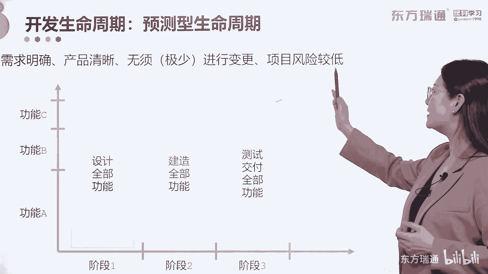
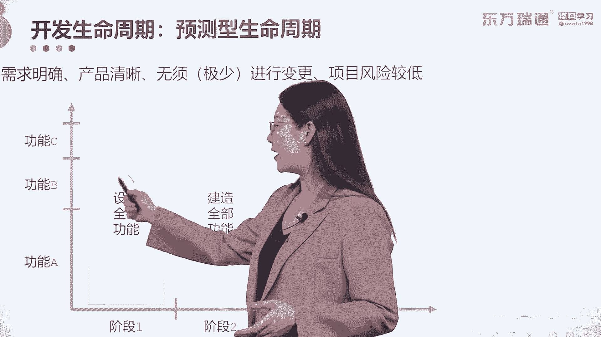
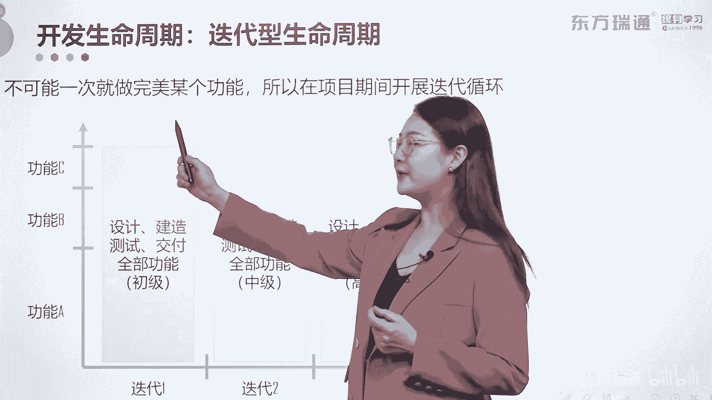
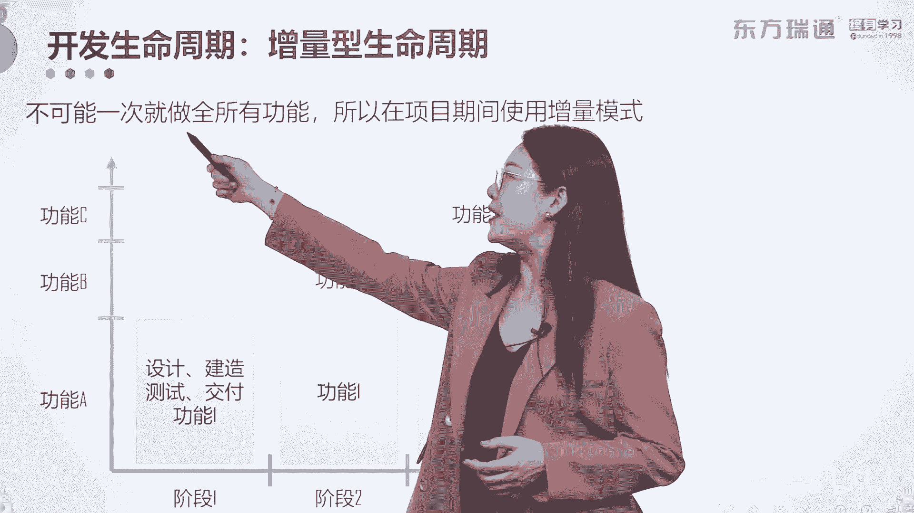
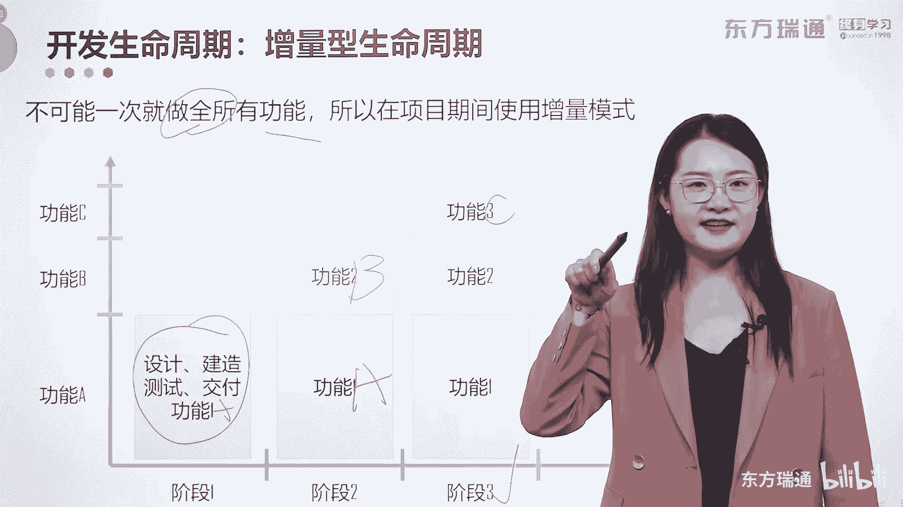
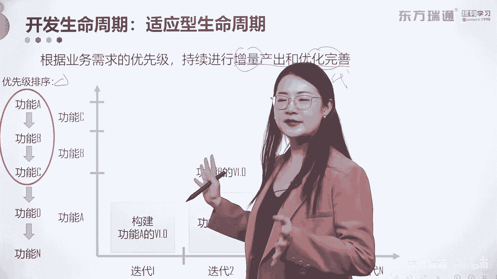
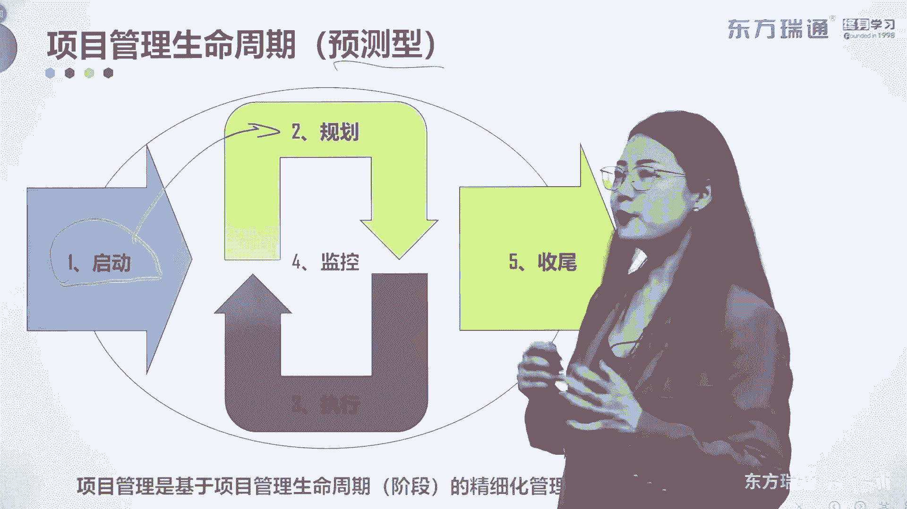
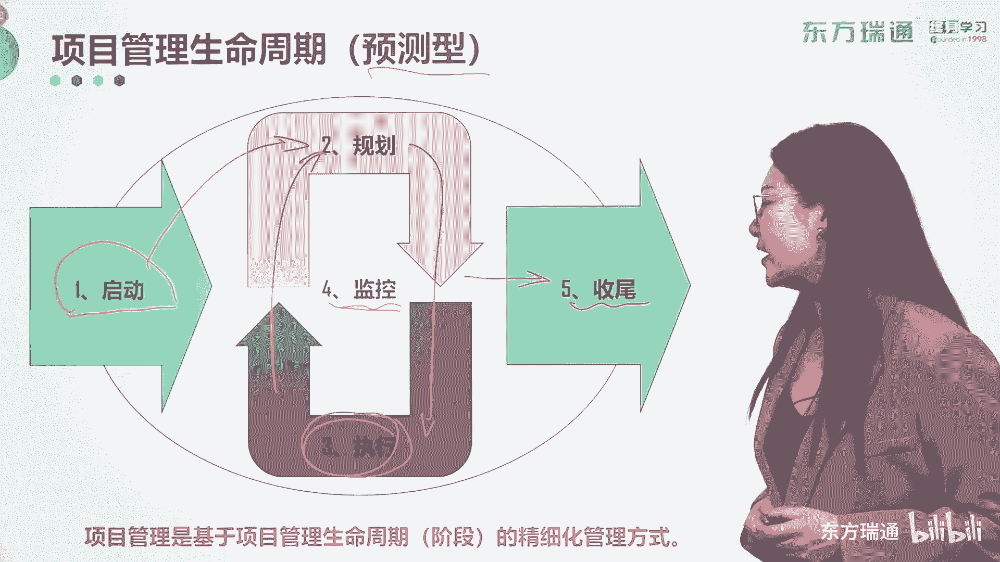

# 少花2000+！PMP项目管理认证全套百集视频课程(更新中) - P10：02项目管理概述-项目管理生命周期 - 东方瑞通 - BV1Bm4y1T76g

在我们做项目的过程中，总有一些阶段和开发有关。

当然开发阶段也是项目所有阶段中，最最关键的阶段之一。

那么如何来完成开发阶段的合理过渡呢，所以我们在这里呢引用了几个开发生命周期。

开发生命周期的学习，也涵盖了刚才讲过的迭代和增量。

我们首先来看关于开发生命周期的。

第一种情况啊，一种周期叫做预测型的生命周期。

和我们刚才项目生命周期中讲的，预测型基本上雷同。

需求明确，产品清晰。

无需或很少进行变更，项目风险比较低。

这样的一种情况下呢，我们使用预测型的生命周期。

是非常有保证做正常交付的，我们通过下面的这张坐标轴。

帮助大家了解一下，预测型的生命周期到底该怎么管啊。

横轴呢是我们做项目的各个阶段，而纵轴代表你的项目需要开发出来的功能好。

如果我们使用的是预测型的生命周期。

我们在项目的第一个阶段，需要完成所有的功能设计工作。

好，完成了之后。

在第二个阶段进行所有设计的落地。

叫做建造全部的功能，到了第三个阶段，我们将建造出来的成果进行测试和交付。

大家发现了吗，每一个阶段完成的都是整体的工作好。

这是预测型的生命周期适合的场景。

那我们来看另外一种情况。

迭代型生命周期，那他到底怎么做呢。

使用迭代型的生命周期，往往呢要认为不可能一次就做完美某个功能。

所以你需要通过一次又一次地不停迭代。

在项目期间开展循环的迭代工作。

好，同样是这样的一个项目。

横轴代表时间啊，纵轴呢要开发出三个功能，如果你用的是迭代型的生命周期。

在迭代一中我们做的是什么呢，做的是全部的设计建造测试交付。

三个功能全部的设计建造测试和交付。

但是如果在这么短的一个迭代中就要完成全部。

那它一定是一个。

唉V1。0吧，第一个版本的情况好。

那接下来进入第二个迭代，将之前做过的所有工作进一步进行升级啊。

再重新的进一次进行设计建造。

测试和交付所有的功能，那么在这里做完了之后呢，就达到了V2。0的状态。

一个终极的版本的科教务成果。

那么在迭代三周呢，同样做重复的工作，只是他最终完成的结果呢。

是最终版本的可交付成果。

所以请大家理解迭代到底怎么做，这就有点像我们女生经常戴的手镯一样啊，手镯手镯的打磨过程，其实就是迭代型的生命周期。

的一种很完美的体现，一开始给你一个手镯的坯子。

非常的粗糙对吧，你通过一次又一次的打磨。

做那些重复性的工作，一直到最后呢，打磨出一个相对来说比较完美的模样好。

这是迭代型生命周期的看法。

那么接下来看第三种，那叫做增量型的生命周期和迭代型不一样。

迭代叫做不能一次就做完美，而增量它的前提是不可能一次就做完全。

所以它需要通过不同的阶段。

依次去迭代新的功能，产生新的增量好三个阶段要完成三个功能。

在第一个阶段中。

我们完成基础功能，也叫功能1A的功能A的设计。

建造测试和交付工作好。

进行到阶段二的时候，在功能A的基础上。

我们迭代功能B的工作，也就是说呢在接到二。

我们完成功能B的设计建造测试和交付好。

到了第三个阶段，我们将功能C所有的建造设计。

建造测试和交互功能完成，一次又一次的在原先的基础上进行累加。

直到最终完成所有要求的功能。

所以这就叫做增量型，增量型，就好比说你在开发歼12飞机对吧。

2019年正式加入空军编制的歼12。

我们自主研发的飞机，那么我们首先要完成的功能是什么。

是要保证这个飞机飞起来，对不对好。

那接下来的阶段中，我们就要在飞起来的基础上再给它叠加隐身呢。

在飞起来和隐身的这个作用下啊，这些功能的实现下。

再去叠加的一些巡航啊等等的功能，所以这就是增量型的生命周期。

我呢喜欢用一种手势来代表。

这个迭代和增量型的生命周期，比如说迭代型的生命周期。

一次不能做完美，不停的去重复做工作，直到他做的完美。

那他做的就是无限的循环和迭代，对不对。

而增量呢它是阶梯式的完成，先完成一个再叠加一个。

再叠加一个啊，这样的概念，记住我的手势迭代增量好。

那下面关于敏捷型的。

也叫适应型的生命周期，我们到底怎么做。

适应型的生命周期，它是要根据业务需求的优先级。

持续地增进行增产产出和优化完善。

它实现的其实就是啊这个。

增量。

迭代的结合啊。

增量和迭代的结合唉。

他到底怎么完成的，他有个前提呀，要把业务需求的优先级排列出来。

所以我们要做这个工作啊，将所有的需求收集到了之后。

将其价值排序从高到低找到，然后呢在有限的资源和这个时间这些约束下。

我们尽可能地去完成那些高层级的需求好。

那假设呢我们排序出来是这个样子啊，一共收集到了N个需求。

那么我们在这里有限的这些条件下，只能完成三个ABC，我们把它排列出来了。

所以ABC我们放在这里，对不对，唉放在这里好。

那么怎么样实现迭代和增量呢，好注意，在第一个迭代中。

我们构建了A功能的第一个版本啊。

在迭代二中呢，我们将A功能的迭代版本进行了不停的优化。

同时我们输出了功能D的第一个版本。

好，再在第三个迭代中，将迭代功能A的这个版本进行再一次的升级。

而功能B也要升级，同时增量出来功能C大家理不理解好。

我们结合刚才的手势讲讲，适应性的生命周期到底是怎么样的，迭代是循环的开展工作，增量是阶梯型的增量，而迭代加增量的适应性呢是不停的优化和增量，所以大家一定要理解我这样的手势啊，理解一下好。

那这就是我给大家讲过的，什么是迭代，什么是增量，什么是二者结合的适应性的生命周期。

还有一种啊是我们未来的考试的一个方向啊。

叫做混合型的生命周期，大部分的工作我们可以结合预测型的方式。

和适应性的开发方法结合起来。

取其优势，取其糟粕来进行统一的管理。

我们看一下这张图。

横轴呢代表需求的变化程度，纵轴代表功能的发布频率啊。

如果说需求变化很低。

发布频率呢一次性发布，那么这样的一些项目。

我们用预测型的生命周期来做，或者说呢这样的一些开发阶段。

我们使用预测型的生命周期去进行开发。

都是可以的，那么再看另外一种极端呢，如果需求的变化程度很高。

还经常性的变更，而且我们需要不停的进行发布。

那么这样的一类项目，我们使用的是与适应型的生命周期，去做这样的一部分开发阶段。

我们使用适应型生命周期的啊，适应型的开发阶段开发。

去完成这个开发生命周期啊，这个比较绕啊。

大家了解一下他们之间的区别就行了，但是实际工作都有这么理想吧。

这样的项目工业时代还有，但是现在的工业4。05。0了。

我们这种纯预测型的项目少之又少，如果遇到了你真的很幸运对吧。

那现在呢纯适应性的也不多。

因为啊关于需求谁都不愿意经常变动。

对不对，我们尽可能的把变动的往小了做啊。

往小了做，而发布频率呢它只是有计划的进行发布的。

所以现在大部分的项目啊，都处于中间的这个连续区。

那这一类的项目呢，我们就采用混合型的生命周期的方式。

进行开发啊，进行开发，它结合了预测和适应的优点。

那么接下来啊关于项目中的阶段和阶段关口，还是有必要给各位朋友呢呈现一下的啊，那什么是阶段，这里字比较小，大家看一下阶段，它是一组人为划分的，具有逻辑关系的项目活动的集合。

通常呢以一个或多个可交付成果的完成为结束，注意划分阶段，也就是项目进行阶段化管理的目的是什么，这句话非常的重要啊，从这儿到这儿啊，分为多个阶段的方式，有助于更好的掌握项目管理，我为什么要这么说。

因为一个项目分为不同的阶段，每个阶段的聚焦点是不一样的对吧，如此分散的聚焦点，你用一个统一的方式去管理他们，非常的困难，容易出错，所以呢分阶段，每个阶段按照不同的目标去进行管理。

比较容易去掌握好管理的方式啊，OK下面每一个阶段或者阶段和阶段之间，我们要设定一个连接的概念，这叫阶段关口，阶段关口可能被称为阶段审查阶段，门关键决策点，阶段入口或者是阶段出口，他的说法很多啊。

他们都叫做项目管口，如果大家呢啊对学习NPDP啊，或者是产品管理的一些其他的课程感兴趣的话，门禁管理其实就是一个针对阶段和阶段关口的，一个最有效的说明啊，门禁管理好，那在阶段关口的时候呢。

会根据比较结果来做出决定，做出什么决定，继续或终止的决定，当阶段输出的这些可交付成果，可以顺利的进入下一个阶段，为下一个阶段所使用的话，那一定是继续的决定对吧，如果可交付成果跟章程跟计划都不够匹配。

无法为下一个阶段提供价值的话，你需要立刻终止啊，这叫做生杀模式对吧，所以阶段关口呢是需要经过阶段评审，开展生杀模式的，除此之外啊，这只是一个简单的啊简单的情况啊，还有其他的结果。

比如说你可能需要等待对吧，甚至是需要退回，也是有可能在阶段关口中输出的结果好，这里呢只做了生杀模式，比较简单粗暴对吧好，那做出这样的决定，以便什么进入下个阶段，或者是整改后进入下个阶段。

或者说做出了决定之后要结束这个项目啊，如果你的项目在一个阶段中就结束，没有经过整体结束的话，我们认为呢不是一个善终的项目，我们需要通过及时的结束来止损对吧好，下面呢还有可能停留在当前的阶段啊，进行整改。

最后有可能重复阶段或者某个要素，这都是通过阶段关口形成的一些最终的结果好，关于阶段跟阶段关口，我们介绍到这里。

关于项目管理，生命周期由五个内容组成。

当然这里呢主要指的是预测型的生命周期，对吧啊，预测性的好。

那这五个过程它不一定是顺序的。

所以它形成了一个这样的图片。

它有了循环的概念在里面啊。

我给大家讲一讲它是如何循环的，首先我们进行项目管理。

预测型项目管理要先开展启动阶段，正式启动一个项目，在启动阶段中，我们要落实项目的目的目标。

成功标准，审批要求，退出标准等等等等一系列高层级的要求跟需求。

那这叫什么，这叫明确目标吧。

OK但有了目标之后，需要进行第二步了。

基于目标来做出完成一个项目的具体计划啊。

这叫做规划，好规划做完了之后。

项目管理的核心思想是按照计划执行项目工作，我们进行了到第三步啊，执行项目工作中去。

但是我们有一个很重要的内容叫做监控，监控是干什么的，是无时无刻的发现问题，发现偏差并且去解决的过程对吧。

那么这些问题的偏差在哪发现呢，大部分是在执行的这个过程中发现的。

发现了有问题，有偏差，O。

然后我们通过监控过程去，解决了这些问题和偏差之后，注意首先第一步呢还是要去修改计划。

因为后期我们所有的执行工作，都是要按照计划进行的，所以解决的问题之后，第一步一定要改计划，大家理解了吗，好那基于这样的一个动作的存在，你会发现规划和执行由于监控，它会变得不停地循环，逐渐的优化。

渐进明细好，那最终通过不停的优化，最终项目输出的可交付成果，通过收尾过程实现交接，并且要进行足够的经验教训总结，OK那这就是整个项目管理预测型的生命周期，你需要经历的五个步骤，它不是顺序的。

它有一定程度上的循环开展工作，最后项目管理呢。

它是基于项目管理，生命周期或阶段的一个精细化的管理方式。

我们未来设计的所有过程。

