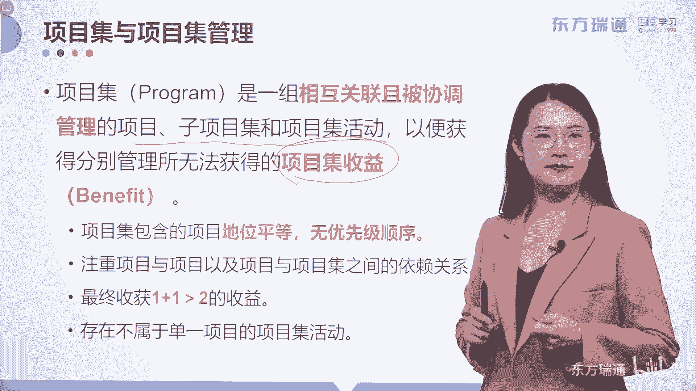
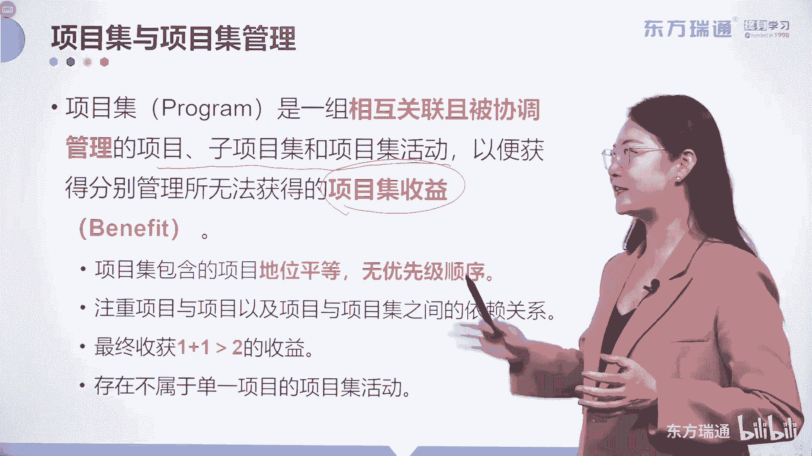

# 少花2000+！PMP项目管理认证全套百集视频课程(更新中) - P11：02项目管理概述-项目集 - 东方瑞通 - BV1Bm4y1T76g

下面我们换一个更高的层次来看一下项目，那就是项目集管理，其实在上一章呢，我们已经简单地介绍了一下项目集。

在这里，关于项目集和项目集管理的一些要求和目标，已经给大家罗列了出来。

那到底什么是项目级呢，项级是一组相互关联且被协调管理的项目子，项目集和项目及活动。

把它们区分开来呢，才能便于获得那些分别管理所无法获得的，那些更多的项目及收益，唉我们要理解这句话，我们强调过项目集啊，它包含了这些项目子，项目集和项目及活动都是相互关联的，有关联性的。

为什么要将他们统筹起来管理呢。

很多现任的项目经理都跨过这样的雷区。

这个雷区叫做你只关注自己眼前和手中的项目，而忽略了耳听六路。

眼观八方的要求，也许你自己的这个项目做的还不错，但是整体的角度看起来呢它是失败的，比如说呢我们有一个项目集啊，叫做植树造林，它下面呢有几个相关联的项目，分别是挖坑填土和栽树好。

那么这三个小型的项目有关联，分别委任了一名项目经理来管理不同的项目，那么如果没有项目集管理的这个统筹，管理的形式出现，会出现什么样的后果呢，也许啊挖得不错，这个项目干好了吧，土也填得不错。

这个项目也完成了，但是树没栽进去，那整体来看。

植树造林的这个项目级是成功的吗，一点价值都没有，对不对，所以说有了项目级这样的一种管理形式啊。

将那些有关联的项目，子项目集呀等等统筹起来进行管理，实现更多的收益，那么在这里面呢有一个内容啊，叫做项目及活动，什么叫做项目及活动，相机活动，它不属于任何单独项目所独有，它会服务于所有有关联的项目。

就好比您在座的各位是吧，来自于各行各业啊，来自于各行各业。

来自于不同的组织，或者是同一组织中的不同部门，但是你们都来听我上课，那么我的这个课程不属于单独的公司所独有。

不属于你们单独的项目所独有，但是我的这个课程内容可以服务所有的单位，这就是项目及活动的概念啊。

我们的培训课就是可以理解成，一个项目级的活动好。

那么我们完成了项目集管理，要实现什么样的目标。

项目集管理它到底有哪些考点会出现在这里，已经都给大家罗列好了，好首先呢项目及包含的项目，要知道他们地位平等，没有任何的优先级顺序，为什么要强调这句话，因为后期呢我们会跟项目组合管理呢，统一起来啊。

去学习好，大家记住就好了啊，那下面注重项目和项目。

以及项目与项目之间的依赖关系。

把他们依赖几关系找到进行优化和统筹管理，才能实现更多的项目及收益，也就是1+1大于二的这么一个效果，所以1+1大于二，是我们项目集管理的核心目标，请大家记住好，那最后存在不属于单一项目的项目及活动。

已经为各位解释过了，这就是项目集管理的一些内容，那么在这里呢，其实项目集管理已经被很多的项目或者组织，应用了起来，比如说这张图，不知道同学们见过没有，这是现在非常流行的啊，叫做地下综合管廊的平面设计图。

地下综合管廊，我们小的时候啊，如果现在有八零后是吧，我相信很多朋友和我们小的时候，都有一样的经历，当我们的一些水管啊，天然气管这些埋在地下的管道出现问题的时候，就会有一大堆的路政人员过来修。

我们叫它拉链工程，有一点问题，把地刨开，造成了很大的很严重的交通拥堵，但是现在这种情况还有吗，没有了，对不对，那如果没有了，你的城市呢，一定采用的是这样的，一个叫地下综合管廊的方式。

去管理了这几个不同的项目，比如说他会把一些电缆蓄水池，天然气管道，通信管道等等放在不同的区域内，然后由一个接口啊，统一呢下到这样的区域内进行综合的管理，它其实实现的就是1+1大于二的收益。

