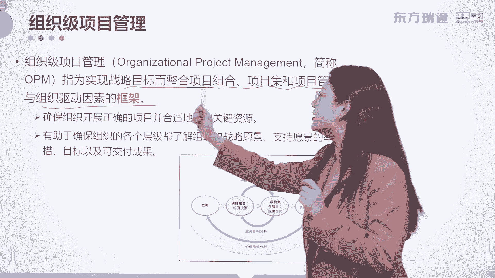
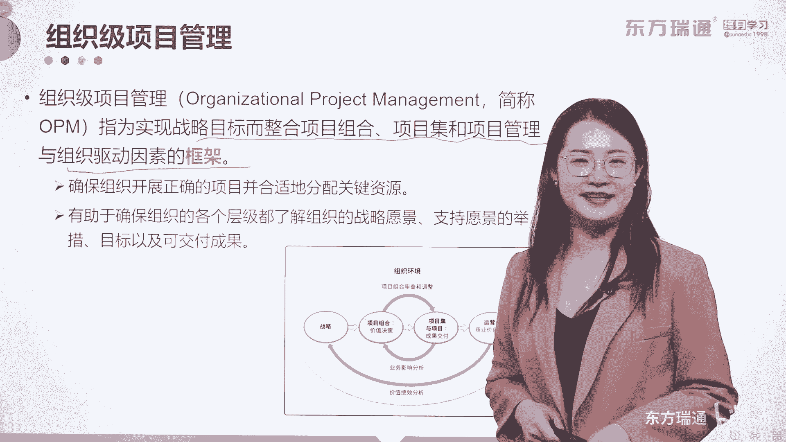

# 少花2000+！PMP项目管理认证全套百集视频课程(更新中) - P17：02项目管理概述-组织级项目管理 - 东方瑞通 - BV1Bm4y1T76g

那下面有一个概念叫做组织级项目管理啊，O p m organization project management，OPM它就更加复杂了啊，OP它是指实现战略目标而整合所有的项目组合，项目集和。

项目管理与组织驱动因素的一个框架啊。

框架往往呢给企业上组织级项目管理的课程。

都是给谁上啊。

给你企业中的高管CXO对吧，CXO还有一些国企单位的一些党组成员。

他们来上这些课。

为什么他们能去学习呢，因为他们对于项目组合，项目集和项目管理，我们要默认为已经具备了足够的能力和经验，他可以接受组织级项目管理的考验啊，那通过开展组织集项目管理，可以确保组织开展的正确的项目。

并且合适的分配关键的资源，可以将刚才我们讲过的组合管理的内容呢，进行更加优化和升级好，还有助于确保组织的各个层级，都可以去了解组织的战略愿景，支持愿景的举措目标以及可交付成果好。

那么组织集的项目管理到底是怎么做的。

在这里呢有这么一张图啊，我们的课本里面也有。

首先呢通过对战略的制定，延伸出了不同的项目组合，我们怎么去理解项目组合啊。

比如说你的公司是多领域经营的，这些经营的领域之间不一定存在相互关系，好比如说恒大，大家知道恒大集团第一个想到的是什么。

他是盖房子的，他是房地产的公司，对不对，但是恒大集团啊，他们首富徐总能当首富，它一定不仅仅是要靠盖房子才能当上的，它还有什么有粮油，有金符，有矿泉水，它还赞助了那些啊。

CBA赞助了广州恒大，对不对，那这些呢关联性强吗。

并不强，但是他们都是为战略服务的，对不对，所以我刚才讲的这一大堆啊。

包括就像恒大集团有那么多的业务业务存在，它们都是项目组合的概念啊，项目组合通过排列价值的优先级产出价值决策，那这些价值决策怎么样。

会影响项目集和项目的落实啊，注意啊，而项目集和项目他们最终交付的可交付成果。

又会反过来影响项目组合中那些内容的排序。

对吧，那些工作的排序。

所以它是一个什么，它是一个循环开展的过程啊，循环开展好，那最终的可交付成果呢。

是交给运营来实现真金白银的收益。

让商业价值真正的去实现好，那这些商业价值通过价值的绩效分析呢。

又可以支持战略的制定和优化，你看这就是整个组织级项目管理的一些流程。

那么所有的内容呢。

