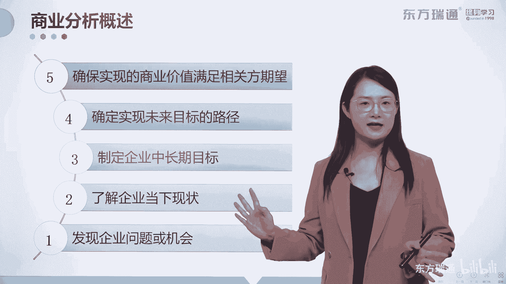
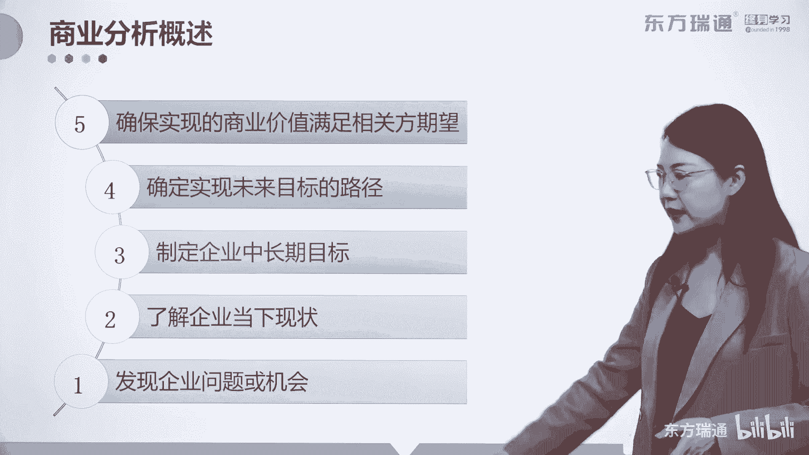

# 少花2000+！PMP项目管理认证全套百集视频课程(更新中) - P20：03商业分析概述-商业分析概述 - 东方瑞通 - BV1Bm4y1T76g

那我们现在真正要进行的是商业分析这份工作，对于这份工作一共有五步需要大家了解。

通过商业分析，首先呢可以帮助企业发现当前的问题和机会。

问题需要解决，机会需要加抓住，不管是解决问题还是抓住机会，怎么样都能够实现组织的驱动，实现组织的业务增长，我们之前讲了这个问题的形式，是不是问题的形式，一个叫恢复原状，一个叫做实现理想。

那你看解决问题是不是恢复原状，实现理想，是不是抓住机会呢，好这是第一种啊，那第二步呢，通过商业分析了解组织当下的现状，了解了当下现状之后，还要判断一下当下现状和能够完成目标，期待的未来现状。

它的差距在哪里，嗯不是简单的了解现在的现状就可以了，对吧好，第三步呢，通过商业分析来制定企业中长期的目标，中长期的目标呢我们可以用两个字来概括，那就叫目的，要实现一个中长期的目标啊，叫目的。

这个中长期的目标呢大概是5年左右，作为一个进行商业分析工作的人，你的目标一定要长远，要比实际执行工作的人至少要多走5年，这就是为什么一个合格的商业分析师啊，这不是商业分析专业人士了。

商业分析师他的收入会特别高的一个原因啊，不是所有人都是具备一个长周期的眼光的，那第四步呢了解了这个目标，确认下来了之后，要形成实现这个未来目标的路径，你要把长远的计划做好，那这个计划就叫做规划，对不对。

长远的计划叫规划，就是为了实现未来目标的一个路径，叫做规划，最后一步是确保实现商业价值，满足相关方的期望，相关方这个概念在整个商业分析的过程中，是贯穿始终的，几乎所有的步骤都和相关方相关。

他们都会产生积极或消极的影响，如何尽可能地避免消极而发挥积极的影响呢，商业分析来帮助你，所以整个项目分商业分析呢。

