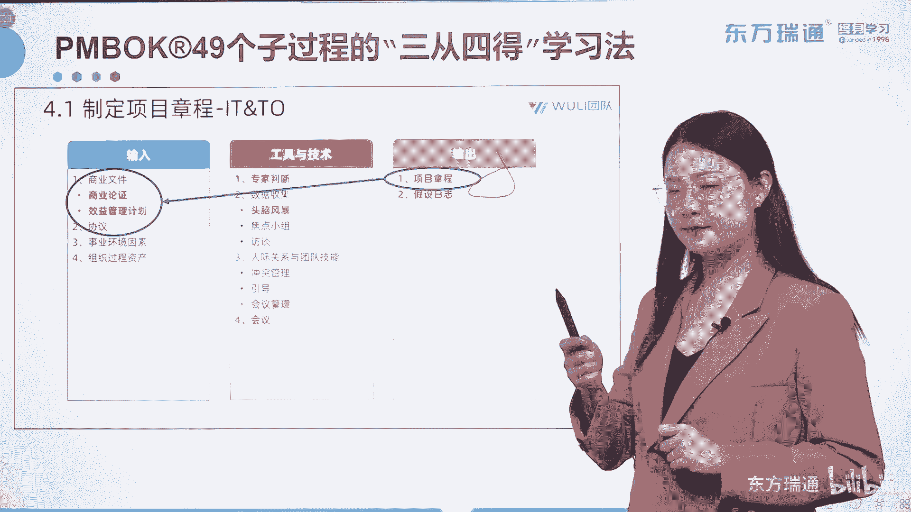
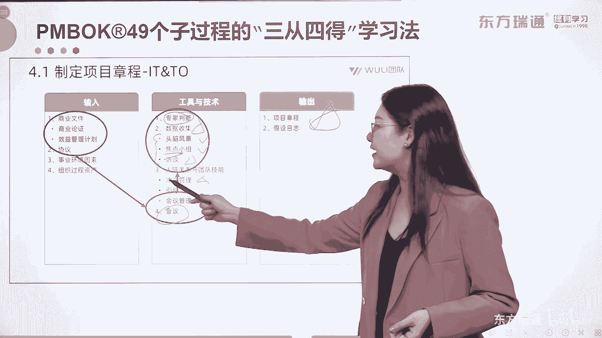

# 少花2000+！PMP项目管理认证全套百集视频课程(更新中) - P2：02项目管理概述-了解ITTO逻辑 - 东方瑞通 - BV1Bm4y1T76g

大家关注到了所有的知识领域，或者说过程组中包含的这些内容加起来啊，一共是49个，我们称之为49个子过程。

也可以理解成作为项目经理，你要有管理49个子过程的本领。

你要明白这49件事该怎么做。

所以是49个呢，就是项目管理中的事儿。

那我们课本中呢，把49个过程，都有一种统一的形式进行了分解，那叫做ITPO啊。

i input输入and te代表工具和技术。

O呢是output，我们叫它输出啊，这个是I，O output，那通过这样的一个逻辑，形成了49个过程的具体的啊写法，但是我们的课程中，将会用三从四德的方式给各位讲一讲。

这49个过程的逻辑。

我给大家举一个例子啊，我们拿4。1制定项目章程为例。

输入工具，技术输出都在这里，那什么叫做三从四德呢，我们先来看看三层有哪三从。

这是4。1的内容。

我们也叫他题目叫做制定项目章程好。

那第一层叫做通过题目找输出。

题目中就有项目章程的制定。

那输出一定会有项目章程，大家理解了吧，这个是最好判断第一层好。

第二从这到从输出找输入。

要找到实现项目章程制定。

需要有哪些文件作为参考呢，那在这里涉及到了商业文件。

包括商业论证和效益管理计划。

下面一层也就是第三层。

叫做从输入判断相应的工具与技术。

我们了解了拥有了这些项目文件之后，我们如何把它进行翻译和整理，形成我们最终要得到的这个输出呢，我们使用的是什么。

唉首先我们要用一群专家来开会。

对不对，很多规划的过程，启动的过程。

甚至是收尾的过程都有这两个工具，一群专家来开会啊，好那专家来开会干什么呢，进行数据收集，在数据收集的过程中，我们可以采用的具体方法。

集思广益，延迟评判的头脑风暴。

可以开头脑风暴会议对吧，也可以实现开焦点小组会议。

找尽可能不跨职能的一部分主题专家。

输出他们独特的创意来解决焦点问题，还有一种你可以用问答的形式呢。

和一些专家进行访谈，来了解他们对于一些内容的想法。

对不对，那访谈还有一些比较关键的一些涉密的情况。

也可以使用这种情况。

这种工具或者说技术来进行好，他们都属于数据收集技术，另外一群专家坐在一起最容易爆发的是什么，我们说有人的地方就有江湖。

有江湖的地方就有输出吧，啊就有冲突吧。

好那既然一群专家有可能会爆发冲突，那么作为项目经理，你必须要具备冲突管理的技能，所以还有呢将所有不统一的意见。

想方设法在不破坏团结的情况下统一下来，那这个技术叫引导，对不对。

最后如何实现一个会议，用正确的方法。

在正确的时间内，通过正确的途径实现一个正确的目的呢，也可以用会议管理的形式。

来加强会议的效率和效果，大家看这三个内容，都与项目经理的软技能有关啊，也叫人际关系与团队技能。

最终实现了一群专家开一个正式的会议，将这份红头文件输出下来，所以这就是我们在后期会给大家讲到的。

三从四德学习法啊。

这里面的三层在学三层的时候，你们会关注到ITTO中有很多红字部分，大家一定要注意，红字就是我们考试的重点，在看书的过程中，你会发现对照着我们的讲义。

看到红字啊，一定要仔细认真的去阅读啊，一定要仔细认真的阅读。

三从我们讲完了，我们再来看看四德啊，四德它是指呢49个子过程中，我们可以将它的输出分为四大类啊，四大类，第一类它输出了相关的项目文件和项目计划，第二类一定会输出可交付成果。

但是请注意这个可交付成果不是一次性输出的，它是通过不同的过程进行变革而输出的，所以我们未来讲的可交付成果呢，一共有四个版本，直到输出最终版本的可交付成果的时候，才能将其进行移交，移交给运营。

或者我们的客户好，这是可交付成果，下面叫做变更请求，什么时候输出变更请求呢，当你发现了问题和偏差，当你发现实际跟计划无法匹配的时候，那这就有问题和变更出现了吧，那当这种情况出现的时候，怎么去解决呢。

第一步就是要提出变更请求啊，大家要理解啊，变更请求经常出现，我们要知道它是干什么用的，最后有相应的组织过程，资产和事业环境因素的更新啊，更新，这里没有显示出来更新好，这就是我们将输出分为了这四种。

具体的类型好，三从四德是我们后期学习的一个主要的方法，我们都会按照这样的一个流程去讲三层。

