# 少花2000+！PMP项目管理认证全套百集视频课程(更新中) - P6：02项目管理概述-什么是项目组合 - 东方瑞通 - BV1Bm4y1T76g

项目集管理我们了解到这，下面我们再上升一个维度，上升到组合管理的概念中去，大家看到了吗，项目组合包含了项目集，各种各样的项目，甚至还包含了运营，他为什么能够把运营也包含进去呢。

那我们不得不去关注一下它的概念和它的目标。

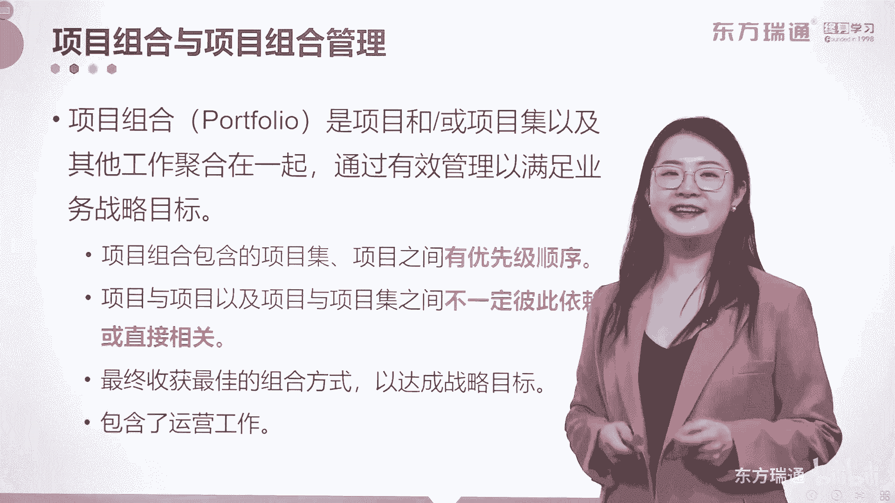

什么叫项目组合，它是项目或项目及以及其他的工作聚合在一起，通过有效的管理来满足战略目标诶。

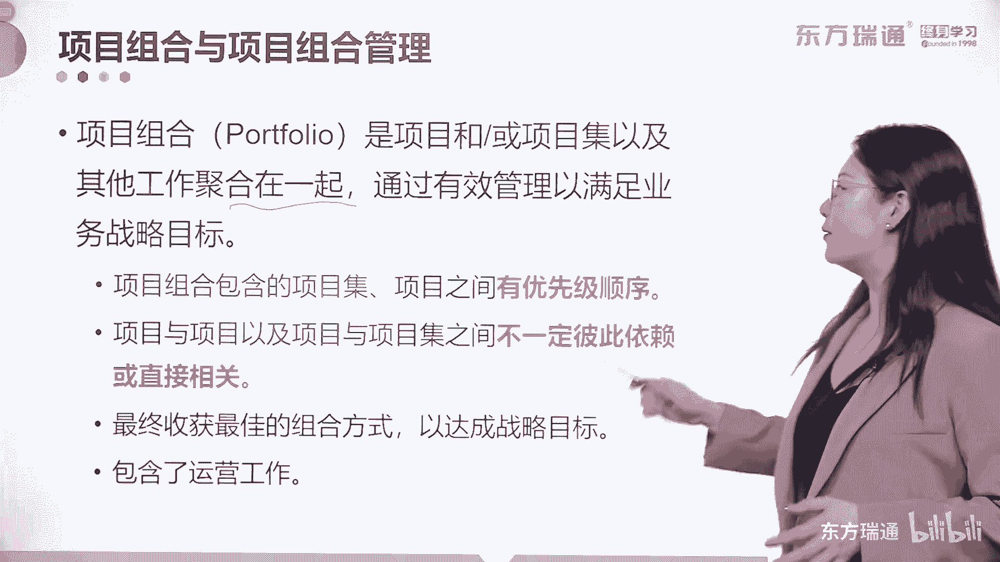

出现了战略目标。

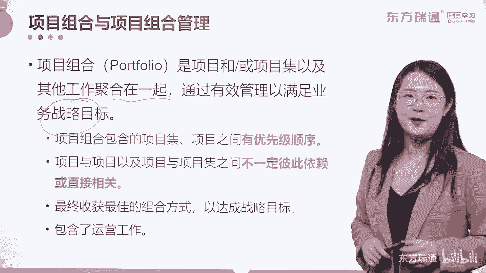

说明项目组合它是一个高层级的管理形式，它对接的是战略。

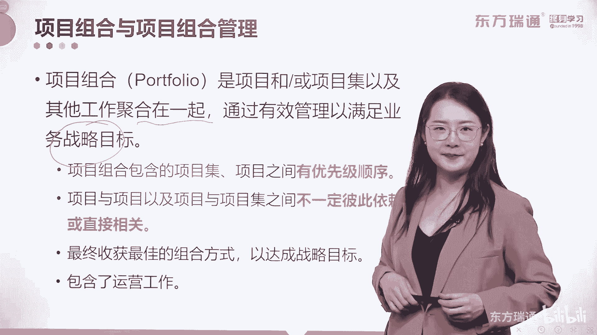

项目组合，包含的项目及项目之间呢有了优先级的顺序。

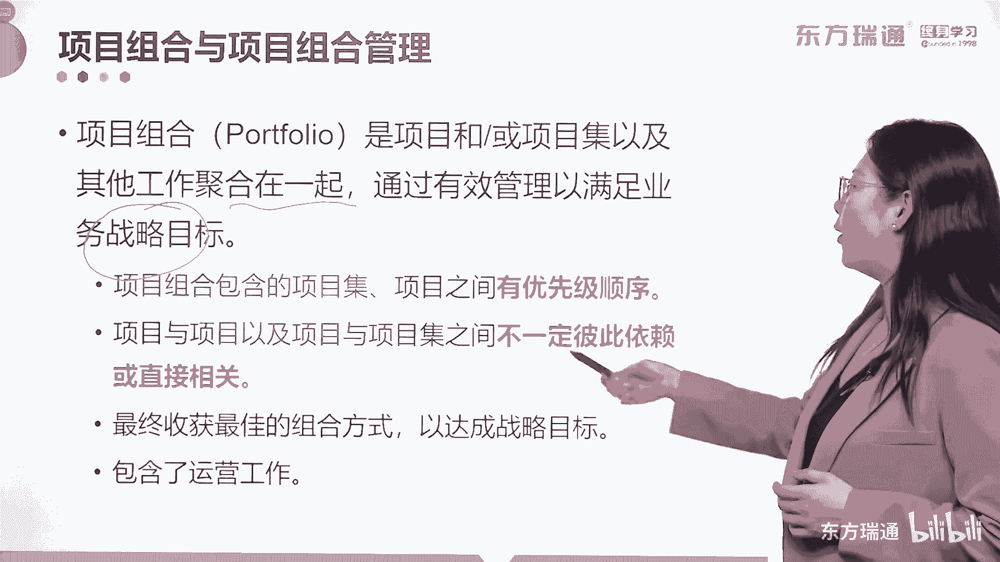

请大家一定要区别开项目组合跟项目集，项目级呢只是项目和项子项目级之间有关联。

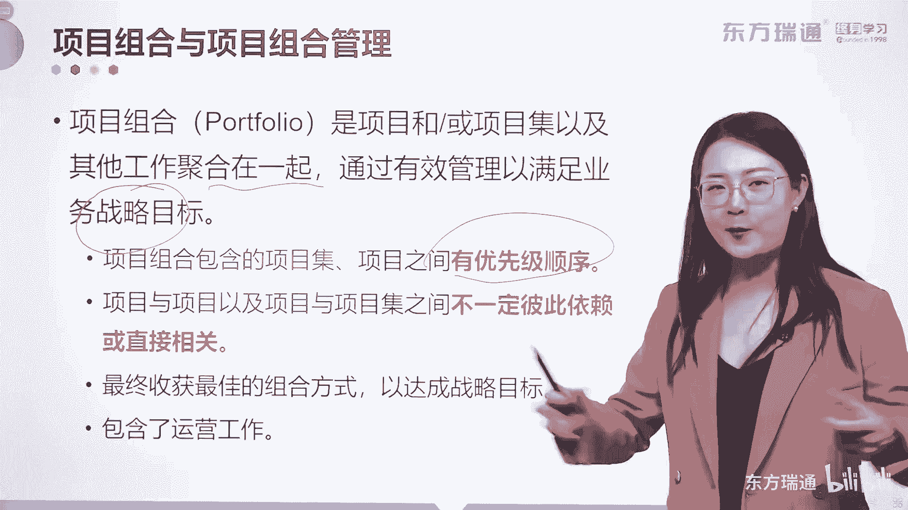

但是没有优先顺序，项目组合是他们之间一定要怎么样排列好。

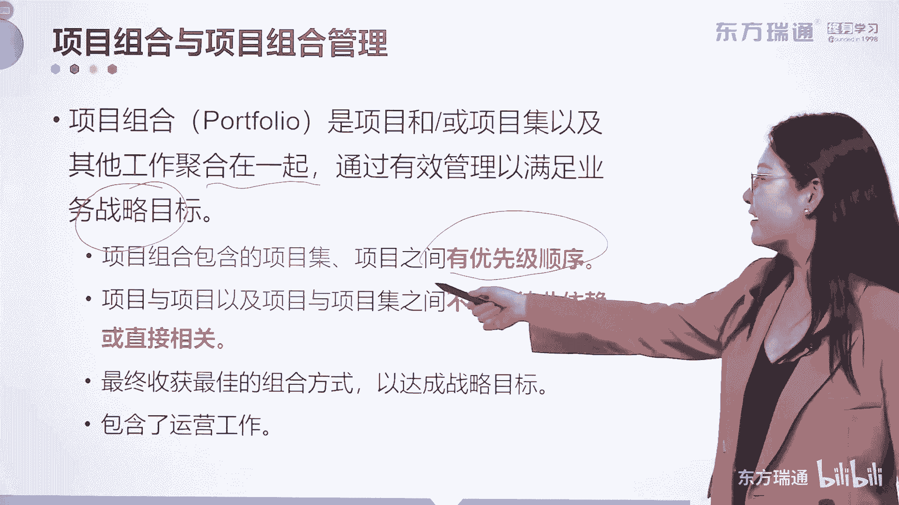

优先级的顺序。

但是不一定彼此相关啊，彼此相关。

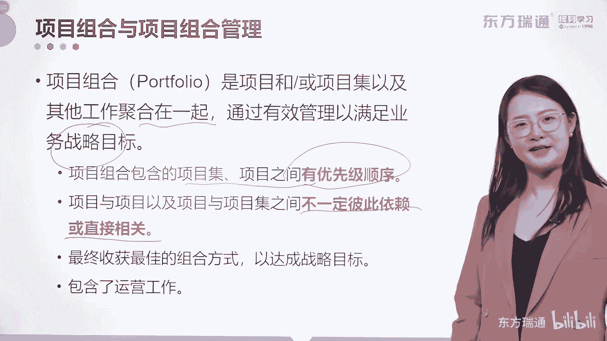

他们正好是反着的，对不对，好最终呢获得最佳的组合方式来达成战略目标。

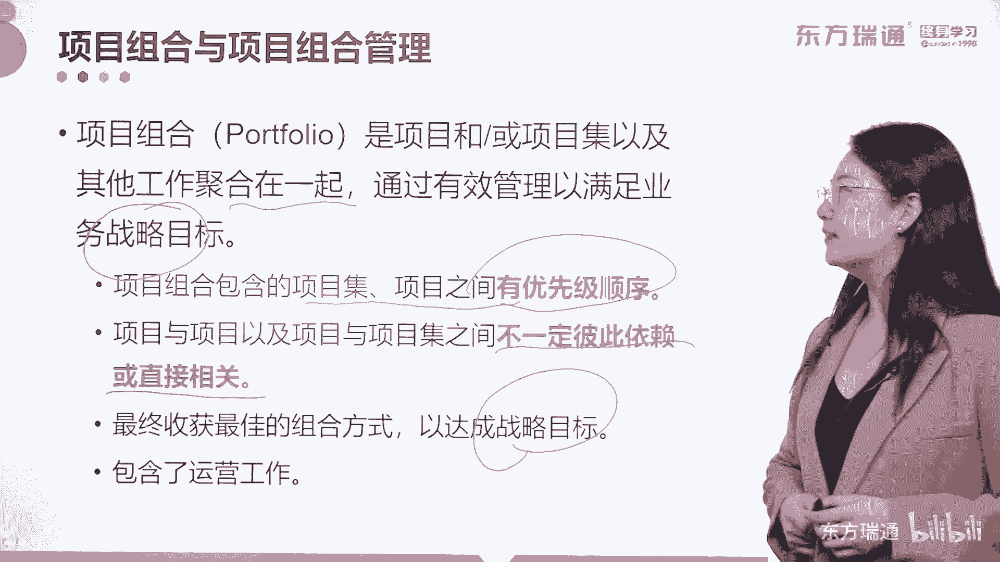

所以我们经常说啊，项目组合管理，它其实就是战略类的管理层级啊，战略类的管理层级，最后它包含了运营的工作。

这里面我要给大家讲讲，为什么在项目组合中要设定优先级的顺序。

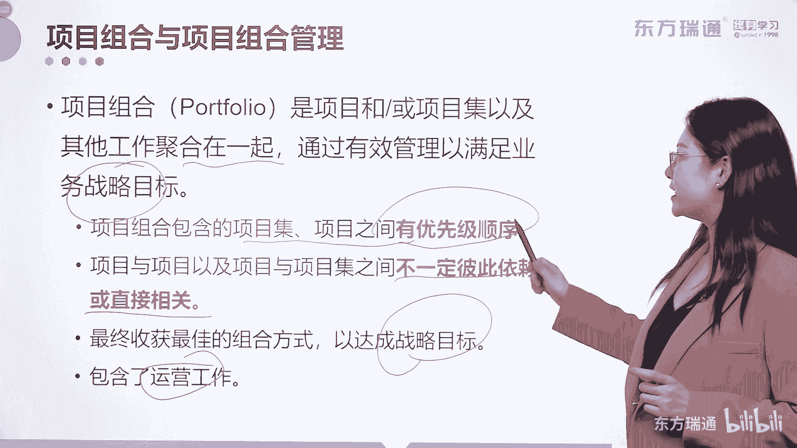

而且为什么要包含了运营的工作，因为我们进行项目组合管理。

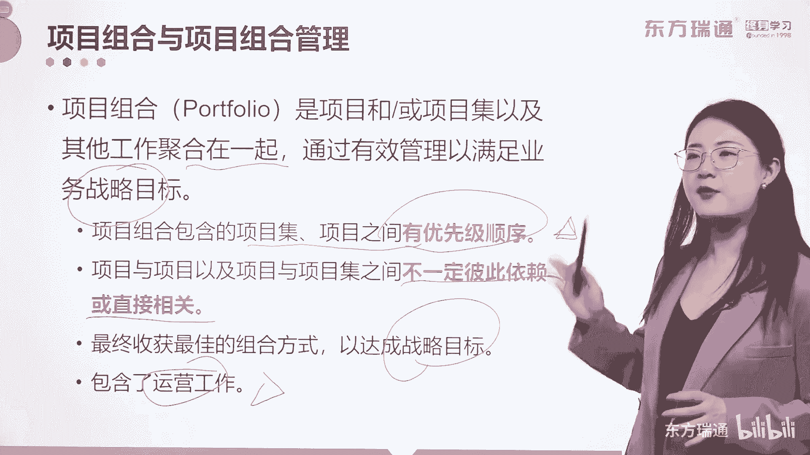

最重要的一个工作是什么，是为它包含的子项目组合。

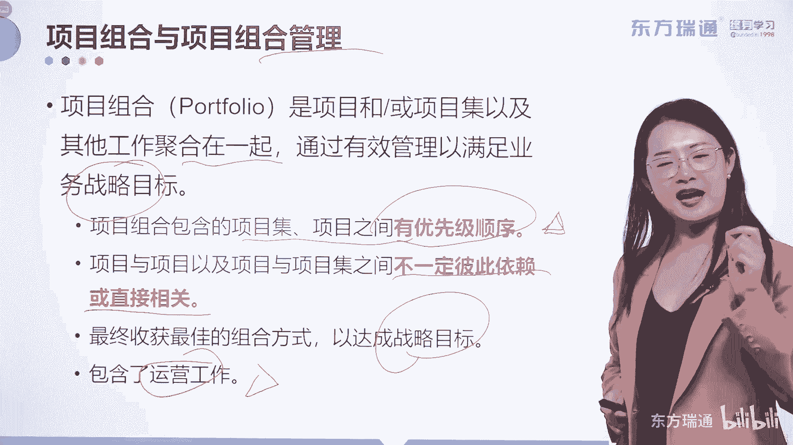

项目集和项目合理的分配资源。

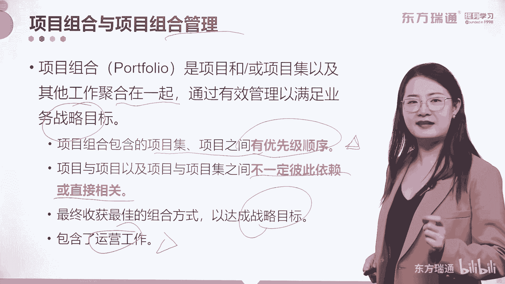

啊分配资源。

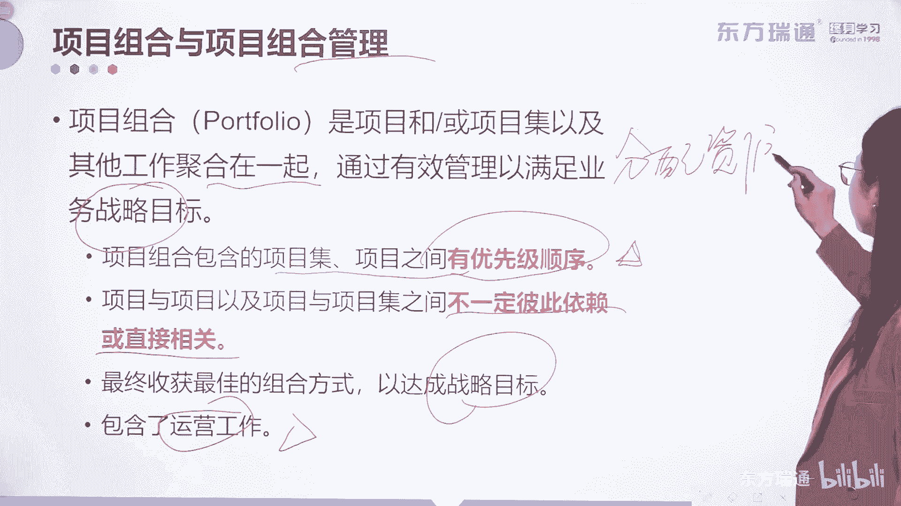

一个组织中资源是有限的，我们需要把钱都要花在那些刀刃上，对不对，那到底如何来判断那些项目，哪些是真正对项目，能对组织能够产生最大价值的呢。

我们就通过组合管理的形式，通过优先级排序的办法把它们罗列出来。

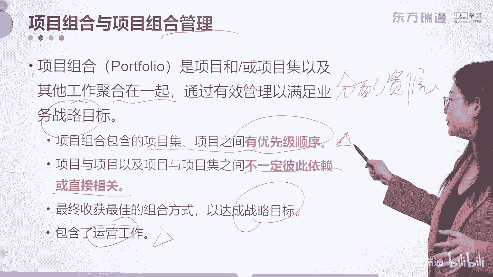

然后合理的匹配资源，那既然是匹配资源。

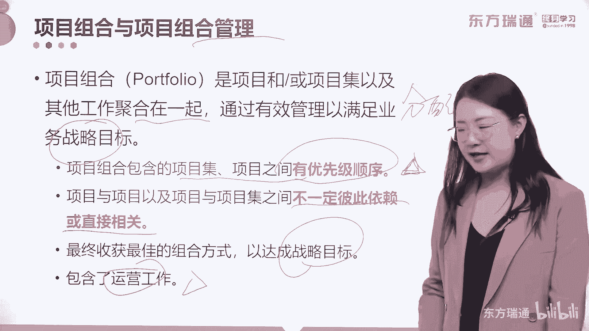

运营工作需不需要资源一样需要，比如说有些公司就是以运营为主的公司啊对吧，以运营为主的公司运营他要占据主要资源，所以我们在进行组合管理的时候，运营工作也要包含进去，大家一定要理解啊。

尤其是这四个字分配资源啊，特别的关键啊，特别的关键好，那关于组合和组合管理呢。

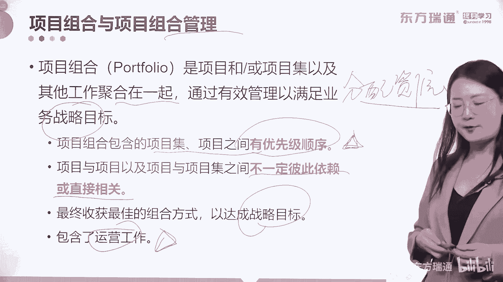

