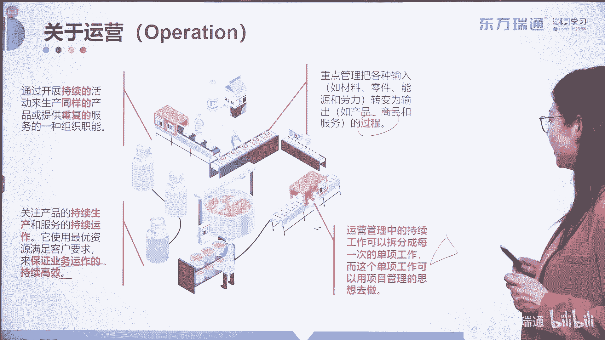

# 少花2000+！PMP项目管理认证全套百集视频课程(更新中) - P7：02项目管理概述-什么是运营 - 东方瑞通 - BV1Bm4y1T76g

那么我们接下来看另外一个概念，运营运营和项目是紧密结合的，同一层级上的工作内容，那么什么是运营呢，跟我们做项目不同。

我们来先看一下运营的定义，运营是通过开展持续的活动来生产同样的产品。

或提供重复的服务的一种组织职能。

唉这里面我们也把红字画出来了，这个项目就完全不同了。

项目是什么，是有始有终的，对不对，而这里呢要求的是持续的。

而项目又是重复的，运营啊。

项目是独特的对吧，而运营呢在这里就变成了重复的，它是完全不同的概念。

运营的重点呢是管理。

把各种输入变为输出的过程。

唉他把目光放在了过程中，而我们做项目是把目光放在结果重来。

一定要用成果导向运营，它关注产品的持续生产和服务的持续运作，他使用最优的资源来满足客户要求。

来保证客户运作的持续高效运营，保证业务运作的持续和高效，说明了它往往是建立在项目交付了之后，利用交付物来产生收益的一部分动作对吧，最后一句话我觉得比较有意思，如果出运营跟项目之间的区别。

那请大家一定要理解这一篇红字运营管理中，他的一些持续的工作，可以拆分成每一次的单项工作。

而这个单项的工作，可以用项目管理的思维去做诶。

怎么样用项目管理的思维，做那些已经被拆分出来的，从运营工作中拆分出来的单一项目了，那我给大家举一个例子啊，举一个例子啊，大家听说过牙膏口径增加一毫米的故事吗，当时美国呀有一个牙膏厂就快倒闭了啊。

就快倒闭了，然后呢，他们的老大就将所有的市场人员着急过来，开了一个会，就说如果谁呢能够提出一些想法和idea，能够拯救我们的工资，拯救我们的产品，让他重新获得市场份额。

那么我一定会奖励他很大金额的这个奖金，那这个时候就有一个市场人员，提出了自己的想法，他跟老大说，我们要不要试试将牙膏的口径提高一毫米呢，唉增大一毫米，大家知道牙膏口径如果增大一毫米。

人们每次挤牙膏的时候怎么样，它就会多挤一点，对不对，那牙膏的很快也就会被消耗光了，提高了这个产品的这个使用率，哎很快通过这样的一个方法就盘活了一个公司，好，那么问题来了。

那在这里面提出了一个新的idea，将牙膏的口径扩张一毫米，那么是不是需要重新的进行设计，模具的制定，生产销售等等等等一系列事情好，那由一个idea引发出来的，后续的一系列的工作。

我们都可以用项目管理的思想做，所以什么是项目管理，项目管理管的是什么，他管的就是那些从0~1的工作，而运营呢它实现的是一到正无穷的任务。

而从一到正无穷的任务中，往往也可以延伸出来一些新的想法，来重新实现0~1，让企业呢持续增值好，那关于运营跟项目它们的区别。

