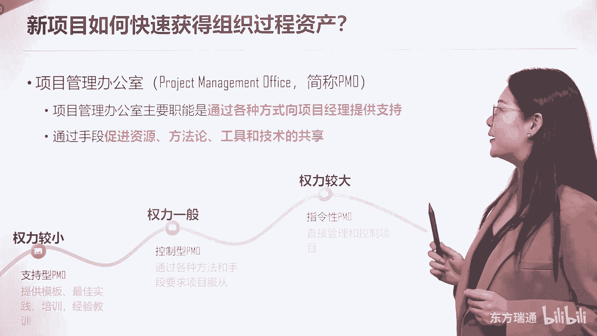
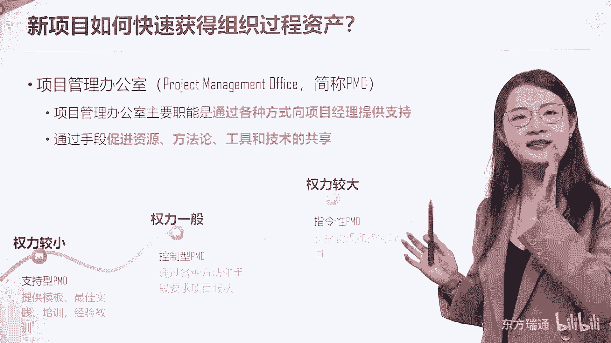
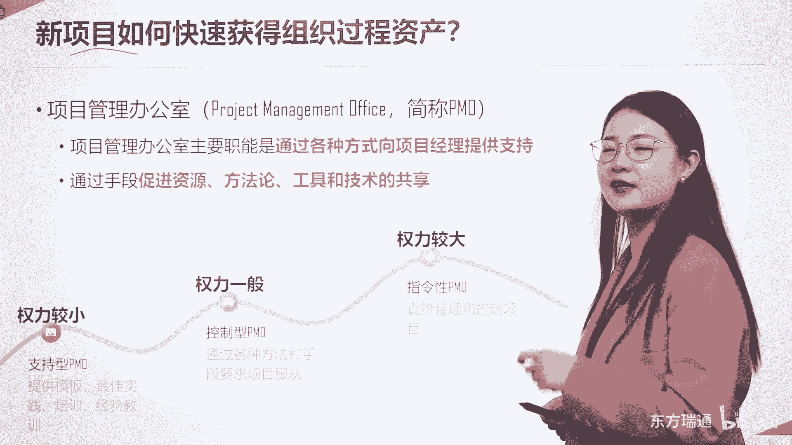
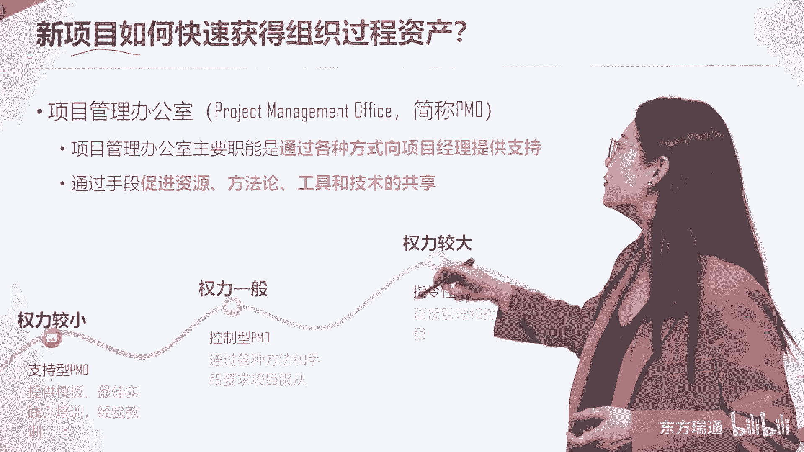
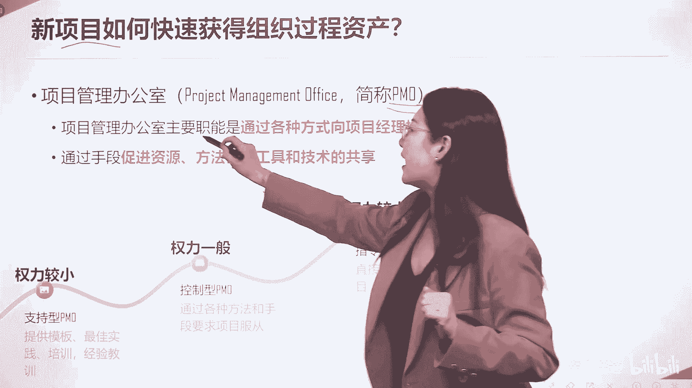
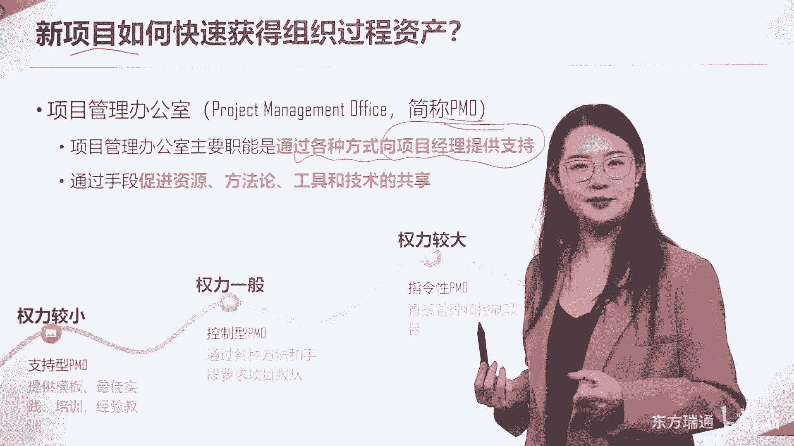
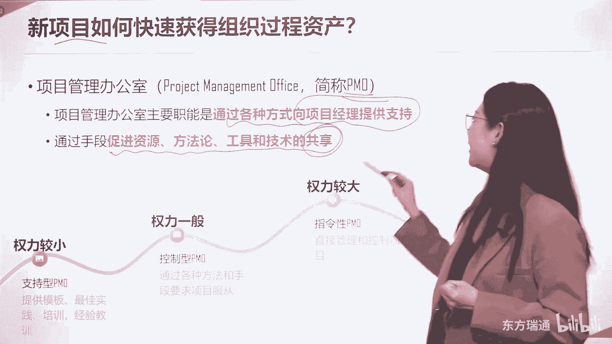
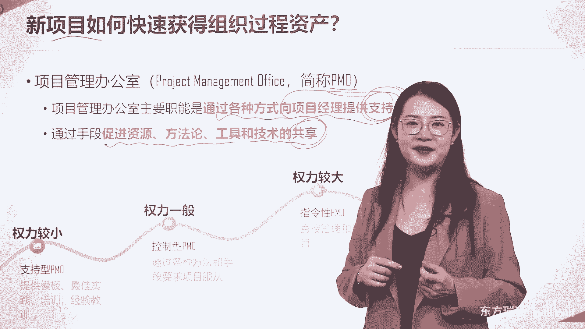
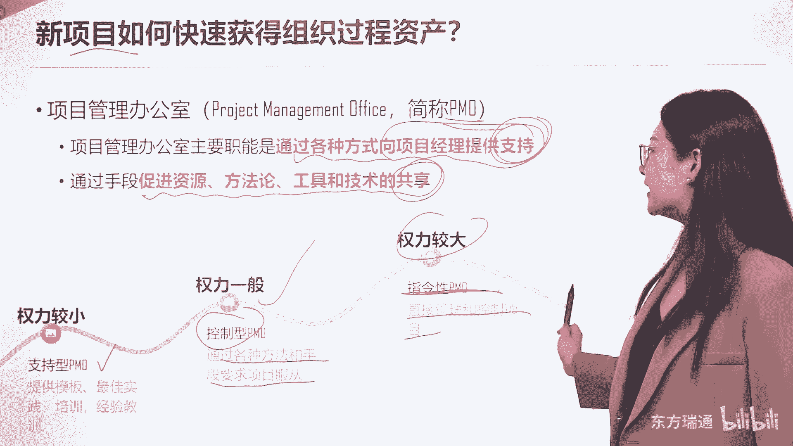

# 少花2000+！PMP项目管理认证全套百集视频课程(更新中) - P9：02项目管理概述-项目管理的核心准则 - 东方瑞通 - BV1Bm4y1T76g

那么这个话题就涉及到PMO了，我们刚才简单提了一嘴，新项目如何快速的去获得组织过程资产呢。

新项目如何快速的获得。

我们曾经出过这样的考题啊。

考的是谁，考的就是这么一个角色，项目管理办公室。

Pmo，项目管理办公室，不要了解它是一个重要的职能部门，他是在项目经理层级职权之上的，一个重要的职能部门，他最重要的工作是通过各种各样的方式。

来向项目经理提供支持，成为项目中的最强辅助。

他通过的手段主要是促进资源方法论。

工具和技术的共享，哎我们把这几个关键字画下来吧。

一个是支持，一个是共享。

而PMO的权利呢，在一个组织中也是有大有小的，如果是权力比较小的PMO，我们叫它支持型的PMO，他会为你的项目去提供模板，最佳实践培训和经验教训，如果是权力中等的PO呢，我们认为叫做控制型的PO啊。

控制型的PO是希望我要领导这个项目，但是有可能你的项目不听我的，不听我的怎么办，我就要想办法用各种各样的方法和手段，让你听我的，这是权力一般的PO的具体做法，而权力较大的管理办公室呢。

我们称之为指令型的PMO啊，所有的项目由他们直接管理，可控制项目经理是无权对他说不的好，这就是不同权利下的项目管理办公室的管法。

大家了解一下好了，那么通过刚才的学习，我相信朋友们已经建立了正确的认知，那么我们建立正确的认知的目的只有一个，就是为了后期实现知行合一，我们做管理的目的要实现知行合一。

那么知行合一它来源于哪儿呢。

来源于良好实践，所以说我们为各位总结出来了。

使用项目管理多数情况下的良好实现。

这就像我们小的时候呢，读书一定要总结一个中心思想一样。

我们将整本PMBO中心思想。

用这么一句话涵盖了出来，项目管理工作有一个理论模式。

这个模式叫做先计划再去做。

在执行的过程中，每时每刻都要对项目的执行情况。

跟原先的计划进行比较。

如果计划和实际发生了偏差。

那么你一定要及时的做出矫正措施，让一切重新符合预期。

现在问题来了，请问大家这个预期到底是目标还是计划呢。

到底是目标还是计划呢。

啊我们可以在这里呢停下来。

去思考一下我的这个问题，我们做的任何计划都是基于目标去做的。

对不对，所以说呢要评判这个预期到底是什么。

那它一定是目标，这里有句话，请大家牢牢记住，我们需要把项目的目标刻在石头上，这个石头是什么，这个石头代表目标不能被轻易的改变，对不对，他一定是一个非常专注的，非常重要的，非常贴合具体的战略要求的。

它不能被改变的，对不对，项目标要被写在章程中，而章程是启动一个项目的红头文件，而计划呢我们刚才讲过，五大过程组中的规划过程，它和执行是不停地通过循环开展进行更新的，所以项目的计划它不是一成不变的。

我们叫它写在沙滩上，经过不停的更新跟渐进明细，它最后呈现出来一个最符合目标的。

