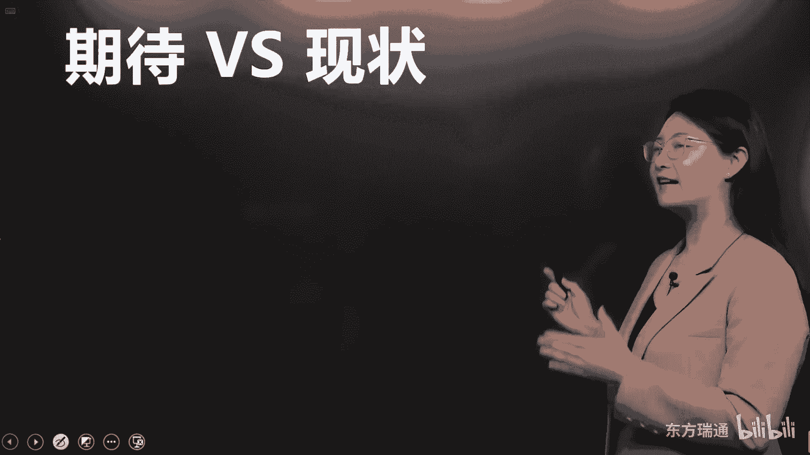
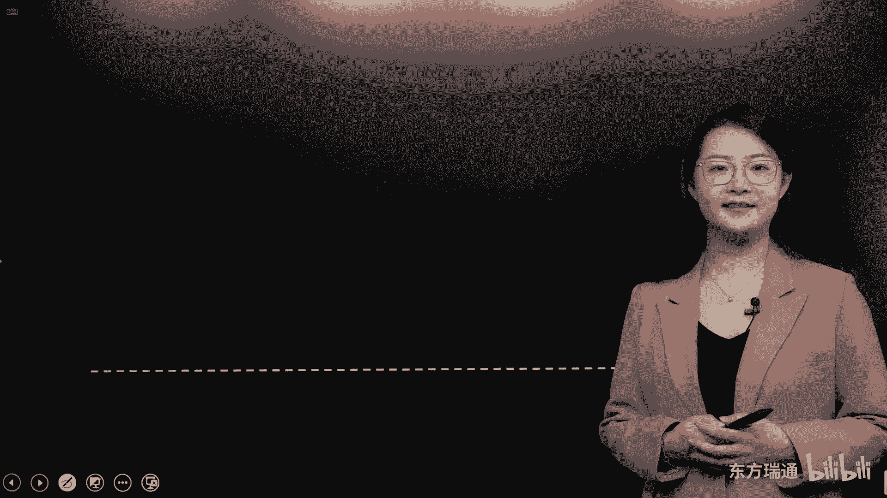

# 少花2000+！PMP项目管理认证全套百集视频课程(更新中) - P1：01认识项目管理 - 东方瑞通 - BV1Bm4y1T76g

朋友们大家好，欢迎来到东方瑞通，进行PMBOK第六版精析课程的学习，我是各位的导师，理由，写在开篇的话，我们这个课程呢已经取得了版权的认证，那希望朋友们在学习的过程中呢，不要对整体的讲义进行传播扩散。

这是我的一个整体的学习经历和取证过程啊，大家了解一下就可以了，那我呢是从事PMP的教学工作，之前啊，一直每一天都在进行项目管理的相关工作，所以呢在整个的过程中，我对于项目管理的一些了解，包括踩过的坑呢。

都会在后期的学习过程中，给各位以段子或者是案例的形式呈现出来，那接下来呢咱们来聊一聊设置本次课程的目标，请同学们呢先问一下自己，我们为什么要来学习PMP，那我相信绝大部分朋友学习PMP，最终的一个目的。

高分通过考试顺利的拿到PMP的证书，对不对，哎，所以我们设计这套课程的核心目的呢，是帮助大家通过考试，在这个过程中，核心教材是骗不可，第六版，如果大家在翻书的过程中发现理解起来有困难，怎么办呢。

在本次的学习中，我们会协助大家搭建项目管理的框架和体系，了解项目管理各个过程之间的关系，好朋友们学习，那除了通过考试以外，还有一个目的叫做实际应用，达到知行合一的效果，所以我们嵌入了很多实战应用的内容。

在教材中，那接下来我们一起关注一下本次学习的内容，我们一共分为了14个板块，这14个板块呢和老版教材有一定的区别，那么我们加入了一些新东西，比如说第三个章节，我们嵌入了PBA的概述类的内容。

那结合新考纲的商业环境进行一个有效的论证，也叫做什么呢，项目的溯源，把需求真正的落实到最终的解决方案中去，同时由于考试中敏捷方法论，敏捷方法的出题比例越来越多，所以呢我们用很大的篇幅和力量。

都放在了第14章啊，敏捷方法的概述，帮助大家在考试PMP的过程中。

也能掌握CP的一些知识点，好其他的内容呢都是我们第六版的项目管理，PMBOK教材中能够涉及到的内容，首先呢我们进行第一个章节的学习，项目管理导入，项目管理导入部分的内容。

主要是带领大家进入项目管理的大门，知道我们学习PMP它的目的，PP带给我们工作中的意义是什么，还有同时会告诉大家一些学习项目管理，行之有效的方法，首先呢PMP我们都知道它是一门管理类的课程。

那么为什么会有管理的存在呢，大家有没有思考过这个问题，如果有些朋友呢，是准备从技术岗实现到管理岗的跨越，如何从非黑即白的技术管理的要求，变成游走于灰色地带的管理过程中，那么你就要了解这个问题。

管理到底为什么存在，管理是为了解决具体项目中的问题的好，那么接下来一个问题到底什么是问题啊，项目管理中会出现什么样的问题，它以什么样的形式存在呢，问题其实要了解期待和现状。

那么期待和现状之间的差距，我们就叫做问题，好问题知道了，它是期待和现状之间的差距，它会与两种情况存在，第一种叫做恢复原状，长这个样子，原有的状态不错，在一个制高点，那由于种种因素的出现。

原有的状态呢下降了，我们的现状其实是落后的，那么这样的一个差距形成的问题，到底应该怎么解决呢，另外一种问题出现的形式叫做追求理想，现状是在一个比较低的层次，那么我们通过学习和不断的改进。

形成一个比较高的理想状态，那么这个差距呢也叫问题，不同问题的形态咱们有不同的解法，先来看第一个如何去解决恢复原状的问题，好首先解决这类问题，要知道造成原有状态下降，它的问题出在哪里，它的原因是什么。

那其中最简单最容易发现的是表面原因，对于表面原因，其实绝大部分朋友可以做到紧急处理，并且处理完全，但是对于表面问题的处处理呢，针对于核心，它只是临时性的解决，它是一个治标的状态，但是我们看病是一个道理。

我们不仅要治标，还要治本啊，资本是为了保证这个问题不再发生，从根源上解决，对症下药，那如何实现它呢，要通过表面原因发现产生问题的根本原因，对于根本原因对症下药，从根本上进行解决，这才是真正恢复原状。

我们需要达到的要求，这才是治本的概念好，那就像我们人会生病，有了病要治病，先从小型的症状出现对吧，我们去吃点药去治标，那么同时呢发现自己核心身体的问题，然后针对这类问题的治本，那最关键的一点是什么。

是我们要保证问题不会再发生，这需要我们付出长期的努力，进行过程改进，过程改进的目的是为了防止问题复发，它是一个增强能力的要求，最终达到雇员的状态，保证问题不再发生，好朋友们，这就是恢复原状。

我们解决问题的思路，那再看第二种情况，如何追求理想，从一个原始比较低迷的状态达到理想的要求，那这个区间的问题如何解呢，就不用刚才的方法了，我们首先要做什么，认清理想，确认我们做事情的目的。

从内心问自己三遍，你到底想要干什么，认清了理想之后，为了实现这样的理想，要按阶段的树立目标，如何树立一个正确的目标呢，需要你具备正确的价值观，同时将理想进行解构，如何解构，遵照smart原则。

这个在后期我们会讲到，有了正确的目标树立，那接下来针对目标制定计划产生行动，这里有一个工具非常的好用啊，未来我们在资源的环节会给大家讲到，RACI矩阵，结合合理的资源来进行计划的制定。

和根据计划的行为发生，最后达到的目的一定是知行合一，来进行过程改进，pd c a循环，那PDCA循环很多朋友一定不陌生是吧，四个单词，Plan do check action。

那达到pd c a循环形成支撑合一的效果，这两类问题的解决思路，我们都可以通过PMP的学习找到解决方式，那么在这里呢给各位分享一句话，来自于伟大的科学家爱因斯坦，他说呀。

你无法在制造问题的同一思维层次上，解决这个问题，问题出现在一个层次，你想要彻底的解决它，你该怎么办呢，唯一的办法叫做生为，那么未来我们学习项目管理的过程，其实对你个人来说就是一个思维上的跨越，完成升维。

好那么项目管理的思想起源于中国，我们为什么这么说，我们自古就有这样的一个词叫做心想事成，逢年过节的时候都会送上这句祝福话，但是成年人都知道，理想往往很丰满，但是现实呢很骨感对吧，有了心想。

他不一定能事成啊，但是我们希望达到这样的状态怎么办呢，我们中间有一片留白，就是给你找到解决方法的，这个留白里面填两个字，谋和动，什么是谋谋定而后动，才能大概率的提升市场的机会啊。

好那么结合项目管理的这些专业的词汇啊，心想呢代表项目启动了，有了一个很好很成熟，经过论证过的想法，那有这个想法，我们要设定做项目的目标，这是启动的过程，有了目标，对目标进行规划，对不对，制定计划。

这是谋的概念，那么接下来根据计划进行有效的执行动，那最终实现可交付成五的交付，那这就叫收尾，是市场能够达到的，这时候问题又来了，不是你做到了心想谋定后动就能达到市场的，在这个过程中。

我们需要不停的去发现，实际跟计划中出现的问题和偏差，那么这类问题跟偏差呢，我们就需要通过监控这个过程去完成，它，发现了问题和偏差之后，通过监控过程，我们在可以提出变更请求也好，使用适应性的解决方案也好。

去真正的把问题解决掉好，那最后大家请关注这几个词，启动规划，执行监控和收尾，这五个词就是项目管理的五大过程组，未来我们会对其进行深入的学习，那结合项目管理的思想，起源于中国，我给各位延伸这样的一个案例。

这个案例呢是中国古代一个非常有名的故事，一举三得，它出自于宋代的一个著名的科学家，沈括写的梦溪笔谈，那具体的这个文言文呢，不给大家念了，他这个故事主要讲的是什么呢，祥符年间，也就是宋真宗年间。

宫中失火了，把宫殿烧成了断壁残垣，那这个时候宋真宗就命令当时的丁晋公，也就是丁谓啊，我们称之为丁经理吧，来主持修复被大火烧毁的这个公式，当时丁经理站在断壁残垣面前一脸懵哈，因为这个时候摆在他面前呢。

有三个非常难以克服的问题，第一个问题，修复工事要烧砖，烧砖的材料呢是土对吧，烧砖需要取土，这是第一个问题，但是那个土怎么办，在远在建筑工地几十里外的地方，第二个问题呢是你进行公式修复。

需要大批的建筑材料，这些材料工地周围也没有，也需要从很远的地方运输过来，第三个问题，即使一切都做到位了，那未来的建筑废料我们该怎么处理呢，总不能堆砌在这个建筑工地周围吧，那面临这三个问题。

丁经理想了个什么办法呢，请大家看第二张图，它集合工人在工地附近挖沟渠，挖沟渠了之后呢，又引入了汴河的河水，让这些沟渠形成了河道，这样的一个想法，他到底是怎么取得了一举三国的效果呢。

首先挖沟渠挖出来的土可以用来烧砖，第一个问题解决了，那大家知道古时候最便捷的运输方式是走水路，对不对，这些沟渠挖好了之后，引入了汴河的河水，通过走水运的方式，将建筑材料从外地运输了过来。

第二个问题解决了，那第三个问题，建筑废料到底该怎么解决啊，公式修复完毕之后把水排掉，那这时候又形成沟壑了，它们将建筑废料填充到这些沟渠中，当然当时呢他们修筑这些工具呢也是有套路的，怎么做呢。

在建筑工地呢用井字形的方式去挖的这个沟渠，填好了之后，就为未来的皇宫周边形成了道路，所以由于这种一举三得的实现，这样的一个工程，原计划15年完成，那么丁经理通过它完整的整合和运筹的思路。

将工期延伸到了啊，压缩到了7年的时间就完工了，当然也为朝廷呢节约了数以万计的银两，他就用了非常典型的项目管理的思路，虽然我们经常说啊，项目管理的思维起源于中国，但是大概率啊。

咱们国人古人只是以典故的形式进行了记录，它并没有形成学科，而项目管理真正的形成一门学科被使用，体现它的优越性是从什么时候开始呢，从战争开始，那么也就是这张片子里给各位显示的，曼哈顿计划。

曼哈顿计划这个项目的背景是在二战期间，美国和德国在竞赛，他们要互相的比较，看谁能先造出原子弹，谁拥有了核武器，谁就有了大概率成功的概率啊，美国在这场无声的没有硝烟的竞赛中，为什么获得了优势呢。

这个项目只用了3年就完成了，项目的可交付成果呢是两枚原子弹，如果熟悉战争历史的朋友肯定知道对吧，一个叫做fat man，一个叫little boy，分别后期呢炸了日本的两个城市。

参与的人数有20多万人啊，赋予的历史意义，大家了解一下，随着发展，那未来美国的北极星计划呀，阿波罗登月计划呀等等，都是逐步地将项目管理的思想和方法进行精进，延伸到了今天的状态。

好那很多朋友对项目管理它的发展路径，还有呢未来学习的地图还是有所疑虑的，那么在这里呢我们给各位做了一个层级图，如果你是一个刚刚准备进入管理工作的小白，那么请你一定要从基层的管理方式学起。

那也就是包含了这三类管理类目，分别是传统的项目管理，也就是我们现在在讲的PMP，还有最新发展起来的项目管理，思维敏捷，项目管理与他平级的，还有运营的管理好，他们是区分开来的。

那项目跟运营它到底是有什么样的关系呢，简单的说来，项目完成的是0~1的跨越，而运营实现的是一到正无穷，我们后期还会给各位做细致的讲解，那么掌握了这两类的基层管理思路之后，应对单一的项目管理呢。

大家的问题啊基本上都是如出一辙的，如果你未来发展还要再进一步精进的话呢，我们就要关注第二个层级了，项目集和项目集管理，什么是项目集，我们说了，针对单一的项目管理，用这两套思路，目前呢是有这两条思路的。

这个工具和技术过程的使用的，什么是项目集，一个公司不可能只有一个项目存在吧，那些有关联的项目我们放在一起，这些项目呢就被称之为项目集，把这些有关联的项目进行统筹管理，实现1+1大于二的收益。

那么就是项目集管理的思路了，对于一个组织来说呢，往往是中级管理者啊，中级的管理者总监这种级别的进行的管理，是将手中握有一大堆的项目对吧，进行综合的管理，实现更多的收益好，但是请大家注意。

项目集管理就不包含运营管理的类目了，如果你的职业发展再往更高一个层次进阶呢，那么就达到了项目组合管理的维度了，大家看这个维度，它包含的内容不仅包含了项目集，单一的项目，还包含了运营工作。

所以项目组合到底是做什么的，我给大家写两个字，简单来讲，项目组合最重要的工作是合理分配资源，这和你公司的战略是有关系的，为什么这么理解，有一些公司的战略呢倾向于运营，那么在分配资源的过程中。

给运营更多更合理的资源对吧，那有一些呢以创新为主的公司，更倾向于项目的开发，那么这些核心的资源呢主要匹配给项目工作，所以组合项目组合做的是什么，一个公司的资源有限啊，将资源进行不同。

项目及项目和运营之间的合理分配啊，达到很合理的资源分配到最合理的项目上，那这类工作呢是项目组合的维度，应该去关注它，你们以为这就够了吗，再往上一个层级啊，是商业分析的角度，什么是商业分析。

对项目的起源进行溯源了解，为什么我们的集团，我们的公司要去开展这一类的项目组合，项目集和单一的项目呢，通过商业分析可以分析出当前我们面临的问题，还有能够抓住的机会，同时分析我们能够掌握的核心能力有哪些。

我们和实现这些交付成果差距又在哪里，最终呢，了解实现商业价值的那些商业目的和商业目标，再根据这些目标实现最终的交付方案，也叫做解决方案，所以商业分析它包含的角度更加广泛。

解决方案里面包含了组合的项目级的，单一项目的，还有运营的方案，进行商业分析的工作的角色叫做商业分析，专业人士，如果他从一个角色过渡成了主观的职业，叫做商业分析师，作为一个合格的商业分析师。

你要和项目的组织者，公司的高层级比肩，甚至要比他们看得更远，了解公司五到10年的发展，你才能做好这份工作，所以一个非常合格的商业分析师，在目前的中国的这个管理体系中呢，是非常缺失的，如果大家有兴趣的。

可以尝试考一下PBA，这样的一个体系，我们给他奠定了一个地基，同时呢盖了个屋顶，地基是什么，你的组织内要有匹配的资源，要具备核心的能力，才能支持每一项项目的发展和教父，同时你要有足够的文化组织。

要有坚定的愿景和战略分析的角度呢，去向下进行对接，你要完成战略的一致性，所以这样的一套层级啊，就是我们今天在多个维度视角下，一个项目和组织层面进行相关联的不同维度，那请各位朋友呢对其进行一个简单的分析。

在后期的课程中，我们可以对他们进行拆解，下面的内容就是很多朋友关注的，老考纲和新考纲，他们之间到底有什么样的关联和差异，那么老考纲呢是2015年出具的考纲，新考纲呢是2019年就出去了。

但是由于疫情的原因呢，咱们中国的考试一直没有启用啊，但是从现在开始，已经针对新考纲进行新的出题模式了，唉我们来对比一下他们，首先呢从考试形式的角度来看，都是纸笔考试，咱们中国大陆地区的考试形式呢。

都是以图答题卡啊为主，试题的语言也没有变，中英文对照，我在这里强调一下，如果在座的各位朋友呢，你的英文水平比较高，那么你在考试的时候比较占优势，但是现在咱们的这个PMP的试卷。

中文的翻译水平已经是越来越好了，所以呢考试的过程中，即使英文不是很好，也不用过分的担心好，那么从考试时长开始已经有了变化了，原本的对老考纲大家比较熟悉的，都知道，从九点钟一直考到下午的一点钟。

历时四个小时，用240分钟，那么新的考纲呢给各位节约了10分钟，230分钟的时间进行考试，但是各位也不用特别担心，因为虽然压缩了10分钟，但是考试的试题总数我们关注一下，从原本的200题哎。

变成了180个题，只是呢这180个题呢没有不记分的题目，它都是相对确定的，有答案的好，那接下来针对本次考试针对的教材，老板考纲，只需要手中拿着一本800多页的PMBOK，第六版的指南就行了。

但是新版对大家有了更高的要求，除了要求大家熟读第六版的pm book意外，还需要大家争取时间呢，将敏捷实战指南也进行一个简单的了解，OK那下面关于考试题型，老板都是单选题，新版有了突破啊。

新版的突破呢它由单选题和多选题来构成，但是大家不用担心的是，多选题，他会告诉你哎本题呢会有几个正确的个数，但是你们不用多想啊，没有ABCD都对的情况，没有这种情况，但是基于多年的教学经验呢。

我认为这不算一个坏事儿，为什么证书我们经常啊做以前单选题的时候，有一个感受，就是呢很容易地排除掉两个选项，剩下两个选项我们很难进行择优录取，但是多选题就帮你屏蔽了这种现象，两个都有道理的时候呢。

可以根据告诉你的这个数去进行，显而易见的回复，好那关于成绩的展现，老考纲我们经常说什么是好成绩，5A就是好成绩，对不对，五大过程组我们都能达到一个优秀的水平，但是现在考试呢。

新考纲是要求大家针对三大领域，这三大领域分别是过程人员和商业环境啊，分别有不同的出题比例，也就是说未来大家收到的成绩单啊，最好的成绩叫3A，PMI呢还是和原来一样啊，从来不会公布你的具体分数。

你的成绩单只会告诉你通过还是没通过，就看你未来收到的邮件呢是congratulations，还是sorry了，好这点还是没有变的，那我们接下来拆解一下，关于成绩的变化，以往老考纲是针对五大过程组。

大家的学习程度的进行打分的，但是现在变成了三大领域过程，人员和商业环境，它的比例过程，主要针对的是我们第六版教程中的，49个过程，你的熟悉程度，那么人员考核的是什么，作为一个项目经理，项目中的核心角色。

你需要具备什么样的素质，你懂不懂得去激励你的团队，懂不懂得去提高团队的绩效啊，懂不懂得去处理冲突，合理的沟通等等内容，它更加倾向于作为项目经理软技能，你该怎么样去应用，最后呢有8%的题目来自于。

对于商业环境的分析，这也是为什么我们给大家加入了，PBA的一些内容，对商业环境进行一个最最基础的了解啊，争取了将近80%的题目呢拿到手，好第三个针对考纲的变化，我们对比了一下老考纲跟新考纲。

老考纲呢以预测型的方法，也是我们常说的PMP型的管理方法为主啊，出题比例占到了90%，那敏捷的这种新兴方法呢只是占10%，但是我们现在到了新考纲，大家看对半分了，传统的方式呢只占50%的出题比例。

而敏捷加混合型的方法，要懂得如何使用适应性的方法去完成那些变更，经常出现应对模糊性的项目背景，那么来出题呢，它也占了50%的出题比例，这是为什么给大家延伸，第14章，我们嵌入了很多的内容。

那希望大家学习的过程中呢，一定要把握传统跟敏捷，还有混合它们之间的差异所在，好关于考试第四点跟教材之间的关联程度，老板的关联程度呢，也就是说80%的题目，你可以从教材中找到相应的答案。

不同的地方是需要大家基于经验，基于对价值观，基于对职业道德的考量去做出正确评判的，不同之处呢只占20%，但是新版的考纲对大家的要求是不是更高了，相同之处呢有调整，下降了10%。

而不同之处达到了30%的要求，那就要求大家在学习知识性内容的过程中，还要找到感觉，怎么样，以美国人的项目管理思路去正确地处理项目好，这是关于考试，第五点，PMI的出题类型有这么几种，第一种类型情景题。

我们把它标红了，证明了情景题是考试出题的主要题型吧，情景题呢主要出于关于项目经理如何去处理，问题和偏差这些角度，那么问题跟偏差主要出现在哪呢，执行过程组唉，真正开始开展项目工作的过程。

还有发现问题和解决问题的过程，这个监控怎么去找到相应的方案呢，我们有哪些方式可以帮我们做出正确的选择呢，请大家关注一下括号里的内容，第一个是否积极主动地去处理这些问题。

第二个是否使用了正确的问题解决方式，或者说你是否有一种方式真正的能够解决问题，也许ABCD4个答案都是正确的，那你这个时候呢就要去评判问题导向，哪个最能解决问题，我们选择哪个答案，择优录取的概念。

第三个关于项目经理呢，你处理任何问题和偏差的时候，要遵照什么职业道德，我们用四个字来表示，分别是责尊工程，它代表责任，尊重公平和城市，第二类题目是步骤题，在我们看书和授课的过程中。

有四大过程我会着重的强调，那分别呢是变更管理流程问题，解决流程，项目收尾步骤，还有风险监督的流程，我再一次强调，当我们学到这四大流程的时候，请同学们格外注意，要尽可能的将这些流程背过吸收消化掉。

针对步骤题，我们只需要做到强化流程，做到绝不跳步即可，告诉大家一个出题的小tips啊，这类步骤题大概会出30~40分的题目，在考试中你说他重不重要，非常的关键啊，非常关键好下一类题呢是ITTT。

其实现在的考试跟以往不一样啊，我参加考试的时候呢是第五版教材刚出的时候，那个时候对ITT的背诵要求是很严的，是很严格的，但是现在主要的出题类型是情景类的题，ITT代理的题呢有，但是不会特别多。

所以呢我不会建议大家用大部分的时间去背诵，那些输入输出工具技术，那么只需要在上课的过程中，将一些突出的重点，那些红字的部分呢，它处于什么样的过程里面，它在这个过程中能够起到什么样的作用。

进行一个简单的理解和记忆就可以了，如果题目中出现考TT的题，我们可以使用什么方法呢，关键词定位法哎，当题目中出现利用什么什么，但利用的一定是工具技术，对不对，包含什么什么输入输出，需要什么。

需要的是什么工具技术，或者是输入参考的一定是输入而查看的呢，大概率考输入的，而得到是针对输出来进行的，哎这是IPTT好，还有三类，我们先来看第一种啊，计算题，计算题对中国学生来说，我们是必须要拿分的。

因为我们就是做着数学题长大的，对不对，美国人初学书出的数学题，我们能服吗，服不了，那怎么去做对这些计算题，只需要大家定位好公式，把公式给我记得滚瓜烂熟，同时在做题的过程中保持清醒。

该记忆的参数你要把它记住，尤其是我们后期学到正直的时候呢，对参数还要进行寻找和计算，对于计算题，各位朋友不用特别的关心担心，为什么呢，非常的简单，我们经常有一个说法，你上过小学四年级的。

都能做对PMP给大家出的计算题，当然在考试的过程中呢，唉机构会给大家啊，这个监考机构会给大家发计算器，但是这个计算器的功能非常有限啊，加减乘除，为什么计算简单，不会让你做任何开根解密的题啊。

所以说计算机的，对于我们中国的大陆地区的考生来说，基本上可以不用啊，能够达到一个口算的程度好，下面一类叫超纲题，历年考试超纲题一定会有两到三个，什么是超纲题，你压根连读都读不明白了，遇到这样的题。

我们要做到绝不浪费时间，赶紧蒙一个诉过，如果你觉得呢自己的做题速度有保证，那么请你在草稿纸上，将超纲题的题号进行一个记录，那么回头我们如果还有时间，再回头去深究这些超纲题，因为你读不懂的情况下。

绝大多数考生都读不懂，这是超纲题，关于其他细节类的题目，我们只需要做到迅速找重点，这些重点呢以pm不可为基准，是可以增加答题正确率的，最后给大家做了一个总结，如何把这些题目都做好呢，第一点做到思想正确。

第二点，流程记忆是深刻的，第三点，在不同的过程中，要使用正确的工具和方法，那下面呢给各位朋友简单介绍一下，我们通过考试必须要具备的条件，那第一点是大家都要做到的，你们不要觉得PMP考试非常的简单。

只要你不学，考试是一定过不去的，所以说呢请大家正视这份考试啊，不要觉得它是非常简单的，第二个，在考试之前，我们至少要完成三遍以上的pm，不可与课本的阅读，三遍以上的PBOOK的课本阅读其实是有方法的。

你们不要看手中的这本教材呀，有800多页这么厚，对不对，那它其实呢是分为了三个部分，我们知道项目管理呢是讲49个过程，49件事要去做，那么这三个部分，第一部分呢是按照十大知识领域去排列了，这49个过程。

将它们分别关注的方向去进行分类的，那第二个部分呢是按照五大过程组的角度去，重新给大家解读了这49个过程，它的核心内容跟第一部分是一模一样的，第三个部分是术语表，对术语表的要求呢。

我们只需要在考试的前一周，对照中英文好好的磨合一下就可以了，所以我们未来在看书的过程中，我的建议是只看第一部分就够了，三遍PBOOK除了只看第一部分的三遍以外，怎么读，第一遍叫做通读。

你看的过程中一定会有问题，一定会有自己读不懂的地方，这个时候我们需要在正式课程开始之前呢，做到位，就是大家在听我的这个讲解的之前，要完成第一遍的预习工作，那第二遍什么时候读呢，在听完课后做复盘的时候。

针对自己之前没有搞懂的问题去进行一个复习，这叫查漏补缺吧，第三遍，第三遍课本的阅读要在考试的前两周完成，当然考试的这个呃，前两周到考试这个期间我们干什么呀，使劲刷题，是不是使劲刷题，那么在刷题的时候。

周期的前两周呢，一定要完成第三遍课本的阅读好，这就是阅读方法，当然了，三遍课本的阅读呢，只是我对大家提出的最低要求，我相信各位朋友在阅读课本的过程中，每读一遍会有一遍的收获。

那接下来要求大家能够做到600个以上，高质量的练习题，这里呢特别强调高质量，我非常非常不建议大家从网上自己去搜索，和瞎找那些题目去做，因为网上没有人对于习题的质量给你们把关，尤其是那些免费的题目。

可能10年前的陈年陈年老题也在这些题目中，你做它没有任何的意义，因为根本就不考，对不对，不要浪费这个时间，所以呢请大家以机构给你们发放的题目为主，好，第四点，要求各位朋友至少完成150个小时的学习。

投入时间，那么请朋友们从今天算起到考试的整个周期，你还有多长时间可以进行学习，那么用150个小时除以你的学习周期，看看每天你需要投入多少的学习时间呢，最后也是最关键的一点。

在考试中我们需要掌握一些特殊的理念，那这些理念至少呀要用在学习做题和考试中，我给大家举几个例子吧，第一个理念叫做流程优先做流程题，我们必须要将课本中出现的这四大流程，做到滚瓜烂熟的地步。

比如说第一个过程变更管理的流程，它有四大步骤，每一个步骤中都有需要我们去关注的内容，第二个过程呢收尾流程，收尾流程有八个步骤，是我们给大家总结的，第三个过程是问题解决到结构性方法，七个步骤。

第四个过程呢是风险监督的流程，风险监督流程分为两部分，一个风险没有发生，我们如何进行监督，第二部分呢是风险发生了，我们有一个横向的方式进行监督，这个在后期呢我们都会作为重点给各位讲解，项目管理。

我们要做到流程优先，主要是践行了一个思想，那就是流程好了，结果就不会特别差，还有一类特殊的理念呢，我们要掌握一个做题的概念，叫做相对正确，也许屏幕中的你有很多朋友是理工，称理工科毕业的，对不对。

理工科毕业的朋友呢都有一个核心的特点，我们的世界啊，我也是理工科，我们的世界是非黑即白的，所以我们从技术岗完成对管理岗的跨越的时候，一定要进行一个相对正确的接受，也就是说。

如何从理想的黑白跨越到游走灰色地带，所以理想是黑白的，就像我们编程一样，设定一个program对吧，一个点击就按照我们设定的路径去发展，一切都是最好的安排，只等你一个选择呀，但是管理是要求游走灰色地带。

是现实的，很多路径都可以达到目标，那要求我们呢通过经验，通过方式，通过正确的思维，选择一条相对最好的路走下去，那么我们所有人都是在中国的应试教育下，成长起来的，美国的PMP考试。

跟中国的应试教育有很大的不同，大家都知道咱们在中国参加完考试会之后呢，给你们公布标准答案，由你呢去进行一个估分，对不对，但是p mp不会给你答案，他只会告诉你，有没有达到他要求的这个高度而已。

所以说要求大家掌握相对正确的概念，在做题的过程中，也许四个答案都对，我们怎么样择优录取啊，也许四个答案都错，那我们怎么样矮子里面拔将军，找到一个不是错的，最离谱的答案作为正确的选项呢。

所以这对我们的要求是挺高的，好，那最后呢，我们给各位总结了一些需要大家改变的理念，第一条理念要以PMI的理念优先，那这个理念来自于哪里，考试虽然问的是项目经理应该怎么做，但是实际上它的核心含义是。

基于PMI的项目管理体系，我们手中的这个课本，你到底学到了什么，基于这个课本，项目经理应该怎么做，所以我们的核心还是在手中的课本里面，在这个过程中，你的工作经验在考试中并不可靠。

第二个需要改变的理念呢叫做圣人法则，我们刚才说了，项目经理要遵守的职业道德四个词，责任，尊重公平跟诚实，数据不好听的，咱们中国的很多项目管理人呢，还是处于在人情的社会里面，对不对。

那么我们在考试的过程中呢，就要把这个所谓的人情社会放在一边，是怎么放呢，在考试中不讲人情世故，不走歪门邪道，没有任何的旁敲侧击，也没有under the table的所有的动作存在。

拒绝一切不符合职业道德的做法，这才是圣人原则，并且并且你不仅仅要默认自己是圣人，还要默认跟项目有关的，比如说发起人PMO项目及经理，或者是跟我们对接的乙方服务商等等，他们都是圣人啊，默认啊默认的情况好。

第三种改变理念呢叫做流程为先，为什么要求大家一定要记住，那四大流程呢，流程优于结果，践行的就是流程好了，结果就不会特别差的思想，最后一个是刚才给各位讲过的，一定要正视相对正确的概念。

在管理中没有绝对的对与错，只有更合适的方法，更合适的方法，关于导入部分呢，我们就讲到这里，最后送给大家几句话，我们现在都是小白的层次，我们要学会归零的精神，认为自己是站在管理的三脚下的，在管理的山脚下。

我们只是知道管理，但是很难去触碰它，我希望未来通过学习，朋友们可以逐渐的爬到管理的山顶之上，因为你在山顶上向下俯瞰山水，云天都是客观规律的显现，任你风云变幻，我自巍然不动，山脚人太多。

