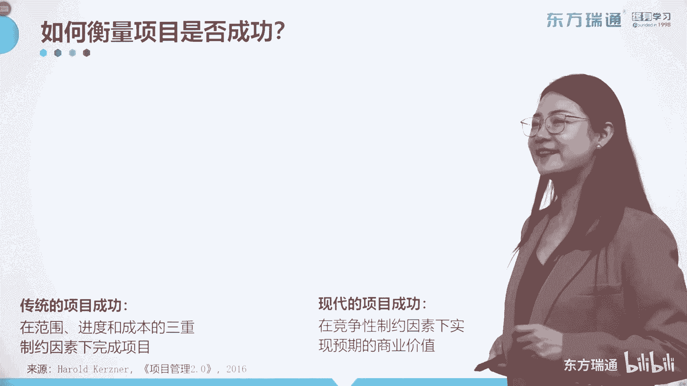
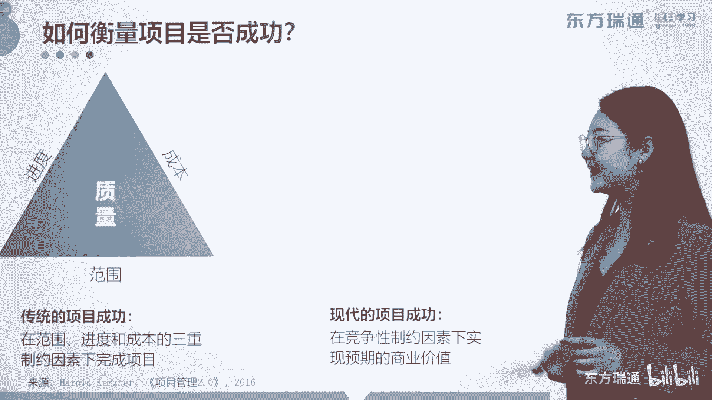
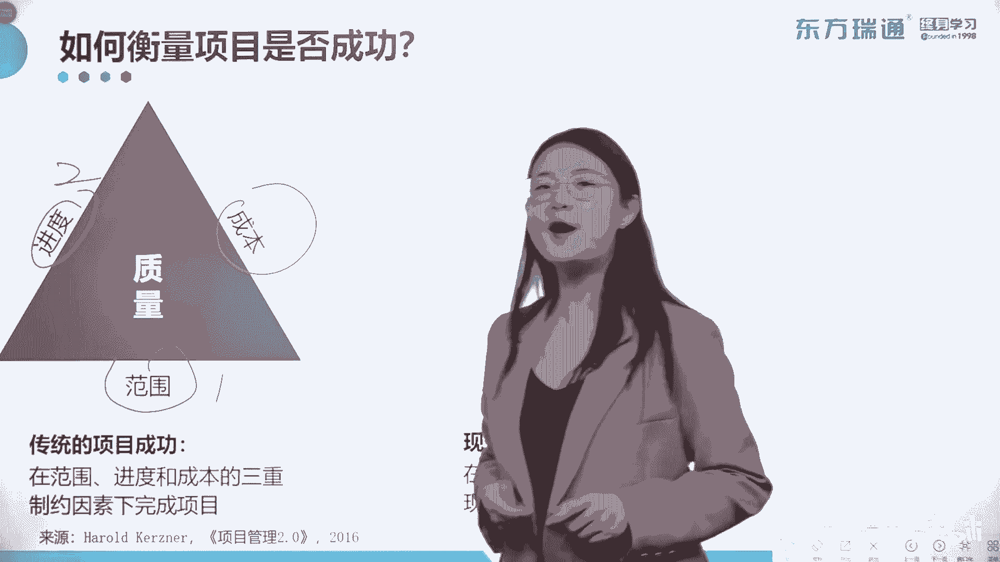
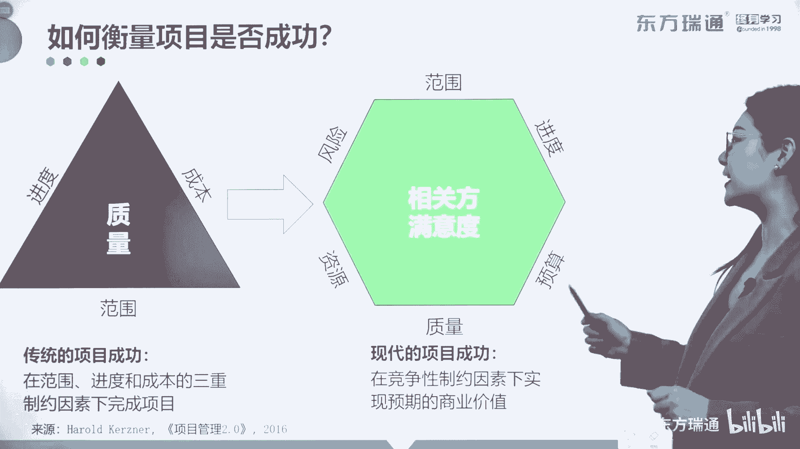
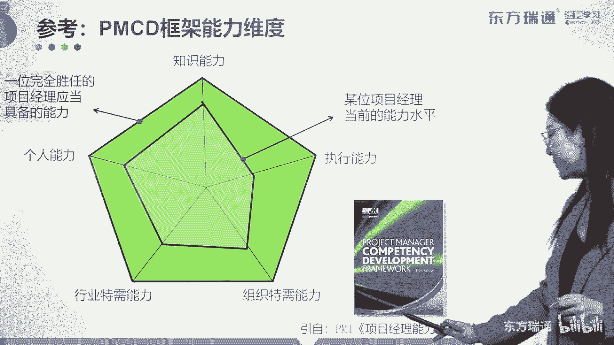
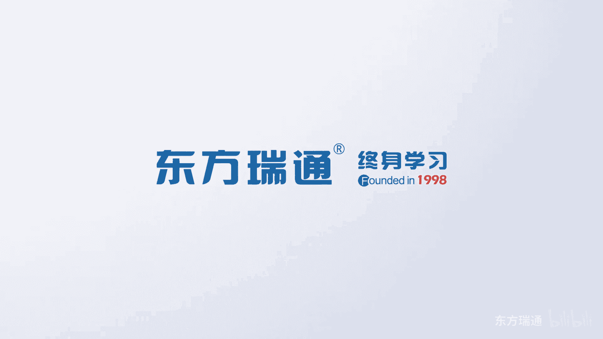

# 少花2000+！PMP项目管理认证全套百集视频课程(更新中) - P12：02项目管理概述-项目经理的角色 - 东方瑞通 - BV1Bm4y1T76g

刚才我们讲过项目管理有49件事要做，那么问题来了，是所有的项目都要完整的去执行，这49个过程吗，这49个过程不可以有先有后，有长有短吗，并不是对吧，所以不是所有的项目，都必须完整的去套用这套理论。

去套用这套理论的做法，比如说你的单位没有单独的项目中，没有单独的采购人员，所有的采购呢都要经历集中采购这种方式，通过专门的采购部门去进行采买，那么在你的项目中，关于采购管理知识领域呢。

是不是就可以小范围的关注，甚至不去关注了，所以在这里呢我们引入了一个概念叫做裁剪，我们在这里将裁剪跟整合做了一个比较啊，先看裁剪，裁剪呢就是选择恰当的项目管理过程，输入工具。

技术输出和生命周期阶段去管理项目，哎，要去做一个正确的选择题，也就是项目经理要与团队发起人和组织管理层，合作，把项目管理裁剪的更加适合于特定的项目，用哪个选哪个，它和整合不一样啊。

整合呢是指所选择的适用于本项目的，项目管理的过程，输入工具和技术输出，在项目推进的过程中，可能不止一次地被使用，也就是要做好各个方面的整合，这是做选择，这是将选择合理利用的概念啊，一个裁剪，一个整合。

所以最终有这么一句话，管理与项目一定要匹配，针对不同的项目特点，使用不同的方法，化通用为专用，大家都知道，现在我们已经进入了乌卡时代了，那些易变性，不确定性，模糊性等等已经充斥着我们的周围。

那么我们应该怎么去应对它呢，大家已经对传统的项目管理，用项目管理预测型的生命周期，分阶段进行管法，这些方式已经深入人心了，那我们是不是可以将敏捷型的思维，嫁接在不同的阶段中。

来助力我们最终的向目标实现了，所以我们称之这种办法呢，叫做实际应用下大框架下的敏捷活动啊，大框架下的敏捷活动，那基于流程的敏捷到底该怎么做啊，我们可以把阶段认为是不同的迭代对吧，在不同的迭代中。

我们做好每一个增量结果的需求啊，分析啊，设计构建和测试工作，然后在制品的限制内的一些公能的数量啊，也要进行相应的调整啊，一直到最后在最后的一个阶段中，我们可以完整的输出项目的目标，如果同学们有兴趣的话。

可以来听听我们后期的实战内容，如何衡量我们做项目是成功的。

有两种形式啊，传统的和现代的。

我们刚才讲到项目管理的框架的时候，已经见过这张表了吧，这是实现项目的目标，还记得吗，有三个因素，首先要明确范围啊，要知道你要做哪些事儿，其次呢要关注进度。

知道用多长时间把这些工作完成，第三关注花多少钱去完成所有的工作，最终实现的是质量的要求，这也是我们传说中的什么制约三角形进度，范围成本这三个因素牵一发而动全身的概念，所以传统的项目成功是在范围。

进度和成本的三重制约因素下完成项目，不管动哪一个都会改变，其他两个因素中至少一个，我举一个例子吧，比如说有一个项目，这个项目呢要干十件事，十件事是什么，是范围是吧，十天干完，这是进度，花10万块钱去做。

这是成本，那这个时候客户突然说了，说哎我觉得这十件事有点不够，我给你来点变更，给你加点新的需求，我把它变成了12件，那么范围改变了，进度有没有可能受到影响，成本有没有可能受到影响呢，都有可能。

那如何来受到影响，最终我们要保证质量不受影响吧，好那如何保证范围增加了，那我们的时长，要不要进一进一步的增加一段时间呢，去完成它呢，来保证质量，有可能成本也要多加一点成本去保证质量吧。

有可能进度跟成本怎么样都去增加，去保证质量啊，这就是我说的牵一发而动全身的概念，而现代的这种衡量项目的成功就不太一样了啊，把这擦一下，现在呢我们来衡量这个项目的成功。

大家看我们已经把最终的目标从质量变成了。

让所有的相关方满意，那请大家注意，相关方在这里呢不仅仅指的你的客户，还有最终成果的使用方，相关方的概念是非常广的，你在完成一个项目之后，不仅要收集客户的一些啊满意度的调查，还要收集我们在做项目过程中。

所有涉及相关方的一些经验教训总结，对不对，来助力后期的PDCA，所以相关方的意义呢非常的广泛，而我们把质量变成了衡量现代项目成功的，一个重要因素之一，传统的范围进度预算是必须要有的对吧。

质量也出现在这里，那现在呢有了新的两个约束，一个叫资源，一个叫风险，我给各位讲一个我们家亲生的例子啊，我爱人呢他曾经是一个互联网从业者，我也不说的难听点，互联网从业者，他曾经带着一个小团队。

他的团队呢由两名高级工程师和，三名初级工程师啊，小白组成，那他带着这样的团队呢，经常在接一些哎比较有趣的这个需求去完成，那有一次呢他们接了一个需求呢，是一个国外的需求，要求他们十天完成某某功能。

那他拿到这个需求一看呢，其实挺开心的啊，因为这些内容对他们来说不难，都是跟专业贴合的非常密切的一些需求，所以呢他就带领着这两个高级工程师，和三个初级的工程师，开始马上来进行投入到项目工作中去了。

哎没想到呢这个项目执行的非常的顺利，到了第七天的时候，他们已经通过了测试，完成了这个需求，要么说那个时候他年轻的啊，他年轻呢他干了个什么事呢，他为了邀功，在通过了测试获得了许可之后呢。

立刻啊就把最终的成果发给了客户，没想到客户最终还比较满意，那很快第二个需求就来了，第二个需求来的时候，如果你是客户，你会给他几天的时间让他做，当然啊，这里面需求的内容其实是差不多的，唉不出所料吧。

客户最终在第二个需求上，只给了他们七天的时间，这个时候我爱人想了一下，唉呀大家咬咬牙努努力加加班也能完成对吧，好，于是带着他的团队又开始做了，在做的过程中，突然在第二天的时候，一个高工病了。

一个高工娃病了，剩下他带着三个新瓜蛋子，一起来干这个新的活动，而这个新的需求好，那这个时候呢他就崩溃了，因为他们肯定不会在规定的时间内完成，那这个时候怎么样，他想办法从自己的朋友啊，同事中找出相关的。

能够做这部分工作的一些这些人员，来参与他们的这个工作中去，当然一定会花更多的成本去请他们吧对吧，资源使用了新的资源，好好不容易在第七天的时候，死赶慢赶的把这个工作完成了，再发给客户的一刹那。

他也没有长吁一口气，因为他已经预感到他的反馈呢一定是不够好的，果不其然的，第二次需求提交了之后啊，这个结果提交了之后，客户是非常不满意的，那最终我们来看看这个事情，资源用上了对吧。

而且呢我们上一个需求把它完成了，正的那仨瓜潦倒，在第二个需求的制作过程中啊，执行过程中全部也都花掉了，整个看下来呢，我们是赔钱的，是赔钱的，所以在这里他得到了一个非常深的感悟，叫做什么呀。

一定要关注风险，并且要为风险留下足够的储备，所以大家看现代的项目成功，通过刚才这么一个小案例，范围进度预算它固然重要，但是同时在执行的过程中，你要关注资源的合理匹配，还有风险的应对措施，对不对。

现代质量的成功是在竞争性的制约因素下，实现预期的商业价值好，那么课程进行到这里呢，我们已经将前三章中的前两部分讲完了，一个是项目管理的基础知识，还有项目的运行环境，那下面一部分内容也比较关键。

是你作为项目经理，你的角色到底是什么样的，因为项目能否成功，项目经理这个角色是至关重要的，我们后面有一张照片，大家看得清楚吗，这展示的是一个士兵背着一头毛毛驴，这是前段时间在微博上比较火的一张照片。

为什么这个士兵要背着一头毛驴来行进呢，我们可以给大家一点时间思考一下，你千万不要告诉我，是因为这个士兵爱护动物啊，有的说4G4士兵呢想把毛驴给吃掉，对不对，你们不要过分的发散啊，那请大家注意。

士兵背着这头毛驴，是因为他们脚下是一片雷区，如果这个士兵他不够，负责任的话对吧，任由这只毛驴在雷区里面乱跑，可能会将他们所有的行进任务呢付之一炬，所以说作为项目经理啊，一定要管好你的团队成员，管得好。

他们是你项目的助力者，管不好他们一定是灾难的始作俑者，所以项目经理在项目中呢，是一个非常关键的角色，在这里呢我会推荐大家来看这本书啊，项目经理能力发展框架也叫PMCD啊。

这里面呢将项目经理的能力分为了五种类型啊，个人能力，知识能力，执行能力，组织特需的能力和行业特需的能力，在这样的一个模型中，你可以判断自己当前的能力水平，是一个什么样的，这个镭射图，对不对啊。

但是我们要求的是项目经理要均衡的去发展，如果你判断出来诶，自己比较倾向于个人知识和行业，还有组织的特区，那么请你加强自己的执行能力，那最终呢我们要将自己当前的能力水平拔高到，完全胜任的项目经理。

应该具备的这五边形的能力中去，所以大家要理解一下啊，如果时间允许的话，建议大家看一下这本书好，那这张图是项目经理的角色认知模型啊，这是课本中给我们展示出来的PMI，人才三角啊，也是未来针对人员这个玉啊。

这个DOMIN我们需要关注的三大领域，第一个，是你就作为项目经理，你需要具备的管理专业技能，管理专业技能，是你要具备的项目专业的管理的管理，专业的技能，能够确保亲自的去管理项目，这些能力从哪建立呢。

第二个内容呢，作为项目经理要有足够的领导力，所谓领导是带领一群人，共同完成一个重要目标的那个个人，如何具备强大的领导力呢，你首先就要了解它能够激励和领导团队成员，以及相关方为我所用的能力。

是我站在这就能让对方信我服我，跟随我的能力，现在呢网络上关于领导力的培训，甚至是课程五花八门，对不对，各位朋友呢，如果对领导力感兴趣，你在选择这些课程的时候要特别的谨慎啊，要特别的谨慎。

尽可能的在一些大的平台上，找一些非常有权威的领导力课程进行学习好，第三种是战略和商业管理的能力，那么我们将它呢拆分成了两大能力啊，第一种叫做战略管理的知识，作为项目经理，你要具备具备了项目管理的知识呢。

战略管理的知识，那么你可以对于高层，下发下了一些战略管理的一些规划，一些重要的愿景目标等等，有所了解，你可以判断出来你现在从事的这个项目工作，是否具备足够的价值，对不对，是能与高层管理者有效对话。

确保服务于战略目标的一个能力，第二你要具备商业管理的知识，我曾经看过一个段子啊，就是项目经理现在应该具有的几大重要的技能，里面呢有如何找老大催资源啊，如何不生气的怼财物啊，如何不犯法的奏销售对吧。

如何和其他部门的成员进行合理的沟通，等等等等，你会发现呀，项目经理有很多很多的困扰，来自和职能经理的沟通，比如说hr，比如说财务，对不对，这些呢你不要把它设置于对立面，你要跟他建立良好的关系。

建立好足够的桥梁，让他们都成为，助力你项目成功的一个关键的角色，那么在这个时候就要求你具备商业管理的知识，能够取得他们的支持，好那这些内容，都体现在了这张表格里了，项目经理其实应该是杂家项目管理的学科。

其实不是科学，是玄学，作为一个合格的项目经理，你需要具备哪些方面的知识呢，首先，这是很多大学中的学，在学工商管理的朋友都会非常了解的内容，心理学，组织行为学对吧，你要充分的了解相关方的心理。

然后呢通过他们的心理去引导他们的行为，还有通过合理的管理办法，让他们的行为真正对你的项目产生正确的作用，所以心理行为和管理三者是永远不分家的，有时间的话，关于组织行为学呢，包括你去学NBA对吧。

也可以去补充一下这方面的知识啊，那下面，作为项目经理，还要具备组织的经营意识，要和最终项目这个可交付成果的使用方，建立对话机制，经营管理的城市财务的这个基础知识，包括你要读懂财务中的一些三张表。

比如资产负债表啊对吧，还有现金流表啊等等等等，你要读得很明白啊，半个CECFO，半个cf，第三种能力呢，你要具备产品管理的能力，这就是我想建议大家的，在学习完PMP之后呢，如果你还有精力跟时间。

可以去学习一下NPDP来扩展你的产品维度，如果你有了新的维度，你会发现项目管理呢只是其中的小小一部分啊，产品管理的知识，还有商业分析的能力，同时你要具备知识管理的能力啊。

知识管理是我们啊PANBOOK第六版新加入的内容啊，第五版还没有，并且知识管理呢现在已经是一门独立的学科了，所以足以见得知识的萃取，知识的传播是多么的重要，对不对，好下面这个算是项目经理的一些软技能了。

叫谈判技能啊，如果你想把谈判技能玩转，建议大家读一读博弈论，一些蜘蛛模型啊对吧，羊群效应该怎么克服啊等等，在博弈论中呢都能给你一些具体的体现，同时谈判的技巧如何，你退我进，如何利用二八原则。

如何利用时间原则等等，这都是谈判的技巧，OK团队管理的软技能，终于出现了领导力，教练管理技术，什么是领导力，我刚才讲过了，领导力，简单说来就是站在这儿，别人就愿意信你的能力，而教练技术呢是站在这。

即使别人不信你，你也要想办法通过套路和手段让别人来追随你，这是什么，教练技术，引导和你的团队去进行统一工作的一种技术好，下面呢项目管理的硬技术包括哪些，目标感，规划能力。

PMP中都会告诉你变化与问题的处理，如何走流程，如果不走流程，我们该怎么做，是否可以用一些更加适应性的方式，来进行管理呢，好最后呢还有一些其他的通用知识，如果你有足够的时间，也建议您去了解啊，人力资源。

质量管理，合同管理等等等等，项目经理啊，任重导员，如果你现在在一个项目经理的岗位，您可以看一看我给大家罗列的这些制要点，这些内容要具备的能力。

