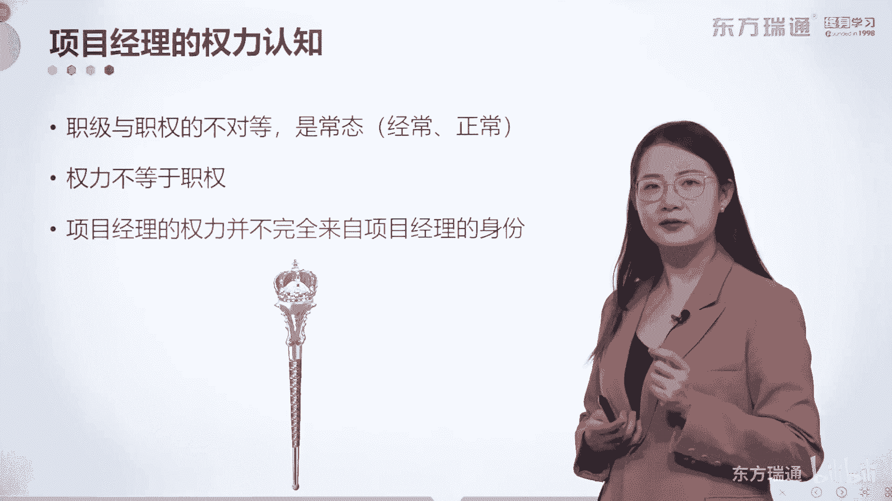
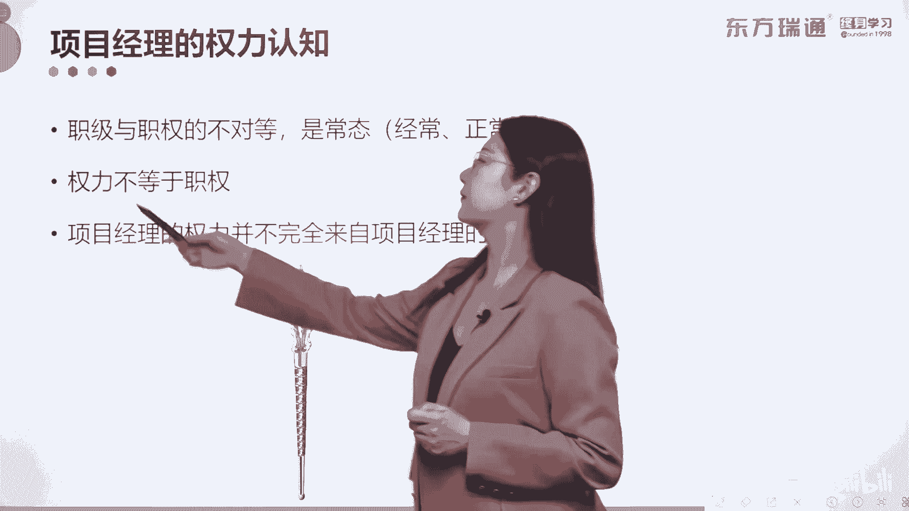
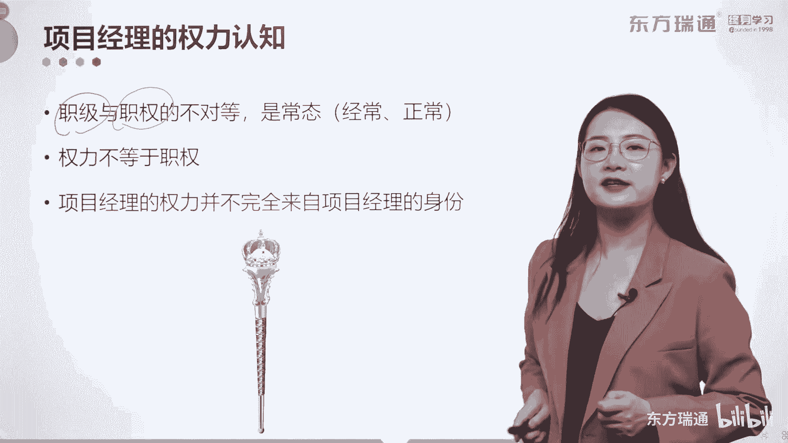
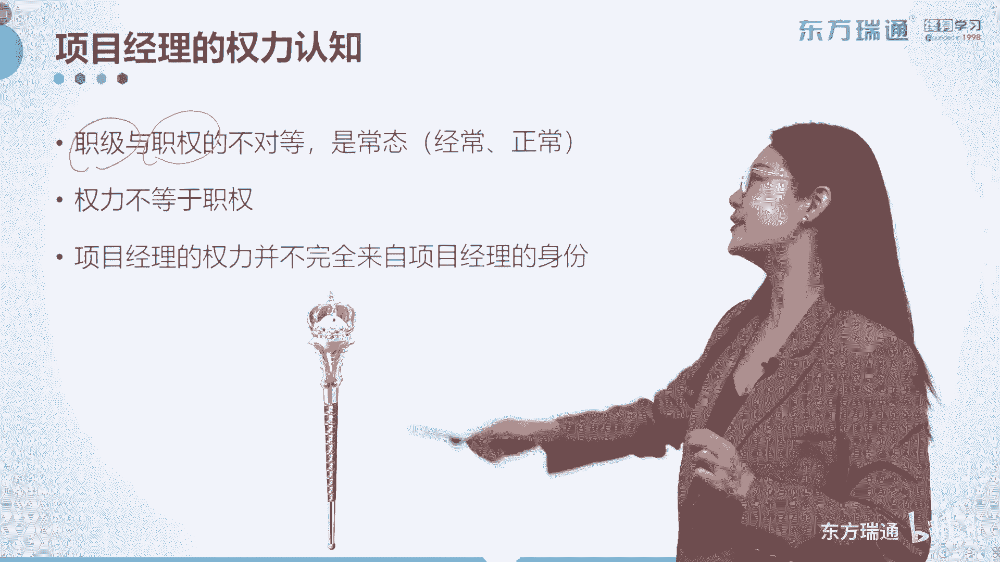
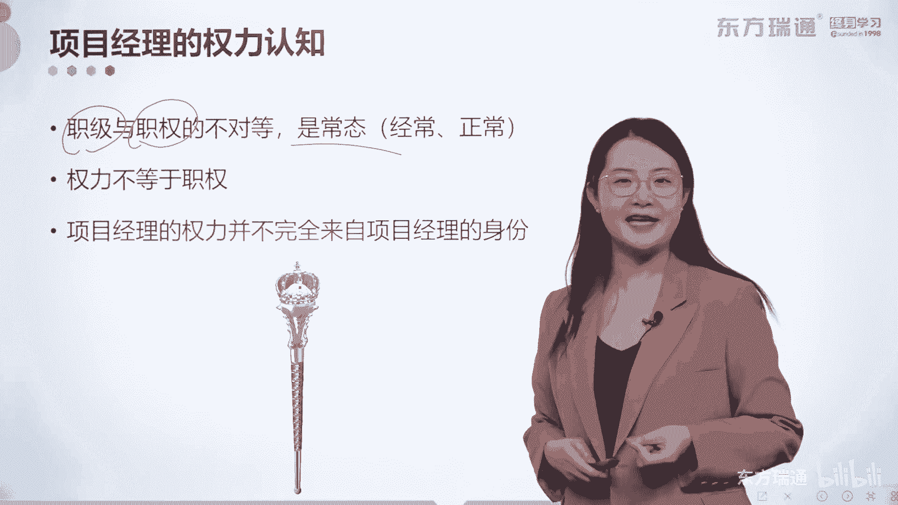
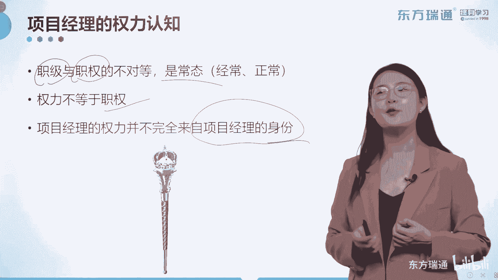
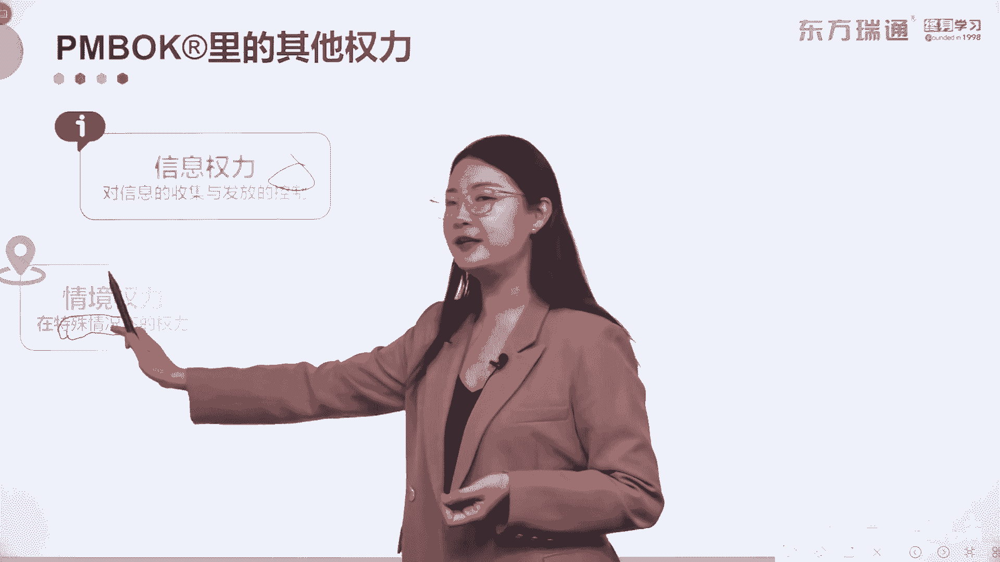
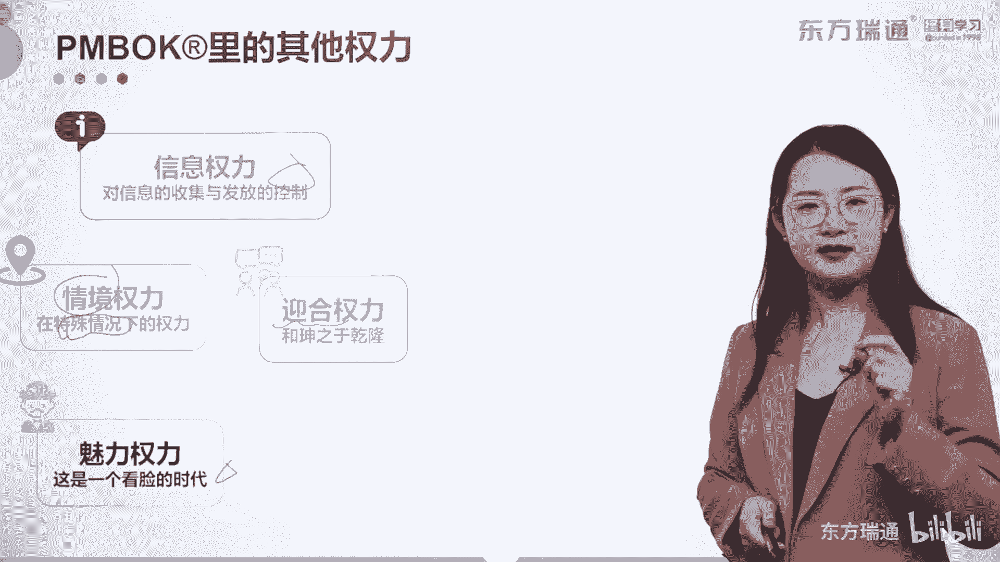
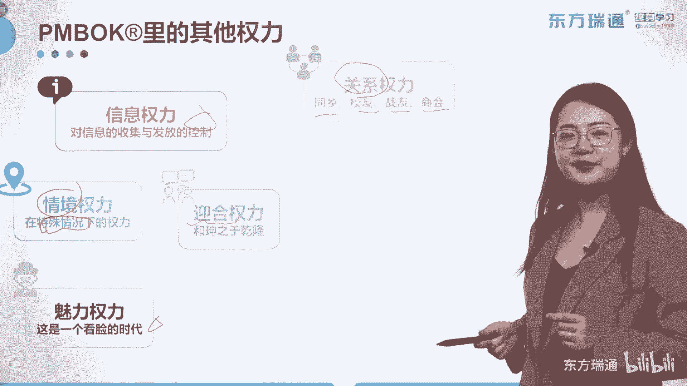

# 少花2000+！PMP项目管理认证全套百集视频课程(更新中) - P13：02项目管理概述-项目经理的权力 - 东方瑞通 - BV1Bm4y1T76g

好作为一个项目经理，一定要对自身拥有的权利有足够的了解啊。

这个权利。

啊我们也叫它相应的职权，但是职权和职级呢是不一样的概念啊。

虽然它不一样，但是却是常态。

所以做项目经理的经常有一句话说，我们自己就是背锅侠。

是不是什么样的人才能是背锅侠呢，那一定是权力不大，但是责任巨大，这就体现了职级和职权的不对等啊，好但权利呢它是不等于职权的，权利可以有拥有很多种，可以在项目中拥有不同的权利，非项目中的非项目的场景下。

你也拥有其他的权利啊，项目经理的权利呢，并不完全来自于你自己的身份，那我们先看一下。

来自于项目经理的一些身份的权利，然后再去看一下其他的权利，关于来自于项目经理身份的五种权利，那这些内容是考试中经常考的，一共有五种啊，请大家尽可能的记一下，它分别是专家奖励，正式参照和惩罚权利。

专家潜力和参照性的权利，注意啊，他都来自项目经理，个人项目，尽个人向专家权利，大家知道，很多项目经理呢，是由于工作或者技术特别的突出，色特别突出被提拔起来的，那么你在整个的团队中。

一定是拥有足够的专家权利的，对谁有效，任何人都有效，对专家权利的合理利用可以起到最好的效果，也是pm i最佳最推行的一种方式好，那再看参照性的权利呢，参照性的权利就比较客观了啊，但比较客观客观在哪。

第一种形式是给予对方暗示，给予项目经理和高职级者的关系，我举一个例子，如果你的团队成员小王不好好干活，你是不是可以用这样的话术去跟他讲啊，哎呀小王啊，如果你现在还是这样的一个精神状态的话。

我没法跟咱们老总交代呀，你看这就是一种很典型的暗示对吧，暗示了自己和老总之间的关系，来潜移默化的给你的员工施压对吧，但是这样的效果呢一定是一般的是吧，还有一种情况呢是你具有威望或者是魅力啊。

你自己就是别人参照的对象，这也是来自于个人的权利啊，这叫参照性的权利的两种形式，那再看来自于职位的三种权利，第一种奖励权利，你要拥有奖励他人的权利啊，对谁奖励啊，那一定是下属，那很多朋友说我是项目经理。

但是我很少呢具备奖励别人的权利啊，那我们不具备，我们怎么应用自己的奖励权利呢，我给大家写两个字，叫做建议，你在整个管理的过程中，员工的绩效是要被你尽收眼底的，眼底的绩效报告，你要是要了解，要读懂的。

你要拿着这些绩效报告究竟汇报的对不对，在绩效报告汇报的过程中，是不是就可以将员工的绩效展现出来，建议给他们合理的奖励或者惩罚呢，所以我们这叫什么，这叫曲线救国对吧，我们接下来看看项目经理的正式权利啊。

正式权力也来源于职位，也叫做项目经理的合法权利，通常呢由项目章程授予项目经理合法的权利，由项目经理的职位而赋予的权利，他是项目经理的正式权利，但是往往不足，尤其是出现在职能型和弱聚阵型的组织结构中。

项目经理的权利呢是极低的啊，极低的好，最后一种是惩罚权利对吧，和奖励权利一样，奖励权益肯定人人都希望较好的一种方式，但是惩罚权利呢也叫强制权利，处罚的权利对下属有用，但是效果是最差的一种好。

这是常见的五种权利，那除此之外，有可能他不是发生在正式工作的场景下，我们来看看作为项目经理。

还有哪些权利可以用，第一种叫做信息权利啊。

对信息的收集和发放的权利，就好比说关于第五版教材和第六版教材的差异。

我了解的比你多，我了解的比你少，关于2015年和2019年的考纲差异。

我比各位分析得更透彻。

那么我在你心里就有了信息的权利，能理解吗。

好第二种叫做情境权利，这个曾经呢是出过不少次出过考题的。

在特殊情况下，项目经理可以动用的权利叫做情境权利。

咱们中国有句古话叫做，将在外军令有所不从对吧，它就是一种情境全力的描述啊，把这两个字记住，第三种权利是项目经理的魅力。

权利魅力这里就显得有点片面了吧。

看脸的时代。

其实魅力呢它分为两种魅力，一种魅力叫做人格魅力。

还有一种魅力呢叫做形象魅力，作为项目经理，你这两种魅力都要去打理好，那最容易打理的其实就是你的形象魅力。

最难打理的，但是却最有作用的却是你的人格魅力。

我记得有一首诗是当代诗人吴桂君写过的。

叫喜欢一个人，很多朋友都了解。

喜欢一个人始于颜值，陷于才华，最后呢忠于人品，其实这就是魅力权利的一个体现，你让对方愿意去跟随你，魅力群里一定是一个非常重要的环节。

并且呢是你平时是可以刻意锻炼出来的是吧，OK下面一个迎合权利啊，迎合他人的权利，我们不要去诟病这种行为，合理的迎合是可以的。

只要是对你项目有利，对不对，合理的迎合，那下面一个关系权利，我们来看看作为项目经理，我们有哪些关系可以用呢，同乡校友战友商会朋友父母对吧，这些跟你有关系的人，都可以将关系怎么样建立起来。

来助力你的项目工作，还是那句话，我们不要去诟病他，因为我们成年人呢并不怕麻烦啊，大部分的情况下，别人来麻烦你，只要自己能做，也是一种价值的体现，对不对，所以你在动用关系的时候，只要你的手段正确。

是合法的，完全是可以利用起来的啊。

好下面呢是施压权利啊，基于强制力下的被迫，那他一定不是一个很好的行为，但是呢在例外管理中它非常有用，唉，什么叫例外管理，就是就是你用其他的方法啊，你动用其他的权利都不奏效的情况下，退而求其次吧。

找一个最坏最笨的办法，但是能解决问题的，给他实施压力好，还有回避权利，惹不起，躲得起吧，它是一种权利啊，你可以被理解的一种行为，还有说服权利，说服权利呢是讲道理，说服他人的能力。

什么时候项目经理用说服权利是比较多的呢，当两军马上就要交战的时候，当你的团队爆发了重大冲突的时候，当你的团队和供应商之间，发生了不可逾越的摩擦的时候，你都可以使用自己的说服权利，古惑仔大家都看过吧。

古惑仔啊，两边的大哥带着鸽子的小弟，马上就举刀开始互砍了，那这个时候呢通常会有一个胖子出来干嘛呢，做和事佬吧，两边一边搂一个大哥跟他们说，大家都是出来混的，那这个角色角色用的就是说服权利，对不对啊。

说服权利好了，然后还有愧疚权利啊，加强义务和责任感，我每次说到这的时候都能想起我在高三啊，刚刚结束高考对吧，在高三的时候呢，我们我们学校请了一个老师来给我们做演讲，那这个老师呢全程都在给我们打感情牌。

讲完了之后还放着那种特别悲情的音乐，我们台下的学生哭了一片啊，感觉自己要考不上大学，对不起家长，对不起学校，对不起国家，对不起党，对对对，他就是运用了自己的这种愧疚权利。

而加强了我们这些听众的什么责任感和义务感，好，那关于权利，简单的给大家介绍了这么几种啊，最常考的情尽全力回避权利也可以用啊，关系权力也用到啊。

