# 少花2000+！PMP项目管理认证全套百集视频课程(更新中) - P16：02项目管理概述-运营和项目的关系 - 东方瑞通 - BV1Bm4y1T76g

那下面要关注的是，运营和项目的关联性到底在哪。

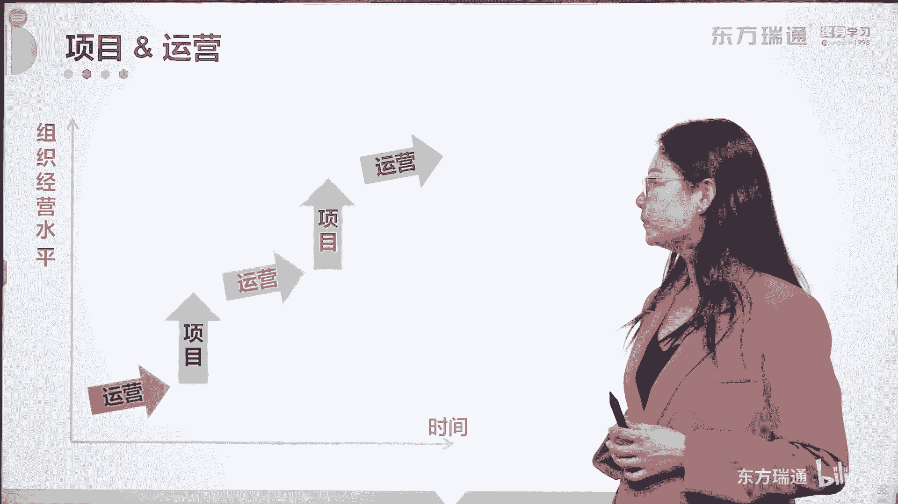

我们来看这张图，横轴也是时间吧，纵轴代表组织在经营水平。

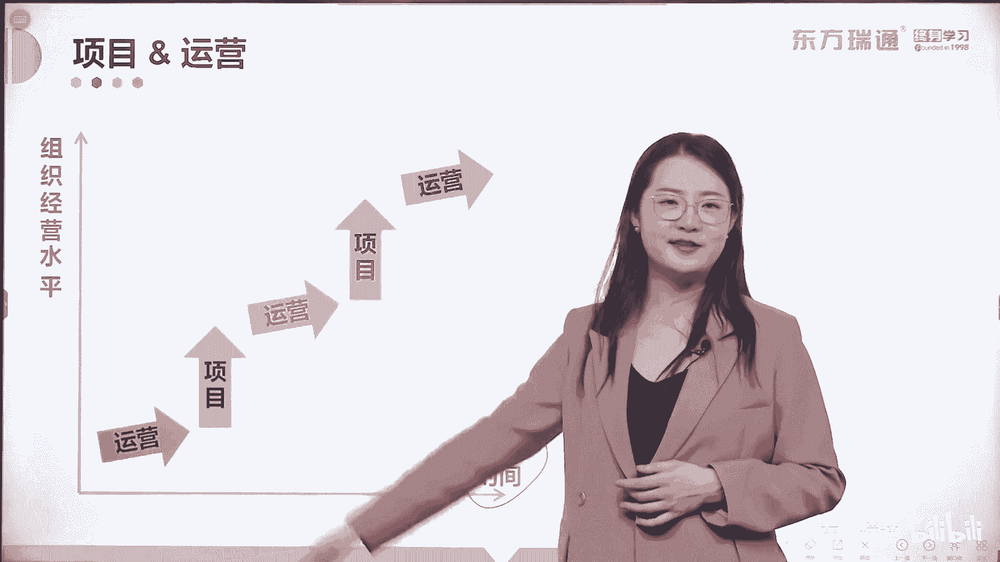

组织要不断的去提高自己的经营水平，怎么提高呢。

首先通过运营来持续的产生收益。

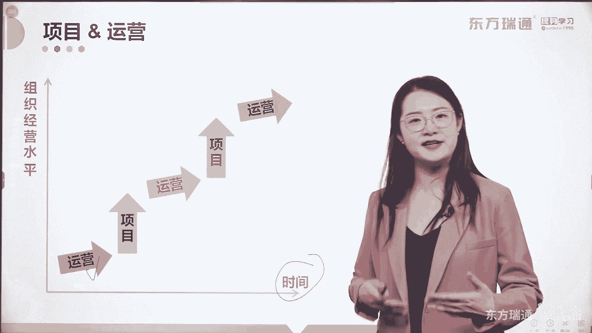

对不对，将所有的工作来变现啊。

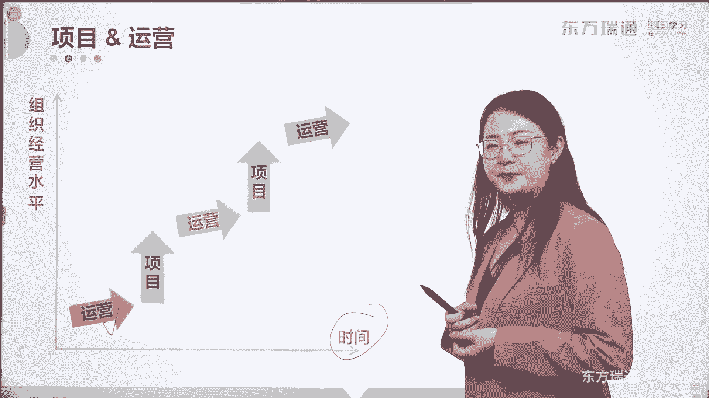

运营到了一定程度的时候，会出现问题和瓶颈，需要解决，如何解决呢，启动项目去解决问运营中出现的问题和瓶颈，好，要启动项目，大家都知道，干项目的都知道为什么我们难受啊，项目是花钱的，项目不是挣钱的。

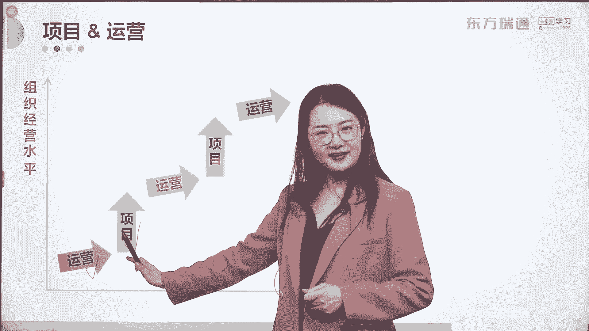

项目输出的可交付成果，是给了运营一个挣钱的机会，对不对好。

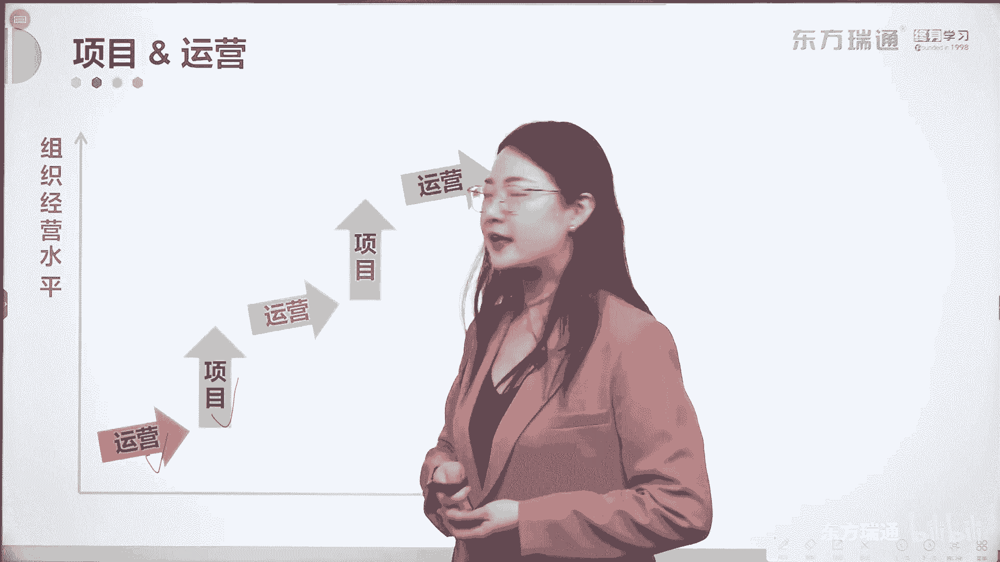

那运营要花的这些钱和资源从哪来呢。

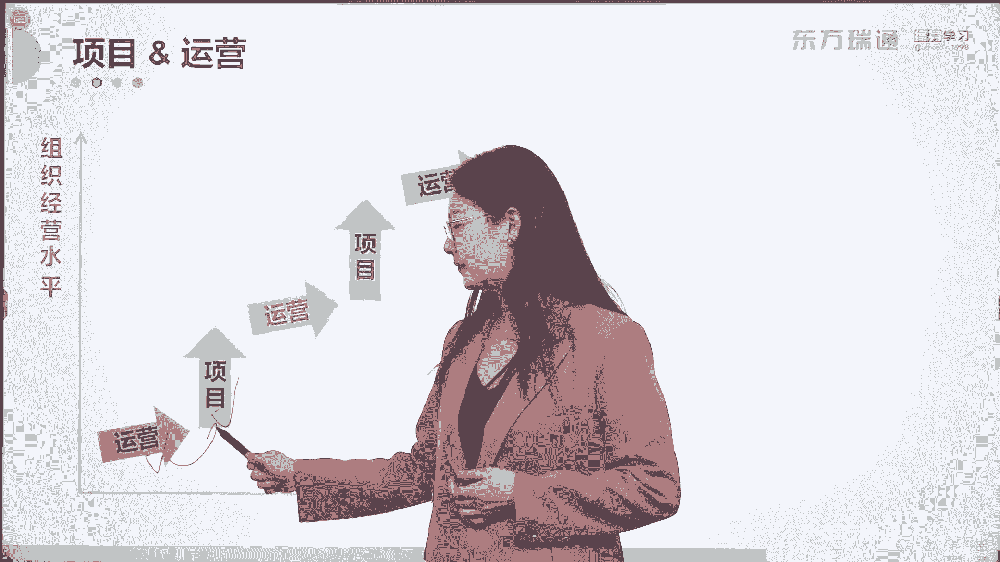

由运营给项目提供，所以大家理解了吗，运营跟项目从来都是双生子。

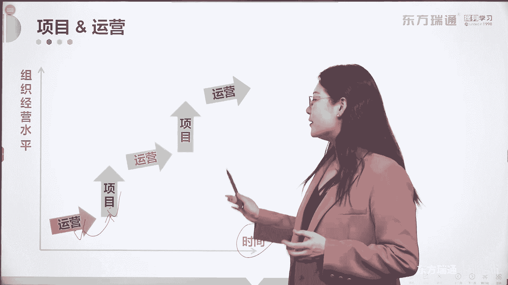

他们相辅相成。

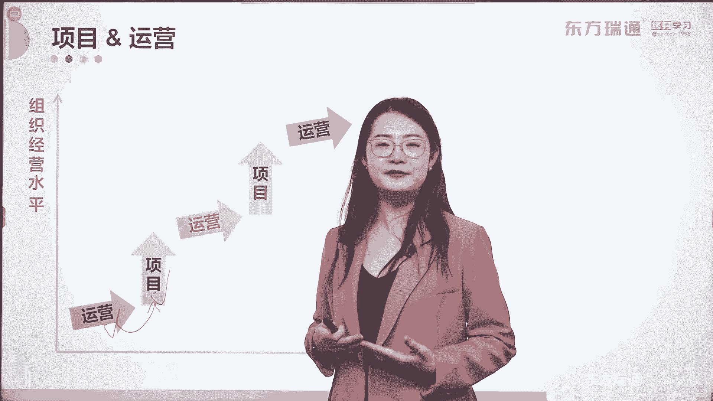

彼此依赖，彼此依赖，我们在这里呢给各位说出了两个观点。

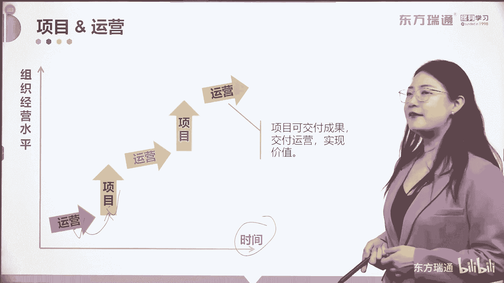

第一个观点，项目的可交付成果交付给运营实现的是价值。

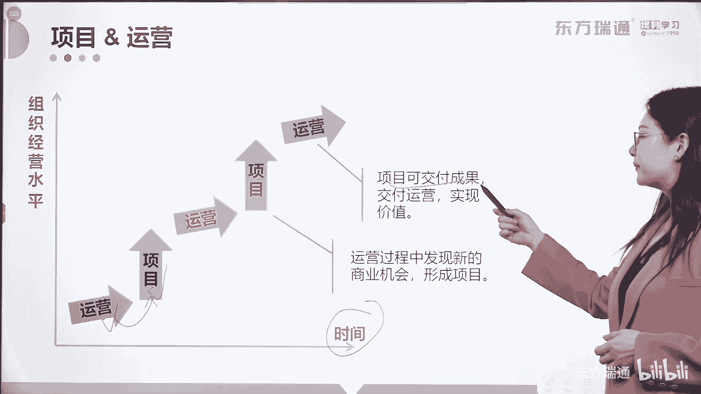

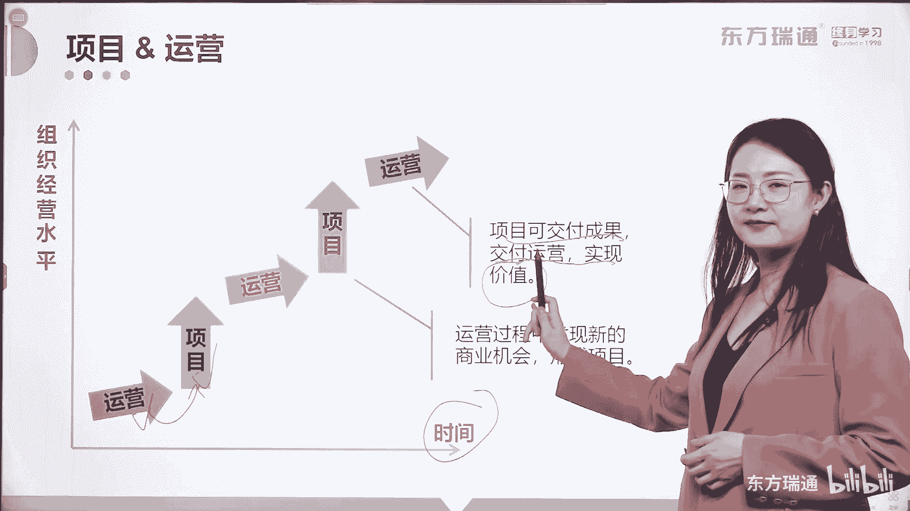

这叫价值，而运营过程中发现新的商业机会。

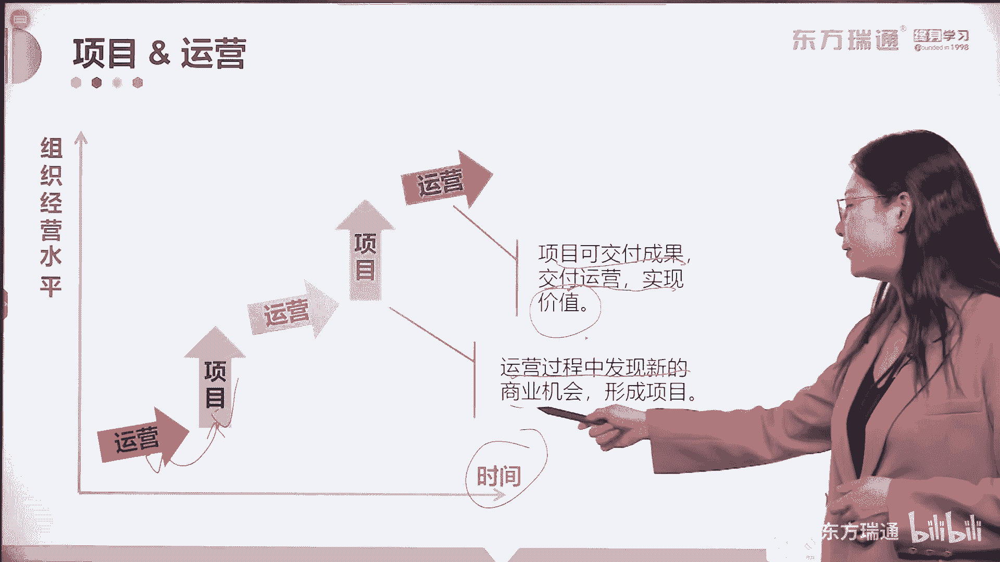

这些机会通过形成一个新的项目去交付去实现。

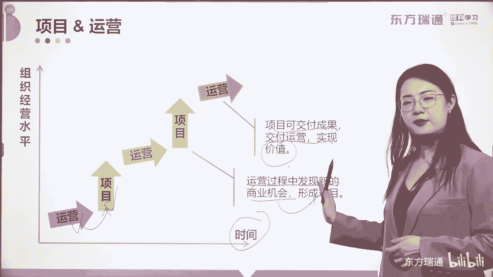

所以请大家关注和理解运营跟项目之间的关系。

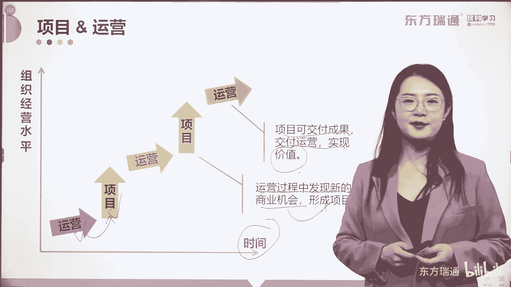

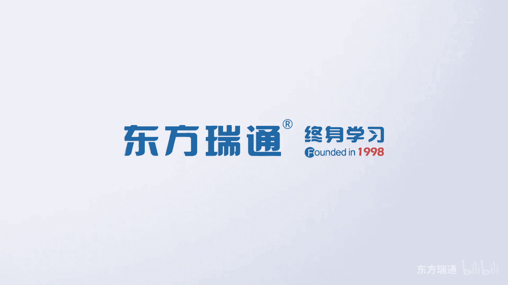