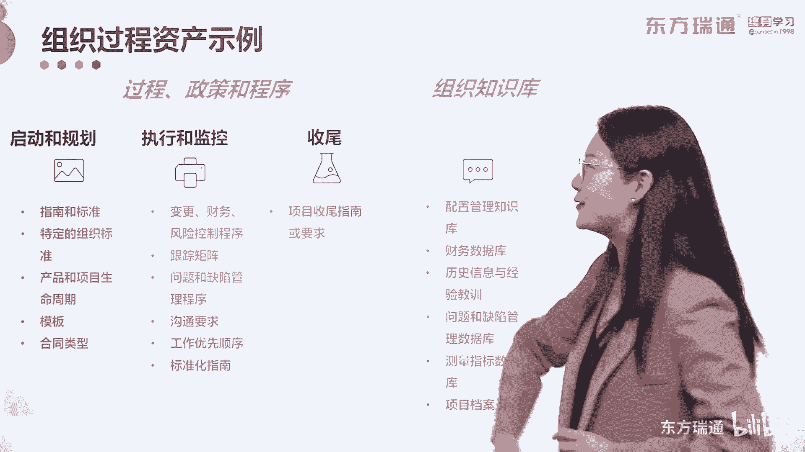
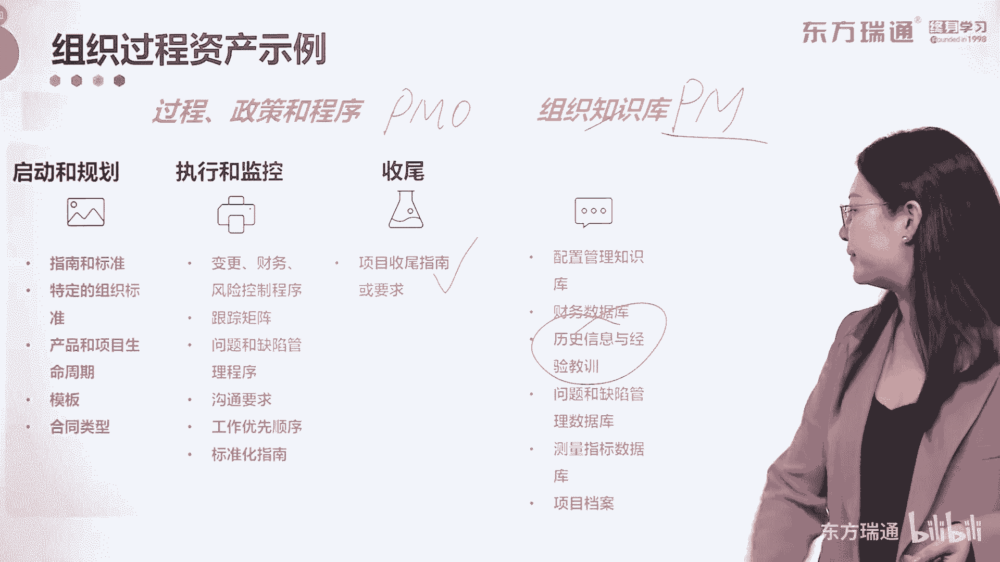
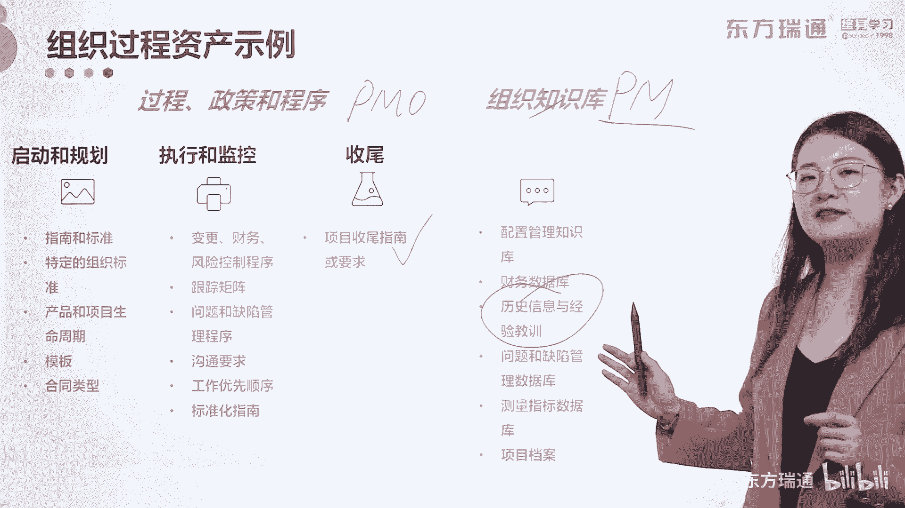

# 少花2000+！PMP项目管理认证全套百集视频课程(更新中) - P18：02项目管理概述-组织结构 - 东方瑞通 - BV1Bm4y1T76g

那在这里呢有一些概念啊，叫做组织结构啊，它也会出现在咱们的这个系统里面，我们先来看常见的组织结构有哪几种，那在这里呢主要把它分为了八种类型啊，八种类型，那如果呢你的公司是一个初创的企业，三五成军。

老大一切说了算，那这种形式的组织结构呢，我们叫做系统型或者是简单型的组织结构，没有任何的职能划分，没有固定分工，规章制度少，遇到请事情的大家商量着解决，感觉非常舒服，是不是简单型的组织权力比较集中。

系统性组织中的权力又比较分散，有利有弊，而适用于小型的初创型的企业，但一旦你发展到了一定规模，可以出现多部门或者是事业步行的组织结构，那我以前供职的这个单位呢，我就可以把它理解成这种事业部行的啊。

因为我在海外事业部哈好了，事业部或者多部门型呢是按照地区业务线，客户类型去划分不同的事业部啊，事业部内部可以采取组织结构的划分，各个事业部也可能重复设置一个职能部门，这个大家了解一下就行了。

考试也没有考过啊，没有考过，因为呢我们在考试的场景下，要默认为我们的组织结构是矩阵型的组织结构，一会儿给大家讲到啊，下面关于虚拟形的组织结构，虚拟性的组织结构，顾名思义。

所有的或者是绝大多数的团队成员呢，平时远程办公，彼此不照面，在不同的物理地点进行协同工作啊，而不是面对面的集中办公，还有一种混合型的混合型，就是将所有的组织结构类型mix起来，见人下菜碟。

哪个适用用哪个，那这个对组织的要求就比较高了啊，就比较高了好，那下面一种呢叫做PMO型的组织结构，我每次上课都有很多比例的朋友，来自于公司中的PMO部门，那什么叫p mo，叫做项目管理办公室对吧。

他是一个职能部门，他的权利呢，往往会凌驾于整个的项目管理体系好，那PMO注意啊，PMO是项目管理办公室，它是一个职能角色，那在这里面指的是什么，是PMO型的组织结构，它是不一样的。

在PMO型的组织结构中，骗猫的权利很高啊，其他部门甚至是老板都要围着他转，这句话听起来就比较奇怪了，你见过PMO型的组织结构吗，哪个公司用的是他呢，反正我还没见过啊，如果您见过，欢迎告诉我。

这就是为什么啊，我要提到这么一句话，有项目管理办公室的公司或组织，它不一定是PMO型的组织结构，大家一定要理解这句话，好，那下面出现红字了，在我们的讲义中，红字代表什么，红字代表重要考点啊。

那第一种职能型的组织结构，它是指按照职能划分，部门有严格的层级划分，有较多的规章制度，权利呢也按层级划分，现在这种职能型的组织结构也非常非常的多啊，非常适合大型的重资产的企业，那第二种呢是我刚才讲的。

我们考试的场景下默认的一种组织结构啊，叫做矩阵型的组织结构，它是指既按照职能划分出一些永久的部门，又根据需要组建了临时的项目部，形成职能型和项目型导向型的项目导向，导向型组织结构的交叉，好。

既然提到了项目导向型，我们来看看下面一种啊，项目型的组织结构，项目导向型，顾名思义，一切以项目为重，那什么时候用这样的一个组织结构呢，当你的公司做的这个项目，已经涉及到了公司的生死存亡的时候。

一个项目的成败关注着整个企业的命运，那在这种情况下，必须要使用项目企呢这个组织结构，它的特点是除了项目管理办公室以外，基本没有其他的职能部门，整个组织项目化管理啊，即根据需要设立众多的临时项目部。

好我们了解了职能型和组织型，那矩阵型是兼具了他们的优点啊，兼具了他们的优点好，如果大家对这三个概念呢，还有些疑惑，那么请看这张表，那我们呢通过罗列这三种组织结构的，优点和缺点。

把基本上会这个考试中呈现的考点呢，都呈现出来了，好第一种情况，我们来看职能型的组织结构，职能型的组织结构，首先你要知道它适用于什么样的公司，大型的国企啊，已经转型了，咱不算啊。

一些大型的重资型的国家型的企业，大部分情况呢采用的是职能型的组织结构，部门内部清楚的上下级关系，并且直线沟通一个OBSP1天，那你就知道找谁办事，对不对，好下面全责清晰反应迅速。

职能部门内解决第三个红字，对于所有的员工来说，员工感觉居有定所，发展方向非常清楚，比如说你刚进公司是职员，你马上可以升什么升副科级，正科级，对不对啊，再往上一直在升副处正处等等等等。

那升到哪个级别是你们公司的最高，我就在这不妄下推断了，所以你们都懂对吧，好居有定所，发展方向很清楚，有利于成员的持续发展，但是有一些朋友呢就是受不了啊，尤其现在年轻人啊，我也调查过。

如果你进入这些企业呢，经常去诟病你的企业制度，你不要不需要去诟病它，存在即合理，对不对，如果你不喜欢这样的一种形式，那么你也要及时的去提出自己的意见，或者做调整，或者是想其他的办法。

去选择其他型组织结构中的公司，OK那么有了这么好的优点，我们来关注一下它的缺点，这个就是职能型组织结构中最明确的一个缺点，它有非常深厚的部门墙存在，部门墙的存在造成了跨部门沟通十分的困难。

要实现跨部门的合理沟通，你要浪费特别多的精力跟财力，OK那在这样的组织结构中，项目经理这个角色可不可以有啊，可以有，但是有跟没有，好像没有什么区别，它的存在感极低啊，极低没有足够的项目控制权。

另外既然是职能型，那一定是职能部门的工作是优先的啊，职能利益优于项目利益，第一种情况，那么有了这样的缺点，我们总要想办法去克服一下对吧，克服一下，所以现在很多公司呢在寻求转型，为了顺应市场的发展。

国家不再给你发福利，发补贴的时候，要努力地顺应市场的发展，和一些中小型企业在一起，齐头并进的去竞争的时候，大型企业的优势和短板呢就做出来了，所以现在很多公司呢在寻求转型，转型很多方面。

组织结构中的转型呢，那首先呢是转成矩阵型的组织结构，它有什么样的优点，大家看它采用的是项目经理负责制，项目的目标，相对于职能型的组织结构一定是比较明确的，大家把目光聚焦了起来。

它可以最大限度地利用公司的稀有资源，来避免浪费啊，同时有利于横向的跨部门沟通设定，适当的程度上，解决了职能型组织结构的一个缺点，对吧，唉但是它也不是一个万金油，它的缺点呢也非常明确。

首先第一个就是一个红色的缺点啊，在职能啊，在矩阵型的组织结构中，项目经理有了存在感，甚至有了地位，但是不要忽略另外一个角色，职能经理依旧存在，依旧存在，所以你在一个题目中判断。

这个组织结构到底是职能型的呀，矩阵型的还是项目型的，如果给了你两个领导，一个职能型经理，一个项目经理，他们两个同时存在的话，想都别想啊，一一定都是矩阵型的组织结构啊，一定是矩阵型组织结构，它有两个角色。

那有这两个角色造成的困难的就是一个员工，你要找俩人去汇报，他要被多头管理，那么员工呢一定会感到无所适从，对不对，好，还有一点啊，两个领导在一起，如果掐架了怎么办，他会造成角色的决策的放缓啊，决策力下降。

如果项目经理跟职能经理意见不一致，所以他们统一的难度就会很大，决策的周期很长，导致最终的结果就是黄花菜都凉了，对吧好，下面需要良好地掌握治理环境和信息系统，给你为为职能型组织结构中。

做项目呢做足够的支撑啊，这两个要求也是比较高的啊，理解了吗，一定是两个角色，同时存在的是矩阵型的组织结构啊，好最后一种项目型的组织结构，在这样的一种组织结构中，项目经理拥有了绝对权利，所有人都听他的啊。

项目团队成员呢可以集中办公，沟通效率很高，大家的目光都集中在了项目任务和目标中，没有任何的职能部门给他施加，其他职能部门的压力，所以这样的话单独领导的话决策比较快，解决了这个问题，对不对。

好成员对项目呢是高度忠诚的，但是大家不要忘了，项目有临时性，临时性代表项目有始有终，始还好，那钟呢项目完成之后，项目成员呢就面临着解散，就好比我以前呢啊从事涉外工作的时候，我们组组建海外的临时项目部。

当时呢是整个系统内抽调啊，考试啊，怎样怎样的，然后抽掉大家，形成了这么一个机制之后，选拔了几个人出来啊，当然我也在其中，但是有很多人被选拔出来了之后，他们不愿意去，他们考虑的非常多，为什么呢。

一些很优秀的员工啊，比较拔尖的员工，他们呢安家落后，在自己的工作的城市已经有足够好的条件了，如果被挖到了临时项目部上，当项目完成了，他们需要被怎么样遣散回原单位，也不能说遣散回原单位吧。

就抽调到一个项目中，然后返回原单位，那这个时候他们面临的危机，就是之前的这个萝卜坑已经被站上，对不对，员工有了这样的担忧，所以说这两期的临时的项目部建立起来了，质量也是堪忧的堪忧的。

所以作为一个项目经理，你要想办法解决员工的这种担忧，对不对，好，那么由于项目的临时性啊，项目团队成员缺乏对事业的连续性和保障，这样就不利于团队成员的专业发展对吧，招之即来，挥之即去，一次两次还行。

时间久了一定是没有作用的啊，所以公司资源在这种情况下呢，利用率不高，全都在一个人手里把控着，利用率必然不高嘛，所以它存在着资源独占和浪费好，我认为这张表呢它的价值很高，如果朋友们想把这些内容学明白了。

需要把这张表呢牢牢地掌握好，下面一个情况，如果你看书看得非常仔细，书中呢也把矩阵型的组织结构分为了三种类型，分别是强矩阵，弱矩阵和均衡矩阵，我们刚才讲了矩阵型的组织结构，它有什么样的特点。

他一定是两个领导角色都同时存在，职能经理跟项目经理是吧好，那怎么来区分强矩阵，如果矩阵还是均衡矩阵呢，最简单的一个方式，就是把这两个领导的权力大小进行比对嘛，就好像他们两个在掰手腕一样。

如果职能经理掰得过项目经理呢，那就是弱矩阵型的组织结构，如果项目经理的力气略大一筹，掰得过职能经理，那就是强制阵型的组织结构，如果项目经理跟职能经理势均力敌的话，那就是均衡的矩阵型的组织结构。

大家理解了吗，好那关于这三类的组织结构呢，我们就介绍到这里，最后有这么一句话，大家一定要关注组织结构的类型，没有所谓最好的，只有最适合当下商业环境和内部文化的，我们经常犯的一个错误。

就是身处职能型组织结构中，看不到他的好，就在那盲目的羡慕别人，但是殊不知，站在桥对面的他们也在看着你呢，我们刚才讲的内容全部都属于事业环境因素，它的内容呢如果大家实在是背不过，区分不了最简单的一个方式。

我们记什么，我们即组织过程资产的内容啊，就这么俩过程，政策和程序组织知识库，一个由PMO协助你完成。

一个由pm积累啊，或者说pm代理自己的管理团队进行积累，它的内容在启动跟规划中，包括了这些非常的简单，都是项目中执行出来的对吧，执行和监控中这个生成的收尾过程中呢，有相当的这个要求和程序，组织知识库。

配置管理知识库，财务数据，把这个画下来。

我们在项目过程中进行的经验教训总结，要形成经验教训登记册。

所有的经验教训登记册的更新和汇总，最终都要生成组织知识库。

