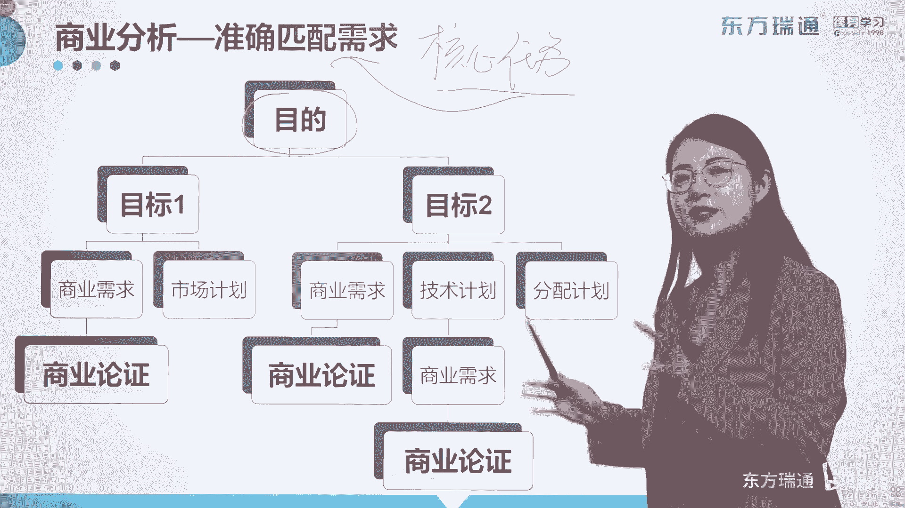
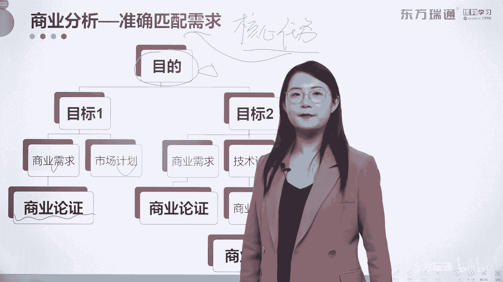

# 少花2000+！PMP项目管理认证全套百集视频课程(更新中) - P19：03商业分析概述-商业分析的目标 - 东方瑞通 - BV1Bm4y1T76g

商业分析包含的任务非常非常的多。

那其中最核心的任务。

叫做什么，叫做玩转需求，精准的匹配需求，那这个需求是如何进行匹配的。

大家可以看一下这张图，那首先呢，这叫什么中长期目标是吧，中长期目标我们称之为目的，这是完成的一个终极任务。

那么好，我们可以把这个目的呢，拆分成一个又一个的短期目标去完成吧，短期目标如何实现呀，将它记录在商业需求中，也可以形成市场计划，但是如果啊如果这个项目比较大。

比较大，那这些小目标不太好实现，那么首先建立的是商业需求对吧，那其次呢如果是比较小，相对来少的话，建立市场计划也OK啊，好商业需求最终被记录在商业论证中。

什么是商业论证，判断一个项目是否挣钱的一份文件，值不值得被投资的一份文件。

我给大家举一个例子吧，因为商业分析师啊，是一个项目的一个最初的需求对接者。

所以他第一件事就是要核实，我们组织的愿景是什么。

中长期的目标是什么，也叫目的是什么，比如说组织的目的是啊，5年之后实现100个亿的收益。

5年啊，after five years later是吧，这是5年后，赚100个亿，这是大目标，中长期的目标是吧，那接下来我们怎么把它拆了呢，拆成目标一这100个亿，目标一销售。

要卖出去多少货，卖出去多少，承接多少业务啊，100个亿里面你要完成100个亿的这个收益，那他可能销售要跟300亿的项目，对吧好采购部呢，啊才够，要完成多少物资的采购呢，可能70亿的采购当然越少越好是吧。

为了满足100个亿的收益，那以前100亿的花费，你现在把它压缩到70亿可以吧，好那技术部他的目标是什么，聘请就是花多少钱，聘请什么样的专业人士，来参与这些工作等等等等，把这100亿的收入的巨大目标。

平摊到一个又一个的部门中去实现，可以吧，这就是目标的拆分，那接下来呢，我们要让销售在这5年内，实现300个项目的跟踪，甚至是实现怎么来完成制定市场计划，进行攻击计划，或者是市场各种各样的渗透计划对吧。

抢滩战略等等，那这些都是制定市场计划的一些要求，然后形成商业需求行不行，再把目标拆分到一个一个需求，将需求最终的要求写在商业论证中去也OK，所以这就是，如何一步一步的来完成项目的终极目的。

关于如何匹配需求呢。

