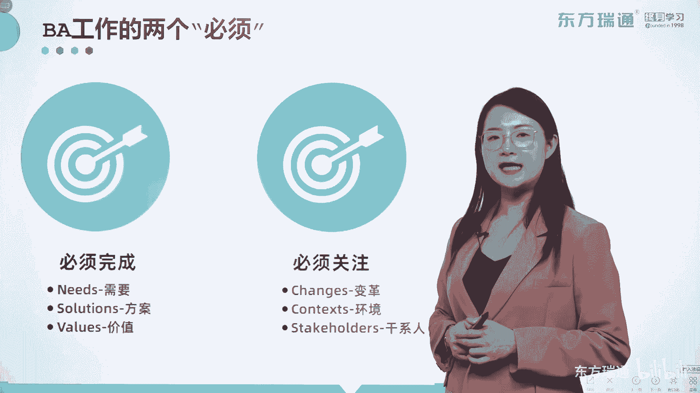
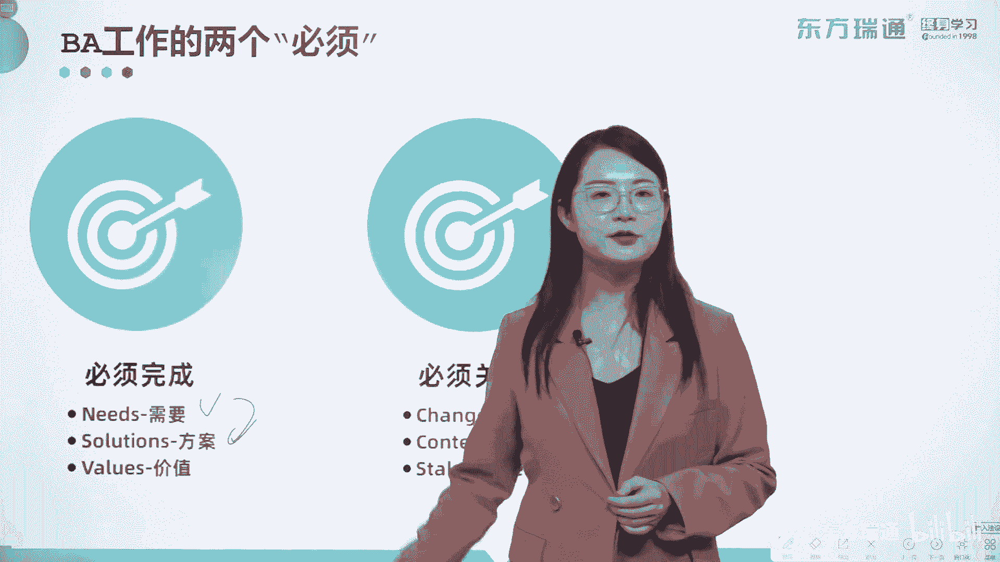
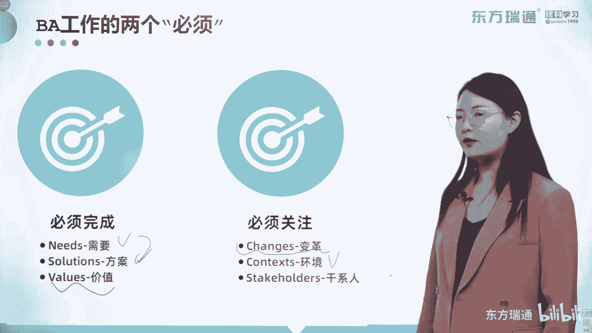
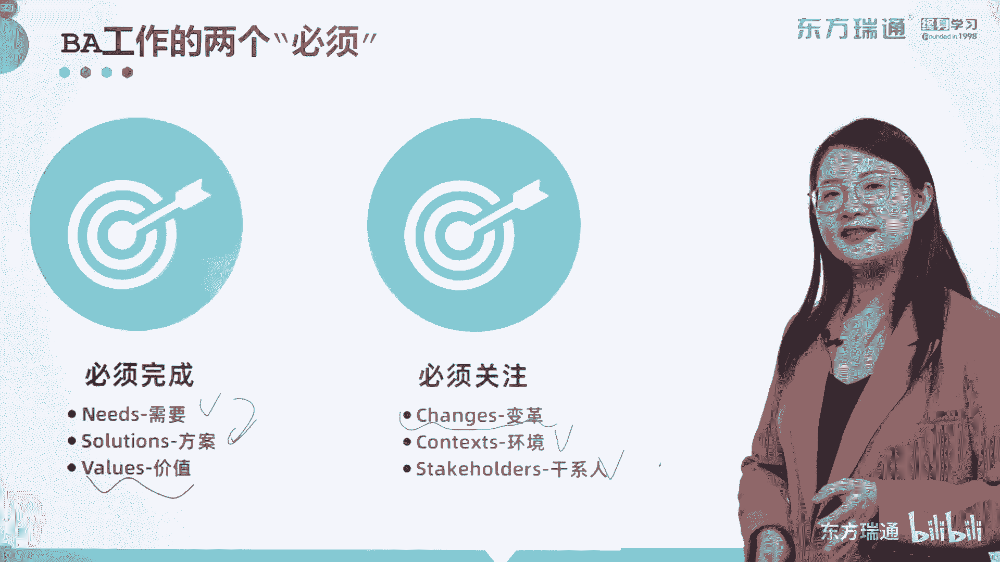
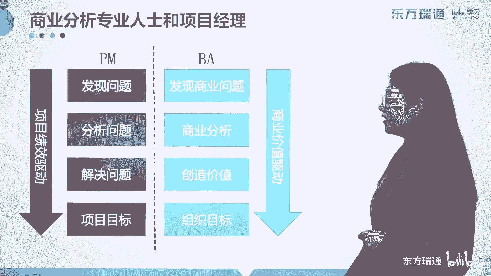

# 少花2000+！PMP项目管理认证全套百集视频课程(更新中) - P26：03商业分析概述-需求分类 - 东方瑞通 - BV1Bm4y1T76g

好那商业分析专业人士，他的工作一定要实现两个必须。

第一个是必须完成的，这个叫什么叫做商业需要啊。

企业遇到的问题和机会都叫需要，第二个是要根据这个需要，制定出能够持续实现价值的解决方案对吧。

那第三个要实现什么样的价值。

你得定义好它，OK这是三个必须完成而必须关注的，第一个组织变革，我们之前讲过了是吧，组织变革一些高层级的变革，很多方面，第二个目前的环境是怎么样的。

我们出现这个问题和机会，它的原因是什么对吧，那这些可以通过你的归因能力进行细化和了解，到最后要持续地关注干系人，也是我们说的相关方的概念，好只有完成了三个必须和三个关注你的工作呢。

才能相应的来说顺利的多，那接下来我们把项目经理跟商业分析，专业人士放在一起进行比较一下，看看他们的区别在哪，那首先呢中间一个分割线。

我们先来看项目经理，项目经理其实他被提拔出来最重要的是什么，带领一个团队实现向目标对吧，那如何实现呢，我们之前通过问题的出现方式，给大家讲过如何实现项目标，发现问题，分析问题，分析根本原因。

然后解决问题，最终实现项目标对吧，那么一切呢都由绩效来进行驱动的，但是商业分析师不一样，BA是什么，他也要发现问题，但是加俩字，他发现的是商业问题，他不关注特别细节的项目中的问题，能理解吗。

所以呢通过发现的问题，我们可以通过各种各样项目中的问题，经过筛选发现对商业方面有影响的那类问题，然后再进行处理好，那么它进行的分析呢也叫商业分析，通过启发，通过分析和通过不停的跟踪和控制啊。

来最终对最终的几个方案来进行要求和制作啊，好那接下来，进行商业分析的目的不是解决问题，而是持续的创造价值，持续地保证你的解决方案是有效的，最终呢实现组织目标，所以它的整个驱动力来源于哪儿啊，两个字。

价值项目经理关注的是绩效，最终实现向目标，而商业分析专业人士呢是因为实现了组织目标，而最终产出的是有价值的结果，所以大家一定要关注它们之间的区别，他们的关注领域的维度高度都是不一样的啊。

讲了一堆商业分析专业人士，你该有什么样的能力，技术素质和具体的工作，那接下来我们看看商业分析师，一旦一个人呢将一个具体的角色啊，叫做客观角色变成了主观职业的时候，那么你才是商业分析师。

商业分析师是非常难做的啊，一般呢它是来自于组织的高层，对他的基本工作上的要求，是你要求有清晰的战略思路啊，深入人心的产品哦，像深入的项目或者产品价值剖析，第三个要对需求进行精准的提炼。

对个人的要求呢也很大啊，第一个要坚定的和组织达成愿景的决心，敢为人先的精神，为什么这样说，你一定要善于尝试，因为你的目光呢要比别人更加远大，那最后要求你有非常扎实的管理能力和经验，需要一步一步的往上走。

没有人说，上来就能处于一个商业分析师的岗位了，好，那关于公主和各种人的基本要求啊。

