# 少花2000+！PMP项目管理认证全套百集视频课程(更新中) - P3：02项目管理概述-十大知识领域 - 东方瑞通 - BV1Bm4y1T76g

在这个良好实践中。

我们需要关注的是十个重要的方面。

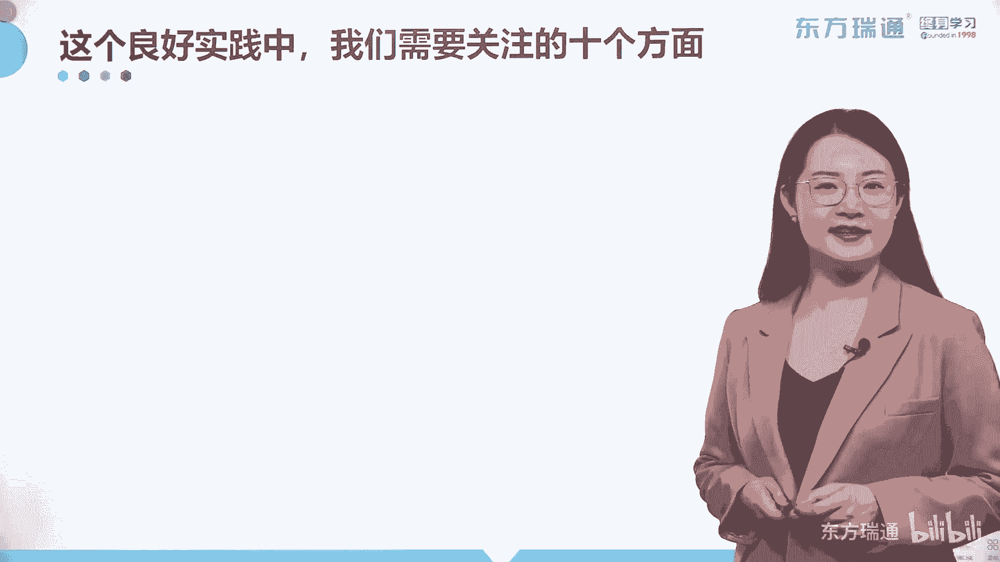

这十个重要的方面呢，代表了我们后期整体课程设计中的。

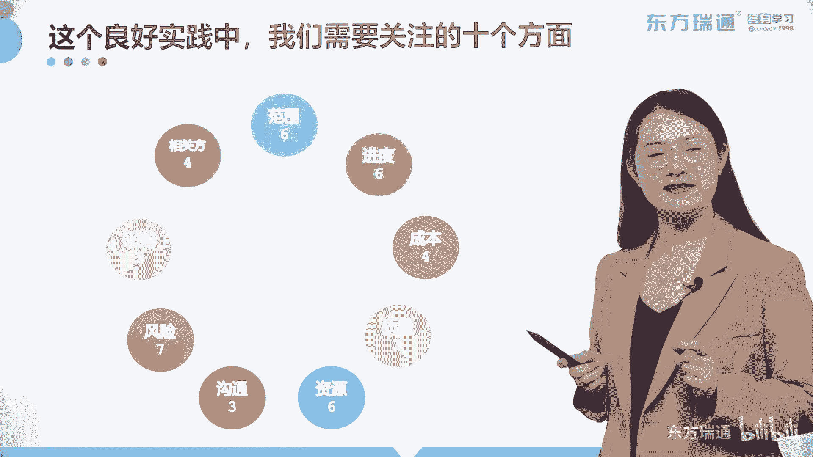

十大知识领域，它们分别是范围。

进度成本质量，资源沟通风险。

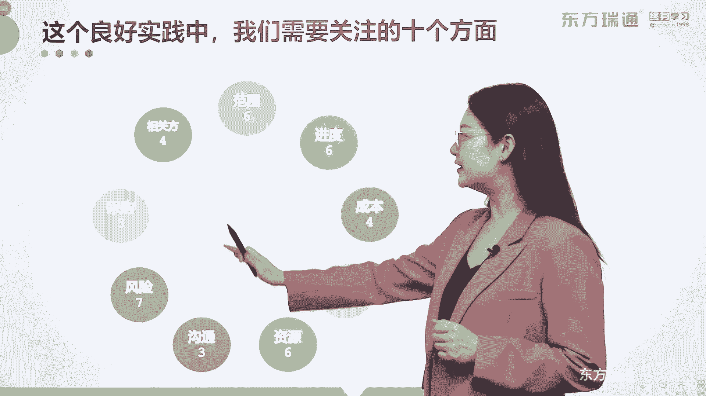

采购相关方，还有最重要的一个，我们把它放在了中间，叫做整合。

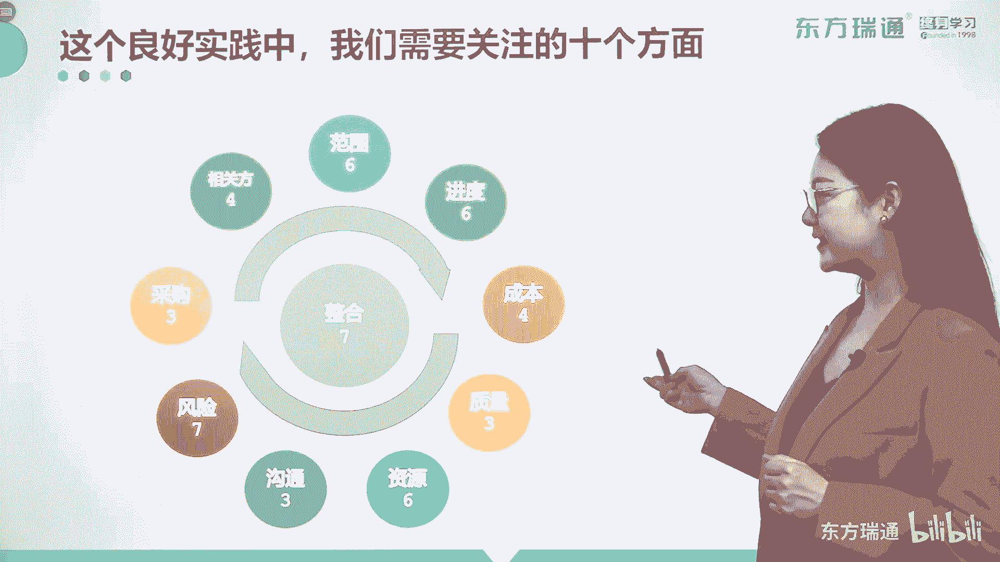

大家发现了，我们作为项目经理需要关注的这几个方面，下面都会有一个数字，它代表什么意思呢，它代表着我们每一个知识领域中，有多少个过程是需要我们学习的范围。

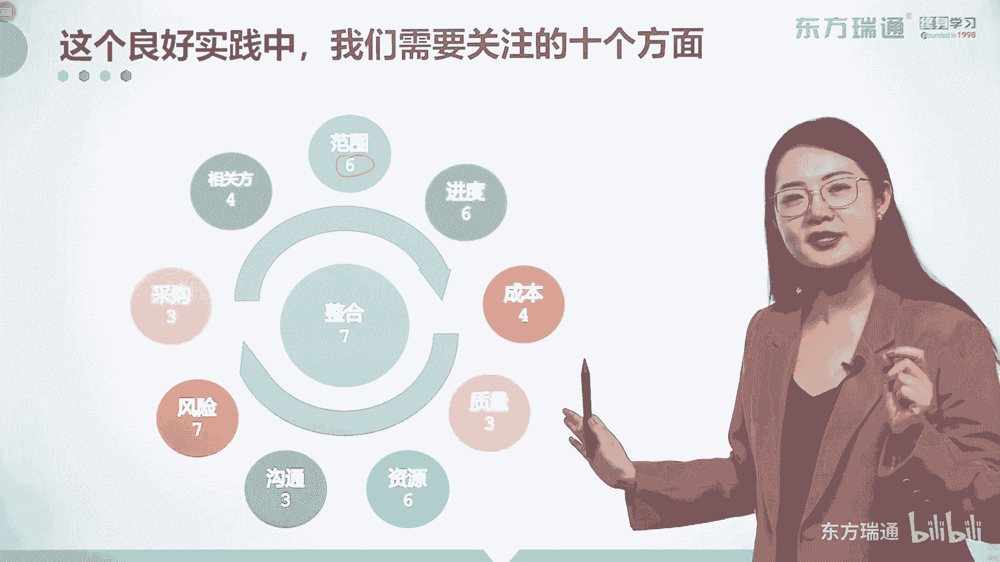

要关注六个过程进度，六个成本，四个质量，三个资源，六个沟通，三个风险，七个采购，三个相关和四个，然后整合有七个，大家看到这些数字，你就应该能够简单地判断出未来我们的考试中，它的出题最多的地方范围进度。

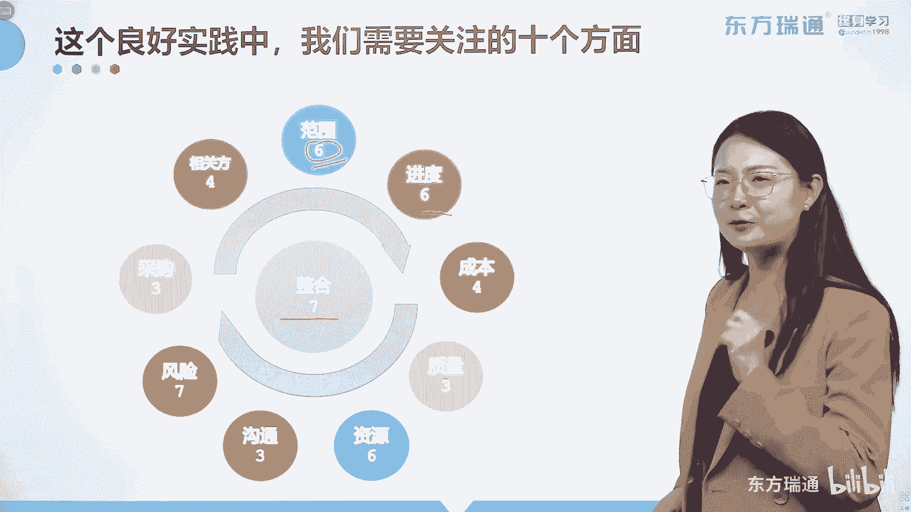

整合风险资源是吧，但是这里面涉及到人也会出很多的题啊，像沟通啊，相关方的期望管理等等等等，那么最重要的是，你要了解我们要做好这十个知识领域，它的判断标准是什么，我们先来看范围，在做项目规划管理的时候。

首先要知道的就是范围，因为当你不清楚自己要做什么事的时候，后面一切的工作就像无根之木一样，你找不到具体的方向和边界，所以范围我们怎么做。

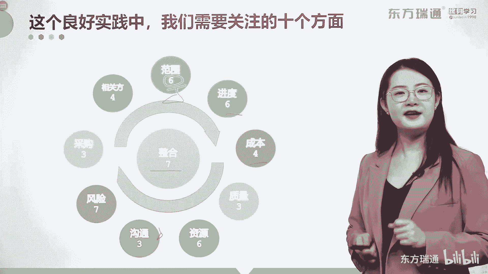

做好范围管理，我们就是要将我们在项目中要去完成的，那些工作，做到不多做也不少做，第二个知识领域叫进度，进度不快做也不慢做，我们的误区就是越早完成项目越好。

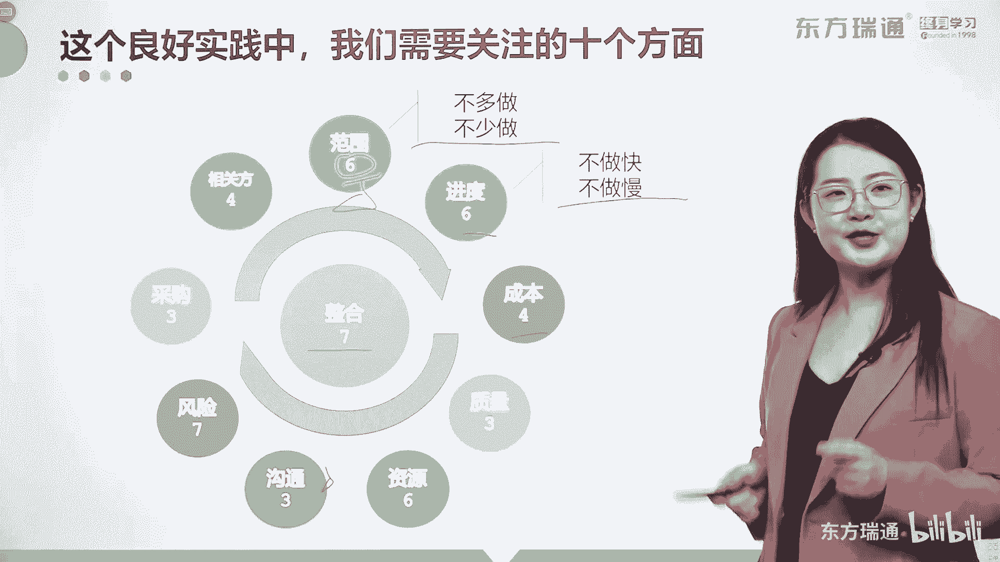

那这是对的吗，不一定吧，你越早完成的项目，你也许会去牺牲掉那些该做的事儿，也许会牺牲掉足够的质量，也许要多花成本啊，所以如何做到进度管理呢，不快做和不慢做，它的基线在哪呢，在这里面会出输出进度基准啊。

很重要好那同样的套路，我们再来看成本啊。

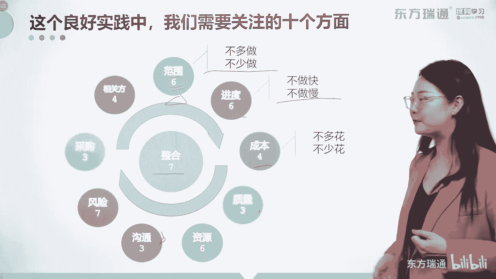

不多花也不少花对吧，质量做的程度要达到什么样的情况呢，不好也不坏好，下面是资源，资源分为两类，食物资源和人力资源，关于实物资源，做到物尽其用，人力资源呢人尽其责，注意这样的一个资源，涉及到人力资源。

主要针对的是我们的团队资源，它和相关方不一样，相关方针对的是整体的项目有关的干系人啊，干系人好，下面一个领域呢关于沟通，沟通讲究不多说也不少说，而风险也是分为两类的，关于好事，我们叫机会啊。

不好的事情它出现的可能性呢我们叫威胁，那针对机会和威胁要做到的是不多，那些威胁不少机会，关于采购很明确啊，不多买也不少卖是吧，相关方我们要尽可能的让那些跟项目有关系的，那些人都可以来支持我们的项目工作。

最有效的一个做法，当然这里面说的比较夸张，叫做求好神拜好佛，最后我们将整合管理的知识领域放在中间，并且呢它包含了七个过程，说明它是整个项目管理中的重中之重，我们在学习了31~3章之后。

我们首先要来学习的就是整合，它代表着项目经理最最重要的工作，因为遇见霸业，你必须要具备统帅三军的本领好，这是我们需要关注的十个方面，也叫做项目管理的十大知识领域。

很多朋友在看书的时候呢觉得很崩溃，你崩溃的原因。

第一个你没有构建出来他的知识框架，或者说呢是知识领域的逻辑。

那么通过这张片子，我来帮助大家梳理一下。

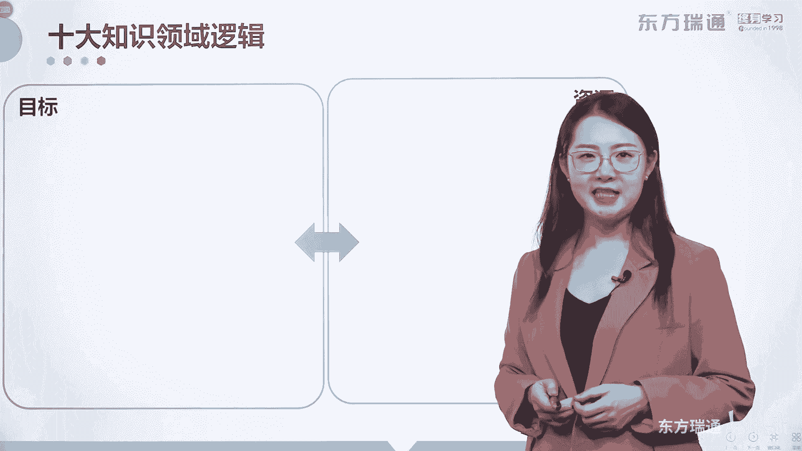

项目管理的十大知识领域的逻辑，首先做项目的目的要完成项目标。

对不对，要完成项目标，完成项目标呢需要使用具体的资源。

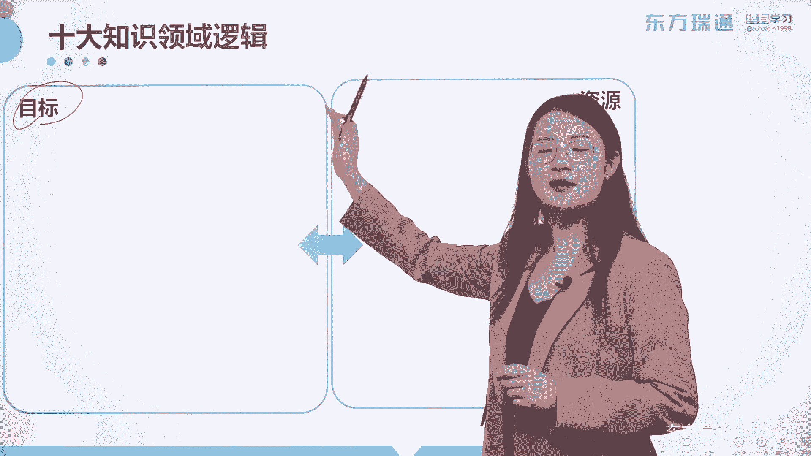

所以我们先将目标和资源这两大类分好。

放在这里，那目标包括几个方面呢。

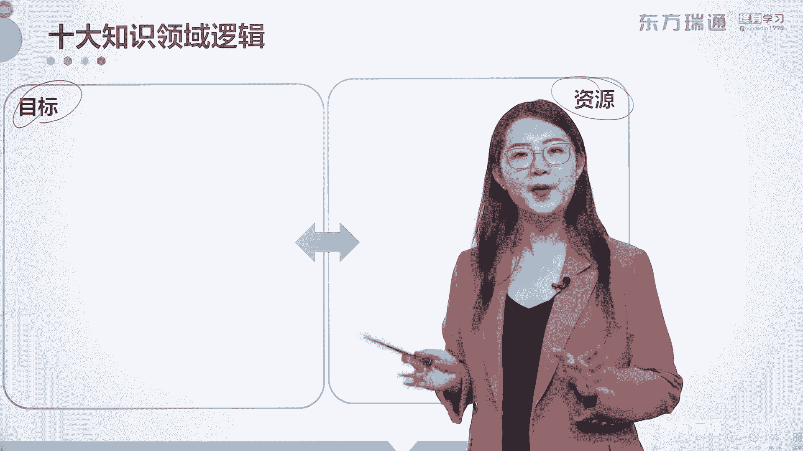

项目目标。

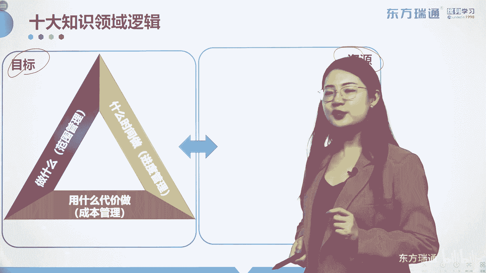

首先你要知道做哪些事儿，这些是范围管理的内容。

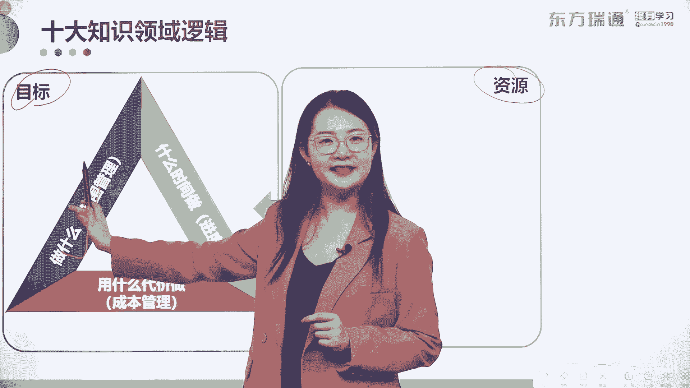

其次你明白了要做的工作之后呢，要知道用多长时间把它完成。

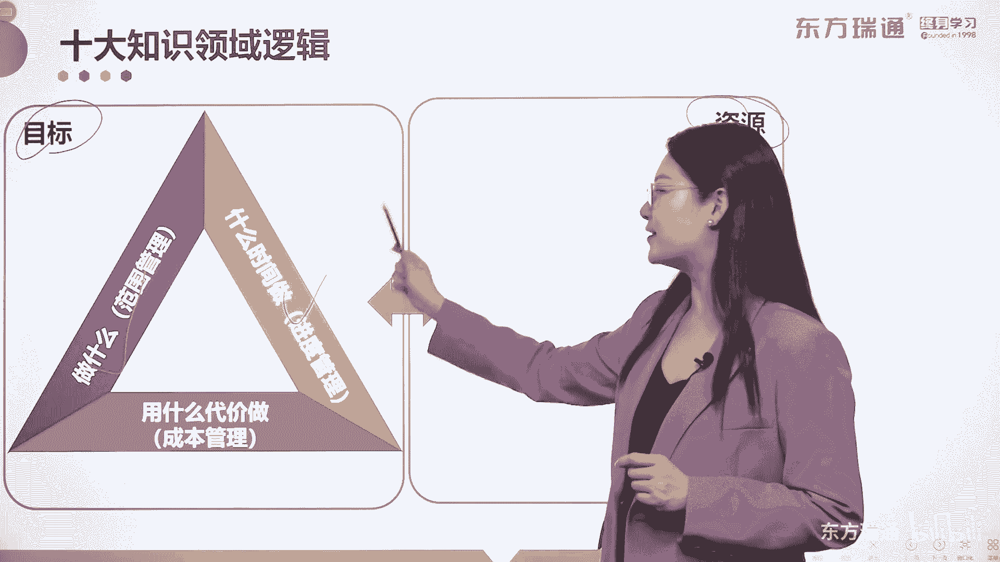

这是进度管理的领域。

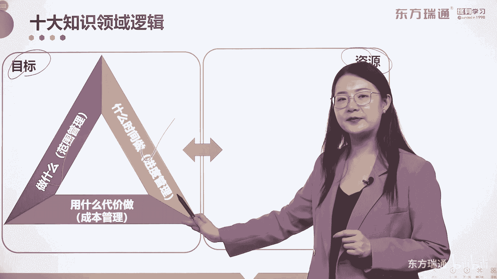

同时你还需要了解花多大代价把这些事情完成。

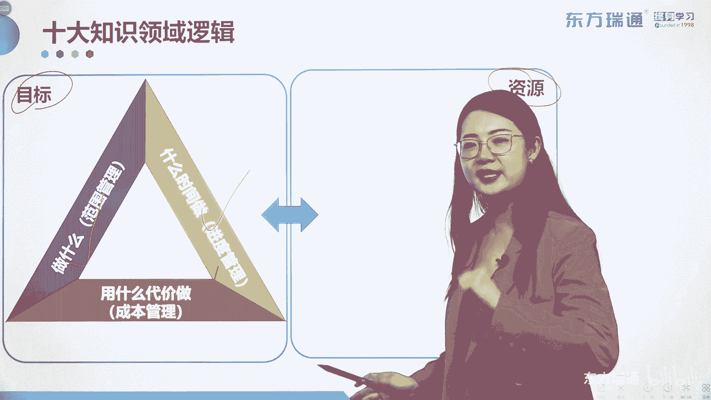

这是成本管理，那最终要实现的是，你要了解这个项目做到何种程度就可以了。

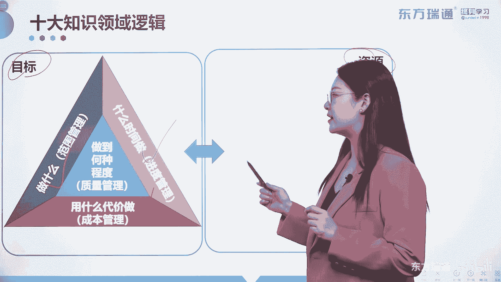

这是质量管理的内容，这张三角形在项目管理的框架中，我们称之为制约三角形，做什么，什么时间做和用多大代价做，这三个边长是相辅相成的概念。

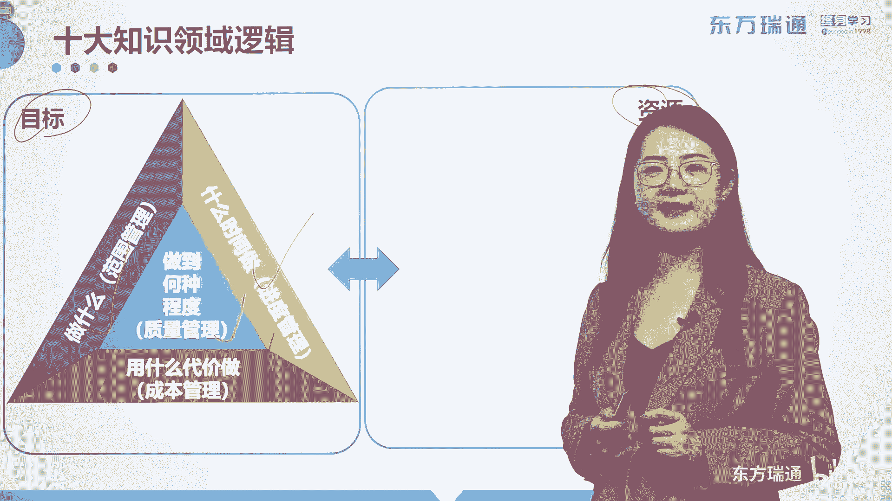

好完成目标，要使用具体的资源，资源呢有两类，你要合理地使用内部资源，我们用资源管理去完成，如果你需要动用外部资源去买，或者说去租赁，那就是采购管理的范畴了，在合理的运用资源的过程中，要进行有效的沟通啊。

这是沟通管理知识环节中需要关注的，沟通的目的是要引导相关方，合理和正确地参与到项目工作中来，这是相关方管理知识领域可以去了解到的，好了解了目标和资源之后，是不是总觉得少了点什么呀。

这个东西我可以理解它是重中之重啊，风险管理，能够对项目产生不确定影响的因素都叫风险，那注意啊，我们不要简单粗暴地理解风险就是那些威胁，就是那些不好的事情发生的可能性对吧。

我们还要尽可能的去识别项目中存在的机会，他也可以给我们项目带来不确定的影响啊，所以遇到机会我们要尽可能的让它发生，但是遇到威胁，要尽可能的怎么样把威胁排除掉项目中去。

那这些都是项目管理的项目风险管理的内容，那如果你的项目经理层次更高一点的话呢，你会化险为夷，转危为安，那这就是更高阶的一种风险管理的手段了，好，那最终把这所有的因素放在一起进行统一管理。

实现全部要素的整合，那这就是整合管理的内容了，项目经理在整个项目管理的过程中，最重要的工作就是整合管理好，那我刚才讲完了这十大知识领域中的所有内容，包括每一个啊知识领域中。

它会对应的哪些几个具体的过程呢，在这张表格中都给各位罗列出来了，这张表格出现在咱们手中的PMBOK，第六版的教材中的25页，啊第25页，我希望各位朋友们在考试之前，能够把这张图熟悉到默写的层次。

但是这个默写呢啊是要循序渐进的默写啊，循序渐进的默写，到最后你要达到一个什么那种层次呢，就是当你哎默写到制定进度计划的时候，你立刻就能考虑到这里面有哪些重要的点啊，重要的点比如说关键路径法在里面啊。

资源优化在里面呀，进度压缩在里面呀，包括了哪些重要知识点，能达到这样的层次，那说明你真的是学透了好不好啊，请大家理解一下，这张表呢是非常重要的，知识框架出现在课本的25页。

我们可以在课本上把这一页呢折一个角，没事儿啊，就翻一翻，对不对。

