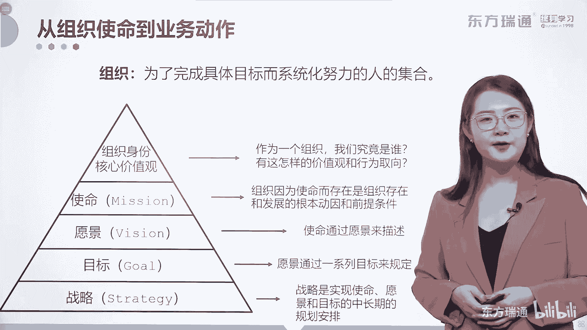
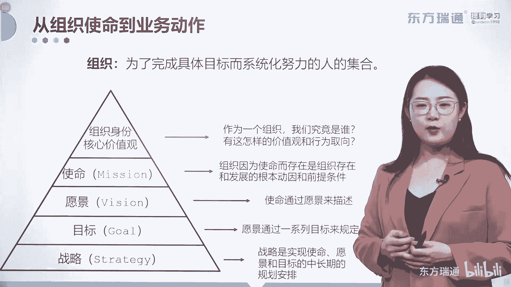
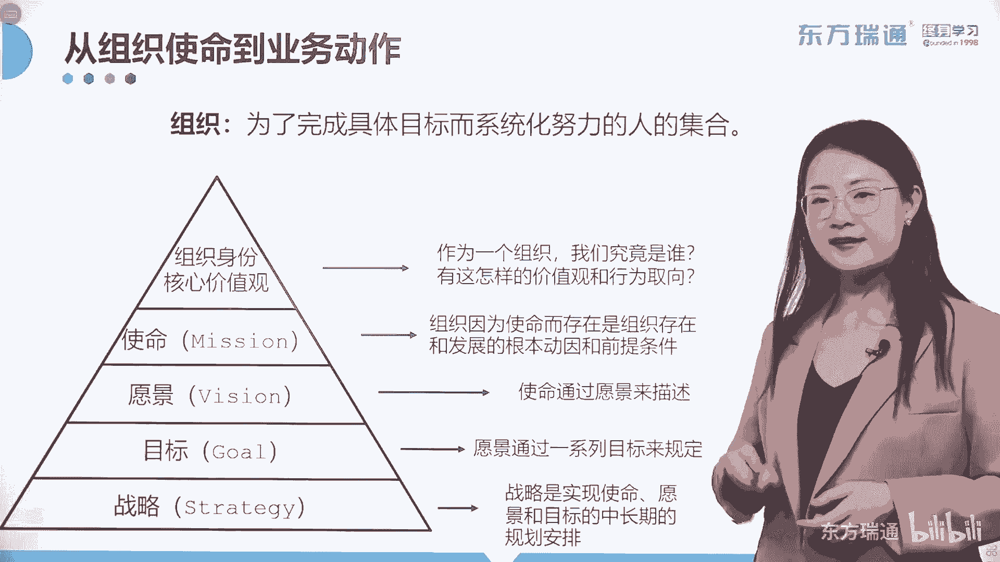
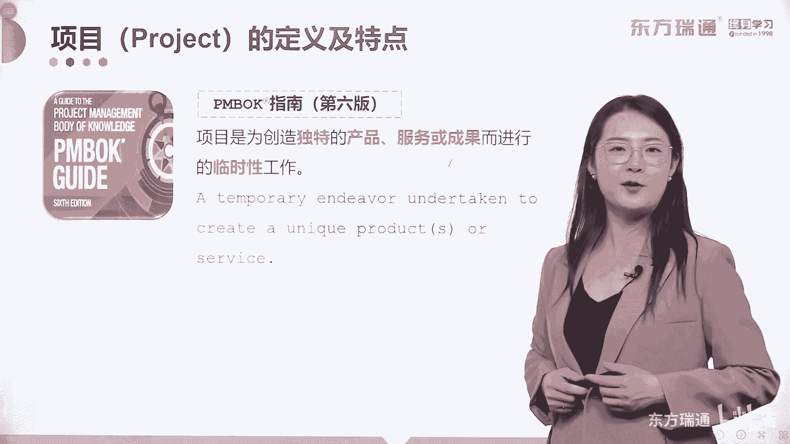

# 少花2000+！PMP项目管理认证全套百集视频课程(更新中) - P5：02项目管理概述-什么是项目 - 东方瑞通 - BV1Bm4y1T76g

朋友们大家好，我们下面呢进行pm book第六版精析课程，第二章的学习，项目管理基础，那这个章节呢涵盖了课本前三章的内容啊，前三章，那这三章呢他考试出题不多，但是考点是很集中的，理解也比较容易。

那么我对大家对于这一章的学习和考试中，做题的要求就是不准出错好，那既然是项目管理的基础，首先我们要了解什么是管理，那借助于管理界大师中的大师，彼得德鲁克的名言，什么是管理呢，管理就是界定企业的使命。

并激励和组织人力资源去完成这个使命，大家在这句话里面抓住关键词了吗，关键词就是使命两个字，界定使命是企业家的任务，而激励和组织人力资源是领导力的范畴，两者的结合就是管理，所以你要理解管理。

那首先呢要从高层级的概念开始，那就是使命。

从组织使命到业务动作，那首先我们来了解组织的概念，组织是指为了完成具体目标而系统化努力的，人的集合，所以组织是一个泛泛的概念，大到一个国家，小到家庭班级。

那这都是集体对吧，那这就是整个的价值观，使命愿景目标战略的一个三角层级，我们来看看他们的上下层关系。

那首先呢一个组织需要明确自己的组织身份。

建立核心价值观，作为一个组织。

我们究竟是谁，有这样的价值观和行为取向。

到底能带给我们什么，建立了组织的核心价值观之后呢。

可以延伸出使命使命。

我认为呢可以用两个字来代替，那就是初心啊，初心组织因为使命而存在。

是组织存在和发展的根本动因和前提条件。

使命和初心有了再生成企业愿景。

那么我们的管理呢是从愿景的层次来进行的啊。

愿景愿景使命要通过愿景来描述。

那什么是愿景呢，一个组织未来的某一个时间段上，或者未来的某一个时间点上。

你要呈现出来一个什么状态，那这个状态就叫做愿景。

就好比说你的公司要在5年之内。

收入达到十个亿，那这就是一个愿景的层级，好愿景由一个又一个的目标组成。

通过一系列的目标来规定和实现。

那最终才达到了战略的成绩。

我认为呢整个管理的链路中，战略是最有意思的一个部分啊。

那战略是什么，它是实现使命愿景跟目标的中长期的规划。

注意啊，这里用的是规划两个字，可不是计划哟。

像咱们国家刚刚颁布的十四五的那叫规划。

不叫计划，规划是一个长期的目标。

而计划呢是一个有始有终的短期目标，那么这个在后期呢，我们会通过学习把规划和计划区分开来。

好那回到我们的战略战术的整个的管理层级，我们现在在学的呢，是传统项目管理和敏捷项目管理，他们呢属于管理界的最基层的一些管理形式，最基层的管理形式，那么项目传统的项目跟敏捷项目，到底是怎么管的。

我们先来了解一下项目的定义以及特点。

项目在我们pm book第六版指南的这个教材中，给出了明确的定义。

他是为了创造独特的产品服务或成果，而进行的临时性工作。

注意啊，我们的讲义里面这里有一些红字，对不对。

这些红字都是未来考试的一个重点，希望大家在学习的过程中关注一下。

那么基于这样的一个定义，这些红字我们会发现项目具备几个特征。

那首先呢项目是独特的，其次项目一定会输出相应的产品服务和成果。

最终项目是一个临时性的工作。

项目要做到有始有终，那我们在这里把项目的几个特性呢。

给大家罗列了下来，那其中定义里面涵盖了临时独特和成果导性，但是项目的同时还要具备渐进明细性，我给大家举一个例子，中国历史上比较有名的一个项目是万里长城，大家了解万里长城的历史吧，万里长城呢始建于西周。

然后到了春秋战国的时期，各个国家修缮各个国家的部分，后来到了秦国，统一了六国之后呢，才把各个国家的长城连接起来，后来到了明代，长城又经历了一次又一次的大修，那么最终通过一次又一次的修缮。

达到了今天呈现到我们面前的这种历史奇观，那么我们来看一下长城这个项目，是不是符合这些内容，首先长城他是一个有始有终的项目，长城最终的项目成果一直屹立在我们眼前，那第二长城是不是独特性的项目呢。

这个所谓的独特性代表长城，这个项目是区别于其他项目的，它自身有独特的部分，第三通过我刚才给大家讲述的长城的历史，就体现了这样的一个成果，它最终是渐进明细出来的，那最后不管历朝历代长城的变化和修缮。

最终的成果，也就是他修缮长城的目的都是不变的，那就叫做抵御外勤，所以修缮这样的一个长城，进行这么一个项目，成果导向性也是非常明显地体现了出来的好，这就是项目的定义和特点，我希望大家呢能够记住它的定义。

