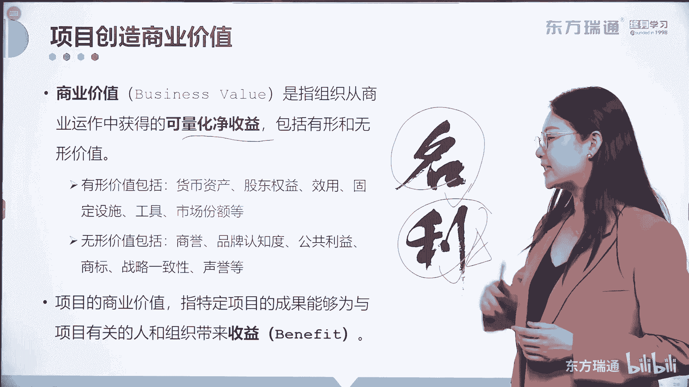

# 少花2000+！PMP项目管理认证全套百集视频课程(更新中) - P8：02项目管理概述-项目管理 - 东方瑞通 - BV1Bm4y1T76g

那项目在组织中到底有什么样的作用呢。

它驱动了组织的变革，我们知道组织啊。

任何组织都是逐利的，对不对，我们来看这张图啊，横轴是时间，纵轴是商业价值。

所有的组织都期望从当前的状态，能够像更高的一个未来状态去过渡。

这是什么，这是实现理想的问题解决。

对不对好，那如何来解决这个差距呢。

开展一个又一个的项目活动来完成好。

这就是我们做项目的一个最终目标，要驱动组织变革，那么在这里呢很多朋友对这个词会有一些疑问。

对不对，什么叫做商业价值啊。

我觉得有必要呢讲商业价值给各位讲一讲啊。

项目其实呢是创造商业价值的，商业价值是指组织从商业运作中获得的。

可量化的净收益，注意啊，这个净收益虽然是可量化的，但是它有两种表现形式。

有形的和无形的，有形价值包括我们能够见到的货币资产。

股东权益效用。

固定设施工具，市场份额等。

而无形的价值呢包括你企业的商誉，建立的品牌认知度。

产生的公共利益，你拥有的商标是否符合战略一致性。

和代表的企业和行业声誉等等，大家发现了吗。

这有两个词，名利名是什么。

名可以理解成就是无形价值的一种体现。

做项目即使你不能产生那些真金白银的收益。

那至少名和利你要把名给占据了吧，这样也是一种商业价值的体现，而立呢有一句话叫做天下熙熙皆为利来。

天下攘攘皆为利往啊。

所以利是大多数企业做项目。

完成项目的一个终极目标，也就是说输出那些有形的价值。

所以大家要了解啊。

商业价值其实有两方面的内容，一种无形的价值可以用名来体现。

一种是有形的价值，要能够展现出来真正的收益。

这叫利好，那这是什么，这是广义的商业价值啊。

那我们做项目的商业价值是什么，项目的商业价值是指特定项目的成果。

能够为项目有关的人和组织带来收益。

带来收益，那这个收益一定也是有形的或者是无形的好。

那么到这里呢，大家已经简单地理解了一些商业价值。

