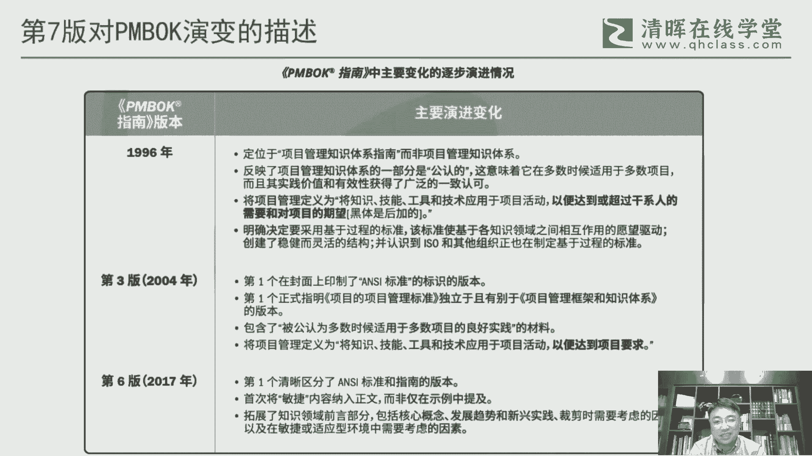
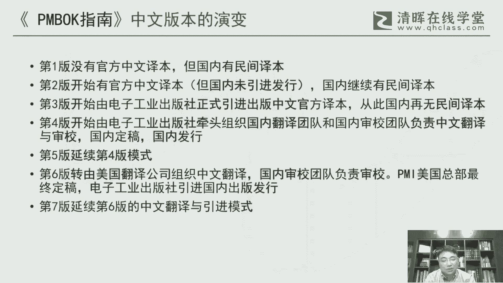

# 干货满满：PMBOK指南的演变 - P1：1.PMBOK指南的演变 - 清晖Amy - BV1vD421M7dD

呃这张图呢是呃PMBOK指南这么多年，从83年开始吧，然后到到今年，它一个整体的一个演变的一个过程，这张图其实在我们的讲义里面也会提到，那么当然里面细节就没展开，其实今天晚上我们我们更多的是对这里面的。

过程中的一些细节做一些做一些这个分享啊，那么从最初的1983年，这个呃PMI他推出他的第一份报告，其实这是构成了整个篇幅的指南的一个，一个前身，一个雏形，这个项目本身来说是1979年立项目的。

所以他也花了4年的时间来做的这个研究，然后最后最后促使这个这个p m book的，一个一个一个一个呈现，因为这个在之前的话，其实项目管理更多的还是在一些怎么说呢，在一些呃。

它并不并并不构成一个标准化的一个东西，或者说并不构成一个系统化的一个知识体系，它更多的会体现在一些具体的一些工具对吧，一些方法把这些在日常中都都零零星星在用的，但是怎么把它整综合成一个整体。

那这个是项目管理协会，这个PMI这个一直在着力在做的一件事情啊，所以这个过程也发的呃，很多年了，现在是算起来也是几十年的一个一个时间呃，之后的话在96年之后就基本上呃，第一版这个指南这个出台之后。

就基本上我们看他的过程，基本上是他保证4年呃，大致来说是4年一更新一个版本的，这么一个频率啊，所以从第一版，第二版，第三版到第四版啊，五版其实我们都看到，他都是以四的这个数字在在递增。

那比较例外的是第六版啊，第六版它中间隔了5年啊，所以他这个打破了过去传统的4年的一个规律，那也足以证明第六版其实还是一个非常呃，工作量非常大的一个版本，最终也从他的一个结果上能体现出。

他每个页数一下子增加了很多啊，这这个工作比较大，那第七版呢，是我们今年的最新发布的一个新版本，那这个版本可以说是整个PMI在过去50年，发展历史中的一次巨大的一个变革性的，一个一个一个一个产物啊。

这个确实值得我们今后的一个关注啊，这个是是我们为我相，这个版本的影响都非常非常大啊，呃第七版呢在他的正文中啊，对这个偏颇的版本的演变，它也是有一呃有一段文字的一个描述啊，我把它做了一个截图啊。

当然这个截图的原因是，我们现在一个呃偏麦的一个呃，严格来说是一个非正式的一个中文版的，一个一个一个一个文字啊，这个文本其实并不是最终的，我们可能将来看到里面，还是有些信息要做些修改。

那这里面大致提了有三个版本啊，96年是第一版啊，这个当然很重要，这个这个任何的事情都第一，第一个版本都是都是非常重要的，那么它这里面会有有对整个PM风格的一个，一个定位，第三版呢也是非常重要。

第三版它这里面特别提到了这个ANCANC标准，ANC呢是美国国家标准化委员会啊，这么一个它的一个缩写，那么有既有的安税标志，意味着在至少在美国，那么这个标准是构成了，就是美国的一个一个共识啊。

当然从安C来说，美国国家标准的话再要进一步到全球，它这里面其实还有个i so的，一个国际标准化组织的一个一个过程啊，所以所以这里面它其实呃也是一个从，从怎么说呢，从协会，然后到国家，然后到全球到SO。

然后这还有这么一个演演化的一个过程呃，第六版呢这个是怎么说呢，在整个我我个人感觉是在偏布的，传统的这个框架里边啊，就是这种五大过程组，十大知识领域，这个这个架构的这个体系下。

应该是一个可以说是一个巅峰的，一个一个一个版本啊，所以某种程度来说也是物极必反，因为第六版已经达到了一个在传统框架上，一个一个一个绝对的一个高峰啊，那你再要超越它，在这几场再做就就有点难度了啊。

所以第七版它相对来说做了一个，颠覆式的一个一个变革，我觉得这个可能某种程度来说，也是也是有他不得已而为之的，这么一个考虑在里面，当然更大的一个背景是因为整个时代变了，就过去的这种基于预测型。

或者说传统的这种瀑布型的这种啊生命周期，或者说这种这种社会环境，其实它已经发生根本性的一个变化，所以我们现在更多的是在一个无卡的时代啊，一个这种变革，一种创新的一种时代，所以在这种环境下里面做项目。

做项目管理，它需要一些新的思路啊，从某种程度来说，也需要站在一个更更更高的角度，所以这也会导致第一七版的一个一个，一个一个出现啊。

好那我们具体看一下这个呃，中文版的一个呃一个演变了，其实前面讲的是英文版的，一个一个一个一个一个发展脉络啊，中文版的这里面呃，因为我们在中国嘛，在中国大陆啊，所以我们从学习角度来说呃，虽然英文版这个对。

当，对某些对很多这个英英文好的，这个同学或者朋友来说，他不是问题，但是绝大部分来说，我们还是习惯用自己本土语言母语啊，来进行这个学习啊，所以这个中文版对我们来，对我们国内的这个项目管理从业者。

学习者就至关重要啊，尤其包括我们像PP考试，因为这个我们都是用中文来考嘛，所以这个就就更加重要呃，PMBOK指南第96年第一版，它身上是没有中文的译本啊，那国内呢它有那个民间的译本，那民间的译本。

这个就他没有正式的这种出版发行啊，所以仅限于在一些一些民间的一些使用啊，所以影响力是比较有限的，呃第二版呢，在呃在美国它有这个叫官方的中文译本啊，美国他有这个译本，但这个译本呢他没有引进到国内。

所以在国内市场是没有发行，那同时呢，但是国内呢它也有相应的一些自己的，民间的一些译本啊，因为既然没有没有把美国的那个引进来，那就自己翻译的啊，也有些从业者与爱好者啊，包括一些培训机构也会来做这件事情呃。

第三版就04年的这个版本啊，是电子工业出版社是正式引进的啊，这是中国的出版社，第一次引进PMI的这个这个标准啊，然后他有了这个中文的这个有官方的译本，那从此之后呢，就再也没有说民间的译本来做这件事情啊。

这个你们做做了也没用，因我们肯定是以这个官方的这个正式的这个，出版物为准的啊，所以从第三章开始的话，就就全部是由偏卖这个来主导，这个这个这个中文的这个版本啊，呃第四版呢是是我们第三版。

它实际上是在美国翻译的啊，第四版的实际上是是由电子设通啊，组织这个中国的这个专家，中国的这个翻译和省教团队，来做中文的一个翻译神教啊，然后在国内定岗，国内发行啊，所以第四版是一个比较原汁原味。

或者说土生土长的，我们国内的一个一个翻译的一个版本啊，也是一个非常质质量相当不错的一个版本呃，第五版呢是延续了第四版的一个模式啊，所以在第五版和第四版之间，几乎是没有什么切换的啊。

就基本上它是沿用了这个第四版的，基本上它的主要的这种术语，因为我们看一个版本，它的一个变化的一个差异度，其实从文字角度来说不太容易去，就句子角度来说不太容易看出大事，但是术语是很能很明显。

能看出他的一些一些一些版本的变化，版本的这个这个表达不同啊，这所以这个术语是一个，我们去识别一个版本演变的，我觉得是一个关键的一个因素啊，然后第六版呢，这个是是是做了一个比较大的一个变化。

那这个变化在哪里，在又回到美国总部了啊，他把这个翻译权他又收回去的啊，因为前两版都是在国内来做，所以第六版他把这个收回去收回去，当时他有一个触发因素，是他想做一个叫全球统一时间来发布。

所以它是全球多语种，什么英语，法语，中文啊，日语啊，这种这种主西班牙语这种主要的这种语种，他想同一时间来发布，所以他这样的话，他就是上是通过翻译公司这个来来做，把它作为一个翻译项目来做啊。

那国内的只负责这个省教，所以这这一块的整个第六版，当然后后面我们回回过头来看，还是还是有不少问题的啊，但这个也跟这个很大程度上来说，是跟他这个这个这个翻译的模式啊，发生变化是有关系。

然后第七版其实还是延续了第六版的这种模式，也是美国翻译，然后中中国中国负责这个省教哈，所以所所所以是这么一个一个模式，那因为我自己是呃，比较有幸能进入到这个社交团队里面。

所以所以经历了这个整个他的一个一个过程吧。

