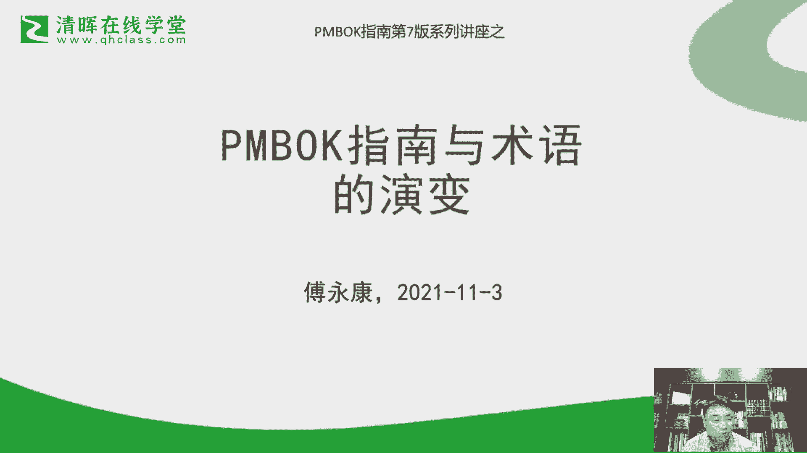
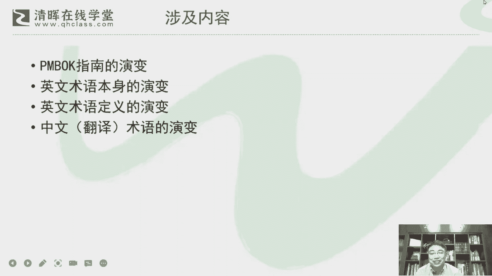

# 干货满满：PMBOK指南的演变 - P2：2.前言 - 清晖Amy - BV1vD421M7dD

非常荣幸啊，等我有机会，今天晚上跟大家做一个关于P播客指南的一个，一个分享交流，那实际上这个交流呢，我想可能是在是广金辉这个，可能未来一系列的一个讲座的这个这个，一个一个一个序幕吧，啊因为因为这这两年。

其实PMBOK指南第七版是我们呃，国内，包括我们勤奋的同学也都非常关注的一个，比较热点的一个话题啊，那关于这一块的这个这个分享啊交流啊，因为之前啊相对来说呃，更多是在一些线下场合啊。

可能这种线上的场合交流的也不是太多，或者说在一些小范围的一些场合做的，去做一些交流，那今天呢这这里比较荣幸啊，有机会收这个，我们请问在线学堂的一个邀请，来做这么一次分享，那分享的主题呢。

我想还是从这个篇幅和指南和术语，的一个演变来切入吧，因为当那个后面的一系列的，我们可能会从一些更多的一些角度来来切入，那今天呢主要是回顾一下历史，展望一下未来吧，然后所以从这个演变的这个角度来做一下。

做下这个分享啊，呃今天的分享呢涉及的内容，我想主要有几大块啊，一个是啊PMBOK指南本身的一个演变啊，因为PMBOK指南这么多年，他经过了很多的版本的一个变化，那我们现在是第七版。

那它一定是有从他最初的一个源头啊，从第一版开始到第七版这个全过程，我们做一个回顾和回顾啊，另外一块呢是关于术语，那为什么特别提到术语的这个这个内容，因为因为正好我自己也在做这个叫PMBOK的。

一个中文的一个省教，那其实省教的一个核心除了技术通顺之外，很很非常非常关键的一点，就对这个项目管理的一些术语的，它的一个一个一个一个精确表达啊，这里面其实其实还是非常非常有讲究的啊。

所以今天的讲座也基本上会围绕这两个主题，指南和术语本身来做一个演变，那术语本身呢其实它也涉到几个方面，一个是呃英语本身啊，因为我们呃国内的这个项目管理，其实究竟从他的一个渊源来说，基本上都是从西方引进。

所以无论是欧洲还是美国啊，就这些西方国家，他在这个项目管理的一个发源，或者原创的这个角度来说，他们怎么去表述这个术语，他们术语本身的一个变化，其实这个也是值得我们去关注的一个话题，那么除了术语本身。

还有术语的一个定义，因为随着这个是时间的一个发展，其实很多概念的对它的理解，其实我们也会发生一些变化，所以呢就围绕这块也会做一些展开呃，另外一个比较核心的就是中文术语的一个演变，因为中文术语实上是是。

我们把把这个英文的术语怎么翻译成，翻译到中国啊，做一个本土本土化的这么一个一个引进，那在这种情况下，我们对术语的一个使用，其实它也会会有他的一些发展的一些变化啊，所以今天这个分享的。

也跟大家做一下这个交流吧，其实今天这个分享呢，呃在我看来其实还是怎么说呢，它是带给学术性质的啊，所以不是一个我觉得并不是一个特别轻松啊，这个这个或者说活泼的一个话题，其实还是会会需要我们去可能去关注。

或者说去关注一些呃一些演变的一些细节啊，其实这个方面的话，我觉得大家如果感兴趣啊，我觉得今天的这个来来来来听这个分享，我觉得肯定大家对这个项目管理，肯定是非常有他的一个有一定的钻研精神啊。

否则的话我想这个话题可能也并不是，会让所有人都都感到这个感到怎么说呢。

