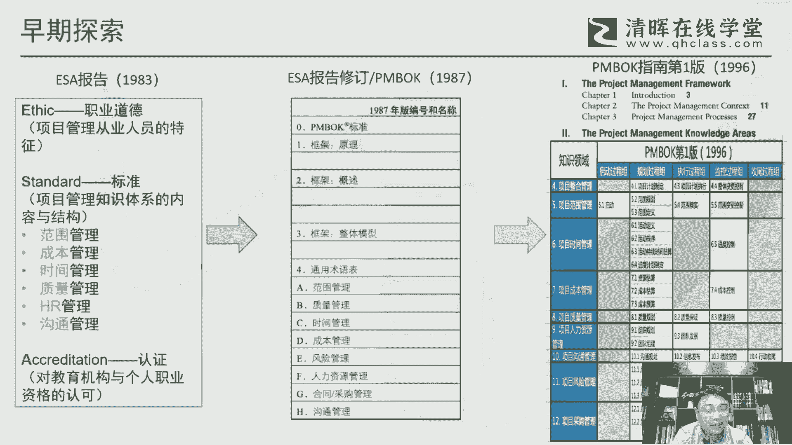
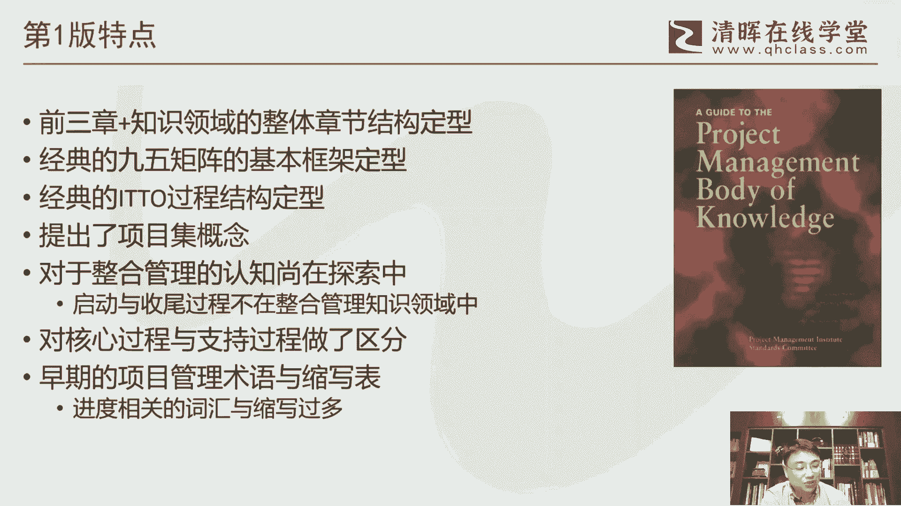

# 干货满满：PMBOK指南的演变 - P3：3.PMBOK指南第一版 - 清晖Amy - BV1vD421M7dD

呃我们来看一下这个呃PMBOK早期的一个版本，我们前面也说了，这个79年PMI是内部来立项来做，要要探索，要做这个标准，那这个最后的结果是在83年，他以一个叫EC报告的形式啊。

这个是发表在他当时那个他的一个内部的一个，项目管理的一个期刊这个这个上面啊，然后是以这个方式来作为这个工作的一个，一个一个成果来展现，那这里面ESA，它其实是三个字母的一个手写啊，职业道德啊或者伦理啊。

esic standard标准，还有这个呃accord edictation啊，这个认证，那么这里面其实呃对应了，我们现在回过头来看的就也是几块内容，职业道德我们会有偏旁。

会有职业道德行为规范这么一块内容啊，其实对应的是一这个这一块，那PNP的认证与考试呢实际上是对应的，A就是他这个对整个教育啊，对这种这种资格的一种认证啊，但这个是通过考试来来来来证明的啊。

所以这一块呢它是有对偏，实际上是也开启了PNP认证的，这么一个一个先河，PM第一章的PNP证书，是1984年发出来的啊，实际上也是在这个报告之后，他就开启了他整个这个PMP认证的这么一个。

一个非常重要的一个试验啊，那标准部分呢是我们比较关注的内容，是当它是构成了我们现在的PMBO的呃，这一块的这个最初的一个一个一个架构，最初架构它其实没有十大之比，最早的其实呃说起来只有六六块啊。

范围这个成本时间质量还加R，还有人力资源和这个沟通，实际上是六大知识领域，这是构成了这个啊，PMBOK的应该是最早的一个一个架构，那这个架构呢也并不完美，所以后面要继续的给它进行修订啊，进行进行完善。

所以在1987年的时候，他做了出出台了一个修订的一个报告啊，他最最初这个报告他是以这个名字叫PMBOK，这个来来命名，但这个是命名，其实回过头来看他是有问题的啊，因为PMBOK它作为一个知识体系。

它应该是更大更非常大的，真正能够呈现出来的其实是它的一些精华部分，或者说提炼出来，用文字，或者说这种能够显性知识能够展现出来的，所以他最终命名，实际上是一篇部分指南来做命名。

但我们有时候日常或者说口头上，其实有时候呃，并没有完全去严格区分这个偏颇和偏颇，指南，其实其实目前来说，我们平常交流的时候是这两个字，其实是可以相通的，但在严格意义上的这种这种场合。

其实我们还是要用把要把它区分开，指南就是指南篇，不论它是一个更更大的一个体系啊，那在87年的这个修订报告里面呢，其实我们看他的基本的雏形啊，我觉得就已经开始有了，包括这个前面三章啊。

对这个对这个整个这个框架啊，或者说这个项目管理环境的一个描述，还有后面的这个，当然他那时候还是以ABCDE这一块，他然后列了八个八个这个知识领域啊，实际上这八个知识领域对呃，最早八三版的他也做扩充。

比如说他把合同啊，这个采购加进来，还有一块是风险管理啊，加进来啊，这样的话构成了最初的一个呃偏颇和指南，这个最初的一个雏形吧哈呃再过了10年啊，就这个雏形也也是不够完美的啊。

但是这里面他需要把它标准化的话，他其实这里面也是也是需要怎么说呢，不不是这么简单的一件事情，很多时候他是要经过不断的去研讨，不断的去去去讨论啊，然后也要拯救这个从业者，很多这个业界的一些一些声音。

所以他最终是在96年的时候，是第一次是以这个叫PMBOK指南，这个这这个书名啊，来来把他这个这个这个怎么说呢，项目管理的一个最初的一个版本啊，标准的一个版本给它给它定性下去。

那么这块内容呢我们看右边可以看得出来，就是它实际上是也是由两大部分来组成啊，因一块呢它叫项目管理的框架啊，这里面就包括一些这个引论啊，包括这个项目管理的环境啊，包括这个这个项目的管理的过程过程组啊。

那这三章呢其实是我觉得是一个很经典的一个，一个一个一个结构，其实我们现在到第六版，其实我们基本延续了，大体是延续了这个这个架构的啊，就前面三章，然后再加后面的，从第四章开始，整个这个叫知知识领域。

当然一开始的时候我们是九大知识领域啊，九大知识领域，然后五大过程组啊，然后这里面对应了很多的这个这个这个过程啊，当然每个过程，每个版本的过程数量呢其实都是不等的啊，从30几个到40几个。

基本上是在这这个三四十之间，这个在在不停的呃不停的在波动啊，不停的在波动，那么这里面最早的这个版本呢，其实第一版我们来看呢，它是很有意思的一个版本，比如说他的这个启动啊，收尾啊。

这这个它并不在这个整合管理里面，这就意味着什么，意味着早期大家对整合管理的这个认识，我觉得还是不足的啊，还是不足的，还是处在一个一个尝试，怎么说呢，在一个探索的一个阶段啊，那么范围核实啊。

就是在我们这个我们后现在的这个叫确认范围，这个过程，所以他并不在这个监控过程组里面，而而是在执行过程组里面啊，这个也是一个跟后面版本很不一样的一个地方，这个这个也是很有意思的地方啊。

收尾呢并不在这个这个，而是在沟通，还有结构采购啊，在在这里边啊，所以这个是他是当时这个版本，我觉得它跟后后续版本蛮不一样的，一些一些比较关键的几个地方啊，这个大家可以留意一下。

那第一版呢我觉得总体来说啊，就是呃它的第一呢，它的整个这个PMBOK指南的一个经典结构啊，章节结构它是已经定型了前三章价值领域啊，然后呢，这个非常经典的这个叫九五矩阵的，这个框架基本定型了。

就是五大过程组织啊，知识领域啊，当然后面九变成十啊，这个他做了一下扩展，然后最经典的ITTO的这个过程，这个结构也定型了，因为PMBOK我觉得跟有别于这个这个呃，呃世界上这个所有的其他的项目管理标准。

不一样的地方是什么，就是它是由由ITTO来构构成的啊，这是在传统的这个偏部，本应该说非常非常精华的一块的，它通过ITTO能够像某种程度来说，手把手的来指明了输这个过程应该怎么来做。

你输入要考虑哪些工具和技术，要考虑哪些，它的最后产生的输出是哪些啊，这样的一看非常简洁明了，也某种程度来说，这也是一个非常非常具有典型的工科思维的，理，工科思维的这么一个一个一个一个一个。

把管理的这种很抽象的，可能某种程度来说偏人文，偏这种这种这种这种离散化的一些概念，然后最后他通过这种IPTO的方式，把它整合在一起啊，变成一个非常有结构化，非常有流程化的一个一个一一套知识啊。

我觉得这个应该是偏麦呃，在管理领域里面做了一个非常大的一个贡献啊，这个这个是是是别人很难去超越的，这个他的一个一个一个经典的一个架构呃，然后在第第一版里面，他也是第一次提出了项目集的概念。

其实项目和项目集，在以前过去其实分的不是太清楚啊，很多时候项目和项目它是混用的，和和项目其实混用的，但在第一版的时候，他正式的把项目集合和项目的这个概念，做了下分离啊，做了下分离。

当然也为这个今后这个这个项目集，管理标准的出台也打下了一个铺垫啊，呃另外一块就是整合管理的这个还在探索中啊，所以这个这个跟我们现在看到的，它应该是从启动到收尾，然后总结PDCA。

这这个完整的一个整合的概念，其实在最初的时候其实并没有形成呃，第一版还有一个比较大的一个特色啊，就是现在我们可能看不到，就说他在这个这个过程啊，就知信领域里面它有很多过程，而这些过程他其实做了一下。

叫核心过程和和所谓的这个，支持或者辅助过程啊，做了一些人为做了下区分，呃，当然这个呢其实对我们学习来说，其实还是挺有帮助的，但是但是但是对整个这个过程的这个这个呃，怎么说呢，他的轻重。

或者说他的他的这个重要性与非重要性，这里面就人为做区分，其实有些不公平的，所以后后来的版本就把这个概念给它，给它取消掉了，另外我们可以关注一下他的一个术语啊，就是早期的其实第一版里面相当于是PMI。

第一次就是完整的把他的这个认为比较重要的，一些项目管理术语给他做了一下，怎么说呢，也是写进了这个标准里面，但这里面我们明显会看到，他的跟进度相关的术语实在是太多了啊。

就这个这个其实是有点有有有有点有点太多了，这个所以后后面的版本我们其实可以看到，他陆陆续续也也砍掉了很多，跟进度相关的一些词汇啊，是因为慢慢的把很多其他的这些，尤其是偏软性的一些这个术语。

给它给它加了进来。

呃，从最早第一版的这个呃这个偏颇和指南，其实他还是会提到，就说呃他的一些引用或者一些出处的一些书啊，那这那那我我我先这个回过头来看，可以看就是这个PMBOK指南，其实并不是项目管理的最早的。

原创的这个这个地方啊，其实其实这个领域里面，其实本身已经是有一些著作啊，比如说最典型的像那个哈科兹纳的这个这个，他这本经典的项目管理这本书，它其实最早的第一版是79年啊，79年。

那那比这个别部的这个这个ESA都要找，其实实际上这种经典的书，它事实上他会对整个指南的这个内容，它会产生影响啊，呃在那个第一版里面，他明确的提了引用了两本书啊，一个是额罗德尼特纳的这这本书啊。

这个项目管理这个手册，那这个那特纳他是英国人啊，那他他的这个这个很多的这个思想，其实还是代表了欧洲的一些管理的思想啊，特大也也曾经来我们清辉办公室做过交流啊，也也是做了一个非常小范围的一个小交流。

也是也是挺有意思的，那还有一位是这个克莱兰啊，克大卫克莱兰呢，可以说是偏麦一个非常有影响力的一个学者啊，所以偏麦的他这个有个最重要的叫学术，或者说文献奖啊，就是写书籍的这种著作奖。

他是以克莱莱这个字来命名的，然后呃他的这本书呢现在就最新的版本了，当然这个说是最新的版本，其实也是很多年前也将近10年前啊，89年前这个出版的这本书里，也是在我们现在目前的偏僻考纲里边。

就最新考纲里面他会呃借鉴参考十本书嘛，当然这个柯震纳这本书肯定是在的，然后其中有一本也是他的这本，就中间这那这本书呢，因为正好也是呃电子社委托我们清辉在翻译啊，所以这个应该是明年上半年。

应该能看到这本书的这个第三版的，一个中文版的一个处境啊。

