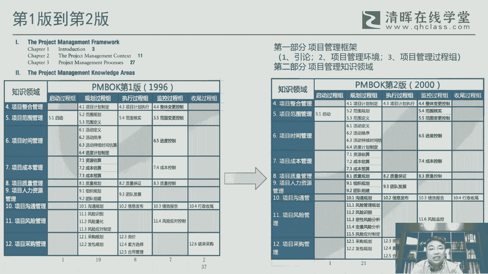
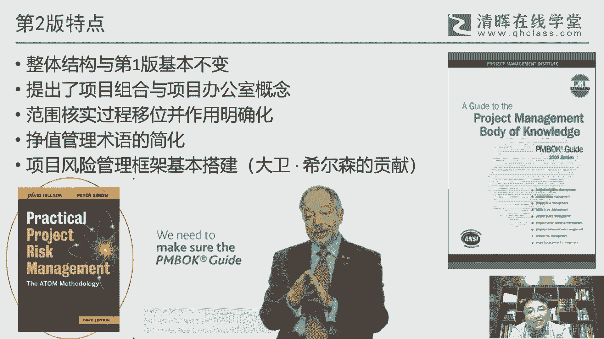
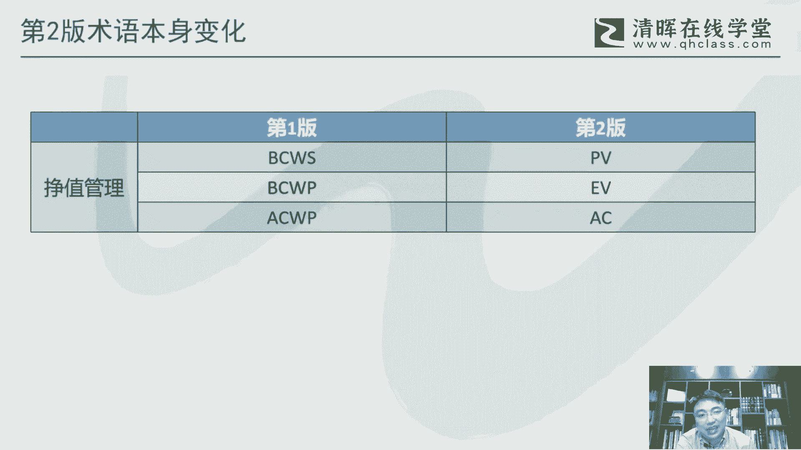
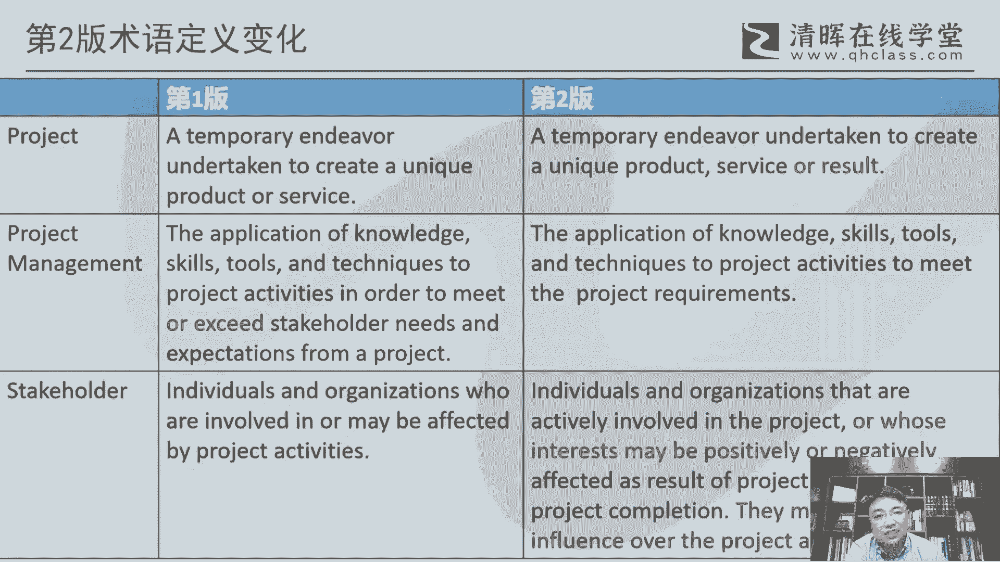

# 干货满满：PMBOK指南的演变 - P4：4.PMBOK指南第二版 - 清晖Amy - BV1vD421M7dD

呃从这个第一版到第二版，我们来看一下，就是呃为了这个对比起见，我都是以这种表格的方式啊，因为每一个版本的这个内容，其实从他的这个15矩阵或者九五矩阵，这个这个表里面，我们基本上能看出它的一个一个内容。

里面的工具的细节，我们就不不展开，但是整个过程的这个对比，还是看的是一目了然的啊，一目了然，那么从第一版到第二版啊，因为第二版已经开始有那个官方的正式的，这个官方的这个这个中文译本啊。

所以我们其实可以用中文来来表述，那这里面我们来看前面也说了，这这个它一个比较大的一个变化，就是那个一个是合适范围的一个变化，就是就是之前我们清辉的那个讲义里，我不知道大家有没有注意这个细节啊。

其实核实范围，严格来说，或者确认范围应该是在这个叫叫控制范围之后，其实我们把它做了一下顺序调，那为什么它在PMBOK里面，一直是把它放在前面的，其实放在前面，它是有它的历史的一个渊源的。

因为最早的古典是就个核实范围，所以他在当初的这个版本变化的时候，他其实并没有调这个顺序，但是它是调的它的位置啊，所以所以这个核实范围，或者说后后来的确认范围，他就从历史上一直。

他就是在这个控制范围的这个这个前面，所以他后面也有也就一直没调，但实际上从我们学习角度来说，应该还是要先控制范围到最后，因为合适范围，它实际上强调是最后的一个演出啊。

所以逻辑上来说其实应该是放在最后的啊，所以我们实际上是做了下这个处理呃，还有一块呢早期版本里面，我们看他那个团队这一块啊，作为团队这一块呢，它其实也没有体现在这个监控过程中。

我觉得这个呢其实是一直是偏卖，其实还是比较注重一个以人为本的一个，一个考虑啊，所以这个把人放到这个监控过程组里面，其实一直坦率说不是偏卖的，特别倡导的一个一个概念，所以后面其实也也会发生一些相应的一些。

一些调整啊，发生一些相应的调整呃。

除了这个之外的话，其实呃大的结构来说呢，跟这个第一版其实基本上没有太大变化，呃但是从内容来说呢，其中有有两个概念，我觉得还是非常重要的，这个也是影响我们后面整个PMI的一个，未来发展的一个一个内容。

一个是项目组合，那从组织最高决策层的这个角度来说，他把这个项目组合纳入到项目管理，这这个概念范围之内，台办的是项目办公室，其实这个项目办公室叫PO，实际上是PMO，项目管理办公室的一个一个前身啊。

所以所以在这个第二版或者第三版之后，这个项目管理办公室开始开始，在全球开始低估性钱啊，其实最早也是从这个通过这个店铺的一个推广，那这个核实范围这个位置他做了一个移位啊。

确实来说这个实际上是也是也是考虑是对的啊，就核实范围，这个其实它实际上它实际上是一个项目的，最终的相当于是一种外部验收的，一起到这个作用啊，当然他应该是放到，放到最后的检查这一块里面呃。

然后第二版呢在术语方面，我觉得有个很大的一个变化，就是就是政治管理，它把它做下简化处理，这个呢原来的政治管理的术语，实际上是比较复杂的，四个字母，这个一般人看着都晕的啊，这个这个会比较难。

这个这个这个难以理解呃，另外一个呢就是项目风险管理，这个在这一版里面，就是基本上这个框架搭建管理啊，在第一版的风险管理，其实呃，呃在我看来就就就其实是不是不是很科学的啊，就风险论它是有这个概念。

但整个整个框架呢其实是有些问题的啊，那么这一块呢呃那个double先生啊，就是这位呃后来的第六版的副主编，在当时他是第二版加入到这个辩论，我觉得他一个很大的一个贡献，就是就把这个风险管理整个条理化了。

所以我们现在看到的这个风险管理，基本上跟他的他的著作啊，这本书其实是比较比较接近的啊，那这本书的我们呃，也是我们清辉最近在做的翻译，这个已经截稿了，然后应该是近期这个这个也会出版发行。

大家感兴趣可以关注一下啊，就是叫它叫实用的这个呃叫基，它是怎么说呢，叫叫项目风险管理啊，这这个时候呢它里面有个方法论，叫积极的这个呃机会以威胁管理这个方法论，这这里面的其实还是我觉得在风险管理来来说。

应该是一个比较写的，相对来说非常非常完整的这么一本书啊，整个第六版的风险管理，就完全，我觉得跟这个跟这本书其实是是比较接近的。

呃第二版的前面也说了这个术语的一个变化，那么这个这个呢确实因为在PMBOK里面，术语本身去发生变化情况其实并不多，应该说非常非常少见啊，但是也有啊这个比较例外的，就有的就是这个这个政治管理的这个术语啊。

所以这里面BCWC啊，还有BCWPACWP啊，这个这个其其实也可以考一下大家，如果如果大家能回答，可以在那个这个这个对话框里面回答一下啊，就它到底代表什么意思，它的全称是什么啊。

其实很多人其实其实看到这个都都很懵的啊，那第二版我觉得最大的一个好处，就是把它把它简化了，那直接就TV啊，计划价是1V，这个正值AC这个这个是实际成本，这样的话一下子就把这至少正值这个几个。

这个概念就容易来记，否则这么长的这个这个数，这个几个字母堆在一起，这个一看就有点晕的啊，所以这个我觉得是在术语方面，他做了一个很大的一个优化。

呃，另外一块呢我们看他这个里面，一些关键术语的一些定义的一个变化，呃，其实定义变化呢，是是整个PMBO的这个发展过程中，呃，我觉得是在一直在做的一件事情啊，就是很多的术语的他的内容对他的理解呃。

对他的理解其实他是需要需要，我觉得是需要经得起时间考验的啊，就是有些表述到底合理还是不合理，他也是通过每4年的这种这个这个这个更新啊，来来把它做一些优化，比如说像项目本身，项目这里面，早期的这个。

他项目对象是什么独特的产品或者服务，他并没有这个result，并没有接过这个啊，那第二版就把这个result加起来，那这个加起来之后，其实一直是延续到现在，就是至少他把这个项目的对象啊做了一个。

做了一个更加完善的处理，还包括项目管理，项目管理，这里面它也有个理念，叫达到或者超过干性能的需这个这个需要，那这个超过超出这个干性的需要，其实这个从对这个项目管理的理解，其实这个就有问题了。

因为因为超出的话某种程度来说叫镀金对吧，那在项目管理里面，其实我们是反对镀金的啊，所以在第二版的时候，你就把这个标红的这个给他拉掉了啊，所以所以说就就是当还是以能达到这个这个呃，干性能的需要。

其实就OK了，并不需要去超出啊，那超出的话，那你这里面相对来说，需要有背后一个额外的代价在里面，但是并并不是说这个这个超速之后，你觉得能够获得怎么说呢，这个这个从项目的这个本身来说。

你就获得获得更大的成功，其实并不是这么来衡量的，呃另外一个比较比较典型的，像这个stakeholder这个词，干系人这个这个术语，这个他说是是在在这个整个偏颇的版本里面。

我觉得是是一个非常非常重要的一个词啊，所以它的定义也是不断的在变化，其实一直在变，那之所以一个词会引发这么多变化，是因为大家对他的理解，其实是是叫与时俱进的啊，事实上是有很多东西。

他是需要去去更好的去加以理解啊，所以怎么去更精确的去描述这个词，然后所以他在不同的版本里面，不都是都会不断的去优化它啊，所以像stakeholder，他就很明显第一版第二版的他做了一些优化。

就回回回头我们看第三版，第四版，第五版啊，其实不断的在给他做一个优化，那其实能够享受这种待遇的词，其实也没几个的啊，算起来STAKEHOLD算是算是独一无二的一个词啊，就是他在每个版本里面。

他都享受一个对他的不同的一个呃，这个这个这个理解上的一个定义的一个完善啊，说明这个词是一个是一个高度。

