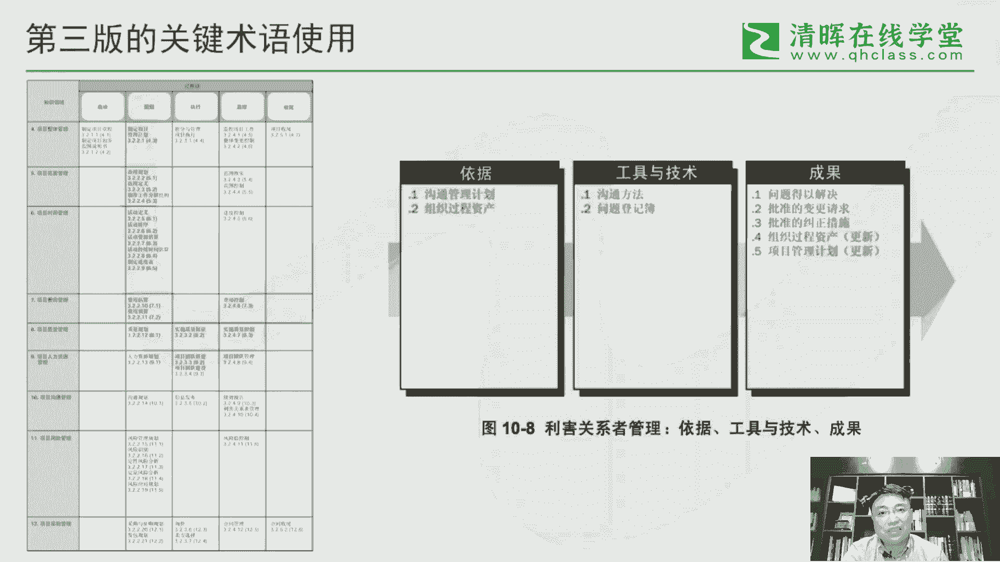
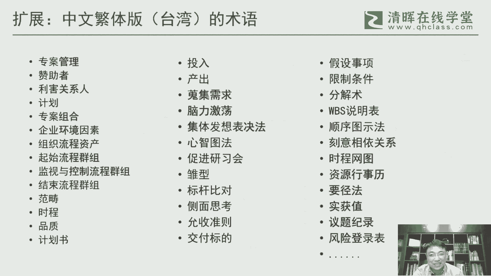

# 干货满满：PMBOK指南的演变 - P5：5.PMBOK指南第三版 - 清晖Amy - BV1vD421M7dD

呃从第二版到第三版呢，我们来看一下它的这个这个整个呃整个结构，那么这里面呢也注意一下，我这个第二版呢，其实它大体来说是分成两部分的，但是到第三版的时候，他已经把它拆，这个还是分成三部分。

其实前面还是三章，但这三章里面它实际上是用了不同的这个，这个这个归类的啊，这个归类的啊，所以这是一个很大的一个一个一个一个，结构上的一个调整，还有一块呢很重要的点。

就是第三版就是真正的把这个整整合管理啊，整合管理这个这个给它完善起来啊，因为第三版它这里面右边这个我们用的是那个，对着第三版中文版的这个原词在用啊，呃这里面呢就就引发了另外一个问题。

就是第三版的术语的一个使用的问题啊，其实第三版的术语使用，其实跟我们现在的这个习惯其实很不一样，那为什么很不一样，这个回答我我我说明一下啊，那这里面的第三版也有个很大一块。

它把这个整个这个叫监控过程组给它完善起来，给它充实了啊，原来的这个之前的版本的监控过程有两个空空，这个空白点啊，一个是这个人力资源，还有一个是采购，它没有没有这个监控的这个过程中，这个从逻辑上来说。

因为整个管理来说，我们强调的还是PDCA对吧，那C这个部分肯定是不能空缺的，不能或缺的，所以这个事情还是要给它完善起来啊，所以所以在第三版的时候，我觉得他在整个管理体系的一个结构化的，一个一个架构里的。

应该是做的是非常非常不错的啊，呃这里面我们来看一下啊，就说整个前前面说从两大部分变成三大部分，尤其是把那个叫项目管理过程组，五大过程组给它单列出来，那这个单列它实际上是把它作为换了一个名称。

叫项目管理标准啊，这个它是以项目管理标准的这个行，这个名义来单列，所以这个里面就有时候又特别特别容易搞混的，一个概念，就是说指南和标准到底什么关系啊，其实这一块的坦诚说。

早期的偏颇跟本身也也没有很好的去界定，这二者之间的关系，这里面就是有些有些东西也是蛮模糊的，蛮模糊的呃，非常模糊化在在处理这个事情啊，呃第三版呢有一块呢叫项目经理能力，这一块的一个一个一个描述啊。

这个呢实际上是也构成了叫我们后面人才三角，这种项目经理，这个，这个能力模型的一个最初的一个一个一个原型，然后其实从它的一个内容来说呢，我觉得也还是相当不错的啊，其实其实呃这一块呢。

还是哪怕我们现在回过头来看，其实也并不是完全过时啊，它很多东西它还是涉及到比如说技术能力啊，比如说沟通这个这个软技能的能力，还有包括这个行业啊，包括这些这些这些能力，其实这个这个构成的某种程度来说。

他对对那个叫PMCDF，就后面PMI会推出一个项目，项目经理能力模型，专门的一个标志能力模型框架啊，其实就是对它形成了一个基础呃，然后第三版呢我觉得还有一个很重要的，就就正式提出PO就项目管理办公室呃。

04年第三版推出来之后，我们会发现，就其实世界上绝大部分公司的PMO，实际上是呃，包括中国的很多公司的PM，基本上是从04年开始啊，来包括最早的像中国的，像华为啊，他就04年开始开始建天幕。

那这个呢很大一块，他也是树这个PMBOK的一个一个一个影响的啊，所以PMBOK对全世界的这个项目管理的，他发的绝对是一个风向标的一个作用，呃，另外一块呢是对这个整合管理，前面也说了，原来的前两个版本。

他对整个管理就一头一尾，它它这个这个没有对吧，空空白了，那那在第三版的时候，是真正完成了对整合管理的一个，一个完整的一个一个架架构，这样他从从开始到到结束啊，这到中间的这个PDCA。

它就构成一个完整的一个一个一一个框架呃，还有一点呢一个细节是章程啊，原来的章程呢实际上它和管理计划，项目管理计划它没有严格区分，它是包含在这个项目项目管理计划里边，那么因为启动过程组这个要建起来。

实际上是把章程就进行了剥离，所以在04年的时候，这个这个从从从管理界的一个项目，管理界的这个启动，它需要有一个专专门的一个文件，来支撑这个启动，那所以这样子ch这个这个charter。

这个这个就很重要了啊，所以我们现在的这个资本项目管理项目章程，实际上是从第三版开始啊，能够开始定型呃，另外呢也把前面也提到这个所谓的核心过程，和这个知识过程做了一下拆分啊。

而不就消除掉这种汤姆之间的拆分啊，所以这个一视同仁，就所有的过程，这个这个最好不要去人为给它这个设设设，设定这种组织之分啊，其实大家都是一视同仁，都很重要，都都重要，从管理角度来说。

这些过程都是需要去考虑的，那么事当核心过程我们回过头来看啊，其实他的关注点在，他其实更多的是关注这种叫项目的基准啊，这个这一块的这个这个实现啊，制定这这个这一块知识呢。

更多是支持到这个项目的基准的一个达成，而且这里面他会构成我们对这些过程，他们的这个这个这个怎么说呢，侧重点啊，他还是还是会有些区分的啊，但是但是从从他写标准的时候，他不能这么写啊。

呃第三版呢是前面也说了，他是在美国这个来完成的啊，那从这从美国完成，我们看他这个这个这个叫他附录，里面会有这个叫翻译校对委员会啊，其实从这里面就可以看出一个端倪啊，你看他这里面的人的名字。

其实基本上呃很当然很多是华人啊，但这里面有些拼法也也也也能看到，他可能有些带，有些是带那种很明显的，怎么说呢，一些港台的一些一些拼法的一些一些一些东西，不是完全承接大陆的一些拼法。

所以他这个整个整个这个人员的构成当，中华人为主，但是这里面确确实来说有有来自大陆的，也有来自港台的啊，所以他在语言的使用方面，其实它会产生一些一些影响的，那这里面的影响呢实际上是是会怎么说呢。

会会会体现在里面的很多细节，就就比如说这一页，这些里面我们来看到这个就很多细节的东西，跟我们现在都是完全不一样的，而第三版你看他的输入对吧，他这个叫依据input啊，他用了一个比较文绉一点的。

这个有依据啊，这个输出呢它不叫输，不不直接用输出，它用成果啊，用了一个也是一个相对来说更加怎么说呢，意意义的一种一种方式来来来表述，当然干系人他也没有叫干系人，他叫利害关系者啊，利害关系者。

那利害关系者这个词呢，其实它是出自于台湾的一种用法的啊，台湾这个项目环界的一种用法呃，然后这里面呢也会有一些比较有设，像这个整合管理啊，它这个叫整体管理，那这个整体管理当当当，当时看可能可能问题还不大。

但事后看，其实这个问题还是挺大的，那其实应该按照我们现在习惯来说，中中文的习惯应该叫整合管理，而不是整体管理呃，还有一个争议比较大的就是那个成本啊，成本管理cost cost，它用费用管理。

实际上在在中文这个语境里面，成本和费用其实还是要从财务角度来说，本身其实还是有区分的啊，所以这个用费用管理这个这个到底对还是不对，这个这个也不能说它错，但至少其实某种程度来说。

是不太符合中中国的这个本土的一些财务的，一些用法的，所以这里面还是有很多细节方面，它是是跟我们现在的版本，这个这个很不一样的地方，包括这里面的，比如说问题登记簿，那问题登记簿我们不会用。

现在肯定不用这个词，其实它就是问题日志对吧，问题日志好像也这个很少会用登记簿，这个这个我们的风险登记册，但也不会用布这个词，包括这个叫问题得以解决，我觉得这句话就特别啰嗦。

其实它就是一个叫resolve的这个英雄，实际上是就是一个解决的问题，而不是问题得以解决啊，就是这个这个译法就就非常别扭的一种译法啊，所以整体来说第三版在我看来，其实从翻译角度来说。

其实并不是一个太成功的一个版本啊，但是它好在就是他是第一个真正意义上的一个。

中文的一个版本啊，那这里面呢其实引入引引出另外一个话题，其实我们在大陆，其实基本上我们习惯的是还是还是本土的啊，中国大陆的这个这个这个，这个这个叫简体中文版，或者说这个这个普通话的这个这个版本的。

这个这个术语啊，那实际上在在宝岛台湾啊，这个其实还有另外一个版本叫中文繁体版啊，其实我们看第三版里面，其实有些词它其实是借用了一下这个，第三那就是台湾的这个这个一些数理制，比如说利害关系人呃。

台湾版本的我觉得他有一个好处是啊，他是这么多年从第一版开始到到后面的第五版，第六版，它基本上很稳定，他很少有那种词的变化，从从一开始的时候，他就基本上都就就定好了，就就这么叫，所以一直就叫下来。

这个叫下来，其实回过头来，我们来看这个台湾版的这个这个片部分，坦然说很多人是看不懂的啊，为什么看不懂里面的术语，跟大陆真的变化很大很大，我们像像我们说这个项目管理，项目管理在台湾叫专案管理啊。

这个专案管理这个，因为专案这个词在大陆肯定不会这么叫的，我们一说到专案，那种那种那种什么专案的，它它其实是有些特定含义在里边，中国应用项目管理，其实还是一个很通通行的叫法，但是如果说在中国设计师呢。

我要跟你做一个专案，或者说专案管理这个这个会把人吓吓一跳的，这个对吧，所以里面的有很多术语真的不，这里面的词大家感兴趣可以可以去了解一下啊，比如说几个关键的这个像发起人叫赞助者哈，这个这个也不能发错。

但是总觉得少了些味道啊，利害关系人啊，干系人这个计划啊，计划指导是什么，计划是项目集啊，项目集专案组合叫就是就是那个项目组合呃，有一个我相信绝大部分都都搞不清楚，叫集体发想表决法啊。

这个但是放在这个位置呢，大家大家猜也能够猜出它大致的位置啊，它在数据需求里面会有这个，但是如果不提示的话，呃，我相信九十九九十五%以上的人，可能是想通他是到底是一个是一个什么值的啊。

这这个卖个卖个关子吧，大家大家可以去琢磨一下，到底对应的是哪个工具啊，它就这里面对应的一些工具呃，像这个关键路径法，它这个叫要进法啊，当然是比较简洁，但是呃但是感觉反正在国内在国内不呃。

大陆不会这么来用，还有这个正直是货值啊，也也不会这么用，所以它里面有很多的词跟我们现在的呃，大陆的这个这个用法是很不一样的啊，但是第三版里面，他还说里面有些只是借用了一下这个这一块的。

当然以后大家如果跟跟咱们这个台资企业，这个合作的时候，其实做做做业务往来的时候。

