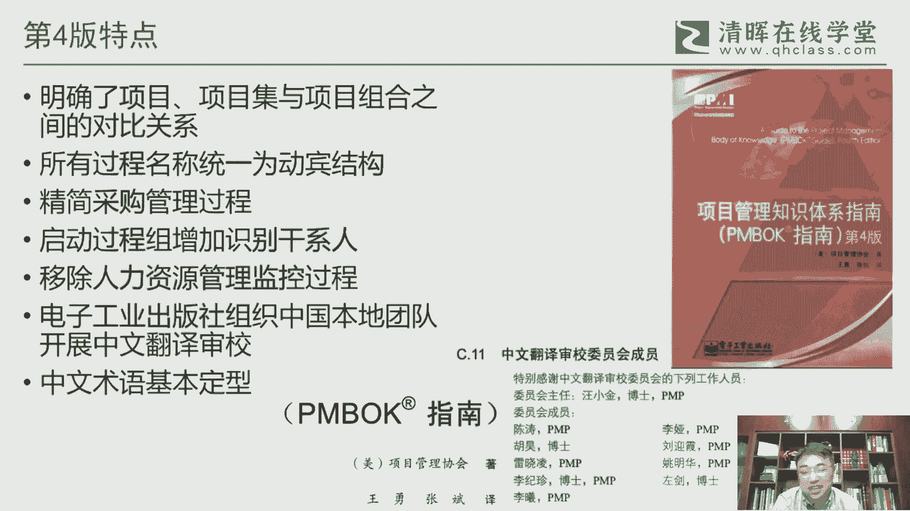
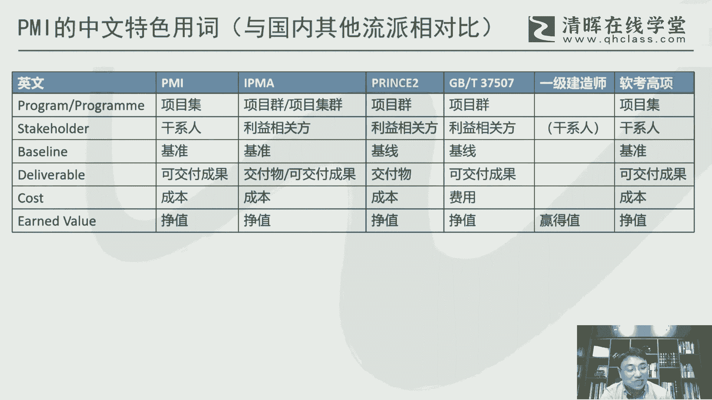

# 干货满满：PMBOK指南的演变 - P6：6.PMBOK指南第四版 - 清晖Amy - BV1vD421M7dD

呃第三版到第四版啊，这个也是一个呃非常重要的一个版本，08年啊，因为08年我我是那年考的偏僻啊，但其实我考的时候实际上还是第三版，还是考第三版，但第四版呢是我开始教，因为我是09年。

这个第一次站上讲台来来教偏题啊，所以实际上我去做这个这个教书的，这个备课的时候，实际上我已经是切换到第四版，所以考用第三版的去考，然后第四版来教，所以这两个版这这个这个版本的切换。

对我来说印象还是比较深刻，因为第三版台来说，我觉得印象也不是特别深，因为考我还是要考，其实可能并不一定是那么那么难对吧，但是教了你这个得得花很多心思，所以第四版相对来说，我我觉得自己还是会比较熟悉。

对对，第四版的很多内容，其实相对来说会会印象会更加深刻一些啊，那第三版到第四版呢，我们来看一下它，整个这个其实从整整体框架来说呢，其实呃怎么说呢，也没有特别特别本质的变化。

当然从启动过程组里面会增加这个识别，干系人啊，这是一个很重要的一个变化啊，把这个干系人这这一块这个这个提出来，然后监控过程组呢，后来想想还是还是觉得这个这个第三版，把这个这个在人这上面增加监控。

可能觉得还是不妥哈，所以他又给他拉回去了啊，所以所以在第四版也是一个监控过程组，是没有这个这个这个对人的监控，对团队的监控，这这这个过程啊，所以他往前提，他其实实际上是以以管理项目团队，这个来来体现啊。

那这是大概整体的一个，还有一块呢我觉得很很明区别，很明显是它采购管理的大幅度的这个压缩，因为原来采购这一块其实比较繁琐，淘宝采购里面很多细节都都给他分区分的，分的太细，但事实上呢。

项目经理绝大部分来说并不是专业做做采购的，这个这个事，因为采购会有专门的采购经理啊，会有专门的这种供应链的这方面的一些管理，来支持当的，所以对项目经理，其实更多的是去了解这个采购的一些，基本的常识。

其实就可以了，而不是要做那么细啊，所以在这一块呢，把采购做了一个很大的一个一个一个压缩啊，呃其他方面的相对来说都还好啊，都还好，我觉得倒没有特别本质性的一些一些变化，呃第四版呢我们来看它有几个呃。

有几个点啊，一个是呃对这个项目项目集和项目组合，因为在前三版它这几个概念都都出来了嘛，那出来之后，他们之间到底本质上的一个关系怎么样，还一块呢，在当时这个08年左右，正好是这个偏呃。

这个这个项目的这个项目及管理标准，项目组合标准也陆续出台了啊，所以所以我们看它封面啊，它封面是很有意思的，他这个不是刻意，他这这个三角形，它其实是叫刻意为之来设计的啊。

底层这个这一块他用这个粗线条把它框出来，这是什么，这是项目，然后中间这一层如果在当时的项目及标准里面，我们就看到这是项目级标准，那最顶层的这个这一块的项目组合，所以它实际上是把项目。

项目集和项目组合这三层的关系，通过这个封面的这个金字塔的这个，这个三层结构来来来把它体现出来呃，还有一块的名称上的一个统一，名称上的统一呃，所有的过程名称统一为这个叫动宾结构，什么叫动宾呢。

就动词在前面，名词在后边全部是这这样统一，就包括比如说前面说的这个范围核实对吧，那范围核实范围这名词在在前面，那这就不是这不是一个不是一个动宾结构，那那统一过来之后，到第四版。

我们看所有的它就变成了核实范围啊，他他一定是把动词网放放前提，这这对他对所有的过程都进行一下统一化处理，然后采购的这个管理过程，他做了一个精简，然后是这个识别干系人，干系人在这里面。

他就变成一个独立的一个一个过程，所以他变成一个一个，而且是在启动的过程啊，启动过程一般来说都非常非常重要，所以他把这个干性能识别干性能，这个作为一个非常重要的一个，对人的更加重视啊。

应该说是在这一版体现的比较明显，还有一个就是前面也说到这个人力资源监控啊，这个对人就就不要用这种监控的，这个这个这个概念啊，呃另外这一块呢，这一版前面也说是是第一次，由这个中国本土的团队来开展。

这个中文的一个翻译和省教啊，翻译和神教，所以他这个，而且，而且这个也是享受了一个很重要的一个待遇，是把这个译者的名字给他，给它放到这个封面上啊，后面就再也享受享受不到这个待遇了啊，那当初这个版本的是呃。

由那个是王勇和张斌啊，这这这这两位两位先生来一的呃，王勇呃，他们两个其实现在在偏僻这个圈子，我觉得基本都都淡出了啊，王勇现在更多的是会去给这个ENBA啊，或者说一些企业嗯，这这这种高管啊。

去去去去去讲课，呃，张斌呢更多是做咨询的，可能可能基本上也也不太活跃在这个这个这个，这个偏僻的这个培训，在这个圈子里面啊，那省教委员会呢，其实其实这里面还是有不少这个名人在里面的，呃汪博士就不用说了啊。

汪汪汪老师，还是这个，一直都还是我们这个这个项目管理局的一个，还是一位非常有印象的一位老师啊，呃这里面其他的其他几位呢，呃因为也比较早谈，说我也很多也不太认识几，但有两位我是认识的啊，因为是吴浩。

吴浩呃，吴博士呢，他是当他是上海交大的这个这个教授啊，上海交大的教授呃，李继珍啊，李老师呢他是清华经管学院的，现在应该是副院长啊，副院长啊，对这个也是也是一个非常非常有影响力的，一位学者啊。

那其他的可能也都是比较厉害的啊，只不过所以我确实那个时候还还比较，这个这个太早了，这个也不太有机会去接触到啊。

呃第三版到第四版呢，我觉得在术语方面应该是一个呃叫本土，叫海外，探索，到本土习惯的这个这个，这个一个一个标志性的一个版本啊，一个标志性版本，因为我们前面也说到这个第三版的时候呢，这里面用了很多的术语。

其实它是怎么的，因为在海外翻译，在海外翻译的话，他有时候的用法，还有包括习惯，其实并不太我我，我个人感觉实际上是可能并不太和国内的一些，一些这个这个习惯相相衔接，甚至有些有些方面其实还是有些呃怎么说呢。

不是不是太接地气的那种感觉啊，但但因为第四版是由本土来做翻译，那本土翻译的话，所以很多的用词，我觉得再加上整个这个翻译和审计专，应该都还是比较有，这个这个你看博士好多都是博士的对吧。

那这个大至少大家对这个学术的这方面，其实还是会会比较严谨啊，所以所进到第四版的这个术语，基本上我觉得奠定了我们整个整个中国的这个，项目管理的，应该说很多的系，就就就这这十几年。

一个应该算是一个比较比较重要的一个，一个术语的一个习惯用词的这么一个传统啊，所以你看包括干系人，项目集项目组合啊，渐进明细啊，这个也是一种我们经常挂在来说的，整合管理对吧，成本运营进度计划输入输出。

关键路径法，政治范围蔓延工作授权系统啊，就这这些词都是对我们来说，都是现在变得耳熟能详，那非常非常非常习惯的一种一种一种叫法，呃，相反的是第三门，他说确实很多词我们是不太习惯啊。

不太习惯对英语的这个这个一些一些表述上面，我觉得也是可某种程度来说，也是也是不完全到位啊。

不完全到位，这里面为为什么说这个这个偏麦的，这个这个词呢，它还是具有具有这个这个中国的一些，我觉得从习惯角度说，大家会更加习惯的啊，当然这里面从从中国的这个本身来说。

就是因为项目管理我还是对整个中国来说，其实我们都是从海外来引进的，中国本土的，比如你说华罗庚也好，可能可能他虽然是发明了一些，我，我们可能会认为他是一个项目管理，一个一个一个开创者啊。

但是他其实本质上来说，还只是在停留在某些工具上的一些应用啊，并没有构成一个系统化的一个一个管理的，这个变成一个学科的一种一种思想啊，所以国内本土来说，对项目管理这个学科的建设来说。

基本上来说也是从海外来引进的，那不同的海外的这个的来源，就会构成了我们对对不同的这个这个相对的，在国内会形成一些流派啊，那不能理派里面它也会对有些词啊，有些一些关键词它其实是不太一致的啊。

所以这么多年其实一直有人在说，要统一这个中国的这个项目管理的用词，但是谈说大家每一个这个这个派别，在某些关键词上，它有它的一个使用的一个习惯和传统，其实并不太容易，真正的来说大概完全达成一致。

再加上有些词本身来说，它就就是一个呃怎么说呢，从一开始他其实就是有太多的这种不同意法啊，甚至项目管理圈子和这个和通用管理圈子，或者说这种和和这个这个更更广大的这种，这种这种专业领域里面。

其实完全是都是用不同的词，那这种就更难统一，所以这里面做了一个稍微做了一个对比啊，因为在国内来说有几个主要的一个呃怎么说呢，这个这个项目管理的这个这个这个这个圈子吧，或者说底无派啊。

当然我们接触的比较多是偏麦，因为我们偏N地都是偏麦考的啊，所以所以整个PMBO的用词，其实决定了我们对呃绝大部分人来说，对项目管理的一个理解的一个共识啊，呃国内当然还有一块是IPAIPM。

它是一个总部在欧洲的一家一家国际的呃，这个这个项目管理的组织啊，那他也有他的标准，他叫ICB一个他是一个技能能能，这个能能力的这个这个这这方面的能力，模型的一种一个标准，所以它里面用的一些关键词呢。

它也有它自己的意义，比如说最典型的项目集呃，它叫项目群啊，而且事实上很多的其他的可能都叫项目群，那但是PM从新进入中国，一开始他就叫项目集，你就叫他去改，我觉得很难啊。

你叫其他的这个组织把项目群改成项目集，也是不可能的事情啊，所以就会就一直就一直这个这个大家各用各的，那PM第四版的也挺有意思，他项目其实有时候叫项目群，然后个别词他一个项目集群啊。

其实表达是同一个意思啊，呃包括利益相关方啊对吧，利益相关方还有基准基现啊，什么可交付成果交服务啊，之间的这种对比，包括像police two，也是police two，因为是来自英国啊。

所以他也有他自己的一呃这个一些一些译法，当然prince two的译法呢它没有在中国，没有正式的这个所谓的官方的这个出版物啊，所以实际上某种程度来说，普林斯的中文。

其实属于叫民间组织或者志愿者组织来做的，做的译法，所以它里面的用的用的一些词怎么说呢，也有它自己的一些特色，反正跟偏麦也不完全一样，呃国内呢还有一块呢是叫国呃，叫中标协啊。

严格的叫中国标准化呃委员会或者协会吧，它里面有有一个方向，有个项目管理方向，所以现在叫项目管理标准化委员会，那么他现在在牵头，也在做一些，这个这个中国项目管理标准的一个建立啊，那这块他因为做的比较晚。

所以他有些词呢其实其实也是在在我看来，其实也是在在引用，或者说或者说一开始其实也并没有考虑，明考虑的太明白，可能就用起来了啊，就用起来了啊，但反正也是也也是一个目前的一种现状啊。

反正他也是反正几块也不一样，呃然后中国还有一些考证啊，跟这个本土的考证，跟这个这个项目管理也有关啊，比较典型的是软考啊，软考叫信息系统项目啊，这个这个呃项目管理师软考这一块呢，我觉得他有一点他他挺好的。

他其实就是就直接就直接拷贝偏慢，所以软考的这个术语，它实际上是就跟偏颇是一样的，当他因为现在他一样的对象是第五版啊，但现在还没有升级到这所谓的第六版啊，所以基本上它是跟我们第五版的这个。

这个数值是保持一致的啊，呃还有一块是这个建建筑行业会有个建造师，当然这块我也不是，反正说我也不是太练太熟悉呃，这一块呢它里面有些词呢，但我也没特别的，但但有一个词我是觉得是他比较特殊的，就是政治这一块。

他一直叫赢得词啊，这个其实跟我们其他行业的这个使用习惯，都都是完全完全是不一样的啊，这个这个有时候我们去看看看一建老师，他们的词，这个就赢得值，你你得转换一下，它对应的其实是正值。

所以这里面会有一些其他的这个这个，这个项目管理流派对比，但偏麦来说还是我我个人观点，就其实偏麦，因为他用他自己的词其实一直也是有传统，这么多年，而且他的面比较广啊，影响力也是最大的，所以所以也没有。

至少目前来说其实不大。

可能跟其他的这个这个用词其实完全是一致，否则要么谁敢呢。

