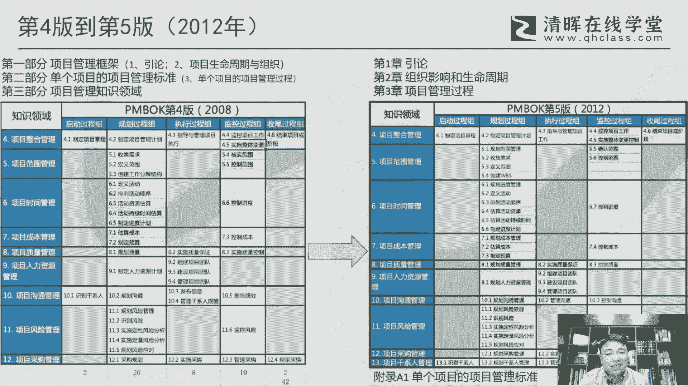

# 干货满满：PMBOK指南的演变 - P7：7.PMBOK指南第五版 - 清晖Amy - BV1vD421M7dD

第四版到第五版的，相对来说我个人感觉实际上是一个变化，不是特别从它的这个内容啊，就术语来说变化不是特别大，但是它其实是有一个很关键的一个变革啊，就从九大知识领域变成十大知识领域的。

这么一个一个一个变化啊，所以所以这个他把干系人这个管理，给它单列出来啊，这是一个非常非常大的一个变化，就是相对来说奠定了，就是现在我们看来，实物举证的这么一个一个框架，但事实上它的整体框架呢。

我个人感觉其实变化并不是特别大啊，其实并不并不是特别大，这里面呢其实是怎么说呢，其实到反而是相对相对来说比较稳定的，一个一个一个一个一个版本啊，像这个面，它无非就是说把原来的沟通管理做了一下，拆分啊。

变成了沟通和这个联系的两大块，但是其他方面来说相对来说还是比较稳定的。

呃这里面呢我们来看一下，就说原来的这里面之前的版本的都会叫什么，第一部分，第二部分，第三部分都会有这么这么一说，但在这个版本里面就就就反正就是脏，他也没有特别再提部分这一这一个概念。

这个中间层啊就是就13章来构成啊，然后呢项目管理标准他第一次是移到附录啊，他是把附录里面单列出来，但虽然单列，但是他在那第三章里面，其实还保留了他的这个这个这个五大过程组啊，这个这个这个概念呃。

这一版呢我觉得也有个很大的一个变化啊，就是这个敏捷啊，敏捷第一次进入到pm的指南，因为敏捷实际上是01年这个正式出现嘛，这个这个敏捷宣言出现，但实际上是敏捷，因为之前一直都实上还更多的是在在软件。

在互联网这个这个这个圈子里面啊，他其实并没有走到一个一个更加更广大的一个，一个一个一个一个体系里面啊，但是但10年之后这个情况不一样啊，10年之后，PMI也开始意识到敏捷的一个重要性了。

所以在PMBOK里面也第一次来，来引入到敏捷这个概念呃，然后在这一版里面特别强调了，就说这个这个版本之所以他现在做这个变化，比如说增加这个干净，它其实很重要一点，他是要跟叫国际标准接轨。

那这里面国际标准，其实它对应了一个叫SO21500标准，因为ISO216500标准，也是在2012年正式发布的，实际上这两个标准是同同时在发布，所以这两个标准实际上是相互对标，所以所以这一这一版里面。

其实就是看它的一个变化，其实背后的一很大的一个原因是，因为ISO的标准的出台，当然ISO标准其实它也是以偏不可为为，这个怎么说呢，为为基础的啊，就是它的基本的框架其实是参考的。

是以这个PMBOK为为为为框架，但是二者嘛他要统一，要一致化啊，所以就变成了把这个九五集成变成15集阵啊，这这样的话就跟ISO这个统一起来呃，另外一块呢是呃是我们这叫所有的管理子计划。

他不是有十个11个这种管理子计划吗，每一个管理子计划呃，其实并不在之前的版本，并不是说专门有个过程对应到这个管输出，到这个管子计划，最典型像范围进度成本这三个管理者计划，它其实之前版本只是提一下。

应该有那么一个管理子计划，但是问题是有和这个和和和谁来做，怎么做，还是还不是一个统一的概念啊，所以为了为了把这个缺缺陷给他弥补一下，所以在这一版里面都是增加了，叫制定范围管理啊，制定制定这个进度管理。

这这这制定成本管理，这个这个计划，这个过程啊，所以这样的话，让所有的管理制计划都能够有一个过程，来处处呃，还有一块呢对这个知识领域啊，除了当然除了这个人这一块，他都用控制统一都用控制啊。

都用控制上人的这个这个监控过程，他其实叫管理这个团，管理团的管理人员资源，他其实是用管理这个过程来替代了，这个控制这个这个过程啊，因为在管理这一块，我们其实比如说管理团队这个过程里面。

其实更多的我们会去去检测，打这个团队的倾向对吧，然后做冲突管理啊，实际上它本质上来说还是一种建议，体现出一种监控的一种一种作用，呃这个版本的我们前面说的i so，那ISO是这个叫21500。

然后2012啊，2012对应的是年份，这个版本在19年的时候，中国把它引进了，就是就前面提到中国的这个项目管理，标准化委员会啊，国标委啊把他引进了，那么啊当然也有个叫GB什么什么什么啊。

那国标多少多少啊，那么但是它里面内容呢其实是原封不动的去，他因为叫引标嘛，引用标准，然后直接直接把2150，直接也也会不通的翻译过来，那只不过就是说翻译的过程中，他用的术语的取舍啊。

他这里面就会就各种的各种流派。

一个大杂烩的一个体现啊，甚至因为当时做翻译的，我估计可能也是有些可能非项目管理行业的，所以有些词也是挺怪的啊用的，所以在第五版的这个术语来说呢，我个人的感觉叫稳定衔接啊，稳定衔接就是说要在这一版里面的。

基本上术语层面没有太大变化，基本上都是沿用了第四版的一个术语，那么这样的话它就构成了一个非常稳定的一个，一个一个一个结果，因为这两个版本将近使用了10年啊，其实这10年差不多差不多是应该是。

中国这个这个项目管理应该是腾飞的10年啊，从这个09年当时考量，可能也就1万1万1万多人，然后到19年一八年，这个这个这个将每年突破10万人啊，就这个整个在中国市场它翻了十倍。

但这十倍其实很大程度上是授予第四版，第五版的这个这个教育的一个结果啊，所以这两版其实对中国的这个从业者，尤其是很多就是在企业里面已经10年过了之后，他到到现在，他已经是可能是在企业里面担任比较重要岗位。

的一些项目管理的一些领导人来说，那他更多的会习惯这两个版本啊，因为因为这两个版本确实来说是奠定了中国的，这个很多的呃，相对来说很很大量的这个这个骨干力量，都在这两个版本这里面，这个这个至少他通过考试啊。

所以印象会比较深刻一些，呃这个版本呢我们看他的一个中文省教呃，第五版的是由许许家里徐老师这个领领衔的啊，领衔的这个做翻译，然后当然也有这个省教团队吧，到底还是还是汪老师再再再领先。

然后啊这里面也有还是有有不少不不少人，这这个也比较熟悉到第五版，相对来说这个接触因为也也有也开始有微信嘛，相相对来说就是怎么说呢，有后后面的，有些这个，这这这个这个从业者就相对来说容易来。

更加容易来交流啊。

12年呢我觉得还有一个很重要的事情啊，就是对对这个PMBOK来说啊。

就他做了一个叫偏PMI项目管理术语词典啊，第一版是在12年发布的，然后到现在来说是已经是到了这个第三版了啊，第33。2这个这个20一个小版本，那么这里面呢其实也可以看到就说偏慢的。

也开始对这个术语也比较重视，实际上从从这个词典发布之后的话，就偏麦对术语的解释，它其实基本上是以这个为准的，包括pm pmbok，从指南角度来说，他也经常去引用这个术语。

这里面比如说这里面的最早的像是SPONSE啊，这里面我们我们可以看到，第一呢它里面有些解释它会变啊，还有一块呢它里面也增加了一些这个术语，增加了一些术语。

比如说这个是sta hold engagement plan对吧，这个原来原来可能就就没有这一块，但它把它加进来啊，所以比较重要的一些概念，它会通过这个术语，术语词典的更新来把它把它引入进来啊。

把它引入进来，所以后面的从12年开始，基本上我们就开始对术语的制造英文啊，英文术语，它实际它是要要参考这个PM项目管理，数据词典啊，那同样我们来看一下这个stakeholder。

stakeholder这个词我说是是特别特别呃，呃怎么说呢，比较在整个pi啊，PMBOK指南一个发展历史上，应该是非常非常独特的一个词啊，就这个独特的之处在于，每一版本对它的解释其实是不一样啊。

都是当然大体的意思是差不多，但是细节方面，每美版每过4年大家都要去讨论一番，这个词应该怎么来解释，当然也说明这个词很重要啊，但确实来说它这里面反映的某种程呢也反映了，就说呃这个项目管理界对对人。

对stakeholder，对干系人的它的重要性和理解的。