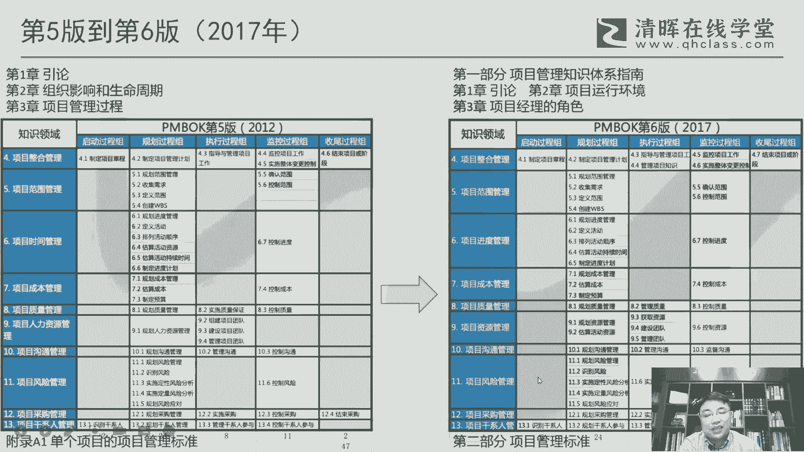
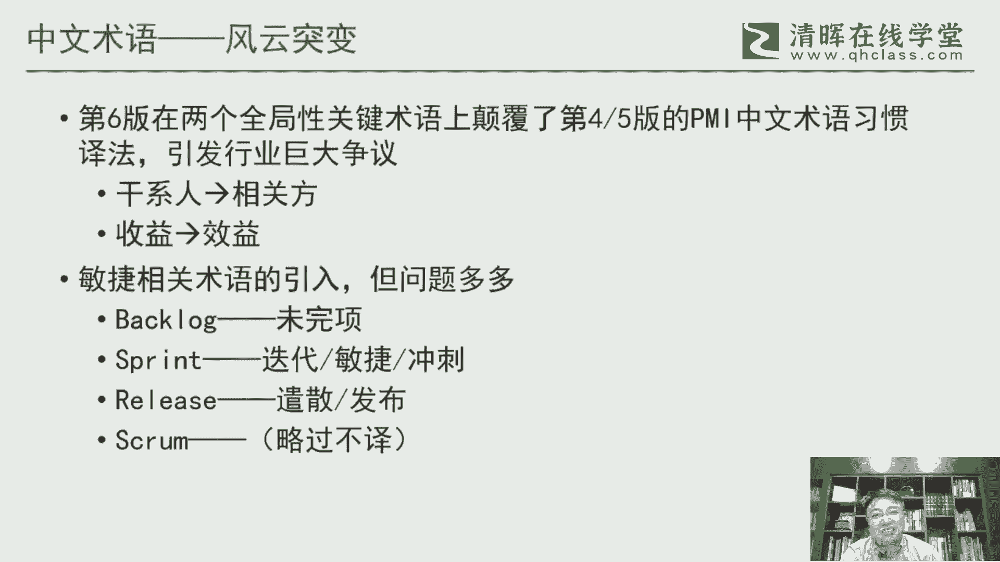
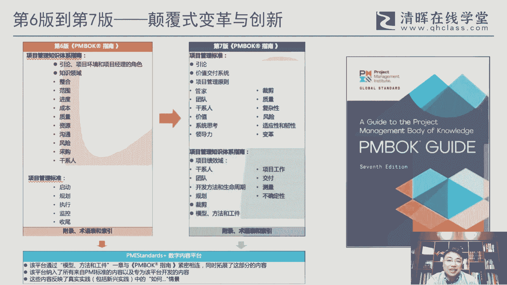

# 干货满满：PMBOK指南的演变 - P8：8.PMBOK指南第六版 - 清晖Amy - BV1vD421M7dD

呃第五版到第六版，前面也说了，第五版到第六，其实这里面时间他稍微有点打破规律了啊，因为往年正常来说都是4年四年100，然后第五版到第六版，它这里面就有一个突破，原来第五版的时候其实差点也打破过一啊。

因第五版的时候，他发布是2012年的12月31日，他是卡着卡着这个年末的这个点来来发布，否则再过一天它就变成5年了，这个，所以所以所以这个当在当时来说也是破不破的，但到第六版。

因为变动的内容实在是太多了啊，按照他的这个这个时间来说，根本不可能再16年完成啊，所以也是迫不得已，他最终在2017年9月份啊，来正式发布这个第六版啊，当然这第六版的确实来说内容是大幅的增加。

就从它的厚度来说确实是大幅的增加，呃整体来看呢，这里面其实大的框架来说，第三章他做了一个很大的一个变化啊，第三章整个把这个像过去传统的这个项目管理，五大过程组啊，他彻底的变成了这个项目经理角色。

把人把项目经理啊，这个这个这这怎么说呢，更加进一步的来凸显这个，这个这方面的一个重要性，呃其他方面的话相对还好啊，相对还好，当然除了这个增加了一个项目管理，项目知识管理，还有一个实施风险应对啊。

这这个这两个过程之外，其他的我个人感觉，其实总体来说都还是在变化范围的，还还是还是可以理解的范围之之内啊，另外一块呢它是一个资源管理啊，资源管理。

资源管理之所以加呢，其实它也是跟ISO这个这个I150，来来来对应的，呃这里面我们来看一下啊，主要的变化，主要变化呢第一呢这本当时发布这个呃，指南说他不是不是单单行本发布。

它实际上是跟叫敏捷实践指南同步发行呃，什么叫同步发行，就是说你买书的时候在美国买这个时间段，你不能单买这一个字，Pmbok，你必须两本书一起买啊，这这这这是很有意思的一件事，因为正好那年发布的时候。

17年吧，17年我呃，他那个PMI的全球大会在芝加哥举行，正正好我当时去参加了那次大会，他会场上就有这个书卖，这个这个要买掉两本一起买，所以行，那那我两本就一起买了，所以所以所以所以当时是我记得。

而且两本它有一个统一的一个封装啊，所以所以所以这个我印象是很深很深刻的，呃这里面呢我觉得很大的一块呢，它实际上是真正的把敏捷和这个，适应性生命周期的这个内容给它给它加进来啊，就是第六版很大的一块是。

因为敏捷已经是真正的开始改变这个，这个我们这个这个时代了啊，所以这对敏捷的重要性，这个这个他必须在在篇幅上加以体现呃，另外一个是对人的一个作用啊，所以所以项目经理啊，特地特地专门的把这个项目经理。

这个这一块给他加进来呃，还有一个是偏慢人才三角，人才三角呢，这个概念最早最早的提出，是实际上在12年就提出来的啊，就12年的PMI的那个职业脉搏调查里面，其实就提提到了这个人才三角的一个雏形啊。

早期的一个模型呃，经过45年的这个测试，哎，发现这个确实很重要，所以所以在第六版的时候，正式把它写进这个pm book，就替代了原来的pm，原来的那个那个人才的一个，这个这个这个这个这个模型啊。

呃还有一点呢就是人力资源把它变成资源，其实这个也是也是一个很大的一个变化，因为从过去传统来说呃，这个人力资源的他一直是独立的一个章节啊，就是人和物这两块其实还是区分的，那物质上的这个资源。

它其实更多体现在这个这个怎么说呢，在他的这个工作分解啊，或者是他的一些技术实现路径的这个这个活动，分解在这个层面来体现，它其实并没有给他独立的来来来考虑啊，那么在在第六版的时候。

因为有一个很重要的一个条件，就说他那个时候还是很强调跟这个21500，就是i so来来对齐，因为ISO里边它实际上是把这个资源，它是把人和物是并在一起的啊，所以所以他这里面给他做了一下整合呃。

但是让我个人感觉，其实这种整合其实其实意义不是特别大，因为因为真的来说，从管理角度还是要多关注人啊，所以这个硬性法这两个整合在一起，我觉得这个是第六版呃，当然反正他他有他的一个理由啊。

但确实来说我个人是保留意见，然后再知识领域里边，我们看第第六版也有它的一个特色，因为以前版本里面在前沿，就每个知识领域前沿相对来说结构是比较松散，没有没有这种很结构化来处理这块。

那么呃第六版给它分成四块，固定四块内容啊，就这样就做了一个非常结构化的一个处理，核心的概念，什么发展趋势，前景实践，财前考虑敏捷有C所以其实后面这几个内容啊，其实这四块内容。

其实尤其是后面这三块其实都会跟敏捷相关啊，或多或少都会跟敏捷跟这个组织相关啊，所以所以敏捷的在这一版里面，他其实是是体现的很多的啊，所以这也是为什么他一定就是买这个，就是看这个这个PMBOK。

一定最好把那个敏捷实践指南一起看，那敏捷实践指南作用啊，我记得当时跟那个跟那个敏捷实践指南的，那个主编啊，那个也也也曾经交流过啊，就问过他这个，他说这个实际上是是我。

我一开始以为他这个东西会跟ACP有关，它实际上跟ACT没有关系，就是当时写这个敏捷思想指南，目的其实就是给各行各业，尤其是以前没有没有过多去接触敏捷的，这些传统的行业，更好去理解敏捷啊，他专门写的。

所以他二者是是匹配的，主要还是其实还是针对PP考试，来用这个这个临界实验指南，那么但实际上敏捷，很多概念其实已经是包含在这个第九版里面，另外一个是对工具技术分组，这个也分成六大组加加未分组。

这这个几十个工具啊，所以总的来说是777组啊，呃这一块呢项目知识管理啊，这个是很是第六版的一个很重要的一个，一个变化，就是他把知识管理第一次呃，以一个过程的方式来整合到这个片部里面。

还有一个是实施风险应对，实施风险应对是很很很明显，是那个是那个戴维希尔森的，就是他的一个观点吧，因为第六第六版里面的偏book呃，book里面那个风险管里面很多的那种。

甚至包括他那个RBS分解的分解结构的例子，都是用的，我前面提到那个那个啊tom，那那那本书的这个这个这个这个这个原来，相当于是严复未动的把他引用过来啊，所以这个第六版的。

我觉得在风险管理来说还是有很明显的，大卫希尔森的这个这个影子在里边啊，然后那个17年9月份，实际上也叫多语种同步推出，那同步推出呢，就导致这个翻译和这个省教的一个工作的一个，一个怎么说呢。

这里面就很有挑战了，因为他又在美国翻，然后中国大陆要去去省教这个，然后时间还是线下啊，这个时间真的是是很成问题的啊，呃而而且很很有意思，他最后出版的时候，居然把这个审教团队没没写进去啊。

这个这个这意思我我们也看不大懂，这个这个不知道当时他是怎么考虑的，因为按照传统来说，案子他一般都是要在这个中文版里面，把这个中文的这个参与者要继承，还是志愿者要写进，这，这个至少是一种对。

对这种志愿者的一个一个尊重吧，啊，所以所以我们在这一版里面，特特别关注一下问题，这个无论如何，千万不要把我们这个辛辛苦苦，花了一年多时间来参与，结果最后最后连连连，连这个这个露脸的机会都没有。

这个有点说不过去啊，呃但是这一版的坦然说从术语角度来说，我觉得是一个我用了一个词叫风云突变啊，风云突变，那为什么特别特别说风云同学，因为我是觉得这一版的这个这一版。

当然整体质量我个人感觉尤其最初的那个版本，他那个9月份他以PPF的形式来发布，那个版本，他就说整体质量非常非常堪忧的，里面有好多的问题啊，呃但是但总体来说，因为个别的句子。

我们可能关注点不一定会太太太多，但是全局性的一些术语肯定会去关注的，那最大的一个一个变化，就是说在在在这两个术语，一个stakeholder，一个benefit啊，这两个词他做了一个。

真的是完全是颠覆式的一种一种译法啊，他把该系统变成相关方，我说这个叫逆向万方，其实坦然说大家也都能接受啊，因为因为因为这个行业，很多人很很很很多流派都用利益相关方，但但为什么把这个利益两个字去掉啊。

直接相关方，那这个意这个就变成了一种指代性，非常非常不明确的一个啊，其实严格来说，这就不不构成一个术语的一个词了，还有一个收益变成效率，那当然效益我们经常也会用经济效益啊，社会效益。

但是这个作为benefit来说，作为收益其实是一个行业的一个，就是所有的流派都在用这个词啊，其实没必要去去特立独行这个责任，所以这两个词我觉得当在当时，在这个引引起非常非常非常大的一个争议啊。

但实际上因为我们事都是事后，事后诸葛亮，因为这个过程之前的过程也没参与嘛，所以回回过头来，哎呀这个这个东西怎么怎么弄的啊，这个这个也没办法，所以但是呢谈上我们一直也不接受我。

至少至少我觉得我们清辉这个从学术角度，我们不会去接触这个词啊，所以我们清辉的这个讲义其实这么多年，这几年一直还是坚持用干洗这个词和收益，这两个词，而且我就后来我，我是后来在那个就是那个发布之后。

稍稍稍微之后，我我是专门写了一篇文章，给那个项目管理评论杂志，专门写了一篇文章，就是来讨论这个这个，这个为什么要要要这个干系的stakeholder，这个这个译法。

这个这个问题我觉得是要引起关注和商榷的，在当时呢我觉得也都是事后的事情，因为因为这个事情已经发布了，你再去改，其实也这个在制造第六版，不存在这个可能性的啊，所以所以当时其实我是一个想法，就是那行。

那第七版嘛，那再再再等再等几年，熬几年，这个看下第七班是不是有机会再再来参与，参与其中，所以所以在当时我是立了一个flag啊，这个啊，所所所，所以后来也是也也是去争取来做这件事情啊。

那另外一块呢我觉得就在第六版里面，很明显，无论是翻译者还是省教团队啊，我个人感觉在当时来说，对敏捷的这个熟悉程度是不够的，所以会导致这个敏捷相关的术语就问题很多啊，呃因为我们清辉是在12年的时候，哎。

14年啊，15年的时候，其实我们是翻译了一本这个敏捷项目管理，这本书嘛，其实其实我们自己对敏捷还是还是有些概念，还是有些概念，有些词该该翻不该翻，或者说该怎么翻，其实我们心中还是有谱的。

但是但在第六版里面，我们很明显看到有些问题，比如说backlog用未完笑，那未完，像这个这个问题其实就来了，BALLOG从来不是说，它里面的所有的内容都是要去完成的，因为因为因为它的完成。

取决于这个叫优先级或者说价值，所以很多的低价值或低优先级的这些项目，它实际上是最后是要被抛弃掉的，如果里面都叫未完相，那就意味着所有的里面东西都要去做，那这个很明显。

从逻辑上也不符合这个backlog的这个，这个这个管理目的，包括sprint spring的冲刺就可以了，然后再在第六版里面又是迭代，又是敏捷又冲刺，完全没把这个概念给区分开。

还有个release release也是一开始当成遣散，哎呦我当时我都醉了，这个怎么叫遣散呢，这不明显就是发布嘛对吧，ice cream swarm这个词更更更有意思，在第六版里面叫略过不易啊。

所以所以其实第六版里面SRAM英文原文是有的，但中文里面就没有出现这个词啊，因为译者没有翻，他不知道该怎么翻，他干脆不翻了，所以就没有SA这个词啊，这个这个就就就就就就问题很多了啊。

这个这个就不一一列举了，但但坦率说这第六版的这几年啊，这个因为从18年开始嘛，因为这个也是又赶上疫情，哎呦反正反正这个事也也也挺折腾的啊。

然后马上现在又又面临第七版啊。

