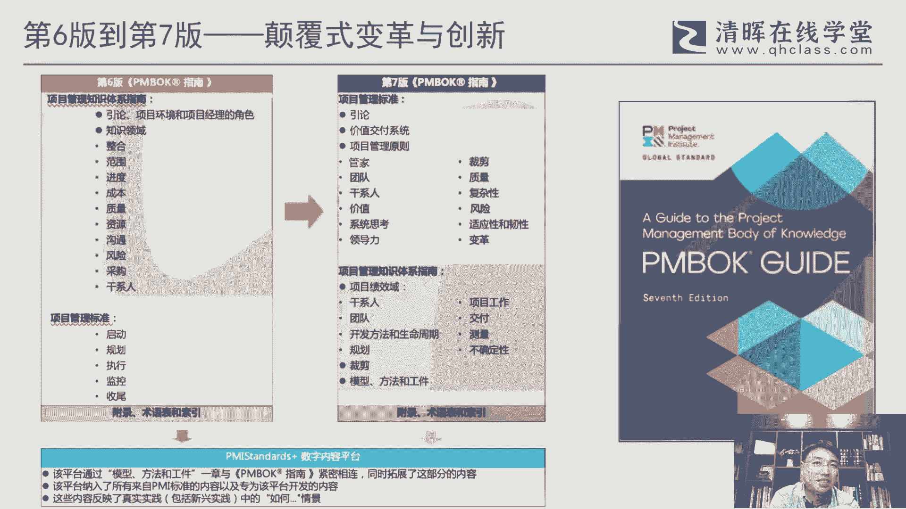
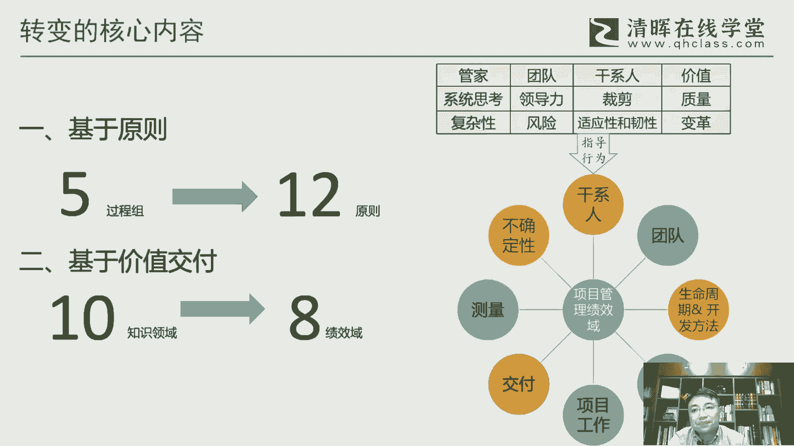
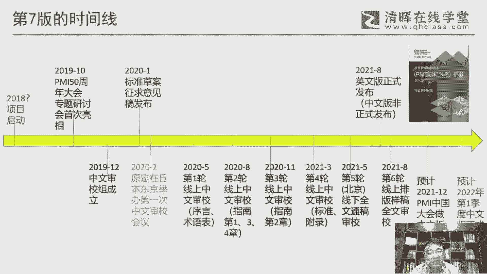
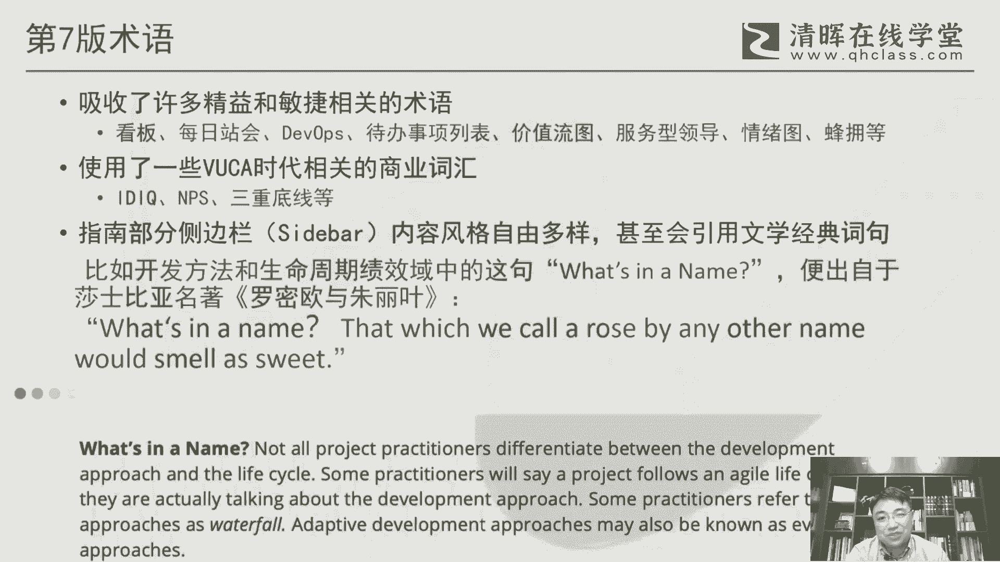
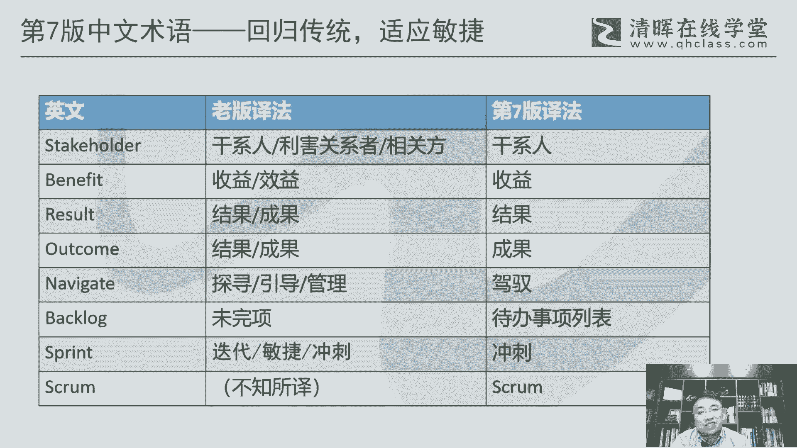
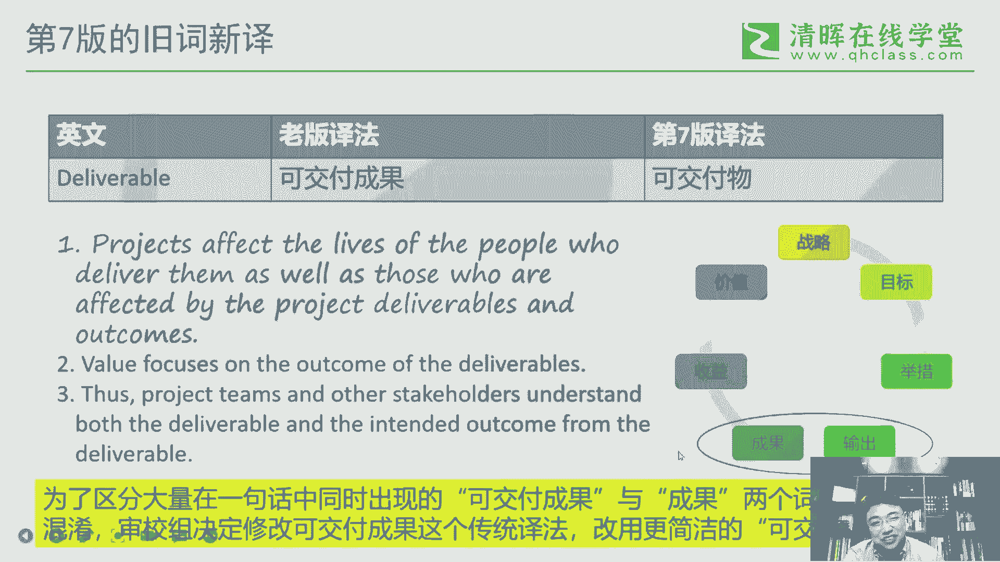
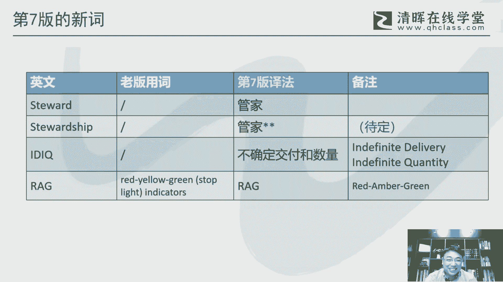

# 干货满满：PMBOK指南的演变 - P9：9.PMBOK指南第七版 - 清晖Amy - BV1vD421M7dD

第七版，我觉得这这个也是给了一个非常重要的一个机，会去去重新再去审视一下这个项目管理，一些术语，以及第六版里面可能遗留下的一些问题，但是单谈说我们也没想到这个第六版到第七，第七版。

会有如此大的一个一个颠覆式的一个变革，如此大的一个颠覆式的一个创新啊，这个是是真的是事先没有预料到的一个情况啊，呃这个呢是呃是第七版的这个英文封面啊，这是英文封面，然后呃第六版和第七版它们之间的关系。

基本上这张图，这也是PMBOK里面会有一有这么一张图，我们看传统来说这个从最初的ESA开始啊，到这个第六版，这将近三十三十多年的这么一个历程，其实它整体来说PMBOK其实就是有两块嘛。

一个是这个叫五大过程组，一个是十大知识领域或者九大知识领域，这么这么来构成的，那么当在第六版的时候，他把它做了一下区分啊，就是把那个十大知识领域，把它把它和那个言论啊，什么东西放在叫指南部分。

然后项目管理标准就是五大过程组，它给它单列出叫项目管理标准啊，但是做了这么一个一个区分呃，当然这个区分就说项目管理标准，它其实某种程来他是他是怎么说呢，这个是从安C从美国自己的角度啊。

他认为项目管理标准应该是这样子的，但是按i so o来说，ISOO的标准来说，其实更多的是像这个，像这个十大知识领域指南部分啊，所以这里面确实来说就存在这个叫行行业协会，国家标准和ISO全球标准。

这之间的一个不一致的性的一个地方啊，这个问题其实一直都存在啊，到现在也还是存在这个问题，那第七版呢我们来看它整个一个架构的变化，它就变成了这个这个当然也还是两大部分，组成标准和这个指南啊。

这这这这两大部分，但是它的内容是发生了一个全新，就完全百分之百都都都变掉了，这个这个这个内容啊，一个是变成了四大原则，一个是变成帕拉奇效应，它变成这么一个价格呃，这一块呢我们呃这里今天就不展开啊。

这个后面有机会可以在专题来做一下，这方面的一个分享啊，再做一下分享，然后呢除了这八个技巧仪之外，它还会有一些这个叫裁剪啊，什么模型空间方法和工匠，那模型方法和工具啊。

其实对应了我们过去传统的像ITTO的这，这里面的很多东西啊，很多内容，比如说这个工具啊，方法哈，输入输出啊，基基本都会会在这里面得到一些体现，那另外一块呢是这个叫天麦，它有个数字平台。

那这个平台它其实是把很多的，这里面的一些内容，它因为在在新版的这个指南里面，大概差不多是300多页吧，三四百页从我们现在的900多，也相当于他一下子砍的这个至少说说了一半啊。

这个这个就就不像现在的第六版这么厚，这个这个像大砖头一样，但地我觉得第七版相对来说对我们这个来说，我觉得还是挺友好的，这个这个厚度啊，包括页页数啊，也相对来说是在可控范围之内。

但它里面有些内容如果是没有展开，它会通过这个叫数字数字数字平台啊，叫PMS3的加这个这一块，喂呃声音OK吗，好呃通过这一块来来来来来，怎么说呢，大家可以在线去学习啊，这个可能也是我觉得也是未来的一种叫。

在线教育，或者说这种在线学习方式的一种。

一种一种一种转变和适应的啊，那总体来说呢这张图可以可以把这个第六版，第七版的一个总体的这个转变可以做一个描述，就说从总体来说，从记忆原则啊，我们过去是基于这个怎么说呢，基于这个过程啊。

我们现在更多是基于原则，所以会把五大过程组改成这个12原则，然后过去呢是基于这个知识领域，我们现在更多是基于所谓的价值交付，然后把十大知识领域变为八大绩效率，那具体内容在右边啊，就是12个原则。

像管家啊，团队啊，干性能啊，价值啊这些这这12类原则，然后去指导八个八大绩效益的具体的工作啊，感信任团队这个生命周期开发方法啊，规划项目工作交付质量，不确定性还有改善啊，不确定性啊，这这这八个呃。

所以它整个新版的第七版的内容是，就是完全他是需要去去改变一下，这个这个管理的思路的啊，我们过去更多的会呃，基于这种这种一种怎么说呢，就是一种ITTO的一种一种思路去做管理，但到第七版的时候。

可能就要跳出这种这种思路了啊，就更多的是是去灵活的去去去选择，你可能需要用到的一些所谓的弓箭啊方法啊，来满足你这个项目的这个绩效率的，一个把它绩效率的一个目目标和需要啊，他会以这种这种角度来做一个转化。

呃这一块呢是我我我我，我今天花了点时间来整理一下，这个第七版的一个时间线啊，呃因为因为这个第六版是17年完成的，那这个第第八版的其实一般来说它完成之后，其实他接下来就是下一版本。

其实就要提倡这个这个议事日程啊，所以这个到底是18年还是19年这块，当然这块我倒不是太了解啊，我因为因为这块之前我没有参与参与到这个，其中，也这个也不好不好说啊，但是我第一次遇到这个第七版是是在这里啊。

19年的10月份，就是呃我们去正好去去美国费城，参加这个PM的50周年大会，呃，在这个会上呢，是专门有一个叫偏布克第七版的这个，这个专题研讨会，那么这个研讨会呢谈论说是是我当时去之前。

其实我已经已经规划了这个，这是我我去的一个首要的一个目标，我要去参加一下这个这个研讨，去了解一下第七版到底是什么样一个情况啊，在当时的时候，这个一看到它的架构，就是刚才说的这个这个这个这个12原则。

那然后这个这个这个马达西校，在当时其实还没有完全定啊，就就他只是说了有原则，有这个绩效益，但但在当时其实还没有定，到底是多少个原则，多少个绩效益，就具体的内容跟我们现在看到的版本。

其实已经也也是有很大的一个出入，但是就只就就先不说这个细节，但至少这个框架一出来谈说我我我是震惊的，我是完全惊呆了，在在在那上面，这个这个也是这个这个呆了半天才缓过神来，哇，这个一下子变化大了。

其实这里面就冒出很多的，无数的这个这个这个接下来这个怎么怎么弄吧，这包括学习啊，包括这个你将来推广啊，其实这个这个都跟我们这个行业是息息相关的，但是这么一个一个一个革命性的。

或者说这种这颠覆式的一个变化，对我们影响就太大了，呃，但但后来回回过头来，也是仔细思考了一下这个问题啊，思思考一下，反正这个从当时的一个一个情况来说，这个是势在必行的，其实这里面也他也不是。

临时来来来公布这个结果，其实他已经是PMI总部，已经是酝酿了这个这个很长一段时间，其实这个肯定是势在必行的，但对我们来说可能更多是要去适应呀，就是所谓的适应性啊，这个也是要去适应它的一个变化。

当然也要从某种程度也要去去思考，为什么他要这样变对吧，然后这个变的目的到底是，他为了给给给我们这些行业从业者，带来哪些影响，其实这些东西是要去回过头来，要去仔细去思考一下的吧，呃然后接下来会有个机会。

就是这个中文省教这个团队要要组建啊，其实这个组建的，其实其实我我自己倒是当时倒是有点晚了，这个这个，但是但这一块呢还是呃反反正因，因为之前我也我我也比较比较关注这个事情啊，然后然后呢偏麦这边的偏爱中国。

这边也比较重视这个事情啊，所以当时的说，其实某种程度也是也是给我提供了这么一个机，会加入到这个社交组啊，那我觉得这点还是特别感谢，变卖中国的这个这个考虑，能够有机会来来来来加入进去。

那么这里面呢我们当时12月份成立之后，当他也需要审核啊，那那我说我别的我我我这个也没，反正我过去几年也翻译了很多，这个这个这个项目管理书，包括PM的标准，我也翻译了，翻译翻译了几个。

所以这块呢应该是对它里面的东西内容，通过他的资质审核到问题也不是特特别大，反正还是比较顺利的加入进来，然后本来我们预定是去年的2月份，因为这个这个时间都定好了，要去日本东京，说说第一次的这个中文省。

教会要安排在日本东京来来做，其实我当时还纳闷，这干嘛干嘛安排安安排到日本来，这个直接在北京和上海来来做，就是但他因为这是一个其实第一次，因为不光是中文，它有日文，还有韩文，还有这个整个东亚区的一个。

这个这个这这一块的一个工作协调了，所以他当时是那么考虑，但是后来受疫情影响，这个事情就完全泡完全泡汤了啊，呃然后在这个去年的1月份的，实际上偏慢的，它有个叫偏布个指南第七版。

这呃这个标准项目管理标准的草案，所以这里面第七版里面，标准和这个指南它是分开的啊，标准主要是12原则那一块，他是其他原则呢，他是对外发布了这个征求意见稿，但是标指南部分他是从来没有对外发布的。

那个就是天M还内部专家，这个只在做这件事情，那这一块呢它有一个有一个意见稿发布啊，当然这个其实就我我觉得我们相对来说，信息还是闭塞啊，然后这块我也是事后才知道呃，过了过了蛮长一段时间才知道。

还有这么一个一个意见稿啊，我看了一下，那我们自己的这个省教呢其实经过了六轮啊，这个5月份从去年开始，5月份，8月份，11月份，3月份，今年的3月份，然后今年的5月份，实际上是我们自己内部争取的。

一个一个一个时间，跟PMI中国这个一起一起协商好，然后到PI中国办公室这个这个做了一下面对，因为之前我们的省教其实基本上都是在线的，在线的省教的话，这里面其实和面对面其实还是不太一样啊，但是有一个好处。

就是说相对来说他时间反而充裕了一些，如果是按照过去像第六版的那种省教，好像都是把这个这个团队拉到拉到国外，或者是某某个地方啊，住酒店里面封闭式几天，其实这个时间其实还是有问题。

那反而像我们这种在线的方式，因为相对来说时间相对来说会更加充裕一些，然后再加上地地温，其实本来他这个这个发布呢从这里面可以看到，就说他整个标准的写作过程，其实它也不是一一次性的完成。

它也是一个迭代式的一个完成，所以所以他是完成一部分，然后相当于发给我们省教一部分，所以这里面就是四大部分，他其实也是分步来完成啊，来完成，但是完成之后，其实他这个省教这个不像我们看完整的文章。

它是按照有其实有点像那种excel表格，那种那种方式，这个非常非常其实很费劲的一一种模式，它是逐叫逐逐句省教哎，就逐句神教，你能保证每一句可能都没有问题，但是放在一起肯定是有问题的啊，这个这个。

所以我们一定要争取一个叫前文通稿的，一个神教啊，然后呃本来我们说这个是成教授，然后他有个layout，就是他整个排版排版好之后，让我们再最后过一下，呃，我们原来预计也是什么，6月7月份。

8月份结果结果好了，在在8月初的时候，这个立马这个叫英文版正式发布，然后同步呢也有个中文版的，非这个这个非正式发布发布，但这个版本谈说是有问题的，这个别的我就不说，至少这个封面封面一看就有问题。

我们是没有叫偏布克指体系指南这一说的啊，只有偏补个指南的这个，所所以当时看到这封面，我也挺挺我我我我们神教主都都傻眼了，这个这这这这是个什么样的这个这个问题啊，这个这个这个好像好像不是。

经过我们手出去的东西嘛，所以所以这里面确实还是会有一个问题啊，然后现在我们是后来在8月份的时候，最后针对这个这个最终的这个反重新，再再做了一个全文的一个省教啊，真实成交完了之后。

基本上这个呃我我我就基本告一段落吧，除了个别的，还有个别的字和词呃，会有一些呃这个这个没有最后定稿，可能还是待定，但这里面也我们要去改的话，其实啊也是取决于美国最终的一个反馈。

还有一个跟这个这个电子工业出版社，下一步的一个工作的一个协调啊，所以所以这一块呢，呃后面还是需要，可能还有一些小小的收尾工作呃，因为现在这个疫情的原因啊，现在也不好说，今天这个这个一下子。

这个这个本本来这月底的考试呃，这个这个也也也也往后推了嘛，那估计那这个因为本来12月初，这个PM中国大会是在杭州举办的，那原来计划的一个议题，也是要在这一次会上，会做一个中文版的正式发布。

然后我们我们几位，我们四位这个神教组成员也会做一个，关于第七版的一个，正式的一个一个一个一个说明啊，一正正式的一个一个分享啊，但是但我估计这个疫情影响，这个这个有可能会有些变数啊。

包括这个这个这个大会都难说呃，然后出版社这边之前的一种沟通结果，可能是预计是明年的一季度，有可能会把这个这个这个这呃，当然最终要要要等PMI总部那边，把中文版的最后定稿，这个事情全部要落实下来啊。

那么这明年一季度大的乐观的话，但这个现在现在反正还是现在是个无卡时代，整个这个疫情下边这个无卡的非常非常严重啊，所以这个东西不太好说呃，但是现在至少我我我觉得英文版，它是它是已经是正式的发布了。

英文版可能是以英文版为准，其实我们所有的标准啊，就PMI的这些标准，其实我们如果严格来说，都是都是以英文版为准的，中文版是作为一个呃本土化的一个参考理解，但真正的原汁原味的那些意识。

我觉得还是要把握它英文的一种表述，但当中中文版我们是是希望能够更更好的，能够能够传达出他这个意思出来呃。

第七版的术语呢，这里面咱们也看一下，一个是它确实吸收了很多叫精益，还有敏捷相关的一些数，这里面比如说看板啊，站位啊，WPS啊，这种这种这种什么服务型领导啊，这种这种情绪图啊，蜂拥啊。

那蜂拥是一个很典型的这个这个，这个敏捷的一个一个术语啊，啊另外也用了一些商业的一些词汇，比如说IDIQ什么NPS啊，三重底线啊，这个可能我们也还平时可能还不一定能看到啊。

但是但是我觉得这个这个还是蛮与时俱进的啊，呃另外一个也挺有意思的，这是以前所有版本里面没有出现过的啊，就是在在这一版的指南，它有一个类似于这种注释型的这个这个内容，就是侧边栏啊，Set deb。

他其实有点类似于柱子型的那这一块的内容，他其实写作风格就很相对来说比较自由啊，里面甚至甚至会用文学经典，这个以前是在天国从来没有出现过的，这个这个内容啊，呃有些还是有出处。

比如说what's what's in the name啊，这这这这句话，这句话当然他要表述的其实是是对，叫呃生命周期阶段的一个命名，其实命名这是因为是一个个性化的东西啊，命名从来不是说这个统一的命名。

你可以根据不同的，所以命名本身其实它是不需要完全统一的，你可以根据自己的项目的特征来做这命名，所以他用了这么一句话，那这句话其实仔细深究一下，它其实就是来自于莎士比亚的一个这个。

罗密欧与朱丽叶的一句台词啊，这个所以所以这个也很有意思，那所以所以第七版来说呢，我是觉得他还是有很多跟过去，真的是跟过去很不一样的地方，很不一样，当然从这里面来说，他也是在探索一种新的风格。

因为毕竟来说它相对于要要彻底摆脱掉过去，过去几十年，这个这个传统版本的一种一种一种结构啊。

那这个新的东西，我觉得可能也不是一次两次就来的国，估计可和我们八版九版，十版，可能也是需要经经历一些，这个新的版本的一些迭代，它可能才会才会达到一个比较好的状态啊，呃所以在第七版里面，我觉得很重要一点。

就是说这个把一些术语还是做了一下回归啊，这个那这个坦然说也是，是不是我加入这个这个这个团队，我我我觉得很重要的点，我我说有些有些事情，可能是需要有人去推动一下。

但反正我想我想这个直到把这个stakeholder，这个词的这个这个翻译给它给它扭转过来，我觉得也是一个叫叫义不容辞的，一个一个一个一个使命吧，就其实某种程度来说。

我觉得我是带着这个使命来做这件事情的啊，所以所以还是比呃benefit这个词最好说很快嗯，几乎是兵不血刃，就就直接把它改改改过的，我觉得效益实在是改的是毫无道理啊，这所以立马这这个这个好古人。

但是干性能其实还是费了一些注子，费费了费了蛮大的一个这个不容易的一件事情，因为团队要达成共识不是件容易的事情啊，所以这块嗯但是还好，最后最后还是还是还是还是那个，因为因为干系人这一块呢。

我我其实这块我也是做了很多的研究，在这方面包括文章啊，也写了几篇关于这干西人的译法的一些文章，其实我是我是觉得就说呃如果要表达一个观点，可能可能光说也不行啊，有时候还是需要用文字来给它。

给它给它展现出来，就为什么这样它的好处，他的他的优点，他的缺点啊，然后有因为任何一个词它不是完美的，因为stakeholder在中国它有二三十种意义啊，那为什么在PMBOK里面我们希望是用干洗。

那那肯定他需要一方面是传统，那另外一方面，你你要去去把已经既成事实的一个相关方，再改掉，其实这个是很不容易的一件事情，因为人人都是有惯性和惰性在里面，这个这个这个要改是要花很大力气。

那另外一块呢像这个有有过去里边有几个词，就在过去的版本里面一直没太重视啊，也没有去去有效的区分的词，但实际上在第七版里面就必须要区分的啊，比如说result和outcome这两个词。

这两个字是有在第七版里面，它有明显的意识上的，用处上的这个这个不一样的啊，所以所以最后我们还是根据，因为laser我们在中文的这个约定俗成，其实还是习还习惯用结果啊，那outcome正好对应到成果啊。

所以后来第七版，我们也把这这两个原来区分区分度不高的词啊，还是给它给它尽量去区分开啊，当然也不是绝对化的，有些是有些地方两个字，但是在某些关键的意思表达上面，这两个字一定要区分开来。

那NAVEGATE这个词呢，其实之前主要是用在复杂性上面啊，pm有一个专门的一个标准叫NAVEGATE，可听这个complex啊，这个但是这个词怎么去用啊，它其实在过去版本里面一直有不同的译。

什么探寻啊，引导啊，管理啊，这个用的比较比较杂，那我们觉得还是需要去给他统一一下啊，所以最后主要用了这个驾驭这个词，实际上驾驭这个词是实际上是他，因为navigate本来是一个航海词啊。

它更多是一种掌舵掌握方向，但中国其实并不是一个传航海潮传统的国家，所以我们更多的是路上，它路上更多是驾驭对吧，驾驭马车啊，什么驾驭，驾驭这个路路上，工具可能会，当然也是符合咱们中国的一个一个用词的。

一个习惯你叫掌掌握什么什么风险，这个也不太好驾驭，复习还是相对好一些，然后像BACKROCK这个微环，像这个这个反正第六版我这个肯定是有点问题，但是这个词其实在敏捷里面也有很多很多种意。

比比如说代办事项，待办列表，待办项代办什么什么待办列表，待办事项列表，相对来说是一个比较安全的一个意为，那虽然啰嗦一点啊，但是但是比较安全，反正这一版我们就就不在这个词上，过多去去纠结。

就就用了一个相对来说不够简洁啊，但是比较安全的一个依法啊，sprint这个显然要用充值啊，这个符合这个敏捷的一个一个习惯，过去来说什么迭代敏捷，就就就就就就就那个那个有点区分度，太不高了啊。

呃SCROME这个词呢过去老板也他他不易不易，肯定是有问题的啊，这个那他的最好的地方就是四补一，但是你就保留，因为因为在第七版里面，有很多地方有些英文是保留的，比如说人名。

我们所有的英这个这个老外的人名，我们全是用保留了，就就不易，什么什么赫兹伯格啊，这种对吧，双音速比啊，这种我们就就就就保持了赫兹伯格这个人，包括那个塔克曼啊，这这些基本我们就凡是涉及到人命的种地方。

那第第七版的统一的处理就是全部不一，保留保留英文原名，当然也包括有些词，像斯普拉玛DEVX啊。

这个我们也是不易的啊，呃第七版呢也有个叫旧词性，这个词是很非常非常关键的一个词啊，当然也做了一个巨大的一个改变，因为呃be revoluable这个这个词呢，我们过去这么多年。

传统的译法都叫可交付成果啊，但为什么这次一一定要改，他还说叫不得已而改，呃，因为这个词呢，就是说在在整个篇book个第七版里面，它大量的和这个outcome同时并列出现啊，为什么会同时出现并且出现。

这里面其实是有一个管理逻辑啊，就这张图这张图呢实际上是呃，最早是源自于这个叫收益实现呃，这个这个管理的实践啊，收收益实现管理这个这个实践指南，这个PM的这个这个标准啊，那这个标准里面它它有这张图。

这张图的一个当然成果是对应的outcome，输出呢当输出它有很多种表示啊，在项目里面是DELIVABLE对吧，这可交付成果它其实就是以输出的方式来体现，那就意味着什么，意味着成果实际上是输出。

dthe outcome应该是DEVIABLE的，它的一个使用的一个结果，所以它实际上是有一个递进的一个意思，两个其实不是一个同一个意思，所以在同一句话里面，如果同时出现，又是可教不成果，又是成果。

这个人绝对是要晕的，这绝对原来他最初的译子，那个那个翻译底稿里面，我们就大量的看到这个，这个处理的就是一塌糊涂，后来后来，所以所以这块，我们后来是在第三次还是第四次试教的时候。

这个最后还是还是觉得这个一定要改，这个不改的话，看第七版没法看了，这这两个词放在一起又是可交付成果，又是成果，这个这个真的是没法没没法翻译，像像这种嗯白项项目的可交付成果和成果，这个这个这个没法说了。

就像过去的什么有关的相关的相关方，什么有关相关方啊，这种这种都是没法念的这种这种词，所以所以这块我们做了一个比较大的，所以今后第七版的时候，我们用可交服务，那那市场可交服务，或者说交付物。

在有些其他的项目管理的那个体系里面，也也是一直在用，所以这个倒也不太突兀，我们也能接，也还是比较容易能接受这个概念啊，最多就把这两个两个递进关系的，这个这个给他区分开。

否则都用成果，就这个这个就太太混了，呃第七版呢也会有一些新词啊，这个这个我我觉得特别要强调的是steward，Stewardship，就管家，因为管家呢他实际上是是一个新的，就原则12原则之首啊。

咱们这个意思我就不展开了，这个但这个词呢，这个以前呢基本上是没有没单独出现过啊，没单独出现过，或者说即便出现，他也不是用管家这个意思，他用的更多的是一种看管啊，或者说其他的那种意思。

不是不是一个真正职业岗位上的一种，管家的意思，那么这一块呢我们现在来说还是用管家，然后但是这个词目前来说还有点小的问题吧，这个可能还是要跟最终跟出版社，跟这个PMI最后的中文的定稿的时候，来来定到底。

比如说steward当管家没问题，STEWARSHIP到底该怎么翻译，呃好像上次也也也也，咱们公众号上也做了一个那个征求意见，其实最终的意见其实大部分来说，体验会集中在两块，一个是管家精神。

还有一个是管家职责，那这两块的选择选择是最多的啊，选择最多的呃，其实我个人的可能反正两者都能接受，但是如果说与时俱进，或者说跟中国这个大环境相关，我倒觉得管家精神比较好啊。

因为现在都比较提倡这个精神这个词，而且带精神两个字的中文，像雷锋精神啊，主人翁精神啊，他这个其实都是一种非常积极向上的一种，一种一种引领的一种一种力量在里边，所以这个呢。

其实是很符合我们中国当下语境的一个词啊，这个这个这个这个倒是挺好的一个词，然后像IDIQ这个以前从来没有出现，它其实是一种合同类型啊，一种合同类型，那么这一块呢其实一种是不翻。

还有一种就是还是翻译一下啊，翻译一下叫不确定教父和数量，这个呢也是一个很典型的在无卡时代的，可能需要不像过去传统我们什么总价合同啊，那种都是很很确定他这个是上不确定性啊，另外一个词很很很有意思。

叫RAG，RAG其实它对应的是原来叫RYG啊，这个这个呢是一个很典型的，我个人觉得是一个英式的用法，因为在英国的交通灯里面，它是用AMO，那美国一般都叫yellow啊，都都都都是黄灯啊。

这个这个在但是英国的这个这个这个黄灯，他是叫琥珀色安柏安柏，他是这么一个一个使用啊，然后华为这上上周上周末去华为啊，华为的那个酒店也叫安博安柏酒店，哎我一看这个词啊，挺有意思啊。

这个这个跟第七版怎么怎么怎么用的。

同一个词啊，这个挺逗的啊，好这个时间也也也也也不早了，那个最后也说下这个对未来的一个展望，前面我们把那个呃这个这个PMBO的，从最初的版本啊，然后到第七版，它的一个大致的一个过程。

以及中间的一些术语的一些变化，做了一个做了一个这个这个回顾吧，然后我想对未来来说呢，其实PMBOK指南我我觉得他这么多年，他其实一直是保持在一个迭代的一路啊，虽然现在第七版已经发布，实际上第七版的。

我觉得也也应该不是一个完美的一个版本，因因为毕竟也是最新的一个尝试嘛，所以第八版的，我觉得很多是需要可以开始考虑起来的啊，其实这一块呢，未来这一块其实是我，我倒觉得。

可能未来需要更多的中国人的一种参与进去啊，第七版比较呃，呃比较荣幸我们已经看到那个胡晶晶啊，一位女士啊，她已经加入到这个这个这个，这个这个叫十二十二人的一个标准，这个这个这个这个这个这个核心团队里边啊。

但是我觉得未来还是需要有更多的中国的这个，这个声音，或者说中国的这个意见参与起来啊，其实这块我觉得咱们国内的，其实可以关注这一块呃，另外一块呢我觉得第七版术语，因为这次呢算是比较正式的去去考虑一些术语。

以前过去来说，至少在第六版，其实在术语这一块其实是真的是有点草率啊，这个这个第六版一个导致一个很大的结构，它使得一系列的相关的PMI的标准，它必须以以第六版看齐，所以这这就导致有些词。

我们明明绝对是不想用的，他也逼着要去用，那出版社也也也很无奈，那第七版的正式发布呀，我想可能是一个新的契机，就是说重新再去审视一下，这个我们过去的对项目管理数据的一个使用，对吧，什么收益就是我。

我至少我翻译的那本什么收益实现管理，实践指南，这个硬生生的把它改，要要要要命名为效益事件，这个说在我自己都不能接受啊，这个这个我觉得真的是要去，要要重新再去再去审核一下。

再再去评估一下这个这个这个术语的使用呃，另外一块呢，因为项目管理在中国啊，这个这个虽然说会有各种流派，但实际上真正来说大家对项目管理的入门，其实绝大部分来说，我觉得还是以偏部指南为准啊，当然能考啊。

但那最好就是考偏僻，这个实际上是中国的从业者，我觉得学项目管理，录入，项目管理门的一个一个，一个应该是一个必必由之路，那么通过这种学习认证，其实会导致就说这个这里面的术语，它是具有辨识度的和影响的。

比如说干性能，我们一说到干性能绝对是考过PNT的啊，因为其他的比如说prince two啊，或者什么IPM啊，他不用这个词啊，他都用什么利益相关方用这个词，那那那平时你用利益相关一听。

那肯定就是就就就可能是学的是，那那那些体系，但向官方谈，说这个我我觉得这个没人知道，你是学项目管理的，因为有太多的这个这个不知所云的，这个这个不用相关方，所以用干细的一看就是学过PMBOK，考过PNT。

而是这是一个很典型的具有PMI标志的，标志性的一个一个词啊，就这种词不用，那简直简直有点可惜啊，呃另外呢说起来就是前面也提到，就是说整个术语这一块标准，当然它会有一个指南，它会有一个发展体。

但术语相对来说，其实从未来来说，它相对来说相对要稳定的啊，至少他的表述其实是要稳定，那么但是在中国其实你看几个流派，它其实这个术语，其实相对来说都还是比较稳定的，当然当然稳定稳定的带来代价。

就是大家其实有些用不同的用词没法统一，比如说项目集，项目群真的很难统一啊，这是谁也不会轻易的放弃掉自己传统的叫法，你叫PMI改为项目群，管这个这个这个这个标准，那不大可能不大现实的啊，所以这一块呢。

我觉得可能未来来说不一定会统一，尤其是啊这个敏捷，或者说现在我们也就会遇到很多，新的商业形态下的这种术语，那这个东西更难统一啊，这个真真的是非常非常非常，可能未来保持一个多元化多样性啊。

可能就是这个行业的一个一个一个一个形态呃，那偏卖的这一块呢，我我其实一直跟偏麦中国，我的一个表述的声音，或者说尽量其实偏卖中国，可以保可以要坚持自己的一些用词的特色，这个没必要去迁就。

或者说去去跟着别人，别人去走对吧，那至少但是呢自己用这个词也要严谨一些，就是最最典型像stakeholder啊，像benefit这种词的关键词，一般的，如果说这种这种局部性的，或者说出现频率不高的词。

你偶尔可能有一些其他的表述，可能有问题也不大，但是关键词核心词这个肯定是要要非常严谨啊，这个会尽量不要去去去去，再出现这种过去的一些走了一些弯路，其实这个呢反正也是我一直的111个观点吧。

可能未来在这方面可能也希望去促促进下，PM呢，我觉得也挺重视这一块，所以最近PM也会成为一个呃，前段时间也也会专门成立一个叫PMMD，一个翻译志愿者的这么一个工作组啊，然后那我我我也是比较有幸的。

加入到这个这个工作组里，其实PM我觉得他开始重视这个事情，就是件好事情啊，至少可以关注起来，那至少至少比如说PM术语词典，因为这本子它没有单独出书啊，其实未来可以考虑先把那个PM数据词典。

先先尽量通过一个中国的一个专家作专家，工作组把这个词给他定定下来，其实这个是这个，我觉得是一个非常非常重要的一步工作，可能之前也没来得及做，可能但后面应该是是可以来做的。

呃这张图呢是建议大家可以去关注一下，比如说这个PMI的一个职业脉搏调查，呃实际上这个PM每年会发布发布一份PMI，职业卖部调查报告啊，这个报告里面的，其实它背后会有很多的。

对未来的一个工作的一个一个一个展望，或者对现当下的这个世界的一个研究，对对当前这个项目管理，相关职业的一个一个调查，所以这里面其实从19年，他提到这个数字化转型啊。

相对应的其实它偏爱也在做这个数字化转型，那知道他的logo也变了啊，这个这个，然后去年的这个报告主要是叫项目经济，那项目经济其实它也是适应到这个PMBOK，第七版的一个一个一个推出啊。

它整个这个这个项目管理的一个，未来的一个重心的一个一个一个转移啊，或者说一个变化，他特别提到项目经济这个概念，然后今年的这个主题吧，它叫结辩组织，其实这一块呢也是我我相信这里面的很多概念。

可能在未来第八版的这个这个，这个这个偏颇的指南里面，可能都会陆续得到一些体现，所以建议大家都可以关注一下，这个在PM中国的网站上都有下载，这里面会有很多的对PMI这个，真正的项目管理的一些。

未来的趋势的一个一个信息啊。