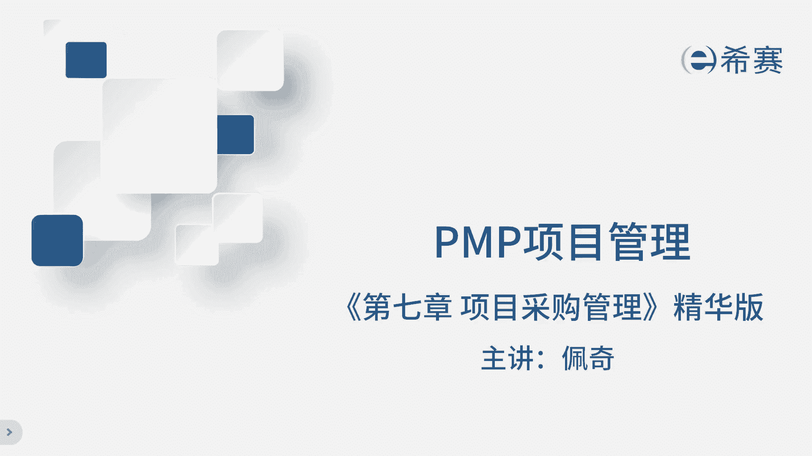
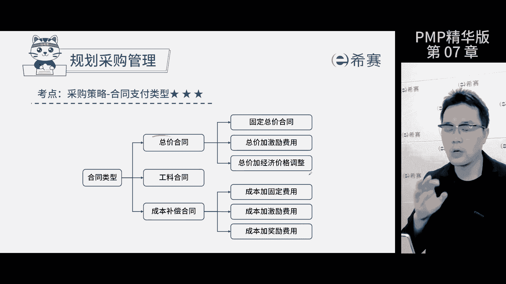
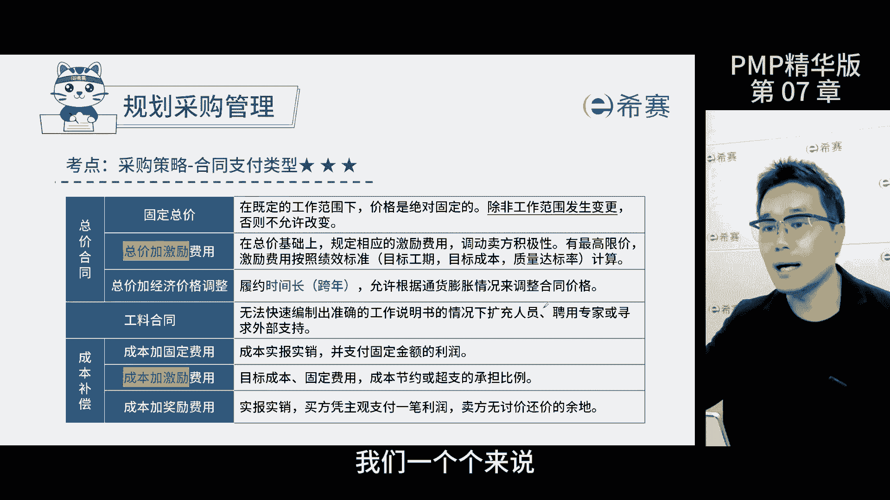
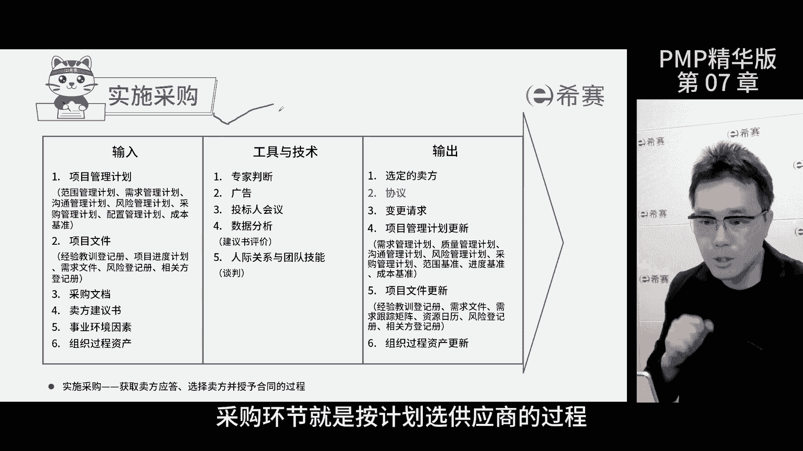
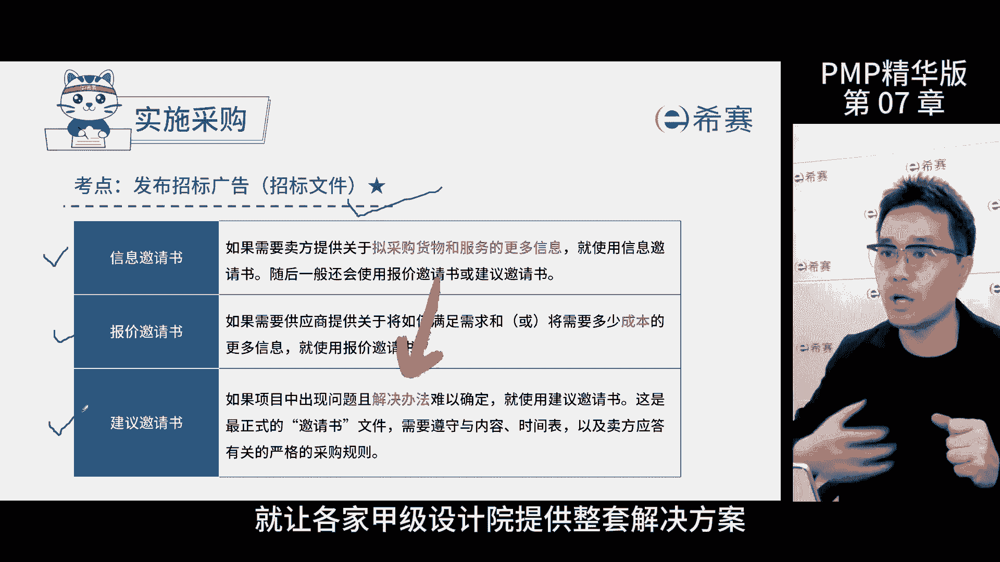
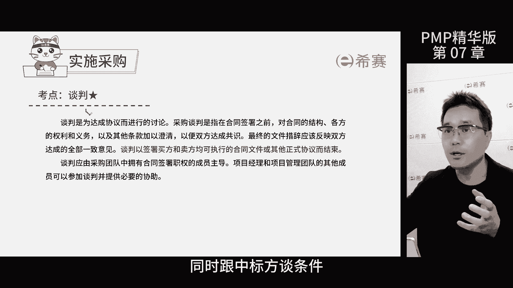
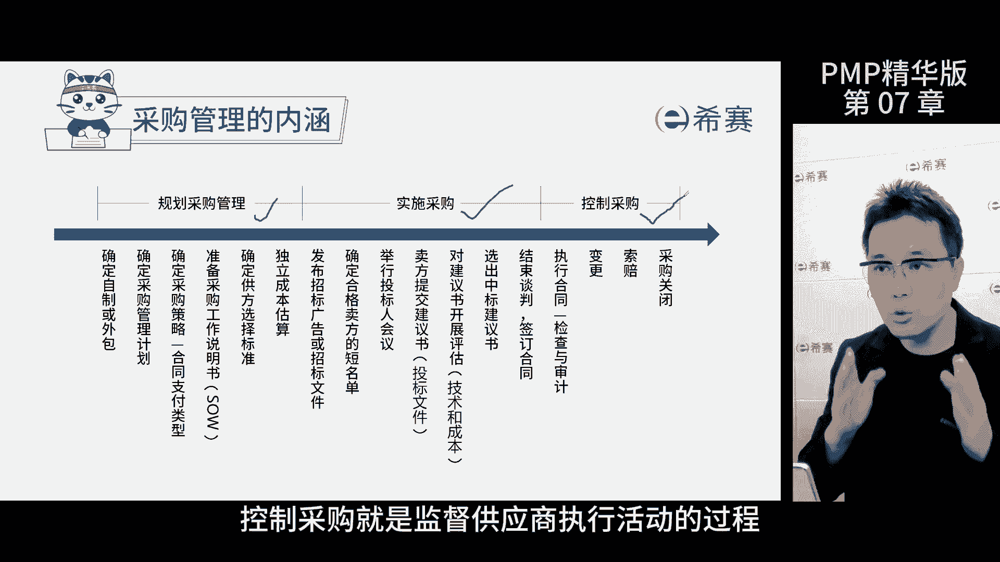
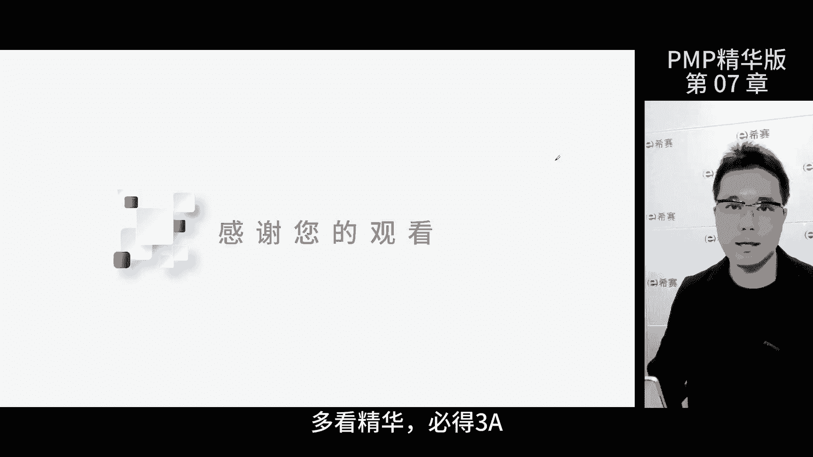

# 强！pmp高效备考，136分钟快速通关PMP项目管理考试精华版课程 - P11：第07-2章 项目采购管理 精华版 - 不爱哭的美少女 - BV1US411P71U

我是佩奇，今天讲解项目采购管理进化版，那这个目录是按照考评高低排列的，大家可以暂停一分钟，回忆一下，再继续，采购管理的过程呢，是记录下来采购的方法和决策，标红的是重点内容，首先要了解合同采购的几种类型。

一共分三大种，总价合同和成本补偿合同又各分为三小种。

那接下来我们一个来讲啊。

首先固定总价是确定工作范围之后，谈好一个价格打死不变，除非范围变了，比如说一个自动驾驶的开发系统，价格定在100万范围不变，价格不变，总价加激励费用，除了总价，还有一部分费用作为激励。

但是要按照标准发放，那还是那个自动驾驶的系统项目，100万，激励上限30万，原计划六个月完成，现在五个月完成了，那么30万都给你，如果是七个月才完成的，那就对不起了，罚款15万。

还有一种呢是总价加经济价格调整，一般针对跨年的项目，比如说跨海大桥3年工期，可以根据商定调整部分价格，因为人员材料等价格会变化，那规定一个计算公式，约定好在某个权威的商业数据网站上，获得实时的价格信息。

然后是工料合同，按照单位时间，工作量需要的费用乘以最终使用的数量来计算，在偏僻考试中，主要用在劳务人员合同中，只要题干告诉我们是着急找人，工作范围不确定，就选工料合同，再来是成本补偿合同。

成本加固定费用，成本划销合法合规，部分实报实销，同时给你一部分固定的金额作为利润，比如说自动驾驶系统的项目实际成本是50万，再给你30万作为利润，还有一种呢是成本加激励费用的合同，还是成本，实报实销。

确定一部分固定的费用作为利润，但是要按照绩效规定一个分担比例，还是那个项目成本目标为50万，激励的固定费用是30万，如果实际成本是40万，节约了10万，按照合同节约部分，四六开。

乙方最终费用是40+30加六共76万，利润是36万，如果实际成本为70万，超支了20万，那合同规定超支部分五五开，乙方最终费用是70，加30-10万=900000，利润为20万，最后是成本加奖励费用。

实报实销，买方根据绩效主观愿意给你多少就给你多少，你没有申诉的权利，比如说那个项目成本50万，买方主观判断你也瞎忙活了五个月了，给你1万块钱买件新衣服吧，总结一下，根据工作范围和项目风险。

我们可以快速的判断合同类型，那做题就能够我们秒选了，自制还是外购，就是外包的意思，那首先得搞清楚这个项目是自家团队搞定，还是交给外人来做，分析的时候要考虑各种因素，比如说资源充足与否，人员技能是否允许。

还有就是财务情况，考试的时候呢，得通过这个工具来分析后才能做出决定，独立成本估算就是大家常说的标底，作为供应商投标报价的参考依据，如果报价差距太大或者太低了，那很有可能有问题，要小心对待，对于考试来说。

只要知道独立成本估算的作用，是帮我们确定报价合理性的，就可以，采购工作说明书，这是买方对要采购的商品的文字和图形的描述，方便供应商判断有没有兴趣和能力来提供，采购工作说明书，是招标文件的输入。

包含了产品的详细信息，工作大纲和采购工作说明书呢差不多啊，但主要是针对于服务类的采购，采购管理计划，这是项目采购活动的指南，团队成员如果不知道怎么采购的时候，可以查阅计划里有具体的采购要求，时间安排。

采购人员的决策和职责，考试的时候，如果对于采购过程不清楚或出错了，那就需要选采购管理计划，供应商的挑选标准，就是设定一个挑选供应商的门槛，比如得有相关的经验，那具备对应的资质和专业能力等等。

那目的就是在评标时，选出能够满足需求的供应商，实施采购环节，就是按照计划选择供应商的过程。

那首先要发布招标文件，让可能的供应商看到并参与到投标过程中，投标文件有三种信息，邀请书是用来获取产品或者服务详细数据的，比如说买家想建立一个私有云的服务中心，但具体的软硬件参数不清楚。

就需要供应商提供相应的信息了，报价邀请书是以成本为主的，招标文件，货比三家，建议邀请书呢则是针对买家，需要提出整体的解决方案，比如说我有一块100万平方的地要开发成园区，但是园区怎么建还没想好。

那就要甲级设计院提供整套的解决方案。

招标文件确定好后，公开潜在的供应商就开始准备投标了，在开标前，投标方要开一个投标人会议，对于招标文件不清楚或者有问题的地方，进行澄清，确保所有的投标人都理解一致，考试题干说供应商有疑问。

那就选择投标人会议了，答疑结束之后，下一步是招标活动，找一群专家来评标啊，然后选出中标的公司，接着有七天的公示期，同时这个时候要跟中标方谈一些更细节的条件。

把双方的需求意愿都搞得更清楚一点，谈完之后就是签合同，把所有的细节都写到合同里面去，包括验收标准和对未来争议的处理办法，控制采购要注意绩效，就是检查采购过程中有没有偏差，这主要靠工具和技术。

甲方要审查乙方的合同工作，看是否达标了，检查是看结果，审计是看过程，考这个的时候呢，看看题干说的过程还是结果就可以了，每年都会有一两道题考索赔管理，比如给的钱少了，但是活干多了，双方意见不一致。

这就叫索赔，索赔的处理流程是按照合同来，不行的话，按照替代争议解决方法处理，考这个的时候要按照流程来，首选谈判，不行再找第三方再不行，是中裁，最后是诉讼，那合同里面有不可抗力导致的情况。

那就不算责任了啊，不用索赔，最后讲一下三个子过程的区别，规划财务管理是定计划，定要求，实施采购是执行发招标文件，评标，确定中标的过程，控制采购是监督供应商执行活动的过程。

那今天的课到此结束。

