# 强！pmp高效备考，136分钟快速通关PMP项目管理考试精华版课程 - P12：第08章 项目风险管理 精华版 - 不爱哭的美少女 - BV1US411P71U

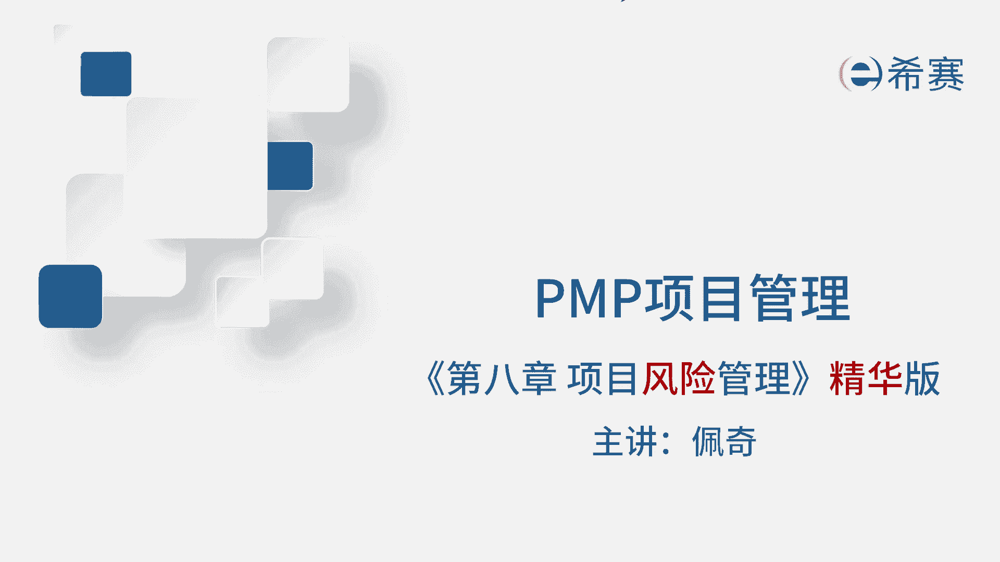

我是佩奇，今天讲解项目风险管理进化版，考评目录有一部分啊，比如说德尔菲头脑风暴访谈和储备分析，那这些在前面的课程里面已经详细的讲过了。

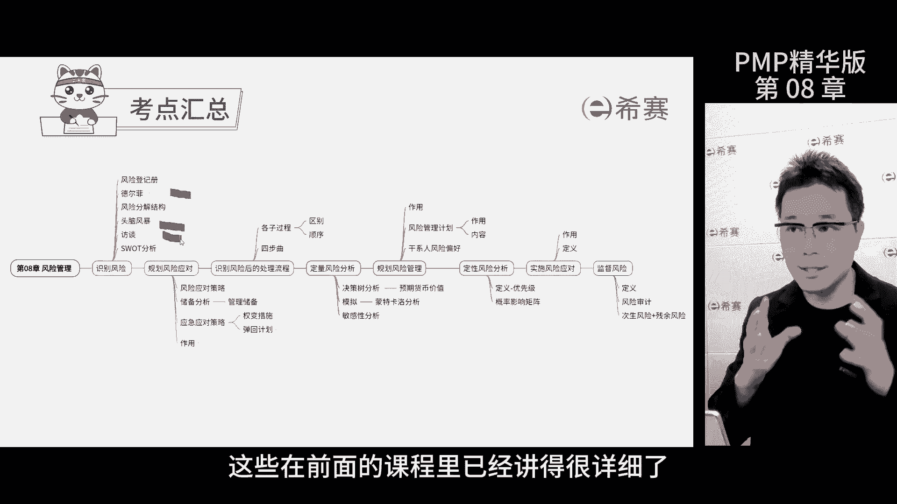

今天就不重复了，那相信大家看了之前的精华版，已经掌握了，风险鉴定测是识别风险过程，当输出文件是必考内容，它是把项目里面的所有已知风险的信息，都记录下来的文件，还描述了这些风险对于项目目标的影响程度。

这个质点怎么考呢，只要识别了新的风险，就要先记录下来。

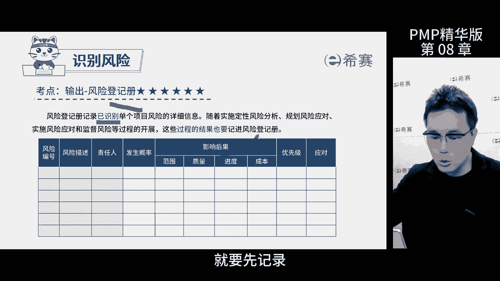

选分险电竞册就可以了，还有一点要记住，就是风险分解结构，结合之前讲的工作分解结构，组织分险结构和资源分析结构，一起理解和记忆风险，风险结构就是把风险分类，比如说用这几种方式进行分解。

就能避免在识别风险时漏掉什么，关键是掌握风险是按照分类划分的这个特点。

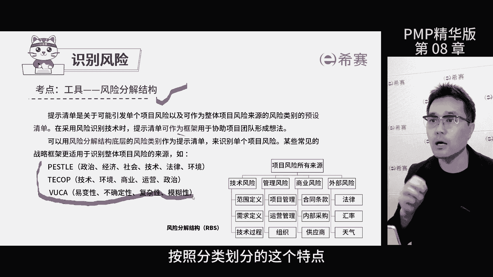

再说一下sword分析，这是分析项目的优势劣势，机会威胁的一个框架，在PMP考试中只出现过，这一次，它是用来识别风险的工具，考试的时候问你识别风险的工具有哪些，直接选这个就可以了。

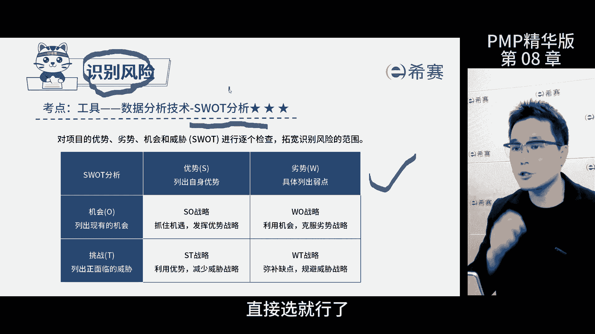

规划风险应对是项目规划过程中一个重要环节，主要负责为项目的风险制定应对策略，这个过程主要考察几种应对策略的选择。

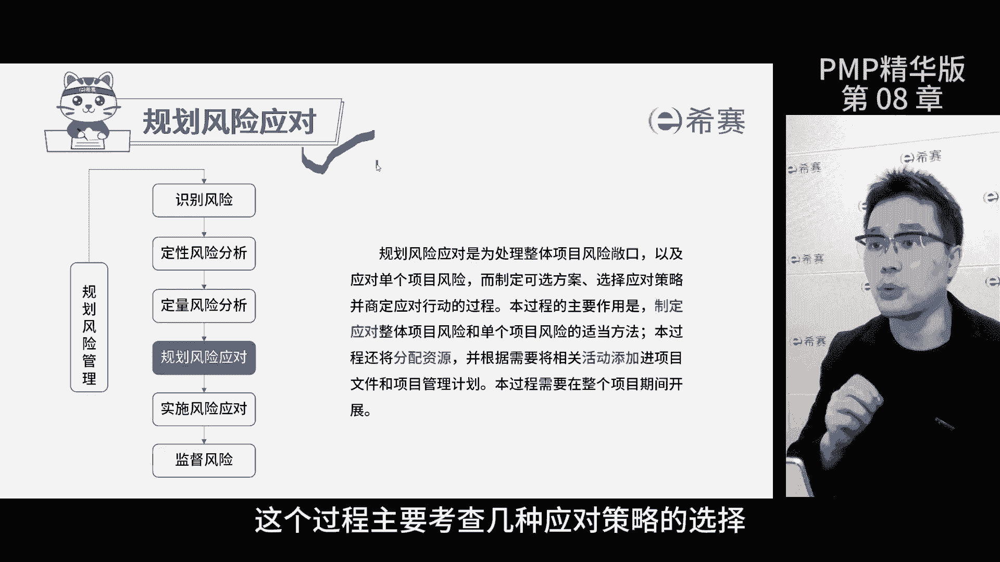

风险分为威胁和机会两种，那各有五种应对策略，选上报呢只有两种情况，一是超出了项目范围，二是超出了项目经理的权限，那其他情况不要选上报，别去麻烦领导，否则一定会丢分的，规避就是避开威胁。

不让其影响到项目开拓，则是全力以赴的抓住机会，那考试的时候，如果题干中出现了确保两个字，那代表百分之百的意思，那就是往这个方面去回答就可以了，转移就是把威胁转嫁给第三方。

比如说买保险就是转移了工伤风险机会，则可以把风险分享给第三方，比如说投标的时候的联合体，那记住哈，威胁和风险的用词是不同的，别弄混了，减轻和提高则是针对于威胁和机会，概率和影响程度进行改变。

接受就是不管是威胁还是机会，都是自己承担了应急应对措施。

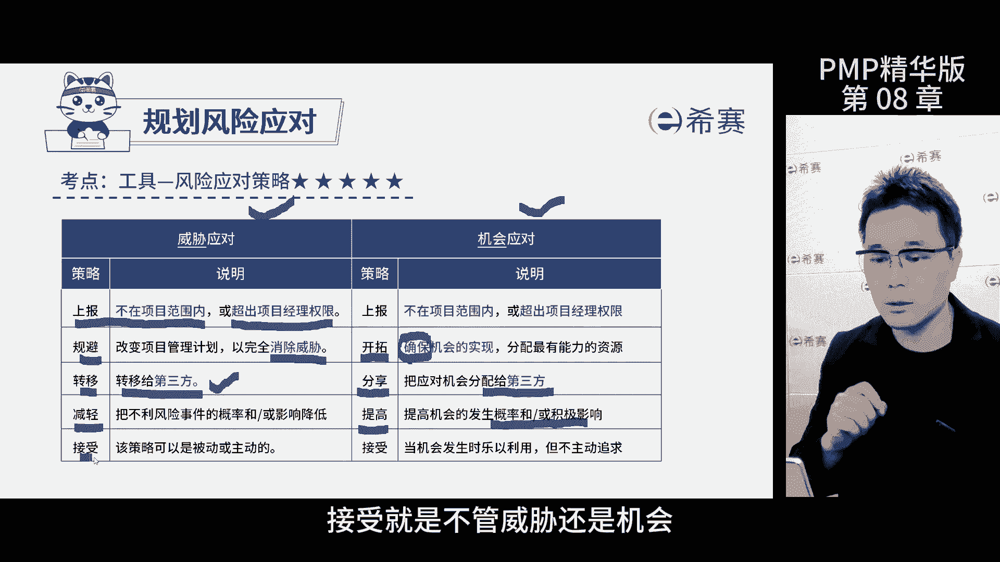

有三种，应急计划呢，是针对于已知未知风险提前准备的措施，弹回计划是针对已知未知风险的备用计划，也可以理解为应急计划无效时的计划，全面措施则是针对未知位置分权使用的策略，风险管理流程是先规划风险管理。

然后识别风险，接着定性分析，定了优先级之后做定量分析，规划风险应对措施呢是按计划执行，最后监督风险，注意哦，不是所有的风险都要做定量分析的，一般是先定性。

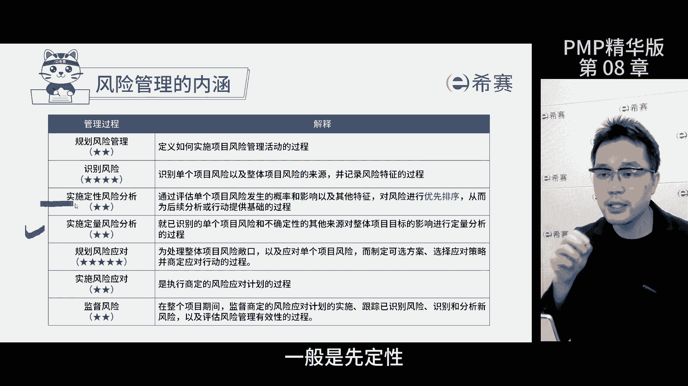

然后对于优先级高的风险进行定量分析，定量风险分析的工具和技术，一是决策树，两种方案，不知道怎么选了，那就通过预期货币价值来判断，比如两个方案，一个是新建厂房，一个是改造老厂。

那通过决策树计算出预期货币价值，选价值大的考试的时候呢，就是给你概率和盈利的情况，让你选最优方案，那自己算一遍就行了，第二个模拟工具叫做蒙特卡洛分析，用来确定项目成功的概率。

比如说公司给你了240万完成项目，你担心不行啊，就模拟分析一下，发现成功概率只有45%，那还需要老板追加20万，这考的是概念，就是确定项目不确定性带来的影响，第三个敏感性分析。

就是按照风险影响程度的数据来排序，画出龙卷风图，关注影响大的风险规划，风险管理就是制定风险管理计划，确保风险管理的规则和方法，考的时候呢，题干说有风险团队不知道咋办，问你应该怎么做。

就要审查风险管理计划，找方法和原则，风险偏好决定了应对策略，风险追逐者选接受中立者，不采取措施，厌恶者规避风险，考的时候，题干告诉你客户风险类型，让你选择对应的措施，定性风险分析就是要对风险排序。

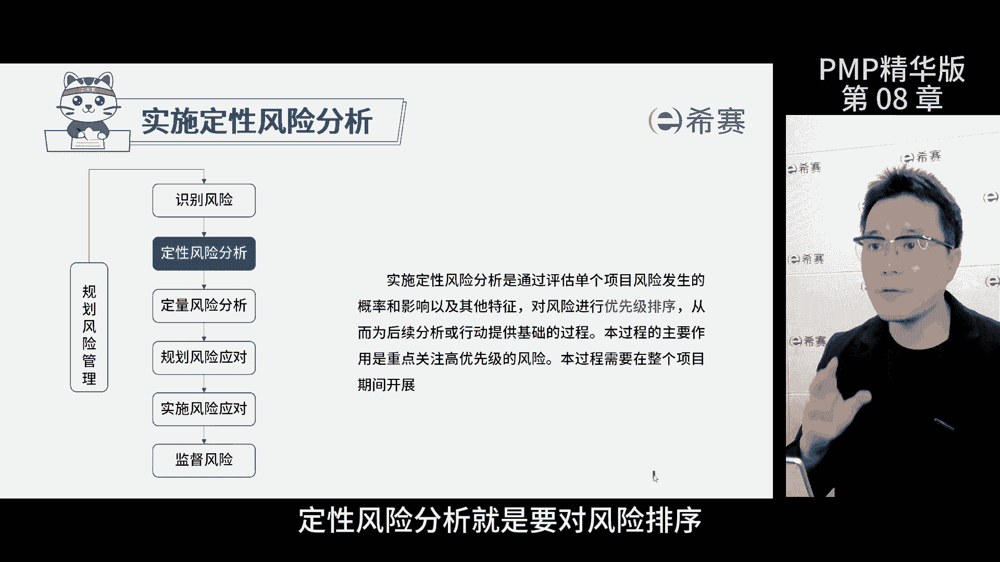

风险概率和影响矩阵就是排序的工具，高风险需要定量分析，那很低的风险呢可以选择接受，记住啊，风险概率和影响矩阵这个工具考的时候会问你，他是哪个子过程的工具和技术，虽然它有很多的数据展示。

但是它是定性风险分析的工具，不是定量分析的。

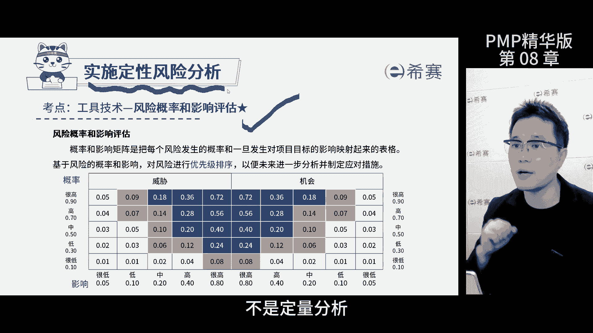

实施风险应对就是按计划执行，题干描述风险已经发生了，问你怎么办，就按风险登记册的内容执行应对措施，就可以应对风险时若有偏差，就要提交变更请求，监督风险过程，就是监督计划实施的情况和有效性。

对于本过程中发现新风险的情况，需要与识别风险过程做好区分，监督风险过程中发现新的风险是顺带发现的，识别风险过程中是主动开会去识别的，考的时候，题干中说发现了新风险，问你是哪个过程。

那就通过被动和主动来区分风险，审计主要考察是谁来，对于落实风险审计工作负责，那就是项目经理了，再来理解两个概念，一个是残余风险，一个是次身风险，残余风险是指应对风险的各种措施，执行后没解决完。

还剩下的风险，自身风险则是因为应对某个风险，而引发了新的风险，如果没有去应对这个风险，这个次身风险是不会发生的，那考试的时候会让你选择某个风险属于哪一种，那就看这个风险是不是产生了新的风险。

如果出现了新的风险，选自身风险准没错，那今天的内容到此结束。

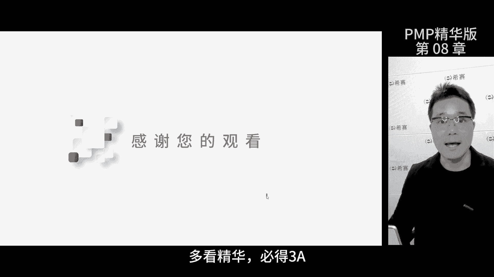